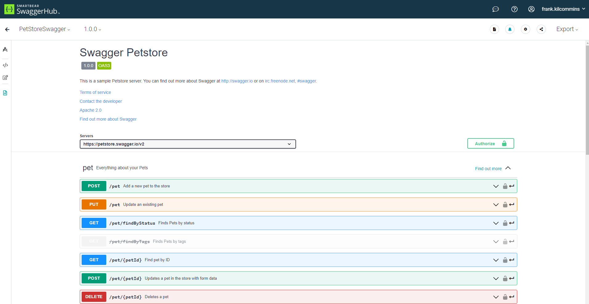

Title: DRF에서 OpenAPI(a.k.a Swagger) 3.0 활용 API 문서화
Date: 2023-12-06 21:21
Modified: 2024-12-16 16:27
Category: api
Tags: api, backend, python, django, document
Author: Isaac Park
Summary: OpenAPI 3.0, DRF


### 개요

OpenAPI 3.0(a.k.a. swagger)를 사용, API문서 작업이 조금 더 쉬워 질 수 있는 initiative를 제안합니다.

첫 셋업 후 및 learning-curve를 극복 시 아래와 같은 장점이 생긴다.

1. DRF 코드로 schema가 자동 생성된다.
    1. 추가/수정 된 코드가 자동으로 문서에 적용되어 중복작업 감소됨
    2. 문서작업을 업데이트 하지 않아 발생하는 이슈 줄어듬
2. 형상관리가 가능합니다.
git으로 문서가 관리되어 작업자, 일시, 작업범위 등 기록이 자세히 남게 됩니다.
3. 무료
postman 발생되는 비용을 절약할 수 있습니다.

### 기본

keypoints

1. swagger라이브러리로 DRF model, serializer, view, auth, url, pagination 등 소스코드를 기반으로 OpenAPI 3.0 포멧의 schema(json or yaml 파일)를 생성합니다.
2. swagger 클라이언트에 schema파일을 로드하면 웹UI로 API문서를 사용가능합니다.



swagger 예시

model이나 serializer의 필드 데이터를 기반으로 request/response 포멧이 자동 생성됩니다.

포함되는 정보는 

1. type
2. read only, write only
3. required
4. constraint(nullable, max value, regex, etc.)
5. description(help_text)
6. …


response example

request의 parameter도 url pattern으로 자동 생성되고

필요 시 수동추가 도 가능합니다.

parameter 종류는 아래와 같습니다.

1. cookie
2. path
3. query
4. header


GET example

### Extension

코드 기반 자동생성된 스키마가 부정확하거나 내용추가 필요 시 extension이 가능합니다.

필요 시 request나 response의 example을 추가 할 수 있습니다.


```jsx
STAFF_POST_EXAMPLES = [
   OpenApiExample('관리자 생성', 
                  {
                     "username": "test_admin",
                     "email": "admin@example.com",
                     "password": "password",
                     "groups" : [],
                     "user_permissions" : [],
                     "name": "admin",
                     "is_staff": True,
                     "is_superuser": True,
                     "katalk_id": "",
                     "phone_num": "",
                     "description": ""},
                  request_only=True),
   OpenApiExample('OV 계정 생성', 
                  {
                     "username": "test_staff",
                     "email": "test_staff@onvacation.life",
                     "password": "password",
                     "groups" : [globals.GROUP_OV],
                     "user_permissions" : [globals.PERMISSION_EDIT],
                     "name": "홍길동",
                     "is_staff": True,
                     "is_superuser": False,
                     "katalk_id": "",
                     "phone_num": "",
                     "description": ""},
                  request_only=True),
   OpenApiExample('파트너 계정 생성', 
                  {
                     "username": "test_staff",
                     "email": "test_staff@tourcompany.com",
                     "password": "password",
                     "groups" : [globals.GROUP_PARTNER],
                     "user_permissions" : [],
                     "name": "홍길동",
                     "is_staff": True,
                     "is_superuser": False,
                     "katalk_id": "",
                     "phone_num": "",
                     "description": ""},
                  request_only=True),
]

@extend_schema_view(post=extend_schema(
                            description=STAFF_POST_DESCRIPTION,
                            examples=STAFF_POST_EXAMPLES))
class StaffListCreateView(generics.ListCreateAPIView):
		...
```

serializer method field 같은 type 없는 필드는 decorator로 명시가 가능합니다.

```jsx
@extend_schema_field(field={'type': 'boolean'})
def get_kakao_linked(self, obj):
    if not hasattr(obj, 'client_profile'):
        return False
    return bool(obj.client_profile.kakao_id)
```

좀 더 복잡한 케이스:

아래는 serializer `to_representation` 메소드서 생성되어 스키마에 빠진 필드를 추가하는 예제입니다.

```jsx
class Fix13(OpenApiSerializerExtension):
    target_class = AirlineCardSerializer
    def map_serializer(self, auto_schema, direction):
        class Fixed(self.target_class):
            subtype = serializers.ChoiceField(choices=globals.CARD_TYPE_AIRLINE_SUBTYPE_CHOICES, required=False)
            via_direction = serializers.ChoiceField(choices=globals.AIRLINE_CARD_VIA_DIRECTION_CHOICES, required=False)
        return auto_schema._map_serializer(Fixed, direction)
```

### API Client

postman처럼 API 호출 client를 지원합니다.


### Library

python, django, django-rest-framework용 swagger 라이브러리가 몇개가 있지만

아직까지 지원이 되고 가장 많이 사용되는 라이브러리는 `drf-spectacular`가 있습니다.


### 3rd party UI

기본 제공되는 swagger-ui말고도 schema파일만 연동하면 웹 기반 문서를 만들어주는 SaaS도 존재합니다.

CI툴로 자동 연동도 가능해 문서 배포를 자동화 할 수 있습니다.

이런 SaaS는 검색 등 편의기능이 있고, UI도 괜찮습니다.

**readme**

link: [https://readme.com/documentation](https://readme.com/documentation)

**stoplight**

link: [https://stoplight.io/drive-api-results](https://stoplight.io/drive-api-results)

**Document360**

**SwaggerHub**

**Redocly**

…

ref: [https://document360.com/blog/api-documentation-tools/](https://document360.com/blog/api-documentation-tools/)

### QA환경 접근정보:

URL: [https://api-qa.memopatch.care/schema/swagger-ui/#](https://api-qa.memopatch.care/schema/swagger-ui/#)

계정: QA care/partner 로그인 정보