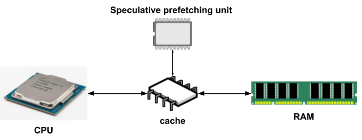

Title: Cache prefetching과 sequential processing의 장점
Date: 2024-10-07 14:56
Modified: 2024-10-11 10:45
Tags: backend, data structure, profiling, python
Author: 박이삭
Category: 기술스택
Summary: cache prefeching & sequential processing


---

## **I. 서론**

- **CPU 캐시 성능의 중요성**
    - 현대 컴퓨팅 환경에서 CPU와 메모리 간의 속도 차이로 인한 성능 병목 현상이 발생합니다.
    - CPU 캐시는 이러한 속도 격차를 줄여주는 중요한 역할을 합니다.
- **캐시 프리패칭과 순차 처리 개요**
    - **캐시 프리패칭**: 미래에 필요할 데이터를 미리 캐시에 로드하여 성능을 향상시키는 기술입니다.
        
        
        
    - **순차 처리**: 데이터 접근 패턴을 최적화하여 캐시 효율을 높이는 방법입니다.
        
        
        

---

## **II. 캐시 메모리의 기초**

- **메모리 계층 구조**
    
    
    
    - **레지스터**: CPU 내부에 위치하며 가장 빠른 속도를 가집니다.
    - **캐시 메모리**: L1, L2, L3로 구분되며, CPU와 주 메모리 사이의 속도 격차를 줄여줍니다.
    - **주 메모리(RAM)**: 대용량이지만 상대적으로 느린 속도를 가집니다.
    - **보조 저장소(SSD, HDD)**: 영구적인 데이터 저장소로 가장 느립니다.
- **캐시 메모리의 역할**
    - 자주 사용되는 데이터를 캐시에 저장하여 빠른 데이터 접근을 가능하게 합니다.
    - **공간 지역성**과 **시간 지역성**을 활용합니다.
- **캐시 미스와 성능 영향**
    
    
    
    - **캐시 히트**: 필요한 데이터가 캐시에 존재하여 빠르게 접근 가능.
    - **캐시 미스**: 캐시에 데이터가 없어 주 메모리에서 가져와야 함.
    - **미스 패널티**: 캐시 미스로 인한 지연 시간이 성능 저하를 유발합니다.

---

## **III. 캐시 프리패칭 기술**

- **캐시 프리패칭이란?**
    
    
    
    - 프로그램이 미래에 필요로 할 데이터를 미리 예측하여 캐시에 로드하는 기술입니다.
    - 캐시 미스를 줄이고 데이터 접근 지연을 최소화합니다.
- **프리패칭의 종류**
    - **하드웨어 프리패칭**
        - CPU 자체에서 프리패칭을 수행합니다.
        - 예측 알고리즘을 통해 다음에 필요한 데이터를 미리 가져옵니다.
        - 프로그래머의 개입 없이 자동으로 작동합니다.
    - **소프트웨어 프리패칭**
        - 프로그래머나 컴파일러가 명시적으로 프리패칭을 구현합니다.
        - 예를 들어, C 언어에서 `__builtin_prefetch()` 함수를 사용합니다.
        - 애플리케이션 특성에 맞게 최적화할 수 있습니다.
- **프리패칭 알고리즘**
    - **순차 프리패칭**
        - 연속된 메모리 주소에 대한 접근을 예측합니다.
        - 배열이나 리스트의 순차적인 데이터 접근 시 효과적입니다.
    - **스트라이드 프리패칭**
        
        
        
        - 일정한 간격으로 메모리에 접근하는 패턴을 예측합니다.
        - 예를 들어, 2차원 배열의 열을 순회할 때 사용됩니다.
    - **적응형 프리패칭**
        - 프로그램의 실행 패턴을 분석하여 동적으로 프리패칭 전략을 조절합니다.
        - 복잡한 접근 패턴에서도 성능을 향상시킵니다.
- **프리패칭의 이점과 과제**
    
    
    
    - **이점**
        - 캐시 미스를 줄여 전반적인 시스템 성능을 향상시킵니다.
        - CPU의 유휴 시간을 감소시킵니다.
    - **과제**
        - 잘못된 프리패칭은 불필요한 메모리 대역폭을 사용하고 캐시를 오염시킬 수 있습니다.
        - 정확한 예측이 어려운 복잡한 접근 패턴에서는 효과가 제한적입니다.

---

## **IV. 순차 처리와 그 이점**

- **순차 처리의 정의**
    - 데이터나 명령어를 메모리에 저장된 순서대로 처리하는 방법입니다.
    - **공간 지역성**을 최대한 활용하여 캐시 효율을 높입니다.
      예시) 데이터의 지속성이 있을 경우 + L1, L2 cache가 충분할 경우 huge page를 사용하여 공간 지역성을 살릴 수 있습니다.
        
      
        
- **캐시 성능 향상 방법으로서의 순차 처리**
    - 연속된 메모리 접근은 캐시 히트율을 높여줍니다.
    - 캐시 라인의 데이터를 최대한 활용하여 메모리 접근 횟수를 줄입니다.
- **파이썬에서의 순차 처리 적용 방법**
    - **리스트와 배열의 순차 접근**
        - 파이썬 리스트나 `numpy` 배열을 인덱스를 사용하여 순차적으로 접근합니다.
            <pre><code class="python">
            for i in range(len(data)):
                process(data[i])
            </code></pre>
        - 이러한 방식은 메모리 상에서 연속된 데이터에 접근하므로 캐시 효율이 높습니다.
    - **데이터 구조 선택**
        - 연속된 메모리 공간을 사용하는 데이터 구조를 선택합니다.
        - `numpy` 배열은 C 언어의 배열과 유사하게 메모리에 연속적으로 저장됩니다.
    - **메모리 정렬 및 배치**
        - 데이터의 메모리 배치를 신중하게 설계하여 캐시 미스를 줄입니다.
        - 구조체 배열보다 배열의 구조체를 사용하는 것이 메모리 접근 효율에 유리합니다.
- **순차적이지 않은 처리의 사례**
    - **연결 리스트 사용**
        - 노드들이 메모리 상에서 분산되어 있어 캐시 미스가 증가합니다.
            <pre><code class="python">
            while node is not None:
                process(node.data)
                node = node.next
            </code></pre>
        - 메모리 할당이 동적이므로 순차 접근의 이점을 누리기 어렵습니다.
    - **딕셔너리와 세트 사용**
        - 내부적으로 해시 테이블을 사용하여 메모리 접근이 비순차적입니다.
        - 큰 데이터셋의 경우 캐시 효율이 크게 떨어질 수 있습니다.
    - **임의의 인덱스 접근**
        - 리스트나 배열에서 랜덤하게 인덱스로 접근할 때입니다.
            <pre><code class="python">
            for i in random_indices:
                process(data[i])
            </code></pre>
        - 데이터가 메모리 상에 연속되어 있어도 접근 패턴이 불규칙하면 캐시 효율이 낮아집니다.
- **실제 프로그램에서의 순차 처리 효과**
    - **행렬 연산**
        
        
        
        - 행 우선 순회와 열 우선 순회에서의 성능 차이.
        - `numpy`는 기본적으로 행 우선(C-order)이므로 이에 맞게 데이터 접근.
            <pre><code class="python">
            # 열 우선 접근 (캐시 효율 낮음)
            for j in range(cols):
                for i in range(rows):
                    process(matrix[i][j])
            </code></pre>
            
        - 행 우선 접근이 캐시 히트율이 높아 성능이 향상됩니다.
    - **이미지 처리**
        
        
        
        - 픽셀 데이터를 순차적으로 처리하여 캐시 미스를 줄입니다.
        - 이미지 필터링이나 변환 작업에서 성능 개선.
    - **파일 읽기**
        - 큰 파일을 읽을 때는 버퍼를 사용하여 블록 단위로 순차적으로 읽습니다.
            <pre><code class="python">
            with open('large_file', 'rb') as f:
                while chunk := f.read(1024 * 1024):
                    process(chunk)
            </code></pre>
        - 디스크 I/O 효율과 캐시 효율을 모두 높일 수 있습니다.

---

## **V. 캐시 프리패칭과 순차 처리의 결합**

- **두 기술의 시너지 효과**
    - 순차 처리는 프리패처의 예측 정확도를 높여줍니다.
    - 캐시 프리패칭은 순차 처리에서 발생하는 캐시 미스를 더욱 줄여줍니다.
    - 두 기술을 함께 사용하면 캐시 효율을 극대화할 수 있습니다.
- **실제 응용 분야**
    - **바이너리 버퍼 연산 속도 개선**
        - **대용량 바이너리 데이터 처리**에서 중요한 역할을 합니다.
        - **순차적인 메모리 접근**을 통해 버퍼 연산의 속도를 향상시킵니다.
        - **파일 입출력(IO)**, **네트워크 패킷 처리** 등에서 성능 개선을 이끌어냅니다.
        - 예를 들어, **이미지나 비디오 데이터의 실시간 스트리밍**에서 버퍼링 효율을 높입니다.
    - **고성능 컴퓨팅(HPC)**
        - 대규모 데이터셋을 처리하는 과학 계산에서 필수적입니다.
        - 순차 처리와 프리패칭을 통해 메모리 병목을 최소화합니다.
    - **데이터 집약적 애플리케이션**
        - 머신러닝 모델의 학습 및 추론 시 데이터 로딩 효율을 높입니다.
        - 빅데이터 분석에서의 대용량 데이터 처리 속도 향상.
    - **게임 개발**
        - 실시간 렌더링과 물리 엔진에서 메모리 접근 패턴을 최적화합니다.
        - 프레임 레이트 향상과 렉 감소에 기여합니다.

---

## VI. 테스트

### **numpy로 캐시 프리패칭 효과를 보여주는 예제**

**제약 사항:**

- 파이썬 인터프리터의 오버헤드로 인해, **순수 파이썬으로 캐시 프리패칭의 효과를 명확하게 보여주기**는 어렵습니다.
- 상대적인 성능 차이를 관찰할 수 있는 간단한 예제

```python
import time
import random
import numpy as np

# 데이터 크기 설정
data_size = 10_000_000

# NumPy 배열 생성
data_array = np.arange(data_size, dtype=np.int32)

# 순차 접근 함수
def sequential_access(data):
    total = 0
    for value in data:
        total += value
    return total

# 랜덤 인덱스 생성
random_indices = np.arange(data_size)
np.random.shuffle(random_indices)

# 랜덤 접근 함수
def random_access(data, indices):
    total = 0
    for idx in indices:
        total += data[idx]
    return total

# 순차 접근 시간 측정
start_time = time.time()
sequential_access(data_array)
seq_time = time.time() - start_time
print(f"순차 접근 시간: {seq_time:.6f}초")

# 순차 접근(per element) 시간 측정
per_element_time = seq_time / data_size
print(f"순차 접근(per element) 시간: {per_element_time*1_000_000_000:.6f}ns")

# 랜덤 접근 시간 측정
start_time = time.time()
random_access(data_array, random_indices)
rand_time = time.time() - start_time
print(f"랜덤 접근 시간: {rand_time:.6f}초")

# 랜덤 접근(per element) 시간 측정
per_element_time = rand_time / data_size
print(f"랜덤 접근(per element) 시간: {per_element_time*1_000_000_000:.6f}ns")

# 성능 비교
print(f"\n랜덤 접근은 순차 접근보다 {rand_time / seq_time:.2f}배 느립니다.")

```


### 순차 검색이 정렬 및 이진 검색보다 빠른 경우를 보여주는 코드 예제

일반적으로 **이진 검색**은 **정렬된 데이터**에서 원하는 값을 빠르게 찾을 수 있는 효율적인 알고리즘입니다. 그러나 데이터가 정렬되어 있지 않은 경우, **데이터를 정렬하는 비용**이 추가됩니다. 작은 데이터셋이나 특정 상황에서는 **순차 검색(Linear Search)**이 전체적으로 더 빠를 수 있습니다.

또한, 순차 검색은 **연속된 메모리 접근**을 하므로 **캐시 프리패칭**의 이점을 누릴 수 있습니다. 반면, 이진 검색은 메모리 접근 패턴이 불규칙하여 캐시 미스가 증가할 수 있습니다.

python으로는 정확한 cache prefetching테스트가 어려워, C로 진행합니다.

```c
#include <stdio.h>
#include <stdlib.h>
#include <time.h>

// 순차 검색 함수
int sequential_search(int *data, int size, int target) {
    for (int idx = 0; idx < size; idx++) {
        if (data[idx] == target) {
            return idx;
        }
    }
    return -1;
}

// 이진 검색 함수
int binary_search(int *data, int size, int target) {
    int left = 0;
    int right = size - 1;
    while (left <= right) {
        int mid = left + (right - left) / 2;
        if (data[mid] == target) {
            return mid;
        } else if (data[mid] < target) {
            left = mid + 1;
        } else {
            right = mid - 1;
        }
    }
    return -1;
}

// 비교 함수 (qsort에 사용)
int compare_ints(const void *a, const void *b) {
    int arg1 = *(const int *)a;
    int arg2 = *(const int *)b;

    if (arg1 < arg2) return -1;
    if (arg1 > arg2) return 1;
    return 0;
}

int main() {
    int data_size = 1000000; // 백만 개의 요소
    int num_trials = 100;     // 반복 횟수 설정

    double total_seq_time = 0.0;
    double total_sort_time = 0.0;
    double total_bin_time = 0.0;

    // 난수 시드 설정
    srand((unsigned int)time(NULL));

    for (int trial = 0; trial < num_trials; trial++) {
        int *data = (int *)malloc(data_size * sizeof(int));
        if (data == NULL) {
            fprintf(stderr, "메모리 할당 실패\n");
            return 1;
        }

        // 데이터셋 생성 (랜덤 정수)
        for (int i = 0; i < data_size; i++) {
            data[i] = rand() % (data_size * 10);
        }

        // 검색할 값 설정 (데이터셋에 존재하는 값)
        int target_index = rand() % data_size;
        int target = data[target_index];

        // 순차 검색 시간 측정
        clock_t start_seq = clock();
        int index_seq = sequential_search(data, data_size, target);
        clock_t end_seq = clock();
        double time_seq = (double)(end_seq - start_seq) / CLOCKS_PER_SEC * 1000.0; // 밀리초 단위

        // 데이터 정렬 시간 측정
        clock_t start_sort = clock();
        qsort(data, data_size, sizeof(int), compare_ints);
        clock_t end_sort = clock();
        double time_sort = (double)(end_sort - start_sort) / CLOCKS_PER_SEC * 1000.0; // 밀리초 단위

        // 이진 검색 시간 측정
        clock_t start_bin = clock();
        int index_bin = binary_search(data, data_size, target);
        clock_t end_bin = clock();
        double time_bin = (double)(end_bin - start_bin) / CLOCKS_PER_SEC * 1000.0; // 밀리초 단위

        // 총 시간 누적
        total_seq_time += time_seq;
        total_sort_time += time_sort;
        total_bin_time += time_bin;

        // 메모리 해제
        free(data);
    }

    // 평균 시간 계산
    double avg_seq_time = total_seq_time / num_trials;
    double avg_sort_time = total_sort_time / num_trials;
    double avg_bin_time = total_bin_time / num_trials;
    double avg_total_bin_time = avg_sort_time + avg_bin_time;

    // 결과 출력
    printf("실행 횟수: %d회\n", num_trials);
    printf("순차 검색 평균 시간: %.6fms\n", avg_seq_time);
    printf("데이터 정렬 평균 시간: %.6fms\n", avg_sort_time);
    printf("이진 검색 평균 시간: %.6fms\n", avg_bin_time);
    printf("\n순차 검색 평균 총 시간: %.6fms\n", avg_seq_time);
    printf("정렬 + 이진 검색 평균 총 시간: %.6fms\n", avg_total_bin_time);

    if (avg_seq_time < avg_total_bin_time) {
        printf("\n순차 검색이 전체적으로 더 빠릅니다.\n");
    } else {
        printf("\n정렬 후 이진 검색이 전체적으로 더 빠릅니다.\n");
    }

    return 0;
}
```

```makefile
CC = gcc
CFLAGS = -O2 -Wall
TARGET = test

all: $(TARGET)

$(TARGET): test.c
	$(CC) $(CFLAGS) -o $(TARGET) test.c

clean:
	rm -f $(TARGET)

```

