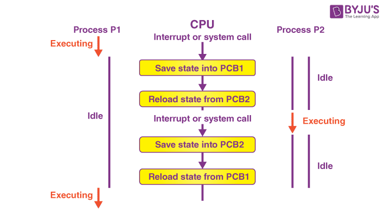

Title: Context Switch: 프로세스, 스레드 및 오버헤드 이해하기
Date: 2024-11-18 11:33
Modified: 2024-11-19 08:38
Tags: backend, performance, profiling, python
Author: 박이삭
Category: performance
Summary: Context Switch


## 소개

컴퓨팅 세계에서 효율성과 멀티태스킹은 매우 중요합니다. 현대 운영 체제는 **컨텍스트 스위칭**이라는 기본 개념 덕분에 여러 애플리케이션이 동시에 실행되는 것처럼 보이게 합니다. 이 글에서는 컨텍스트 스위칭이 무엇인지, 왜 필요한지, 그리고 CPU / OS가 이를 어떻게 관리하는지에 대해 자세히 알아보겠습니다. 또한 프로세스, 스레드 및 경량 스레드 간의 차이점을 탐구하고, 그들의 컨텍스트 스위칭 오버헤드를 비교해보겠습니다.

---

## 컨텍스트 스위칭이란 무엇이며 왜 필요한가?

### 컨텍스트 스위칭의 정의

**컨텍스트 스위칭**은 CPU가 한 프로세스나 스레드의 실행을 중단하고 다른 프로세스나 스레드로 전환하는 과정입니다. 이는 현재 실행 중인 프로세스나 스레드의 상태(컨텍스트)를 저장하여 나중에 재개할 수 있도록 하고, 다음에 실행할 프로세스나 스레드의 저장된 상태를 로드하는 것을 포함합니다.



### 컨텍스트 스위칭의 필요성

- **멀티태스킹**: CPU가 여러 작업을 시간 분할 방식으로 처리할 수 있게 해줍니다.
- **자원 공유**: 여러 애플리케이션이 CPU를 효과적으로 활용할 수 있도록 합니다.
- **응답성**: 높은 우선순위의 작업이 신속하게 CPU 시간을 받을 수 있도록 보장합니다.
- **공정성**: 단일 프로세스가 CPU를 독점하지 못하도록 합니다.

컨텍스트 스위칭이 없다면, 하나의 프로세스가 CPU 자원을 모두 소비하여 시스템이 응답하지 않거나 사용자 경험이 저하될 수 있습니다.

---

## CPU / OS가 컨텍스트 스위칭을 관리하는 방법

### CPU / OS 상태의 저장 및 복원

컨텍스트 스위칭이 발생할 때, CPU는 다음을 수행해야 합니다:

1. **현재 상태 저장**: 모든 CPU 레지스터의 값, 프로그램 카운터 및 스택 포인터를 프로세스의 제어 블록에 저장합니다.
2. **프로세스 제어 블록(PCB) 업데이트**: PCB는 프로세스를 나중에 재개하는 데 필요한 모든 정보를 보유합니다.
    
    
    
3. **다음 프로세스나 스레드 선택**: 스케줄러는 스케줄링 알고리즘에 따라 다음에 실행할 프로세스나 스레드를 결정합니다.
4. **새 상태 로드**: 선택된 프로세스나 스레드의 저장된 상태를 PCB에서 복원합니다.

### 컨텍스트 스위칭에 관련된 구성 요소

- **레지스터**: 데이터와 명령어를 저장하는 CPU 내의 작은 저장 공간.
    
    
    
    x86 registers
    
- **프로그램 카운터(PC)**: 다음에 실행할 명령어의 주소를 가리킵니다.
- **스택 포인터(SP)**: 메모리에서 현재 스택의 최상위를 가리킵니다.
- **메모리 관리 장치(MMU)**: 가상 메모리와 주소 변환을 처리합니다.
    
    
    
- **Translation Lookaside Buffer(TLB)**: MMU가 가상 주소 변환 속도를 향상시키기 위해 사용하는 캐시.
    
    
    

### 컨텍스트 스위칭 시 메모리 관리

- **스택**: 각 프로세스/스레드는 함수 호출과 지역 변수를 위한 자체 스택을 가집니다. 컨텍스트 스위칭 시 스택 포인터가 저장되고 복원됩니다.
- **힙**: 동적 메모리 할당에 사용되는 메모리. 일반적으로 컨텍스트 스위칭 동안 변경되지 않습니다.
- **메모리 세그먼테이션 및 페이징**: MMU는 활성 프로세스의 주소 공간을 반영하도록 메모리 매핑을 업데이트합니다.
    
    
    


### 인터럽트와 트랩

컨텍스트 스위칭은 종종 다음에 의해 트리거됩니다:

- **하드웨어 인터럽트**: I/O 완료와 같은 이벤트를 나타내는 하드웨어 장치로부터의 신호.
    
    
    
    x86 Interrupt Descriptor Table(IDT)
    
- **소프트웨어 인터럽트(트랩)**: 프로그램이 시스템 서비스를 요청하거나 오류를 감지할 때 생성됨.
- **타이머 인터럽트**: 스케줄러가 프로세스에 CPU 시간 슬라이스를 할당하는 데 사용.

인터럽트가 발생하면 CPU는:

1. 현재 컨텍스트를 저장합니다.
2. 인터럽트 핸들러를 실행합니다.
3. 스케줄링 정책에 따라 컨텍스트 스위칭 여부를 결정합니다.

---

## 프로세스, 스레드 및 경량 스레드

### 프로세스

- **정의**: 실행 중인 독립적인 프로그램으로, 자체 메모리 공간(코드, 데이터, 힙 및 스택 세그먼트)을 가집니다.
- **특징**:
    - **격리**: 프로세스는 서로 격리되어 있어 보안과 안정성을 높입니다.
    - **통신**: 프로세스 간 통신(IPC) 메커니즘이 필요하며, 이는 복잡할 수 있습니다.
    - **컨텍스트 스위칭 오버헤드**: MMU를 업데이트하고 메모리 공간을 전환해야 하므로 오버헤드가 높습니다.


### 스레드

- **정의**: 스케줄러에 의해 독립적으로 관리될 수 있는 가장 작은 명령어 시퀀스.
- **특징**:
    - **공유 메모리 공간**: 동일한 프로세스 내의 스레드는 코드, 데이터, 힙 세그먼트를 공유하지만 개별 스택을 가집니다.
    - **효율성**: 프로세스에 비해 컨텍스트 스위칭 오버헤드가 낮습니다.
    - **통신**: 동일한 주소 공간을 공유하므로 스레드 간 통신이 용이합니다.
    - **동기화 문제**: 데이터 경쟁과 불일치를 방지하기 위해 주의 깊은 동기화가 필요합니다.

### 경량 스레드

- **정의**: 사용자 공간에서 커널의 개입 없이 관리되는 사용자 수준 스레드(ex. Java Virtual Threads, Erlang lightweight process, Golang goroutines).


- **특징**:
    - **빠른 컨텍스트 스위칭**: 커널 모드 전환을 피하여 컨텍스트 스위칭이 빠릅니다.
    - **다수 생성 가능**: 리소스 사용량이 적어 커널 스레드보다 더 많은 경량 스레드를 생성할 수 있습니다.
    - **제한 사항**:
        - **블로킹 호출**: 블로킹 시스템 호출은 커널이 사용자 수준 스레드를 인식하지 못하므로 전체 프로세스를 블록할 수 있습니다.
        - **CPU 활용도**: 커널 수준 스케줄링 없이 멀티코어 프로세서를 완전히 활용하지 못할 수 있습니다.

---

## 컨텍스트 스위칭 오버헤드 비교

### 프로세스

- **오버헤드 요인**:
    - 메모리 주소 공간 전환.
    - TLB 플러시 및 리로드.
    - 페이지 테이블 및 MMU 업데이트.
    - 많은 상태 정보의 저장 및 복원.
- **결과**: 높은 오버헤드로 인해 컨텍스트 스위칭이 비교적 느립니다.

### 스레드

- **오버헤드 요인**:
    - CPU 레지스터와 스택 포인터의 저장 및 복원.
    - 메모리 주소 공간 전환이 필요 없음.
- **결과**: 프로세스보다 오버헤드가 낮아 컨텍스트 스위칭이 빠릅니다.

### 경량 스레드

- **오버헤드 요인**:
    - 사용자 공간에서 포인터와 레지스터를 변경하는 것만으로 컨텍스트 스위칭 가능.
    - 컨텍스트 스위칭에 커널 개입이 없음.
- **결과**: 가장 낮은 오버헤드로 매우 빠른 컨텍스트 스위칭 가능.
- **제한 사항**:
    - 커널 수준 스케줄링 없이 멀티코어 프로세서의 이점을 충분히 활용하지 못할 수 있음.

### 시각적 비교

| 항목 | 프로세스 | 스레드 | 경량 스레드 |
| --- | --- | --- | --- |
| 메모리 공간 전환 | 예 | 아니오 | 아니오 |
| 커널 개입 | 예 | 예 | 아니오 |
| 컨텍스트 스위칭 오버헤드 | 높음 | 중간 | 낮음 |
| 스케줄링 | 커널 수준 | 커널 수준 | 사용자 수준 |
| 동기화 | 복잡한 IPC | 동기화 프리미티브 | 사용자 수준 동기화 |

---

## 애플리케이션 설계를 위한 시사점

컨텍스트 스위칭 오버헤드의 차이를 이해하는 것은 효율적인 애플리케이션 설계에 중요합니다:

- **프로세스를 사용할 때**:
    - 격리와 보안이 최우선일 때.
    - 컨텍스트 스위칭 오버헤드가 큰 문제가 아닐 때.
- **스레드를 사용할 때**:
    - 작업에 공유 메모리와 빠른 통신이 필요할 때.
    - 낮은 컨텍스트 스위칭 오버헤드가 필요할 때.
    - 동기화 문제를 처리할 준비가 되어 있을 때.
- **경량 스레드를 사용할 때**:
    - 많은 수의 동시 작업이 필요할 때.
    - 커널 스케줄링 없이 사용자 공간에서 작업을 관리할 수 있을 때.
    - 블로킹 시스템 호출을 최소화하거나 논블로킹 대안을 사용할 때.

---

## 파이썬에서 컨텍스트 스위칭 최소화 방법

파이썬에서 컨텍스트 스위칭을 최소화하여 애플리케이션의 성능을 향상시킬 수 있습니다. 다음은 파이썬 개발자가 컨텍스트 스위칭을 줄이기 위해 고려할 수 있는 방법들입니다:

### 1. 비동기 프로그래밍 활용

- **GIL(Global Interpreter Lock)**: 파이썬은 GIL 때문에 한 번에 하나의 스레드만 실행할 수 있습니다.
- **`asyncio` 라이브러리**: 비동기 I/O를 처리하기 위해 설계된 라이브러리로, 코루틴과 이벤트 루프를 사용하여 컨텍스트 스위칭 오버헤드를 줄입니다.
- **코루틴 사용**: `async`와 `await` 키워드를 사용하여 비동기 함수(코루틴)를 정의하고 실행합니다.
- **예시**:

```python
import asyncio

async def fetch_data():
    # 비동기 I/O 작업 수행
    pass

async def main():
    tasks = [fetch_data() for _ in range(10)]
    await asyncio.gather(*tasks)

asyncio.run(main())

```


### 2. 멀티스레딩 대신 멀티프로세싱 사용

- **멀티프로세싱 모듈**: `multiprocessing` 모듈을 사용하여 프로세스를 생성하면 GIL의 제한을 우회할 수 있습니다.
- **CPU 바운드 작업**: CPU 집약적인 작업의 경우 멀티프로세싱이 더 나은 성능을 제공합니다.
- **프로세스 풀 사용**: 프로세스 풀을 사용하여 프로세스 생성을 관리하고 컨텍스트 스위칭 오버헤드를 줄입니다.
- **예시**:

```python
from multiprocessing import Pool

def compute():
    # CPU 집약적인 작업 수행
    pass

if __name__ == '__main__':
    with Pool(4) as p:
        p.map(compute, range(10))

```


### 3. 스레드 수 최소화 및 재사용

- **스레드 풀 사용**: `concurrent.futures.ThreadPoolExecutor`를 사용하여 스레드를 관리하고 재사용하여 스레드 생성 오버헤드를 줄입니다.
- **불필요한 스레드 생성 회피**: 필요한 최소한의 스레드만 사용하여 컨텍스트 스위칭 빈도를 낮춥니다.
- **예시**:

```python
from concurrent.futures import ThreadPoolExecutor

def task():
    # I/O 바운드 작업 수행
    pass

with ThreadPoolExecutor(max_workers=5) as executor:
    for _ in range(10):
        executor.submit(task)

```


### 4. 작업 병합 및 일괄 처리

- **작업 병합**: 여러 작은 작업을 하나로 합쳐 컨텍스트 스위칭 횟수를 줄입니다.
- **일괄 처리 기법**: 데이터 처리를 일괄적으로 수행하여 오버헤드를 최소화합니다.

### 5. 적절한 동시성 모델 선택

- **I/O 바운드 작업**: 비동기 프로그래밍(`asyncio`)이나 멀티스레딩을 사용하여 컨텍스트 스위칭 오버헤드를 줄입니다.
- **CPU 바운드 작업**: 멀티프로세싱을 사용하여 여러 CPU 코어를 활용하고 GIL의 영향을 최소화합니다.

### 6. C 확장 모듈 사용 고려

- **Cython이나 C 확장 사용**: 성능이 중요한 부분을 C나 Cython으로 작성하면 GIL의 영향을 받지 않으면서 컨텍스트 스위칭 오버헤드를 줄일 수 있습니다.
- **예시**:

```python
# cython: language_level=3
def compute():
    cdef int i
    for i in range(1000000):
        pass

```


### 7. CPU 어피니티(CPU Affinity)를 활용한 컨텍스트 스위칭 최소화


- **CPU 어피니티 설정**: 프로세스를 특정 CPU 코어에 바인딩하여 컨텍스트 스위칭 오버헤드를 줄일 수 있습니다.
- **이점**:
    - **캐시 로컬리티 향상**: 프로세스가 동일한 코어에서 실행되면 캐시 미스가 줄어듭니다.
    - **컨텍스트 스위칭 감소**: 프로세스가 코어 간에 이동하지 않아 오버헤드가 감소합니다.
- **적용 방법**:
    - **`os.sched_setaffinity` 함수 사용**: 파이썬에서 프로세스의 CPU 어피니티를 설정할 수 있습니다.
    - **예시**:

```python
import os

def compute():
    # CPU 집약적인 작업 수행
    pass

if __name__ == '__main__':
    cpu_id = 0  # 바인딩할 CPU 코어 ID
    pid = os.getpid()
    os.sched_setaffinity(pid, {cpu_id})
    compute()

```
        
- **주의 사항**:
    - **멀티프로세싱과 함께 사용**: 여러 프로세스를 생성할 때 각 프로세스에 다른 코어를 할당하여 병렬 처리를 최적화합니다.
    - **시스템 리소스 고려**: 코어 수보다 많은 프로세스를 생성하면 오히려 성능이 저하될 수 있습니다.
    - **운영 체제 지원**: CPU 어피니티 설정은 리눅스와 같은 일부 운영 체제에서만 지원될 수 있습니다.

---

## 결론

컨텍스트 스위칭은 현대 운영 체제에서 멀티태스킹을 가능하게 하는 기본 메커니즘입니다. CPU가 컨텍스트 스위칭을 어떻게 관리하는지, 그리고 프로세스, 스레드, 경량 스레드 간의 차이를 이해함으로써 개발자는 애플리케이션 성능을 최적화하기 위한 현명한 결정을 내릴 수 있습니다.

- **프로세스**는 격리를 제공하지만 컨텍스트 스위칭 오버헤드가 높습니다.
- **스레드**는 메모리 공간을 공유하며, 성능과 복잡성의 균형을 제공합니다.
- **경량 스레드**는 가장 빠른 컨텍스트 스위칭을 제공하지만 제한 사항을 관리해야 합니다.
- **파이썬에서**, 비동기 프로그래밍, 멀티프로세싱, CPU 어피니티 설정 등을 활용하여 컨텍스트 스위칭 오버헤드를 최소화할 수 있습니다.

적절한 병행성 모델을 선택하는 것은 애플리케이션의 성능 요구 사항, 리소스 제약 조건 및 관리할 복잡성에 따라 달라집니다.
