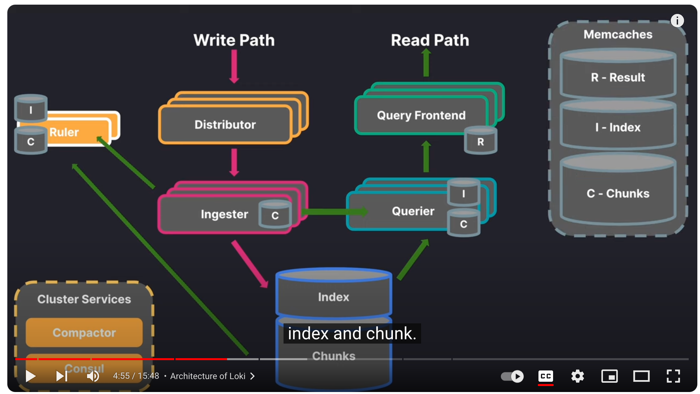
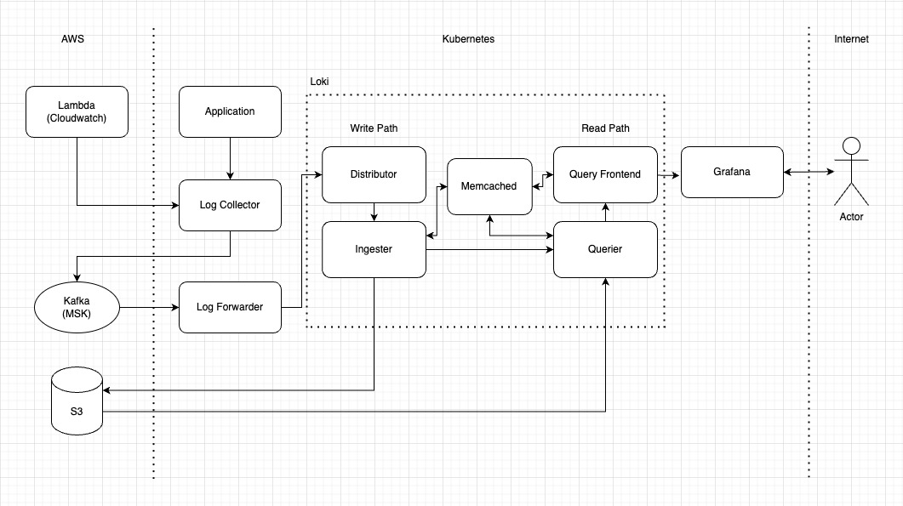

Title: Loki 소개 및 로그시스템 구축
Date: 2024-08-08 14:56
Modified: 2024-08-19 17:13
Tags: backend, infra, log
Author: 박이삭
Category: infra
Summary: Loki, log system

## Introduction

Loki라는 log system으로 로그시스템을 구축한 내용을 소개하려고 합니다.


## Loki

Loki는 Grafana Labs에서 개발한 로그 집계 시스템으로, Prometheus와 유사한 구조를 가지고 있습니다. 로그 데이터를 효율적으로 수집, 저장, 검색할 수 있으며, 특히 메타데이터 기반의 인덱싱을 통해 저장소 사용량을 최소화하는 것이 특징입니다. 
Kubernetes 환경에서도 원활하게 동작하며, 다양한 데이터 소스와 통합이 가능합니다. Loki는 로그를 텍스트 형태로 저장하며, 로그 레이블을 사용해 빠르게 검색할 수 있습니다. 이는 로그 데이터를 보다 체계적으로 관리하고 필요한 정보를 신속하게 찾을 수 있게 도와줍니다. 
주로 Grafana와 함께 사용되어 시각화와 모니터링을 용이하게 합니다. Grafana에서 Loki의 데이터를 사용하여 대시보드를 구성하면, 전체 시스템의 상태를 한눈에 파악할 수 있습니다.
또한, Loki는 클라우드 네이티브 애플리케이션 환경에 적합하며, 다양한 클라우드 서비스와 통합이 가능합니다. 예를 들어, Amazon S3, Google Cloud Storage 등과 같은 오브젝트 스토리지와도 쉽게 연동할 수 있어, 로그 데이터를 안전하고 효율적으로 저장하고 관리할 수 있습니다. 
Loki의 주요 장점 중 하나는 비용 효율성입니다. 로그 데이터를 메타데이터 기반으로 인덱싱하여 저장소 사용량을 최소화하므로, 대규모 로그 데이터를 관리하는 데 드는 비용을 절감할 수 있습니다. 
또한, Loki는 스케일 아웃 아키텍처를 지원하여, 시스템 확장이 용이합니다. 필요에 따라 노드를 추가하여 시스템 성능을 향상시킬 수 있습니다. 
마지막으로, Loki는 오픈소스 프로젝트로, 커뮤니티의 활발한 지원을 받고 있습니다. 지속적인 업데이트와 개선이 이루어지고 있어, 최신 기술을 반영한 기능을 사용할 수 있습니다. 이를 통해 사용자는 안정적이고 신뢰할 수 있는 로그 관리 시스템을 구축할 수 있습니다.



Typical Loki architecture

**장점:**

- 비용 효율성: 메타데이터 기반 인덱싱을 통해 저장소 사용량을 최소화하여 대규모 로그 데이터를 관리하는 비용 절감
- 스케일 아웃 아키텍처 지원: 필요에 따라 노드를 추가하여 시스템 성능 향상
- 클라우드 네이티브 애플리케이션 환경에 적합: 다양한 클라우드 서비스와 통합 가능, 예를 들어 Amazon S3, Google Cloud Storage 등과 연동
- Kubernetes 환경에서 원활하게 동작: 다양한 데이터 소스와 통합 가능
- 오픈소스 프로젝트: 활발한 커뮤니티 지원, 지속적인 업데이트와 개선
- Grafana와의 호환성: 시각화와 모니터링을 용이하게 하여 전체 시스템 상태를 한눈에 파악 가능

**단점:**

- 검색 성능 저하: 메타데이터 기반 인덱싱만으로는 대규모 로그 데이터에서 검색 성능이 저하될 수 있음
- 데이터 중복 문제: 로그 데이터가 중복 저장될 가능성이 있음
- 설정 복잡성: 초기 설정과 구성 과정이 복잡할 수 있으며, 사용자에게 높은 기술적 이해도가 요구됨
- 제한된 기본 기능: 일부 고급 기능은 플러그인이나 추가 도구를 통해서만 사용할 수 있음


## Architecture

구조를 구상 시 고려사항은 아래와 같습니다.

- 비용최적화 위해 ingester replica count를 1개 사용
- 로그손실 방지 및 buffering kafka event broker사용
- write path, read path를 분리되는 배포방법 사용으로 필요에 따라 양쪽 scale-in, out 지원
- bloom filter 사용으로 문자열 색인검색 지원

[my-log-system-architecture.drawio](../images/loki/memo-log-system-architecture.drawio)



### 컴포넌트

**Application, Lambda(Cloudwatch)**: 로그 생성하는 주체. gunicorn(django), nginx, aws lambda 등이 있습니다. lambda는 cloudwatch로 저장하게 되고, k8s상에서 동작하는 app는 k8s log(node fs)로 저장됩니다.

**Log collector**: fluent-bit와 fluentd로 로그를 수집합니다. fluent-bit으로 pod로그수집, fluentd로 lambda(cloudwatch)로그 수집을 합니다. 수집한 로그는 kafka로 전달됩니다. 필요에 따라 추가 정보(pod, namespace, HW정보 등)을 로그 metadata로 포함합니다.

**Kafka(MSK)**: 로그가 저장되기 전까지 buffering이 되는 기능을 제공합니다. loki나 log forwarder가 장애 발생해더라도 로그 손실을 방지할 수 있습니다. AWS mananged service사용합니다. loki ingester replica 1개 사용 대신 kafka를 사용하여 HA를 해결했습니다.

**Log Forwarder**: kafka서 로그를 consuming하는 객체입니다. log collector로 전달받은 로그와 metadata를 loki인터페이스에 맞추어 loki에 전달합니다. 

**Loki**: 로그 수집, 인덱싱, 압축, 업로드, 쿼리, 케싱, API서버 등 기능을 제공합니다. 스토리지는 S3를 사용합니다.

**S3**: 로그의 chunk와 index 등 파일들을 영구저장하는 저장소입니다. loki에서 관리합니다.

**Grafana**: Loki의 GUI역활을 합니다. loki소스 기반 alert 및 rule도 제공합니다.


## LogQL 기본 사용법

### 기본 쿼리

LogQL은 Grafana Loki에서 사용하는 쿼리 언어로, 로그 데이터를 검색하고 필터링하며, 메트릭을 생성할 수 있습니다. 
LogQL은 두 가지 주요 구성 요소로 구성됩니다: **로그 쿼리(log query)**와 **메트릭 쿼리(metric query)** 입니다. 
이 튜토리얼에서는 LogQL의 기본 사용법을 단계별로 설명하겠습니다.

### 1. LogQL 쿼리의 기본 구조

LogQL 쿼리는 기본적으로 다음과 같은 구조로 이루어져 있습니다:

```
{selector} | filter | parser | ... | metric_function
```

- **{selector}**: 로그 스트림을 선택하는 라벨 셀렉터입니다.
- **filter**: 로그 라인에서 특정 텍스트 패턴을 찾기 위한 필터입니다.
- **parser**: 로그 라인을 파싱하여 구조화된 데이터를 추출합니다.
- **metric_function**: 로그 라인에서 메트릭을 계산합니다.

### 2. 로그 쿼리

로그 쿼리는 로그 스트림을 선택하고 필터링하는 데 사용됩니다.

**라벨 셀렉터**

라벨 셀렉터는 로그 스트림을 선택하는 데 사용됩니다. 라벨 셀렉터는 중괄호 `{}` 안에 key-value 쌍으로 표현됩니다. 예를 들어:

```
{container_name="gunicorn"}
```

위의 쿼리는 `container_name` 라벨이 `gunicorn`인 로그 스트림을 선택합니다.

**필터링**

파이프 `|` 기호를 사용하여 필터를 추가할 수 있습니다. 필터는 로그 라인에서 특정 문자열을 찾는 데 사용됩니다. 예를 들어:

```
{container_name="gunicorn"} |= "error"
```

이 쿼리는 `container_name` 라벨이 `gunicorn`인 로그 스트림에서 `"error"` 문자열이 포함된 로그 라인을 필터링합니다.

**네거티브 필터**

특정 문자열이 포함되지 않은 로그 라인을 찾을 때는 `!=` 연산자를 사용합니다.

```
{container_name="gunicorn"} != "info"
```

이 쿼리는 `container_name` 라벨이 `gunicorn`인 로그 스트림에서 `"info"` 문자열이 포함되지 않은 로그 라인을 필터링합니다.

### 3. 메트릭 쿼리

메트릭 쿼리는 로그 라인에서 메트릭을 계산하는 데 사용됩니다. 메트릭을 계산하려면 `rate` 함수와 같은 함수와 함께 사용합니다.

**카운트 메트릭**

로그 라인을 카운트하여 메트릭을 생성할 수 있습니다.

```
count_over_time({container_name="gunicorn"}[5m])
```

이 쿼리는 `container_name` 라벨이 `gunicorn`인 로그 스트림에서 최근 5분 동안의 로그 라인 수를 카운트합니다.

**속도 계산**

로그 라인의 속도를 계산하려면 `rate` 함수를 사용할 수 있습니다.

```
rate({container_name="gunicorn"}[1m])
```

이 쿼리는 `container_name` 라벨이 `gunicorn`인 로그 스트림에서 매 분당 로그 라인의 생성 속도를 계산합니다.

### 4. 파싱 로그 라인

LogQL은 로그 라인을 파싱하여 구조화된 데이터를 추출할 수 있습니다. `| json` 또는 `| logfmt`와 같은 파서(parser)를 사용하여 로그 데이터를 구조화할 수 있습니다.

**JSON 파서**

```
{container_name="gunicorn"} | json
```

이 쿼리는 `container_name` 라벨이 `gunicorn`인 로그 스트림을 선택하고, 로그 라인을 JSON 형식으로 파싱하여 키-값 쌍으로 변환합니다.

**Logfmt 파서**

```
{container_name="nginx"} | logfmt
```

이 쿼리는 `container_name` 라벨이 `nginx`인 로그 스트림을 선택하고, 로그 라인을 logfmt 형식으로 파싱하여 키-값 쌍으로 변환합니다.

### 5. 정리

LogQL은 강력한 로그 분석 도구로서, 라벨 셀렉터를 사용하여 로그 스트림을 선택하고, 다양한 필터와 파서를 사용하여 로그 데이터를 분석할 수 있습니다. 
이를 통해 로그 데이터에서 유용한 인사이트를 얻고, 메트릭을 계산할 수 있습니다. 
기본적인 LogQL 사용법을 익힌 후에는 더 복잡한 쿼리를 작성하여 다양한 분석을 시도해볼 수 있습니다.
LogQL의 공식 문서와 Grafana의 예제를 통해 추가적인 기능과 고급 사용법을 탐색할 수 있습니다.

**Reference:**

- https://grafana.com/docs/loki/latest/query/
- https://sbcode.net/grafana/logql/

## Bloom filters 사용법

Bloom filters는 해시 기반의 확률적 데이터 구조로, 집합에 대한 멤버십 검사를 수행하는데 사용됩니다. 특정 값에 대한 해시값을 비트 배열(bitmask)에 기록하면서 인덱싱을 합니다.

Bloom filters는 다음과 같은 특징을 가지고 있습니다:

1. **False Negative가 없는 구조**: 특정 값이 Bloom Filter에 존재하지 않는다고 나왔을 때, 해당 값은 실제로도 집합에 존재하지 않는 것이 100% 확실합니다. 
즉, False Negative의 확률이 0%입니다.
2. **False Positive의 가능성**: 특정 값이 Bloom Filter에 존재한다고 나왔을 때, 실제로는 존재하지 않을 수도 있습니다. 이는 해시 충돌로 인해 발생하며, 
False Positive의 확률은 0보다 크고 1보다 작습니다. 이 확률은 사용된 해시 함수의 개수와 비트 배열의 크기에 따라 달라집니다.
3. **효율성**: 메모리 사용량이 적고, 매우 빠른 검색 속도를 제공합니다. 하지만 원소의 삭제가 어렵다는 단점이 있습니다.

해시 충돌로 인해 동일한 해시 인덱스가 여러 번 사용될 수 있지만, 특정 값이 해시된 인덱스에서 비트가 모두 1로 설정되어 있다면 그 값은 집합에 존재할 수도 있고, 아닐 수도 있습니다. 
그러나, 만약 해시된 인덱스 중 하나라도 0이라면 해당 값은 집합에 존재하지 않는 것이 확실합니다.


이런 특징으로 인해 log 문자열 색인에 활용되고 있습니다. Loki는 log message를 n-gram으로 나누어 token을 hash값으로 bloom filters를 사용하고 있습니다.

아래 처럼 검색 시 특정 문자열이 포함 되지 않는 로그 chunk를 빨리 구분할 수 있어 S3(혹은 cache) 검색을 줄이게 됩니다.

아래 쿼리는 bloom filters 인덱스로 검색하기 때문에 빠른 반응속도를 확인 할 수 있습니다.

문자열 필터링을 쿼리 가장 앞에서 사용 시 bloom filters가 활용됩니다. 예시:

```python
{cluster="prod"} | traceID="3c0e3dcd33e7"
```

**Reference:**

- https://grafana.com/blog/2024/04/09/grafana-loki-3.0-release-all-the-new-features/
