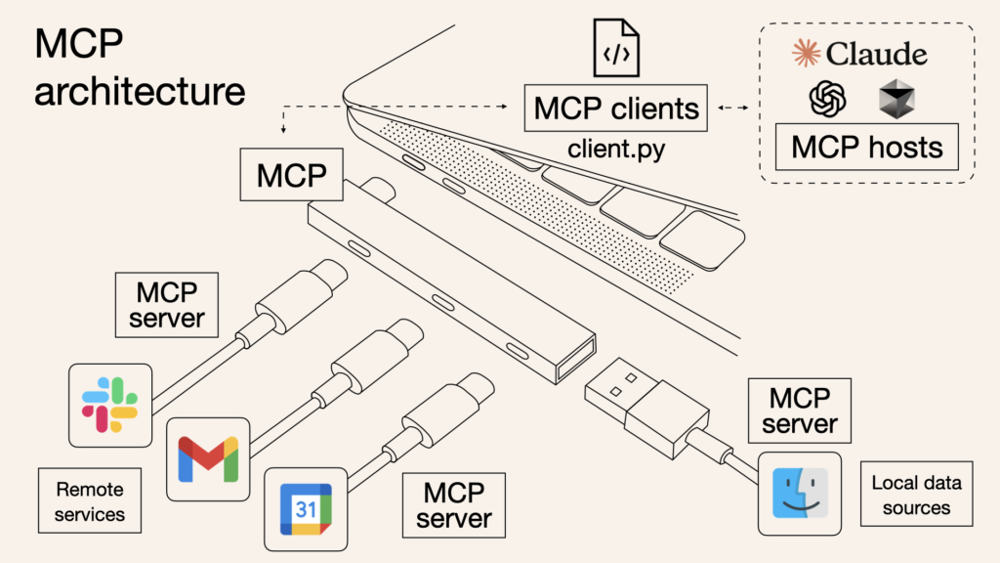
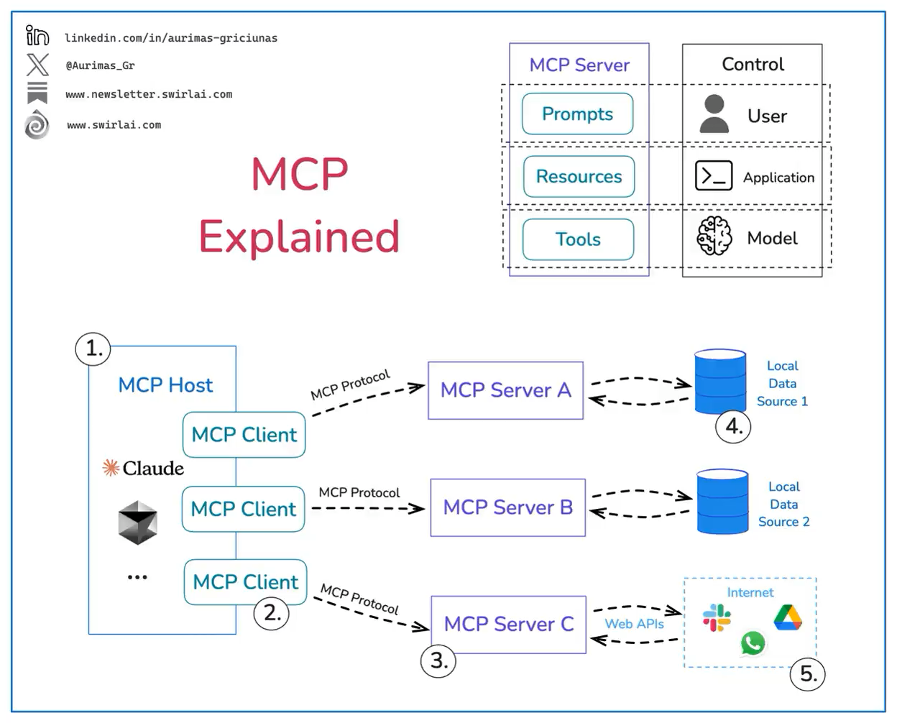

Title: Model Context Protocol(MCP) 소개: 개념, 기술 구조와 활용 사례
Date: 2025-03-24 14:47
Modified: 2025-03-24 15:01
Tags: backend, llm
Author: 박이삭
Category: ai
Summary: Introduction to MCP


최근 AI 개발자들 사이에서 **MCP(Model Context Protocol)**가 큰 주목을 받고 있습니다. 2024년 11월 말 앤트로픽(Anthropic)이 이 MCP를 오픈소스로 공개한 이후 처음에는 조용했지만, 점차 개발자 커뮤니티와 소셜 미디어에서 화제가 되었죠. 왜일까요? AI 모델이 단순히 질문에 답하는 것을 넘어, 실제 업무에 필요한 외부 데이터에 직접 접근하고 활용하는 새로운 가능성을 열었기 때문입니다. 이번 글에서는 MCP의 개념과 등장 배경, 기술적 구조와 동작 방식, 실제 및 잠재적 활용 사례, 그리고 최근 특히 각광받는 이유를 살펴보겠습니다.

## **MCP란 무엇이며 왜 등장했나?**

**MCP(Model Context Protocol)**는 **대형 언어 모델(LLM)**이 다양한 외부 데이터 소스 및 도구와 **표준화된 방식으로 연결**될 수 있도록 고안된 개방형 프로토콜입니다. 쉽게 말해, MCP는 **AI용 “USB-C 포트”**와 같습니다. 여러 기기를 하나의 포트로 연결하듯이, MCP를 통해 서로 다른 AI 모델과 데이터 소스를 단일한 인터페이스로 연결할 수 있습니다. 아래 그림은 MCP의 이런 **“범용 커넥터”**로서의 역할을 보여줍니다.



*MCP 아키텍처 개념도: MCP를 USB-C 허브에 비유한 그림입니다. 우측 상단의 Claude 등 **MCP 호스트**(AI 앱)가 MCP 클라이언트를 통해 좌측 하단의 Slack, Gmail, 파일 시스템 등의 **MCP 서버**(데이터 소스 서비스)에 연결되어 컨텍스트를 주고받는 모습입니다. MCP가 일종의 허브/포트 역할을 하여 AI와 여러 외부 시스템을 **한 번에 호환**시키는 구조임을 보여줍니다.*

### **등장 배경: 단절된 정보와 M×N 문제**

오늘날 AI 모델은 뛰어난 능력을 갖췄지만, **필요한 데이터에 직접 접근하기 어려워** 제한된 환경에 갇혀 있었습니다. 새로운 데이터 소스마다 별도의 커넥터를 그때그때 개발해야 했고, 각 벤더나 애플리케이션마다 **제각기 다른 방식의 통합**을 만들어내다 보니 호환성과 확장성이 떨어졌습니다. 이처럼 **M개의 AI 애플리케이션**과 **N개의 데이터 소스/도구**를 모두 연결하려면 M×N에 비례하는 통합 작업이 필요해지는 문제가 있었는데, 과거 개발 도구 분야에서 언급되던 **“M×N 문제”**와 유사한 상황이었습니다. 예컨대 어떤 AI 앱은 특정 데이터베이스에 강하게 연동되지만 다른 데이터에는 약하거나, 각 앱이 비슷한 기능을 서로 호환되지 않게 따로 구현하는 등의 **파편화된 생태계**가 형성되고 있었죠.

앤트로픽의 MCP는 바로 이 문제를 해결하기 위해 나왔습니다. **Language Server Protocol(LSP)**이 과거 에디터와 프로그래밍 언어의 통합 문제를 표준화로 풀었던 것처럼, **MCP도 AI 애플리케이션과 외부 도구들의 연결을 표준화하여 M×N 문제를 M+N 문제로 단순화**합니다. 이제 각 AI 애플리케이션은 MCP 한 가지만 구현하면 되고, 각 도구/데이터 소스도 MCP 서버로 구현되기만 하면 됩니다. 그 결과 **한 번 구현으로 모두 호환**되는 보다 **지속가능한 생태계**가 만들어집니다. 앤트로픽 발표에서는 “단절된 정보 섬을 연결하고, 개별 통합에 들이던 노력을 하나의 프로토콜로 대체한다”라고 MCP의 목표를 설명합니다. 요컨대 **MCP는 AI와 데이터 사이의 연결을 획기적으로 단순화**하는 공통 인터페이스인 것입니다.

### **MCP의 정의와 목적**

정리하면, MCP는 **AI 모델과 외부 세계를 잇는 범용 연결 프로토콜**입니다. 이 프로토콜을 통해 AI 모델(예: 챗봇, 코딩 도우미 등)은 파일 시스템, 데이터베이스, API, 사내 문서, 업무 툴 등 **다양한 출처의 데이터에 안전하게 접근**하고 상호작용할 수 있습니다. 기존에도 API 호출이나 플러그인 등으로 비슷한 통합을 했지만, MCP는 이를 더 **표준적이고 유연한 방식으로 추상화**했습니다. 예를 들어 **“지금 뉴욕의 날씨 알려줘”**라는 질문에, 과거에는 AI가 미리 학습된 지식만으로 답하거나 개발자가 날씨 API를 호출하도록 프로그래밍해야 했습니다. 하지만 MCP를 활용하면, AI가 **실시간으로 외부의 날씨 서비스에 질의**하여 최신 정보를 가져와 답변할 수 있습니다. 또 **“이 대화를 내 구글드라이브에 저장해줘”**처럼 **AI가 외부 프로그램을 직접 실행**하거나 **파일을 불러오는** 식의 양방향 작업도 표준화된 방식으로 수행될 수 있습니다. 이처럼 MCP는 **LLM의 한계를 넓혀주는 컨텍스트 확장 슈퍼파워**라고 할 수 있습니다.

---

## **MCP의 기술 구조와 동작 방식**

그렇다면 MCP는 어떻게 이러한 기능을 구현할까요? 기술적으로 MCP는 **클라이언트-서버 아키텍처**를 따릅니다. 전반적인 그림은 다음과 같습니다:

- **호스트(Host)**: MCP를 사용하는 **AI 애플리케이션**입니다. 예를 들어 Claude Desktop 애플리케이션이나 IDE의 AI 비서 등이 호스트가 됩니다. 호스트는 AI 모델과 사용자 인터페이스를 가지고 있으면서, 외부 MCP 서버들과 연결을 맺어 데이터를 주고받는 주체입니다.
- **클라이언트(Client)**: 호스트 내에서 동작하는 **MCP 프로토콜 클라이언트**입니다. 이는 호스트와 각 MCP 서버 사이에 **1:1 연결**을 담당하는 모듈입니다. 호스트 입장에서는 여러 서버에 붙을 수 있으므로, 각각에 대해 클라이언트 인스턴스가 생긴다고 볼 수 있습니다.
- **서버(Server)**: **외부 데이터 소스나 기능을 노출하는 MCP 서버**입니다. 예를 들어 파일 시스템에 접근하는 서버, 데이터베이스 조회 서버, Slack 같은 서비스 연결 서버, 또는 커스텀 비즈니스 로직을 수행하는 서버 등을 만들 수 있습니다. 각 MCP 서버는 **표준화된 MCP 인터페이스를 통해 자신의 데이터나 기능(capabilities)을 제공**합니다.



이 구조에서 호스트(예: Claude AI)는 내부적으로 MCP 클라이언트를 통해 하나 이상의 서버에 연결되고, 각 서버는 **자신이 가진 데이터/도구를 제공**하여 AI 모델이 활용할 수 있게 합니다. MCP 통신은 **JSON-RPC 2.0** 규격으로 인코딩된 메시지를 사용하며, 클라이언트와 서버 간에 **표준 입출력(stdin/stdout)**이나 **HTTP(S) 연결(SSE 방식)** 등을 통해 주고받을 수 있습니다. 이는 마치 Language Server Protocol이 에디터와 언어 서버 간에 JSON-RPC로 통신하는 것과 비슷합니다.

### **MCP 프로토콜의 프리미티브 개념**

MCP는 **몇 가지 핵심 개념(프리미티브, primitives)**으로 기능을 구조화합니다. **서버 측**에는 세 가지 프리미티브가 있고, **클라이언트 측**에는 두 가지 프리미티브가 있습니다 :

- **프롬프트(Prompt)**: **AI 모델에게 주어질 프롬프트 템플릿**이나 지침을 서버가 제공하는 기능입니다. 예를 들어 코드 리뷰 봇이라면 “이 프로젝트의 코딩 컨벤션을 설명하고 코드에 적용하라”와 같은 템플릿을 MCP 서버가 프롬프트로 제공할 수 있습니다. 프롬프트는 결국 AI에게 주입되는 맥락을 형성하며, 잘 설계된 프롬프트는 API의 사전 정의와 비슷한 역할을 합니다.
- **리소스(Resource)**: AI 모델이 참고할 **정적 또는 동적 데이터**입니다. 파일의 내용, 데이터베이스 레코드, 문서, 이미지, 로그 등 형식에 관계없이 구조화된 데이터를 리소스로 노출할 수 있습니다. 리소스는 읽기 전용으로 **모델의 프롬프트 맥락에 포함**될 수 있는 자료들을 뜻합니다. 예를 들어, “매뉴얼 PDF 내용”이나 “최근 고객 문의 로그”를 리소스로 제공하면 모델이 답변을 생성할 때 근거 자료로 활용하게 할 수 있습니다.
- **도구(Tool)**: **AI 모델이 호출할 수 있는 실행 함수 또는 액션**입니다. 모델이 단순 텍스트 응답뿐 아니라 외부 연산을 수행할 수 있게 해주는 인터페이스로, 예컨대 **계산기, 웹 검색, DB 질의, 이메일 전송** 같은 기능들을 MCP Tool로 구현할 수 있습니다. 도구를 통해 LLM은 자신이 직접 못하는 작업을 외부 시스템에 위임하고 그 결과를 받아볼 수 있습니다.
- **루트(Root)**: (클라이언트 측) **서버가 접근할 수 있는 파일시스템 등의 루트 경로**를 의미합니다. 예를 들어 호스트 애플리케이션이 /project 폴더를 한 루트로 공유하면, 서버는 그 하위에 존재하는 파일들을 리소스로 노출하는 식입니다. 즉 루트는 **클라이언트(호스트) 측 자원에 대한 엔트리 포인트**를 서버에 알려주는 개념입니다.
- **샘플링(Sampling)**: (클라이언트 측) **서버가 반대로 클라이언트의 LLM에게 프롬프트를 던져 답을 얻어오는 작업**을 지칭합니다. 일반적인 상황과 반대로, MCP 서버 쪽에서 추가적인 LLM 응답 생성이 필요할 때 클라이언트에 요청을 보내는 기능입니다. 이를 활용하면 **에이전트**가 어떤 작업 중에 **다시 모델에게 질문을 던져 연속적인 추론을 진행**하는 등의 (이른바 self-ask) 동작도 가능해집니다. 다만 Anthropic 측은 이러한 샘플링 기능을 남용하면 **모델이 자체적으로 루프에 빠질 위험**이 있으므로, **반드시 인간 승인을 거치게 하는 등** 안전장치를 둘 것을 권고하고 있습니다.

**요약:** MCP 서버는 **프롬프트**, **리소스**, **도구**라는 세 가지 타입의 기능을 제공하고, MCP 클라이언트(호스트)는 **루트**와 **샘플링**이라는 기능을 제공합니다. 이러한 프리미티브들은 궁극적으로 모두 **LLM의 컨텍스트 창을 채우는 역할**을 하지만, 의도에 따라 구분되어 있습니다. (예: 단순 참고자료는 리소스, API 호출은 도구, 등)

### **컨텍스트 데이터의 표현과 참조 방식**

MCP에서 주고받는 데이터는 **JSON-RPC 메시지**들로 캡슐화되어 있습니다. 예를 들어 서버가 갖고 있는 리소스 목록을 보내거나, 클라이언트가 특정 도구를 호출해달라는 요청을 할 때, 모두 JSON 형태의 요청/응답이 오갑니다. 각 메시지에는 "jsonrpc": "2.0", 메소드 이름("method":...), 필요한 파라미터("params":...), 그리고 응답 시 결과나 에러 등이 명시됩니다.

특히 **리소스(Resource)**는 MCP에서 **컨텍스트 데이터**를 다루는 기본 단위인데, 각 리소스는 **고유한 URI**로 식별됩니다. 예를 들어 파일 리소스는 file:// 스키마로 경로를 표시하고, 데이터베이스 항목은 postgres://나 db:// 같은 커스텀 스키마를 사용할 수 있습니다. 리소스 URI는 그 자원의 위치나 종류를 나타내며, 실제 내용은 **텍스트** 또는 **바이너리(blob)** 형태로 제공됩니다. 클라이언트(호스트 애플리케이션)는 제공된 리소스 URI들을 보고 어떤 것을 모델에게 맥락으로 넣을지 **선택하거나 자동 선택**할 수 있습니다. 예컨대 Claude Desktop에서는 사용자가 UI에서 리소스를 선택해야 모델이 해당 내용을 읽게 하고, 향후 일부 클라이언트는 **휴리스틱**이나 **AI 자체 판단**으로 리소스를 자동 선택하게 할 수도 있다고 합니다. 리소스 사용 방식은 이렇게 **클라이언트 앱에서 제어**되며, 이는 모델이 맥락으로 참고할 수 있는 자료를 투명하게 관리하기 위함입니다.

한편 **도구(Tool)**의 실행 결과도 특별한 방식으로 전달됩니다. 도구는 함수 호출이므로 반환값이 있을 텐데, MCP 서버는 이를 곧바로 모델 답변에 섞는 게 아니라 **content 필드**를 통해 **모델에게만 전달되는 숨겨진 응답**으로 보냅니다. 예를 들어 get_weather라는 도구를 호출한 결과(현재 날씨 정보 JSON)는 사용자에게 바로 노출되기보다 모델만 참고하도록 audience: ["assistant"]이라는 **주석(annotations)**과 함께 컨텍스트로 제공됩니다. 그 뒤 모델은 이 정보를 활용해 최종 사용자에게 줄 답변을 생성하게 되죠. 이를 통해 사용자에게는 자연어 답변만 보이고, 내부적으로는 MCP가 데이터를 주고받아 활용한 것이 됩니다.

### **요청/응답 예시: 날씨 정보를 가져오는 MCP 활용**

MCP의 동작을 좀 더 직관적으로 이해하기 위해, **간단한 예시 시나리오**를 살펴보겠습니다. 가령 한 AI 비서가 “현재 뉴욕의 날씨가 어떤지 알려줘”라는 질문을 받았다고 해보죠. 이 AI 비서는 날씨 API에 접근하는 MCP 서버와 연결되어 있으며, 해당 서버에는 get_weather라는 이름의 **툴(tool)**이 제공되어 있다고 가정합니다. 아래는 이 경우 MCP 클라이언트(호스트)와 MCP 서버 사이에 오가는 **JSON-RPC 메시지**의 흐름입니다:

```json
// (1) 클라이언트 → 서버 : 사용 가능한 도구 목록 요청
{
  "jsonrpc": "2.0",
  "id": 1,
  "method": "tools/list",
  "params": {}
}

// (서버 → 클라이언트 응답) : 사용 가능한 도구 목록
{
  "jsonrpc": "2.0",
  "id": 1,
  "result": {
    "tools": [
      {
        "name": "get_weather",
        "description": "Returns current weather conditions for the specified location.",
        "inputSchema": {
          "type": "object",
          "properties": {
            "latitude": { "type": "number" },
            "longitude": { "type": "number" }
          },
          "required": ["latitude", "longitude"]
        }
      }
      //...다른 툴들 목록...
    ]
  }
}

// (2) 클라이언트 → 서버 : 사용자가 get_weather 도구 사용을 승인하면, 해당 툴 호출 요청
{
  "jsonrpc": "2.0",
  "id": 2,
  "method": "tools/call",
  "params": {
    "name": "get_weather",
    "arguments": {
      "latitude": 40.7128,
      "longitude": -74.0060
    }
  }
}

// (서버 → 클라이언트 응답) : get_weather 실행 결과 (모델에게 전달될 content)
{
  "jsonrpc": "2.0",
  "id": 2,
  "content": [
    {
      "type": "text",
      "text": "{\"temperature\": 12, \"conditions\": \"cloudy\", \"humidity\": 85}",
      "annotations": {
        "audience": ["assistant"]
      }
    }
  ]
}
```

위 시나리오를 설명하면 다음과 같습니다: 먼저 클라이언트가 tools/list를 호출해 서버의 도구 목록을 받아옵니다. 이 예에서는 get_weather라는 툴이 있고, 어떤 입력을 요구하는지 (latitude, longitude) 스키마로 기술되어 있습니다. 그런 다음 AI 모델이 이 툴을 사용하고자 할 때, 사용자의 승인을 거쳐("사용해도 될까요?") tools/call 요청을 서버에 보냅니다. 서버는 내부적으로 실제 날씨 API를 호출하고, 그 결과(예: 기온 12도, 흐림)를 "content" 형태로 클라이언트에 보내줍니다. 이 "content" 데이터는 **모델만 볼 수 있는 컨텍스트**로 전달되며 , 이후 AI 모델은 이를 참고해 사용자에게 “현재 뉴욕은 기온 12도에 흐린 날씨이며, 습도는 85%입니다”와 같이 답변하게 됩니다. 사용자는 AI가 외부 정보를 활용했다는 사실을 인지하지 못할 수도 있지만, **MCP 덕분에 AI가 최신 데이터를 바탕으로 정확한 답변**을 해준 것이죠. 실제 Anthropic의 예시에서도 MCP 서버를 파이썬으로 간단히 구현해 **날씨 정보를 가져오는 퀵스타트 데모**를 보여주고 있습니다.

---

## **실제 및 잠재적인 활용 사례**

MCP는 AI의 **맥락(Context)**을 확장함으로써 다양한 활용 사례를 만들어냅니다. 현재 이루어지고 있거나 앞으로 기대되는 활용 방안을 몇 가지 살펴보겠습니다:

- **💻 IDE 코딩 비서 및 개발 도구 통합:** 앞서 언급했듯 여러 개발 도구 회사들이 MCP를 채택하고 있습니다. 예를 들어 **Sourcegraph Cody**나 **Replit**, **Zed 에디터** 등은 MCP를 활용해 **프로젝트 코드, git 이력, 문서 등 개발 맥락을 AI에 제공**하고 있습니다. AI 코딩 비서는 MCP 서버를 통해 저장소의 관련 코드를 검색하거나, 에러 로그를 읽거나, CI 결과를 가져와 참고하면서 더 정확한 코드 생성과 문제 해결을 할 수 있습니다. 이를 통해 개발자는 일일이 문서를 찾지 않아도 AI가 현재 편집 중인 코드와 연관된 정보를 자동으로 찾아주는 환경이 가능해집니다.
- **📊 엔터프라이즈 데이터 접근 및 업무 자동화:** 기업 내부의 **지식 저장소, 업무 도구, 협업 툴** 등에 AI를 접목해 생산성을 높이는 데 MCP가 활용될 수 있습니다. 앤트로픽은 이미 **Google Drive, Slack, GitHub, Git, Postgres DB** 등 인기 서비스에 대한 MCP 서버 예시를 공개했는데요 , 이를 응용하면 **사내 문서 요약**, **슬랙 대화 모니터링 및 요약**, **고객 티켓 분류** 같은 작업을 AI 에이전트가 수행할 수 있습니다. 예를 들어 **“우리 팀 Slack 채널에서 지난주 중요한 이슈 요약해줘”**라고 하면, AI가 Slack MCP 서버를 통해 채널 메시지를 읽고 요약할 수 있고, **“이 보고서를 내 드라이브에 저장해줘”**라고 하면 Drive MCP 서버를 통해 파일을 업로드할 수도 있습니다. 이러한 **양방향 연결**을 통해 AI가 사람 대신 반복적인 업무를 자동화해 줄 수 있습니다.
- **🤖 에이전트 협업 및 다중 모델 컨텍스트 공유:** MCP는 한층 **고도화된 AI 에이전트 시스템**을 구축하는 데에도 응용될 수 있습니다. 예를 들어, 여러 개의 전문 AI 에이전트가 있는 시나리오를 생각해봅시다. 한 에이전트는 데이터 분석 전문이고, 다른 하나는 리포트 작성 전문이라고 할 때, 이들이 MCP를 통해 **공통된 컨텍스트를 공유**하며 협업할 수 있습니다. 데이터 분석 에이전트가 분석 결과를 MCP 리소스로 올려두면, 리포트 에이전트가 그 리소스를 읽어와 보고서를 작성하는 식입니다. 심지어 서로 다른 LLM(예: Anthropic Claude와 다른 오픈소스 LLM)이 있더라도 **한 번 설정한 컨텍스트를 여러 모델이 동시에 활용**할 수 있습니다. 이는 이전까지는 상상하기 어려웠던 일로, 모델마다 별도로 정보를 주입해야 했다면 이제는 **MCP를 통해 모델 간에 컨텍스트를 자유롭게 주고받을 수 있게 된 것**입니다. 또한 MCP의 **실시간 업데이트** 기능을 사용하면 (예: resources/subscribe를 활용한 변경 감지) 하나의 모델이 갱신한 정보를 다른 모델들이 바로 반영받아 **일관된 최신 정보**를 유지할 수도 있습니다. 이런 특성은 협업 에이전트나 멀티모달 AI 시스템에서 매우 유용하며, 앞으로 다양한 연구와 실험이 기대되는 부분입니다.
- **🔧 기타 맞춤형 확장:** MCP의 오픈 특성을 이용하면 무궁무진한 맞춤 사례가 가능합니다. 예를 들어 **IoT/엣지 디바이스**의 센서 데이터를 MCP로 연결해 AI가 실시간 제어를 한다거나, **게임 엔진** 내부 상태를 MCP로 노출해 AI NPC가 그 정보를 참고해 동작하게 할 수도 있습니다. 핵심은 표준을 따르기만 하면 AI 쪽이나 데이터 쪽이나 **누구나 자신만의 MCP 서버/클라이언트를 구현**하여 연결할 수 있다는 점입니다. 이미 오픈소스로 공개된 **참조 구현들과 SDK(Python, TypeScript 등)** 을 활용하면 몇 줄의 코드로 간단한 MCP 서버를 만들어 쓸 수 있고, 경우에 따라 **LLM 자체**에게 MCP 서버 코드를 작성시켜 빠르게 커스터마이징하는 것도 가능해졌습니다. 이러한 낮은 진입장벽 덕분에 커뮤니티에서도 다양한 MCP 활용 아이디어와 프로젝트들이 쏟아지고 있습니다.

### **MCP가 최근 주목받는 이유**

이처럼 MCP는 기술적으로나 활용 면에서 흥미로운 가능성을 제공하지만, **왜 하필 최근에 더욱 주목**받고 있을까요? 몇 가지 배경을 짚어보겠습니다:

- **Anthropic의 공개 및 Claude 통합:** 가장 직접적인 계기는 Anthropic의 공식 발표와 오픈소스화입니다. 2024년 말 Claude 3 모델 패밀리를 발표한 Anthropic은 곧이어 MCP를 공개하고 **Claude Desktop 앱에 MCP 클라이언트를 내장**시켰습니다. 사용자는 Claude Desktop에서 별도 코딩 없이 설정만으로 MCP 서버들과 연결해 쓸 수 있게 되었고, 이는 MCP의 실용성을 크게 높였습니다. 예를 들어 앞선 날씨 예시도 Claude Desktop과 간단한 Python MCP 서버로 금세 구현할 수 있었죠. 또한 Anthropic은 **Claude 3.5 Sonnet** 모델이 MCP 서버 구현을 돕는 데 능숙하다며, 실제로 몇 가지 **레퍼런스 MCP 서버(Google Drive, Slack 등)**를 직접 작성해 공개하기도 했습니다. 이런 행보는 커뮤니티에 “이것이 쓸모있는 기술이구나” 하고 신호를 보냈고, **블록(Block)**이나 **Apollo** 같은 초기 도입사례도 등장하여 신뢰를 더했습니다. 요약하면, **강력한 AI 모델(Claude) + 개방형 MCP 플랫폼** 조합이 나와 **누구나 쉽게 실험**해볼 수 있는 환경이 만들어지면서 관심이 폭발적으로 증가한 것입니다.
- **기존 접근법의 한계 극복:** MCP가 특별히 각광받는 것은 기존의 LLM 도구 통합 방식에 비해 **범용성과 편의성이 뛰어나기 때문**입니다. 예를 들어 OpenAI의 함수 호출이나 ChatGPT 플러그인은 **특정 모델에 종속**되고 각기 다른 포맷을 가집니다. 반면 MCP는 특정 벤더에 묶이지 않은 **오픈 표준**이므로 Claude 외에 다른 모델이나 애플리케이션도 채택할 수 있고, 한 번 만든 MCP 서버는 여러 곳에서 재사용할 수 있습니다. 또한 API 키 발급, 프롬프트 엔지니어링 등 개발자만 할 수 있었던 설정 작업을 줄이고, **일반 사용자도 자연어로 AI에게 “이 파일 읽어봐”라고 지시**하면 그 뒤의 연결 동작은 MCP와 AI가 처리하게 하는 등 **사용성 향상** 가능성도 있습니다. 실제 사례를 보면, 예전에는 엑셀의 데이터를 AI에 쓰려면 매크로나 API로 코딩해야 했지만 이제는 **“엑셀 파일 내용을 요약해줘”**와 같이 명령하면 AI가 MCP를 통해 데이터를 가져와 처리하는 식의 데모들도 공유되고 있습니다. 이러한 **낮은 진입 장벽**과 **개발 효율성**은 MCP에 대한 긍정적 평가를 높여주는 요소입니다.
- **에이전트 및 멀티턴 AI 트렌드와의 접목:** 2023년 이후로 AI 비서가 단순 1회성 답변이 아니라 **연속적인 대화와 작업(멀티턴)**, 그리고 **자동화 에이전트**로 발전하는 흐름이 두드러졌습니다. 챗봇에게 업무 위임, 예를 들어 이메일 작성 후 전송하거나 일정 조율을 맡기는 등의 시나리오가 현실화되면서, AI가 **맥락을 유지**하고 **필요한 액션을 실행**하는 능력이 중요해졌습니다. MCP는 바로 이 지점에서 핵심 열쇠로 부상했습니다. 표준화된 **맥락 공유 + 도구 사용** 프레임워크를 제공함으로써, 멀티턴 시나리오에서 AI가 이전 턴에서 얻은 정보를 다음 턴에 계속 활용하고 외부 도구와도 끊김없이 상호작용할 수 있게 해줍니다. 예컨대 첫 대화에서 사용자 지식을 웹에서 찾은 뒤, 두 번째 대화에서 그 결과를 요약하고, 세 번째 대화에서 보고서로 정리해 드라이브에 저장하는 **일련의 작업 흐름**을 MCP 기반 에이전트로 구현할 수 있는 식입니다. 이런 **연속적이고 자율적인 AI 활용**에 대한 기대가 높아지면서, 이를 뒷받침해줄 MCP 기술에 자연스럽게 스포트라이트가 모이고 있습니다.
- **커뮤니티와 생태계의 성장:** 마지막으로, MCP가 **오픈소스**라는 점은 생태계 성장을 가속화하고 있습니다. 누구나 MCP에 기여하거나 자신의 서비스에 맞게 커스터마이징할 수 있으므로, 한두 기업의 노력에 의존하지 않고도 **다양한 아이디어가 빠르게 시도**되고 있습니다. 실제로 GitHub에는 벌써 커뮤니티가 만든 MCP 서버(예: Notion 연동, Jira 연동 등)가 공유되고 있고 , 여러 개발 블로그와 유튜브에서 MCP 튜토리얼과 후기가 쏟아지고 있습니다. 오픈 표준이 가져오는 이러한 **네트워크 효과**는 MCP를 단순한 기능 이상의 **업계 표준**으로 자리잡게 할 가능성을 높여주고 있습니다.

### **마치며: MCP가 가져올 변화**

MCP(Model Context Protocol)는 요약하자면 **“LLM 시대의 데이터/도구 통합 표준”**입니다. 아직 초창기이지만, 그 잠재력은 매우 큽니다. 개발자는 MCP를 통해 더 이상 각종 API 연동에 얽매이지 않고 **AI 기능을 확장**시킬 수 있고, 사용자는 더욱 **똑똑한 AI 비서**를 만나게 될 것입니다. 물론 해결해야 할 과제—예를 들어 보안이나 권한 관리, 표준의 성숙도—도 남아 있지만 , MCP에 대한 업계의 관심과 참여가 이어진다면 이러한 부분도 빠르게 개선되리라 기대됩니다.

기존에 **LSP(Language Server Protocol)**가 개발자 도구 생태계를 표준화하여 대폭 발전시켰듯이, **MCP도 AI 활용 생태계를 한 단계 끌어올릴 혁신적인 촉매**가 될지 주목됩니다. AI 에이전트들이 **필요한 모든 컨텍스트를 자유롭게 주고받으며 협업**하는 미래, 그리고 그 밑단을 지탱하는 보이지 않는 표준으로서 MCP의 역할을 기대해 봐도 좋을 것 같습니다.

---

**참고 자료:** Anthropic 공식 블로그의 [MCP 발표 글](https://www.anthropic.com/news/model-context-protocol), [MCP 공식 사이트](https://modelcontextprotocol.io), InfoQ 뉴스 등, MCP와 관련된 더욱 자세한 구현 가이드는 위키독스 [MCP 실무 가이드](https://wikidocs.net/268601)에도 잘 정리되어 있으니 참고하시길 바랍니다. 🚀