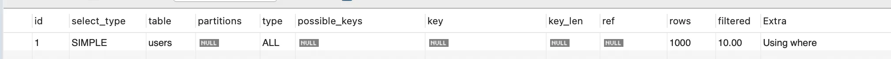

Title: MySQL(8.0+) ”EXPLAIN" Explained
Date: 2025-06-30 13:15
Modified: 2025-06-30 13:26
Tags: mysql, optimization, backend, database
Author: 박이삭
Category: backend
Summary: MySQL query optimization


MySQL에서 쿼리 성능 문제를 해결하려면, 내부적으로 쿼리가 어떻게 실행되는지 정확히 이해하는 것이 중요합니다. 이를 위해 MySQL이 제공하는 대표적인 도구가 `EXPLAIN`과 `EXPLAIN ANALYZE`입니다. 특히 MySQL 8.0 이상부터는 `EXPLAIN ANALYZE`를 통해 실제 실행 계획과 실행 시간까지 확인할 수 있어 더욱 정밀한 튜닝이 가능합니다.

이 글에서는 `EXPLAIN`과 `EXPLAIN ANALYZE`의 기본 개념부터 주요 컬럼 해석, 그리고 실전 최적화 케이스까지 단계적으로 살펴보겠습니다.

---

## MySQL(8.0+) `EXPLAIN`과 `EXPLAIN ANALYZE`의 정의 및 용도

### `EXPLAIN`

- 주어진 SQL 쿼리에 대해 MySQL이 **어떻게 실행할 예정인지**를 보여주는 실행 계획입니다.
- 테이블 접근 순서, 인덱스 사용 여부, 조인 방식 등을 분석할 수 있습니다.

### `EXPLAIN ANALYZE`

- `EXPLAIN`과 달리 실제 쿼리를 실행하고 **실제 시간과 행 수**를 보여줍니다.
- 계획과 현실 사이의 차이를 파악할 수 있어 통계 불일치 문제 확인에 유용합니다.

```sql
EXPLAIN SELECT * FROM users WHERE email = 'example@example.com';
EXPLAIN ANALYZE SELECT * FROM users WHERE email = 'example@example.com';
```

---

## `EXPLAIN` 주요 컬럼과 의미

### 전체 목록과 간단한 설명

| 컬럼 | 의미 |
| --- | --- |
| `id` | 실행 단계 구분 ID (서브쿼리, 조인 순서 등) |
| `select_type` | SELECT 유형 (SIMPLE, PRIMARY, SUBQUERY 등) |
| `table` | 해당 단계에서 접근하는 테이블 |
| `partitions` | 파티션 테이블 사용 시 관련 정보 |
| `type` | **접근 방식 (중요)** |
| `possible_keys` | 사용 가능한 인덱스 목록 |
| `key` | 실제 사용된 인덱스 |
| `key_len` | 인덱스 사용 길이 |
| `ref` | 인덱스 비교에 사용된 컬럼 또는 상수 |
| `rows` | 예상 스캔 행 수 |
| `filtered` | 필터 조건을 통과할 것으로 예측되는 비율 (%) |
| `Extra` | 추가 정보 (Using where, Using filesort 등) |

---

### `type` 컬럼 상세

- 접근 방식 (조인 방식 포함)을 나타내며, 성능과 직결됩니다. (from best to worst)

| type | 의미 및 설명 |
| --- | --- |
| `system` | 단일 행 (const보다도 작음) |
| `const` | Primary Key 또는 Unique Key 단일 조회 |
| `eq_ref` | 조인 시 unique index lookup |
| `ref` | 조인 시 non-unique index lookup |
| `range` | 인덱스 범위 조회 (ex: BETWEEN, >, <) |
| `index` | 전체 인덱스 스캔 |
| `ALL` | 테이블 전체 스캔 (**비효율적**) |

### `key` 컬럼 상세

- 실제로 사용된 인덱스를 나타냅니다.
- `NULL`이면 인덱스를 사용하지 않은 것이며, 주의가 필요합니다.

### `rows` 컬럼 상세

- 해당 단계에서 MySQL이 **스캔할 것으로 예상하는 row 수**입니다.
- 값이 클수록 성능에 부정적인 영향을 줍니다.

### `filtered` 컬럼 상세

- `WHERE` 조건을 통과할 것으로 예측되는 row의 비율입니다.
- 예: `filtered=10` 이고 `rows=10000`이면, 약 1,000 row가 조건을 만족할 것으로 판단한 것

### `Extra` 컬럼 상세

- 추가적인 동작 설명으로 성능 저하 원인을 많이 포함합니다.

| Extra 내용 | 의미 |
| --- | --- |
| `Using where` | WHERE 조건 사용 중 |
| `Using filesort` | 디스크 기반 정렬 또는 메모리 정렬을 의미하며, 인덱스를 사용하지 못하는 ORDER BY 시 발생 |
| `Using temporary` | 임시 테이블 생성 (주로 GROUP BY, DISTINCT 시 발생) |
| `Using index` | 인덱스 커버링 사용 (성능 좋음) |
| `Using index condition` | ICP(Index Condition Pushdown) 사용 |

---

## 최적화 전략 및 예시

### ✅ Case 1: 인덱스가 없어 전체 스캔 발생

```sql
-- DDL
DROP TABLE IF EXISTS users;
CREATE TABLE users (
    id INT AUTO_INCREMENT PRIMARY KEY,
    name VARCHAR(100),
    email VARCHAR(255),
    created_at DATETIME
);
```

<details>
<summary>Test Data</summary>
<div markdown="1">
```sql
-- Generate sample data
INSERT INTO users (name, email, created_at) VALUES ('User0', 'user0@example.com', '2025-06-01 00:44:12');
INSERT INTO users (name, email, created_at) VALUES ('User1', 'user1@example.com', '2023-03-26 00:44:12');
INSERT INTO users (name, email, created_at) VALUES ('User2', 'user2@example.com', '2024-07-25 00:44:12');
INSERT INTO users (name, email, created_at) VALUES ('User3', 'user3@example.com', '2023-11-23 00:44:12');
INSERT INTO users (name, email, created_at) VALUES ('User4', 'user4@example.com', '2022-12-14 00:44:12');
INSERT INTO users (name, email, created_at) VALUES ('User5', 'user5@example.com', '2023-06-25 00:44:12');
INSERT INTO users (name, email, created_at) VALUES ('User6', 'user6@example.com', '2024-07-13 00:44:12');
INSERT INTO users (name, email, created_at) VALUES ('User7', 'user7@example.com', '2025-04-11 00:44:12');
INSERT INTO users (name, email, created_at) VALUES ('User8', 'user8@example.com', '2023-02-28 00:44:12');
INSERT INTO users (name, email, created_at) VALUES ('User9', 'user9@example.com', '2025-06-21 00:44:12');
INSERT INTO users (name, email, created_at) VALUES ('User10', 'user10@example.com', '2024-10-28 00:44:12');
INSERT INTO users (name, email, created_at) VALUES ('User11', 'user11@example.com', '2022-10-04 00:44:12');
INSERT INTO users (name, email, created_at) VALUES ('User12', 'user12@example.com', '2024-04-12 00:44:12');
INSERT INTO users (name, email, created_at) VALUES ('User13', 'user13@example.com', '2024-12-18 00:44:12');
INSERT INTO users (name, email, created_at) VALUES ('User14', 'user14@example.com', '2025-05-05 00:44:12');
INSERT INTO users (name, email, created_at) VALUES ('User15', 'user15@example.com', '2023-05-23 00:44:12');
INSERT INTO users (name, email, created_at) VALUES ('User16', 'user16@example.com', '2025-04-08 00:44:12');
INSERT INTO users (name, email, created_at) VALUES ('User17', 'user17@example.com', '2024-02-09 00:44:12');
INSERT INTO users (name, email, created_at) VALUES ('User18', 'user18@example.com', '2023-10-09 00:44:12');
INSERT INTO users (name, email, created_at) VALUES ('User19', 'user19@example.com', '2023-06-29 00:44:12');
INSERT INTO users (name, email, created_at) VALUES ('User20', 'user20@example.com', '2025-03-28 00:44:12');
INSERT INTO users (name, email, created_at) VALUES ('User21', 'user21@example.com', '2023-07-23 00:44:12');
INSERT INTO users (name, email, created_at) VALUES ('User22', 'user22@example.com', '2025-05-07 00:44:12');
INSERT INTO users (name, email, created_at) VALUES ('User23', 'user23@example.com', '2023-01-05 00:44:12');
INSERT INTO users (name, email, created_at) VALUES ('User24', 'user24@example.com', '2025-06-06 00:44:12');
INSERT INTO users (name, email, created_at) VALUES ('User25', 'user25@example.com', '2023-01-05 00:44:12');
INSERT INTO users (name, email, created_at) VALUES ('User26', 'user26@example.com', '2024-09-25 00:44:12');
INSERT INTO users (name, email, created_at) VALUES ('User27', 'user27@example.com', '2022-11-28 00:44:12');
INSERT INTO users (name, email, created_at) VALUES ('User28', 'user28@example.com', '2023-08-27 00:44:12');
INSERT INTO users (name, email, created_at) VALUES ('User29', 'user29@example.com', '2022-12-10 00:44:12');
INSERT INTO users (name, email, created_at) VALUES ('User30', 'user30@example.com', '2024-12-13 00:44:12');
INSERT INTO users (name, email, created_at) VALUES ('User31', 'user31@example.com', '2023-10-22 00:44:12');
INSERT INTO users (name, email, created_at) VALUES ('User32', 'user32@example.com', '2023-07-14 00:44:12');
INSERT INTO users (name, email, created_at) VALUES ('User33', 'user33@example.com', '2022-11-17 00:44:12');
INSERT INTO users (name, email, created_at) VALUES ('User34', 'user34@example.com', '2023-01-12 00:44:12');
INSERT INTO users (name, email, created_at) VALUES ('User35', 'user35@example.com', '2024-07-10 00:44:12');
INSERT INTO users (name, email, created_at) VALUES ('User36', 'user36@example.com', '2023-07-04 00:44:12');
INSERT INTO users (name, email, created_at) VALUES ('User37', 'user37@example.com', '2024-01-18 00:44:12');
INSERT INTO users (name, email, created_at) VALUES ('User38', 'user38@example.com', '2024-08-28 00:44:12');
INSERT INTO users (name, email, created_at) VALUES ('User39', 'user39@example.com', '2025-02-25 00:44:12');
INSERT INTO users (name, email, created_at) VALUES ('User40', 'user40@example.com', '2025-02-24 00:44:12');
INSERT INTO users (name, email, created_at) VALUES ('User41', 'user41@example.com', '2023-05-18 00:44:12');
INSERT INTO users (name, email, created_at) VALUES ('User42', 'user42@example.com', '2022-12-02 00:44:12');
INSERT INTO users (name, email, created_at) VALUES ('User43', 'user43@example.com', '2024-03-08 00:44:12');
INSERT INTO users (name, email, created_at) VALUES ('User44', 'user44@example.com', '2024-04-23 00:44:12');
INSERT INTO users (name, email, created_at) VALUES ('User45', 'user45@example.com', '2024-01-12 00:44:12');
INSERT INTO users (name, email, created_at) VALUES ('User46', 'user46@example.com', '2022-11-29 00:44:12');
INSERT INTO users (name, email, created_at) VALUES ('User47', 'user47@example.com', '2023-02-02 00:44:12');
INSERT INTO users (name, email, created_at) VALUES ('User48', 'user48@example.com', '2025-06-11 00:44:12');
INSERT INTO users (name, email, created_at) VALUES ('User49', 'user49@example.com', '2022-11-20 00:44:12');
INSERT INTO users (name, email, created_at) VALUES ('User50', 'user50@example.com', '2024-03-05 00:44:12');
INSERT INTO users (name, email, created_at) VALUES ('User51', 'user51@example.com', '2023-05-14 00:44:12');
INSERT INTO users (name, email, created_at) VALUES ('User52', 'user52@example.com', '2024-10-19 00:44:12');
INSERT INTO users (name, email, created_at) VALUES ('User53', 'user53@example.com', '2023-08-22 00:44:12');
INSERT INTO users (name, email, created_at) VALUES ('User54', 'user54@example.com', '2024-06-28 00:44:12');
INSERT INTO users (name, email, created_at) VALUES ('User55', 'user55@example.com', '2023-08-19 00:44:12');
INSERT INTO users (name, email, created_at) VALUES ('User56', 'user56@example.com', '2023-07-13 00:44:12');
INSERT INTO users (name, email, created_at) VALUES ('User57', 'user57@example.com', '2023-10-20 00:44:12');
INSERT INTO users (name, email, created_at) VALUES ('User58', 'user58@example.com', '2023-12-02 00:44:12');
INSERT INTO users (name, email, created_at) VALUES ('User59', 'user59@example.com', '2023-08-05 00:44:12');
INSERT INTO users (name, email, created_at) VALUES ('User60', 'user60@example.com', '2024-04-03 00:44:12');
INSERT INTO users (name, email, created_at) VALUES ('User61', 'user61@example.com', '2024-06-14 00:44:12');
INSERT INTO users (name, email, created_at) VALUES ('User62', 'user62@example.com', '2023-10-24 00:44:12');
INSERT INTO users (name, email, created_at) VALUES ('User63', 'user63@example.com', '2024-12-24 00:44:12');
INSERT INTO users (name, email, created_at) VALUES ('User64', 'user64@example.com', '2023-10-11 00:44:12');
INSERT INTO users (name, email, created_at) VALUES ('User65', 'user65@example.com', '2025-03-18 00:44:12');
INSERT INTO users (name, email, created_at) VALUES ('User66', 'user66@example.com', '2023-09-03 00:44:12');
INSERT INTO users (name, email, created_at) VALUES ('User67', 'user67@example.com', '2024-12-07 00:44:12');
INSERT INTO users (name, email, created_at) VALUES ('User68', 'user68@example.com', '2024-02-01 00:44:12');
INSERT INTO users (name, email, created_at) VALUES ('User69', 'user69@example.com', '2023-02-23 00:44:12');
INSERT INTO users (name, email, created_at) VALUES ('User70', 'user70@example.com', '2023-12-17 00:44:12');
INSERT INTO users (name, email, created_at) VALUES ('User71', 'user71@example.com', '2023-04-12 00:44:12');
INSERT INTO users (name, email, created_at) VALUES ('User72', 'user72@example.com', '2024-11-28 00:44:12');
INSERT INTO users (name, email, created_at) VALUES ('User73', 'user73@example.com', '2024-03-29 00:44:12');
INSERT INTO users (name, email, created_at) VALUES ('User74', 'user74@example.com', '2023-05-16 00:44:12');
INSERT INTO users (name, email, created_at) VALUES ('User75', 'user75@example.com', '2024-08-19 00:44:12');
INSERT INTO users (name, email, created_at) VALUES ('User76', 'user76@example.com', '2023-02-08 00:44:12');
INSERT INTO users (name, email, created_at) VALUES ('User77', 'user77@example.com', '2023-11-05 00:44:12');
INSERT INTO users (name, email, created_at) VALUES ('User78', 'user78@example.com', '2024-10-24 00:44:12');
INSERT INTO users (name, email, created_at) VALUES ('User79', 'user79@example.com', '2024-03-17 00:44:12');
INSERT INTO users (name, email, created_at) VALUES ('User80', 'user80@example.com', '2022-10-08 00:44:12');
INSERT INTO users (name, email, created_at) VALUES ('User81', 'user81@example.com', '2024-11-19 00:44:12');
INSERT INTO users (name, email, created_at) VALUES ('User82', 'user82@example.com', '2023-02-12 00:44:12');
INSERT INTO users (name, email, created_at) VALUES ('User83', 'user83@example.com', '2024-06-14 00:44:12');
INSERT INTO users (name, email, created_at) VALUES ('User84', 'user84@example.com', '2023-07-27 00:44:12');
INSERT INTO users (name, email, created_at) VALUES ('User85', 'user85@example.com', '2025-05-08 00:44:12');
INSERT INTO users (name, email, created_at) VALUES ('User86', 'user86@example.com', '2024-11-11 00:44:12');
INSERT INTO users (name, email, created_at) VALUES ('User87', 'user87@example.com', '2023-09-07 00:44:12');
INSERT INTO users (name, email, created_at) VALUES ('User88', 'user88@example.com', '2024-09-21 00:44:12');
INSERT INTO users (name, email, created_at) VALUES ('User89', 'user89@example.com', '2023-12-20 00:44:12');
INSERT INTO users (name, email, created_at) VALUES ('User90', 'user90@example.com', '2023-09-17 00:44:12');
INSERT INTO users (name, email, created_at) VALUES ('User91', 'user91@example.com', '2023-09-24 00:44:12');
INSERT INTO users (name, email, created_at) VALUES ('User92', 'user92@example.com', '2024-06-11 00:44:12');
INSERT INTO users (name, email, created_at) VALUES ('User93', 'user93@example.com', '2023-07-15 00:44:12');
INSERT INTO users (name, email, created_at) VALUES ('User94', 'user94@example.com', '2022-11-19 00:44:12');
INSERT INTO users (name, email, created_at) VALUES ('User95', 'user95@example.com', '2023-10-08 00:44:12');
INSERT INTO users (name, email, created_at) VALUES ('User96', 'user96@example.com', '2025-06-25 00:44:12');
INSERT INTO users (name, email, created_at) VALUES ('User97', 'user97@example.com', '2023-05-01 00:44:12');
INSERT INTO users (name, email, created_at) VALUES ('User98', 'user98@example.com', '2025-01-07 00:44:12');
INSERT INTO users (name, email, created_at) VALUES ('User99', 'user99@example.com', '2024-10-01 00:44:12');
INSERT INTO users (name, email, created_at) VALUES ('User100', 'user100@example.com', '2023-10-10 00:44:12');
INSERT INTO users (name, email, created_at) VALUES ('User101', 'user101@example.com', '2025-05-02 00:44:12');
INSERT INTO users (name, email, created_at) VALUES ('User102', 'user102@example.com', '2024-02-01 00:44:12');
INSERT INTO users (name, email, created_at) VALUES ('User103', 'user103@example.com', '2025-04-18 00:44:12');
INSERT INTO users (name, email, created_at) VALUES ('User104', 'user104@example.com', '2025-01-27 00:44:12');
INSERT INTO users (name, email, created_at) VALUES ('User105', 'user105@example.com', '2025-01-07 00:44:12');
INSERT INTO users (name, email, created_at) VALUES ('User106', 'user106@example.com', '2025-04-30 00:44:12');
INSERT INTO users (name, email, created_at) VALUES ('User107', 'user107@example.com', '2024-10-04 00:44:12');
INSERT INTO users (name, email, created_at) VALUES ('User108', 'user108@example.com', '2024-10-12 00:44:12');
INSERT INTO users (name, email, created_at) VALUES ('User109', 'user109@example.com', '2024-04-12 00:44:12');
INSERT INTO users (name, email, created_at) VALUES ('User110', 'user110@example.com', '2025-01-15 00:44:12');
INSERT INTO users (name, email, created_at) VALUES ('User111', 'user111@example.com', '2025-06-17 00:44:12');
INSERT INTO users (name, email, created_at) VALUES ('User112', 'user112@example.com', '2023-02-24 00:44:12');
INSERT INTO users (name, email, created_at) VALUES ('User113', 'user113@example.com', '2023-07-13 00:44:12');
INSERT INTO users (name, email, created_at) VALUES ('User114', 'user114@example.com', '2025-04-17 00:44:12');
INSERT INTO users (name, email, created_at) VALUES ('User115', 'user115@example.com', '2023-02-09 00:44:12');
INSERT INTO users (name, email, created_at) VALUES ('User116', 'user116@example.com', '2024-09-29 00:44:12');
INSERT INTO users (name, email, created_at) VALUES ('User117', 'user117@example.com', '2024-05-15 00:44:12');
INSERT INTO users (name, email, created_at) VALUES ('User118', 'user118@example.com', '2024-05-06 00:44:12');
INSERT INTO users (name, email, created_at) VALUES ('User119', 'user119@example.com', '2023-06-30 00:44:12');
INSERT INTO users (name, email, created_at) VALUES ('User120', 'user120@example.com', '2022-10-24 00:44:12');
INSERT INTO users (name, email, created_at) VALUES ('User121', 'user121@example.com', '2023-10-28 00:44:12');
INSERT INTO users (name, email, created_at) VALUES ('User122', 'user122@example.com', '2024-04-09 00:44:12');
INSERT INTO users (name, email, created_at) VALUES ('User123', 'user123@example.com', '2024-06-05 00:44:12');
INSERT INTO users (name, email, created_at) VALUES ('User124', 'user124@example.com', '2024-01-14 00:44:12');
INSERT INTO users (name, email, created_at) VALUES ('User125', 'user125@example.com', '2024-02-25 00:44:12');
INSERT INTO users (name, email, created_at) VALUES ('User126', 'user126@example.com', '2025-05-02 00:44:12');
INSERT INTO users (name, email, created_at) VALUES ('User127', 'user127@example.com', '2024-01-14 00:44:12');
INSERT INTO users (name, email, created_at) VALUES ('User128', 'user128@example.com', '2025-01-30 00:44:12');
INSERT INTO users (name, email, created_at) VALUES ('User129', 'user129@example.com', '2025-05-05 00:44:12');
INSERT INTO users (name, email, created_at) VALUES ('User130', 'user130@example.com', '2023-03-30 00:44:12');
INSERT INTO users (name, email, created_at) VALUES ('User131', 'user131@example.com', '2024-06-21 00:44:12');
INSERT INTO users (name, email, created_at) VALUES ('User132', 'user132@example.com', '2025-03-31 00:44:12');
INSERT INTO users (name, email, created_at) VALUES ('User133', 'user133@example.com', '2025-03-04 00:44:12');
INSERT INTO users (name, email, created_at) VALUES ('User134', 'user134@example.com', '2022-12-20 00:44:12');
INSERT INTO users (name, email, created_at) VALUES ('User135', 'user135@example.com', '2025-04-06 00:44:12');
INSERT INTO users (name, email, created_at) VALUES ('User136', 'user136@example.com', '2023-07-14 00:44:12');
INSERT INTO users (name, email, created_at) VALUES ('User137', 'user137@example.com', '2024-01-05 00:44:12');
INSERT INTO users (name, email, created_at) VALUES ('User138', 'user138@example.com', '2024-11-30 00:44:12');
INSERT INTO users (name, email, created_at) VALUES ('User139', 'user139@example.com', '2024-02-09 00:44:12');
INSERT INTO users (name, email, created_at) VALUES ('User140', 'user140@example.com', '2023-11-26 00:44:12');
INSERT INTO users (name, email, created_at) VALUES ('User141', 'user141@example.com', '2023-08-03 00:44:12');
INSERT INTO users (name, email, created_at) VALUES ('User142', 'user142@example.com', '2023-09-03 00:44:12');
INSERT INTO users (name, email, created_at) VALUES ('User143', 'user143@example.com', '2025-05-13 00:44:12');
INSERT INTO users (name, email, created_at) VALUES ('User144', 'user144@example.com', '2025-06-04 00:44:12');
INSERT INTO users (name, email, created_at) VALUES ('User145', 'user145@example.com', '2024-10-01 00:44:12');
INSERT INTO users (name, email, created_at) VALUES ('User146', 'user146@example.com', '2025-01-11 00:44:12');
INSERT INTO users (name, email, created_at) VALUES ('User147', 'user147@example.com', '2024-08-13 00:44:12');
INSERT INTO users (name, email, created_at) VALUES ('User148', 'user148@example.com', '2025-04-04 00:44:12');
INSERT INTO users (name, email, created_at) VALUES ('User149', 'user149@example.com', '2023-08-20 00:44:12');
INSERT INTO users (name, email, created_at) VALUES ('User150', 'user150@example.com', '2022-12-21 00:44:12');
INSERT INTO users (name, email, created_at) VALUES ('User151', 'user151@example.com', '2024-12-26 00:44:12');
INSERT INTO users (name, email, created_at) VALUES ('User152', 'user152@example.com', '2025-06-28 00:44:12');
INSERT INTO users (name, email, created_at) VALUES ('User153', 'user153@example.com', '2024-05-26 00:44:12');
INSERT INTO users (name, email, created_at) VALUES ('User154', 'user154@example.com', '2024-02-03 00:44:12');
INSERT INTO users (name, email, created_at) VALUES ('User155', 'user155@example.com', '2024-12-22 00:44:12');
INSERT INTO users (name, email, created_at) VALUES ('User156', 'user156@example.com', '2024-01-12 00:44:12');
INSERT INTO users (name, email, created_at) VALUES ('User157', 'user157@example.com', '2024-12-30 00:44:12');
INSERT INTO users (name, email, created_at) VALUES ('User158', 'user158@example.com', '2022-10-17 00:44:12');
INSERT INTO users (name, email, created_at) VALUES ('User159', 'user159@example.com', '2024-09-19 00:44:12');
INSERT INTO users (name, email, created_at) VALUES ('User160', 'user160@example.com', '2024-11-07 00:44:12');
INSERT INTO users (name, email, created_at) VALUES ('User161', 'user161@example.com', '2024-07-18 00:44:12');
INSERT INTO users (name, email, created_at) VALUES ('User162', 'user162@example.com', '2023-12-15 00:44:12');
INSERT INTO users (name, email, created_at) VALUES ('User163', 'user163@example.com', '2025-02-26 00:44:12');
INSERT INTO users (name, email, created_at) VALUES ('User164', 'user164@example.com', '2023-06-27 00:44:12');
INSERT INTO users (name, email, created_at) VALUES ('User165', 'user165@example.com', '2025-04-11 00:44:12');
INSERT INTO users (name, email, created_at) VALUES ('User166', 'user166@example.com', '2024-04-07 00:44:12');
INSERT INTO users (name, email, created_at) VALUES ('User167', 'user167@example.com', '2023-01-06 00:44:12');
INSERT INTO users (name, email, created_at) VALUES ('User168', 'user168@example.com', '2024-05-12 00:44:12');
INSERT INTO users (name, email, created_at) VALUES ('User169', 'user169@example.com', '2023-05-01 00:44:12');
INSERT INTO users (name, email, created_at) VALUES ('User170', 'user170@example.com', '2024-06-26 00:44:12');
INSERT INTO users (name, email, created_at) VALUES ('User171', 'user171@example.com', '2023-08-14 00:44:12');
INSERT INTO users (name, email, created_at) VALUES ('User172', 'user172@example.com', '2023-12-09 00:44:12');
INSERT INTO users (name, email, created_at) VALUES ('User173', 'user173@example.com', '2023-11-13 00:44:12');
INSERT INTO users (name, email, created_at) VALUES ('User174', 'user174@example.com', '2023-03-23 00:44:12');
INSERT INTO users (name, email, created_at) VALUES ('User175', 'user175@example.com', '2023-10-13 00:44:12');
INSERT INTO users (name, email, created_at) VALUES ('User176', 'user176@example.com', '2023-07-20 00:44:12');
INSERT INTO users (name, email, created_at) VALUES ('User177', 'user177@example.com', '2023-05-26 00:44:12');
INSERT INTO users (name, email, created_at) VALUES ('User178', 'user178@example.com', '2023-01-25 00:44:12');
INSERT INTO users (name, email, created_at) VALUES ('User179', 'user179@example.com', '2023-06-03 00:44:12');
INSERT INTO users (name, email, created_at) VALUES ('User180', 'user180@example.com', '2024-07-03 00:44:12');
INSERT INTO users (name, email, created_at) VALUES ('User181', 'user181@example.com', '2025-05-01 00:44:12');
INSERT INTO users (name, email, created_at) VALUES ('User182', 'user182@example.com', '2023-09-08 00:44:12');
INSERT INTO users (name, email, created_at) VALUES ('User183', 'user183@example.com', '2023-03-15 00:44:12');
INSERT INTO users (name, email, created_at) VALUES ('User184', 'user184@example.com', '2022-10-07 00:44:12');
INSERT INTO users (name, email, created_at) VALUES ('User185', 'user185@example.com', '2024-11-01 00:44:12');
INSERT INTO users (name, email, created_at) VALUES ('User186', 'user186@example.com', '2024-04-16 00:44:12');
INSERT INTO users (name, email, created_at) VALUES ('User187', 'user187@example.com', '2024-12-06 00:44:12');
INSERT INTO users (name, email, created_at) VALUES ('User188', 'user188@example.com', '2023-08-27 00:44:12');
INSERT INTO users (name, email, created_at) VALUES ('User189', 'user189@example.com', '2024-04-24 00:44:12');
INSERT INTO users (name, email, created_at) VALUES ('User190', 'user190@example.com', '2022-10-19 00:44:12');
INSERT INTO users (name, email, created_at) VALUES ('User191', 'user191@example.com', '2023-03-11 00:44:12');
INSERT INTO users (name, email, created_at) VALUES ('User192', 'user192@example.com', '2025-04-13 00:44:12');
INSERT INTO users (name, email, created_at) VALUES ('User193', 'user193@example.com', '2024-10-25 00:44:12');
INSERT INTO users (name, email, created_at) VALUES ('User194', 'user194@example.com', '2024-11-24 00:44:12');
INSERT INTO users (name, email, created_at) VALUES ('User195', 'user195@example.com', '2024-12-11 00:44:12');
INSERT INTO users (name, email, created_at) VALUES ('User196', 'user196@example.com', '2025-01-17 00:44:12');
INSERT INTO users (name, email, created_at) VALUES ('User197', 'user197@example.com', '2024-10-17 00:44:12');
INSERT INTO users (name, email, created_at) VALUES ('User198', 'user198@example.com', '2022-10-06 00:44:12');
INSERT INTO users (name, email, created_at) VALUES ('User199', 'user199@example.com', '2023-06-16 00:44:12');
INSERT INTO users (name, email, created_at) VALUES ('User200', 'user200@example.com', '2023-07-02 00:44:12');
INSERT INTO users (name, email, created_at) VALUES ('User201', 'user201@example.com', '2023-05-07 00:44:12');
INSERT INTO users (name, email, created_at) VALUES ('User202', 'user202@example.com', '2024-02-03 00:44:12');
INSERT INTO users (name, email, created_at) VALUES ('User203', 'user203@example.com', '2024-02-04 00:44:12');
INSERT INTO users (name, email, created_at) VALUES ('User204', 'user204@example.com', '2024-10-01 00:44:12');
INSERT INTO users (name, email, created_at) VALUES ('User205', 'user205@example.com', '2024-11-07 00:44:12');
INSERT INTO users (name, email, created_at) VALUES ('User206', 'user206@example.com', '2024-11-10 00:44:12');
INSERT INTO users (name, email, created_at) VALUES ('User207', 'user207@example.com', '2024-01-20 00:44:12');
INSERT INTO users (name, email, created_at) VALUES ('User208', 'user208@example.com', '2024-03-23 00:44:12');
INSERT INTO users (name, email, created_at) VALUES ('User209', 'user209@example.com', '2024-05-24 00:44:12');
INSERT INTO users (name, email, created_at) VALUES ('User210', 'user210@example.com', '2023-05-21 00:44:12');
INSERT INTO users (name, email, created_at) VALUES ('User211', 'user211@example.com', '2024-10-10 00:44:12');
INSERT INTO users (name, email, created_at) VALUES ('User212', 'user212@example.com', '2024-06-26 00:44:12');
INSERT INTO users (name, email, created_at) VALUES ('User213', 'user213@example.com', '2023-06-18 00:44:12');
INSERT INTO users (name, email, created_at) VALUES ('User214', 'user214@example.com', '2024-04-10 00:44:12');
INSERT INTO users (name, email, created_at) VALUES ('User215', 'user215@example.com', '2023-06-21 00:44:12');
INSERT INTO users (name, email, created_at) VALUES ('User216', 'user216@example.com', '2024-02-23 00:44:12');
INSERT INTO users (name, email, created_at) VALUES ('User217', 'user217@example.com', '2023-03-24 00:44:12');
INSERT INTO users (name, email, created_at) VALUES ('User218', 'user218@example.com', '2022-12-29 00:44:12');
INSERT INTO users (name, email, created_at) VALUES ('User219', 'user219@example.com', '2024-02-12 00:44:12');
INSERT INTO users (name, email, created_at) VALUES ('User220', 'user220@example.com', '2025-05-27 00:44:12');
INSERT INTO users (name, email, created_at) VALUES ('User221', 'user221@example.com', '2025-03-17 00:44:12');
INSERT INTO users (name, email, created_at) VALUES ('User222', 'user222@example.com', '2022-10-12 00:44:12');
INSERT INTO users (name, email, created_at) VALUES ('User223', 'user223@example.com', '2023-06-25 00:44:12');
INSERT INTO users (name, email, created_at) VALUES ('User224', 'user224@example.com', '2024-08-28 00:44:12');
INSERT INTO users (name, email, created_at) VALUES ('User225', 'user225@example.com', '2025-01-11 00:44:12');
INSERT INTO users (name, email, created_at) VALUES ('User226', 'user226@example.com', '2024-03-12 00:44:12');
INSERT INTO users (name, email, created_at) VALUES ('User227', 'user227@example.com', '2025-06-21 00:44:12');
INSERT INTO users (name, email, created_at) VALUES ('User228', 'user228@example.com', '2022-11-16 00:44:12');
INSERT INTO users (name, email, created_at) VALUES ('User229', 'user229@example.com', '2023-08-08 00:44:12');
INSERT INTO users (name, email, created_at) VALUES ('User230', 'user230@example.com', '2023-02-21 00:44:12');
INSERT INTO users (name, email, created_at) VALUES ('User231', 'user231@example.com', '2025-01-20 00:44:12');
INSERT INTO users (name, email, created_at) VALUES ('User232', 'user232@example.com', '2024-04-13 00:44:12');
INSERT INTO users (name, email, created_at) VALUES ('User233', 'user233@example.com', '2024-12-31 00:44:12');
INSERT INTO users (name, email, created_at) VALUES ('User234', 'user234@example.com', '2022-12-22 00:44:12');
INSERT INTO users (name, email, created_at) VALUES ('User235', 'user235@example.com', '2023-01-03 00:44:12');
INSERT INTO users (name, email, created_at) VALUES ('User236', 'user236@example.com', '2024-05-18 00:44:12');
INSERT INTO users (name, email, created_at) VALUES ('User237', 'user237@example.com', '2024-12-11 00:44:12');
INSERT INTO users (name, email, created_at) VALUES ('User238', 'user238@example.com', '2023-02-17 00:44:12');
INSERT INTO users (name, email, created_at) VALUES ('User239', 'user239@example.com', '2023-07-20 00:44:12');
INSERT INTO users (name, email, created_at) VALUES ('User240', 'user240@example.com', '2024-12-14 00:44:12');
INSERT INTO users (name, email, created_at) VALUES ('User241', 'user241@example.com', '2023-06-26 00:44:12');
INSERT INTO users (name, email, created_at) VALUES ('User242', 'user242@example.com', '2022-11-07 00:44:12');
INSERT INTO users (name, email, created_at) VALUES ('User243', 'user243@example.com', '2023-02-18 00:44:12');
INSERT INTO users (name, email, created_at) VALUES ('User244', 'user244@example.com', '2023-04-22 00:44:12');
INSERT INTO users (name, email, created_at) VALUES ('User245', 'user245@example.com', '2025-04-04 00:44:12');
INSERT INTO users (name, email, created_at) VALUES ('User246', 'user246@example.com', '2024-10-15 00:44:12');
INSERT INTO users (name, email, created_at) VALUES ('User247', 'user247@example.com', '2024-01-14 00:44:12');
INSERT INTO users (name, email, created_at) VALUES ('User248', 'user248@example.com', '2023-07-04 00:44:12');
INSERT INTO users (name, email, created_at) VALUES ('User249', 'user249@example.com', '2024-07-14 00:44:12');
INSERT INTO users (name, email, created_at) VALUES ('User250', 'user250@example.com', '2023-02-05 00:44:12');
INSERT INTO users (name, email, created_at) VALUES ('User251', 'user251@example.com', '2024-02-02 00:44:12');
INSERT INTO users (name, email, created_at) VALUES ('User252', 'user252@example.com', '2024-05-02 00:44:12');
INSERT INTO users (name, email, created_at) VALUES ('User253', 'user253@example.com', '2025-01-07 00:44:12');
INSERT INTO users (name, email, created_at) VALUES ('User254', 'user254@example.com', '2023-03-07 00:44:12');
INSERT INTO users (name, email, created_at) VALUES ('User255', 'user255@example.com', '2023-02-04 00:44:12');
INSERT INTO users (name, email, created_at) VALUES ('User256', 'user256@example.com', '2024-02-15 00:44:12');
INSERT INTO users (name, email, created_at) VALUES ('User257', 'user257@example.com', '2023-04-11 00:44:12');
INSERT INTO users (name, email, created_at) VALUES ('User258', 'user258@example.com', '2023-08-25 00:44:12');
INSERT INTO users (name, email, created_at) VALUES ('User259', 'user259@example.com', '2024-06-09 00:44:12');
INSERT INTO users (name, email, created_at) VALUES ('User260', 'user260@example.com', '2024-06-08 00:44:12');
INSERT INTO users (name, email, created_at) VALUES ('User261', 'user261@example.com', '2024-10-11 00:44:12');
INSERT INTO users (name, email, created_at) VALUES ('User262', 'user262@example.com', '2023-08-09 00:44:12');
INSERT INTO users (name, email, created_at) VALUES ('User263', 'user263@example.com', '2025-05-25 00:44:12');
INSERT INTO users (name, email, created_at) VALUES ('User264', 'user264@example.com', '2024-01-30 00:44:12');
INSERT INTO users (name, email, created_at) VALUES ('User265', 'user265@example.com', '2023-07-26 00:44:12');
INSERT INTO users (name, email, created_at) VALUES ('User266', 'user266@example.com', '2022-11-04 00:44:12');
INSERT INTO users (name, email, created_at) VALUES ('User267', 'user267@example.com', '2023-02-25 00:44:12');
INSERT INTO users (name, email, created_at) VALUES ('User268', 'user268@example.com', '2023-10-09 00:44:12');
INSERT INTO users (name, email, created_at) VALUES ('User269', 'user269@example.com', '2024-01-13 00:44:12');
INSERT INTO users (name, email, created_at) VALUES ('User270', 'user270@example.com', '2023-01-09 00:44:12');
INSERT INTO users (name, email, created_at) VALUES ('User271', 'user271@example.com', '2024-04-02 00:44:12');
INSERT INTO users (name, email, created_at) VALUES ('User272', 'user272@example.com', '2025-05-26 00:44:12');
INSERT INTO users (name, email, created_at) VALUES ('User273', 'user273@example.com', '2024-06-28 00:44:12');
INSERT INTO users (name, email, created_at) VALUES ('User274', 'user274@example.com', '2024-08-01 00:44:12');
INSERT INTO users (name, email, created_at) VALUES ('User275', 'user275@example.com', '2022-10-07 00:44:12');
INSERT INTO users (name, email, created_at) VALUES ('User276', 'user276@example.com', '2023-04-17 00:44:12');
INSERT INTO users (name, email, created_at) VALUES ('User277', 'user277@example.com', '2024-03-20 00:44:12');
INSERT INTO users (name, email, created_at) VALUES ('User278', 'user278@example.com', '2023-03-13 00:44:12');
INSERT INTO users (name, email, created_at) VALUES ('User279', 'user279@example.com', '2024-01-17 00:44:12');
INSERT INTO users (name, email, created_at) VALUES ('User280', 'user280@example.com', '2022-11-10 00:44:12');
INSERT INTO users (name, email, created_at) VALUES ('User281', 'user281@example.com', '2023-07-14 00:44:12');
INSERT INTO users (name, email, created_at) VALUES ('User282', 'user282@example.com', '2025-05-01 00:44:12');
INSERT INTO users (name, email, created_at) VALUES ('User283', 'user283@example.com', '2023-07-28 00:44:12');
INSERT INTO users (name, email, created_at) VALUES ('User284', 'user284@example.com', '2023-08-22 00:44:12');
INSERT INTO users (name, email, created_at) VALUES ('User285', 'user285@example.com', '2023-09-27 00:44:12');
INSERT INTO users (name, email, created_at) VALUES ('User286', 'user286@example.com', '2023-01-29 00:44:12');
INSERT INTO users (name, email, created_at) VALUES ('User287', 'user287@example.com', '2024-08-13 00:44:12');
INSERT INTO users (name, email, created_at) VALUES ('User288', 'user288@example.com', '2022-12-10 00:44:12');
INSERT INTO users (name, email, created_at) VALUES ('User289', 'user289@example.com', '2024-05-02 00:44:12');
INSERT INTO users (name, email, created_at) VALUES ('User290', 'user290@example.com', '2022-12-27 00:44:12');
INSERT INTO users (name, email, created_at) VALUES ('User291', 'user291@example.com', '2024-08-17 00:44:12');
INSERT INTO users (name, email, created_at) VALUES ('User292', 'user292@example.com', '2023-12-30 00:44:12');
INSERT INTO users (name, email, created_at) VALUES ('User293', 'user293@example.com', '2023-12-22 00:44:12');
INSERT INTO users (name, email, created_at) VALUES ('User294', 'user294@example.com', '2025-05-11 00:44:12');
INSERT INTO users (name, email, created_at) VALUES ('User295', 'user295@example.com', '2023-01-23 00:44:12');
INSERT INTO users (name, email, created_at) VALUES ('User296', 'user296@example.com', '2024-12-25 00:44:12');
INSERT INTO users (name, email, created_at) VALUES ('User297', 'user297@example.com', '2025-06-21 00:44:12');
INSERT INTO users (name, email, created_at) VALUES ('User298', 'user298@example.com', '2025-04-07 00:44:12');
INSERT INTO users (name, email, created_at) VALUES ('User299', 'user299@example.com', '2022-10-27 00:44:12');
INSERT INTO users (name, email, created_at) VALUES ('User300', 'user300@example.com', '2023-11-19 00:44:12');
INSERT INTO users (name, email, created_at) VALUES ('User301', 'user301@example.com', '2023-09-24 00:44:12');
INSERT INTO users (name, email, created_at) VALUES ('User302', 'user302@example.com', '2023-11-04 00:44:12');
INSERT INTO users (name, email, created_at) VALUES ('User303', 'user303@example.com', '2025-01-20 00:44:12');
INSERT INTO users (name, email, created_at) VALUES ('User304', 'user304@example.com', '2024-04-24 00:44:12');
INSERT INTO users (name, email, created_at) VALUES ('User305', 'user305@example.com', '2024-04-29 00:44:12');
INSERT INTO users (name, email, created_at) VALUES ('User306', 'user306@example.com', '2022-11-09 00:44:12');
INSERT INTO users (name, email, created_at) VALUES ('User307', 'user307@example.com', '2024-05-04 00:44:12');
INSERT INTO users (name, email, created_at) VALUES ('User308', 'user308@example.com', '2023-10-29 00:44:12');
INSERT INTO users (name, email, created_at) VALUES ('User309', 'user309@example.com', '2022-11-09 00:44:12');
INSERT INTO users (name, email, created_at) VALUES ('User310', 'user310@example.com', '2024-01-18 00:44:12');
INSERT INTO users (name, email, created_at) VALUES ('User311', 'user311@example.com', '2023-09-12 00:44:12');
INSERT INTO users (name, email, created_at) VALUES ('User312', 'user312@example.com', '2024-03-14 00:44:12');
INSERT INTO users (name, email, created_at) VALUES ('User313', 'user313@example.com', '2023-06-30 00:44:12');
INSERT INTO users (name, email, created_at) VALUES ('User314', 'user314@example.com', '2023-07-13 00:44:12');
INSERT INTO users (name, email, created_at) VALUES ('User315', 'user315@example.com', '2023-01-19 00:44:12');
INSERT INTO users (name, email, created_at) VALUES ('User316', 'user316@example.com', '2023-01-06 00:44:12');
INSERT INTO users (name, email, created_at) VALUES ('User317', 'user317@example.com', '2024-10-09 00:44:12');
INSERT INTO users (name, email, created_at) VALUES ('User318', 'user318@example.com', '2024-10-27 00:44:12');
INSERT INTO users (name, email, created_at) VALUES ('User319', 'user319@example.com', '2023-05-23 00:44:12');
INSERT INTO users (name, email, created_at) VALUES ('User320', 'user320@example.com', '2025-01-23 00:44:12');
INSERT INTO users (name, email, created_at) VALUES ('User321', 'user321@example.com', '2024-02-03 00:44:12');
INSERT INTO users (name, email, created_at) VALUES ('User322', 'user322@example.com', '2025-06-14 00:44:12');
INSERT INTO users (name, email, created_at) VALUES ('User323', 'user323@example.com', '2025-06-21 00:44:12');
INSERT INTO users (name, email, created_at) VALUES ('User324', 'user324@example.com', '2024-12-18 00:44:12');
INSERT INTO users (name, email, created_at) VALUES ('User325', 'user325@example.com', '2023-12-17 00:44:12');
INSERT INTO users (name, email, created_at) VALUES ('User326', 'user326@example.com', '2025-04-16 00:44:12');
INSERT INTO users (name, email, created_at) VALUES ('User327', 'user327@example.com', '2024-11-26 00:44:12');
INSERT INTO users (name, email, created_at) VALUES ('User328', 'user328@example.com', '2023-05-21 00:44:12');
INSERT INTO users (name, email, created_at) VALUES ('User329', 'user329@example.com', '2025-03-18 00:44:12');
INSERT INTO users (name, email, created_at) VALUES ('User330', 'user330@example.com', '2025-02-13 00:44:12');
INSERT INTO users (name, email, created_at) VALUES ('User331', 'user331@example.com', '2024-09-14 00:44:12');
INSERT INTO users (name, email, created_at) VALUES ('User332', 'user332@example.com', '2024-03-22 00:44:12');
INSERT INTO users (name, email, created_at) VALUES ('User333', 'user333@example.com', '2025-04-17 00:44:12');
INSERT INTO users (name, email, created_at) VALUES ('User334', 'user334@example.com', '2023-02-11 00:44:12');
INSERT INTO users (name, email, created_at) VALUES ('User335', 'user335@example.com', '2023-07-05 00:44:12');
INSERT INTO users (name, email, created_at) VALUES ('User336', 'user336@example.com', '2023-07-16 00:44:12');
INSERT INTO users (name, email, created_at) VALUES ('User337', 'user337@example.com', '2023-04-12 00:44:12');
INSERT INTO users (name, email, created_at) VALUES ('User338', 'user338@example.com', '2023-07-03 00:44:12');
INSERT INTO users (name, email, created_at) VALUES ('User339', 'user339@example.com', '2025-05-13 00:44:12');
INSERT INTO users (name, email, created_at) VALUES ('User340', 'user340@example.com', '2024-08-02 00:44:12');
INSERT INTO users (name, email, created_at) VALUES ('User341', 'user341@example.com', '2023-10-05 00:44:12');
INSERT INTO users (name, email, created_at) VALUES ('User342', 'user342@example.com', '2024-05-02 00:44:12');
INSERT INTO users (name, email, created_at) VALUES ('User343', 'user343@example.com', '2024-12-14 00:44:12');
INSERT INTO users (name, email, created_at) VALUES ('User344', 'user344@example.com', '2024-07-24 00:44:12');
INSERT INTO users (name, email, created_at) VALUES ('User345', 'user345@example.com', '2025-04-10 00:44:12');
INSERT INTO users (name, email, created_at) VALUES ('User346', 'user346@example.com', '2023-07-04 00:44:12');
INSERT INTO users (name, email, created_at) VALUES ('User347', 'user347@example.com', '2024-05-17 00:44:12');
INSERT INTO users (name, email, created_at) VALUES ('User348', 'user348@example.com', '2023-11-24 00:44:12');
INSERT INTO users (name, email, created_at) VALUES ('User349', 'user349@example.com', '2025-01-01 00:44:12');
INSERT INTO users (name, email, created_at) VALUES ('User350', 'user350@example.com', '2024-10-12 00:44:12');
INSERT INTO users (name, email, created_at) VALUES ('User351', 'user351@example.com', '2024-04-10 00:44:12');
INSERT INTO users (name, email, created_at) VALUES ('User352', 'user352@example.com', '2024-03-12 00:44:12');
INSERT INTO users (name, email, created_at) VALUES ('User353', 'user353@example.com', '2025-02-10 00:44:12');
INSERT INTO users (name, email, created_at) VALUES ('User354', 'user354@example.com', '2024-03-10 00:44:12');
INSERT INTO users (name, email, created_at) VALUES ('User355', 'user355@example.com', '2023-02-13 00:44:12');
INSERT INTO users (name, email, created_at) VALUES ('User356', 'user356@example.com', '2023-02-19 00:44:12');
INSERT INTO users (name, email, created_at) VALUES ('User357', 'user357@example.com', '2023-02-23 00:44:12');
INSERT INTO users (name, email, created_at) VALUES ('User358', 'user358@example.com', '2024-06-01 00:44:12');
INSERT INTO users (name, email, created_at) VALUES ('User359', 'user359@example.com', '2023-06-29 00:44:12');
INSERT INTO users (name, email, created_at) VALUES ('User360', 'user360@example.com', '2024-09-12 00:44:12');
INSERT INTO users (name, email, created_at) VALUES ('User361', 'user361@example.com', '2023-06-16 00:44:12');
INSERT INTO users (name, email, created_at) VALUES ('User362', 'user362@example.com', '2023-05-12 00:44:12');
INSERT INTO users (name, email, created_at) VALUES ('User363', 'user363@example.com', '2025-04-16 00:44:12');
INSERT INTO users (name, email, created_at) VALUES ('User364', 'user364@example.com', '2024-02-24 00:44:12');
INSERT INTO users (name, email, created_at) VALUES ('User365', 'user365@example.com', '2023-06-11 00:44:12');
INSERT INTO users (name, email, created_at) VALUES ('User366', 'user366@example.com', '2023-08-20 00:44:12');
INSERT INTO users (name, email, created_at) VALUES ('User367', 'user367@example.com', '2024-07-29 00:44:12');
INSERT INTO users (name, email, created_at) VALUES ('User368', 'user368@example.com', '2022-12-30 00:44:12');
INSERT INTO users (name, email, created_at) VALUES ('User369', 'user369@example.com', '2023-11-08 00:44:12');
INSERT INTO users (name, email, created_at) VALUES ('User370', 'user370@example.com', '2024-09-18 00:44:12');
INSERT INTO users (name, email, created_at) VALUES ('User371', 'user371@example.com', '2024-11-10 00:44:12');
INSERT INTO users (name, email, created_at) VALUES ('User372', 'user372@example.com', '2023-07-09 00:44:12');
INSERT INTO users (name, email, created_at) VALUES ('User373', 'user373@example.com', '2023-12-15 00:44:12');
INSERT INTO users (name, email, created_at) VALUES ('User374', 'user374@example.com', '2024-05-13 00:44:12');
INSERT INTO users (name, email, created_at) VALUES ('User375', 'user375@example.com', '2025-01-13 00:44:12');
INSERT INTO users (name, email, created_at) VALUES ('User376', 'user376@example.com', '2023-09-19 00:44:12');
INSERT INTO users (name, email, created_at) VALUES ('User377', 'user377@example.com', '2024-07-26 00:44:12');
INSERT INTO users (name, email, created_at) VALUES ('User378', 'user378@example.com', '2023-07-05 00:44:12');
INSERT INTO users (name, email, created_at) VALUES ('User379', 'user379@example.com', '2023-04-09 00:44:12');
INSERT INTO users (name, email, created_at) VALUES ('User380', 'user380@example.com', '2025-02-05 00:44:12');
INSERT INTO users (name, email, created_at) VALUES ('User381', 'user381@example.com', '2023-07-03 00:44:12');
INSERT INTO users (name, email, created_at) VALUES ('User382', 'user382@example.com', '2024-03-07 00:44:12');
INSERT INTO users (name, email, created_at) VALUES ('User383', 'user383@example.com', '2024-09-25 00:44:12');
INSERT INTO users (name, email, created_at) VALUES ('User384', 'user384@example.com', '2023-05-05 00:44:12');
INSERT INTO users (name, email, created_at) VALUES ('User385', 'user385@example.com', '2023-03-25 00:44:12');
INSERT INTO users (name, email, created_at) VALUES ('User386', 'user386@example.com', '2025-01-13 00:44:12');
INSERT INTO users (name, email, created_at) VALUES ('User387', 'user387@example.com', '2023-06-04 00:44:12');
INSERT INTO users (name, email, created_at) VALUES ('User388', 'user388@example.com', '2023-07-09 00:44:12');
INSERT INTO users (name, email, created_at) VALUES ('User389', 'user389@example.com', '2025-01-31 00:44:12');
INSERT INTO users (name, email, created_at) VALUES ('User390', 'user390@example.com', '2024-03-22 00:44:12');
INSERT INTO users (name, email, created_at) VALUES ('User391', 'user391@example.com', '2024-10-17 00:44:12');
INSERT INTO users (name, email, created_at) VALUES ('User392', 'user392@example.com', '2024-06-21 00:44:12');
INSERT INTO users (name, email, created_at) VALUES ('User393', 'user393@example.com', '2024-02-06 00:44:12');
INSERT INTO users (name, email, created_at) VALUES ('User394', 'user394@example.com', '2023-05-20 00:44:12');
INSERT INTO users (name, email, created_at) VALUES ('User395', 'user395@example.com', '2025-01-20 00:44:12');
INSERT INTO users (name, email, created_at) VALUES ('User396', 'user396@example.com', '2024-08-15 00:44:12');
INSERT INTO users (name, email, created_at) VALUES ('User397', 'user397@example.com', '2023-11-10 00:44:12');
INSERT INTO users (name, email, created_at) VALUES ('User398', 'user398@example.com', '2024-11-26 00:44:12');
INSERT INTO users (name, email, created_at) VALUES ('User399', 'user399@example.com', '2024-04-28 00:44:12');
INSERT INTO users (name, email, created_at) VALUES ('User400', 'user400@example.com', '2024-01-30 00:44:12');
INSERT INTO users (name, email, created_at) VALUES ('User401', 'user401@example.com', '2024-03-02 00:44:12');
INSERT INTO users (name, email, created_at) VALUES ('User402', 'user402@example.com', '2022-11-03 00:44:12');
INSERT INTO users (name, email, created_at) VALUES ('User403', 'user403@example.com', '2025-04-26 00:44:12');
INSERT INTO users (name, email, created_at) VALUES ('User404', 'user404@example.com', '2024-12-14 00:44:12');
INSERT INTO users (name, email, created_at) VALUES ('User405', 'user405@example.com', '2023-08-24 00:44:12');
INSERT INTO users (name, email, created_at) VALUES ('User406', 'user406@example.com', '2024-05-27 00:44:12');
INSERT INTO users (name, email, created_at) VALUES ('User407', 'user407@example.com', '2025-01-21 00:44:12');
INSERT INTO users (name, email, created_at) VALUES ('User408', 'user408@example.com', '2023-01-31 00:44:12');
INSERT INTO users (name, email, created_at) VALUES ('User409', 'user409@example.com', '2023-10-16 00:44:12');
INSERT INTO users (name, email, created_at) VALUES ('User410', 'user410@example.com', '2024-11-05 00:44:12');
INSERT INTO users (name, email, created_at) VALUES ('User411', 'user411@example.com', '2025-01-30 00:44:12');
INSERT INTO users (name, email, created_at) VALUES ('User412', 'user412@example.com', '2025-06-11 00:44:12');
INSERT INTO users (name, email, created_at) VALUES ('User413', 'user413@example.com', '2023-02-27 00:44:12');
INSERT INTO users (name, email, created_at) VALUES ('User414', 'user414@example.com', '2023-09-25 00:44:12');
INSERT INTO users (name, email, created_at) VALUES ('User415', 'user415@example.com', '2022-10-31 00:44:12');
INSERT INTO users (name, email, created_at) VALUES ('User416', 'user416@example.com', '2024-09-14 00:44:12');
INSERT INTO users (name, email, created_at) VALUES ('User417', 'user417@example.com', '2023-08-08 00:44:12');
INSERT INTO users (name, email, created_at) VALUES ('User418', 'user418@example.com', '2025-01-04 00:44:12');
INSERT INTO users (name, email, created_at) VALUES ('User419', 'user419@example.com', '2024-07-21 00:44:12');
INSERT INTO users (name, email, created_at) VALUES ('User420', 'user420@example.com', '2023-06-12 00:44:12');
INSERT INTO users (name, email, created_at) VALUES ('User421', 'user421@example.com', '2024-04-11 00:44:12');
INSERT INTO users (name, email, created_at) VALUES ('User422', 'user422@example.com', '2025-04-11 00:44:12');
INSERT INTO users (name, email, created_at) VALUES ('User423', 'user423@example.com', '2024-11-15 00:44:12');
INSERT INTO users (name, email, created_at) VALUES ('User424', 'user424@example.com', '2023-02-11 00:44:12');
INSERT INTO users (name, email, created_at) VALUES ('User425', 'user425@example.com', '2023-12-26 00:44:12');
INSERT INTO users (name, email, created_at) VALUES ('User426', 'user426@example.com', '2023-03-16 00:44:12');
INSERT INTO users (name, email, created_at) VALUES ('User427', 'user427@example.com', '2022-11-20 00:44:12');
INSERT INTO users (name, email, created_at) VALUES ('User428', 'user428@example.com', '2023-11-12 00:44:12');
INSERT INTO users (name, email, created_at) VALUES ('User429', 'user429@example.com', '2025-04-28 00:44:12');
INSERT INTO users (name, email, created_at) VALUES ('User430', 'user430@example.com', '2023-07-13 00:44:12');
INSERT INTO users (name, email, created_at) VALUES ('User431', 'user431@example.com', '2023-11-22 00:44:12');
INSERT INTO users (name, email, created_at) VALUES ('User432', 'user432@example.com', '2023-03-29 00:44:12');
INSERT INTO users (name, email, created_at) VALUES ('User433', 'user433@example.com', '2025-05-18 00:44:12');
INSERT INTO users (name, email, created_at) VALUES ('User434', 'user434@example.com', '2023-12-02 00:44:12');
INSERT INTO users (name, email, created_at) VALUES ('User435', 'user435@example.com', '2024-08-01 00:44:12');
INSERT INTO users (name, email, created_at) VALUES ('User436', 'user436@example.com', '2023-11-27 00:44:12');
INSERT INTO users (name, email, created_at) VALUES ('User437', 'user437@example.com', '2024-07-26 00:44:12');
INSERT INTO users (name, email, created_at) VALUES ('User438', 'user438@example.com', '2025-05-20 00:44:12');
INSERT INTO users (name, email, created_at) VALUES ('User439', 'user439@example.com', '2024-02-29 00:44:12');
INSERT INTO users (name, email, created_at) VALUES ('User440', 'user440@example.com', '2024-01-12 00:44:12');
INSERT INTO users (name, email, created_at) VALUES ('User441', 'user441@example.com', '2023-05-08 00:44:12');
INSERT INTO users (name, email, created_at) VALUES ('User442', 'user442@example.com', '2023-08-27 00:44:12');
INSERT INTO users (name, email, created_at) VALUES ('User443', 'user443@example.com', '2024-11-15 00:44:12');
INSERT INTO users (name, email, created_at) VALUES ('User444', 'user444@example.com', '2024-08-14 00:44:12');
INSERT INTO users (name, email, created_at) VALUES ('User445', 'user445@example.com', '2025-06-02 00:44:12');
INSERT INTO users (name, email, created_at) VALUES ('User446', 'user446@example.com', '2025-04-25 00:44:12');
INSERT INTO users (name, email, created_at) VALUES ('User447', 'user447@example.com', '2023-12-31 00:44:12');
INSERT INTO users (name, email, created_at) VALUES ('User448', 'user448@example.com', '2022-12-15 00:44:12');
INSERT INTO users (name, email, created_at) VALUES ('User449', 'user449@example.com', '2023-10-06 00:44:12');
INSERT INTO users (name, email, created_at) VALUES ('User450', 'user450@example.com', '2023-06-26 00:44:12');
INSERT INTO users (name, email, created_at) VALUES ('User451', 'user451@example.com', '2025-04-18 00:44:12');
INSERT INTO users (name, email, created_at) VALUES ('User452', 'user452@example.com', '2023-01-16 00:44:12');
INSERT INTO users (name, email, created_at) VALUES ('User453', 'user453@example.com', '2023-02-21 00:44:12');
INSERT INTO users (name, email, created_at) VALUES ('User454', 'user454@example.com', '2025-05-03 00:44:12');
INSERT INTO users (name, email, created_at) VALUES ('User455', 'user455@example.com', '2023-06-30 00:44:12');
INSERT INTO users (name, email, created_at) VALUES ('User456', 'user456@example.com', '2024-11-25 00:44:12');
INSERT INTO users (name, email, created_at) VALUES ('User457', 'user457@example.com', '2023-08-05 00:44:12');
INSERT INTO users (name, email, created_at) VALUES ('User458', 'user458@example.com', '2024-10-09 00:44:12');
INSERT INTO users (name, email, created_at) VALUES ('User459', 'user459@example.com', '2023-09-30 00:44:12');
INSERT INTO users (name, email, created_at) VALUES ('User460', 'user460@example.com', '2023-04-16 00:44:12');
INSERT INTO users (name, email, created_at) VALUES ('User461', 'user461@example.com', '2023-07-02 00:44:12');
INSERT INTO users (name, email, created_at) VALUES ('User462', 'user462@example.com', '2024-05-29 00:44:12');
INSERT INTO users (name, email, created_at) VALUES ('User463', 'user463@example.com', '2023-05-03 00:44:12');
INSERT INTO users (name, email, created_at) VALUES ('User464', 'user464@example.com', '2025-02-24 00:44:12');
INSERT INTO users (name, email, created_at) VALUES ('User465', 'user465@example.com', '2023-01-26 00:44:12');
INSERT INTO users (name, email, created_at) VALUES ('User466', 'user466@example.com', '2022-10-13 00:44:12');
INSERT INTO users (name, email, created_at) VALUES ('User467', 'user467@example.com', '2024-06-30 00:44:12');
INSERT INTO users (name, email, created_at) VALUES ('User468', 'user468@example.com', '2023-03-18 00:44:12');
INSERT INTO users (name, email, created_at) VALUES ('User469', 'user469@example.com', '2024-06-14 00:44:12');
INSERT INTO users (name, email, created_at) VALUES ('User470', 'user470@example.com', '2025-06-14 00:44:12');
INSERT INTO users (name, email, created_at) VALUES ('User471', 'user471@example.com', '2025-03-27 00:44:12');
INSERT INTO users (name, email, created_at) VALUES ('User472', 'user472@example.com', '2024-05-18 00:44:12');
INSERT INTO users (name, email, created_at) VALUES ('User473', 'user473@example.com', '2023-11-29 00:44:12');
INSERT INTO users (name, email, created_at) VALUES ('User474', 'user474@example.com', '2025-03-29 00:44:12');
INSERT INTO users (name, email, created_at) VALUES ('User475', 'user475@example.com', '2023-06-05 00:44:12');
INSERT INTO users (name, email, created_at) VALUES ('User476', 'user476@example.com', '2022-11-22 00:44:12');
INSERT INTO users (name, email, created_at) VALUES ('User477', 'user477@example.com', '2023-03-27 00:44:12');
INSERT INTO users (name, email, created_at) VALUES ('User478', 'user478@example.com', '2025-06-06 00:44:12');
INSERT INTO users (name, email, created_at) VALUES ('User479', 'user479@example.com', '2023-08-11 00:44:12');
INSERT INTO users (name, email, created_at) VALUES ('User480', 'user480@example.com', '2022-10-15 00:44:12');
INSERT INTO users (name, email, created_at) VALUES ('User481', 'user481@example.com', '2022-12-30 00:44:12');
INSERT INTO users (name, email, created_at) VALUES ('User482', 'user482@example.com', '2024-10-01 00:44:12');
INSERT INTO users (name, email, created_at) VALUES ('User483', 'user483@example.com', '2023-05-16 00:44:12');
INSERT INTO users (name, email, created_at) VALUES ('User484', 'user484@example.com', '2023-05-19 00:44:12');
INSERT INTO users (name, email, created_at) VALUES ('User485', 'user485@example.com', '2022-12-04 00:44:12');
INSERT INTO users (name, email, created_at) VALUES ('User486', 'user486@example.com', '2025-05-25 00:44:12');
INSERT INTO users (name, email, created_at) VALUES ('User487', 'user487@example.com', '2023-02-23 00:44:12');
INSERT INTO users (name, email, created_at) VALUES ('User488', 'user488@example.com', '2025-03-05 00:44:12');
INSERT INTO users (name, email, created_at) VALUES ('User489', 'user489@example.com', '2023-08-28 00:44:12');
INSERT INTO users (name, email, created_at) VALUES ('User490', 'user490@example.com', '2023-11-11 00:44:12');
INSERT INTO users (name, email, created_at) VALUES ('User491', 'user491@example.com', '2022-10-17 00:44:12');
INSERT INTO users (name, email, created_at) VALUES ('User492', 'user492@example.com', '2025-01-30 00:44:12');
INSERT INTO users (name, email, created_at) VALUES ('User493', 'user493@example.com', '2025-01-28 00:44:12');
INSERT INTO users (name, email, created_at) VALUES ('User494', 'user494@example.com', '2023-07-23 00:44:12');
INSERT INTO users (name, email, created_at) VALUES ('User495', 'user495@example.com', '2024-08-23 00:44:12');
INSERT INTO users (name, email, created_at) VALUES ('User496', 'user496@example.com', '2022-10-23 00:44:12');
INSERT INTO users (name, email, created_at) VALUES ('User497', 'user497@example.com', '2022-12-14 00:44:12');
INSERT INTO users (name, email, created_at) VALUES ('User498', 'user498@example.com', '2024-11-30 00:44:12');
INSERT INTO users (name, email, created_at) VALUES ('User499', 'user499@example.com', '2023-07-21 00:44:12');
INSERT INTO users (name, email, created_at) VALUES ('User500', 'user500@example.com', '2023-10-17 00:44:12');
INSERT INTO users (name, email, created_at) VALUES ('User501', 'user501@example.com', '2024-05-08 00:44:12');
INSERT INTO users (name, email, created_at) VALUES ('User502', 'user502@example.com', '2025-02-05 00:44:12');
INSERT INTO users (name, email, created_at) VALUES ('User503', 'user503@example.com', '2025-01-30 00:44:12');
INSERT INTO users (name, email, created_at) VALUES ('User504', 'user504@example.com', '2024-02-09 00:44:12');
INSERT INTO users (name, email, created_at) VALUES ('User505', 'user505@example.com', '2023-01-28 00:44:12');
INSERT INTO users (name, email, created_at) VALUES ('User506', 'user506@example.com', '2024-08-13 00:44:12');
INSERT INTO users (name, email, created_at) VALUES ('User507', 'user507@example.com', '2024-10-20 00:44:12');
INSERT INTO users (name, email, created_at) VALUES ('User508', 'user508@example.com', '2023-11-11 00:44:12');
INSERT INTO users (name, email, created_at) VALUES ('User509', 'user509@example.com', '2024-12-01 00:44:12');
INSERT INTO users (name, email, created_at) VALUES ('User510', 'user510@example.com', '2023-03-10 00:44:12');
INSERT INTO users (name, email, created_at) VALUES ('User511', 'user511@example.com', '2024-05-26 00:44:12');
INSERT INTO users (name, email, created_at) VALUES ('User512', 'user512@example.com', '2023-06-12 00:44:12');
INSERT INTO users (name, email, created_at) VALUES ('User513', 'user513@example.com', '2024-11-08 00:44:12');
INSERT INTO users (name, email, created_at) VALUES ('User514', 'user514@example.com', '2024-02-26 00:44:12');
INSERT INTO users (name, email, created_at) VALUES ('User515', 'user515@example.com', '2022-11-18 00:44:12');
INSERT INTO users (name, email, created_at) VALUES ('User516', 'user516@example.com', '2024-11-23 00:44:12');
INSERT INTO users (name, email, created_at) VALUES ('User517', 'user517@example.com', '2024-04-14 00:44:12');
INSERT INTO users (name, email, created_at) VALUES ('User518', 'user518@example.com', '2023-05-28 00:44:12');
INSERT INTO users (name, email, created_at) VALUES ('User519', 'user519@example.com', '2025-02-22 00:44:12');
INSERT INTO users (name, email, created_at) VALUES ('User520', 'user520@example.com', '2025-02-04 00:44:12');
INSERT INTO users (name, email, created_at) VALUES ('User521', 'user521@example.com', '2022-12-17 00:44:12');
INSERT INTO users (name, email, created_at) VALUES ('User522', 'user522@example.com', '2025-05-20 00:44:12');
INSERT INTO users (name, email, created_at) VALUES ('User523', 'user523@example.com', '2024-06-24 00:44:12');
INSERT INTO users (name, email, created_at) VALUES ('User524', 'user524@example.com', '2025-03-10 00:44:12');
INSERT INTO users (name, email, created_at) VALUES ('User525', 'user525@example.com', '2024-09-27 00:44:12');
INSERT INTO users (name, email, created_at) VALUES ('User526', 'user526@example.com', '2022-11-02 00:44:12');
INSERT INTO users (name, email, created_at) VALUES ('User527', 'user527@example.com', '2025-01-05 00:44:12');
INSERT INTO users (name, email, created_at) VALUES ('User528', 'user528@example.com', '2024-08-01 00:44:12');
INSERT INTO users (name, email, created_at) VALUES ('User529', 'user529@example.com', '2023-07-01 00:44:12');
INSERT INTO users (name, email, created_at) VALUES ('User530', 'user530@example.com', '2023-09-20 00:44:12');
INSERT INTO users (name, email, created_at) VALUES ('User531', 'user531@example.com', '2025-03-24 00:44:12');
INSERT INTO users (name, email, created_at) VALUES ('User532', 'user532@example.com', '2024-04-28 00:44:12');
INSERT INTO users (name, email, created_at) VALUES ('User533', 'user533@example.com', '2024-03-05 00:44:12');
INSERT INTO users (name, email, created_at) VALUES ('User534', 'user534@example.com', '2024-03-29 00:44:12');
INSERT INTO users (name, email, created_at) VALUES ('User535', 'user535@example.com', '2023-10-14 00:44:12');
INSERT INTO users (name, email, created_at) VALUES ('User536', 'user536@example.com', '2024-10-23 00:44:12');
INSERT INTO users (name, email, created_at) VALUES ('User537', 'user537@example.com', '2024-06-13 00:44:12');
INSERT INTO users (name, email, created_at) VALUES ('User538', 'user538@example.com', '2024-03-29 00:44:12');
INSERT INTO users (name, email, created_at) VALUES ('User539', 'user539@example.com', '2025-01-08 00:44:12');
INSERT INTO users (name, email, created_at) VALUES ('User540', 'user540@example.com', '2025-04-10 00:44:12');
INSERT INTO users (name, email, created_at) VALUES ('User541', 'user541@example.com', '2025-03-07 00:44:12');
INSERT INTO users (name, email, created_at) VALUES ('User542', 'user542@example.com', '2023-04-19 00:44:12');
INSERT INTO users (name, email, created_at) VALUES ('User543', 'user543@example.com', '2024-11-11 00:44:12');
INSERT INTO users (name, email, created_at) VALUES ('User544', 'user544@example.com', '2024-05-15 00:44:12');
INSERT INTO users (name, email, created_at) VALUES ('User545', 'user545@example.com', '2022-12-18 00:44:12');
INSERT INTO users (name, email, created_at) VALUES ('User546', 'user546@example.com', '2024-11-19 00:44:12');
INSERT INTO users (name, email, created_at) VALUES ('User547', 'user547@example.com', '2023-05-11 00:44:12');
INSERT INTO users (name, email, created_at) VALUES ('User548', 'user548@example.com', '2024-01-21 00:44:12');
INSERT INTO users (name, email, created_at) VALUES ('User549', 'user549@example.com', '2023-11-10 00:44:12');
INSERT INTO users (name, email, created_at) VALUES ('User550', 'user550@example.com', '2024-10-31 00:44:12');
INSERT INTO users (name, email, created_at) VALUES ('User551', 'user551@example.com', '2023-04-15 00:44:12');
INSERT INTO users (name, email, created_at) VALUES ('User552', 'user552@example.com', '2024-06-27 00:44:12');
INSERT INTO users (name, email, created_at) VALUES ('User553', 'user553@example.com', '2023-01-23 00:44:12');
INSERT INTO users (name, email, created_at) VALUES ('User554', 'user554@example.com', '2024-09-25 00:44:12');
INSERT INTO users (name, email, created_at) VALUES ('User555', 'user555@example.com', '2022-11-07 00:44:12');
INSERT INTO users (name, email, created_at) VALUES ('User556', 'user556@example.com', '2023-08-23 00:44:12');
INSERT INTO users (name, email, created_at) VALUES ('User557', 'user557@example.com', '2024-02-12 00:44:12');
INSERT INTO users (name, email, created_at) VALUES ('User558', 'user558@example.com', '2025-05-02 00:44:12');
INSERT INTO users (name, email, created_at) VALUES ('User559', 'user559@example.com', '2022-10-30 00:44:12');
INSERT INTO users (name, email, created_at) VALUES ('User560', 'user560@example.com', '2023-07-26 00:44:12');
INSERT INTO users (name, email, created_at) VALUES ('User561', 'user561@example.com', '2023-11-17 00:44:12');
INSERT INTO users (name, email, created_at) VALUES ('User562', 'user562@example.com', '2022-11-30 00:44:12');
INSERT INTO users (name, email, created_at) VALUES ('User563', 'user563@example.com', '2025-01-27 00:44:12');
INSERT INTO users (name, email, created_at) VALUES ('User564', 'user564@example.com', '2025-02-26 00:44:12');
INSERT INTO users (name, email, created_at) VALUES ('User565', 'user565@example.com', '2024-03-08 00:44:12');
INSERT INTO users (name, email, created_at) VALUES ('User566', 'user566@example.com', '2023-03-29 00:44:12');
INSERT INTO users (name, email, created_at) VALUES ('User567', 'user567@example.com', '2023-02-15 00:44:12');
INSERT INTO users (name, email, created_at) VALUES ('User568', 'user568@example.com', '2025-02-26 00:44:12');
INSERT INTO users (name, email, created_at) VALUES ('User569', 'user569@example.com', '2025-06-29 00:44:12');
INSERT INTO users (name, email, created_at) VALUES ('User570', 'user570@example.com', '2024-03-31 00:44:12');
INSERT INTO users (name, email, created_at) VALUES ('User571', 'user571@example.com', '2025-01-19 00:44:12');
INSERT INTO users (name, email, created_at) VALUES ('User572', 'user572@example.com', '2025-02-26 00:44:12');
INSERT INTO users (name, email, created_at) VALUES ('User573', 'user573@example.com', '2024-01-22 00:44:12');
INSERT INTO users (name, email, created_at) VALUES ('User574', 'user574@example.com', '2023-09-15 00:44:12');
INSERT INTO users (name, email, created_at) VALUES ('User575', 'user575@example.com', '2024-09-22 00:44:12');
INSERT INTO users (name, email, created_at) VALUES ('User576', 'user576@example.com', '2025-03-15 00:44:12');
INSERT INTO users (name, email, created_at) VALUES ('User577', 'user577@example.com', '2023-05-22 00:44:12');
INSERT INTO users (name, email, created_at) VALUES ('User578', 'user578@example.com', '2024-07-07 00:44:12');
INSERT INTO users (name, email, created_at) VALUES ('User579', 'user579@example.com', '2022-10-09 00:44:12');
INSERT INTO users (name, email, created_at) VALUES ('User580', 'user580@example.com', '2024-10-30 00:44:12');
INSERT INTO users (name, email, created_at) VALUES ('User581', 'user581@example.com', '2023-04-12 00:44:12');
INSERT INTO users (name, email, created_at) VALUES ('User582', 'user582@example.com', '2024-07-28 00:44:12');
INSERT INTO users (name, email, created_at) VALUES ('User583', 'user583@example.com', '2023-03-09 00:44:12');
INSERT INTO users (name, email, created_at) VALUES ('User584', 'user584@example.com', '2023-02-20 00:44:12');
INSERT INTO users (name, email, created_at) VALUES ('User585', 'user585@example.com', '2023-05-02 00:44:12');
INSERT INTO users (name, email, created_at) VALUES ('User586', 'user586@example.com', '2022-12-25 00:44:12');
INSERT INTO users (name, email, created_at) VALUES ('User587', 'user587@example.com', '2023-02-02 00:44:12');
INSERT INTO users (name, email, created_at) VALUES ('User588', 'user588@example.com', '2024-08-18 00:44:12');
INSERT INTO users (name, email, created_at) VALUES ('User589', 'user589@example.com', '2025-02-11 00:44:12');
INSERT INTO users (name, email, created_at) VALUES ('User590', 'user590@example.com', '2023-01-04 00:44:12');
INSERT INTO users (name, email, created_at) VALUES ('User591', 'user591@example.com', '2024-06-30 00:44:12');
INSERT INTO users (name, email, created_at) VALUES ('User592', 'user592@example.com', '2024-11-08 00:44:12');
INSERT INTO users (name, email, created_at) VALUES ('User593', 'user593@example.com', '2024-06-29 00:44:12');
INSERT INTO users (name, email, created_at) VALUES ('User594', 'user594@example.com', '2024-11-30 00:44:12');
INSERT INTO users (name, email, created_at) VALUES ('User595', 'user595@example.com', '2024-05-24 00:44:12');
INSERT INTO users (name, email, created_at) VALUES ('User596', 'user596@example.com', '2023-03-01 00:44:12');
INSERT INTO users (name, email, created_at) VALUES ('User597', 'user597@example.com', '2025-02-04 00:44:12');
INSERT INTO users (name, email, created_at) VALUES ('User598', 'user598@example.com', '2023-06-05 00:44:12');
INSERT INTO users (name, email, created_at) VALUES ('User599', 'user599@example.com', '2024-02-06 00:44:12');
INSERT INTO users (name, email, created_at) VALUES ('User600', 'user600@example.com', '2023-05-30 00:44:12');
INSERT INTO users (name, email, created_at) VALUES ('User601', 'user601@example.com', '2023-01-02 00:44:12');
INSERT INTO users (name, email, created_at) VALUES ('User602', 'user602@example.com', '2024-02-02 00:44:12');
INSERT INTO users (name, email, created_at) VALUES ('User603', 'user603@example.com', '2023-08-09 00:44:12');
INSERT INTO users (name, email, created_at) VALUES ('User604', 'user604@example.com', '2023-07-29 00:44:12');
INSERT INTO users (name, email, created_at) VALUES ('User605', 'user605@example.com', '2022-11-27 00:44:12');
INSERT INTO users (name, email, created_at) VALUES ('User606', 'user606@example.com', '2024-02-11 00:44:12');
INSERT INTO users (name, email, created_at) VALUES ('User607', 'user607@example.com', '2023-01-17 00:44:12');
INSERT INTO users (name, email, created_at) VALUES ('User608', 'user608@example.com', '2025-04-01 00:44:12');
INSERT INTO users (name, email, created_at) VALUES ('User609', 'user609@example.com', '2024-02-10 00:44:12');
INSERT INTO users (name, email, created_at) VALUES ('User610', 'user610@example.com', '2025-01-10 00:44:12');
INSERT INTO users (name, email, created_at) VALUES ('User611', 'user611@example.com', '2022-10-13 00:44:12');
INSERT INTO users (name, email, created_at) VALUES ('User612', 'user612@example.com', '2025-01-01 00:44:12');
INSERT INTO users (name, email, created_at) VALUES ('User613', 'user613@example.com', '2024-07-16 00:44:12');
INSERT INTO users (name, email, created_at) VALUES ('User614', 'user614@example.com', '2023-09-16 00:44:12');
INSERT INTO users (name, email, created_at) VALUES ('User615', 'user615@example.com', '2022-10-24 00:44:12');
INSERT INTO users (name, email, created_at) VALUES ('User616', 'user616@example.com', '2023-03-23 00:44:12');
INSERT INTO users (name, email, created_at) VALUES ('User617', 'user617@example.com', '2023-06-18 00:44:12');
INSERT INTO users (name, email, created_at) VALUES ('User618', 'user618@example.com', '2024-08-06 00:44:12');
INSERT INTO users (name, email, created_at) VALUES ('User619', 'user619@example.com', '2023-02-04 00:44:12');
INSERT INTO users (name, email, created_at) VALUES ('User620', 'user620@example.com', '2022-12-04 00:44:12');
INSERT INTO users (name, email, created_at) VALUES ('User621', 'user621@example.com', '2024-01-31 00:44:12');
INSERT INTO users (name, email, created_at) VALUES ('User622', 'user622@example.com', '2023-07-06 00:44:12');
INSERT INTO users (name, email, created_at) VALUES ('User623', 'user623@example.com', '2024-05-23 00:44:12');
INSERT INTO users (name, email, created_at) VALUES ('User624', 'user624@example.com', '2023-09-13 00:44:12');
INSERT INTO users (name, email, created_at) VALUES ('User625', 'user625@example.com', '2023-07-10 00:44:12');
INSERT INTO users (name, email, created_at) VALUES ('User626', 'user626@example.com', '2022-11-19 00:44:12');
INSERT INTO users (name, email, created_at) VALUES ('User627', 'user627@example.com', '2024-06-27 00:44:12');
INSERT INTO users (name, email, created_at) VALUES ('User628', 'user628@example.com', '2024-08-29 00:44:12');
INSERT INTO users (name, email, created_at) VALUES ('User629', 'user629@example.com', '2024-12-28 00:44:12');
INSERT INTO users (name, email, created_at) VALUES ('User630', 'user630@example.com', '2023-04-08 00:44:12');
INSERT INTO users (name, email, created_at) VALUES ('User631', 'user631@example.com', '2023-11-30 00:44:12');
INSERT INTO users (name, email, created_at) VALUES ('User632', 'user632@example.com', '2022-11-22 00:44:12');
INSERT INTO users (name, email, created_at) VALUES ('User633', 'user633@example.com', '2024-10-09 00:44:12');
INSERT INTO users (name, email, created_at) VALUES ('User634', 'user634@example.com', '2022-11-21 00:44:12');
INSERT INTO users (name, email, created_at) VALUES ('User635', 'user635@example.com', '2024-12-07 00:44:12');
INSERT INTO users (name, email, created_at) VALUES ('User636', 'user636@example.com', '2022-12-06 00:44:12');
INSERT INTO users (name, email, created_at) VALUES ('User637', 'user637@example.com', '2025-05-05 00:44:12');
INSERT INTO users (name, email, created_at) VALUES ('User638', 'user638@example.com', '2025-05-02 00:44:12');
INSERT INTO users (name, email, created_at) VALUES ('User639', 'user639@example.com', '2024-06-05 00:44:12');
INSERT INTO users (name, email, created_at) VALUES ('User640', 'user640@example.com', '2023-06-27 00:44:12');
INSERT INTO users (name, email, created_at) VALUES ('User641', 'user641@example.com', '2024-11-21 00:44:12');
INSERT INTO users (name, email, created_at) VALUES ('User642', 'user642@example.com', '2023-06-14 00:44:12');
INSERT INTO users (name, email, created_at) VALUES ('User643', 'user643@example.com', '2024-08-17 00:44:12');
INSERT INTO users (name, email, created_at) VALUES ('User644', 'user644@example.com', '2022-12-10 00:44:12');
INSERT INTO users (name, email, created_at) VALUES ('User645', 'user645@example.com', '2024-05-09 00:44:12');
INSERT INTO users (name, email, created_at) VALUES ('User646', 'user646@example.com', '2023-02-10 00:44:12');
INSERT INTO users (name, email, created_at) VALUES ('User647', 'user647@example.com', '2023-09-07 00:44:12');
INSERT INTO users (name, email, created_at) VALUES ('User648', 'user648@example.com', '2024-08-10 00:44:12');
INSERT INTO users (name, email, created_at) VALUES ('User649', 'user649@example.com', '2024-04-14 00:44:12');
INSERT INTO users (name, email, created_at) VALUES ('User650', 'user650@example.com', '2023-08-09 00:44:12');
INSERT INTO users (name, email, created_at) VALUES ('User651', 'user651@example.com', '2024-04-19 00:44:12');
INSERT INTO users (name, email, created_at) VALUES ('User652', 'user652@example.com', '2023-11-12 00:44:12');
INSERT INTO users (name, email, created_at) VALUES ('User653', 'user653@example.com', '2023-07-25 00:44:12');
INSERT INTO users (name, email, created_at) VALUES ('User654', 'user654@example.com', '2025-02-13 00:44:12');
INSERT INTO users (name, email, created_at) VALUES ('User655', 'user655@example.com', '2024-11-04 00:44:12');
INSERT INTO users (name, email, created_at) VALUES ('User656', 'user656@example.com', '2023-08-21 00:44:12');
INSERT INTO users (name, email, created_at) VALUES ('User657', 'user657@example.com', '2025-04-02 00:44:12');
INSERT INTO users (name, email, created_at) VALUES ('User658', 'user658@example.com', '2023-01-04 00:44:12');
INSERT INTO users (name, email, created_at) VALUES ('User659', 'user659@example.com', '2023-12-15 00:44:12');
INSERT INTO users (name, email, created_at) VALUES ('User660', 'user660@example.com', '2024-07-06 00:44:12');
INSERT INTO users (name, email, created_at) VALUES ('User661', 'user661@example.com', '2024-07-19 00:44:12');
INSERT INTO users (name, email, created_at) VALUES ('User662', 'user662@example.com', '2025-04-09 00:44:12');
INSERT INTO users (name, email, created_at) VALUES ('User663', 'user663@example.com', '2024-02-25 00:44:12');
INSERT INTO users (name, email, created_at) VALUES ('User664', 'user664@example.com', '2024-03-20 00:44:12');
INSERT INTO users (name, email, created_at) VALUES ('User665', 'user665@example.com', '2024-08-26 00:44:12');
INSERT INTO users (name, email, created_at) VALUES ('User666', 'user666@example.com', '2024-09-30 00:44:12');
INSERT INTO users (name, email, created_at) VALUES ('User667', 'user667@example.com', '2022-10-25 00:44:12');
INSERT INTO users (name, email, created_at) VALUES ('User668', 'user668@example.com', '2022-10-30 00:44:12');
INSERT INTO users (name, email, created_at) VALUES ('User669', 'user669@example.com', '2024-07-16 00:44:12');
INSERT INTO users (name, email, created_at) VALUES ('User670', 'user670@example.com', '2025-05-21 00:44:12');
INSERT INTO users (name, email, created_at) VALUES ('User671', 'user671@example.com', '2025-01-04 00:44:12');
INSERT INTO users (name, email, created_at) VALUES ('User672', 'user672@example.com', '2024-01-02 00:44:12');
INSERT INTO users (name, email, created_at) VALUES ('User673', 'user673@example.com', '2023-08-13 00:44:12');
INSERT INTO users (name, email, created_at) VALUES ('User674', 'user674@example.com', '2022-12-20 00:44:12');
INSERT INTO users (name, email, created_at) VALUES ('User675', 'user675@example.com', '2023-09-28 00:44:12');
INSERT INTO users (name, email, created_at) VALUES ('User676', 'user676@example.com', '2025-04-21 00:44:12');
INSERT INTO users (name, email, created_at) VALUES ('User677', 'user677@example.com', '2024-05-12 00:44:12');
INSERT INTO users (name, email, created_at) VALUES ('User678', 'user678@example.com', '2024-03-16 00:44:12');
INSERT INTO users (name, email, created_at) VALUES ('User679', 'user679@example.com', '2024-11-06 00:44:12');
INSERT INTO users (name, email, created_at) VALUES ('User680', 'user680@example.com', '2023-01-18 00:44:12');
INSERT INTO users (name, email, created_at) VALUES ('User681', 'user681@example.com', '2023-11-28 00:44:12');
INSERT INTO users (name, email, created_at) VALUES ('User682', 'user682@example.com', '2024-08-14 00:44:12');
INSERT INTO users (name, email, created_at) VALUES ('User683', 'user683@example.com', '2025-01-12 00:44:12');
INSERT INTO users (name, email, created_at) VALUES ('User684', 'user684@example.com', '2024-07-24 00:44:12');
INSERT INTO users (name, email, created_at) VALUES ('User685', 'user685@example.com', '2025-06-28 00:44:12');
INSERT INTO users (name, email, created_at) VALUES ('User686', 'user686@example.com', '2023-11-13 00:44:12');
INSERT INTO users (name, email, created_at) VALUES ('User687', 'user687@example.com', '2023-10-11 00:44:12');
INSERT INTO users (name, email, created_at) VALUES ('User688', 'user688@example.com', '2023-08-10 00:44:12');
INSERT INTO users (name, email, created_at) VALUES ('User689', 'user689@example.com', '2025-01-21 00:44:12');
INSERT INTO users (name, email, created_at) VALUES ('User690', 'user690@example.com', '2023-08-09 00:44:12');
INSERT INTO users (name, email, created_at) VALUES ('User691', 'user691@example.com', '2023-01-05 00:44:12');
INSERT INTO users (name, email, created_at) VALUES ('User692', 'user692@example.com', '2024-03-13 00:44:12');
INSERT INTO users (name, email, created_at) VALUES ('User693', 'user693@example.com', '2025-06-04 00:44:12');
INSERT INTO users (name, email, created_at) VALUES ('User694', 'user694@example.com', '2025-02-14 00:44:12');
INSERT INTO users (name, email, created_at) VALUES ('User695', 'user695@example.com', '2024-04-13 00:44:12');
INSERT INTO users (name, email, created_at) VALUES ('User696', 'user696@example.com', '2024-07-21 00:44:12');
INSERT INTO users (name, email, created_at) VALUES ('User697', 'user697@example.com', '2024-12-14 00:44:12');
INSERT INTO users (name, email, created_at) VALUES ('User698', 'user698@example.com', '2023-06-05 00:44:12');
INSERT INTO users (name, email, created_at) VALUES ('User699', 'user699@example.com', '2023-10-03 00:44:12');
INSERT INTO users (name, email, created_at) VALUES ('User700', 'user700@example.com', '2024-01-27 00:44:12');
INSERT INTO users (name, email, created_at) VALUES ('User701', 'user701@example.com', '2024-09-13 00:44:12');
INSERT INTO users (name, email, created_at) VALUES ('User702', 'user702@example.com', '2024-08-24 00:44:12');
INSERT INTO users (name, email, created_at) VALUES ('User703', 'user703@example.com', '2025-02-06 00:44:12');
INSERT INTO users (name, email, created_at) VALUES ('User704', 'user704@example.com', '2023-05-24 00:44:12');
INSERT INTO users (name, email, created_at) VALUES ('User705', 'user705@example.com', '2024-01-10 00:44:12');
INSERT INTO users (name, email, created_at) VALUES ('User706', 'user706@example.com', '2025-02-20 00:44:12');
INSERT INTO users (name, email, created_at) VALUES ('User707', 'user707@example.com', '2023-02-09 00:44:12');
INSERT INTO users (name, email, created_at) VALUES ('User708', 'user708@example.com', '2024-04-28 00:44:12');
INSERT INTO users (name, email, created_at) VALUES ('User709', 'user709@example.com', '2023-02-14 00:44:12');
INSERT INTO users (name, email, created_at) VALUES ('User710', 'user710@example.com', '2025-06-06 00:44:12');
INSERT INTO users (name, email, created_at) VALUES ('User711', 'user711@example.com', '2023-03-05 00:44:12');
INSERT INTO users (name, email, created_at) VALUES ('User712', 'user712@example.com', '2025-06-10 00:44:12');
INSERT INTO users (name, email, created_at) VALUES ('User713', 'user713@example.com', '2023-03-03 00:44:12');
INSERT INTO users (name, email, created_at) VALUES ('User714', 'user714@example.com', '2024-09-27 00:44:12');
INSERT INTO users (name, email, created_at) VALUES ('User715', 'user715@example.com', '2024-09-10 00:44:12');
INSERT INTO users (name, email, created_at) VALUES ('User716', 'user716@example.com', '2025-01-09 00:44:12');
INSERT INTO users (name, email, created_at) VALUES ('User717', 'user717@example.com', '2024-07-30 00:44:12');
INSERT INTO users (name, email, created_at) VALUES ('User718', 'user718@example.com', '2025-03-16 00:44:12');
INSERT INTO users (name, email, created_at) VALUES ('User719', 'user719@example.com', '2024-12-01 00:44:12');
INSERT INTO users (name, email, created_at) VALUES ('User720', 'user720@example.com', '2023-12-13 00:44:12');
INSERT INTO users (name, email, created_at) VALUES ('User721', 'user721@example.com', '2022-10-25 00:44:12');
INSERT INTO users (name, email, created_at) VALUES ('User722', 'user722@example.com', '2024-11-29 00:44:12');
INSERT INTO users (name, email, created_at) VALUES ('User723', 'user723@example.com', '2023-11-13 00:44:12');
INSERT INTO users (name, email, created_at) VALUES ('User724', 'user724@example.com', '2023-09-03 00:44:12');
INSERT INTO users (name, email, created_at) VALUES ('User725', 'user725@example.com', '2025-05-30 00:44:12');
INSERT INTO users (name, email, created_at) VALUES ('User726', 'user726@example.com', '2024-09-21 00:44:12');
INSERT INTO users (name, email, created_at) VALUES ('User727', 'user727@example.com', '2024-07-10 00:44:12');
INSERT INTO users (name, email, created_at) VALUES ('User728', 'user728@example.com', '2024-05-28 00:44:12');
INSERT INTO users (name, email, created_at) VALUES ('User729', 'user729@example.com', '2023-07-31 00:44:12');
INSERT INTO users (name, email, created_at) VALUES ('User730', 'user730@example.com', '2023-07-15 00:44:12');
INSERT INTO users (name, email, created_at) VALUES ('User731', 'user731@example.com', '2024-06-15 00:44:12');
INSERT INTO users (name, email, created_at) VALUES ('User732', 'user732@example.com', '2023-06-01 00:44:12');
INSERT INTO users (name, email, created_at) VALUES ('User733', 'user733@example.com', '2024-04-27 00:44:12');
INSERT INTO users (name, email, created_at) VALUES ('User734', 'user734@example.com', '2024-06-09 00:44:12');
INSERT INTO users (name, email, created_at) VALUES ('User735', 'user735@example.com', '2023-07-15 00:44:12');
INSERT INTO users (name, email, created_at) VALUES ('User736', 'user736@example.com', '2025-01-04 00:44:12');
INSERT INTO users (name, email, created_at) VALUES ('User737', 'user737@example.com', '2023-12-26 00:44:12');
INSERT INTO users (name, email, created_at) VALUES ('User738', 'user738@example.com', '2024-07-24 00:44:12');
INSERT INTO users (name, email, created_at) VALUES ('User739', 'user739@example.com', '2023-04-03 00:44:12');
INSERT INTO users (name, email, created_at) VALUES ('User740', 'user740@example.com', '2023-05-20 00:44:12');
INSERT INTO users (name, email, created_at) VALUES ('User741', 'user741@example.com', '2023-11-30 00:44:12');
INSERT INTO users (name, email, created_at) VALUES ('User742', 'user742@example.com', '2023-10-27 00:44:12');
INSERT INTO users (name, email, created_at) VALUES ('User743', 'user743@example.com', '2023-04-22 00:44:12');
INSERT INTO users (name, email, created_at) VALUES ('User744', 'user744@example.com', '2023-04-20 00:44:12');
INSERT INTO users (name, email, created_at) VALUES ('User745', 'user745@example.com', '2024-03-23 00:44:12');
INSERT INTO users (name, email, created_at) VALUES ('User746', 'user746@example.com', '2023-07-01 00:44:12');
INSERT INTO users (name, email, created_at) VALUES ('User747', 'user747@example.com', '2023-09-21 00:44:12');
INSERT INTO users (name, email, created_at) VALUES ('User748', 'user748@example.com', '2023-11-04 00:44:12');
INSERT INTO users (name, email, created_at) VALUES ('User749', 'user749@example.com', '2024-10-03 00:44:12');
INSERT INTO users (name, email, created_at) VALUES ('User750', 'user750@example.com', '2023-11-03 00:44:12');
INSERT INTO users (name, email, created_at) VALUES ('User751', 'user751@example.com', '2024-07-31 00:44:12');
INSERT INTO users (name, email, created_at) VALUES ('User752', 'user752@example.com', '2024-06-13 00:44:12');
INSERT INTO users (name, email, created_at) VALUES ('User753', 'user753@example.com', '2024-02-25 00:44:12');
INSERT INTO users (name, email, created_at) VALUES ('User754', 'user754@example.com', '2024-11-22 00:44:12');
INSERT INTO users (name, email, created_at) VALUES ('User755', 'user755@example.com', '2023-08-21 00:44:12');
INSERT INTO users (name, email, created_at) VALUES ('User756', 'user756@example.com', '2024-06-28 00:44:12');
INSERT INTO users (name, email, created_at) VALUES ('User757', 'user757@example.com', '2023-07-08 00:44:12');
INSERT INTO users (name, email, created_at) VALUES ('User758', 'user758@example.com', '2022-10-05 00:44:12');
INSERT INTO users (name, email, created_at) VALUES ('User759', 'user759@example.com', '2023-01-25 00:44:12');
INSERT INTO users (name, email, created_at) VALUES ('User760', 'user760@example.com', '2023-03-07 00:44:12');
INSERT INTO users (name, email, created_at) VALUES ('User761', 'user761@example.com', '2025-03-13 00:44:12');
INSERT INTO users (name, email, created_at) VALUES ('User762', 'user762@example.com', '2023-01-20 00:44:12');
INSERT INTO users (name, email, created_at) VALUES ('User763', 'user763@example.com', '2023-08-04 00:44:12');
INSERT INTO users (name, email, created_at) VALUES ('User764', 'user764@example.com', '2023-05-04 00:44:12');
INSERT INTO users (name, email, created_at) VALUES ('User765', 'user765@example.com', '2024-04-26 00:44:12');
INSERT INTO users (name, email, created_at) VALUES ('User766', 'user766@example.com', '2023-02-25 00:44:12');
INSERT INTO users (name, email, created_at) VALUES ('User767', 'user767@example.com', '2023-11-29 00:44:12');
INSERT INTO users (name, email, created_at) VALUES ('User768', 'user768@example.com', '2022-10-05 00:44:12');
INSERT INTO users (name, email, created_at) VALUES ('User769', 'user769@example.com', '2025-02-08 00:44:12');
INSERT INTO users (name, email, created_at) VALUES ('User770', 'user770@example.com', '2025-05-06 00:44:12');
INSERT INTO users (name, email, created_at) VALUES ('User771', 'user771@example.com', '2024-05-07 00:44:12');
INSERT INTO users (name, email, created_at) VALUES ('User772', 'user772@example.com', '2023-06-27 00:44:12');
INSERT INTO users (name, email, created_at) VALUES ('User773', 'user773@example.com', '2024-06-21 00:44:12');
INSERT INTO users (name, email, created_at) VALUES ('User774', 'user774@example.com', '2024-04-28 00:44:12');
INSERT INTO users (name, email, created_at) VALUES ('User775', 'user775@example.com', '2023-02-17 00:44:12');
INSERT INTO users (name, email, created_at) VALUES ('User776', 'user776@example.com', '2024-06-10 00:44:12');
INSERT INTO users (name, email, created_at) VALUES ('User777', 'user777@example.com', '2023-06-23 00:44:12');
INSERT INTO users (name, email, created_at) VALUES ('User778', 'user778@example.com', '2024-04-25 00:44:12');
INSERT INTO users (name, email, created_at) VALUES ('User779', 'user779@example.com', '2023-01-13 00:44:12');
INSERT INTO users (name, email, created_at) VALUES ('User780', 'user780@example.com', '2023-09-19 00:44:12');
INSERT INTO users (name, email, created_at) VALUES ('User781', 'user781@example.com', '2024-11-19 00:44:12');
INSERT INTO users (name, email, created_at) VALUES ('User782', 'user782@example.com', '2024-12-04 00:44:12');
INSERT INTO users (name, email, created_at) VALUES ('User783', 'user783@example.com', '2024-10-13 00:44:12');
INSERT INTO users (name, email, created_at) VALUES ('User784', 'user784@example.com', '2025-02-16 00:44:12');
INSERT INTO users (name, email, created_at) VALUES ('User785', 'user785@example.com', '2023-08-24 00:44:12');
INSERT INTO users (name, email, created_at) VALUES ('User786', 'user786@example.com', '2024-12-17 00:44:12');
INSERT INTO users (name, email, created_at) VALUES ('User787', 'user787@example.com', '2024-05-30 00:44:12');
INSERT INTO users (name, email, created_at) VALUES ('User788', 'user788@example.com', '2024-10-26 00:44:12');
INSERT INTO users (name, email, created_at) VALUES ('User789', 'user789@example.com', '2022-10-13 00:44:12');
INSERT INTO users (name, email, created_at) VALUES ('User790', 'user790@example.com', '2024-01-23 00:44:12');
INSERT INTO users (name, email, created_at) VALUES ('User791', 'user791@example.com', '2023-06-11 00:44:12');
INSERT INTO users (name, email, created_at) VALUES ('User792', 'user792@example.com', '2024-12-03 00:44:12');
INSERT INTO users (name, email, created_at) VALUES ('User793', 'user793@example.com', '2025-06-02 00:44:12');
INSERT INTO users (name, email, created_at) VALUES ('User794', 'user794@example.com', '2023-11-07 00:44:12');
INSERT INTO users (name, email, created_at) VALUES ('User795', 'user795@example.com', '2024-02-01 00:44:12');
INSERT INTO users (name, email, created_at) VALUES ('User796', 'user796@example.com', '2023-09-13 00:44:12');
INSERT INTO users (name, email, created_at) VALUES ('User797', 'user797@example.com', '2024-10-16 00:44:12');
INSERT INTO users (name, email, created_at) VALUES ('User798', 'user798@example.com', '2022-12-31 00:44:12');
INSERT INTO users (name, email, created_at) VALUES ('User799', 'user799@example.com', '2025-03-01 00:44:12');
INSERT INTO users (name, email, created_at) VALUES ('User800', 'user800@example.com', '2024-11-04 00:44:12');
INSERT INTO users (name, email, created_at) VALUES ('User801', 'user801@example.com', '2023-05-09 00:44:12');
INSERT INTO users (name, email, created_at) VALUES ('User802', 'user802@example.com', '2022-11-02 00:44:12');
INSERT INTO users (name, email, created_at) VALUES ('User803', 'user803@example.com', '2025-05-19 00:44:12');
INSERT INTO users (name, email, created_at) VALUES ('User804', 'user804@example.com', '2024-04-21 00:44:12');
INSERT INTO users (name, email, created_at) VALUES ('User805', 'user805@example.com', '2024-04-02 00:44:12');
INSERT INTO users (name, email, created_at) VALUES ('User806', 'user806@example.com', '2024-08-27 00:44:12');
INSERT INTO users (name, email, created_at) VALUES ('User807', 'user807@example.com', '2024-05-04 00:44:12');
INSERT INTO users (name, email, created_at) VALUES ('User808', 'user808@example.com', '2024-07-19 00:44:12');
INSERT INTO users (name, email, created_at) VALUES ('User809', 'user809@example.com', '2024-02-23 00:44:12');
INSERT INTO users (name, email, created_at) VALUES ('User810', 'user810@example.com', '2024-08-08 00:44:12');
INSERT INTO users (name, email, created_at) VALUES ('User811', 'user811@example.com', '2024-03-20 00:44:12');
INSERT INTO users (name, email, created_at) VALUES ('User812', 'user812@example.com', '2023-09-26 00:44:12');
INSERT INTO users (name, email, created_at) VALUES ('User813', 'user813@example.com', '2024-11-29 00:44:12');
INSERT INTO users (name, email, created_at) VALUES ('User814', 'user814@example.com', '2023-12-13 00:44:12');
INSERT INTO users (name, email, created_at) VALUES ('User815', 'user815@example.com', '2023-04-17 00:44:12');
INSERT INTO users (name, email, created_at) VALUES ('User816', 'user816@example.com', '2025-04-14 00:44:12');
INSERT INTO users (name, email, created_at) VALUES ('User817', 'user817@example.com', '2024-03-08 00:44:12');
INSERT INTO users (name, email, created_at) VALUES ('User818', 'user818@example.com', '2023-05-26 00:44:12');
INSERT INTO users (name, email, created_at) VALUES ('User819', 'user819@example.com', '2022-10-04 00:44:12');
INSERT INTO users (name, email, created_at) VALUES ('User820', 'user820@example.com', '2023-07-12 00:44:12');
INSERT INTO users (name, email, created_at) VALUES ('User821', 'user821@example.com', '2024-04-05 00:44:12');
INSERT INTO users (name, email, created_at) VALUES ('User822', 'user822@example.com', '2024-09-12 00:44:12');
INSERT INTO users (name, email, created_at) VALUES ('User823', 'user823@example.com', '2024-10-30 00:44:12');
INSERT INTO users (name, email, created_at) VALUES ('User824', 'user824@example.com', '2024-02-10 00:44:12');
INSERT INTO users (name, email, created_at) VALUES ('User825', 'user825@example.com', '2024-02-27 00:44:12');
INSERT INTO users (name, email, created_at) VALUES ('User826', 'user826@example.com', '2023-01-06 00:44:12');
INSERT INTO users (name, email, created_at) VALUES ('User827', 'user827@example.com', '2023-02-01 00:44:12');
INSERT INTO users (name, email, created_at) VALUES ('User828', 'user828@example.com', '2023-05-01 00:44:12');
INSERT INTO users (name, email, created_at) VALUES ('User829', 'user829@example.com', '2024-03-25 00:44:12');
INSERT INTO users (name, email, created_at) VALUES ('User830', 'user830@example.com', '2023-01-27 00:44:12');
INSERT INTO users (name, email, created_at) VALUES ('User831', 'user831@example.com', '2023-06-05 00:44:12');
INSERT INTO users (name, email, created_at) VALUES ('User832', 'user832@example.com', '2023-11-14 00:44:12');
INSERT INTO users (name, email, created_at) VALUES ('User833', 'user833@example.com', '2024-03-14 00:44:12');
INSERT INTO users (name, email, created_at) VALUES ('User834', 'user834@example.com', '2023-06-11 00:44:12');
INSERT INTO users (name, email, created_at) VALUES ('User835', 'user835@example.com', '2023-08-27 00:44:12');
INSERT INTO users (name, email, created_at) VALUES ('User836', 'user836@example.com', '2024-02-12 00:44:12');
INSERT INTO users (name, email, created_at) VALUES ('User837', 'user837@example.com', '2023-04-29 00:44:12');
INSERT INTO users (name, email, created_at) VALUES ('User838', 'user838@example.com', '2023-05-22 00:44:12');
INSERT INTO users (name, email, created_at) VALUES ('User839', 'user839@example.com', '2024-01-29 00:44:12');
INSERT INTO users (name, email, created_at) VALUES ('User840', 'user840@example.com', '2023-01-25 00:44:12');
INSERT INTO users (name, email, created_at) VALUES ('User841', 'user841@example.com', '2024-02-02 00:44:12');
INSERT INTO users (name, email, created_at) VALUES ('User842', 'user842@example.com', '2023-06-05 00:44:12');
INSERT INTO users (name, email, created_at) VALUES ('User843', 'user843@example.com', '2024-04-09 00:44:12');
INSERT INTO users (name, email, created_at) VALUES ('User844', 'user844@example.com', '2022-11-19 00:44:12');
INSERT INTO users (name, email, created_at) VALUES ('User845', 'user845@example.com', '2024-11-01 00:44:12');
INSERT INTO users (name, email, created_at) VALUES ('User846', 'user846@example.com', '2024-11-19 00:44:12');
INSERT INTO users (name, email, created_at) VALUES ('User847', 'user847@example.com', '2023-12-16 00:44:12');
INSERT INTO users (name, email, created_at) VALUES ('User848', 'user848@example.com', '2023-01-25 00:44:12');
INSERT INTO users (name, email, created_at) VALUES ('User849', 'user849@example.com', '2023-12-28 00:44:12');
INSERT INTO users (name, email, created_at) VALUES ('User850', 'user850@example.com', '2023-12-16 00:44:12');
INSERT INTO users (name, email, created_at) VALUES ('User851', 'user851@example.com', '2022-10-17 00:44:12');
INSERT INTO users (name, email, created_at) VALUES ('User852', 'user852@example.com', '2024-12-26 00:44:12');
INSERT INTO users (name, email, created_at) VALUES ('User853', 'user853@example.com', '2023-05-23 00:44:12');
INSERT INTO users (name, email, created_at) VALUES ('User854', 'user854@example.com', '2023-12-04 00:44:12');
INSERT INTO users (name, email, created_at) VALUES ('User855', 'user855@example.com', '2022-12-05 00:44:12');
INSERT INTO users (name, email, created_at) VALUES ('User856', 'user856@example.com', '2024-04-01 00:44:12');
INSERT INTO users (name, email, created_at) VALUES ('User857', 'user857@example.com', '2023-06-15 00:44:12');
INSERT INTO users (name, email, created_at) VALUES ('User858', 'user858@example.com', '2024-06-11 00:44:12');
INSERT INTO users (name, email, created_at) VALUES ('User859', 'user859@example.com', '2024-07-17 00:44:12');
INSERT INTO users (name, email, created_at) VALUES ('User860', 'user860@example.com', '2024-03-30 00:44:12');
INSERT INTO users (name, email, created_at) VALUES ('User861', 'user861@example.com', '2023-12-14 00:44:12');
INSERT INTO users (name, email, created_at) VALUES ('User862', 'user862@example.com', '2024-05-14 00:44:12');
INSERT INTO users (name, email, created_at) VALUES ('User863', 'user863@example.com', '2025-04-08 00:44:12');
INSERT INTO users (name, email, created_at) VALUES ('User864', 'user864@example.com', '2023-06-18 00:44:12');
INSERT INTO users (name, email, created_at) VALUES ('User865', 'user865@example.com', '2025-02-22 00:44:12');
INSERT INTO users (name, email, created_at) VALUES ('User866', 'user866@example.com', '2023-03-07 00:44:12');
INSERT INTO users (name, email, created_at) VALUES ('User867', 'user867@example.com', '2023-12-07 00:44:12');
INSERT INTO users (name, email, created_at) VALUES ('User868', 'user868@example.com', '2024-04-14 00:44:12');
INSERT INTO users (name, email, created_at) VALUES ('User869', 'user869@example.com', '2025-04-13 00:44:12');
INSERT INTO users (name, email, created_at) VALUES ('User870', 'user870@example.com', '2023-04-12 00:44:12');
INSERT INTO users (name, email, created_at) VALUES ('User871', 'user871@example.com', '2024-09-16 00:44:12');
INSERT INTO users (name, email, created_at) VALUES ('User872', 'user872@example.com', '2022-12-28 00:44:12');
INSERT INTO users (name, email, created_at) VALUES ('User873', 'user873@example.com', '2025-01-08 00:44:12');
INSERT INTO users (name, email, created_at) VALUES ('User874', 'user874@example.com', '2023-12-08 00:44:12');
INSERT INTO users (name, email, created_at) VALUES ('User875', 'user875@example.com', '2024-04-16 00:44:12');
INSERT INTO users (name, email, created_at) VALUES ('User876', 'user876@example.com', '2023-05-20 00:44:12');
INSERT INTO users (name, email, created_at) VALUES ('User877', 'user877@example.com', '2023-02-14 00:44:12');
INSERT INTO users (name, email, created_at) VALUES ('User878', 'user878@example.com', '2024-11-12 00:44:12');
INSERT INTO users (name, email, created_at) VALUES ('User879', 'user879@example.com', '2024-05-25 00:44:12');
INSERT INTO users (name, email, created_at) VALUES ('User880', 'user880@example.com', '2025-04-21 00:44:12');
INSERT INTO users (name, email, created_at) VALUES ('User881', 'user881@example.com', '2023-10-09 00:44:12');
INSERT INTO users (name, email, created_at) VALUES ('User882', 'user882@example.com', '2023-07-25 00:44:12');
INSERT INTO users (name, email, created_at) VALUES ('User883', 'user883@example.com', '2023-09-21 00:44:12');
INSERT INTO users (name, email, created_at) VALUES ('User884', 'user884@example.com', '2025-05-20 00:44:12');
INSERT INTO users (name, email, created_at) VALUES ('User885', 'user885@example.com', '2023-07-01 00:44:12');
INSERT INTO users (name, email, created_at) VALUES ('User886', 'user886@example.com', '2025-01-29 00:44:12');
INSERT INTO users (name, email, created_at) VALUES ('User887', 'user887@example.com', '2024-11-14 00:44:12');
INSERT INTO users (name, email, created_at) VALUES ('User888', 'user888@example.com', '2024-02-04 00:44:12');
INSERT INTO users (name, email, created_at) VALUES ('User889', 'user889@example.com', '2025-02-05 00:44:12');
INSERT INTO users (name, email, created_at) VALUES ('User890', 'user890@example.com', '2022-12-28 00:44:12');
INSERT INTO users (name, email, created_at) VALUES ('User891', 'user891@example.com', '2024-02-06 00:44:12');
INSERT INTO users (name, email, created_at) VALUES ('User892', 'user892@example.com', '2023-02-19 00:44:12');
INSERT INTO users (name, email, created_at) VALUES ('User893', 'user893@example.com', '2022-12-27 00:44:12');
INSERT INTO users (name, email, created_at) VALUES ('User894', 'user894@example.com', '2024-05-30 00:44:12');
INSERT INTO users (name, email, created_at) VALUES ('User895', 'user895@example.com', '2025-05-03 00:44:12');
INSERT INTO users (name, email, created_at) VALUES ('User896', 'user896@example.com', '2025-05-14 00:44:12');
INSERT INTO users (name, email, created_at) VALUES ('User897', 'user897@example.com', '2025-01-22 00:44:12');
INSERT INTO users (name, email, created_at) VALUES ('User898', 'user898@example.com', '2024-02-20 00:44:12');
INSERT INTO users (name, email, created_at) VALUES ('User899', 'user899@example.com', '2024-09-28 00:44:12');
INSERT INTO users (name, email, created_at) VALUES ('User900', 'user900@example.com', '2025-03-03 00:44:12');
INSERT INTO users (name, email, created_at) VALUES ('User901', 'user901@example.com', '2023-12-11 00:44:12');
INSERT INTO users (name, email, created_at) VALUES ('User902', 'user902@example.com', '2022-10-07 00:44:12');
INSERT INTO users (name, email, created_at) VALUES ('User903', 'user903@example.com', '2023-12-23 00:44:12');
INSERT INTO users (name, email, created_at) VALUES ('User904', 'user904@example.com', '2024-04-04 00:44:12');
INSERT INTO users (name, email, created_at) VALUES ('User905', 'user905@example.com', '2024-08-23 00:44:12');
INSERT INTO users (name, email, created_at) VALUES ('User906', 'user906@example.com', '2022-12-07 00:44:12');
INSERT INTO users (name, email, created_at) VALUES ('User907', 'user907@example.com', '2024-12-07 00:44:12');
INSERT INTO users (name, email, created_at) VALUES ('User908', 'user908@example.com', '2023-06-21 00:44:12');
INSERT INTO users (name, email, created_at) VALUES ('User909', 'user909@example.com', '2023-06-25 00:44:12');
INSERT INTO users (name, email, created_at) VALUES ('User910', 'user910@example.com', '2025-03-28 00:44:12');
INSERT INTO users (name, email, created_at) VALUES ('User911', 'user911@example.com', '2023-02-07 00:44:12');
INSERT INTO users (name, email, created_at) VALUES ('User912', 'user912@example.com', '2023-01-31 00:44:12');
INSERT INTO users (name, email, created_at) VALUES ('User913', 'user913@example.com', '2024-06-11 00:44:12');
INSERT INTO users (name, email, created_at) VALUES ('User914', 'user914@example.com', '2024-09-14 00:44:12');
INSERT INTO users (name, email, created_at) VALUES ('User915', 'user915@example.com', '2022-10-09 00:44:12');
INSERT INTO users (name, email, created_at) VALUES ('User916', 'user916@example.com', '2024-12-28 00:44:12');
INSERT INTO users (name, email, created_at) VALUES ('User917', 'user917@example.com', '2024-06-23 00:44:12');
INSERT INTO users (name, email, created_at) VALUES ('User918', 'user918@example.com', '2025-06-12 00:44:12');
INSERT INTO users (name, email, created_at) VALUES ('User919', 'user919@example.com', '2022-10-31 00:44:12');
INSERT INTO users (name, email, created_at) VALUES ('User920', 'user920@example.com', '2023-07-16 00:44:12');
INSERT INTO users (name, email, created_at) VALUES ('User921', 'user921@example.com', '2023-12-23 00:44:12');
INSERT INTO users (name, email, created_at) VALUES ('User922', 'user922@example.com', '2024-12-12 00:44:12');
INSERT INTO users (name, email, created_at) VALUES ('User923', 'user923@example.com', '2024-11-20 00:44:12');
INSERT INTO users (name, email, created_at) VALUES ('User924', 'user924@example.com', '2024-04-15 00:44:12');
INSERT INTO users (name, email, created_at) VALUES ('User925', 'user925@example.com', '2023-08-08 00:44:12');
INSERT INTO users (name, email, created_at) VALUES ('User926', 'user926@example.com', '2024-10-27 00:44:12');
INSERT INTO users (name, email, created_at) VALUES ('User927', 'user927@example.com', '2023-04-18 00:44:12');
INSERT INTO users (name, email, created_at) VALUES ('User928', 'user928@example.com', '2025-01-05 00:44:12');
INSERT INTO users (name, email, created_at) VALUES ('User929', 'user929@example.com', '2024-07-24 00:44:12');
INSERT INTO users (name, email, created_at) VALUES ('User930', 'user930@example.com', '2023-03-06 00:44:12');
INSERT INTO users (name, email, created_at) VALUES ('User931', 'user931@example.com', '2024-04-16 00:44:12');
INSERT INTO users (name, email, created_at) VALUES ('User932', 'user932@example.com', '2024-10-18 00:44:12');
INSERT INTO users (name, email, created_at) VALUES ('User933', 'user933@example.com', '2023-03-07 00:44:12');
INSERT INTO users (name, email, created_at) VALUES ('User934', 'user934@example.com', '2025-04-28 00:44:12');
INSERT INTO users (name, email, created_at) VALUES ('User935', 'user935@example.com', '2023-08-27 00:44:12');
INSERT INTO users (name, email, created_at) VALUES ('User936', 'user936@example.com', '2024-04-09 00:44:12');
INSERT INTO users (name, email, created_at) VALUES ('User937', 'user937@example.com', '2023-01-07 00:44:12');
INSERT INTO users (name, email, created_at) VALUES ('User938', 'user938@example.com', '2023-08-05 00:44:12');
INSERT INTO users (name, email, created_at) VALUES ('User939', 'user939@example.com', '2025-01-08 00:44:12');
INSERT INTO users (name, email, created_at) VALUES ('User940', 'user940@example.com', '2024-02-06 00:44:12');
INSERT INTO users (name, email, created_at) VALUES ('User941', 'user941@example.com', '2023-06-05 00:44:12');
INSERT INTO users (name, email, created_at) VALUES ('User942', 'user942@example.com', '2023-08-18 00:44:12');
INSERT INTO users (name, email, created_at) VALUES ('User943', 'user943@example.com', '2025-02-07 00:44:12');
INSERT INTO users (name, email, created_at) VALUES ('User944', 'user944@example.com', '2023-04-27 00:44:12');
INSERT INTO users (name, email, created_at) VALUES ('User945', 'user945@example.com', '2023-12-14 00:44:12');
INSERT INTO users (name, email, created_at) VALUES ('User946', 'user946@example.com', '2024-05-02 00:44:12');
INSERT INTO users (name, email, created_at) VALUES ('User947', 'user947@example.com', '2023-09-26 00:44:12');
INSERT INTO users (name, email, created_at) VALUES ('User948', 'user948@example.com', '2024-01-06 00:44:12');
INSERT INTO users (name, email, created_at) VALUES ('User949', 'user949@example.com', '2023-07-03 00:44:12');
INSERT INTO users (name, email, created_at) VALUES ('User950', 'user950@example.com', '2024-01-02 00:44:12');
INSERT INTO users (name, email, created_at) VALUES ('User951', 'user951@example.com', '2024-04-06 00:44:12');
INSERT INTO users (name, email, created_at) VALUES ('User952', 'user952@example.com', '2023-09-09 00:44:12');
INSERT INTO users (name, email, created_at) VALUES ('User953', 'user953@example.com', '2023-06-27 00:44:12');
INSERT INTO users (name, email, created_at) VALUES ('User954', 'user954@example.com', '2025-01-28 00:44:12');
INSERT INTO users (name, email, created_at) VALUES ('User955', 'user955@example.com', '2023-08-07 00:44:12');
INSERT INTO users (name, email, created_at) VALUES ('User956', 'user956@example.com', '2023-03-17 00:44:12');
INSERT INTO users (name, email, created_at) VALUES ('User957', 'user957@example.com', '2024-10-28 00:44:12');
INSERT INTO users (name, email, created_at) VALUES ('User958', 'user958@example.com', '2025-06-04 00:44:12');
INSERT INTO users (name, email, created_at) VALUES ('User959', 'user959@example.com', '2023-01-19 00:44:12');
INSERT INTO users (name, email, created_at) VALUES ('User960', 'user960@example.com', '2024-06-16 00:44:12');
INSERT INTO users (name, email, created_at) VALUES ('User961', 'user961@example.com', '2024-03-28 00:44:12');
INSERT INTO users (name, email, created_at) VALUES ('User962', 'user962@example.com', '2024-03-28 00:44:12');
INSERT INTO users (name, email, created_at) VALUES ('User963', 'user963@example.com', '2024-10-28 00:44:12');
INSERT INTO users (name, email, created_at) VALUES ('User964', 'user964@example.com', '2023-08-16 00:44:12');
INSERT INTO users (name, email, created_at) VALUES ('User965', 'user965@example.com', '2022-10-15 00:44:12');
INSERT INTO users (name, email, created_at) VALUES ('User966', 'user966@example.com', '2025-02-28 00:44:12');
INSERT INTO users (name, email, created_at) VALUES ('User967', 'user967@example.com', '2023-07-01 00:44:12');
INSERT INTO users (name, email, created_at) VALUES ('User968', 'user968@example.com', '2024-03-30 00:44:12');
INSERT INTO users (name, email, created_at) VALUES ('User969', 'user969@example.com', '2023-08-03 00:44:12');
INSERT INTO users (name, email, created_at) VALUES ('User970', 'user970@example.com', '2024-01-19 00:44:12');
INSERT INTO users (name, email, created_at) VALUES ('User971', 'user971@example.com', '2024-06-02 00:44:12');
INSERT INTO users (name, email, created_at) VALUES ('User972', 'user972@example.com', '2023-05-22 00:44:12');
INSERT INTO users (name, email, created_at) VALUES ('User973', 'user973@example.com', '2024-10-07 00:44:12');
INSERT INTO users (name, email, created_at) VALUES ('User974', 'user974@example.com', '2023-09-26 00:44:12');
INSERT INTO users (name, email, created_at) VALUES ('User975', 'user975@example.com', '2024-02-02 00:44:12');
INSERT INTO users (name, email, created_at) VALUES ('User976', 'user976@example.com', '2023-03-05 00:44:12');
INSERT INTO users (name, email, created_at) VALUES ('User977', 'user977@example.com', '2022-11-10 00:44:12');
INSERT INTO users (name, email, created_at) VALUES ('User978', 'user978@example.com', '2024-02-29 00:44:12');
INSERT INTO users (name, email, created_at) VALUES ('User979', 'user979@example.com', '2024-06-25 00:44:12');
INSERT INTO users (name, email, created_at) VALUES ('User980', 'user980@example.com', '2025-03-30 00:44:12');
INSERT INTO users (name, email, created_at) VALUES ('User981', 'user981@example.com', '2024-10-12 00:44:12');
INSERT INTO users (name, email, created_at) VALUES ('User982', 'user982@example.com', '2023-03-15 00:44:12');
INSERT INTO users (name, email, created_at) VALUES ('User983', 'user983@example.com', '2024-09-26 00:44:12');
INSERT INTO users (name, email, created_at) VALUES ('User984', 'user984@example.com', '2025-06-26 00:44:12');
INSERT INTO users (name, email, created_at) VALUES ('User985', 'user985@example.com', '2025-03-14 00:44:12');
INSERT INTO users (name, email, created_at) VALUES ('User986', 'user986@example.com', '2024-06-01 00:44:12');
INSERT INTO users (name, email, created_at) VALUES ('User987', 'user987@example.com', '2025-02-11 00:44:12');
INSERT INTO users (name, email, created_at) VALUES ('User988', 'user988@example.com', '2023-12-31 00:44:12');
INSERT INTO users (name, email, created_at) VALUES ('User989', 'user989@example.com', '2023-11-16 00:44:12');
INSERT INTO users (name, email, created_at) VALUES ('User990', 'user990@example.com', '2022-11-13 00:44:12');
INSERT INTO users (name, email, created_at) VALUES ('User991', 'user991@example.com', '2024-03-01 00:44:12');
INSERT INTO users (name, email, created_at) VALUES ('User992', 'user992@example.com', '2024-12-13 00:44:12');
INSERT INTO users (name, email, created_at) VALUES ('User993', 'user993@example.com', '2025-01-13 00:44:12');
INSERT INTO users (name, email, created_at) VALUES ('User994', 'user994@example.com', '2022-11-03 00:44:12');
INSERT INTO users (name, email, created_at) VALUES ('User995', 'user995@example.com', '2025-01-25 00:44:12');
INSERT INTO users (name, email, created_at) VALUES ('User996', 'user996@example.com', '2023-11-19 00:44:12');
INSERT INTO users (name, email, created_at) VALUES ('User997', 'user997@example.com', '2025-03-24 00:44:12');
INSERT INTO users (name, email, created_at) VALUES ('User998', 'user998@example.com', '2024-05-15 00:44:12');
INSERT INTO users (name, email, created_at) VALUES ('User999', 'user999@example.com', '2024-06-19 00:44:12');
```
</div>
</details>


```sql
EXPLAIN SELECT * FROM users WHERE email = 'user@example.com';
-- EXPLAIN 결과: type=ALL, key=NULL, rows=100000
EXPLAIN ANALYZE SELECT * FROM users WHERE email = 'user@example.com';
-- EXPLAIN ANALYZE 결과:
-- -> Filter: (users.email = 'user@example.com')  (cost=102 rows=100) (actual time=1.39..1.39 rows=0 loops=1)
--   -> Table scan on users  (cost=102 rows=1000) (actual time=0.37..1.16 rows=1000 loops=1)
```



```sql
-- 해결책: email 컬럼에 인덱스 추가
CREATE INDEX idx_users_email ON users(email);

EXPLAIN SELECT * FROM users WHERE email = 'user@example.com';
-- EXPLAIN 결과: type=ref, key=idx_users_email, filtered=100, Extra=None
EXPLAIN ANALYZE SELECT * FROM users WHERE email = 'user@example.com';
-- EXPLAIN ANALYZE 결과:
-- -> Index lookup on users using idx_users_email (email='user@example.com')  (cost=0.35 rows=1) (actual time=0.0416..0.0416 rows=0 loops=1)
```


---

### ✅ Case 2: ORDER BY 정렬 시 filesort 발생

```sql
-- DDL
DROP TABLE IF EXISTS posts;
CREATE TABLE posts (
    id INT AUTO_INCREMENT PRIMARY KEY,
    user_id INT,
    content TEXT,
    created_at DATETIME
);
```


<details>
<summary>Test Data</summary>
<div markdown="1">
```sql
INSERT INTO posts (user_id, content, created_at) VALUES (92, 'Post content 0', '2024-03-24 00:44:12');
INSERT INTO posts (user_id, content, created_at) VALUES (13, 'Post content 1', '2024-09-13 00:44:12');
INSERT INTO posts (user_id, content, created_at) VALUES (45, 'Post content 2', '2023-04-28 00:44:12');
INSERT INTO posts (user_id, content, created_at) VALUES (2, 'Post content 3', '2023-01-07 00:44:12');
INSERT INTO posts (user_id, content, created_at) VALUES (1, 'Post content 4', '2023-09-27 00:44:12');
INSERT INTO posts (user_id, content, created_at) VALUES (86, 'Post content 5', '2023-07-21 00:44:12');
INSERT INTO posts (user_id, content, created_at) VALUES (48, 'Post content 6', '2023-02-09 00:44:12');
INSERT INTO posts (user_id, content, created_at) VALUES (65, 'Post content 7', '2023-09-13 00:44:12');
INSERT INTO posts (user_id, content, created_at) VALUES (8, 'Post content 8', '2023-06-26 00:44:12');
INSERT INTO posts (user_id, content, created_at) VALUES (62, 'Post content 9', '2022-11-20 00:44:12');
INSERT INTO posts (user_id, content, created_at) VALUES (66, 'Post content 10', '2023-05-09 00:44:12');
INSERT INTO posts (user_id, content, created_at) VALUES (3, 'Post content 11', '2024-10-13 00:44:12');
INSERT INTO posts (user_id, content, created_at) VALUES (3, 'Post content 12', '2025-05-21 00:44:12');
INSERT INTO posts (user_id, content, created_at) VALUES (96, 'Post content 13', '2023-05-21 00:44:12');
INSERT INTO posts (user_id, content, created_at) VALUES (25, 'Post content 14', '2023-04-28 00:44:12');
INSERT INTO posts (user_id, content, created_at) VALUES (97, 'Post content 15', '2023-08-06 00:44:12');
INSERT INTO posts (user_id, content, created_at) VALUES (61, 'Post content 16', '2024-05-28 00:44:12');
INSERT INTO posts (user_id, content, created_at) VALUES (31, 'Post content 17', '2023-05-14 00:44:12');
INSERT INTO posts (user_id, content, created_at) VALUES (5, 'Post content 18', '2023-10-05 00:44:12');
INSERT INTO posts (user_id, content, created_at) VALUES (63, 'Post content 19', '2024-06-02 00:44:12');
INSERT INTO posts (user_id, content, created_at) VALUES (92, 'Post content 20', '2024-11-03 00:44:12');
INSERT INTO posts (user_id, content, created_at) VALUES (4, 'Post content 21', '2024-10-25 00:44:12');
INSERT INTO posts (user_id, content, created_at) VALUES (35, 'Post content 22', '2024-02-20 00:44:12');
INSERT INTO posts (user_id, content, created_at) VALUES (18, 'Post content 23', '2023-03-07 00:44:12');
INSERT INTO posts (user_id, content, created_at) VALUES (83, 'Post content 24', '2023-07-25 00:44:12');
INSERT INTO posts (user_id, content, created_at) VALUES (60, 'Post content 25', '2024-08-12 00:44:12');
INSERT INTO posts (user_id, content, created_at) VALUES (72, 'Post content 26', '2022-11-19 00:44:12');
INSERT INTO posts (user_id, content, created_at) VALUES (15, 'Post content 27', '2022-12-17 00:44:12');
INSERT INTO posts (user_id, content, created_at) VALUES (40, 'Post content 28', '2024-09-13 00:44:12');
INSERT INTO posts (user_id, content, created_at) VALUES (80, 'Post content 29', '2025-05-13 00:44:12');
INSERT INTO posts (user_id, content, created_at) VALUES (59, 'Post content 30', '2023-10-18 00:44:12');
INSERT INTO posts (user_id, content, created_at) VALUES (21, 'Post content 31', '2024-09-20 00:44:12');
INSERT INTO posts (user_id, content, created_at) VALUES (67, 'Post content 32', '2024-01-30 00:44:12');
INSERT INTO posts (user_id, content, created_at) VALUES (85, 'Post content 33', '2023-09-25 00:44:12');
INSERT INTO posts (user_id, content, created_at) VALUES (99, 'Post content 34', '2025-05-05 00:44:12');
INSERT INTO posts (user_id, content, created_at) VALUES (72, 'Post content 35', '2025-06-18 00:44:12');
INSERT INTO posts (user_id, content, created_at) VALUES (27, 'Post content 36', '2024-10-28 00:44:12');
INSERT INTO posts (user_id, content, created_at) VALUES (11, 'Post content 37', '2023-12-07 00:44:12');
INSERT INTO posts (user_id, content, created_at) VALUES (29, 'Post content 38', '2023-09-24 00:44:12');
INSERT INTO posts (user_id, content, created_at) VALUES (58, 'Post content 39', '2023-12-29 00:44:12');
INSERT INTO posts (user_id, content, created_at) VALUES (63, 'Post content 40', '2024-10-11 00:44:12');
INSERT INTO posts (user_id, content, created_at) VALUES (77, 'Post content 41', '2023-03-17 00:44:12');
INSERT INTO posts (user_id, content, created_at) VALUES (71, 'Post content 42', '2024-04-20 00:44:12');
INSERT INTO posts (user_id, content, created_at) VALUES (82, 'Post content 43', '2024-02-07 00:44:12');
INSERT INTO posts (user_id, content, created_at) VALUES (95, 'Post content 44', '2024-05-30 00:44:12');
INSERT INTO posts (user_id, content, created_at) VALUES (7, 'Post content 45', '2025-04-15 00:44:12');
INSERT INTO posts (user_id, content, created_at) VALUES (36, 'Post content 46', '2024-12-27 00:44:12');
INSERT INTO posts (user_id, content, created_at) VALUES (60, 'Post content 47', '2023-07-04 00:44:12');
INSERT INTO posts (user_id, content, created_at) VALUES (14, 'Post content 48', '2023-08-04 00:44:12');
INSERT INTO posts (user_id, content, created_at) VALUES (4, 'Post content 49', '2024-05-26 00:44:12');
INSERT INTO posts (user_id, content, created_at) VALUES (88, 'Post content 50', '2025-06-20 00:44:12');
INSERT INTO posts (user_id, content, created_at) VALUES (59, 'Post content 51', '2024-08-06 00:44:12');
INSERT INTO posts (user_id, content, created_at) VALUES (54, 'Post content 52', '2024-02-02 00:44:12');
INSERT INTO posts (user_id, content, created_at) VALUES (61, 'Post content 53', '2025-06-30 00:44:12');
INSERT INTO posts (user_id, content, created_at) VALUES (3, 'Post content 54', '2024-09-09 00:44:12');
INSERT INTO posts (user_id, content, created_at) VALUES (21, 'Post content 55', '2023-04-03 00:44:12');
INSERT INTO posts (user_id, content, created_at) VALUES (65, 'Post content 56', '2023-10-29 00:44:12');
INSERT INTO posts (user_id, content, created_at) VALUES (67, 'Post content 57', '2025-05-03 00:44:12');
INSERT INTO posts (user_id, content, created_at) VALUES (15, 'Post content 58', '2023-10-24 00:44:12');
INSERT INTO posts (user_id, content, created_at) VALUES (99, 'Post content 59', '2023-12-17 00:44:12');
INSERT INTO posts (user_id, content, created_at) VALUES (59, 'Post content 60', '2025-05-09 00:44:12');
INSERT INTO posts (user_id, content, created_at) VALUES (25, 'Post content 61', '2023-02-26 00:44:12');
INSERT INTO posts (user_id, content, created_at) VALUES (51, 'Post content 62', '2024-05-26 00:44:12');
INSERT INTO posts (user_id, content, created_at) VALUES (62, 'Post content 63', '2023-01-08 00:44:12');
INSERT INTO posts (user_id, content, created_at) VALUES (62, 'Post content 64', '2023-06-28 00:44:12');
INSERT INTO posts (user_id, content, created_at) VALUES (67, 'Post content 65', '2022-11-23 00:44:12');
INSERT INTO posts (user_id, content, created_at) VALUES (31, 'Post content 66', '2024-10-13 00:44:12');
INSERT INTO posts (user_id, content, created_at) VALUES (45, 'Post content 67', '2024-01-15 00:44:12');
INSERT INTO posts (user_id, content, created_at) VALUES (50, 'Post content 68', '2023-06-19 00:44:12');
INSERT INTO posts (user_id, content, created_at) VALUES (13, 'Post content 69', '2024-10-27 00:44:12');
INSERT INTO posts (user_id, content, created_at) VALUES (35, 'Post content 70', '2025-06-04 00:44:12');
INSERT INTO posts (user_id, content, created_at) VALUES (67, 'Post content 71', '2023-08-29 00:44:12');
INSERT INTO posts (user_id, content, created_at) VALUES (41, 'Post content 72', '2022-11-17 00:44:12');
INSERT INTO posts (user_id, content, created_at) VALUES (79, 'Post content 73', '2025-04-17 00:44:12');
INSERT INTO posts (user_id, content, created_at) VALUES (97, 'Post content 74', '2024-01-21 00:44:12');
INSERT INTO posts (user_id, content, created_at) VALUES (81, 'Post content 75', '2023-06-20 00:44:12');
INSERT INTO posts (user_id, content, created_at) VALUES (92, 'Post content 76', '2025-01-10 00:44:12');
INSERT INTO posts (user_id, content, created_at) VALUES (53, 'Post content 77', '2023-02-28 00:44:12');
INSERT INTO posts (user_id, content, created_at) VALUES (63, 'Post content 78', '2024-08-31 00:44:12');
INSERT INTO posts (user_id, content, created_at) VALUES (28, 'Post content 79', '2023-10-25 00:44:12');
INSERT INTO posts (user_id, content, created_at) VALUES (22, 'Post content 80', '2024-12-25 00:44:12');
INSERT INTO posts (user_id, content, created_at) VALUES (30, 'Post content 81', '2024-02-23 00:44:12');
INSERT INTO posts (user_id, content, created_at) VALUES (83, 'Post content 82', '2024-10-19 00:44:12');
INSERT INTO posts (user_id, content, created_at) VALUES (65, 'Post content 83', '2024-12-15 00:44:12');
INSERT INTO posts (user_id, content, created_at) VALUES (13, 'Post content 84', '2023-04-20 00:44:12');
INSERT INTO posts (user_id, content, created_at) VALUES (37, 'Post content 85', '2024-03-30 00:44:12');
INSERT INTO posts (user_id, content, created_at) VALUES (13, 'Post content 86', '2023-03-11 00:44:12');
INSERT INTO posts (user_id, content, created_at) VALUES (16, 'Post content 87', '2024-11-02 00:44:12');
INSERT INTO posts (user_id, content, created_at) VALUES (2, 'Post content 88', '2025-02-04 00:44:12');
INSERT INTO posts (user_id, content, created_at) VALUES (3, 'Post content 89', '2023-09-09 00:44:12');
INSERT INTO posts (user_id, content, created_at) VALUES (16, 'Post content 90', '2025-04-25 00:44:12');
INSERT INTO posts (user_id, content, created_at) VALUES (22, 'Post content 91', '2024-12-26 00:44:12');
INSERT INTO posts (user_id, content, created_at) VALUES (82, 'Post content 92', '2023-02-06 00:44:12');
INSERT INTO posts (user_id, content, created_at) VALUES (26, 'Post content 93', '2023-01-25 00:44:12');
INSERT INTO posts (user_id, content, created_at) VALUES (2, 'Post content 94', '2022-11-03 00:44:12');
INSERT INTO posts (user_id, content, created_at) VALUES (16, 'Post content 95', '2022-12-06 00:44:12');
INSERT INTO posts (user_id, content, created_at) VALUES (5, 'Post content 96', '2024-02-07 00:44:12');
INSERT INTO posts (user_id, content, created_at) VALUES (61, 'Post content 97', '2023-10-05 00:44:12');
INSERT INTO posts (user_id, content, created_at) VALUES (14, 'Post content 98', '2024-01-07 00:44:12');
INSERT INTO posts (user_id, content, created_at) VALUES (5, 'Post content 99', '2023-10-25 00:44:12');
INSERT INTO posts (user_id, content, created_at) VALUES (92, 'Post content 100', '2024-03-11 00:44:12');
INSERT INTO posts (user_id, content, created_at) VALUES (46, 'Post content 101', '2025-03-09 00:44:12');
INSERT INTO posts (user_id, content, created_at) VALUES (87, 'Post content 102', '2023-05-26 00:44:12');
INSERT INTO posts (user_id, content, created_at) VALUES (7, 'Post content 103', '2025-06-03 00:44:12');
INSERT INTO posts (user_id, content, created_at) VALUES (97, 'Post content 104', '2023-12-30 00:44:12');
INSERT INTO posts (user_id, content, created_at) VALUES (12, 'Post content 105', '2024-02-10 00:44:12');
INSERT INTO posts (user_id, content, created_at) VALUES (61, 'Post content 106', '2023-04-11 00:44:12');
INSERT INTO posts (user_id, content, created_at) VALUES (47, 'Post content 107', '2023-01-30 00:44:12');
INSERT INTO posts (user_id, content, created_at) VALUES (21, 'Post content 108', '2024-06-01 00:44:12');
INSERT INTO posts (user_id, content, created_at) VALUES (89, 'Post content 109', '2024-04-13 00:44:12');
INSERT INTO posts (user_id, content, created_at) VALUES (4, 'Post content 110', '2022-10-13 00:44:12');
INSERT INTO posts (user_id, content, created_at) VALUES (33, 'Post content 111', '2025-05-11 00:44:12');
INSERT INTO posts (user_id, content, created_at) VALUES (89, 'Post content 112', '2023-03-28 00:44:12');
INSERT INTO posts (user_id, content, created_at) VALUES (79, 'Post content 113', '2024-02-17 00:44:12');
INSERT INTO posts (user_id, content, created_at) VALUES (38, 'Post content 114', '2025-05-08 00:44:12');
INSERT INTO posts (user_id, content, created_at) VALUES (68, 'Post content 115', '2023-03-08 00:44:12');
INSERT INTO posts (user_id, content, created_at) VALUES (28, 'Post content 116', '2024-06-26 00:44:12');
INSERT INTO posts (user_id, content, created_at) VALUES (95, 'Post content 117', '2024-05-14 00:44:12');
INSERT INTO posts (user_id, content, created_at) VALUES (70, 'Post content 118', '2024-11-03 00:44:12');
INSERT INTO posts (user_id, content, created_at) VALUES (89, 'Post content 119', '2025-03-21 00:44:12');
INSERT INTO posts (user_id, content, created_at) VALUES (21, 'Post content 120', '2024-12-14 00:44:12');
INSERT INTO posts (user_id, content, created_at) VALUES (35, 'Post content 121', '2025-03-19 00:44:12');
INSERT INTO posts (user_id, content, created_at) VALUES (95, 'Post content 122', '2025-05-30 00:44:12');
INSERT INTO posts (user_id, content, created_at) VALUES (37, 'Post content 123', '2025-04-26 00:44:12');
INSERT INTO posts (user_id, content, created_at) VALUES (20, 'Post content 124', '2023-12-20 00:44:12');
INSERT INTO posts (user_id, content, created_at) VALUES (42, 'Post content 125', '2025-04-20 00:44:12');
INSERT INTO posts (user_id, content, created_at) VALUES (70, 'Post content 126', '2025-06-09 00:44:12');
INSERT INTO posts (user_id, content, created_at) VALUES (87, 'Post content 127', '2025-03-18 00:44:12');
INSERT INTO posts (user_id, content, created_at) VALUES (59, 'Post content 128', '2024-08-18 00:44:12');
INSERT INTO posts (user_id, content, created_at) VALUES (66, 'Post content 129', '2023-01-30 00:44:12');
INSERT INTO posts (user_id, content, created_at) VALUES (80, 'Post content 130', '2022-11-12 00:44:12');
INSERT INTO posts (user_id, content, created_at) VALUES (31, 'Post content 131', '2023-02-22 00:44:12');
INSERT INTO posts (user_id, content, created_at) VALUES (17, 'Post content 132', '2022-10-27 00:44:12');
INSERT INTO posts (user_id, content, created_at) VALUES (87, 'Post content 133', '2023-10-14 00:44:12');
INSERT INTO posts (user_id, content, created_at) VALUES (82, 'Post content 134', '2025-04-22 00:44:12');
INSERT INTO posts (user_id, content, created_at) VALUES (70, 'Post content 135', '2024-07-13 00:44:12');
INSERT INTO posts (user_id, content, created_at) VALUES (71, 'Post content 136', '2025-06-08 00:44:12');
INSERT INTO posts (user_id, content, created_at) VALUES (4, 'Post content 137', '2024-05-25 00:44:12');
INSERT INTO posts (user_id, content, created_at) VALUES (67, 'Post content 138', '2025-02-06 00:44:12');
INSERT INTO posts (user_id, content, created_at) VALUES (98, 'Post content 139', '2024-06-05 00:44:12');
INSERT INTO posts (user_id, content, created_at) VALUES (3, 'Post content 140', '2023-08-03 00:44:12');
INSERT INTO posts (user_id, content, created_at) VALUES (56, 'Post content 141', '2025-05-22 00:44:12');
INSERT INTO posts (user_id, content, created_at) VALUES (94, 'Post content 142', '2024-04-28 00:44:12');
INSERT INTO posts (user_id, content, created_at) VALUES (33, 'Post content 143', '2023-11-13 00:44:12');
INSERT INTO posts (user_id, content, created_at) VALUES (53, 'Post content 144', '2023-07-04 00:44:12');
INSERT INTO posts (user_id, content, created_at) VALUES (57, 'Post content 145', '2023-09-01 00:44:12');
INSERT INTO posts (user_id, content, created_at) VALUES (78, 'Post content 146', '2023-05-17 00:44:12');
INSERT INTO posts (user_id, content, created_at) VALUES (54, 'Post content 147', '2024-06-30 00:44:12');
INSERT INTO posts (user_id, content, created_at) VALUES (19, 'Post content 148', '2024-05-17 00:44:12');
INSERT INTO posts (user_id, content, created_at) VALUES (89, 'Post content 149', '2024-07-17 00:44:12');
INSERT INTO posts (user_id, content, created_at) VALUES (59, 'Post content 150', '2023-04-12 00:44:12');
INSERT INTO posts (user_id, content, created_at) VALUES (25, 'Post content 151', '2024-10-17 00:44:12');
INSERT INTO posts (user_id, content, created_at) VALUES (92, 'Post content 152', '2024-10-31 00:44:12');
INSERT INTO posts (user_id, content, created_at) VALUES (29, 'Post content 153', '2024-10-30 00:44:12');
INSERT INTO posts (user_id, content, created_at) VALUES (82, 'Post content 154', '2024-10-18 00:44:12');
INSERT INTO posts (user_id, content, created_at) VALUES (25, 'Post content 155', '2024-12-22 00:44:12');
INSERT INTO posts (user_id, content, created_at) VALUES (10, 'Post content 156', '2024-01-15 00:44:12');
INSERT INTO posts (user_id, content, created_at) VALUES (74, 'Post content 157', '2023-02-22 00:44:12');
INSERT INTO posts (user_id, content, created_at) VALUES (62, 'Post content 158', '2023-11-26 00:44:12');
INSERT INTO posts (user_id, content, created_at) VALUES (76, 'Post content 159', '2023-05-28 00:44:12');
INSERT INTO posts (user_id, content, created_at) VALUES (43, 'Post content 160', '2023-11-09 00:44:12');
INSERT INTO posts (user_id, content, created_at) VALUES (16, 'Post content 161', '2024-12-29 00:44:12');
INSERT INTO posts (user_id, content, created_at) VALUES (74, 'Post content 162', '2024-06-21 00:44:12');
INSERT INTO posts (user_id, content, created_at) VALUES (28, 'Post content 163', '2024-10-15 00:44:12');
INSERT INTO posts (user_id, content, created_at) VALUES (53, 'Post content 164', '2023-01-08 00:44:12');
INSERT INTO posts (user_id, content, created_at) VALUES (44, 'Post content 165', '2025-02-15 00:44:12');
INSERT INTO posts (user_id, content, created_at) VALUES (44, 'Post content 166', '2024-09-12 00:44:12');
INSERT INTO posts (user_id, content, created_at) VALUES (81, 'Post content 167', '2023-04-12 00:44:12');
INSERT INTO posts (user_id, content, created_at) VALUES (58, 'Post content 168', '2024-06-03 00:44:12');
INSERT INTO posts (user_id, content, created_at) VALUES (67, 'Post content 169', '2023-06-01 00:44:12');
INSERT INTO posts (user_id, content, created_at) VALUES (8, 'Post content 170', '2024-07-14 00:44:12');
INSERT INTO posts (user_id, content, created_at) VALUES (25, 'Post content 171', '2023-03-26 00:44:12');
INSERT INTO posts (user_id, content, created_at) VALUES (77, 'Post content 172', '2024-01-22 00:44:12');
INSERT INTO posts (user_id, content, created_at) VALUES (67, 'Post content 173', '2023-10-26 00:44:12');
INSERT INTO posts (user_id, content, created_at) VALUES (60, 'Post content 174', '2023-10-08 00:44:12');
INSERT INTO posts (user_id, content, created_at) VALUES (63, 'Post content 175', '2025-05-24 00:44:12');
INSERT INTO posts (user_id, content, created_at) VALUES (11, 'Post content 176', '2023-02-07 00:44:12');
INSERT INTO posts (user_id, content, created_at) VALUES (22, 'Post content 177', '2024-06-13 00:44:12');
INSERT INTO posts (user_id, content, created_at) VALUES (9, 'Post content 178', '2024-09-23 00:44:12');
INSERT INTO posts (user_id, content, created_at) VALUES (98, 'Post content 179', '2023-07-09 00:44:12');
INSERT INTO posts (user_id, content, created_at) VALUES (26, 'Post content 180', '2024-12-19 00:44:12');
INSERT INTO posts (user_id, content, created_at) VALUES (77, 'Post content 181', '2023-01-20 00:44:12');
INSERT INTO posts (user_id, content, created_at) VALUES (38, 'Post content 182', '2025-04-30 00:44:12');
INSERT INTO posts (user_id, content, created_at) VALUES (85, 'Post content 183', '2024-04-28 00:44:12');
INSERT INTO posts (user_id, content, created_at) VALUES (38, 'Post content 184', '2023-12-24 00:44:12');
INSERT INTO posts (user_id, content, created_at) VALUES (80, 'Post content 185', '2023-07-17 00:44:12');
INSERT INTO posts (user_id, content, created_at) VALUES (93, 'Post content 186', '2024-01-27 00:44:12');
INSERT INTO posts (user_id, content, created_at) VALUES (43, 'Post content 187', '2024-03-10 00:44:12');
INSERT INTO posts (user_id, content, created_at) VALUES (22, 'Post content 188', '2024-04-17 00:44:12');
INSERT INTO posts (user_id, content, created_at) VALUES (16, 'Post content 189', '2024-12-12 00:44:12');
INSERT INTO posts (user_id, content, created_at) VALUES (51, 'Post content 190', '2023-08-29 00:44:12');
INSERT INTO posts (user_id, content, created_at) VALUES (24, 'Post content 191', '2024-07-20 00:44:12');
INSERT INTO posts (user_id, content, created_at) VALUES (88, 'Post content 192', '2024-08-10 00:44:12');
INSERT INTO posts (user_id, content, created_at) VALUES (55, 'Post content 193', '2023-02-10 00:44:12');
INSERT INTO posts (user_id, content, created_at) VALUES (75, 'Post content 194', '2023-02-09 00:44:12');
INSERT INTO posts (user_id, content, created_at) VALUES (75, 'Post content 195', '2024-12-25 00:44:12');
INSERT INTO posts (user_id, content, created_at) VALUES (29, 'Post content 196', '2025-05-06 00:44:12');
INSERT INTO posts (user_id, content, created_at) VALUES (80, 'Post content 197', '2023-12-20 00:44:12');
INSERT INTO posts (user_id, content, created_at) VALUES (74, 'Post content 198', '2024-06-05 00:44:12');
INSERT INTO posts (user_id, content, created_at) VALUES (60, 'Post content 199', '2023-11-13 00:44:12');
INSERT INTO posts (user_id, content, created_at) VALUES (51, 'Post content 200', '2023-12-12 00:44:12');
INSERT INTO posts (user_id, content, created_at) VALUES (87, 'Post content 201', '2024-02-16 00:44:12');
INSERT INTO posts (user_id, content, created_at) VALUES (93, 'Post content 202', '2024-06-28 00:44:12');
INSERT INTO posts (user_id, content, created_at) VALUES (75, 'Post content 203', '2024-06-23 00:44:12');
INSERT INTO posts (user_id, content, created_at) VALUES (28, 'Post content 204', '2023-12-15 00:44:12');
INSERT INTO posts (user_id, content, created_at) VALUES (2, 'Post content 205', '2024-11-01 00:44:12');
INSERT INTO posts (user_id, content, created_at) VALUES (79, 'Post content 206', '2023-01-01 00:44:12');
INSERT INTO posts (user_id, content, created_at) VALUES (7, 'Post content 207', '2023-01-14 00:44:12');
INSERT INTO posts (user_id, content, created_at) VALUES (50, 'Post content 208', '2023-11-07 00:44:12');
INSERT INTO posts (user_id, content, created_at) VALUES (1, 'Post content 209', '2022-12-26 00:44:12');
INSERT INTO posts (user_id, content, created_at) VALUES (3, 'Post content 210', '2024-09-03 00:44:12');
INSERT INTO posts (user_id, content, created_at) VALUES (94, 'Post content 211', '2023-04-23 00:44:12');
INSERT INTO posts (user_id, content, created_at) VALUES (97, 'Post content 212', '2025-04-02 00:44:12');
INSERT INTO posts (user_id, content, created_at) VALUES (2, 'Post content 213', '2023-09-17 00:44:12');
INSERT INTO posts (user_id, content, created_at) VALUES (56, 'Post content 214', '2023-04-15 00:44:12');
INSERT INTO posts (user_id, content, created_at) VALUES (48, 'Post content 215', '2024-11-13 00:44:12');
INSERT INTO posts (user_id, content, created_at) VALUES (44, 'Post content 216', '2022-11-25 00:44:12');
INSERT INTO posts (user_id, content, created_at) VALUES (39, 'Post content 217', '2023-11-13 00:44:12');
INSERT INTO posts (user_id, content, created_at) VALUES (19, 'Post content 218', '2025-03-04 00:44:12');
INSERT INTO posts (user_id, content, created_at) VALUES (27, 'Post content 219', '2025-05-21 00:44:12');
INSERT INTO posts (user_id, content, created_at) VALUES (47, 'Post content 220', '2024-01-07 00:44:12');
INSERT INTO posts (user_id, content, created_at) VALUES (60, 'Post content 221', '2024-07-24 00:44:12');
INSERT INTO posts (user_id, content, created_at) VALUES (72, 'Post content 222', '2023-12-08 00:44:12');
INSERT INTO posts (user_id, content, created_at) VALUES (81, 'Post content 223', '2025-01-12 00:44:12');
INSERT INTO posts (user_id, content, created_at) VALUES (99, 'Post content 224', '2024-01-12 00:44:12');
INSERT INTO posts (user_id, content, created_at) VALUES (9, 'Post content 225', '2025-03-17 00:44:12');
INSERT INTO posts (user_id, content, created_at) VALUES (54, 'Post content 226', '2025-04-29 00:44:12');
INSERT INTO posts (user_id, content, created_at) VALUES (93, 'Post content 227', '2023-01-14 00:44:12');
INSERT INTO posts (user_id, content, created_at) VALUES (37, 'Post content 228', '2024-02-07 00:44:12');
INSERT INTO posts (user_id, content, created_at) VALUES (95, 'Post content 229', '2023-10-20 00:44:12');
INSERT INTO posts (user_id, content, created_at) VALUES (94, 'Post content 230', '2022-12-17 00:44:12');
INSERT INTO posts (user_id, content, created_at) VALUES (80, 'Post content 231', '2024-04-22 00:44:12');
INSERT INTO posts (user_id, content, created_at) VALUES (95, 'Post content 232', '2023-10-20 00:44:12');
INSERT INTO posts (user_id, content, created_at) VALUES (78, 'Post content 233', '2023-05-07 00:44:12');
INSERT INTO posts (user_id, content, created_at) VALUES (97, 'Post content 234', '2022-12-21 00:44:12');
INSERT INTO posts (user_id, content, created_at) VALUES (8, 'Post content 235', '2023-03-13 00:44:12');
INSERT INTO posts (user_id, content, created_at) VALUES (78, 'Post content 236', '2023-06-04 00:44:12');
INSERT INTO posts (user_id, content, created_at) VALUES (97, 'Post content 237', '2023-05-12 00:44:12');
INSERT INTO posts (user_id, content, created_at) VALUES (49, 'Post content 238', '2022-12-31 00:44:12');
INSERT INTO posts (user_id, content, created_at) VALUES (41, 'Post content 239', '2025-06-15 00:44:12');
INSERT INTO posts (user_id, content, created_at) VALUES (89, 'Post content 240', '2024-04-10 00:44:12');
INSERT INTO posts (user_id, content, created_at) VALUES (3, 'Post content 241', '2024-12-29 00:44:12');
INSERT INTO posts (user_id, content, created_at) VALUES (4, 'Post content 242', '2025-05-07 00:44:12');
INSERT INTO posts (user_id, content, created_at) VALUES (94, 'Post content 243', '2025-05-16 00:44:12');
INSERT INTO posts (user_id, content, created_at) VALUES (66, 'Post content 244', '2022-12-30 00:44:12');
INSERT INTO posts (user_id, content, created_at) VALUES (72, 'Post content 245', '2024-08-15 00:44:12');
INSERT INTO posts (user_id, content, created_at) VALUES (62, 'Post content 246', '2023-03-02 00:44:12');
INSERT INTO posts (user_id, content, created_at) VALUES (41, 'Post content 247', '2023-07-25 00:44:12');
INSERT INTO posts (user_id, content, created_at) VALUES (14, 'Post content 248', '2024-04-16 00:44:12');
INSERT INTO posts (user_id, content, created_at) VALUES (68, 'Post content 249', '2024-12-29 00:44:12');
INSERT INTO posts (user_id, content, created_at) VALUES (76, 'Post content 250', '2023-03-12 00:44:12');
INSERT INTO posts (user_id, content, created_at) VALUES (67, 'Post content 251', '2023-07-12 00:44:12');
INSERT INTO posts (user_id, content, created_at) VALUES (88, 'Post content 252', '2023-04-25 00:44:12');
INSERT INTO posts (user_id, content, created_at) VALUES (23, 'Post content 253', '2023-07-01 00:44:12');
INSERT INTO posts (user_id, content, created_at) VALUES (1, 'Post content 254', '2025-05-10 00:44:12');
INSERT INTO posts (user_id, content, created_at) VALUES (7, 'Post content 255', '2025-04-15 00:44:12');
INSERT INTO posts (user_id, content, created_at) VALUES (43, 'Post content 256', '2025-03-17 00:44:12');
INSERT INTO posts (user_id, content, created_at) VALUES (42, 'Post content 257', '2025-01-14 00:44:12');
INSERT INTO posts (user_id, content, created_at) VALUES (53, 'Post content 258', '2024-02-15 00:44:12');
INSERT INTO posts (user_id, content, created_at) VALUES (89, 'Post content 259', '2024-01-15 00:44:12');
INSERT INTO posts (user_id, content, created_at) VALUES (40, 'Post content 260', '2024-10-01 00:44:12');
INSERT INTO posts (user_id, content, created_at) VALUES (37, 'Post content 261', '2023-10-06 00:44:12');
INSERT INTO posts (user_id, content, created_at) VALUES (88, 'Post content 262', '2024-07-09 00:44:12');
INSERT INTO posts (user_id, content, created_at) VALUES (87, 'Post content 263', '2025-04-30 00:44:12');
INSERT INTO posts (user_id, content, created_at) VALUES (81, 'Post content 264', '2025-02-02 00:44:12');
INSERT INTO posts (user_id, content, created_at) VALUES (77, 'Post content 265', '2024-12-08 00:44:12');
INSERT INTO posts (user_id, content, created_at) VALUES (52, 'Post content 266', '2023-06-11 00:44:12');
INSERT INTO posts (user_id, content, created_at) VALUES (10, 'Post content 267', '2022-12-27 00:44:12');
INSERT INTO posts (user_id, content, created_at) VALUES (47, 'Post content 268', '2025-04-18 00:44:12');
INSERT INTO posts (user_id, content, created_at) VALUES (41, 'Post content 269', '2024-03-14 00:44:12');
INSERT INTO posts (user_id, content, created_at) VALUES (18, 'Post content 270', '2025-02-06 00:44:12');
INSERT INTO posts (user_id, content, created_at) VALUES (48, 'Post content 271', '2023-10-02 00:44:12');
INSERT INTO posts (user_id, content, created_at) VALUES (23, 'Post content 272', '2022-11-29 00:44:12');
INSERT INTO posts (user_id, content, created_at) VALUES (96, 'Post content 273', '2023-03-14 00:44:12');
INSERT INTO posts (user_id, content, created_at) VALUES (35, 'Post content 274', '2022-12-01 00:44:12');
INSERT INTO posts (user_id, content, created_at) VALUES (80, 'Post content 275', '2025-03-29 00:44:12');
INSERT INTO posts (user_id, content, created_at) VALUES (22, 'Post content 276', '2022-10-11 00:44:12');
INSERT INTO posts (user_id, content, created_at) VALUES (60, 'Post content 277', '2024-02-05 00:44:12');
INSERT INTO posts (user_id, content, created_at) VALUES (43, 'Post content 278', '2023-01-04 00:44:12');
INSERT INTO posts (user_id, content, created_at) VALUES (8, 'Post content 279', '2024-01-11 00:44:12');
INSERT INTO posts (user_id, content, created_at) VALUES (83, 'Post content 280', '2023-03-24 00:44:12');
INSERT INTO posts (user_id, content, created_at) VALUES (59, 'Post content 281', '2023-10-07 00:44:12');
INSERT INTO posts (user_id, content, created_at) VALUES (29, 'Post content 282', '2023-08-13 00:44:12');
INSERT INTO posts (user_id, content, created_at) VALUES (48, 'Post content 283', '2025-02-16 00:44:12');
INSERT INTO posts (user_id, content, created_at) VALUES (2, 'Post content 284', '2024-01-04 00:44:12');
INSERT INTO posts (user_id, content, created_at) VALUES (22, 'Post content 285', '2025-02-14 00:44:12');
INSERT INTO posts (user_id, content, created_at) VALUES (13, 'Post content 286', '2023-04-23 00:44:12');
INSERT INTO posts (user_id, content, created_at) VALUES (14, 'Post content 287', '2023-05-30 00:44:12');
INSERT INTO posts (user_id, content, created_at) VALUES (80, 'Post content 288', '2024-01-20 00:44:12');
INSERT INTO posts (user_id, content, created_at) VALUES (64, 'Post content 289', '2022-12-09 00:44:12');
INSERT INTO posts (user_id, content, created_at) VALUES (12, 'Post content 290', '2023-01-19 00:44:12');
INSERT INTO posts (user_id, content, created_at) VALUES (76, 'Post content 291', '2025-06-07 00:44:12');
INSERT INTO posts (user_id, content, created_at) VALUES (32, 'Post content 292', '2025-04-15 00:44:12');
INSERT INTO posts (user_id, content, created_at) VALUES (66, 'Post content 293', '2024-06-07 00:44:12');
INSERT INTO posts (user_id, content, created_at) VALUES (91, 'Post content 294', '2024-06-27 00:44:12');
INSERT INTO posts (user_id, content, created_at) VALUES (77, 'Post content 295', '2024-02-26 00:44:12');
INSERT INTO posts (user_id, content, created_at) VALUES (37, 'Post content 296', '2024-07-19 00:44:12');
INSERT INTO posts (user_id, content, created_at) VALUES (97, 'Post content 297', '2022-11-20 00:44:12');
INSERT INTO posts (user_id, content, created_at) VALUES (22, 'Post content 298', '2023-12-31 00:44:12');
INSERT INTO posts (user_id, content, created_at) VALUES (1, 'Post content 299', '2023-06-23 00:44:12');
INSERT INTO posts (user_id, content, created_at) VALUES (51, 'Post content 300', '2023-06-29 00:44:12');
INSERT INTO posts (user_id, content, created_at) VALUES (64, 'Post content 301', '2022-11-28 00:44:12');
INSERT INTO posts (user_id, content, created_at) VALUES (10, 'Post content 302', '2024-07-02 00:44:12');
INSERT INTO posts (user_id, content, created_at) VALUES (71, 'Post content 303', '2024-06-24 00:44:12');
INSERT INTO posts (user_id, content, created_at) VALUES (5, 'Post content 304', '2024-10-05 00:44:12');
INSERT INTO posts (user_id, content, created_at) VALUES (37, 'Post content 305', '2025-03-19 00:44:12');
INSERT INTO posts (user_id, content, created_at) VALUES (85, 'Post content 306', '2023-04-25 00:44:12');
INSERT INTO posts (user_id, content, created_at) VALUES (45, 'Post content 307', '2023-06-07 00:44:12');
INSERT INTO posts (user_id, content, created_at) VALUES (24, 'Post content 308', '2025-02-13 00:44:12');
INSERT INTO posts (user_id, content, created_at) VALUES (18, 'Post content 309', '2023-10-28 00:44:12');
INSERT INTO posts (user_id, content, created_at) VALUES (80, 'Post content 310', '2024-11-13 00:44:12');
INSERT INTO posts (user_id, content, created_at) VALUES (48, 'Post content 311', '2023-05-07 00:44:12');
INSERT INTO posts (user_id, content, created_at) VALUES (60, 'Post content 312', '2025-01-27 00:44:12');
INSERT INTO posts (user_id, content, created_at) VALUES (24, 'Post content 313', '2024-01-28 00:44:12');
INSERT INTO posts (user_id, content, created_at) VALUES (18, 'Post content 314', '2023-03-26 00:44:12');
INSERT INTO posts (user_id, content, created_at) VALUES (35, 'Post content 315', '2025-03-10 00:44:12');
INSERT INTO posts (user_id, content, created_at) VALUES (24, 'Post content 316', '2024-07-16 00:44:12');
INSERT INTO posts (user_id, content, created_at) VALUES (68, 'Post content 317', '2025-02-17 00:44:12');
INSERT INTO posts (user_id, content, created_at) VALUES (56, 'Post content 318', '2024-02-27 00:44:12');
INSERT INTO posts (user_id, content, created_at) VALUES (96, 'Post content 319', '2023-01-05 00:44:12');
INSERT INTO posts (user_id, content, created_at) VALUES (3, 'Post content 320', '2023-08-25 00:44:12');
INSERT INTO posts (user_id, content, created_at) VALUES (3, 'Post content 321', '2024-06-27 00:44:12');
INSERT INTO posts (user_id, content, created_at) VALUES (57, 'Post content 322', '2024-12-13 00:44:12');
INSERT INTO posts (user_id, content, created_at) VALUES (87, 'Post content 323', '2023-07-08 00:44:12');
INSERT INTO posts (user_id, content, created_at) VALUES (35, 'Post content 324', '2025-01-16 00:44:12');
INSERT INTO posts (user_id, content, created_at) VALUES (34, 'Post content 325', '2025-06-24 00:44:12');
INSERT INTO posts (user_id, content, created_at) VALUES (100, 'Post content 326', '2024-12-01 00:44:12');
INSERT INTO posts (user_id, content, created_at) VALUES (80, 'Post content 327', '2022-11-21 00:44:12');
INSERT INTO posts (user_id, content, created_at) VALUES (83, 'Post content 328', '2025-05-01 00:44:12');
INSERT INTO posts (user_id, content, created_at) VALUES (86, 'Post content 329', '2024-11-28 00:44:12');
INSERT INTO posts (user_id, content, created_at) VALUES (2, 'Post content 330', '2023-02-03 00:44:12');
INSERT INTO posts (user_id, content, created_at) VALUES (96, 'Post content 331', '2023-08-06 00:44:12');
INSERT INTO posts (user_id, content, created_at) VALUES (67, 'Post content 332', '2024-04-10 00:44:12');
INSERT INTO posts (user_id, content, created_at) VALUES (49, 'Post content 333', '2025-03-09 00:44:12');
INSERT INTO posts (user_id, content, created_at) VALUES (19, 'Post content 334', '2025-06-02 00:44:12');
INSERT INTO posts (user_id, content, created_at) VALUES (66, 'Post content 335', '2024-08-03 00:44:12');
INSERT INTO posts (user_id, content, created_at) VALUES (90, 'Post content 336', '2024-03-27 00:44:12');
INSERT INTO posts (user_id, content, created_at) VALUES (46, 'Post content 337', '2023-05-13 00:44:12');
INSERT INTO posts (user_id, content, created_at) VALUES (55, 'Post content 338', '2025-05-20 00:44:12');
INSERT INTO posts (user_id, content, created_at) VALUES (26, 'Post content 339', '2025-02-25 00:44:12');
INSERT INTO posts (user_id, content, created_at) VALUES (35, 'Post content 340', '2024-02-05 00:44:12');
INSERT INTO posts (user_id, content, created_at) VALUES (42, 'Post content 341', '2025-06-11 00:44:12');
INSERT INTO posts (user_id, content, created_at) VALUES (32, 'Post content 342', '2024-03-16 00:44:12');
INSERT INTO posts (user_id, content, created_at) VALUES (20, 'Post content 343', '2023-03-29 00:44:12');
INSERT INTO posts (user_id, content, created_at) VALUES (81, 'Post content 344', '2025-06-25 00:44:12');
INSERT INTO posts (user_id, content, created_at) VALUES (65, 'Post content 345', '2023-09-08 00:44:12');
INSERT INTO posts (user_id, content, created_at) VALUES (87, 'Post content 346', '2023-03-21 00:44:12');
INSERT INTO posts (user_id, content, created_at) VALUES (87, 'Post content 347', '2024-04-08 00:44:12');
INSERT INTO posts (user_id, content, created_at) VALUES (2, 'Post content 348', '2024-10-25 00:44:12');
INSERT INTO posts (user_id, content, created_at) VALUES (68, 'Post content 349', '2025-02-07 00:44:12');
INSERT INTO posts (user_id, content, created_at) VALUES (76, 'Post content 350', '2025-02-13 00:44:12');
INSERT INTO posts (user_id, content, created_at) VALUES (99, 'Post content 351', '2023-10-26 00:44:12');
INSERT INTO posts (user_id, content, created_at) VALUES (4, 'Post content 352', '2024-03-07 00:44:12');
INSERT INTO posts (user_id, content, created_at) VALUES (88, 'Post content 353', '2023-07-02 00:44:12');
INSERT INTO posts (user_id, content, created_at) VALUES (50, 'Post content 354', '2024-12-29 00:44:12');
INSERT INTO posts (user_id, content, created_at) VALUES (92, 'Post content 355', '2024-01-26 00:44:12');
INSERT INTO posts (user_id, content, created_at) VALUES (55, 'Post content 356', '2025-04-04 00:44:12');
INSERT INTO posts (user_id, content, created_at) VALUES (63, 'Post content 357', '2024-10-19 00:44:12');
INSERT INTO posts (user_id, content, created_at) VALUES (76, 'Post content 358', '2024-07-20 00:44:12');
INSERT INTO posts (user_id, content, created_at) VALUES (25, 'Post content 359', '2025-03-20 00:44:12');
INSERT INTO posts (user_id, content, created_at) VALUES (58, 'Post content 360', '2023-01-19 00:44:12');
INSERT INTO posts (user_id, content, created_at) VALUES (91, 'Post content 361', '2024-03-22 00:44:12');
INSERT INTO posts (user_id, content, created_at) VALUES (90, 'Post content 362', '2024-01-15 00:44:12');
INSERT INTO posts (user_id, content, created_at) VALUES (90, 'Post content 363', '2024-08-29 00:44:12');
INSERT INTO posts (user_id, content, created_at) VALUES (3, 'Post content 364', '2023-06-26 00:44:12');
INSERT INTO posts (user_id, content, created_at) VALUES (61, 'Post content 365', '2022-10-15 00:44:12');
INSERT INTO posts (user_id, content, created_at) VALUES (61, 'Post content 366', '2025-03-02 00:44:12');
INSERT INTO posts (user_id, content, created_at) VALUES (42, 'Post content 367', '2023-04-20 00:44:12');
INSERT INTO posts (user_id, content, created_at) VALUES (13, 'Post content 368', '2023-10-13 00:44:12');
INSERT INTO posts (user_id, content, created_at) VALUES (44, 'Post content 369', '2023-12-17 00:44:12');
INSERT INTO posts (user_id, content, created_at) VALUES (21, 'Post content 370', '2023-07-12 00:44:12');
INSERT INTO posts (user_id, content, created_at) VALUES (77, 'Post content 371', '2024-09-02 00:44:12');
INSERT INTO posts (user_id, content, created_at) VALUES (27, 'Post content 372', '2024-08-14 00:44:12');
INSERT INTO posts (user_id, content, created_at) VALUES (12, 'Post content 373', '2024-01-03 00:44:12');
INSERT INTO posts (user_id, content, created_at) VALUES (67, 'Post content 374', '2025-02-27 00:44:12');
INSERT INTO posts (user_id, content, created_at) VALUES (20, 'Post content 375', '2022-11-22 00:44:12');
INSERT INTO posts (user_id, content, created_at) VALUES (79, 'Post content 376', '2023-11-20 00:44:12');
INSERT INTO posts (user_id, content, created_at) VALUES (86, 'Post content 377', '2025-05-22 00:44:12');
INSERT INTO posts (user_id, content, created_at) VALUES (76, 'Post content 378', '2024-02-23 00:44:12');
INSERT INTO posts (user_id, content, created_at) VALUES (58, 'Post content 379', '2023-12-28 00:44:12');
INSERT INTO posts (user_id, content, created_at) VALUES (30, 'Post content 380', '2024-01-22 00:44:12');
INSERT INTO posts (user_id, content, created_at) VALUES (20, 'Post content 381', '2025-02-21 00:44:12');
INSERT INTO posts (user_id, content, created_at) VALUES (81, 'Post content 382', '2023-05-15 00:44:12');
INSERT INTO posts (user_id, content, created_at) VALUES (16, 'Post content 383', '2025-02-10 00:44:12');
INSERT INTO posts (user_id, content, created_at) VALUES (70, 'Post content 384', '2023-04-03 00:44:12');
INSERT INTO posts (user_id, content, created_at) VALUES (12, 'Post content 385', '2024-04-13 00:44:12');
INSERT INTO posts (user_id, content, created_at) VALUES (59, 'Post content 386', '2025-02-07 00:44:12');
INSERT INTO posts (user_id, content, created_at) VALUES (67, 'Post content 387', '2023-12-31 00:44:12');
INSERT INTO posts (user_id, content, created_at) VALUES (96, 'Post content 388', '2023-07-22 00:44:12');
INSERT INTO posts (user_id, content, created_at) VALUES (31, 'Post content 389', '2023-07-17 00:44:12');
INSERT INTO posts (user_id, content, created_at) VALUES (8, 'Post content 390', '2024-04-25 00:44:12');
INSERT INTO posts (user_id, content, created_at) VALUES (71, 'Post content 391', '2023-06-01 00:44:12');
INSERT INTO posts (user_id, content, created_at) VALUES (56, 'Post content 392', '2023-04-16 00:44:12');
INSERT INTO posts (user_id, content, created_at) VALUES (39, 'Post content 393', '2023-01-29 00:44:12');
INSERT INTO posts (user_id, content, created_at) VALUES (64, 'Post content 394', '2022-11-22 00:44:12');
INSERT INTO posts (user_id, content, created_at) VALUES (49, 'Post content 395', '2024-04-07 00:44:12');
INSERT INTO posts (user_id, content, created_at) VALUES (83, 'Post content 396', '2025-02-24 00:44:12');
INSERT INTO posts (user_id, content, created_at) VALUES (8, 'Post content 397', '2023-01-20 00:44:12');
INSERT INTO posts (user_id, content, created_at) VALUES (56, 'Post content 398', '2022-12-23 00:44:12');
INSERT INTO posts (user_id, content, created_at) VALUES (9, 'Post content 399', '2024-03-22 00:44:12');
INSERT INTO posts (user_id, content, created_at) VALUES (18, 'Post content 400', '2023-12-20 00:44:12');
INSERT INTO posts (user_id, content, created_at) VALUES (81, 'Post content 401', '2024-08-08 00:44:12');
INSERT INTO posts (user_id, content, created_at) VALUES (49, 'Post content 402', '2023-08-22 00:44:12');
INSERT INTO posts (user_id, content, created_at) VALUES (44, 'Post content 403', '2023-10-20 00:44:12');
INSERT INTO posts (user_id, content, created_at) VALUES (46, 'Post content 404', '2024-03-25 00:44:12');
INSERT INTO posts (user_id, content, created_at) VALUES (34, 'Post content 405', '2023-07-01 00:44:12');
INSERT INTO posts (user_id, content, created_at) VALUES (95, 'Post content 406', '2023-04-06 00:44:12');
INSERT INTO posts (user_id, content, created_at) VALUES (86, 'Post content 407', '2023-02-25 00:44:12');
INSERT INTO posts (user_id, content, created_at) VALUES (31, 'Post content 408', '2024-11-05 00:44:12');
INSERT INTO posts (user_id, content, created_at) VALUES (46, 'Post content 409', '2024-05-31 00:44:12');
INSERT INTO posts (user_id, content, created_at) VALUES (69, 'Post content 410', '2023-06-22 00:44:12');
INSERT INTO posts (user_id, content, created_at) VALUES (54, 'Post content 411', '2023-08-29 00:44:12');
INSERT INTO posts (user_id, content, created_at) VALUES (47, 'Post content 412', '2025-03-31 00:44:12');
INSERT INTO posts (user_id, content, created_at) VALUES (33, 'Post content 413', '2023-05-19 00:44:12');
INSERT INTO posts (user_id, content, created_at) VALUES (16, 'Post content 414', '2023-05-13 00:44:12');
INSERT INTO posts (user_id, content, created_at) VALUES (4, 'Post content 415', '2025-03-12 00:44:12');
INSERT INTO posts (user_id, content, created_at) VALUES (4, 'Post content 416', '2025-05-26 00:44:12');
INSERT INTO posts (user_id, content, created_at) VALUES (55, 'Post content 417', '2023-10-13 00:44:12');
INSERT INTO posts (user_id, content, created_at) VALUES (64, 'Post content 418', '2023-06-07 00:44:12');
INSERT INTO posts (user_id, content, created_at) VALUES (43, 'Post content 419', '2024-10-03 00:44:12');
INSERT INTO posts (user_id, content, created_at) VALUES (81, 'Post content 420', '2025-03-08 00:44:12');
INSERT INTO posts (user_id, content, created_at) VALUES (69, 'Post content 421', '2022-12-21 00:44:12');
INSERT INTO posts (user_id, content, created_at) VALUES (89, 'Post content 422', '2024-06-30 00:44:12');
INSERT INTO posts (user_id, content, created_at) VALUES (27, 'Post content 423', '2024-06-12 00:44:12');
INSERT INTO posts (user_id, content, created_at) VALUES (18, 'Post content 424', '2024-02-03 00:44:12');
INSERT INTO posts (user_id, content, created_at) VALUES (7, 'Post content 425', '2023-03-17 00:44:12');
INSERT INTO posts (user_id, content, created_at) VALUES (53, 'Post content 426', '2022-12-26 00:44:12');
INSERT INTO posts (user_id, content, created_at) VALUES (56, 'Post content 427', '2023-03-19 00:44:12');
INSERT INTO posts (user_id, content, created_at) VALUES (87, 'Post content 428', '2023-07-13 00:44:12');
INSERT INTO posts (user_id, content, created_at) VALUES (32, 'Post content 429', '2024-08-05 00:44:12');
INSERT INTO posts (user_id, content, created_at) VALUES (81, 'Post content 430', '2025-03-07 00:44:12');
INSERT INTO posts (user_id, content, created_at) VALUES (28, 'Post content 431', '2023-01-10 00:44:12');
INSERT INTO posts (user_id, content, created_at) VALUES (55, 'Post content 432', '2024-12-28 00:44:12');
INSERT INTO posts (user_id, content, created_at) VALUES (88, 'Post content 433', '2025-02-03 00:44:12');
INSERT INTO posts (user_id, content, created_at) VALUES (41, 'Post content 434', '2023-06-11 00:44:12');
INSERT INTO posts (user_id, content, created_at) VALUES (47, 'Post content 435', '2023-05-19 00:44:12');
INSERT INTO posts (user_id, content, created_at) VALUES (5, 'Post content 436', '2025-03-30 00:44:12');
INSERT INTO posts (user_id, content, created_at) VALUES (53, 'Post content 437', '2024-03-23 00:44:12');
INSERT INTO posts (user_id, content, created_at) VALUES (88, 'Post content 438', '2025-03-20 00:44:12');
INSERT INTO posts (user_id, content, created_at) VALUES (38, 'Post content 439', '2024-07-07 00:44:12');
INSERT INTO posts (user_id, content, created_at) VALUES (69, 'Post content 440', '2024-05-26 00:44:12');
INSERT INTO posts (user_id, content, created_at) VALUES (80, 'Post content 441', '2023-07-28 00:44:12');
INSERT INTO posts (user_id, content, created_at) VALUES (54, 'Post content 442', '2023-01-02 00:44:12');
INSERT INTO posts (user_id, content, created_at) VALUES (23, 'Post content 443', '2024-02-14 00:44:12');
INSERT INTO posts (user_id, content, created_at) VALUES (76, 'Post content 444', '2024-12-04 00:44:12');
INSERT INTO posts (user_id, content, created_at) VALUES (35, 'Post content 445', '2025-03-04 00:44:12');
INSERT INTO posts (user_id, content, created_at) VALUES (45, 'Post content 446', '2022-10-10 00:44:12');
INSERT INTO posts (user_id, content, created_at) VALUES (84, 'Post content 447', '2024-09-29 00:44:12');
INSERT INTO posts (user_id, content, created_at) VALUES (67, 'Post content 448', '2023-12-25 00:44:12');
INSERT INTO posts (user_id, content, created_at) VALUES (1, 'Post content 449', '2022-12-12 00:44:12');
INSERT INTO posts (user_id, content, created_at) VALUES (65, 'Post content 450', '2024-08-06 00:44:12');
INSERT INTO posts (user_id, content, created_at) VALUES (20, 'Post content 451', '2023-12-23 00:44:12');
INSERT INTO posts (user_id, content, created_at) VALUES (53, 'Post content 452', '2023-01-04 00:44:12');
INSERT INTO posts (user_id, content, created_at) VALUES (15, 'Post content 453', '2024-01-24 00:44:12');
INSERT INTO posts (user_id, content, created_at) VALUES (3, 'Post content 454', '2024-09-12 00:44:12');
INSERT INTO posts (user_id, content, created_at) VALUES (44, 'Post content 455', '2025-02-18 00:44:12');
INSERT INTO posts (user_id, content, created_at) VALUES (92, 'Post content 456', '2024-05-08 00:44:12');
INSERT INTO posts (user_id, content, created_at) VALUES (65, 'Post content 457', '2025-06-20 00:44:12');
INSERT INTO posts (user_id, content, created_at) VALUES (57, 'Post content 458', '2023-06-23 00:44:12');
INSERT INTO posts (user_id, content, created_at) VALUES (64, 'Post content 459', '2023-07-11 00:44:12');
INSERT INTO posts (user_id, content, created_at) VALUES (70, 'Post content 460', '2023-08-21 00:44:12');
INSERT INTO posts (user_id, content, created_at) VALUES (100, 'Post content 461', '2024-01-21 00:44:12');
INSERT INTO posts (user_id, content, created_at) VALUES (64, 'Post content 462', '2024-10-14 00:44:12');
INSERT INTO posts (user_id, content, created_at) VALUES (84, 'Post content 463', '2025-04-29 00:44:12');
INSERT INTO posts (user_id, content, created_at) VALUES (99, 'Post content 464', '2024-10-13 00:44:12');
INSERT INTO posts (user_id, content, created_at) VALUES (80, 'Post content 465', '2025-05-25 00:44:12');
INSERT INTO posts (user_id, content, created_at) VALUES (100, 'Post content 466', '2022-12-31 00:44:12');
INSERT INTO posts (user_id, content, created_at) VALUES (45, 'Post content 467', '2024-12-23 00:44:12');
INSERT INTO posts (user_id, content, created_at) VALUES (27, 'Post content 468', '2024-11-24 00:44:12');
INSERT INTO posts (user_id, content, created_at) VALUES (14, 'Post content 469', '2023-05-17 00:44:12');
INSERT INTO posts (user_id, content, created_at) VALUES (47, 'Post content 470', '2024-01-24 00:44:12');
INSERT INTO posts (user_id, content, created_at) VALUES (79, 'Post content 471', '2025-06-09 00:44:12');
INSERT INTO posts (user_id, content, created_at) VALUES (80, 'Post content 472', '2025-05-18 00:44:12');
INSERT INTO posts (user_id, content, created_at) VALUES (49, 'Post content 473', '2024-10-17 00:44:12');
INSERT INTO posts (user_id, content, created_at) VALUES (62, 'Post content 474', '2023-06-19 00:44:12');
INSERT INTO posts (user_id, content, created_at) VALUES (14, 'Post content 475', '2024-04-11 00:44:12');
INSERT INTO posts (user_id, content, created_at) VALUES (42, 'Post content 476', '2025-05-29 00:44:12');
INSERT INTO posts (user_id, content, created_at) VALUES (29, 'Post content 477', '2022-11-13 00:44:12');
INSERT INTO posts (user_id, content, created_at) VALUES (66, 'Post content 478', '2023-02-26 00:44:12');
INSERT INTO posts (user_id, content, created_at) VALUES (17, 'Post content 479', '2024-05-12 00:44:12');
INSERT INTO posts (user_id, content, created_at) VALUES (91, 'Post content 480', '2023-07-12 00:44:12');
INSERT INTO posts (user_id, content, created_at) VALUES (63, 'Post content 481', '2024-08-26 00:44:12');
INSERT INTO posts (user_id, content, created_at) VALUES (100, 'Post content 482', '2025-04-09 00:44:12');
INSERT INTO posts (user_id, content, created_at) VALUES (31, 'Post content 483', '2024-01-24 00:44:12');
INSERT INTO posts (user_id, content, created_at) VALUES (18, 'Post content 484', '2024-02-17 00:44:12');
INSERT INTO posts (user_id, content, created_at) VALUES (71, 'Post content 485', '2023-12-30 00:44:12');
INSERT INTO posts (user_id, content, created_at) VALUES (78, 'Post content 486', '2022-12-26 00:44:12');
INSERT INTO posts (user_id, content, created_at) VALUES (48, 'Post content 487', '2023-10-30 00:44:12');
INSERT INTO posts (user_id, content, created_at) VALUES (98, 'Post content 488', '2023-03-14 00:44:12');
INSERT INTO posts (user_id, content, created_at) VALUES (46, 'Post content 489', '2023-04-26 00:44:12');
INSERT INTO posts (user_id, content, created_at) VALUES (93, 'Post content 490', '2024-11-23 00:44:12');
INSERT INTO posts (user_id, content, created_at) VALUES (45, 'Post content 491', '2025-04-22 00:44:12');
INSERT INTO posts (user_id, content, created_at) VALUES (19, 'Post content 492', '2023-11-18 00:44:12');
INSERT INTO posts (user_id, content, created_at) VALUES (93, 'Post content 493', '2022-11-19 00:44:12');
INSERT INTO posts (user_id, content, created_at) VALUES (25, 'Post content 494', '2023-02-10 00:44:12');
INSERT INTO posts (user_id, content, created_at) VALUES (39, 'Post content 495', '2023-06-06 00:44:12');
INSERT INTO posts (user_id, content, created_at) VALUES (43, 'Post content 496', '2025-05-04 00:44:12');
INSERT INTO posts (user_id, content, created_at) VALUES (72, 'Post content 497', '2024-07-17 00:44:12');
INSERT INTO posts (user_id, content, created_at) VALUES (26, 'Post content 498', '2022-12-06 00:44:12');
INSERT INTO posts (user_id, content, created_at) VALUES (95, 'Post content 499', '2023-11-07 00:44:12');
INSERT INTO posts (user_id, content, created_at) VALUES (13, 'Post content 500', '2023-08-28 00:44:12');
INSERT INTO posts (user_id, content, created_at) VALUES (84, 'Post content 501', '2025-06-22 00:44:12');
INSERT INTO posts (user_id, content, created_at) VALUES (59, 'Post content 502', '2022-10-07 00:44:12');
INSERT INTO posts (user_id, content, created_at) VALUES (51, 'Post content 503', '2023-07-05 00:44:12');
INSERT INTO posts (user_id, content, created_at) VALUES (45, 'Post content 504', '2024-03-10 00:44:12');
INSERT INTO posts (user_id, content, created_at) VALUES (42, 'Post content 505', '2022-11-22 00:44:12');
INSERT INTO posts (user_id, content, created_at) VALUES (42, 'Post content 506', '2022-12-22 00:44:12');
INSERT INTO posts (user_id, content, created_at) VALUES (5, 'Post content 507', '2025-04-19 00:44:12');
INSERT INTO posts (user_id, content, created_at) VALUES (64, 'Post content 508', '2025-06-11 00:44:12');
INSERT INTO posts (user_id, content, created_at) VALUES (5, 'Post content 509', '2023-04-28 00:44:12');
INSERT INTO posts (user_id, content, created_at) VALUES (100, 'Post content 510', '2024-10-18 00:44:12');
INSERT INTO posts (user_id, content, created_at) VALUES (16, 'Post content 511', '2024-12-16 00:44:12');
INSERT INTO posts (user_id, content, created_at) VALUES (11, 'Post content 512', '2024-11-06 00:44:12');
INSERT INTO posts (user_id, content, created_at) VALUES (34, 'Post content 513', '2024-09-28 00:44:12');
INSERT INTO posts (user_id, content, created_at) VALUES (27, 'Post content 514', '2025-03-02 00:44:12');
INSERT INTO posts (user_id, content, created_at) VALUES (85, 'Post content 515', '2024-06-29 00:44:12');
INSERT INTO posts (user_id, content, created_at) VALUES (38, 'Post content 516', '2024-09-02 00:44:12');
INSERT INTO posts (user_id, content, created_at) VALUES (50, 'Post content 517', '2024-03-19 00:44:12');
INSERT INTO posts (user_id, content, created_at) VALUES (69, 'Post content 518', '2023-02-07 00:44:12');
INSERT INTO posts (user_id, content, created_at) VALUES (10, 'Post content 519', '2023-02-26 00:44:12');
INSERT INTO posts (user_id, content, created_at) VALUES (73, 'Post content 520', '2024-07-25 00:44:12');
INSERT INTO posts (user_id, content, created_at) VALUES (55, 'Post content 521', '2024-11-17 00:44:12');
INSERT INTO posts (user_id, content, created_at) VALUES (4, 'Post content 522', '2023-03-18 00:44:12');
INSERT INTO posts (user_id, content, created_at) VALUES (20, 'Post content 523', '2024-03-23 00:44:12');
INSERT INTO posts (user_id, content, created_at) VALUES (100, 'Post content 524', '2024-10-17 00:44:12');
INSERT INTO posts (user_id, content, created_at) VALUES (99, 'Post content 525', '2023-09-08 00:44:12');
INSERT INTO posts (user_id, content, created_at) VALUES (91, 'Post content 526', '2025-03-29 00:44:12');
INSERT INTO posts (user_id, content, created_at) VALUES (83, 'Post content 527', '2023-01-25 00:44:12');
INSERT INTO posts (user_id, content, created_at) VALUES (8, 'Post content 528', '2024-02-07 00:44:12');
INSERT INTO posts (user_id, content, created_at) VALUES (38, 'Post content 529', '2023-08-27 00:44:12');
INSERT INTO posts (user_id, content, created_at) VALUES (91, 'Post content 530', '2022-12-27 00:44:12');
INSERT INTO posts (user_id, content, created_at) VALUES (40, 'Post content 531', '2025-02-06 00:44:12');
INSERT INTO posts (user_id, content, created_at) VALUES (60, 'Post content 532', '2022-12-24 00:44:12');
INSERT INTO posts (user_id, content, created_at) VALUES (67, 'Post content 533', '2024-05-18 00:44:12');
INSERT INTO posts (user_id, content, created_at) VALUES (68, 'Post content 534', '2024-10-30 00:44:12');
INSERT INTO posts (user_id, content, created_at) VALUES (44, 'Post content 535', '2025-06-10 00:44:12');
INSERT INTO posts (user_id, content, created_at) VALUES (54, 'Post content 536', '2023-01-14 00:44:12');
INSERT INTO posts (user_id, content, created_at) VALUES (40, 'Post content 537', '2023-09-13 00:44:12');
INSERT INTO posts (user_id, content, created_at) VALUES (5, 'Post content 538', '2025-01-10 00:44:12');
INSERT INTO posts (user_id, content, created_at) VALUES (44, 'Post content 539', '2025-04-14 00:44:12');
INSERT INTO posts (user_id, content, created_at) VALUES (85, 'Post content 540', '2022-12-03 00:44:12');
INSERT INTO posts (user_id, content, created_at) VALUES (69, 'Post content 541', '2023-02-04 00:44:12');
INSERT INTO posts (user_id, content, created_at) VALUES (65, 'Post content 542', '2023-02-18 00:44:12');
INSERT INTO posts (user_id, content, created_at) VALUES (4, 'Post content 543', '2024-10-01 00:44:12');
INSERT INTO posts (user_id, content, created_at) VALUES (39, 'Post content 544', '2025-02-08 00:44:12');
INSERT INTO posts (user_id, content, created_at) VALUES (44, 'Post content 545', '2023-05-22 00:44:12');
INSERT INTO posts (user_id, content, created_at) VALUES (24, 'Post content 546', '2022-12-13 00:44:12');
INSERT INTO posts (user_id, content, created_at) VALUES (94, 'Post content 547', '2024-12-04 00:44:12');
INSERT INTO posts (user_id, content, created_at) VALUES (93, 'Post content 548', '2022-12-15 00:44:12');
INSERT INTO posts (user_id, content, created_at) VALUES (4, 'Post content 549', '2024-09-12 00:44:12');
INSERT INTO posts (user_id, content, created_at) VALUES (28, 'Post content 550', '2023-03-04 00:44:12');
INSERT INTO posts (user_id, content, created_at) VALUES (24, 'Post content 551', '2024-10-20 00:44:12');
INSERT INTO posts (user_id, content, created_at) VALUES (28, 'Post content 552', '2024-06-08 00:44:12');
INSERT INTO posts (user_id, content, created_at) VALUES (4, 'Post content 553', '2023-10-23 00:44:12');
INSERT INTO posts (user_id, content, created_at) VALUES (62, 'Post content 554', '2023-01-07 00:44:12');
INSERT INTO posts (user_id, content, created_at) VALUES (77, 'Post content 555', '2024-01-03 00:44:12');
INSERT INTO posts (user_id, content, created_at) VALUES (47, 'Post content 556', '2022-11-05 00:44:12');
INSERT INTO posts (user_id, content, created_at) VALUES (22, 'Post content 557', '2024-12-10 00:44:12');
INSERT INTO posts (user_id, content, created_at) VALUES (72, 'Post content 558', '2025-05-24 00:44:12');
INSERT INTO posts (user_id, content, created_at) VALUES (99, 'Post content 559', '2024-11-16 00:44:12');
INSERT INTO posts (user_id, content, created_at) VALUES (87, 'Post content 560', '2024-04-26 00:44:12');
INSERT INTO posts (user_id, content, created_at) VALUES (89, 'Post content 561', '2025-04-16 00:44:12');
INSERT INTO posts (user_id, content, created_at) VALUES (86, 'Post content 562', '2023-11-11 00:44:12');
INSERT INTO posts (user_id, content, created_at) VALUES (19, 'Post content 563', '2024-09-29 00:44:12');
INSERT INTO posts (user_id, content, created_at) VALUES (59, 'Post content 564', '2024-02-19 00:44:12');
INSERT INTO posts (user_id, content, created_at) VALUES (90, 'Post content 565', '2024-06-27 00:44:12');
INSERT INTO posts (user_id, content, created_at) VALUES (14, 'Post content 566', '2024-11-29 00:44:12');
INSERT INTO posts (user_id, content, created_at) VALUES (54, 'Post content 567', '2024-06-08 00:44:12');
INSERT INTO posts (user_id, content, created_at) VALUES (41, 'Post content 568', '2023-11-05 00:44:12');
INSERT INTO posts (user_id, content, created_at) VALUES (87, 'Post content 569', '2024-08-12 00:44:12');
INSERT INTO posts (user_id, content, created_at) VALUES (24, 'Post content 570', '2022-11-05 00:44:12');
INSERT INTO posts (user_id, content, created_at) VALUES (93, 'Post content 571', '2023-02-10 00:44:12');
INSERT INTO posts (user_id, content, created_at) VALUES (86, 'Post content 572', '2024-07-12 00:44:12');
INSERT INTO posts (user_id, content, created_at) VALUES (38, 'Post content 573', '2024-07-09 00:44:12');
INSERT INTO posts (user_id, content, created_at) VALUES (45, 'Post content 574', '2023-03-27 00:44:12');
INSERT INTO posts (user_id, content, created_at) VALUES (27, 'Post content 575', '2024-07-30 00:44:12');
INSERT INTO posts (user_id, content, created_at) VALUES (90, 'Post content 576', '2023-10-19 00:44:12');
INSERT INTO posts (user_id, content, created_at) VALUES (57, 'Post content 577', '2022-11-28 00:44:12');
INSERT INTO posts (user_id, content, created_at) VALUES (88, 'Post content 578', '2024-03-26 00:44:12');
INSERT INTO posts (user_id, content, created_at) VALUES (79, 'Post content 579', '2025-03-17 00:44:12');
INSERT INTO posts (user_id, content, created_at) VALUES (76, 'Post content 580', '2024-07-11 00:44:12');
INSERT INTO posts (user_id, content, created_at) VALUES (35, 'Post content 581', '2023-07-13 00:44:12');
INSERT INTO posts (user_id, content, created_at) VALUES (61, 'Post content 582', '2022-11-19 00:44:12');
INSERT INTO posts (user_id, content, created_at) VALUES (48, 'Post content 583', '2025-04-18 00:44:12');
INSERT INTO posts (user_id, content, created_at) VALUES (33, 'Post content 584', '2023-05-26 00:44:12');
INSERT INTO posts (user_id, content, created_at) VALUES (64, 'Post content 585', '2024-10-03 00:44:12');
INSERT INTO posts (user_id, content, created_at) VALUES (35, 'Post content 586', '2023-12-24 00:44:12');
INSERT INTO posts (user_id, content, created_at) VALUES (44, 'Post content 587', '2022-12-22 00:44:12');
INSERT INTO posts (user_id, content, created_at) VALUES (89, 'Post content 588', '2023-08-01 00:44:12');
INSERT INTO posts (user_id, content, created_at) VALUES (42, 'Post content 589', '2024-12-30 00:44:12');
INSERT INTO posts (user_id, content, created_at) VALUES (15, 'Post content 590', '2024-07-03 00:44:12');
INSERT INTO posts (user_id, content, created_at) VALUES (3, 'Post content 591', '2023-12-05 00:44:12');
INSERT INTO posts (user_id, content, created_at) VALUES (94, 'Post content 592', '2024-03-03 00:44:12');
INSERT INTO posts (user_id, content, created_at) VALUES (46, 'Post content 593', '2023-02-01 00:44:12');
INSERT INTO posts (user_id, content, created_at) VALUES (33, 'Post content 594', '2024-12-08 00:44:12');
INSERT INTO posts (user_id, content, created_at) VALUES (43, 'Post content 595', '2024-04-22 00:44:12');
INSERT INTO posts (user_id, content, created_at) VALUES (77, 'Post content 596', '2022-12-01 00:44:12');
INSERT INTO posts (user_id, content, created_at) VALUES (26, 'Post content 597', '2025-01-28 00:44:12');
INSERT INTO posts (user_id, content, created_at) VALUES (70, 'Post content 598', '2023-09-19 00:44:12');
INSERT INTO posts (user_id, content, created_at) VALUES (26, 'Post content 599', '2023-04-03 00:44:12');
INSERT INTO posts (user_id, content, created_at) VALUES (39, 'Post content 600', '2024-04-23 00:44:12');
INSERT INTO posts (user_id, content, created_at) VALUES (35, 'Post content 601', '2024-01-31 00:44:12');
INSERT INTO posts (user_id, content, created_at) VALUES (38, 'Post content 602', '2022-11-18 00:44:12');
INSERT INTO posts (user_id, content, created_at) VALUES (69, 'Post content 603', '2024-04-09 00:44:12');
INSERT INTO posts (user_id, content, created_at) VALUES (11, 'Post content 604', '2023-07-17 00:44:12');
INSERT INTO posts (user_id, content, created_at) VALUES (74, 'Post content 605', '2022-11-26 00:44:12');
INSERT INTO posts (user_id, content, created_at) VALUES (65, 'Post content 606', '2024-04-21 00:44:12');
INSERT INTO posts (user_id, content, created_at) VALUES (56, 'Post content 607', '2024-03-09 00:44:12');
INSERT INTO posts (user_id, content, created_at) VALUES (31, 'Post content 608', '2024-03-23 00:44:12');
INSERT INTO posts (user_id, content, created_at) VALUES (89, 'Post content 609', '2023-09-12 00:44:12');
INSERT INTO posts (user_id, content, created_at) VALUES (60, 'Post content 610', '2023-01-17 00:44:12');
INSERT INTO posts (user_id, content, created_at) VALUES (45, 'Post content 611', '2024-09-26 00:44:12');
INSERT INTO posts (user_id, content, created_at) VALUES (27, 'Post content 612', '2024-05-05 00:44:12');
INSERT INTO posts (user_id, content, created_at) VALUES (54, 'Post content 613', '2022-11-23 00:44:12');
INSERT INTO posts (user_id, content, created_at) VALUES (85, 'Post content 614', '2023-08-05 00:44:12');
INSERT INTO posts (user_id, content, created_at) VALUES (74, 'Post content 615', '2023-12-03 00:44:12');
INSERT INTO posts (user_id, content, created_at) VALUES (93, 'Post content 616', '2025-05-20 00:44:12');
INSERT INTO posts (user_id, content, created_at) VALUES (22, 'Post content 617', '2024-04-05 00:44:12');
INSERT INTO posts (user_id, content, created_at) VALUES (63, 'Post content 618', '2023-01-02 00:44:12');
INSERT INTO posts (user_id, content, created_at) VALUES (66, 'Post content 619', '2022-10-21 00:44:12');
INSERT INTO posts (user_id, content, created_at) VALUES (60, 'Post content 620', '2023-02-24 00:44:12');
INSERT INTO posts (user_id, content, created_at) VALUES (74, 'Post content 621', '2023-12-17 00:44:12');
INSERT INTO posts (user_id, content, created_at) VALUES (3, 'Post content 622', '2024-08-01 00:44:12');
INSERT INTO posts (user_id, content, created_at) VALUES (23, 'Post content 623', '2023-10-10 00:44:12');
INSERT INTO posts (user_id, content, created_at) VALUES (42, 'Post content 624', '2023-06-14 00:44:12');
INSERT INTO posts (user_id, content, created_at) VALUES (69, 'Post content 625', '2022-11-11 00:44:12');
INSERT INTO posts (user_id, content, created_at) VALUES (52, 'Post content 626', '2023-06-24 00:44:12');
INSERT INTO posts (user_id, content, created_at) VALUES (99, 'Post content 627', '2022-12-21 00:44:12');
INSERT INTO posts (user_id, content, created_at) VALUES (71, 'Post content 628', '2024-08-22 00:44:12');
INSERT INTO posts (user_id, content, created_at) VALUES (20, 'Post content 629', '2025-03-09 00:44:12');
INSERT INTO posts (user_id, content, created_at) VALUES (73, 'Post content 630', '2024-02-08 00:44:12');
INSERT INTO posts (user_id, content, created_at) VALUES (11, 'Post content 631', '2024-02-23 00:44:12');
INSERT INTO posts (user_id, content, created_at) VALUES (85, 'Post content 632', '2024-06-28 00:44:12');
INSERT INTO posts (user_id, content, created_at) VALUES (68, 'Post content 633', '2024-09-04 00:44:12');
INSERT INTO posts (user_id, content, created_at) VALUES (36, 'Post content 634', '2023-08-19 00:44:12');
INSERT INTO posts (user_id, content, created_at) VALUES (34, 'Post content 635', '2025-03-04 00:44:12');
INSERT INTO posts (user_id, content, created_at) VALUES (49, 'Post content 636', '2024-06-05 00:44:12');
INSERT INTO posts (user_id, content, created_at) VALUES (61, 'Post content 637', '2023-07-04 00:44:12');
INSERT INTO posts (user_id, content, created_at) VALUES (30, 'Post content 638', '2023-09-18 00:44:12');
INSERT INTO posts (user_id, content, created_at) VALUES (100, 'Post content 639', '2024-10-07 00:44:12');
INSERT INTO posts (user_id, content, created_at) VALUES (52, 'Post content 640', '2024-12-11 00:44:12');
INSERT INTO posts (user_id, content, created_at) VALUES (11, 'Post content 641', '2023-02-23 00:44:12');
INSERT INTO posts (user_id, content, created_at) VALUES (23, 'Post content 642', '2024-11-05 00:44:12');
INSERT INTO posts (user_id, content, created_at) VALUES (6, 'Post content 643', '2023-01-15 00:44:12');
INSERT INTO posts (user_id, content, created_at) VALUES (87, 'Post content 644', '2025-04-05 00:44:12');
INSERT INTO posts (user_id, content, created_at) VALUES (98, 'Post content 645', '2023-07-11 00:44:12');
INSERT INTO posts (user_id, content, created_at) VALUES (74, 'Post content 646', '2023-03-15 00:44:12');
INSERT INTO posts (user_id, content, created_at) VALUES (65, 'Post content 647', '2025-04-20 00:44:12');
INSERT INTO posts (user_id, content, created_at) VALUES (2, 'Post content 648', '2025-06-26 00:44:12');
INSERT INTO posts (user_id, content, created_at) VALUES (67, 'Post content 649', '2025-05-26 00:44:12');
INSERT INTO posts (user_id, content, created_at) VALUES (45, 'Post content 650', '2023-07-21 00:44:12');
INSERT INTO posts (user_id, content, created_at) VALUES (24, 'Post content 651', '2023-09-22 00:44:12');
INSERT INTO posts (user_id, content, created_at) VALUES (68, 'Post content 652', '2024-02-24 00:44:12');
INSERT INTO posts (user_id, content, created_at) VALUES (53, 'Post content 653', '2023-01-17 00:44:12');
INSERT INTO posts (user_id, content, created_at) VALUES (6, 'Post content 654', '2024-03-22 00:44:12');
INSERT INTO posts (user_id, content, created_at) VALUES (76, 'Post content 655', '2023-07-31 00:44:12');
INSERT INTO posts (user_id, content, created_at) VALUES (64, 'Post content 656', '2022-12-29 00:44:12');
INSERT INTO posts (user_id, content, created_at) VALUES (7, 'Post content 657', '2024-09-24 00:44:12');
INSERT INTO posts (user_id, content, created_at) VALUES (28, 'Post content 658', '2024-09-04 00:44:12');
INSERT INTO posts (user_id, content, created_at) VALUES (84, 'Post content 659', '2023-02-11 00:44:12');
INSERT INTO posts (user_id, content, created_at) VALUES (65, 'Post content 660', '2023-12-09 00:44:12');
INSERT INTO posts (user_id, content, created_at) VALUES (97, 'Post content 661', '2025-06-05 00:44:12');
INSERT INTO posts (user_id, content, created_at) VALUES (40, 'Post content 662', '2023-05-28 00:44:12');
INSERT INTO posts (user_id, content, created_at) VALUES (96, 'Post content 663', '2023-11-29 00:44:12');
INSERT INTO posts (user_id, content, created_at) VALUES (35, 'Post content 664', '2023-11-05 00:44:12');
INSERT INTO posts (user_id, content, created_at) VALUES (67, 'Post content 665', '2025-05-23 00:44:12');
INSERT INTO posts (user_id, content, created_at) VALUES (14, 'Post content 666', '2023-03-26 00:44:12');
INSERT INTO posts (user_id, content, created_at) VALUES (60, 'Post content 667', '2024-08-18 00:44:12');
INSERT INTO posts (user_id, content, created_at) VALUES (37, 'Post content 668', '2025-06-07 00:44:12');
INSERT INTO posts (user_id, content, created_at) VALUES (56, 'Post content 669', '2023-03-10 00:44:12');
INSERT INTO posts (user_id, content, created_at) VALUES (34, 'Post content 670', '2023-09-08 00:44:12');
INSERT INTO posts (user_id, content, created_at) VALUES (48, 'Post content 671', '2024-01-24 00:44:12');
INSERT INTO posts (user_id, content, created_at) VALUES (71, 'Post content 672', '2023-10-09 00:44:12');
INSERT INTO posts (user_id, content, created_at) VALUES (47, 'Post content 673', '2023-11-09 00:44:12');
INSERT INTO posts (user_id, content, created_at) VALUES (47, 'Post content 674', '2024-12-31 00:44:12');
INSERT INTO posts (user_id, content, created_at) VALUES (93, 'Post content 675', '2025-02-12 00:44:12');
INSERT INTO posts (user_id, content, created_at) VALUES (84, 'Post content 676', '2024-01-19 00:44:12');
INSERT INTO posts (user_id, content, created_at) VALUES (98, 'Post content 677', '2022-12-27 00:44:12');
INSERT INTO posts (user_id, content, created_at) VALUES (97, 'Post content 678', '2024-07-14 00:44:12');
INSERT INTO posts (user_id, content, created_at) VALUES (60, 'Post content 679', '2022-10-24 00:44:12');
INSERT INTO posts (user_id, content, created_at) VALUES (75, 'Post content 680', '2025-05-13 00:44:12');
INSERT INTO posts (user_id, content, created_at) VALUES (30, 'Post content 681', '2023-11-11 00:44:12');
INSERT INTO posts (user_id, content, created_at) VALUES (81, 'Post content 682', '2024-10-18 00:44:12');
INSERT INTO posts (user_id, content, created_at) VALUES (65, 'Post content 683', '2023-08-07 00:44:12');
INSERT INTO posts (user_id, content, created_at) VALUES (41, 'Post content 684', '2024-05-06 00:44:12');
INSERT INTO posts (user_id, content, created_at) VALUES (42, 'Post content 685', '2024-11-07 00:44:12');
INSERT INTO posts (user_id, content, created_at) VALUES (89, 'Post content 686', '2023-06-05 00:44:12');
INSERT INTO posts (user_id, content, created_at) VALUES (50, 'Post content 687', '2023-11-15 00:44:12');
INSERT INTO posts (user_id, content, created_at) VALUES (89, 'Post content 688', '2024-12-07 00:44:12');
INSERT INTO posts (user_id, content, created_at) VALUES (85, 'Post content 689', '2024-03-20 00:44:12');
INSERT INTO posts (user_id, content, created_at) VALUES (89, 'Post content 690', '2023-09-07 00:44:12');
INSERT INTO posts (user_id, content, created_at) VALUES (78, 'Post content 691', '2023-09-14 00:44:12');
INSERT INTO posts (user_id, content, created_at) VALUES (66, 'Post content 692', '2024-07-16 00:44:12');
INSERT INTO posts (user_id, content, created_at) VALUES (34, 'Post content 693', '2024-05-24 00:44:12');
INSERT INTO posts (user_id, content, created_at) VALUES (89, 'Post content 694', '2024-06-25 00:44:12');
INSERT INTO posts (user_id, content, created_at) VALUES (7, 'Post content 695', '2024-06-24 00:44:12');
INSERT INTO posts (user_id, content, created_at) VALUES (53, 'Post content 696', '2025-04-27 00:44:12');
INSERT INTO posts (user_id, content, created_at) VALUES (54, 'Post content 697', '2023-09-18 00:44:12');
INSERT INTO posts (user_id, content, created_at) VALUES (52, 'Post content 698', '2023-08-08 00:44:12');
INSERT INTO posts (user_id, content, created_at) VALUES (70, 'Post content 699', '2023-04-18 00:44:12');
INSERT INTO posts (user_id, content, created_at) VALUES (34, 'Post content 700', '2024-06-14 00:44:12');
INSERT INTO posts (user_id, content, created_at) VALUES (23, 'Post content 701', '2022-10-09 00:44:12');
INSERT INTO posts (user_id, content, created_at) VALUES (11, 'Post content 702', '2023-09-28 00:44:12');
INSERT INTO posts (user_id, content, created_at) VALUES (29, 'Post content 703', '2022-10-13 00:44:12');
INSERT INTO posts (user_id, content, created_at) VALUES (61, 'Post content 704', '2023-11-15 00:44:12');
INSERT INTO posts (user_id, content, created_at) VALUES (5, 'Post content 705', '2024-09-16 00:44:12');
INSERT INTO posts (user_id, content, created_at) VALUES (64, 'Post content 706', '2022-10-17 00:44:12');
INSERT INTO posts (user_id, content, created_at) VALUES (14, 'Post content 707', '2024-10-20 00:44:12');
INSERT INTO posts (user_id, content, created_at) VALUES (59, 'Post content 708', '2022-11-07 00:44:12');
INSERT INTO posts (user_id, content, created_at) VALUES (40, 'Post content 709', '2023-01-01 00:44:12');
INSERT INTO posts (user_id, content, created_at) VALUES (67, 'Post content 710', '2025-02-24 00:44:12');
INSERT INTO posts (user_id, content, created_at) VALUES (25, 'Post content 711', '2022-12-19 00:44:12');
INSERT INTO posts (user_id, content, created_at) VALUES (40, 'Post content 712', '2024-06-13 00:44:12');
INSERT INTO posts (user_id, content, created_at) VALUES (28, 'Post content 713', '2023-11-10 00:44:12');
INSERT INTO posts (user_id, content, created_at) VALUES (16, 'Post content 714', '2024-07-01 00:44:12');
INSERT INTO posts (user_id, content, created_at) VALUES (91, 'Post content 715', '2025-06-10 00:44:12');
INSERT INTO posts (user_id, content, created_at) VALUES (53, 'Post content 716', '2024-06-29 00:44:12');
INSERT INTO posts (user_id, content, created_at) VALUES (16, 'Post content 717', '2025-06-16 00:44:12');
INSERT INTO posts (user_id, content, created_at) VALUES (98, 'Post content 718', '2023-02-06 00:44:12');
INSERT INTO posts (user_id, content, created_at) VALUES (50, 'Post content 719', '2024-11-11 00:44:12');
INSERT INTO posts (user_id, content, created_at) VALUES (49, 'Post content 720', '2024-10-23 00:44:12');
INSERT INTO posts (user_id, content, created_at) VALUES (58, 'Post content 721', '2025-05-03 00:44:12');
INSERT INTO posts (user_id, content, created_at) VALUES (32, 'Post content 722', '2025-05-07 00:44:12');
INSERT INTO posts (user_id, content, created_at) VALUES (94, 'Post content 723', '2022-11-08 00:44:12');
INSERT INTO posts (user_id, content, created_at) VALUES (1, 'Post content 724', '2023-07-20 00:44:12');
INSERT INTO posts (user_id, content, created_at) VALUES (83, 'Post content 725', '2024-09-08 00:44:12');
INSERT INTO posts (user_id, content, created_at) VALUES (25, 'Post content 726', '2023-01-29 00:44:12');
INSERT INTO posts (user_id, content, created_at) VALUES (54, 'Post content 727', '2022-10-22 00:44:12');
INSERT INTO posts (user_id, content, created_at) VALUES (96, 'Post content 728', '2024-04-25 00:44:12');
INSERT INTO posts (user_id, content, created_at) VALUES (4, 'Post content 729', '2025-01-02 00:44:12');
INSERT INTO posts (user_id, content, created_at) VALUES (42, 'Post content 730', '2022-10-05 00:44:12');
INSERT INTO posts (user_id, content, created_at) VALUES (79, 'Post content 731', '2024-07-11 00:44:12');
INSERT INTO posts (user_id, content, created_at) VALUES (44, 'Post content 732', '2025-03-23 00:44:12');
INSERT INTO posts (user_id, content, created_at) VALUES (47, 'Post content 733', '2024-07-24 00:44:12');
INSERT INTO posts (user_id, content, created_at) VALUES (9, 'Post content 734', '2023-04-11 00:44:12');
INSERT INTO posts (user_id, content, created_at) VALUES (88, 'Post content 735', '2023-09-17 00:44:12');
INSERT INTO posts (user_id, content, created_at) VALUES (17, 'Post content 736', '2022-11-27 00:44:12');
INSERT INTO posts (user_id, content, created_at) VALUES (15, 'Post content 737', '2022-12-10 00:44:12');
INSERT INTO posts (user_id, content, created_at) VALUES (97, 'Post content 738', '2025-01-08 00:44:12');
INSERT INTO posts (user_id, content, created_at) VALUES (51, 'Post content 739', '2024-09-16 00:44:12');
INSERT INTO posts (user_id, content, created_at) VALUES (57, 'Post content 740', '2024-05-22 00:44:12');
INSERT INTO posts (user_id, content, created_at) VALUES (78, 'Post content 741', '2024-11-28 00:44:12');
INSERT INTO posts (user_id, content, created_at) VALUES (79, 'Post content 742', '2024-01-06 00:44:12');
INSERT INTO posts (user_id, content, created_at) VALUES (57, 'Post content 743', '2024-11-13 00:44:12');
INSERT INTO posts (user_id, content, created_at) VALUES (13, 'Post content 744', '2024-07-06 00:44:12');
INSERT INTO posts (user_id, content, created_at) VALUES (81, 'Post content 745', '2023-03-26 00:44:12');
INSERT INTO posts (user_id, content, created_at) VALUES (6, 'Post content 746', '2024-11-16 00:44:12');
INSERT INTO posts (user_id, content, created_at) VALUES (65, 'Post content 747', '2025-04-24 00:44:12');
INSERT INTO posts (user_id, content, created_at) VALUES (80, 'Post content 748', '2024-12-17 00:44:12');
INSERT INTO posts (user_id, content, created_at) VALUES (51, 'Post content 749', '2025-06-12 00:44:12');
INSERT INTO posts (user_id, content, created_at) VALUES (17, 'Post content 750', '2023-06-29 00:44:12');
INSERT INTO posts (user_id, content, created_at) VALUES (3, 'Post content 751', '2024-05-14 00:44:12');
INSERT INTO posts (user_id, content, created_at) VALUES (38, 'Post content 752', '2023-03-21 00:44:12');
INSERT INTO posts (user_id, content, created_at) VALUES (85, 'Post content 753', '2024-07-29 00:44:12');
INSERT INTO posts (user_id, content, created_at) VALUES (61, 'Post content 754', '2023-12-18 00:44:12');
INSERT INTO posts (user_id, content, created_at) VALUES (75, 'Post content 755', '2023-11-07 00:44:12');
INSERT INTO posts (user_id, content, created_at) VALUES (1, 'Post content 756', '2025-03-23 00:44:12');
INSERT INTO posts (user_id, content, created_at) VALUES (49, 'Post content 757', '2023-10-23 00:44:12');
INSERT INTO posts (user_id, content, created_at) VALUES (14, 'Post content 758', '2023-01-18 00:44:12');
INSERT INTO posts (user_id, content, created_at) VALUES (4, 'Post content 759', '2023-10-15 00:44:12');
INSERT INTO posts (user_id, content, created_at) VALUES (45, 'Post content 760', '2025-01-12 00:44:12');
INSERT INTO posts (user_id, content, created_at) VALUES (54, 'Post content 761', '2023-11-20 00:44:12');
INSERT INTO posts (user_id, content, created_at) VALUES (71, 'Post content 762', '2025-05-28 00:44:12');
INSERT INTO posts (user_id, content, created_at) VALUES (48, 'Post content 763', '2023-08-02 00:44:12');
INSERT INTO posts (user_id, content, created_at) VALUES (25, 'Post content 764', '2024-06-06 00:44:12');
INSERT INTO posts (user_id, content, created_at) VALUES (68, 'Post content 765', '2025-02-06 00:44:12');
INSERT INTO posts (user_id, content, created_at) VALUES (65, 'Post content 766', '2023-09-13 00:44:12');
INSERT INTO posts (user_id, content, created_at) VALUES (7, 'Post content 767', '2024-07-21 00:44:12');
INSERT INTO posts (user_id, content, created_at) VALUES (93, 'Post content 768', '2024-05-28 00:44:12');
INSERT INTO posts (user_id, content, created_at) VALUES (83, 'Post content 769', '2023-05-20 00:44:12');
INSERT INTO posts (user_id, content, created_at) VALUES (18, 'Post content 770', '2022-10-21 00:44:12');
INSERT INTO posts (user_id, content, created_at) VALUES (8, 'Post content 771', '2023-04-21 00:44:12');
INSERT INTO posts (user_id, content, created_at) VALUES (98, 'Post content 772', '2025-02-04 00:44:12');
INSERT INTO posts (user_id, content, created_at) VALUES (70, 'Post content 773', '2024-06-22 00:44:12');
INSERT INTO posts (user_id, content, created_at) VALUES (70, 'Post content 774', '2024-04-18 00:44:12');
INSERT INTO posts (user_id, content, created_at) VALUES (79, 'Post content 775', '2022-11-09 00:44:12');
INSERT INTO posts (user_id, content, created_at) VALUES (72, 'Post content 776', '2023-05-03 00:44:12');
INSERT INTO posts (user_id, content, created_at) VALUES (26, 'Post content 777', '2025-04-18 00:44:12');
INSERT INTO posts (user_id, content, created_at) VALUES (3, 'Post content 778', '2024-02-01 00:44:12');
INSERT INTO posts (user_id, content, created_at) VALUES (34, 'Post content 779', '2025-05-13 00:44:12');
INSERT INTO posts (user_id, content, created_at) VALUES (97, 'Post content 780', '2025-02-16 00:44:12');
INSERT INTO posts (user_id, content, created_at) VALUES (47, 'Post content 781', '2023-08-20 00:44:12');
INSERT INTO posts (user_id, content, created_at) VALUES (96, 'Post content 782', '2023-07-20 00:44:12');
INSERT INTO posts (user_id, content, created_at) VALUES (81, 'Post content 783', '2025-02-18 00:44:12');
INSERT INTO posts (user_id, content, created_at) VALUES (88, 'Post content 784', '2023-05-01 00:44:12');
INSERT INTO posts (user_id, content, created_at) VALUES (71, 'Post content 785', '2025-06-10 00:44:12');
INSERT INTO posts (user_id, content, created_at) VALUES (42, 'Post content 786', '2024-05-14 00:44:12');
INSERT INTO posts (user_id, content, created_at) VALUES (31, 'Post content 787', '2023-05-13 00:44:12');
INSERT INTO posts (user_id, content, created_at) VALUES (16, 'Post content 788', '2023-06-15 00:44:12');
INSERT INTO posts (user_id, content, created_at) VALUES (39, 'Post content 789', '2024-12-26 00:44:12');
INSERT INTO posts (user_id, content, created_at) VALUES (75, 'Post content 790', '2023-05-27 00:44:12');
INSERT INTO posts (user_id, content, created_at) VALUES (45, 'Post content 791', '2025-05-08 00:44:12');
INSERT INTO posts (user_id, content, created_at) VALUES (49, 'Post content 792', '2024-12-15 00:44:12');
INSERT INTO posts (user_id, content, created_at) VALUES (89, 'Post content 793', '2024-11-13 00:44:12');
INSERT INTO posts (user_id, content, created_at) VALUES (35, 'Post content 794', '2024-03-18 00:44:12');
INSERT INTO posts (user_id, content, created_at) VALUES (24, 'Post content 795', '2023-09-03 00:44:12');
INSERT INTO posts (user_id, content, created_at) VALUES (3, 'Post content 796', '2022-10-30 00:44:12');
INSERT INTO posts (user_id, content, created_at) VALUES (85, 'Post content 797', '2023-02-19 00:44:12');
INSERT INTO posts (user_id, content, created_at) VALUES (62, 'Post content 798', '2023-01-18 00:44:12');
INSERT INTO posts (user_id, content, created_at) VALUES (44, 'Post content 799', '2024-02-11 00:44:12');
INSERT INTO posts (user_id, content, created_at) VALUES (69, 'Post content 800', '2022-12-29 00:44:12');
INSERT INTO posts (user_id, content, created_at) VALUES (100, 'Post content 801', '2024-11-29 00:44:12');
INSERT INTO posts (user_id, content, created_at) VALUES (42, 'Post content 802', '2024-01-03 00:44:12');
INSERT INTO posts (user_id, content, created_at) VALUES (49, 'Post content 803', '2023-06-16 00:44:12');
INSERT INTO posts (user_id, content, created_at) VALUES (10, 'Post content 804', '2024-02-14 00:44:12');
INSERT INTO posts (user_id, content, created_at) VALUES (36, 'Post content 805', '2023-10-01 00:44:12');
INSERT INTO posts (user_id, content, created_at) VALUES (96, 'Post content 806', '2025-06-21 00:44:12');
INSERT INTO posts (user_id, content, created_at) VALUES (68, 'Post content 807', '2022-10-06 00:44:12');
INSERT INTO posts (user_id, content, created_at) VALUES (67, 'Post content 808', '2023-02-12 00:44:12');
INSERT INTO posts (user_id, content, created_at) VALUES (51, 'Post content 809', '2023-10-12 00:44:12');
INSERT INTO posts (user_id, content, created_at) VALUES (85, 'Post content 810', '2024-01-29 00:44:12');
INSERT INTO posts (user_id, content, created_at) VALUES (43, 'Post content 811', '2022-10-24 00:44:12');
INSERT INTO posts (user_id, content, created_at) VALUES (9, 'Post content 812', '2023-10-19 00:44:12');
INSERT INTO posts (user_id, content, created_at) VALUES (82, 'Post content 813', '2022-10-06 00:44:12');
INSERT INTO posts (user_id, content, created_at) VALUES (75, 'Post content 814', '2024-02-15 00:44:12');
INSERT INTO posts (user_id, content, created_at) VALUES (22, 'Post content 815', '2023-12-26 00:44:12');
INSERT INTO posts (user_id, content, created_at) VALUES (90, 'Post content 816', '2025-04-24 00:44:12');
INSERT INTO posts (user_id, content, created_at) VALUES (38, 'Post content 817', '2023-10-23 00:44:12');
INSERT INTO posts (user_id, content, created_at) VALUES (45, 'Post content 818', '2024-06-17 00:44:12');
INSERT INTO posts (user_id, content, created_at) VALUES (97, 'Post content 819', '2025-03-03 00:44:12');
INSERT INTO posts (user_id, content, created_at) VALUES (17, 'Post content 820', '2023-06-10 00:44:12');
INSERT INTO posts (user_id, content, created_at) VALUES (26, 'Post content 821', '2025-01-06 00:44:12');
INSERT INTO posts (user_id, content, created_at) VALUES (27, 'Post content 822', '2025-06-27 00:44:12');
INSERT INTO posts (user_id, content, created_at) VALUES (45, 'Post content 823', '2023-01-28 00:44:12');
INSERT INTO posts (user_id, content, created_at) VALUES (77, 'Post content 824', '2023-01-28 00:44:12');
INSERT INTO posts (user_id, content, created_at) VALUES (73, 'Post content 825', '2024-12-11 00:44:12');
INSERT INTO posts (user_id, content, created_at) VALUES (15, 'Post content 826', '2023-08-07 00:44:12');
INSERT INTO posts (user_id, content, created_at) VALUES (70, 'Post content 827', '2024-08-02 00:44:12');
INSERT INTO posts (user_id, content, created_at) VALUES (77, 'Post content 828', '2024-12-27 00:44:12');
INSERT INTO posts (user_id, content, created_at) VALUES (24, 'Post content 829', '2025-02-26 00:44:12');
INSERT INTO posts (user_id, content, created_at) VALUES (20, 'Post content 830', '2024-09-06 00:44:12');
INSERT INTO posts (user_id, content, created_at) VALUES (20, 'Post content 831', '2022-11-10 00:44:12');
INSERT INTO posts (user_id, content, created_at) VALUES (69, 'Post content 832', '2023-11-29 00:44:12');
INSERT INTO posts (user_id, content, created_at) VALUES (61, 'Post content 833', '2024-11-15 00:44:12');
INSERT INTO posts (user_id, content, created_at) VALUES (47, 'Post content 834', '2023-12-10 00:44:12');
INSERT INTO posts (user_id, content, created_at) VALUES (88, 'Post content 835', '2023-08-02 00:44:12');
INSERT INTO posts (user_id, content, created_at) VALUES (57, 'Post content 836', '2024-03-09 00:44:12');
INSERT INTO posts (user_id, content, created_at) VALUES (16, 'Post content 837', '2023-01-26 00:44:12');
INSERT INTO posts (user_id, content, created_at) VALUES (66, 'Post content 838', '2023-06-16 00:44:12');
INSERT INTO posts (user_id, content, created_at) VALUES (2, 'Post content 839', '2023-09-21 00:44:12');
INSERT INTO posts (user_id, content, created_at) VALUES (67, 'Post content 840', '2023-07-22 00:44:12');
INSERT INTO posts (user_id, content, created_at) VALUES (93, 'Post content 841', '2024-01-05 00:44:12');
INSERT INTO posts (user_id, content, created_at) VALUES (57, 'Post content 842', '2023-01-07 00:44:12');
INSERT INTO posts (user_id, content, created_at) VALUES (42, 'Post content 843', '2022-12-09 00:44:12');
INSERT INTO posts (user_id, content, created_at) VALUES (27, 'Post content 844', '2024-12-13 00:44:12');
INSERT INTO posts (user_id, content, created_at) VALUES (96, 'Post content 845', '2025-03-03 00:44:12');
INSERT INTO posts (user_id, content, created_at) VALUES (54, 'Post content 846', '2024-02-27 00:44:12');
INSERT INTO posts (user_id, content, created_at) VALUES (86, 'Post content 847', '2023-04-05 00:44:12');
INSERT INTO posts (user_id, content, created_at) VALUES (62, 'Post content 848', '2023-01-04 00:44:12');
INSERT INTO posts (user_id, content, created_at) VALUES (40, 'Post content 849', '2023-06-17 00:44:12');
INSERT INTO posts (user_id, content, created_at) VALUES (77, 'Post content 850', '2022-12-16 00:44:12');
INSERT INTO posts (user_id, content, created_at) VALUES (14, 'Post content 851', '2023-03-29 00:44:12');
INSERT INTO posts (user_id, content, created_at) VALUES (55, 'Post content 852', '2024-03-01 00:44:12');
INSERT INTO posts (user_id, content, created_at) VALUES (91, 'Post content 853', '2024-06-22 00:44:12');
INSERT INTO posts (user_id, content, created_at) VALUES (15, 'Post content 854', '2024-08-07 00:44:12');
INSERT INTO posts (user_id, content, created_at) VALUES (67, 'Post content 855', '2024-06-23 00:44:12');
INSERT INTO posts (user_id, content, created_at) VALUES (90, 'Post content 856', '2023-10-03 00:44:12');
INSERT INTO posts (user_id, content, created_at) VALUES (46, 'Post content 857', '2024-06-23 00:44:12');
INSERT INTO posts (user_id, content, created_at) VALUES (15, 'Post content 858', '2022-10-31 00:44:12');
INSERT INTO posts (user_id, content, created_at) VALUES (15, 'Post content 859', '2023-05-11 00:44:12');
INSERT INTO posts (user_id, content, created_at) VALUES (41, 'Post content 860', '2024-05-04 00:44:12');
INSERT INTO posts (user_id, content, created_at) VALUES (6, 'Post content 861', '2025-03-26 00:44:12');
INSERT INTO posts (user_id, content, created_at) VALUES (71, 'Post content 862', '2023-05-30 00:44:12');
INSERT INTO posts (user_id, content, created_at) VALUES (25, 'Post content 863', '2022-12-20 00:44:12');
INSERT INTO posts (user_id, content, created_at) VALUES (53, 'Post content 864', '2023-10-10 00:44:12');
INSERT INTO posts (user_id, content, created_at) VALUES (54, 'Post content 865', '2023-05-02 00:44:12');
INSERT INTO posts (user_id, content, created_at) VALUES (36, 'Post content 866', '2024-06-30 00:44:12');
INSERT INTO posts (user_id, content, created_at) VALUES (71, 'Post content 867', '2023-12-10 00:44:12');
INSERT INTO posts (user_id, content, created_at) VALUES (5, 'Post content 868', '2024-11-27 00:44:12');
INSERT INTO posts (user_id, content, created_at) VALUES (89, 'Post content 869', '2023-09-15 00:44:12');
INSERT INTO posts (user_id, content, created_at) VALUES (16, 'Post content 870', '2025-06-27 00:44:12');
INSERT INTO posts (user_id, content, created_at) VALUES (65, 'Post content 871', '2023-10-23 00:44:12');
INSERT INTO posts (user_id, content, created_at) VALUES (2, 'Post content 872', '2023-08-24 00:44:12');
INSERT INTO posts (user_id, content, created_at) VALUES (99, 'Post content 873', '2024-04-02 00:44:12');
INSERT INTO posts (user_id, content, created_at) VALUES (3, 'Post content 874', '2024-02-20 00:44:12');
INSERT INTO posts (user_id, content, created_at) VALUES (93, 'Post content 875', '2025-04-07 00:44:12');
INSERT INTO posts (user_id, content, created_at) VALUES (70, 'Post content 876', '2024-07-17 00:44:12');
INSERT INTO posts (user_id, content, created_at) VALUES (89, 'Post content 877', '2023-05-17 00:44:12');
INSERT INTO posts (user_id, content, created_at) VALUES (88, 'Post content 878', '2023-10-05 00:44:12');
INSERT INTO posts (user_id, content, created_at) VALUES (61, 'Post content 879', '2025-03-05 00:44:12');
INSERT INTO posts (user_id, content, created_at) VALUES (81, 'Post content 880', '2022-12-08 00:44:12');
INSERT INTO posts (user_id, content, created_at) VALUES (3, 'Post content 881', '2024-05-26 00:44:12');
INSERT INTO posts (user_id, content, created_at) VALUES (34, 'Post content 882', '2022-11-05 00:44:12');
INSERT INTO posts (user_id, content, created_at) VALUES (18, 'Post content 883', '2023-03-19 00:44:12');
INSERT INTO posts (user_id, content, created_at) VALUES (46, 'Post content 884', '2024-05-04 00:44:12');
INSERT INTO posts (user_id, content, created_at) VALUES (61, 'Post content 885', '2023-08-03 00:44:12');
INSERT INTO posts (user_id, content, created_at) VALUES (43, 'Post content 886', '2023-11-12 00:44:12');
INSERT INTO posts (user_id, content, created_at) VALUES (26, 'Post content 887', '2023-09-13 00:44:12');
INSERT INTO posts (user_id, content, created_at) VALUES (88, 'Post content 888', '2022-11-10 00:44:12');
INSERT INTO posts (user_id, content, created_at) VALUES (14, 'Post content 889', '2023-01-28 00:44:12');
INSERT INTO posts (user_id, content, created_at) VALUES (64, 'Post content 890', '2023-09-05 00:44:12');
INSERT INTO posts (user_id, content, created_at) VALUES (62, 'Post content 891', '2022-11-05 00:44:12');
INSERT INTO posts (user_id, content, created_at) VALUES (35, 'Post content 892', '2024-04-25 00:44:12');
INSERT INTO posts (user_id, content, created_at) VALUES (86, 'Post content 893', '2025-06-10 00:44:12');
INSERT INTO posts (user_id, content, created_at) VALUES (47, 'Post content 894', '2023-11-10 00:44:12');
INSERT INTO posts (user_id, content, created_at) VALUES (27, 'Post content 895', '2023-03-31 00:44:12');
INSERT INTO posts (user_id, content, created_at) VALUES (12, 'Post content 896', '2023-11-25 00:44:12');
INSERT INTO posts (user_id, content, created_at) VALUES (12, 'Post content 897', '2024-07-28 00:44:12');
INSERT INTO posts (user_id, content, created_at) VALUES (29, 'Post content 898', '2024-01-29 00:44:12');
INSERT INTO posts (user_id, content, created_at) VALUES (8, 'Post content 899', '2023-07-11 00:44:12');
INSERT INTO posts (user_id, content, created_at) VALUES (44, 'Post content 900', '2023-10-28 00:44:12');
INSERT INTO posts (user_id, content, created_at) VALUES (24, 'Post content 901', '2023-12-17 00:44:12');
INSERT INTO posts (user_id, content, created_at) VALUES (15, 'Post content 902', '2024-04-11 00:44:12');
INSERT INTO posts (user_id, content, created_at) VALUES (62, 'Post content 903', '2024-04-19 00:44:12');
INSERT INTO posts (user_id, content, created_at) VALUES (65, 'Post content 904', '2025-04-01 00:44:12');
INSERT INTO posts (user_id, content, created_at) VALUES (32, 'Post content 905', '2024-05-21 00:44:12');
INSERT INTO posts (user_id, content, created_at) VALUES (38, 'Post content 906', '2025-01-01 00:44:12');
INSERT INTO posts (user_id, content, created_at) VALUES (48, 'Post content 907', '2024-11-11 00:44:12');
INSERT INTO posts (user_id, content, created_at) VALUES (72, 'Post content 908', '2023-10-03 00:44:12');
INSERT INTO posts (user_id, content, created_at) VALUES (63, 'Post content 909', '2023-06-07 00:44:12');
INSERT INTO posts (user_id, content, created_at) VALUES (49, 'Post content 910', '2023-07-09 00:44:12');
INSERT INTO posts (user_id, content, created_at) VALUES (13, 'Post content 911', '2023-05-07 00:44:12');
INSERT INTO posts (user_id, content, created_at) VALUES (72, 'Post content 912', '2025-04-22 00:44:12');
INSERT INTO posts (user_id, content, created_at) VALUES (89, 'Post content 913', '2022-12-30 00:44:12');
INSERT INTO posts (user_id, content, created_at) VALUES (35, 'Post content 914', '2025-03-09 00:44:12');
INSERT INTO posts (user_id, content, created_at) VALUES (22, 'Post content 915', '2024-05-06 00:44:12');
INSERT INTO posts (user_id, content, created_at) VALUES (15, 'Post content 916', '2024-08-19 00:44:12');
INSERT INTO posts (user_id, content, created_at) VALUES (23, 'Post content 917', '2024-10-22 00:44:12');
INSERT INTO posts (user_id, content, created_at) VALUES (10, 'Post content 918', '2023-05-19 00:44:12');
INSERT INTO posts (user_id, content, created_at) VALUES (41, 'Post content 919', '2023-01-27 00:44:12');
INSERT INTO posts (user_id, content, created_at) VALUES (24, 'Post content 920', '2024-07-30 00:44:12');
INSERT INTO posts (user_id, content, created_at) VALUES (24, 'Post content 921', '2023-05-20 00:44:12');
INSERT INTO posts (user_id, content, created_at) VALUES (46, 'Post content 922', '2024-05-03 00:44:12');
INSERT INTO posts (user_id, content, created_at) VALUES (47, 'Post content 923', '2022-10-20 00:44:12');
INSERT INTO posts (user_id, content, created_at) VALUES (40, 'Post content 924', '2023-02-20 00:44:12');
INSERT INTO posts (user_id, content, created_at) VALUES (37, 'Post content 925', '2024-03-09 00:44:12');
INSERT INTO posts (user_id, content, created_at) VALUES (98, 'Post content 926', '2022-11-22 00:44:12');
INSERT INTO posts (user_id, content, created_at) VALUES (73, 'Post content 927', '2023-01-26 00:44:12');
INSERT INTO posts (user_id, content, created_at) VALUES (28, 'Post content 928', '2024-11-21 00:44:12');
INSERT INTO posts (user_id, content, created_at) VALUES (53, 'Post content 929', '2022-12-24 00:44:12');
INSERT INTO posts (user_id, content, created_at) VALUES (66, 'Post content 930', '2024-01-04 00:44:12');
INSERT INTO posts (user_id, content, created_at) VALUES (84, 'Post content 931', '2024-01-15 00:44:12');
INSERT INTO posts (user_id, content, created_at) VALUES (86, 'Post content 932', '2024-08-20 00:44:12');
INSERT INTO posts (user_id, content, created_at) VALUES (17, 'Post content 933', '2025-05-12 00:44:12');
INSERT INTO posts (user_id, content, created_at) VALUES (94, 'Post content 934', '2023-08-20 00:44:12');
INSERT INTO posts (user_id, content, created_at) VALUES (55, 'Post content 935', '2023-01-14 00:44:12');
INSERT INTO posts (user_id, content, created_at) VALUES (93, 'Post content 936', '2025-04-05 00:44:12');
INSERT INTO posts (user_id, content, created_at) VALUES (72, 'Post content 937', '2023-12-12 00:44:12');
INSERT INTO posts (user_id, content, created_at) VALUES (68, 'Post content 938', '2024-01-03 00:44:12');
INSERT INTO posts (user_id, content, created_at) VALUES (22, 'Post content 939', '2023-02-05 00:44:12');
INSERT INTO posts (user_id, content, created_at) VALUES (72, 'Post content 940', '2024-09-03 00:44:12');
INSERT INTO posts (user_id, content, created_at) VALUES (48, 'Post content 941', '2025-04-02 00:44:12');
INSERT INTO posts (user_id, content, created_at) VALUES (63, 'Post content 942', '2023-08-21 00:44:12');
INSERT INTO posts (user_id, content, created_at) VALUES (34, 'Post content 943', '2024-10-10 00:44:12');
INSERT INTO posts (user_id, content, created_at) VALUES (49, 'Post content 944', '2024-12-25 00:44:12');
INSERT INTO posts (user_id, content, created_at) VALUES (64, 'Post content 945', '2025-03-15 00:44:12');
INSERT INTO posts (user_id, content, created_at) VALUES (22, 'Post content 946', '2024-07-03 00:44:12');
INSERT INTO posts (user_id, content, created_at) VALUES (12, 'Post content 947', '2024-06-17 00:44:12');
INSERT INTO posts (user_id, content, created_at) VALUES (71, 'Post content 948', '2022-10-11 00:44:12');
INSERT INTO posts (user_id, content, created_at) VALUES (65, 'Post content 949', '2023-04-17 00:44:12');
INSERT INTO posts (user_id, content, created_at) VALUES (1, 'Post content 950', '2024-10-12 00:44:12');
INSERT INTO posts (user_id, content, created_at) VALUES (16, 'Post content 951', '2023-01-02 00:44:12');
INSERT INTO posts (user_id, content, created_at) VALUES (53, 'Post content 952', '2023-07-02 00:44:12');
INSERT INTO posts (user_id, content, created_at) VALUES (13, 'Post content 953', '2025-04-05 00:44:12');
INSERT INTO posts (user_id, content, created_at) VALUES (21, 'Post content 954', '2025-03-02 00:44:12');
INSERT INTO posts (user_id, content, created_at) VALUES (7, 'Post content 955', '2024-10-16 00:44:12');
INSERT INTO posts (user_id, content, created_at) VALUES (91, 'Post content 956', '2024-02-08 00:44:12');
INSERT INTO posts (user_id, content, created_at) VALUES (77, 'Post content 957', '2024-05-02 00:44:12');
INSERT INTO posts (user_id, content, created_at) VALUES (40, 'Post content 958', '2023-09-19 00:44:12');
INSERT INTO posts (user_id, content, created_at) VALUES (77, 'Post content 959', '2023-08-28 00:44:12');
INSERT INTO posts (user_id, content, created_at) VALUES (40, 'Post content 960', '2024-11-03 00:44:12');
INSERT INTO posts (user_id, content, created_at) VALUES (30, 'Post content 961', '2025-03-14 00:44:12');
INSERT INTO posts (user_id, content, created_at) VALUES (69, 'Post content 962', '2024-12-05 00:44:12');
INSERT INTO posts (user_id, content, created_at) VALUES (30, 'Post content 963', '2024-05-17 00:44:12');
INSERT INTO posts (user_id, content, created_at) VALUES (50, 'Post content 964', '2023-08-17 00:44:12');
INSERT INTO posts (user_id, content, created_at) VALUES (2, 'Post content 965', '2023-01-24 00:44:12');
INSERT INTO posts (user_id, content, created_at) VALUES (73, 'Post content 966', '2025-01-13 00:44:12');
INSERT INTO posts (user_id, content, created_at) VALUES (55, 'Post content 967', '2024-02-20 00:44:12');
INSERT INTO posts (user_id, content, created_at) VALUES (6, 'Post content 968', '2024-01-14 00:44:12');
INSERT INTO posts (user_id, content, created_at) VALUES (4, 'Post content 969', '2023-12-17 00:44:12');
INSERT INTO posts (user_id, content, created_at) VALUES (75, 'Post content 970', '2023-03-28 00:44:12');
INSERT INTO posts (user_id, content, created_at) VALUES (36, 'Post content 971', '2022-10-12 00:44:12');
INSERT INTO posts (user_id, content, created_at) VALUES (10, 'Post content 972', '2024-03-05 00:44:12');
INSERT INTO posts (user_id, content, created_at) VALUES (40, 'Post content 973', '2023-04-13 00:44:12');
INSERT INTO posts (user_id, content, created_at) VALUES (16, 'Post content 974', '2024-02-11 00:44:12');
INSERT INTO posts (user_id, content, created_at) VALUES (93, 'Post content 975', '2023-01-25 00:44:12');
INSERT INTO posts (user_id, content, created_at) VALUES (15, 'Post content 976', '2023-03-03 00:44:12');
INSERT INTO posts (user_id, content, created_at) VALUES (78, 'Post content 977', '2023-11-05 00:44:12');
INSERT INTO posts (user_id, content, created_at) VALUES (37, 'Post content 978', '2025-06-06 00:44:12');
INSERT INTO posts (user_id, content, created_at) VALUES (14, 'Post content 979', '2023-06-09 00:44:12');
INSERT INTO posts (user_id, content, created_at) VALUES (84, 'Post content 980', '2023-02-23 00:44:12');
INSERT INTO posts (user_id, content, created_at) VALUES (44, 'Post content 981', '2025-02-01 00:44:12');
INSERT INTO posts (user_id, content, created_at) VALUES (9, 'Post content 982', '2023-12-19 00:44:12');
INSERT INTO posts (user_id, content, created_at) VALUES (57, 'Post content 983', '2024-01-01 00:44:12');
INSERT INTO posts (user_id, content, created_at) VALUES (33, 'Post content 984', '2023-03-09 00:44:12');
INSERT INTO posts (user_id, content, created_at) VALUES (15, 'Post content 985', '2024-08-03 00:44:12');
INSERT INTO posts (user_id, content, created_at) VALUES (72, 'Post content 986', '2022-12-07 00:44:12');
INSERT INTO posts (user_id, content, created_at) VALUES (50, 'Post content 987', '2024-10-21 00:44:12');
INSERT INTO posts (user_id, content, created_at) VALUES (43, 'Post content 988', '2025-01-29 00:44:12');
INSERT INTO posts (user_id, content, created_at) VALUES (36, 'Post content 989', '2024-04-28 00:44:12');
INSERT INTO posts (user_id, content, created_at) VALUES (3, 'Post content 990', '2023-12-01 00:44:12');
INSERT INTO posts (user_id, content, created_at) VALUES (12, 'Post content 991', '2022-12-09 00:44:12');
INSERT INTO posts (user_id, content, created_at) VALUES (40, 'Post content 992', '2024-10-01 00:44:12');
INSERT INTO posts (user_id, content, created_at) VALUES (4, 'Post content 993', '2025-04-03 00:44:12');
INSERT INTO posts (user_id, content, created_at) VALUES (56, 'Post content 994', '2024-12-10 00:44:12');
INSERT INTO posts (user_id, content, created_at) VALUES (17, 'Post content 995', '2024-12-12 00:44:12');
INSERT INTO posts (user_id, content, created_at) VALUES (54, 'Post content 996', '2025-03-07 00:44:12');
INSERT INTO posts (user_id, content, created_at) VALUES (33, 'Post content 997', '2023-09-09 00:44:12');
INSERT INTO posts (user_id, content, created_at) VALUES (79, 'Post content 998', '2023-05-15 00:44:12');
INSERT INTO posts (user_id, content, created_at) VALUES (95, 'Post content 999', '2023-08-10 00:44:12');
INSERT INTO posts (user_id, content, created_at) VALUES (27, 'Post content 1000', '2024-11-10 00:44:12');
INSERT INTO posts (user_id, content, created_at) VALUES (75, 'Post content 1001', '2024-08-30 00:44:12');
INSERT INTO posts (user_id, content, created_at) VALUES (24, 'Post content 1002', '2023-02-10 00:44:12');
INSERT INTO posts (user_id, content, created_at) VALUES (26, 'Post content 1003', '2024-12-14 00:44:12');
INSERT INTO posts (user_id, content, created_at) VALUES (67, 'Post content 1004', '2024-10-17 00:44:12');
INSERT INTO posts (user_id, content, created_at) VALUES (90, 'Post content 1005', '2024-08-13 00:44:12');
INSERT INTO posts (user_id, content, created_at) VALUES (34, 'Post content 1006', '2023-02-22 00:44:12');
INSERT INTO posts (user_id, content, created_at) VALUES (98, 'Post content 1007', '2024-10-28 00:44:12');
INSERT INTO posts (user_id, content, created_at) VALUES (82, 'Post content 1008', '2023-07-26 00:44:12');
INSERT INTO posts (user_id, content, created_at) VALUES (42, 'Post content 1009', '2022-10-29 00:44:12');
INSERT INTO posts (user_id, content, created_at) VALUES (97, 'Post content 1010', '2023-01-16 00:44:12');
INSERT INTO posts (user_id, content, created_at) VALUES (67, 'Post content 1011', '2024-07-10 00:44:12');
INSERT INTO posts (user_id, content, created_at) VALUES (89, 'Post content 1012', '2024-01-29 00:44:12');
INSERT INTO posts (user_id, content, created_at) VALUES (80, 'Post content 1013', '2024-05-17 00:44:12');
INSERT INTO posts (user_id, content, created_at) VALUES (19, 'Post content 1014', '2025-03-01 00:44:12');
INSERT INTO posts (user_id, content, created_at) VALUES (53, 'Post content 1015', '2023-10-13 00:44:12');
INSERT INTO posts (user_id, content, created_at) VALUES (10, 'Post content 1016', '2025-01-16 00:44:12');
INSERT INTO posts (user_id, content, created_at) VALUES (86, 'Post content 1017', '2024-05-13 00:44:12');
INSERT INTO posts (user_id, content, created_at) VALUES (57, 'Post content 1018', '2025-06-04 00:44:12');
INSERT INTO posts (user_id, content, created_at) VALUES (21, 'Post content 1019', '2024-06-27 00:44:12');
INSERT INTO posts (user_id, content, created_at) VALUES (85, 'Post content 1020', '2023-10-21 00:44:12');
INSERT INTO posts (user_id, content, created_at) VALUES (9, 'Post content 1021', '2025-02-18 00:44:12');
INSERT INTO posts (user_id, content, created_at) VALUES (26, 'Post content 1022', '2025-02-24 00:44:12');
INSERT INTO posts (user_id, content, created_at) VALUES (90, 'Post content 1023', '2022-10-27 00:44:12');
INSERT INTO posts (user_id, content, created_at) VALUES (69, 'Post content 1024', '2024-09-10 00:44:12');
INSERT INTO posts (user_id, content, created_at) VALUES (85, 'Post content 1025', '2024-10-20 00:44:12');
INSERT INTO posts (user_id, content, created_at) VALUES (85, 'Post content 1026', '2022-12-18 00:44:12');
INSERT INTO posts (user_id, content, created_at) VALUES (35, 'Post content 1027', '2024-06-29 00:44:12');
INSERT INTO posts (user_id, content, created_at) VALUES (41, 'Post content 1028', '2024-08-22 00:44:12');
INSERT INTO posts (user_id, content, created_at) VALUES (82, 'Post content 1029', '2024-10-11 00:44:12');
INSERT INTO posts (user_id, content, created_at) VALUES (27, 'Post content 1030', '2022-10-12 00:44:12');
INSERT INTO posts (user_id, content, created_at) VALUES (35, 'Post content 1031', '2024-01-31 00:44:12');
INSERT INTO posts (user_id, content, created_at) VALUES (53, 'Post content 1032', '2024-02-29 00:44:12');
INSERT INTO posts (user_id, content, created_at) VALUES (100, 'Post content 1033', '2025-03-21 00:44:12');
INSERT INTO posts (user_id, content, created_at) VALUES (91, 'Post content 1034', '2023-05-24 00:44:12');
INSERT INTO posts (user_id, content, created_at) VALUES (63, 'Post content 1035', '2025-01-11 00:44:12');
INSERT INTO posts (user_id, content, created_at) VALUES (85, 'Post content 1036', '2023-05-21 00:44:12');
INSERT INTO posts (user_id, content, created_at) VALUES (48, 'Post content 1037', '2025-06-07 00:44:12');
INSERT INTO posts (user_id, content, created_at) VALUES (21, 'Post content 1038', '2025-02-22 00:44:12');
INSERT INTO posts (user_id, content, created_at) VALUES (34, 'Post content 1039', '2022-12-12 00:44:12');
INSERT INTO posts (user_id, content, created_at) VALUES (54, 'Post content 1040', '2024-06-15 00:44:12');
INSERT INTO posts (user_id, content, created_at) VALUES (21, 'Post content 1041', '2022-12-21 00:44:12');
INSERT INTO posts (user_id, content, created_at) VALUES (49, 'Post content 1042', '2025-04-15 00:44:12');
INSERT INTO posts (user_id, content, created_at) VALUES (67, 'Post content 1043', '2025-04-29 00:44:12');
INSERT INTO posts (user_id, content, created_at) VALUES (38, 'Post content 1044', '2024-02-02 00:44:12');
INSERT INTO posts (user_id, content, created_at) VALUES (5, 'Post content 1045', '2025-04-03 00:44:12');
INSERT INTO posts (user_id, content, created_at) VALUES (45, 'Post content 1046', '2023-08-15 00:44:12');
INSERT INTO posts (user_id, content, created_at) VALUES (75, 'Post content 1047', '2023-09-30 00:44:12');
INSERT INTO posts (user_id, content, created_at) VALUES (7, 'Post content 1048', '2023-01-01 00:44:12');
INSERT INTO posts (user_id, content, created_at) VALUES (41, 'Post content 1049', '2023-10-21 00:44:12');
INSERT INTO posts (user_id, content, created_at) VALUES (67, 'Post content 1050', '2023-11-04 00:44:12');
INSERT INTO posts (user_id, content, created_at) VALUES (65, 'Post content 1051', '2024-02-10 00:44:12');
INSERT INTO posts (user_id, content, created_at) VALUES (81, 'Post content 1052', '2024-03-29 00:44:12');
INSERT INTO posts (user_id, content, created_at) VALUES (15, 'Post content 1053', '2024-09-27 00:44:12');
INSERT INTO posts (user_id, content, created_at) VALUES (14, 'Post content 1054', '2022-12-19 00:44:12');
INSERT INTO posts (user_id, content, created_at) VALUES (80, 'Post content 1055', '2023-02-15 00:44:12');
INSERT INTO posts (user_id, content, created_at) VALUES (28, 'Post content 1056', '2023-12-08 00:44:12');
INSERT INTO posts (user_id, content, created_at) VALUES (58, 'Post content 1057', '2024-09-25 00:44:12');
INSERT INTO posts (user_id, content, created_at) VALUES (36, 'Post content 1058', '2024-07-30 00:44:12');
INSERT INTO posts (user_id, content, created_at) VALUES (67, 'Post content 1059', '2024-01-11 00:44:12');
INSERT INTO posts (user_id, content, created_at) VALUES (34, 'Post content 1060', '2022-10-08 00:44:12');
INSERT INTO posts (user_id, content, created_at) VALUES (11, 'Post content 1061', '2025-04-10 00:44:12');
INSERT INTO posts (user_id, content, created_at) VALUES (63, 'Post content 1062', '2024-08-04 00:44:12');
INSERT INTO posts (user_id, content, created_at) VALUES (34, 'Post content 1063', '2024-02-14 00:44:12');
INSERT INTO posts (user_id, content, created_at) VALUES (82, 'Post content 1064', '2023-04-01 00:44:12');
INSERT INTO posts (user_id, content, created_at) VALUES (41, 'Post content 1065', '2022-12-07 00:44:12');
INSERT INTO posts (user_id, content, created_at) VALUES (12, 'Post content 1066', '2024-11-06 00:44:12');
INSERT INTO posts (user_id, content, created_at) VALUES (23, 'Post content 1067', '2024-09-15 00:44:12');
INSERT INTO posts (user_id, content, created_at) VALUES (100, 'Post content 1068', '2022-10-05 00:44:12');
INSERT INTO posts (user_id, content, created_at) VALUES (75, 'Post content 1069', '2023-11-22 00:44:12');
INSERT INTO posts (user_id, content, created_at) VALUES (46, 'Post content 1070', '2023-01-24 00:44:12');
INSERT INTO posts (user_id, content, created_at) VALUES (38, 'Post content 1071', '2023-06-06 00:44:12');
INSERT INTO posts (user_id, content, created_at) VALUES (63, 'Post content 1072', '2025-06-03 00:44:12');
INSERT INTO posts (user_id, content, created_at) VALUES (71, 'Post content 1073', '2023-10-20 00:44:12');
INSERT INTO posts (user_id, content, created_at) VALUES (98, 'Post content 1074', '2025-02-20 00:44:12');
INSERT INTO posts (user_id, content, created_at) VALUES (80, 'Post content 1075', '2022-10-10 00:44:12');
INSERT INTO posts (user_id, content, created_at) VALUES (58, 'Post content 1076', '2024-02-10 00:44:12');
INSERT INTO posts (user_id, content, created_at) VALUES (50, 'Post content 1077', '2024-05-23 00:44:12');
INSERT INTO posts (user_id, content, created_at) VALUES (37, 'Post content 1078', '2023-06-15 00:44:12');
INSERT INTO posts (user_id, content, created_at) VALUES (56, 'Post content 1079', '2024-07-16 00:44:12');
INSERT INTO posts (user_id, content, created_at) VALUES (83, 'Post content 1080', '2024-07-03 00:44:12');
INSERT INTO posts (user_id, content, created_at) VALUES (86, 'Post content 1081', '2024-12-11 00:44:12');
INSERT INTO posts (user_id, content, created_at) VALUES (91, 'Post content 1082', '2025-03-11 00:44:12');
INSERT INTO posts (user_id, content, created_at) VALUES (73, 'Post content 1083', '2023-01-30 00:44:12');
INSERT INTO posts (user_id, content, created_at) VALUES (31, 'Post content 1084', '2023-07-22 00:44:12');
INSERT INTO posts (user_id, content, created_at) VALUES (30, 'Post content 1085', '2024-10-26 00:44:12');
INSERT INTO posts (user_id, content, created_at) VALUES (76, 'Post content 1086', '2025-03-06 00:44:12');
INSERT INTO posts (user_id, content, created_at) VALUES (80, 'Post content 1087', '2023-02-06 00:44:12');
INSERT INTO posts (user_id, content, created_at) VALUES (96, 'Post content 1088', '2024-12-27 00:44:12');
INSERT INTO posts (user_id, content, created_at) VALUES (2, 'Post content 1089', '2024-06-30 00:44:12');
INSERT INTO posts (user_id, content, created_at) VALUES (57, 'Post content 1090', '2023-12-13 00:44:12');
INSERT INTO posts (user_id, content, created_at) VALUES (12, 'Post content 1091', '2024-04-27 00:44:12');
INSERT INTO posts (user_id, content, created_at) VALUES (31, 'Post content 1092', '2023-09-26 00:44:12');
INSERT INTO posts (user_id, content, created_at) VALUES (18, 'Post content 1093', '2023-08-17 00:44:12');
INSERT INTO posts (user_id, content, created_at) VALUES (76, 'Post content 1094', '2025-06-26 00:44:12');
INSERT INTO posts (user_id, content, created_at) VALUES (35, 'Post content 1095', '2025-03-06 00:44:12');
INSERT INTO posts (user_id, content, created_at) VALUES (19, 'Post content 1096', '2024-11-02 00:44:12');
INSERT INTO posts (user_id, content, created_at) VALUES (56, 'Post content 1097', '2023-03-20 00:44:12');
INSERT INTO posts (user_id, content, created_at) VALUES (19, 'Post content 1098', '2024-11-25 00:44:12');
INSERT INTO posts (user_id, content, created_at) VALUES (89, 'Post content 1099', '2025-03-21 00:44:12');
INSERT INTO posts (user_id, content, created_at) VALUES (44, 'Post content 1100', '2023-06-14 00:44:12');
INSERT INTO posts (user_id, content, created_at) VALUES (35, 'Post content 1101', '2024-10-24 00:44:12');
INSERT INTO posts (user_id, content, created_at) VALUES (52, 'Post content 1102', '2024-11-24 00:44:12');
INSERT INTO posts (user_id, content, created_at) VALUES (28, 'Post content 1103', '2024-06-12 00:44:12');
INSERT INTO posts (user_id, content, created_at) VALUES (67, 'Post content 1104', '2023-06-14 00:44:12');
INSERT INTO posts (user_id, content, created_at) VALUES (77, 'Post content 1105', '2023-12-08 00:44:12');
INSERT INTO posts (user_id, content, created_at) VALUES (19, 'Post content 1106', '2025-01-21 00:44:12');
INSERT INTO posts (user_id, content, created_at) VALUES (18, 'Post content 1107', '2025-04-17 00:44:12');
INSERT INTO posts (user_id, content, created_at) VALUES (56, 'Post content 1108', '2022-11-22 00:44:12');
INSERT INTO posts (user_id, content, created_at) VALUES (95, 'Post content 1109', '2024-06-06 00:44:12');
INSERT INTO posts (user_id, content, created_at) VALUES (72, 'Post content 1110', '2022-10-27 00:44:12');
INSERT INTO posts (user_id, content, created_at) VALUES (96, 'Post content 1111', '2023-02-11 00:44:12');
INSERT INTO posts (user_id, content, created_at) VALUES (43, 'Post content 1112', '2023-02-27 00:44:12');
INSERT INTO posts (user_id, content, created_at) VALUES (98, 'Post content 1113', '2022-11-12 00:44:12');
INSERT INTO posts (user_id, content, created_at) VALUES (91, 'Post content 1114', '2025-05-01 00:44:12');
INSERT INTO posts (user_id, content, created_at) VALUES (49, 'Post content 1115', '2023-05-07 00:44:12');
INSERT INTO posts (user_id, content, created_at) VALUES (43, 'Post content 1116', '2024-11-01 00:44:12');
INSERT INTO posts (user_id, content, created_at) VALUES (39, 'Post content 1117', '2023-09-06 00:44:12');
INSERT INTO posts (user_id, content, created_at) VALUES (19, 'Post content 1118', '2024-04-15 00:44:12');
INSERT INTO posts (user_id, content, created_at) VALUES (64, 'Post content 1119', '2023-02-25 00:44:12');
INSERT INTO posts (user_id, content, created_at) VALUES (25, 'Post content 1120', '2023-10-21 00:44:12');
INSERT INTO posts (user_id, content, created_at) VALUES (90, 'Post content 1121', '2023-12-20 00:44:12');
INSERT INTO posts (user_id, content, created_at) VALUES (81, 'Post content 1122', '2023-02-12 00:44:12');
INSERT INTO posts (user_id, content, created_at) VALUES (76, 'Post content 1123', '2024-03-05 00:44:12');
INSERT INTO posts (user_id, content, created_at) VALUES (15, 'Post content 1124', '2023-02-28 00:44:12');
INSERT INTO posts (user_id, content, created_at) VALUES (98, 'Post content 1125', '2023-12-06 00:44:12');
INSERT INTO posts (user_id, content, created_at) VALUES (44, 'Post content 1126', '2025-02-20 00:44:12');
INSERT INTO posts (user_id, content, created_at) VALUES (82, 'Post content 1127', '2025-05-19 00:44:12');
INSERT INTO posts (user_id, content, created_at) VALUES (10, 'Post content 1128', '2025-05-10 00:44:12');
INSERT INTO posts (user_id, content, created_at) VALUES (4, 'Post content 1129', '2024-04-20 00:44:12');
INSERT INTO posts (user_id, content, created_at) VALUES (100, 'Post content 1130', '2023-10-08 00:44:12');
INSERT INTO posts (user_id, content, created_at) VALUES (81, 'Post content 1131', '2025-03-03 00:44:12');
INSERT INTO posts (user_id, content, created_at) VALUES (14, 'Post content 1132', '2023-07-05 00:44:12');
INSERT INTO posts (user_id, content, created_at) VALUES (45, 'Post content 1133', '2023-05-23 00:44:12');
INSERT INTO posts (user_id, content, created_at) VALUES (31, 'Post content 1134', '2024-07-10 00:44:12');
INSERT INTO posts (user_id, content, created_at) VALUES (44, 'Post content 1135', '2023-11-17 00:44:12');
INSERT INTO posts (user_id, content, created_at) VALUES (33, 'Post content 1136', '2025-06-04 00:44:12');
INSERT INTO posts (user_id, content, created_at) VALUES (52, 'Post content 1137', '2022-10-21 00:44:12');
INSERT INTO posts (user_id, content, created_at) VALUES (42, 'Post content 1138', '2024-10-22 00:44:12');
INSERT INTO posts (user_id, content, created_at) VALUES (65, 'Post content 1139', '2023-10-20 00:44:12');
INSERT INTO posts (user_id, content, created_at) VALUES (14, 'Post content 1140', '2025-05-21 00:44:12');
INSERT INTO posts (user_id, content, created_at) VALUES (59, 'Post content 1141', '2025-01-12 00:44:12');
INSERT INTO posts (user_id, content, created_at) VALUES (81, 'Post content 1142', '2024-04-19 00:44:12');
INSERT INTO posts (user_id, content, created_at) VALUES (60, 'Post content 1143', '2023-02-02 00:44:12');
INSERT INTO posts (user_id, content, created_at) VALUES (50, 'Post content 1144', '2024-04-05 00:44:12');
INSERT INTO posts (user_id, content, created_at) VALUES (45, 'Post content 1145', '2023-04-10 00:44:12');
INSERT INTO posts (user_id, content, created_at) VALUES (59, 'Post content 1146', '2023-05-29 00:44:12');
INSERT INTO posts (user_id, content, created_at) VALUES (22, 'Post content 1147', '2023-03-15 00:44:12');
INSERT INTO posts (user_id, content, created_at) VALUES (68, 'Post content 1148', '2024-04-23 00:44:12');
INSERT INTO posts (user_id, content, created_at) VALUES (72, 'Post content 1149', '2024-12-14 00:44:12');
INSERT INTO posts (user_id, content, created_at) VALUES (13, 'Post content 1150', '2024-08-22 00:44:12');
INSERT INTO posts (user_id, content, created_at) VALUES (15, 'Post content 1151', '2024-03-20 00:44:12');
INSERT INTO posts (user_id, content, created_at) VALUES (62, 'Post content 1152', '2023-05-31 00:44:12');
INSERT INTO posts (user_id, content, created_at) VALUES (8, 'Post content 1153', '2023-06-30 00:44:12');
INSERT INTO posts (user_id, content, created_at) VALUES (100, 'Post content 1154', '2025-04-16 00:44:12');
INSERT INTO posts (user_id, content, created_at) VALUES (65, 'Post content 1155', '2025-05-11 00:44:12');
INSERT INTO posts (user_id, content, created_at) VALUES (60, 'Post content 1156', '2023-02-02 00:44:12');
INSERT INTO posts (user_id, content, created_at) VALUES (26, 'Post content 1157', '2023-03-28 00:44:12');
INSERT INTO posts (user_id, content, created_at) VALUES (23, 'Post content 1158', '2025-05-24 00:44:12');
INSERT INTO posts (user_id, content, created_at) VALUES (48, 'Post content 1159', '2023-12-04 00:44:12');
INSERT INTO posts (user_id, content, created_at) VALUES (23, 'Post content 1160', '2022-11-08 00:44:12');
INSERT INTO posts (user_id, content, created_at) VALUES (42, 'Post content 1161', '2023-01-15 00:44:12');
INSERT INTO posts (user_id, content, created_at) VALUES (2, 'Post content 1162', '2023-04-10 00:44:12');
INSERT INTO posts (user_id, content, created_at) VALUES (14, 'Post content 1163', '2024-04-03 00:44:12');
INSERT INTO posts (user_id, content, created_at) VALUES (67, 'Post content 1164', '2023-04-26 00:44:12');
INSERT INTO posts (user_id, content, created_at) VALUES (47, 'Post content 1165', '2024-08-28 00:44:12');
INSERT INTO posts (user_id, content, created_at) VALUES (34, 'Post content 1166', '2023-05-12 00:44:12');
INSERT INTO posts (user_id, content, created_at) VALUES (81, 'Post content 1167', '2024-06-13 00:44:12');
INSERT INTO posts (user_id, content, created_at) VALUES (89, 'Post content 1168', '2024-01-06 00:44:12');
INSERT INTO posts (user_id, content, created_at) VALUES (24, 'Post content 1169', '2024-05-27 00:44:12');
INSERT INTO posts (user_id, content, created_at) VALUES (89, 'Post content 1170', '2022-10-07 00:44:12');
INSERT INTO posts (user_id, content, created_at) VALUES (25, 'Post content 1171', '2025-05-23 00:44:12');
INSERT INTO posts (user_id, content, created_at) VALUES (18, 'Post content 1172', '2024-09-06 00:44:12');
INSERT INTO posts (user_id, content, created_at) VALUES (23, 'Post content 1173', '2024-04-03 00:44:12');
INSERT INTO posts (user_id, content, created_at) VALUES (51, 'Post content 1174', '2022-12-02 00:44:12');
INSERT INTO posts (user_id, content, created_at) VALUES (22, 'Post content 1175', '2023-10-22 00:44:12');
INSERT INTO posts (user_id, content, created_at) VALUES (44, 'Post content 1176', '2023-10-16 00:44:12');
INSERT INTO posts (user_id, content, created_at) VALUES (15, 'Post content 1177', '2024-05-11 00:44:12');
INSERT INTO posts (user_id, content, created_at) VALUES (90, 'Post content 1178', '2025-01-12 00:44:12');
INSERT INTO posts (user_id, content, created_at) VALUES (90, 'Post content 1179', '2025-06-24 00:44:12');
INSERT INTO posts (user_id, content, created_at) VALUES (95, 'Post content 1180', '2025-06-11 00:44:12');
INSERT INTO posts (user_id, content, created_at) VALUES (16, 'Post content 1181', '2023-08-03 00:44:12');
INSERT INTO posts (user_id, content, created_at) VALUES (23, 'Post content 1182', '2024-11-24 00:44:12');
INSERT INTO posts (user_id, content, created_at) VALUES (9, 'Post content 1183', '2023-10-10 00:44:12');
INSERT INTO posts (user_id, content, created_at) VALUES (30, 'Post content 1184', '2023-07-21 00:44:12');
INSERT INTO posts (user_id, content, created_at) VALUES (97, 'Post content 1185', '2025-03-30 00:44:12');
INSERT INTO posts (user_id, content, created_at) VALUES (26, 'Post content 1186', '2025-04-07 00:44:12');
INSERT INTO posts (user_id, content, created_at) VALUES (95, 'Post content 1187', '2025-06-21 00:44:12');
INSERT INTO posts (user_id, content, created_at) VALUES (37, 'Post content 1188', '2025-01-10 00:44:12');
INSERT INTO posts (user_id, content, created_at) VALUES (95, 'Post content 1189', '2025-03-08 00:44:12');
INSERT INTO posts (user_id, content, created_at) VALUES (92, 'Post content 1190', '2025-03-01 00:44:12');
INSERT INTO posts (user_id, content, created_at) VALUES (85, 'Post content 1191', '2025-02-17 00:44:12');
INSERT INTO posts (user_id, content, created_at) VALUES (29, 'Post content 1192', '2023-11-28 00:44:12');
INSERT INTO posts (user_id, content, created_at) VALUES (5, 'Post content 1193', '2023-09-17 00:44:12');
INSERT INTO posts (user_id, content, created_at) VALUES (66, 'Post content 1194', '2025-06-20 00:44:12');
INSERT INTO posts (user_id, content, created_at) VALUES (79, 'Post content 1195', '2025-06-30 00:44:12');
INSERT INTO posts (user_id, content, created_at) VALUES (52, 'Post content 1196', '2024-03-22 00:44:12');
INSERT INTO posts (user_id, content, created_at) VALUES (74, 'Post content 1197', '2023-06-04 00:44:12');
INSERT INTO posts (user_id, content, created_at) VALUES (63, 'Post content 1198', '2024-05-23 00:44:12');
INSERT INTO posts (user_id, content, created_at) VALUES (86, 'Post content 1199', '2022-12-20 00:44:12');
INSERT INTO posts (user_id, content, created_at) VALUES (23, 'Post content 1200', '2022-11-17 00:44:12');
INSERT INTO posts (user_id, content, created_at) VALUES (22, 'Post content 1201', '2024-06-30 00:44:12');
INSERT INTO posts (user_id, content, created_at) VALUES (4, 'Post content 1202', '2025-05-09 00:44:12');
INSERT INTO posts (user_id, content, created_at) VALUES (96, 'Post content 1203', '2024-09-16 00:44:12');
INSERT INTO posts (user_id, content, created_at) VALUES (66, 'Post content 1204', '2023-10-13 00:44:12');
INSERT INTO posts (user_id, content, created_at) VALUES (47, 'Post content 1205', '2025-04-02 00:44:12');
INSERT INTO posts (user_id, content, created_at) VALUES (8, 'Post content 1206', '2023-01-25 00:44:12');
INSERT INTO posts (user_id, content, created_at) VALUES (26, 'Post content 1207', '2023-09-06 00:44:12');
INSERT INTO posts (user_id, content, created_at) VALUES (32, 'Post content 1208', '2024-10-14 00:44:12');
INSERT INTO posts (user_id, content, created_at) VALUES (11, 'Post content 1209', '2024-02-16 00:44:12');
INSERT INTO posts (user_id, content, created_at) VALUES (27, 'Post content 1210', '2024-12-10 00:44:12');
INSERT INTO posts (user_id, content, created_at) VALUES (42, 'Post content 1211', '2023-05-08 00:44:12');
INSERT INTO posts (user_id, content, created_at) VALUES (62, 'Post content 1212', '2024-03-12 00:44:12');
INSERT INTO posts (user_id, content, created_at) VALUES (28, 'Post content 1213', '2023-12-15 00:44:12');
INSERT INTO posts (user_id, content, created_at) VALUES (5, 'Post content 1214', '2022-10-09 00:44:12');
INSERT INTO posts (user_id, content, created_at) VALUES (50, 'Post content 1215', '2025-06-26 00:44:12');
INSERT INTO posts (user_id, content, created_at) VALUES (39, 'Post content 1216', '2023-04-28 00:44:12');
INSERT INTO posts (user_id, content, created_at) VALUES (32, 'Post content 1217', '2023-11-23 00:44:12');
INSERT INTO posts (user_id, content, created_at) VALUES (17, 'Post content 1218', '2024-06-12 00:44:12');
INSERT INTO posts (user_id, content, created_at) VALUES (87, 'Post content 1219', '2025-04-11 00:44:12');
INSERT INTO posts (user_id, content, created_at) VALUES (88, 'Post content 1220', '2024-07-03 00:44:12');
INSERT INTO posts (user_id, content, created_at) VALUES (25, 'Post content 1221', '2023-06-22 00:44:12');
INSERT INTO posts (user_id, content, created_at) VALUES (63, 'Post content 1222', '2024-01-17 00:44:12');
INSERT INTO posts (user_id, content, created_at) VALUES (47, 'Post content 1223', '2025-05-25 00:44:12');
INSERT INTO posts (user_id, content, created_at) VALUES (60, 'Post content 1224', '2022-10-17 00:44:12');
INSERT INTO posts (user_id, content, created_at) VALUES (74, 'Post content 1225', '2024-12-23 00:44:12');
INSERT INTO posts (user_id, content, created_at) VALUES (43, 'Post content 1226', '2025-04-25 00:44:12');
INSERT INTO posts (user_id, content, created_at) VALUES (43, 'Post content 1227', '2023-04-09 00:44:12');
INSERT INTO posts (user_id, content, created_at) VALUES (91, 'Post content 1228', '2024-04-11 00:44:12');
INSERT INTO posts (user_id, content, created_at) VALUES (45, 'Post content 1229', '2023-09-22 00:44:12');
INSERT INTO posts (user_id, content, created_at) VALUES (33, 'Post content 1230', '2023-01-26 00:44:12');
INSERT INTO posts (user_id, content, created_at) VALUES (42, 'Post content 1231', '2023-01-07 00:44:12');
INSERT INTO posts (user_id, content, created_at) VALUES (74, 'Post content 1232', '2023-06-29 00:44:12');
INSERT INTO posts (user_id, content, created_at) VALUES (36, 'Post content 1233', '2024-08-18 00:44:12');
INSERT INTO posts (user_id, content, created_at) VALUES (75, 'Post content 1234', '2022-11-23 00:44:12');
INSERT INTO posts (user_id, content, created_at) VALUES (77, 'Post content 1235', '2024-02-09 00:44:12');
INSERT INTO posts (user_id, content, created_at) VALUES (89, 'Post content 1236', '2023-09-25 00:44:12');
INSERT INTO posts (user_id, content, created_at) VALUES (53, 'Post content 1237', '2023-07-17 00:44:12');
INSERT INTO posts (user_id, content, created_at) VALUES (13, 'Post content 1238', '2025-01-18 00:44:12');
INSERT INTO posts (user_id, content, created_at) VALUES (13, 'Post content 1239', '2024-01-11 00:44:12');
INSERT INTO posts (user_id, content, created_at) VALUES (98, 'Post content 1240', '2024-01-06 00:44:12');
INSERT INTO posts (user_id, content, created_at) VALUES (14, 'Post content 1241', '2024-09-29 00:44:12');
INSERT INTO posts (user_id, content, created_at) VALUES (87, 'Post content 1242', '2023-04-03 00:44:12');
INSERT INTO posts (user_id, content, created_at) VALUES (93, 'Post content 1243', '2023-05-26 00:44:12');
INSERT INTO posts (user_id, content, created_at) VALUES (71, 'Post content 1244', '2022-10-07 00:44:12');
INSERT INTO posts (user_id, content, created_at) VALUES (77, 'Post content 1245', '2023-02-12 00:44:12');
INSERT INTO posts (user_id, content, created_at) VALUES (34, 'Post content 1246', '2022-10-21 00:44:12');
INSERT INTO posts (user_id, content, created_at) VALUES (90, 'Post content 1247', '2024-02-16 00:44:12');
INSERT INTO posts (user_id, content, created_at) VALUES (92, 'Post content 1248', '2025-05-13 00:44:12');
INSERT INTO posts (user_id, content, created_at) VALUES (30, 'Post content 1249', '2023-01-26 00:44:12');
INSERT INTO posts (user_id, content, created_at) VALUES (7, 'Post content 1250', '2023-10-26 00:44:12');
INSERT INTO posts (user_id, content, created_at) VALUES (88, 'Post content 1251', '2025-03-06 00:44:12');
INSERT INTO posts (user_id, content, created_at) VALUES (44, 'Post content 1252', '2023-08-16 00:44:12');
INSERT INTO posts (user_id, content, created_at) VALUES (40, 'Post content 1253', '2025-06-27 00:44:12');
INSERT INTO posts (user_id, content, created_at) VALUES (46, 'Post content 1254', '2024-09-30 00:44:12');
INSERT INTO posts (user_id, content, created_at) VALUES (73, 'Post content 1255', '2024-01-13 00:44:12');
INSERT INTO posts (user_id, content, created_at) VALUES (98, 'Post content 1256', '2025-01-14 00:44:12');
INSERT INTO posts (user_id, content, created_at) VALUES (14, 'Post content 1257', '2024-08-08 00:44:12');
INSERT INTO posts (user_id, content, created_at) VALUES (42, 'Post content 1258', '2024-08-24 00:44:12');
INSERT INTO posts (user_id, content, created_at) VALUES (17, 'Post content 1259', '2023-03-13 00:44:12');
INSERT INTO posts (user_id, content, created_at) VALUES (81, 'Post content 1260', '2024-07-03 00:44:12');
INSERT INTO posts (user_id, content, created_at) VALUES (1, 'Post content 1261', '2025-02-09 00:44:12');
INSERT INTO posts (user_id, content, created_at) VALUES (75, 'Post content 1262', '2024-02-27 00:44:12');
INSERT INTO posts (user_id, content, created_at) VALUES (89, 'Post content 1263', '2024-08-08 00:44:12');
INSERT INTO posts (user_id, content, created_at) VALUES (54, 'Post content 1264', '2023-06-13 00:44:12');
INSERT INTO posts (user_id, content, created_at) VALUES (61, 'Post content 1265', '2025-03-15 00:44:12');
INSERT INTO posts (user_id, content, created_at) VALUES (58, 'Post content 1266', '2024-03-04 00:44:12');
INSERT INTO posts (user_id, content, created_at) VALUES (8, 'Post content 1267', '2024-08-07 00:44:12');
INSERT INTO posts (user_id, content, created_at) VALUES (78, 'Post content 1268', '2023-08-18 00:44:12');
INSERT INTO posts (user_id, content, created_at) VALUES (77, 'Post content 1269', '2022-10-10 00:44:12');
INSERT INTO posts (user_id, content, created_at) VALUES (56, 'Post content 1270', '2024-06-18 00:44:12');
INSERT INTO posts (user_id, content, created_at) VALUES (38, 'Post content 1271', '2024-12-29 00:44:12');
INSERT INTO posts (user_id, content, created_at) VALUES (12, 'Post content 1272', '2023-06-06 00:44:12');
INSERT INTO posts (user_id, content, created_at) VALUES (13, 'Post content 1273', '2024-09-18 00:44:12');
INSERT INTO posts (user_id, content, created_at) VALUES (27, 'Post content 1274', '2023-01-09 00:44:12');
INSERT INTO posts (user_id, content, created_at) VALUES (74, 'Post content 1275', '2025-02-09 00:44:12');
INSERT INTO posts (user_id, content, created_at) VALUES (18, 'Post content 1276', '2025-05-20 00:44:12');
INSERT INTO posts (user_id, content, created_at) VALUES (8, 'Post content 1277', '2023-06-17 00:44:12');
INSERT INTO posts (user_id, content, created_at) VALUES (18, 'Post content 1278', '2024-02-22 00:44:12');
INSERT INTO posts (user_id, content, created_at) VALUES (56, 'Post content 1279', '2022-10-04 00:44:12');
INSERT INTO posts (user_id, content, created_at) VALUES (70, 'Post content 1280', '2024-04-12 00:44:12');
INSERT INTO posts (user_id, content, created_at) VALUES (29, 'Post content 1281', '2023-09-02 00:44:12');
INSERT INTO posts (user_id, content, created_at) VALUES (87, 'Post content 1282', '2023-03-04 00:44:12');
INSERT INTO posts (user_id, content, created_at) VALUES (8, 'Post content 1283', '2023-04-29 00:44:12');
INSERT INTO posts (user_id, content, created_at) VALUES (2, 'Post content 1284', '2024-04-22 00:44:12');
INSERT INTO posts (user_id, content, created_at) VALUES (73, 'Post content 1285', '2023-12-03 00:44:12');
INSERT INTO posts (user_id, content, created_at) VALUES (2, 'Post content 1286', '2023-02-06 00:44:12');
INSERT INTO posts (user_id, content, created_at) VALUES (87, 'Post content 1287', '2022-12-31 00:44:12');
INSERT INTO posts (user_id, content, created_at) VALUES (91, 'Post content 1288', '2023-10-24 00:44:12');
INSERT INTO posts (user_id, content, created_at) VALUES (87, 'Post content 1289', '2024-06-21 00:44:12');
INSERT INTO posts (user_id, content, created_at) VALUES (19, 'Post content 1290', '2023-10-30 00:44:12');
INSERT INTO posts (user_id, content, created_at) VALUES (91, 'Post content 1291', '2022-11-19 00:44:12');
INSERT INTO posts (user_id, content, created_at) VALUES (56, 'Post content 1292', '2024-05-05 00:44:12');
INSERT INTO posts (user_id, content, created_at) VALUES (77, 'Post content 1293', '2025-01-01 00:44:12');
INSERT INTO posts (user_id, content, created_at) VALUES (91, 'Post content 1294', '2023-05-09 00:44:12');
INSERT INTO posts (user_id, content, created_at) VALUES (1, 'Post content 1295', '2024-09-24 00:44:12');
INSERT INTO posts (user_id, content, created_at) VALUES (75, 'Post content 1296', '2024-10-03 00:44:12');
INSERT INTO posts (user_id, content, created_at) VALUES (53, 'Post content 1297', '2023-05-25 00:44:12');
INSERT INTO posts (user_id, content, created_at) VALUES (49, 'Post content 1298', '2023-02-19 00:44:12');
INSERT INTO posts (user_id, content, created_at) VALUES (12, 'Post content 1299', '2024-09-10 00:44:12');
INSERT INTO posts (user_id, content, created_at) VALUES (76, 'Post content 1300', '2024-03-13 00:44:12');
INSERT INTO posts (user_id, content, created_at) VALUES (3, 'Post content 1301', '2023-05-10 00:44:12');
INSERT INTO posts (user_id, content, created_at) VALUES (65, 'Post content 1302', '2025-05-08 00:44:12');
INSERT INTO posts (user_id, content, created_at) VALUES (65, 'Post content 1303', '2023-08-27 00:44:12');
INSERT INTO posts (user_id, content, created_at) VALUES (83, 'Post content 1304', '2023-08-22 00:44:12');
INSERT INTO posts (user_id, content, created_at) VALUES (77, 'Post content 1305', '2025-02-16 00:44:12');
INSERT INTO posts (user_id, content, created_at) VALUES (16, 'Post content 1306', '2023-03-04 00:44:12');
INSERT INTO posts (user_id, content, created_at) VALUES (38, 'Post content 1307', '2023-12-19 00:44:12');
INSERT INTO posts (user_id, content, created_at) VALUES (33, 'Post content 1308', '2024-06-24 00:44:12');
INSERT INTO posts (user_id, content, created_at) VALUES (86, 'Post content 1309', '2024-06-13 00:44:12');
INSERT INTO posts (user_id, content, created_at) VALUES (80, 'Post content 1310', '2023-09-02 00:44:12');
INSERT INTO posts (user_id, content, created_at) VALUES (58, 'Post content 1311', '2023-02-06 00:44:12');
INSERT INTO posts (user_id, content, created_at) VALUES (21, 'Post content 1312', '2024-07-09 00:44:12');
INSERT INTO posts (user_id, content, created_at) VALUES (67, 'Post content 1313', '2022-12-28 00:44:12');
INSERT INTO posts (user_id, content, created_at) VALUES (49, 'Post content 1314', '2023-09-08 00:44:12');
INSERT INTO posts (user_id, content, created_at) VALUES (60, 'Post content 1315', '2023-11-24 00:44:12');
INSERT INTO posts (user_id, content, created_at) VALUES (74, 'Post content 1316', '2022-11-24 00:44:12');
INSERT INTO posts (user_id, content, created_at) VALUES (16, 'Post content 1317', '2023-11-13 00:44:12');
INSERT INTO posts (user_id, content, created_at) VALUES (36, 'Post content 1318', '2023-05-11 00:44:12');
INSERT INTO posts (user_id, content, created_at) VALUES (68, 'Post content 1319', '2023-02-02 00:44:12');
INSERT INTO posts (user_id, content, created_at) VALUES (32, 'Post content 1320', '2024-03-21 00:44:12');
INSERT INTO posts (user_id, content, created_at) VALUES (32, 'Post content 1321', '2023-12-24 00:44:12');
INSERT INTO posts (user_id, content, created_at) VALUES (17, 'Post content 1322', '2023-04-06 00:44:12');
INSERT INTO posts (user_id, content, created_at) VALUES (65, 'Post content 1323', '2024-08-20 00:44:12');
INSERT INTO posts (user_id, content, created_at) VALUES (57, 'Post content 1324', '2024-10-28 00:44:12');
INSERT INTO posts (user_id, content, created_at) VALUES (74, 'Post content 1325', '2024-01-07 00:44:12');
INSERT INTO posts (user_id, content, created_at) VALUES (5, 'Post content 1326', '2024-07-23 00:44:12');
INSERT INTO posts (user_id, content, created_at) VALUES (30, 'Post content 1327', '2023-02-18 00:44:12');
INSERT INTO posts (user_id, content, created_at) VALUES (83, 'Post content 1328', '2023-07-09 00:44:12');
INSERT INTO posts (user_id, content, created_at) VALUES (75, 'Post content 1329', '2023-04-12 00:44:12');
INSERT INTO posts (user_id, content, created_at) VALUES (26, 'Post content 1330', '2025-05-29 00:44:12');
INSERT INTO posts (user_id, content, created_at) VALUES (44, 'Post content 1331', '2024-02-11 00:44:12');
INSERT INTO posts (user_id, content, created_at) VALUES (8, 'Post content 1332', '2024-10-23 00:44:12');
INSERT INTO posts (user_id, content, created_at) VALUES (45, 'Post content 1333', '2023-05-19 00:44:12');
INSERT INTO posts (user_id, content, created_at) VALUES (54, 'Post content 1334', '2024-03-05 00:44:12');
INSERT INTO posts (user_id, content, created_at) VALUES (83, 'Post content 1335', '2024-03-20 00:44:12');
INSERT INTO posts (user_id, content, created_at) VALUES (72, 'Post content 1336', '2024-01-22 00:44:12');
INSERT INTO posts (user_id, content, created_at) VALUES (96, 'Post content 1337', '2024-03-06 00:44:12');
INSERT INTO posts (user_id, content, created_at) VALUES (17, 'Post content 1338', '2024-12-31 00:44:12');
INSERT INTO posts (user_id, content, created_at) VALUES (9, 'Post content 1339', '2024-09-05 00:44:12');
INSERT INTO posts (user_id, content, created_at) VALUES (13, 'Post content 1340', '2024-03-30 00:44:12');
INSERT INTO posts (user_id, content, created_at) VALUES (11, 'Post content 1341', '2022-11-12 00:44:12');
INSERT INTO posts (user_id, content, created_at) VALUES (6, 'Post content 1342', '2025-05-09 00:44:12');
INSERT INTO posts (user_id, content, created_at) VALUES (41, 'Post content 1343', '2023-11-29 00:44:12');
INSERT INTO posts (user_id, content, created_at) VALUES (25, 'Post content 1344', '2024-05-11 00:44:12');
INSERT INTO posts (user_id, content, created_at) VALUES (30, 'Post content 1345', '2025-05-09 00:44:12');
INSERT INTO posts (user_id, content, created_at) VALUES (77, 'Post content 1346', '2024-04-01 00:44:12');
INSERT INTO posts (user_id, content, created_at) VALUES (48, 'Post content 1347', '2022-10-26 00:44:12');
INSERT INTO posts (user_id, content, created_at) VALUES (30, 'Post content 1348', '2024-05-07 00:44:12');
INSERT INTO posts (user_id, content, created_at) VALUES (22, 'Post content 1349', '2023-11-15 00:44:12');
INSERT INTO posts (user_id, content, created_at) VALUES (5, 'Post content 1350', '2024-05-30 00:44:12');
INSERT INTO posts (user_id, content, created_at) VALUES (78, 'Post content 1351', '2023-11-25 00:44:12');
INSERT INTO posts (user_id, content, created_at) VALUES (1, 'Post content 1352', '2023-02-01 00:44:12');
INSERT INTO posts (user_id, content, created_at) VALUES (94, 'Post content 1353', '2025-02-14 00:44:12');
INSERT INTO posts (user_id, content, created_at) VALUES (82, 'Post content 1354', '2022-10-17 00:44:12');
INSERT INTO posts (user_id, content, created_at) VALUES (71, 'Post content 1355', '2023-01-25 00:44:12');
INSERT INTO posts (user_id, content, created_at) VALUES (95, 'Post content 1356', '2024-10-01 00:44:12');
INSERT INTO posts (user_id, content, created_at) VALUES (62, 'Post content 1357', '2023-11-18 00:44:12');
INSERT INTO posts (user_id, content, created_at) VALUES (47, 'Post content 1358', '2024-01-04 00:44:12');
INSERT INTO posts (user_id, content, created_at) VALUES (61, 'Post content 1359', '2023-03-04 00:44:12');
INSERT INTO posts (user_id, content, created_at) VALUES (2, 'Post content 1360', '2025-04-25 00:44:12');
INSERT INTO posts (user_id, content, created_at) VALUES (35, 'Post content 1361', '2024-03-11 00:44:12');
INSERT INTO posts (user_id, content, created_at) VALUES (61, 'Post content 1362', '2023-04-04 00:44:12');
INSERT INTO posts (user_id, content, created_at) VALUES (66, 'Post content 1363', '2024-09-21 00:44:12');
INSERT INTO posts (user_id, content, created_at) VALUES (93, 'Post content 1364', '2024-03-28 00:44:12');
INSERT INTO posts (user_id, content, created_at) VALUES (90, 'Post content 1365', '2024-07-08 00:44:12');
INSERT INTO posts (user_id, content, created_at) VALUES (94, 'Post content 1366', '2023-06-01 00:44:12');
INSERT INTO posts (user_id, content, created_at) VALUES (47, 'Post content 1367', '2024-03-04 00:44:12');
INSERT INTO posts (user_id, content, created_at) VALUES (33, 'Post content 1368', '2024-06-18 00:44:12');
INSERT INTO posts (user_id, content, created_at) VALUES (18, 'Post content 1369', '2023-03-21 00:44:12');
INSERT INTO posts (user_id, content, created_at) VALUES (36, 'Post content 1370', '2024-06-28 00:44:12');
INSERT INTO posts (user_id, content, created_at) VALUES (99, 'Post content 1371', '2023-08-10 00:44:12');
INSERT INTO posts (user_id, content, created_at) VALUES (54, 'Post content 1372', '2025-06-25 00:44:12');
INSERT INTO posts (user_id, content, created_at) VALUES (65, 'Post content 1373', '2024-07-12 00:44:12');
INSERT INTO posts (user_id, content, created_at) VALUES (99, 'Post content 1374', '2023-06-29 00:44:12');
INSERT INTO posts (user_id, content, created_at) VALUES (63, 'Post content 1375', '2023-12-30 00:44:12');
INSERT INTO posts (user_id, content, created_at) VALUES (41, 'Post content 1376', '2025-04-27 00:44:12');
INSERT INTO posts (user_id, content, created_at) VALUES (25, 'Post content 1377', '2022-12-02 00:44:12');
INSERT INTO posts (user_id, content, created_at) VALUES (25, 'Post content 1378', '2025-05-24 00:44:12');
INSERT INTO posts (user_id, content, created_at) VALUES (97, 'Post content 1379', '2022-11-23 00:44:12');
INSERT INTO posts (user_id, content, created_at) VALUES (57, 'Post content 1380', '2025-03-27 00:44:12');
INSERT INTO posts (user_id, content, created_at) VALUES (5, 'Post content 1381', '2025-06-27 00:44:12');
INSERT INTO posts (user_id, content, created_at) VALUES (23, 'Post content 1382', '2025-02-04 00:44:12');
INSERT INTO posts (user_id, content, created_at) VALUES (63, 'Post content 1383', '2024-04-19 00:44:12');
INSERT INTO posts (user_id, content, created_at) VALUES (99, 'Post content 1384', '2023-11-30 00:44:12');
INSERT INTO posts (user_id, content, created_at) VALUES (4, 'Post content 1385', '2025-01-03 00:44:12');
INSERT INTO posts (user_id, content, created_at) VALUES (90, 'Post content 1386', '2024-02-24 00:44:12');
INSERT INTO posts (user_id, content, created_at) VALUES (32, 'Post content 1387', '2023-09-29 00:44:12');
INSERT INTO posts (user_id, content, created_at) VALUES (7, 'Post content 1388', '2024-11-18 00:44:12');
INSERT INTO posts (user_id, content, created_at) VALUES (70, 'Post content 1389', '2024-11-21 00:44:12');
INSERT INTO posts (user_id, content, created_at) VALUES (98, 'Post content 1390', '2025-06-07 00:44:12');
INSERT INTO posts (user_id, content, created_at) VALUES (46, 'Post content 1391', '2024-12-04 00:44:12');
INSERT INTO posts (user_id, content, created_at) VALUES (66, 'Post content 1392', '2023-07-01 00:44:12');
INSERT INTO posts (user_id, content, created_at) VALUES (24, 'Post content 1393', '2023-10-12 00:44:12');
INSERT INTO posts (user_id, content, created_at) VALUES (78, 'Post content 1394', '2023-05-22 00:44:12');
INSERT INTO posts (user_id, content, created_at) VALUES (41, 'Post content 1395', '2025-06-19 00:44:12');
INSERT INTO posts (user_id, content, created_at) VALUES (56, 'Post content 1396', '2025-06-30 00:44:12');
INSERT INTO posts (user_id, content, created_at) VALUES (28, 'Post content 1397', '2025-04-14 00:44:12');
INSERT INTO posts (user_id, content, created_at) VALUES (88, 'Post content 1398', '2023-10-04 00:44:12');
INSERT INTO posts (user_id, content, created_at) VALUES (51, 'Post content 1399', '2025-02-23 00:44:12');
INSERT INTO posts (user_id, content, created_at) VALUES (24, 'Post content 1400', '2023-10-11 00:44:12');
INSERT INTO posts (user_id, content, created_at) VALUES (16, 'Post content 1401', '2024-09-18 00:44:12');
INSERT INTO posts (user_id, content, created_at) VALUES (10, 'Post content 1402', '2025-06-17 00:44:12');
INSERT INTO posts (user_id, content, created_at) VALUES (36, 'Post content 1403', '2023-01-14 00:44:12');
INSERT INTO posts (user_id, content, created_at) VALUES (2, 'Post content 1404', '2024-05-20 00:44:12');
INSERT INTO posts (user_id, content, created_at) VALUES (27, 'Post content 1405', '2025-04-22 00:44:12');
INSERT INTO posts (user_id, content, created_at) VALUES (9, 'Post content 1406', '2024-10-29 00:44:12');
INSERT INTO posts (user_id, content, created_at) VALUES (32, 'Post content 1407', '2023-07-11 00:44:12');
INSERT INTO posts (user_id, content, created_at) VALUES (80, 'Post content 1408', '2024-07-30 00:44:12');
INSERT INTO posts (user_id, content, created_at) VALUES (5, 'Post content 1409', '2025-03-07 00:44:12');
INSERT INTO posts (user_id, content, created_at) VALUES (81, 'Post content 1410', '2023-01-18 00:44:12');
INSERT INTO posts (user_id, content, created_at) VALUES (19, 'Post content 1411', '2023-12-22 00:44:12');
INSERT INTO posts (user_id, content, created_at) VALUES (13, 'Post content 1412', '2025-01-24 00:44:12');
INSERT INTO posts (user_id, content, created_at) VALUES (92, 'Post content 1413', '2022-11-15 00:44:12');
INSERT INTO posts (user_id, content, created_at) VALUES (87, 'Post content 1414', '2022-11-10 00:44:12');
INSERT INTO posts (user_id, content, created_at) VALUES (21, 'Post content 1415', '2022-12-08 00:44:12');
INSERT INTO posts (user_id, content, created_at) VALUES (41, 'Post content 1416', '2023-04-01 00:44:12');
INSERT INTO posts (user_id, content, created_at) VALUES (49, 'Post content 1417', '2023-09-09 00:44:12');
INSERT INTO posts (user_id, content, created_at) VALUES (43, 'Post content 1418', '2024-08-29 00:44:12');
INSERT INTO posts (user_id, content, created_at) VALUES (16, 'Post content 1419', '2023-10-02 00:44:12');
INSERT INTO posts (user_id, content, created_at) VALUES (8, 'Post content 1420', '2024-03-06 00:44:12');
INSERT INTO posts (user_id, content, created_at) VALUES (4, 'Post content 1421', '2025-05-25 00:44:12');
INSERT INTO posts (user_id, content, created_at) VALUES (51, 'Post content 1422', '2024-08-22 00:44:12');
INSERT INTO posts (user_id, content, created_at) VALUES (9, 'Post content 1423', '2024-05-17 00:44:12');
INSERT INTO posts (user_id, content, created_at) VALUES (97, 'Post content 1424', '2024-05-26 00:44:12');
INSERT INTO posts (user_id, content, created_at) VALUES (82, 'Post content 1425', '2024-12-23 00:44:12');
INSERT INTO posts (user_id, content, created_at) VALUES (80, 'Post content 1426', '2024-12-01 00:44:12');
INSERT INTO posts (user_id, content, created_at) VALUES (2, 'Post content 1427', '2024-11-13 00:44:12');
INSERT INTO posts (user_id, content, created_at) VALUES (81, 'Post content 1428', '2023-11-07 00:44:12');
INSERT INTO posts (user_id, content, created_at) VALUES (48, 'Post content 1429', '2025-03-10 00:44:12');
INSERT INTO posts (user_id, content, created_at) VALUES (54, 'Post content 1430', '2022-11-13 00:44:12');
INSERT INTO posts (user_id, content, created_at) VALUES (39, 'Post content 1431', '2023-12-21 00:44:12');
INSERT INTO posts (user_id, content, created_at) VALUES (16, 'Post content 1432', '2024-05-01 00:44:12');
INSERT INTO posts (user_id, content, created_at) VALUES (57, 'Post content 1433', '2024-11-17 00:44:12');
INSERT INTO posts (user_id, content, created_at) VALUES (52, 'Post content 1434', '2025-04-24 00:44:12');
INSERT INTO posts (user_id, content, created_at) VALUES (81, 'Post content 1435', '2022-12-12 00:44:12');
INSERT INTO posts (user_id, content, created_at) VALUES (79, 'Post content 1436', '2023-08-03 00:44:12');
INSERT INTO posts (user_id, content, created_at) VALUES (23, 'Post content 1437', '2024-07-17 00:44:12');
INSERT INTO posts (user_id, content, created_at) VALUES (100, 'Post content 1438', '2023-03-20 00:44:12');
INSERT INTO posts (user_id, content, created_at) VALUES (97, 'Post content 1439', '2023-04-13 00:44:12');
INSERT INTO posts (user_id, content, created_at) VALUES (1, 'Post content 1440', '2025-05-12 00:44:12');
INSERT INTO posts (user_id, content, created_at) VALUES (84, 'Post content 1441', '2023-11-13 00:44:12');
INSERT INTO posts (user_id, content, created_at) VALUES (23, 'Post content 1442', '2025-04-01 00:44:12');
INSERT INTO posts (user_id, content, created_at) VALUES (12, 'Post content 1443', '2025-04-02 00:44:12');
INSERT INTO posts (user_id, content, created_at) VALUES (15, 'Post content 1444', '2023-01-25 00:44:12');
INSERT INTO posts (user_id, content, created_at) VALUES (55, 'Post content 1445', '2023-06-21 00:44:12');
INSERT INTO posts (user_id, content, created_at) VALUES (48, 'Post content 1446', '2022-10-16 00:44:12');
INSERT INTO posts (user_id, content, created_at) VALUES (96, 'Post content 1447', '2024-12-27 00:44:12');
INSERT INTO posts (user_id, content, created_at) VALUES (22, 'Post content 1448', '2024-02-19 00:44:12');
INSERT INTO posts (user_id, content, created_at) VALUES (94, 'Post content 1449', '2023-09-12 00:44:12');
INSERT INTO posts (user_id, content, created_at) VALUES (36, 'Post content 1450', '2024-06-19 00:44:12');
INSERT INTO posts (user_id, content, created_at) VALUES (52, 'Post content 1451', '2023-11-20 00:44:12');
INSERT INTO posts (user_id, content, created_at) VALUES (85, 'Post content 1452', '2023-05-28 00:44:12');
INSERT INTO posts (user_id, content, created_at) VALUES (85, 'Post content 1453', '2025-03-11 00:44:12');
INSERT INTO posts (user_id, content, created_at) VALUES (15, 'Post content 1454', '2023-07-01 00:44:12');
INSERT INTO posts (user_id, content, created_at) VALUES (19, 'Post content 1455', '2024-01-06 00:44:12');
INSERT INTO posts (user_id, content, created_at) VALUES (90, 'Post content 1456', '2023-09-06 00:44:12');
INSERT INTO posts (user_id, content, created_at) VALUES (21, 'Post content 1457', '2023-02-13 00:44:12');
INSERT INTO posts (user_id, content, created_at) VALUES (38, 'Post content 1458', '2023-08-25 00:44:12');
INSERT INTO posts (user_id, content, created_at) VALUES (50, 'Post content 1459', '2025-05-12 00:44:12');
INSERT INTO posts (user_id, content, created_at) VALUES (98, 'Post content 1460', '2022-11-27 00:44:12');
INSERT INTO posts (user_id, content, created_at) VALUES (56, 'Post content 1461', '2025-02-19 00:44:12');
INSERT INTO posts (user_id, content, created_at) VALUES (97, 'Post content 1462', '2024-09-19 00:44:12');
INSERT INTO posts (user_id, content, created_at) VALUES (89, 'Post content 1463', '2024-04-20 00:44:12');
INSERT INTO posts (user_id, content, created_at) VALUES (75, 'Post content 1464', '2024-05-07 00:44:12');
INSERT INTO posts (user_id, content, created_at) VALUES (65, 'Post content 1465', '2024-11-26 00:44:12');
INSERT INTO posts (user_id, content, created_at) VALUES (46, 'Post content 1466', '2025-04-10 00:44:12');
INSERT INTO posts (user_id, content, created_at) VALUES (97, 'Post content 1467', '2022-11-06 00:44:12');
INSERT INTO posts (user_id, content, created_at) VALUES (69, 'Post content 1468', '2024-12-15 00:44:12');
INSERT INTO posts (user_id, content, created_at) VALUES (5, 'Post content 1469', '2024-10-05 00:44:12');
INSERT INTO posts (user_id, content, created_at) VALUES (73, 'Post content 1470', '2023-08-02 00:44:12');
INSERT INTO posts (user_id, content, created_at) VALUES (12, 'Post content 1471', '2025-05-29 00:44:12');
INSERT INTO posts (user_id, content, created_at) VALUES (73, 'Post content 1472', '2023-10-11 00:44:12');
INSERT INTO posts (user_id, content, created_at) VALUES (93, 'Post content 1473', '2024-05-02 00:44:12');
INSERT INTO posts (user_id, content, created_at) VALUES (82, 'Post content 1474', '2024-03-14 00:44:12');
INSERT INTO posts (user_id, content, created_at) VALUES (87, 'Post content 1475', '2022-11-28 00:44:12');
INSERT INTO posts (user_id, content, created_at) VALUES (56, 'Post content 1476', '2023-07-12 00:44:12');
INSERT INTO posts (user_id, content, created_at) VALUES (77, 'Post content 1477', '2023-04-17 00:44:12');
INSERT INTO posts (user_id, content, created_at) VALUES (82, 'Post content 1478', '2025-06-04 00:44:12');
INSERT INTO posts (user_id, content, created_at) VALUES (22, 'Post content 1479', '2024-12-04 00:44:12');
INSERT INTO posts (user_id, content, created_at) VALUES (34, 'Post content 1480', '2023-03-18 00:44:12');
INSERT INTO posts (user_id, content, created_at) VALUES (84, 'Post content 1481', '2023-03-08 00:44:12');
INSERT INTO posts (user_id, content, created_at) VALUES (66, 'Post content 1482', '2024-12-24 00:44:12');
INSERT INTO posts (user_id, content, created_at) VALUES (57, 'Post content 1483', '2022-11-21 00:44:12');
INSERT INTO posts (user_id, content, created_at) VALUES (5, 'Post content 1484', '2023-11-27 00:44:12');
INSERT INTO posts (user_id, content, created_at) VALUES (7, 'Post content 1485', '2023-09-13 00:44:12');
INSERT INTO posts (user_id, content, created_at) VALUES (23, 'Post content 1486', '2023-02-20 00:44:12');
INSERT INTO posts (user_id, content, created_at) VALUES (66, 'Post content 1487', '2025-05-06 00:44:12');
INSERT INTO posts (user_id, content, created_at) VALUES (58, 'Post content 1488', '2025-03-02 00:44:12');
INSERT INTO posts (user_id, content, created_at) VALUES (2, 'Post content 1489', '2025-04-10 00:44:12');
INSERT INTO posts (user_id, content, created_at) VALUES (32, 'Post content 1490', '2023-06-28 00:44:12');
INSERT INTO posts (user_id, content, created_at) VALUES (24, 'Post content 1491', '2023-02-22 00:44:12');
INSERT INTO posts (user_id, content, created_at) VALUES (74, 'Post content 1492', '2024-10-05 00:44:12');
INSERT INTO posts (user_id, content, created_at) VALUES (17, 'Post content 1493', '2023-07-26 00:44:12');
INSERT INTO posts (user_id, content, created_at) VALUES (53, 'Post content 1494', '2024-04-17 00:44:12');
INSERT INTO posts (user_id, content, created_at) VALUES (80, 'Post content 1495', '2023-10-13 00:44:12');
INSERT INTO posts (user_id, content, created_at) VALUES (25, 'Post content 1496', '2022-10-15 00:44:12');
INSERT INTO posts (user_id, content, created_at) VALUES (28, 'Post content 1497', '2022-11-28 00:44:12');
INSERT INTO posts (user_id, content, created_at) VALUES (10, 'Post content 1498', '2024-11-18 00:44:12');
INSERT INTO posts (user_id, content, created_at) VALUES (4, 'Post content 1499', '2023-05-04 00:44:12');
INSERT INTO posts (user_id, content, created_at) VALUES (31, 'Post content 1500', '2023-08-29 00:44:12');
INSERT INTO posts (user_id, content, created_at) VALUES (72, 'Post content 1501', '2022-11-03 00:44:12');
INSERT INTO posts (user_id, content, created_at) VALUES (34, 'Post content 1502', '2022-11-20 00:44:12');
INSERT INTO posts (user_id, content, created_at) VALUES (52, 'Post content 1503', '2024-09-24 00:44:12');
INSERT INTO posts (user_id, content, created_at) VALUES (82, 'Post content 1504', '2024-08-27 00:44:12');
INSERT INTO posts (user_id, content, created_at) VALUES (10, 'Post content 1505', '2023-06-14 00:44:12');
INSERT INTO posts (user_id, content, created_at) VALUES (93, 'Post content 1506', '2023-01-05 00:44:12');
INSERT INTO posts (user_id, content, created_at) VALUES (57, 'Post content 1507', '2023-02-09 00:44:12');
INSERT INTO posts (user_id, content, created_at) VALUES (35, 'Post content 1508', '2024-09-02 00:44:12');
INSERT INTO posts (user_id, content, created_at) VALUES (93, 'Post content 1509', '2024-11-09 00:44:12');
INSERT INTO posts (user_id, content, created_at) VALUES (89, 'Post content 1510', '2023-12-10 00:44:12');
INSERT INTO posts (user_id, content, created_at) VALUES (78, 'Post content 1511', '2024-03-25 00:44:12');
INSERT INTO posts (user_id, content, created_at) VALUES (95, 'Post content 1512', '2023-04-22 00:44:12');
INSERT INTO posts (user_id, content, created_at) VALUES (17, 'Post content 1513', '2025-02-03 00:44:12');
INSERT INTO posts (user_id, content, created_at) VALUES (29, 'Post content 1514', '2024-12-09 00:44:12');
INSERT INTO posts (user_id, content, created_at) VALUES (62, 'Post content 1515', '2023-05-03 00:44:12');
INSERT INTO posts (user_id, content, created_at) VALUES (67, 'Post content 1516', '2022-10-06 00:44:12');
INSERT INTO posts (user_id, content, created_at) VALUES (52, 'Post content 1517', '2024-08-01 00:44:12');
INSERT INTO posts (user_id, content, created_at) VALUES (10, 'Post content 1518', '2024-10-10 00:44:12');
INSERT INTO posts (user_id, content, created_at) VALUES (62, 'Post content 1519', '2024-04-18 00:44:12');
INSERT INTO posts (user_id, content, created_at) VALUES (92, 'Post content 1520', '2024-12-01 00:44:12');
INSERT INTO posts (user_id, content, created_at) VALUES (95, 'Post content 1521', '2023-05-29 00:44:12');
INSERT INTO posts (user_id, content, created_at) VALUES (49, 'Post content 1522', '2022-12-27 00:44:12');
INSERT INTO posts (user_id, content, created_at) VALUES (36, 'Post content 1523', '2023-09-30 00:44:12');
INSERT INTO posts (user_id, content, created_at) VALUES (44, 'Post content 1524', '2023-04-10 00:44:12');
INSERT INTO posts (user_id, content, created_at) VALUES (77, 'Post content 1525', '2024-02-05 00:44:12');
INSERT INTO posts (user_id, content, created_at) VALUES (79, 'Post content 1526', '2022-10-06 00:44:12');
INSERT INTO posts (user_id, content, created_at) VALUES (70, 'Post content 1527', '2025-02-10 00:44:12');
INSERT INTO posts (user_id, content, created_at) VALUES (18, 'Post content 1528', '2024-11-23 00:44:12');
INSERT INTO posts (user_id, content, created_at) VALUES (87, 'Post content 1529', '2023-01-13 00:44:12');
INSERT INTO posts (user_id, content, created_at) VALUES (36, 'Post content 1530', '2024-02-20 00:44:12');
INSERT INTO posts (user_id, content, created_at) VALUES (67, 'Post content 1531', '2024-12-09 00:44:12');
INSERT INTO posts (user_id, content, created_at) VALUES (17, 'Post content 1532', '2023-10-09 00:44:12');
INSERT INTO posts (user_id, content, created_at) VALUES (45, 'Post content 1533', '2023-10-20 00:44:12');
INSERT INTO posts (user_id, content, created_at) VALUES (49, 'Post content 1534', '2023-05-23 00:44:12');
INSERT INTO posts (user_id, content, created_at) VALUES (33, 'Post content 1535', '2024-04-11 00:44:12');
INSERT INTO posts (user_id, content, created_at) VALUES (58, 'Post content 1536', '2025-01-18 00:44:12');
INSERT INTO posts (user_id, content, created_at) VALUES (88, 'Post content 1537', '2023-08-03 00:44:12');
INSERT INTO posts (user_id, content, created_at) VALUES (23, 'Post content 1538', '2024-01-17 00:44:12');
INSERT INTO posts (user_id, content, created_at) VALUES (36, 'Post content 1539', '2024-12-06 00:44:12');
INSERT INTO posts (user_id, content, created_at) VALUES (17, 'Post content 1540', '2024-09-18 00:44:12');
INSERT INTO posts (user_id, content, created_at) VALUES (95, 'Post content 1541', '2024-11-16 00:44:12');
INSERT INTO posts (user_id, content, created_at) VALUES (58, 'Post content 1542', '2024-12-31 00:44:12');
INSERT INTO posts (user_id, content, created_at) VALUES (30, 'Post content 1543', '2024-12-08 00:44:12');
INSERT INTO posts (user_id, content, created_at) VALUES (40, 'Post content 1544', '2023-04-01 00:44:12');
INSERT INTO posts (user_id, content, created_at) VALUES (75, 'Post content 1545', '2024-07-19 00:44:12');
INSERT INTO posts (user_id, content, created_at) VALUES (81, 'Post content 1546', '2025-03-11 00:44:12');
INSERT INTO posts (user_id, content, created_at) VALUES (68, 'Post content 1547', '2024-06-10 00:44:12');
INSERT INTO posts (user_id, content, created_at) VALUES (90, 'Post content 1548', '2025-05-27 00:44:12');
INSERT INTO posts (user_id, content, created_at) VALUES (84, 'Post content 1549', '2023-08-11 00:44:12');
INSERT INTO posts (user_id, content, created_at) VALUES (6, 'Post content 1550', '2023-06-27 00:44:12');
INSERT INTO posts (user_id, content, created_at) VALUES (48, 'Post content 1551', '2024-11-07 00:44:12');
INSERT INTO posts (user_id, content, created_at) VALUES (72, 'Post content 1552', '2024-09-11 00:44:12');
INSERT INTO posts (user_id, content, created_at) VALUES (52, 'Post content 1553', '2024-12-20 00:44:12');
INSERT INTO posts (user_id, content, created_at) VALUES (99, 'Post content 1554', '2024-08-11 00:44:12');
INSERT INTO posts (user_id, content, created_at) VALUES (7, 'Post content 1555', '2023-06-11 00:44:12');
INSERT INTO posts (user_id, content, created_at) VALUES (31, 'Post content 1556', '2023-01-07 00:44:12');
INSERT INTO posts (user_id, content, created_at) VALUES (55, 'Post content 1557', '2023-02-16 00:44:12');
INSERT INTO posts (user_id, content, created_at) VALUES (51, 'Post content 1558', '2024-12-24 00:44:12');
INSERT INTO posts (user_id, content, created_at) VALUES (41, 'Post content 1559', '2024-12-10 00:44:12');
INSERT INTO posts (user_id, content, created_at) VALUES (56, 'Post content 1560', '2023-06-04 00:44:12');
INSERT INTO posts (user_id, content, created_at) VALUES (29, 'Post content 1561', '2025-06-08 00:44:12');
INSERT INTO posts (user_id, content, created_at) VALUES (71, 'Post content 1562', '2025-05-22 00:44:12');
INSERT INTO posts (user_id, content, created_at) VALUES (99, 'Post content 1563', '2024-03-16 00:44:12');
INSERT INTO posts (user_id, content, created_at) VALUES (27, 'Post content 1564', '2025-04-25 00:44:12');
INSERT INTO posts (user_id, content, created_at) VALUES (43, 'Post content 1565', '2024-08-05 00:44:12');
INSERT INTO posts (user_id, content, created_at) VALUES (51, 'Post content 1566', '2023-06-04 00:44:12');
INSERT INTO posts (user_id, content, created_at) VALUES (24, 'Post content 1567', '2023-06-21 00:44:12');
INSERT INTO posts (user_id, content, created_at) VALUES (7, 'Post content 1568', '2022-12-20 00:44:12');
INSERT INTO posts (user_id, content, created_at) VALUES (28, 'Post content 1569', '2023-03-18 00:44:12');
INSERT INTO posts (user_id, content, created_at) VALUES (44, 'Post content 1570', '2024-09-29 00:44:12');
INSERT INTO posts (user_id, content, created_at) VALUES (83, 'Post content 1571', '2023-08-28 00:44:12');
INSERT INTO posts (user_id, content, created_at) VALUES (56, 'Post content 1572', '2023-11-20 00:44:12');
INSERT INTO posts (user_id, content, created_at) VALUES (16, 'Post content 1573', '2025-06-18 00:44:12');
INSERT INTO posts (user_id, content, created_at) VALUES (55, 'Post content 1574', '2023-01-10 00:44:12');
INSERT INTO posts (user_id, content, created_at) VALUES (45, 'Post content 1575', '2023-07-12 00:44:12');
INSERT INTO posts (user_id, content, created_at) VALUES (67, 'Post content 1576', '2024-11-25 00:44:12');
INSERT INTO posts (user_id, content, created_at) VALUES (16, 'Post content 1577', '2023-11-02 00:44:12');
INSERT INTO posts (user_id, content, created_at) VALUES (100, 'Post content 1578', '2023-03-01 00:44:12');
INSERT INTO posts (user_id, content, created_at) VALUES (64, 'Post content 1579', '2022-11-22 00:44:12');
INSERT INTO posts (user_id, content, created_at) VALUES (29, 'Post content 1580', '2023-04-23 00:44:12');
INSERT INTO posts (user_id, content, created_at) VALUES (28, 'Post content 1581', '2025-05-25 00:44:12');
INSERT INTO posts (user_id, content, created_at) VALUES (24, 'Post content 1582', '2025-04-11 00:44:12');
INSERT INTO posts (user_id, content, created_at) VALUES (41, 'Post content 1583', '2023-12-05 00:44:12');
INSERT INTO posts (user_id, content, created_at) VALUES (99, 'Post content 1584', '2024-04-07 00:44:12');
INSERT INTO posts (user_id, content, created_at) VALUES (83, 'Post content 1585', '2024-05-06 00:44:12');
INSERT INTO posts (user_id, content, created_at) VALUES (42, 'Post content 1586', '2025-06-11 00:44:12');
INSERT INTO posts (user_id, content, created_at) VALUES (51, 'Post content 1587', '2024-05-11 00:44:12');
INSERT INTO posts (user_id, content, created_at) VALUES (41, 'Post content 1588', '2024-07-22 00:44:12');
INSERT INTO posts (user_id, content, created_at) VALUES (46, 'Post content 1589', '2024-05-03 00:44:12');
INSERT INTO posts (user_id, content, created_at) VALUES (40, 'Post content 1590', '2022-11-29 00:44:12');
INSERT INTO posts (user_id, content, created_at) VALUES (43, 'Post content 1591', '2023-04-16 00:44:12');
INSERT INTO posts (user_id, content, created_at) VALUES (62, 'Post content 1592', '2023-03-27 00:44:12');
INSERT INTO posts (user_id, content, created_at) VALUES (91, 'Post content 1593', '2023-05-31 00:44:12');
INSERT INTO posts (user_id, content, created_at) VALUES (94, 'Post content 1594', '2022-10-17 00:44:12');
INSERT INTO posts (user_id, content, created_at) VALUES (24, 'Post content 1595', '2022-12-13 00:44:12');
INSERT INTO posts (user_id, content, created_at) VALUES (80, 'Post content 1596', '2025-05-01 00:44:12');
INSERT INTO posts (user_id, content, created_at) VALUES (99, 'Post content 1597', '2025-06-13 00:44:12');
INSERT INTO posts (user_id, content, created_at) VALUES (46, 'Post content 1598', '2023-02-05 00:44:12');
INSERT INTO posts (user_id, content, created_at) VALUES (63, 'Post content 1599', '2023-07-15 00:44:12');
INSERT INTO posts (user_id, content, created_at) VALUES (15, 'Post content 1600', '2023-07-07 00:44:12');
INSERT INTO posts (user_id, content, created_at) VALUES (10, 'Post content 1601', '2024-12-25 00:44:12');
INSERT INTO posts (user_id, content, created_at) VALUES (27, 'Post content 1602', '2024-01-22 00:44:12');
INSERT INTO posts (user_id, content, created_at) VALUES (24, 'Post content 1603', '2024-06-09 00:44:12');
INSERT INTO posts (user_id, content, created_at) VALUES (3, 'Post content 1604', '2023-10-24 00:44:12');
INSERT INTO posts (user_id, content, created_at) VALUES (79, 'Post content 1605', '2023-12-13 00:44:12');
INSERT INTO posts (user_id, content, created_at) VALUES (87, 'Post content 1606', '2023-03-21 00:44:12');
INSERT INTO posts (user_id, content, created_at) VALUES (46, 'Post content 1607', '2025-04-10 00:44:12');
INSERT INTO posts (user_id, content, created_at) VALUES (71, 'Post content 1608', '2025-05-22 00:44:12');
INSERT INTO posts (user_id, content, created_at) VALUES (68, 'Post content 1609', '2024-04-29 00:44:12');
INSERT INTO posts (user_id, content, created_at) VALUES (57, 'Post content 1610', '2023-03-29 00:44:12');
INSERT INTO posts (user_id, content, created_at) VALUES (90, 'Post content 1611', '2023-12-19 00:44:12');
INSERT INTO posts (user_id, content, created_at) VALUES (53, 'Post content 1612', '2023-11-29 00:44:12');
INSERT INTO posts (user_id, content, created_at) VALUES (11, 'Post content 1613', '2023-09-11 00:44:12');
INSERT INTO posts (user_id, content, created_at) VALUES (45, 'Post content 1614', '2025-04-19 00:44:12');
INSERT INTO posts (user_id, content, created_at) VALUES (83, 'Post content 1615', '2022-11-28 00:44:12');
INSERT INTO posts (user_id, content, created_at) VALUES (68, 'Post content 1616', '2025-06-18 00:44:12');
INSERT INTO posts (user_id, content, created_at) VALUES (12, 'Post content 1617', '2025-03-16 00:44:12');
INSERT INTO posts (user_id, content, created_at) VALUES (35, 'Post content 1618', '2022-11-17 00:44:12');
INSERT INTO posts (user_id, content, created_at) VALUES (73, 'Post content 1619', '2024-06-04 00:44:12');
INSERT INTO posts (user_id, content, created_at) VALUES (55, 'Post content 1620', '2024-09-28 00:44:12');
INSERT INTO posts (user_id, content, created_at) VALUES (60, 'Post content 1621', '2023-05-21 00:44:12');
INSERT INTO posts (user_id, content, created_at) VALUES (5, 'Post content 1622', '2023-11-04 00:44:12');
INSERT INTO posts (user_id, content, created_at) VALUES (99, 'Post content 1623', '2024-03-28 00:44:12');
INSERT INTO posts (user_id, content, created_at) VALUES (100, 'Post content 1624', '2023-05-17 00:44:12');
INSERT INTO posts (user_id, content, created_at) VALUES (70, 'Post content 1625', '2025-02-15 00:44:12');
INSERT INTO posts (user_id, content, created_at) VALUES (7, 'Post content 1626', '2024-10-13 00:44:12');
INSERT INTO posts (user_id, content, created_at) VALUES (24, 'Post content 1627', '2024-12-28 00:44:12');
INSERT INTO posts (user_id, content, created_at) VALUES (55, 'Post content 1628', '2024-06-27 00:44:12');
INSERT INTO posts (user_id, content, created_at) VALUES (56, 'Post content 1629', '2024-07-17 00:44:12');
INSERT INTO posts (user_id, content, created_at) VALUES (7, 'Post content 1630', '2025-06-03 00:44:12');
INSERT INTO posts (user_id, content, created_at) VALUES (91, 'Post content 1631', '2025-02-18 00:44:12');
INSERT INTO posts (user_id, content, created_at) VALUES (94, 'Post content 1632', '2025-05-15 00:44:12');
INSERT INTO posts (user_id, content, created_at) VALUES (65, 'Post content 1633', '2025-01-20 00:44:12');
INSERT INTO posts (user_id, content, created_at) VALUES (15, 'Post content 1634', '2023-01-30 00:44:12');
INSERT INTO posts (user_id, content, created_at) VALUES (53, 'Post content 1635', '2025-05-21 00:44:12');
INSERT INTO posts (user_id, content, created_at) VALUES (38, 'Post content 1636', '2023-02-20 00:44:12');
INSERT INTO posts (user_id, content, created_at) VALUES (69, 'Post content 1637', '2023-02-15 00:44:12');
INSERT INTO posts (user_id, content, created_at) VALUES (46, 'Post content 1638', '2023-01-07 00:44:12');
INSERT INTO posts (user_id, content, created_at) VALUES (76, 'Post content 1639', '2023-04-17 00:44:12');
INSERT INTO posts (user_id, content, created_at) VALUES (3, 'Post content 1640', '2023-10-18 00:44:12');
INSERT INTO posts (user_id, content, created_at) VALUES (58, 'Post content 1641', '2024-08-03 00:44:12');
INSERT INTO posts (user_id, content, created_at) VALUES (81, 'Post content 1642', '2025-06-14 00:44:12');
INSERT INTO posts (user_id, content, created_at) VALUES (11, 'Post content 1643', '2024-10-15 00:44:12');
INSERT INTO posts (user_id, content, created_at) VALUES (1, 'Post content 1644', '2025-01-16 00:44:12');
INSERT INTO posts (user_id, content, created_at) VALUES (75, 'Post content 1645', '2024-04-12 00:44:12');
INSERT INTO posts (user_id, content, created_at) VALUES (98, 'Post content 1646', '2023-05-04 00:44:12');
INSERT INTO posts (user_id, content, created_at) VALUES (51, 'Post content 1647', '2025-06-08 00:44:12');
INSERT INTO posts (user_id, content, created_at) VALUES (99, 'Post content 1648', '2025-05-15 00:44:12');
INSERT INTO posts (user_id, content, created_at) VALUES (61, 'Post content 1649', '2022-12-24 00:44:12');
INSERT INTO posts (user_id, content, created_at) VALUES (41, 'Post content 1650', '2023-04-22 00:44:12');
INSERT INTO posts (user_id, content, created_at) VALUES (57, 'Post content 1651', '2023-02-16 00:44:12');
INSERT INTO posts (user_id, content, created_at) VALUES (4, 'Post content 1652', '2023-10-11 00:44:12');
INSERT INTO posts (user_id, content, created_at) VALUES (38, 'Post content 1653', '2023-01-26 00:44:12');
INSERT INTO posts (user_id, content, created_at) VALUES (22, 'Post content 1654', '2022-12-14 00:44:12');
INSERT INTO posts (user_id, content, created_at) VALUES (63, 'Post content 1655', '2025-02-02 00:44:12');
INSERT INTO posts (user_id, content, created_at) VALUES (55, 'Post content 1656', '2024-07-11 00:44:12');
INSERT INTO posts (user_id, content, created_at) VALUES (90, 'Post content 1657', '2023-03-31 00:44:12');
INSERT INTO posts (user_id, content, created_at) VALUES (25, 'Post content 1658', '2024-05-07 00:44:12');
INSERT INTO posts (user_id, content, created_at) VALUES (98, 'Post content 1659', '2023-03-16 00:44:12');
INSERT INTO posts (user_id, content, created_at) VALUES (37, 'Post content 1660', '2024-01-16 00:44:12');
INSERT INTO posts (user_id, content, created_at) VALUES (63, 'Post content 1661', '2025-01-04 00:44:12');
INSERT INTO posts (user_id, content, created_at) VALUES (24, 'Post content 1662', '2022-12-04 00:44:12');
INSERT INTO posts (user_id, content, created_at) VALUES (36, 'Post content 1663', '2025-01-20 00:44:12');
INSERT INTO posts (user_id, content, created_at) VALUES (65, 'Post content 1664', '2023-12-25 00:44:12');
INSERT INTO posts (user_id, content, created_at) VALUES (46, 'Post content 1665', '2023-06-23 00:44:12');
INSERT INTO posts (user_id, content, created_at) VALUES (73, 'Post content 1666', '2023-04-25 00:44:12');
INSERT INTO posts (user_id, content, created_at) VALUES (2, 'Post content 1667', '2024-12-28 00:44:12');
INSERT INTO posts (user_id, content, created_at) VALUES (98, 'Post content 1668', '2025-05-21 00:44:12');
INSERT INTO posts (user_id, content, created_at) VALUES (34, 'Post content 1669', '2024-08-12 00:44:12');
INSERT INTO posts (user_id, content, created_at) VALUES (21, 'Post content 1670', '2025-05-15 00:44:12');
INSERT INTO posts (user_id, content, created_at) VALUES (63, 'Post content 1671', '2024-09-23 00:44:12');
INSERT INTO posts (user_id, content, created_at) VALUES (79, 'Post content 1672', '2022-11-30 00:44:12');
INSERT INTO posts (user_id, content, created_at) VALUES (63, 'Post content 1673', '2024-11-25 00:44:12');
INSERT INTO posts (user_id, content, created_at) VALUES (97, 'Post content 1674', '2023-09-21 00:44:12');
INSERT INTO posts (user_id, content, created_at) VALUES (76, 'Post content 1675', '2024-06-22 00:44:12');
INSERT INTO posts (user_id, content, created_at) VALUES (40, 'Post content 1676', '2023-06-16 00:44:12');
INSERT INTO posts (user_id, content, created_at) VALUES (26, 'Post content 1677', '2023-04-06 00:44:12');
INSERT INTO posts (user_id, content, created_at) VALUES (46, 'Post content 1678', '2022-10-06 00:44:12');
INSERT INTO posts (user_id, content, created_at) VALUES (4, 'Post content 1679', '2023-12-05 00:44:12');
INSERT INTO posts (user_id, content, created_at) VALUES (95, 'Post content 1680', '2023-09-18 00:44:12');
INSERT INTO posts (user_id, content, created_at) VALUES (64, 'Post content 1681', '2024-10-10 00:44:12');
INSERT INTO posts (user_id, content, created_at) VALUES (83, 'Post content 1682', '2023-11-14 00:44:12');
INSERT INTO posts (user_id, content, created_at) VALUES (94, 'Post content 1683', '2024-01-22 00:44:12');
INSERT INTO posts (user_id, content, created_at) VALUES (80, 'Post content 1684', '2023-12-13 00:44:12');
INSERT INTO posts (user_id, content, created_at) VALUES (95, 'Post content 1685', '2023-10-09 00:44:12');
INSERT INTO posts (user_id, content, created_at) VALUES (95, 'Post content 1686', '2025-01-15 00:44:12');
INSERT INTO posts (user_id, content, created_at) VALUES (61, 'Post content 1687', '2025-01-11 00:44:12');
INSERT INTO posts (user_id, content, created_at) VALUES (71, 'Post content 1688', '2024-08-24 00:44:12');
INSERT INTO posts (user_id, content, created_at) VALUES (88, 'Post content 1689', '2023-04-06 00:44:12');
INSERT INTO posts (user_id, content, created_at) VALUES (41, 'Post content 1690', '2024-03-07 00:44:12');
INSERT INTO posts (user_id, content, created_at) VALUES (62, 'Post content 1691', '2024-10-12 00:44:12');
INSERT INTO posts (user_id, content, created_at) VALUES (66, 'Post content 1692', '2025-02-20 00:44:12');
INSERT INTO posts (user_id, content, created_at) VALUES (23, 'Post content 1693', '2024-04-12 00:44:12');
INSERT INTO posts (user_id, content, created_at) VALUES (88, 'Post content 1694', '2022-10-27 00:44:12');
INSERT INTO posts (user_id, content, created_at) VALUES (74, 'Post content 1695', '2024-06-30 00:44:12');
INSERT INTO posts (user_id, content, created_at) VALUES (79, 'Post content 1696', '2025-04-26 00:44:12');
INSERT INTO posts (user_id, content, created_at) VALUES (2, 'Post content 1697', '2024-10-26 00:44:12');
INSERT INTO posts (user_id, content, created_at) VALUES (79, 'Post content 1698', '2024-06-02 00:44:12');
INSERT INTO posts (user_id, content, created_at) VALUES (97, 'Post content 1699', '2024-07-20 00:44:12');
INSERT INTO posts (user_id, content, created_at) VALUES (77, 'Post content 1700', '2023-03-21 00:44:12');
INSERT INTO posts (user_id, content, created_at) VALUES (17, 'Post content 1701', '2023-07-11 00:44:12');
INSERT INTO posts (user_id, content, created_at) VALUES (25, 'Post content 1702', '2024-04-06 00:44:12');
INSERT INTO posts (user_id, content, created_at) VALUES (82, 'Post content 1703', '2024-03-01 00:44:12');
INSERT INTO posts (user_id, content, created_at) VALUES (44, 'Post content 1704', '2025-05-19 00:44:12');
INSERT INTO posts (user_id, content, created_at) VALUES (49, 'Post content 1705', '2024-03-18 00:44:12');
INSERT INTO posts (user_id, content, created_at) VALUES (7, 'Post content 1706', '2023-01-05 00:44:12');
INSERT INTO posts (user_id, content, created_at) VALUES (93, 'Post content 1707', '2024-08-08 00:44:12');
INSERT INTO posts (user_id, content, created_at) VALUES (99, 'Post content 1708', '2025-05-27 00:44:12');
INSERT INTO posts (user_id, content, created_at) VALUES (24, 'Post content 1709', '2024-05-24 00:44:12');
INSERT INTO posts (user_id, content, created_at) VALUES (18, 'Post content 1710', '2023-03-10 00:44:12');
INSERT INTO posts (user_id, content, created_at) VALUES (30, 'Post content 1711', '2024-12-20 00:44:12');
INSERT INTO posts (user_id, content, created_at) VALUES (18, 'Post content 1712', '2023-05-14 00:44:12');
INSERT INTO posts (user_id, content, created_at) VALUES (85, 'Post content 1713', '2025-04-26 00:44:12');
INSERT INTO posts (user_id, content, created_at) VALUES (28, 'Post content 1714', '2023-04-13 00:44:12');
INSERT INTO posts (user_id, content, created_at) VALUES (31, 'Post content 1715', '2024-01-10 00:44:12');
INSERT INTO posts (user_id, content, created_at) VALUES (91, 'Post content 1716', '2025-01-05 00:44:12');
INSERT INTO posts (user_id, content, created_at) VALUES (96, 'Post content 1717', '2023-09-16 00:44:12');
INSERT INTO posts (user_id, content, created_at) VALUES (14, 'Post content 1718', '2025-05-10 00:44:12');
INSERT INTO posts (user_id, content, created_at) VALUES (18, 'Post content 1719', '2024-09-24 00:44:12');
INSERT INTO posts (user_id, content, created_at) VALUES (95, 'Post content 1720', '2023-05-24 00:44:12');
INSERT INTO posts (user_id, content, created_at) VALUES (42, 'Post content 1721', '2025-06-14 00:44:12');
INSERT INTO posts (user_id, content, created_at) VALUES (47, 'Post content 1722', '2024-02-12 00:44:12');
INSERT INTO posts (user_id, content, created_at) VALUES (88, 'Post content 1723', '2022-12-12 00:44:12');
INSERT INTO posts (user_id, content, created_at) VALUES (54, 'Post content 1724', '2023-09-12 00:44:12');
INSERT INTO posts (user_id, content, created_at) VALUES (20, 'Post content 1725', '2024-07-15 00:44:12');
INSERT INTO posts (user_id, content, created_at) VALUES (42, 'Post content 1726', '2025-06-08 00:44:12');
INSERT INTO posts (user_id, content, created_at) VALUES (79, 'Post content 1727', '2024-09-29 00:44:12');
INSERT INTO posts (user_id, content, created_at) VALUES (80, 'Post content 1728', '2023-02-02 00:44:12');
INSERT INTO posts (user_id, content, created_at) VALUES (8, 'Post content 1729', '2024-10-21 00:44:12');
INSERT INTO posts (user_id, content, created_at) VALUES (76, 'Post content 1730', '2025-05-28 00:44:12');
INSERT INTO posts (user_id, content, created_at) VALUES (30, 'Post content 1731', '2023-12-01 00:44:12');
INSERT INTO posts (user_id, content, created_at) VALUES (80, 'Post content 1732', '2023-07-30 00:44:12');
INSERT INTO posts (user_id, content, created_at) VALUES (88, 'Post content 1733', '2023-05-16 00:44:12');
INSERT INTO posts (user_id, content, created_at) VALUES (96, 'Post content 1734', '2024-08-17 00:44:12');
INSERT INTO posts (user_id, content, created_at) VALUES (23, 'Post content 1735', '2023-10-14 00:44:12');
INSERT INTO posts (user_id, content, created_at) VALUES (94, 'Post content 1736', '2024-04-23 00:44:12');
INSERT INTO posts (user_id, content, created_at) VALUES (61, 'Post content 1737', '2023-06-14 00:44:12');
INSERT INTO posts (user_id, content, created_at) VALUES (83, 'Post content 1738', '2023-10-16 00:44:12');
INSERT INTO posts (user_id, content, created_at) VALUES (41, 'Post content 1739', '2024-10-25 00:44:12');
INSERT INTO posts (user_id, content, created_at) VALUES (48, 'Post content 1740', '2024-09-05 00:44:12');
INSERT INTO posts (user_id, content, created_at) VALUES (19, 'Post content 1741', '2023-05-22 00:44:12');
INSERT INTO posts (user_id, content, created_at) VALUES (44, 'Post content 1742', '2023-01-15 00:44:12');
INSERT INTO posts (user_id, content, created_at) VALUES (52, 'Post content 1743', '2025-03-21 00:44:12');
INSERT INTO posts (user_id, content, created_at) VALUES (9, 'Post content 1744', '2024-08-03 00:44:12');
INSERT INTO posts (user_id, content, created_at) VALUES (5, 'Post content 1745', '2023-10-07 00:44:12');
INSERT INTO posts (user_id, content, created_at) VALUES (42, 'Post content 1746', '2024-02-11 00:44:12');
INSERT INTO posts (user_id, content, created_at) VALUES (41, 'Post content 1747', '2023-02-12 00:44:12');
INSERT INTO posts (user_id, content, created_at) VALUES (67, 'Post content 1748', '2024-01-31 00:44:12');
INSERT INTO posts (user_id, content, created_at) VALUES (46, 'Post content 1749', '2023-02-24 00:44:12');
INSERT INTO posts (user_id, content, created_at) VALUES (77, 'Post content 1750', '2023-08-06 00:44:12');
INSERT INTO posts (user_id, content, created_at) VALUES (6, 'Post content 1751', '2025-03-11 00:44:12');
INSERT INTO posts (user_id, content, created_at) VALUES (27, 'Post content 1752', '2022-10-26 00:44:12');
INSERT INTO posts (user_id, content, created_at) VALUES (15, 'Post content 1753', '2025-04-04 00:44:12');
INSERT INTO posts (user_id, content, created_at) VALUES (25, 'Post content 1754', '2022-10-16 00:44:12');
INSERT INTO posts (user_id, content, created_at) VALUES (57, 'Post content 1755', '2025-03-09 00:44:12');
INSERT INTO posts (user_id, content, created_at) VALUES (92, 'Post content 1756', '2023-06-07 00:44:12');
INSERT INTO posts (user_id, content, created_at) VALUES (26, 'Post content 1757', '2023-12-13 00:44:12');
INSERT INTO posts (user_id, content, created_at) VALUES (98, 'Post content 1758', '2022-12-15 00:44:12');
INSERT INTO posts (user_id, content, created_at) VALUES (72, 'Post content 1759', '2023-10-25 00:44:12');
INSERT INTO posts (user_id, content, created_at) VALUES (60, 'Post content 1760', '2022-10-12 00:44:12');
INSERT INTO posts (user_id, content, created_at) VALUES (30, 'Post content 1761', '2023-05-24 00:44:12');
INSERT INTO posts (user_id, content, created_at) VALUES (48, 'Post content 1762', '2024-11-07 00:44:12');
INSERT INTO posts (user_id, content, created_at) VALUES (7, 'Post content 1763', '2022-10-21 00:44:12');
INSERT INTO posts (user_id, content, created_at) VALUES (56, 'Post content 1764', '2025-06-04 00:44:12');
INSERT INTO posts (user_id, content, created_at) VALUES (64, 'Post content 1765', '2023-12-17 00:44:12');
INSERT INTO posts (user_id, content, created_at) VALUES (20, 'Post content 1766', '2024-09-23 00:44:12');
INSERT INTO posts (user_id, content, created_at) VALUES (19, 'Post content 1767', '2022-10-07 00:44:12');
INSERT INTO posts (user_id, content, created_at) VALUES (68, 'Post content 1768', '2025-02-10 00:44:12');
INSERT INTO posts (user_id, content, created_at) VALUES (70, 'Post content 1769', '2023-01-24 00:44:12');
INSERT INTO posts (user_id, content, created_at) VALUES (6, 'Post content 1770', '2023-10-27 00:44:12');
INSERT INTO posts (user_id, content, created_at) VALUES (7, 'Post content 1771', '2022-10-16 00:44:12');
INSERT INTO posts (user_id, content, created_at) VALUES (82, 'Post content 1772', '2022-12-07 00:44:12');
INSERT INTO posts (user_id, content, created_at) VALUES (54, 'Post content 1773', '2023-11-26 00:44:12');
INSERT INTO posts (user_id, content, created_at) VALUES (88, 'Post content 1774', '2022-10-22 00:44:12');
INSERT INTO posts (user_id, content, created_at) VALUES (22, 'Post content 1775', '2024-04-28 00:44:12');
INSERT INTO posts (user_id, content, created_at) VALUES (87, 'Post content 1776', '2024-04-30 00:44:12');
INSERT INTO posts (user_id, content, created_at) VALUES (9, 'Post content 1777', '2024-09-23 00:44:12');
INSERT INTO posts (user_id, content, created_at) VALUES (57, 'Post content 1778', '2025-02-28 00:44:12');
INSERT INTO posts (user_id, content, created_at) VALUES (61, 'Post content 1779', '2024-04-03 00:44:12');
INSERT INTO posts (user_id, content, created_at) VALUES (26, 'Post content 1780', '2023-09-10 00:44:12');
INSERT INTO posts (user_id, content, created_at) VALUES (20, 'Post content 1781', '2025-06-17 00:44:12');
INSERT INTO posts (user_id, content, created_at) VALUES (90, 'Post content 1782', '2023-10-28 00:44:12');
INSERT INTO posts (user_id, content, created_at) VALUES (46, 'Post content 1783', '2024-12-27 00:44:12');
INSERT INTO posts (user_id, content, created_at) VALUES (44, 'Post content 1784', '2025-01-04 00:44:12');
INSERT INTO posts (user_id, content, created_at) VALUES (5, 'Post content 1785', '2023-11-11 00:44:12');
INSERT INTO posts (user_id, content, created_at) VALUES (71, 'Post content 1786', '2025-01-20 00:44:12');
INSERT INTO posts (user_id, content, created_at) VALUES (85, 'Post content 1787', '2024-01-20 00:44:12');
INSERT INTO posts (user_id, content, created_at) VALUES (75, 'Post content 1788', '2024-01-17 00:44:12');
INSERT INTO posts (user_id, content, created_at) VALUES (42, 'Post content 1789', '2024-12-07 00:44:12');
INSERT INTO posts (user_id, content, created_at) VALUES (75, 'Post content 1790', '2023-01-17 00:44:12');
INSERT INTO posts (user_id, content, created_at) VALUES (1, 'Post content 1791', '2022-12-23 00:44:12');
INSERT INTO posts (user_id, content, created_at) VALUES (33, 'Post content 1792', '2025-03-14 00:44:12');
INSERT INTO posts (user_id, content, created_at) VALUES (88, 'Post content 1793', '2025-01-23 00:44:12');
INSERT INTO posts (user_id, content, created_at) VALUES (4, 'Post content 1794', '2022-12-04 00:44:12');
INSERT INTO posts (user_id, content, created_at) VALUES (46, 'Post content 1795', '2024-03-28 00:44:12');
INSERT INTO posts (user_id, content, created_at) VALUES (77, 'Post content 1796', '2023-10-06 00:44:12');
INSERT INTO posts (user_id, content, created_at) VALUES (21, 'Post content 1797', '2024-03-16 00:44:12');
INSERT INTO posts (user_id, content, created_at) VALUES (20, 'Post content 1798', '2023-05-14 00:44:12');
INSERT INTO posts (user_id, content, created_at) VALUES (7, 'Post content 1799', '2024-08-06 00:44:12');
INSERT INTO posts (user_id, content, created_at) VALUES (9, 'Post content 1800', '2023-11-22 00:44:12');
INSERT INTO posts (user_id, content, created_at) VALUES (60, 'Post content 1801', '2024-10-27 00:44:12');
INSERT INTO posts (user_id, content, created_at) VALUES (8, 'Post content 1802', '2023-01-02 00:44:12');
INSERT INTO posts (user_id, content, created_at) VALUES (97, 'Post content 1803', '2023-05-05 00:44:12');
INSERT INTO posts (user_id, content, created_at) VALUES (63, 'Post content 1804', '2023-02-23 00:44:12');
INSERT INTO posts (user_id, content, created_at) VALUES (73, 'Post content 1805', '2024-09-26 00:44:12');
INSERT INTO posts (user_id, content, created_at) VALUES (82, 'Post content 1806', '2024-03-15 00:44:12');
INSERT INTO posts (user_id, content, created_at) VALUES (50, 'Post content 1807', '2024-05-14 00:44:12');
INSERT INTO posts (user_id, content, created_at) VALUES (11, 'Post content 1808', '2022-10-31 00:44:12');
INSERT INTO posts (user_id, content, created_at) VALUES (12, 'Post content 1809', '2025-05-12 00:44:12');
INSERT INTO posts (user_id, content, created_at) VALUES (21, 'Post content 1810', '2023-04-15 00:44:12');
INSERT INTO posts (user_id, content, created_at) VALUES (12, 'Post content 1811', '2024-06-19 00:44:12');
INSERT INTO posts (user_id, content, created_at) VALUES (32, 'Post content 1812', '2024-07-20 00:44:12');
INSERT INTO posts (user_id, content, created_at) VALUES (44, 'Post content 1813', '2024-06-29 00:44:12');
INSERT INTO posts (user_id, content, created_at) VALUES (33, 'Post content 1814', '2025-06-03 00:44:12');
INSERT INTO posts (user_id, content, created_at) VALUES (79, 'Post content 1815', '2023-08-04 00:44:12');
INSERT INTO posts (user_id, content, created_at) VALUES (13, 'Post content 1816', '2025-01-20 00:44:12');
INSERT INTO posts (user_id, content, created_at) VALUES (50, 'Post content 1817', '2024-05-23 00:44:12');
INSERT INTO posts (user_id, content, created_at) VALUES (97, 'Post content 1818', '2025-03-03 00:44:12');
INSERT INTO posts (user_id, content, created_at) VALUES (42, 'Post content 1819', '2023-06-24 00:44:12');
INSERT INTO posts (user_id, content, created_at) VALUES (87, 'Post content 1820', '2024-08-09 00:44:12');
INSERT INTO posts (user_id, content, created_at) VALUES (69, 'Post content 1821', '2023-09-02 00:44:12');
INSERT INTO posts (user_id, content, created_at) VALUES (95, 'Post content 1822', '2024-03-10 00:44:12');
INSERT INTO posts (user_id, content, created_at) VALUES (91, 'Post content 1823', '2025-02-21 00:44:12');
INSERT INTO posts (user_id, content, created_at) VALUES (63, 'Post content 1824', '2023-06-04 00:44:12');
INSERT INTO posts (user_id, content, created_at) VALUES (79, 'Post content 1825', '2023-12-12 00:44:12');
INSERT INTO posts (user_id, content, created_at) VALUES (57, 'Post content 1826', '2024-11-28 00:44:12');
INSERT INTO posts (user_id, content, created_at) VALUES (74, 'Post content 1827', '2023-01-25 00:44:12');
INSERT INTO posts (user_id, content, created_at) VALUES (76, 'Post content 1828', '2023-01-24 00:44:12');
INSERT INTO posts (user_id, content, created_at) VALUES (63, 'Post content 1829', '2025-01-30 00:44:12');
INSERT INTO posts (user_id, content, created_at) VALUES (38, 'Post content 1830', '2023-06-27 00:44:12');
INSERT INTO posts (user_id, content, created_at) VALUES (48, 'Post content 1831', '2025-03-12 00:44:12');
INSERT INTO posts (user_id, content, created_at) VALUES (31, 'Post content 1832', '2023-06-05 00:44:12');
INSERT INTO posts (user_id, content, created_at) VALUES (23, 'Post content 1833', '2024-02-22 00:44:12');
INSERT INTO posts (user_id, content, created_at) VALUES (91, 'Post content 1834', '2023-05-02 00:44:12');
INSERT INTO posts (user_id, content, created_at) VALUES (25, 'Post content 1835', '2023-06-30 00:44:12');
INSERT INTO posts (user_id, content, created_at) VALUES (27, 'Post content 1836', '2023-12-11 00:44:12');
INSERT INTO posts (user_id, content, created_at) VALUES (83, 'Post content 1837', '2023-04-12 00:44:12');
INSERT INTO posts (user_id, content, created_at) VALUES (41, 'Post content 1838', '2023-09-26 00:44:12');
INSERT INTO posts (user_id, content, created_at) VALUES (96, 'Post content 1839', '2024-01-02 00:44:12');
INSERT INTO posts (user_id, content, created_at) VALUES (99, 'Post content 1840', '2023-02-06 00:44:12');
INSERT INTO posts (user_id, content, created_at) VALUES (53, 'Post content 1841', '2022-10-27 00:44:12');
INSERT INTO posts (user_id, content, created_at) VALUES (13, 'Post content 1842', '2023-05-20 00:44:12');
INSERT INTO posts (user_id, content, created_at) VALUES (10, 'Post content 1843', '2024-01-05 00:44:12');
INSERT INTO posts (user_id, content, created_at) VALUES (32, 'Post content 1844', '2023-06-20 00:44:12');
INSERT INTO posts (user_id, content, created_at) VALUES (53, 'Post content 1845', '2024-03-29 00:44:12');
INSERT INTO posts (user_id, content, created_at) VALUES (63, 'Post content 1846', '2024-02-25 00:44:12');
INSERT INTO posts (user_id, content, created_at) VALUES (16, 'Post content 1847', '2024-11-17 00:44:12');
INSERT INTO posts (user_id, content, created_at) VALUES (67, 'Post content 1848', '2025-01-19 00:44:12');
INSERT INTO posts (user_id, content, created_at) VALUES (23, 'Post content 1849', '2024-01-27 00:44:12');
INSERT INTO posts (user_id, content, created_at) VALUES (99, 'Post content 1850', '2023-02-03 00:44:12');
INSERT INTO posts (user_id, content, created_at) VALUES (45, 'Post content 1851', '2023-03-07 00:44:12');
INSERT INTO posts (user_id, content, created_at) VALUES (85, 'Post content 1852', '2025-05-29 00:44:12');
INSERT INTO posts (user_id, content, created_at) VALUES (89, 'Post content 1853', '2023-12-25 00:44:12');
INSERT INTO posts (user_id, content, created_at) VALUES (16, 'Post content 1854', '2024-09-26 00:44:12');
INSERT INTO posts (user_id, content, created_at) VALUES (16, 'Post content 1855', '2022-11-19 00:44:12');
INSERT INTO posts (user_id, content, created_at) VALUES (41, 'Post content 1856', '2025-06-17 00:44:12');
INSERT INTO posts (user_id, content, created_at) VALUES (38, 'Post content 1857', '2023-12-04 00:44:12');
INSERT INTO posts (user_id, content, created_at) VALUES (60, 'Post content 1858', '2023-06-20 00:44:12');
INSERT INTO posts (user_id, content, created_at) VALUES (27, 'Post content 1859', '2023-04-12 00:44:12');
INSERT INTO posts (user_id, content, created_at) VALUES (50, 'Post content 1860', '2024-01-08 00:44:12');
INSERT INTO posts (user_id, content, created_at) VALUES (45, 'Post content 1861', '2024-09-01 00:44:12');
INSERT INTO posts (user_id, content, created_at) VALUES (64, 'Post content 1862', '2023-09-22 00:44:12');
INSERT INTO posts (user_id, content, created_at) VALUES (75, 'Post content 1863', '2023-11-24 00:44:12');
INSERT INTO posts (user_id, content, created_at) VALUES (1, 'Post content 1864', '2023-09-05 00:44:12');
INSERT INTO posts (user_id, content, created_at) VALUES (4, 'Post content 1865', '2023-06-03 00:44:12');
INSERT INTO posts (user_id, content, created_at) VALUES (86, 'Post content 1866', '2022-11-24 00:44:12');
INSERT INTO posts (user_id, content, created_at) VALUES (29, 'Post content 1867', '2024-07-27 00:44:12');
INSERT INTO posts (user_id, content, created_at) VALUES (77, 'Post content 1868', '2022-10-04 00:44:12');
INSERT INTO posts (user_id, content, created_at) VALUES (51, 'Post content 1869', '2023-11-29 00:44:12');
INSERT INTO posts (user_id, content, created_at) VALUES (98, 'Post content 1870', '2023-09-23 00:44:12');
INSERT INTO posts (user_id, content, created_at) VALUES (2, 'Post content 1871', '2023-10-17 00:44:12');
INSERT INTO posts (user_id, content, created_at) VALUES (8, 'Post content 1872', '2023-05-10 00:44:12');
INSERT INTO posts (user_id, content, created_at) VALUES (42, 'Post content 1873', '2024-11-11 00:44:12');
INSERT INTO posts (user_id, content, created_at) VALUES (57, 'Post content 1874', '2024-04-17 00:44:12');
INSERT INTO posts (user_id, content, created_at) VALUES (38, 'Post content 1875', '2024-09-01 00:44:12');
INSERT INTO posts (user_id, content, created_at) VALUES (4, 'Post content 1876', '2025-05-31 00:44:12');
INSERT INTO posts (user_id, content, created_at) VALUES (55, 'Post content 1877', '2024-04-13 00:44:12');
INSERT INTO posts (user_id, content, created_at) VALUES (90, 'Post content 1878', '2023-01-19 00:44:12');
INSERT INTO posts (user_id, content, created_at) VALUES (28, 'Post content 1879', '2024-04-21 00:44:12');
INSERT INTO posts (user_id, content, created_at) VALUES (31, 'Post content 1880', '2023-08-23 00:44:12');
INSERT INTO posts (user_id, content, created_at) VALUES (18, 'Post content 1881', '2022-10-13 00:44:12');
INSERT INTO posts (user_id, content, created_at) VALUES (28, 'Post content 1882', '2023-12-12 00:44:12');
INSERT INTO posts (user_id, content, created_at) VALUES (84, 'Post content 1883', '2023-08-11 00:44:12');
INSERT INTO posts (user_id, content, created_at) VALUES (14, 'Post content 1884', '2024-02-12 00:44:12');
INSERT INTO posts (user_id, content, created_at) VALUES (84, 'Post content 1885', '2025-06-04 00:44:12');
INSERT INTO posts (user_id, content, created_at) VALUES (64, 'Post content 1886', '2025-06-27 00:44:12');
INSERT INTO posts (user_id, content, created_at) VALUES (48, 'Post content 1887', '2023-01-20 00:44:12');
INSERT INTO posts (user_id, content, created_at) VALUES (71, 'Post content 1888', '2022-12-29 00:44:12');
INSERT INTO posts (user_id, content, created_at) VALUES (85, 'Post content 1889', '2024-08-03 00:44:12');
INSERT INTO posts (user_id, content, created_at) VALUES (75, 'Post content 1890', '2025-06-01 00:44:12');
INSERT INTO posts (user_id, content, created_at) VALUES (69, 'Post content 1891', '2025-02-12 00:44:12');
INSERT INTO posts (user_id, content, created_at) VALUES (87, 'Post content 1892', '2023-05-19 00:44:12');
INSERT INTO posts (user_id, content, created_at) VALUES (63, 'Post content 1893', '2023-05-24 00:44:12');
INSERT INTO posts (user_id, content, created_at) VALUES (13, 'Post content 1894', '2023-07-04 00:44:12');
INSERT INTO posts (user_id, content, created_at) VALUES (72, 'Post content 1895', '2023-12-10 00:44:12');
INSERT INTO posts (user_id, content, created_at) VALUES (56, 'Post content 1896', '2023-10-02 00:44:12');
INSERT INTO posts (user_id, content, created_at) VALUES (2, 'Post content 1897', '2025-01-16 00:44:12');
INSERT INTO posts (user_id, content, created_at) VALUES (5, 'Post content 1898', '2023-11-06 00:44:12');
INSERT INTO posts (user_id, content, created_at) VALUES (56, 'Post content 1899', '2024-07-23 00:44:12');
INSERT INTO posts (user_id, content, created_at) VALUES (90, 'Post content 1900', '2025-06-12 00:44:12');
INSERT INTO posts (user_id, content, created_at) VALUES (18, 'Post content 1901', '2025-04-13 00:44:12');
INSERT INTO posts (user_id, content, created_at) VALUES (58, 'Post content 1902', '2024-06-28 00:44:12');
INSERT INTO posts (user_id, content, created_at) VALUES (96, 'Post content 1903', '2025-03-19 00:44:12');
INSERT INTO posts (user_id, content, created_at) VALUES (68, 'Post content 1904', '2023-04-02 00:44:12');
INSERT INTO posts (user_id, content, created_at) VALUES (65, 'Post content 1905', '2023-10-22 00:44:12');
INSERT INTO posts (user_id, content, created_at) VALUES (79, 'Post content 1906', '2024-03-31 00:44:12');
INSERT INTO posts (user_id, content, created_at) VALUES (94, 'Post content 1907', '2023-01-10 00:44:12');
INSERT INTO posts (user_id, content, created_at) VALUES (93, 'Post content 1908', '2023-11-19 00:44:12');
INSERT INTO posts (user_id, content, created_at) VALUES (34, 'Post content 1909', '2022-12-27 00:44:12');
INSERT INTO posts (user_id, content, created_at) VALUES (19, 'Post content 1910', '2023-02-08 00:44:12');
INSERT INTO posts (user_id, content, created_at) VALUES (86, 'Post content 1911', '2024-03-04 00:44:12');
INSERT INTO posts (user_id, content, created_at) VALUES (11, 'Post content 1912', '2024-11-24 00:44:12');
INSERT INTO posts (user_id, content, created_at) VALUES (12, 'Post content 1913', '2023-12-17 00:44:12');
INSERT INTO posts (user_id, content, created_at) VALUES (83, 'Post content 1914', '2024-12-15 00:44:12');
INSERT INTO posts (user_id, content, created_at) VALUES (25, 'Post content 1915', '2024-09-17 00:44:12');
INSERT INTO posts (user_id, content, created_at) VALUES (9, 'Post content 1916', '2025-05-30 00:44:12');
INSERT INTO posts (user_id, content, created_at) VALUES (53, 'Post content 1917', '2024-05-17 00:44:12');
INSERT INTO posts (user_id, content, created_at) VALUES (49, 'Post content 1918', '2024-10-26 00:44:12');
INSERT INTO posts (user_id, content, created_at) VALUES (19, 'Post content 1919', '2025-03-29 00:44:12');
INSERT INTO posts (user_id, content, created_at) VALUES (59, 'Post content 1920', '2023-08-14 00:44:12');
INSERT INTO posts (user_id, content, created_at) VALUES (24, 'Post content 1921', '2023-06-11 00:44:12');
INSERT INTO posts (user_id, content, created_at) VALUES (41, 'Post content 1922', '2023-09-27 00:44:12');
INSERT INTO posts (user_id, content, created_at) VALUES (29, 'Post content 1923', '2023-05-27 00:44:12');
INSERT INTO posts (user_id, content, created_at) VALUES (2, 'Post content 1924', '2023-12-28 00:44:12');
INSERT INTO posts (user_id, content, created_at) VALUES (26, 'Post content 1925', '2023-11-06 00:44:12');
INSERT INTO posts (user_id, content, created_at) VALUES (31, 'Post content 1926', '2023-12-10 00:44:12');
INSERT INTO posts (user_id, content, created_at) VALUES (1, 'Post content 1927', '2023-05-12 00:44:12');
INSERT INTO posts (user_id, content, created_at) VALUES (2, 'Post content 1928', '2025-03-20 00:44:12');
INSERT INTO posts (user_id, content, created_at) VALUES (58, 'Post content 1929', '2023-12-01 00:44:12');
INSERT INTO posts (user_id, content, created_at) VALUES (16, 'Post content 1930', '2023-01-03 00:44:12');
INSERT INTO posts (user_id, content, created_at) VALUES (96, 'Post content 1931', '2024-02-09 00:44:12');
INSERT INTO posts (user_id, content, created_at) VALUES (72, 'Post content 1932', '2023-01-07 00:44:12');
INSERT INTO posts (user_id, content, created_at) VALUES (99, 'Post content 1933', '2024-11-13 00:44:12');
INSERT INTO posts (user_id, content, created_at) VALUES (28, 'Post content 1934', '2022-10-28 00:44:12');
INSERT INTO posts (user_id, content, created_at) VALUES (86, 'Post content 1935', '2022-11-08 00:44:12');
INSERT INTO posts (user_id, content, created_at) VALUES (74, 'Post content 1936', '2024-11-04 00:44:12');
INSERT INTO posts (user_id, content, created_at) VALUES (2, 'Post content 1937', '2022-12-09 00:44:12');
INSERT INTO posts (user_id, content, created_at) VALUES (30, 'Post content 1938', '2024-08-19 00:44:12');
INSERT INTO posts (user_id, content, created_at) VALUES (94, 'Post content 1939', '2024-08-21 00:44:12');
INSERT INTO posts (user_id, content, created_at) VALUES (20, 'Post content 1940', '2023-11-14 00:44:12');
INSERT INTO posts (user_id, content, created_at) VALUES (14, 'Post content 1941', '2024-09-08 00:44:12');
INSERT INTO posts (user_id, content, created_at) VALUES (36, 'Post content 1942', '2023-12-20 00:44:12');
INSERT INTO posts (user_id, content, created_at) VALUES (45, 'Post content 1943', '2024-02-01 00:44:12');
INSERT INTO posts (user_id, content, created_at) VALUES (56, 'Post content 1944', '2024-10-13 00:44:12');
INSERT INTO posts (user_id, content, created_at) VALUES (63, 'Post content 1945', '2024-10-19 00:44:12');
INSERT INTO posts (user_id, content, created_at) VALUES (20, 'Post content 1946', '2024-05-06 00:44:12');
INSERT INTO posts (user_id, content, created_at) VALUES (22, 'Post content 1947', '2025-01-04 00:44:12');
INSERT INTO posts (user_id, content, created_at) VALUES (43, 'Post content 1948', '2024-07-10 00:44:12');
INSERT INTO posts (user_id, content, created_at) VALUES (43, 'Post content 1949', '2023-04-06 00:44:12');
INSERT INTO posts (user_id, content, created_at) VALUES (60, 'Post content 1950', '2025-03-17 00:44:12');
INSERT INTO posts (user_id, content, created_at) VALUES (29, 'Post content 1951', '2024-11-14 00:44:12');
INSERT INTO posts (user_id, content, created_at) VALUES (95, 'Post content 1952', '2023-04-08 00:44:12');
INSERT INTO posts (user_id, content, created_at) VALUES (9, 'Post content 1953', '2023-05-29 00:44:12');
INSERT INTO posts (user_id, content, created_at) VALUES (41, 'Post content 1954', '2024-10-04 00:44:12');
INSERT INTO posts (user_id, content, created_at) VALUES (21, 'Post content 1955', '2023-01-18 00:44:12');
INSERT INTO posts (user_id, content, created_at) VALUES (80, 'Post content 1956', '2023-08-08 00:44:12');
INSERT INTO posts (user_id, content, created_at) VALUES (73, 'Post content 1957', '2025-06-29 00:44:12');
INSERT INTO posts (user_id, content, created_at) VALUES (86, 'Post content 1958', '2022-12-20 00:44:12');
INSERT INTO posts (user_id, content, created_at) VALUES (39, 'Post content 1959', '2024-02-04 00:44:12');
INSERT INTO posts (user_id, content, created_at) VALUES (74, 'Post content 1960', '2024-11-20 00:44:12');
INSERT INTO posts (user_id, content, created_at) VALUES (42, 'Post content 1961', '2022-12-07 00:44:12');
INSERT INTO posts (user_id, content, created_at) VALUES (37, 'Post content 1962', '2023-07-18 00:44:12');
INSERT INTO posts (user_id, content, created_at) VALUES (95, 'Post content 1963', '2023-06-11 00:44:12');
INSERT INTO posts (user_id, content, created_at) VALUES (35, 'Post content 1964', '2023-03-23 00:44:12');
INSERT INTO posts (user_id, content, created_at) VALUES (90, 'Post content 1965', '2023-10-14 00:44:12');
INSERT INTO posts (user_id, content, created_at) VALUES (96, 'Post content 1966', '2023-08-09 00:44:12');
INSERT INTO posts (user_id, content, created_at) VALUES (55, 'Post content 1967', '2023-03-04 00:44:12');
INSERT INTO posts (user_id, content, created_at) VALUES (15, 'Post content 1968', '2025-05-23 00:44:12');
INSERT INTO posts (user_id, content, created_at) VALUES (97, 'Post content 1969', '2022-10-31 00:44:12');
INSERT INTO posts (user_id, content, created_at) VALUES (15, 'Post content 1970', '2025-06-04 00:44:12');
INSERT INTO posts (user_id, content, created_at) VALUES (39, 'Post content 1971', '2024-02-10 00:44:12');
INSERT INTO posts (user_id, content, created_at) VALUES (20, 'Post content 1972', '2024-04-28 00:44:12');
INSERT INTO posts (user_id, content, created_at) VALUES (60, 'Post content 1973', '2024-02-10 00:44:12');
INSERT INTO posts (user_id, content, created_at) VALUES (87, 'Post content 1974', '2023-10-22 00:44:12');
INSERT INTO posts (user_id, content, created_at) VALUES (47, 'Post content 1975', '2022-12-30 00:44:12');
INSERT INTO posts (user_id, content, created_at) VALUES (77, 'Post content 1976', '2023-06-30 00:44:12');
INSERT INTO posts (user_id, content, created_at) VALUES (85, 'Post content 1977', '2025-03-17 00:44:12');
INSERT INTO posts (user_id, content, created_at) VALUES (93, 'Post content 1978', '2023-12-22 00:44:12');
INSERT INTO posts (user_id, content, created_at) VALUES (22, 'Post content 1979', '2023-02-06 00:44:12');
INSERT INTO posts (user_id, content, created_at) VALUES (94, 'Post content 1980', '2023-08-13 00:44:12');
INSERT INTO posts (user_id, content, created_at) VALUES (86, 'Post content 1981', '2025-04-04 00:44:12');
INSERT INTO posts (user_id, content, created_at) VALUES (95, 'Post content 1982', '2024-09-07 00:44:12');
INSERT INTO posts (user_id, content, created_at) VALUES (50, 'Post content 1983', '2025-04-01 00:44:12');
INSERT INTO posts (user_id, content, created_at) VALUES (20, 'Post content 1984', '2025-02-27 00:44:12');
INSERT INTO posts (user_id, content, created_at) VALUES (77, 'Post content 1985', '2023-07-17 00:44:12');
INSERT INTO posts (user_id, content, created_at) VALUES (4, 'Post content 1986', '2024-02-26 00:44:12');
INSERT INTO posts (user_id, content, created_at) VALUES (40, 'Post content 1987', '2023-05-19 00:44:12');
INSERT INTO posts (user_id, content, created_at) VALUES (87, 'Post content 1988', '2024-03-25 00:44:12');
INSERT INTO posts (user_id, content, created_at) VALUES (55, 'Post content 1989', '2023-01-22 00:44:12');
INSERT INTO posts (user_id, content, created_at) VALUES (25, 'Post content 1990', '2025-05-21 00:44:12');
INSERT INTO posts (user_id, content, created_at) VALUES (50, 'Post content 1991', '2023-09-28 00:44:12');
INSERT INTO posts (user_id, content, created_at) VALUES (33, 'Post content 1992', '2023-06-11 00:44:12');
INSERT INTO posts (user_id, content, created_at) VALUES (60, 'Post content 1993', '2023-04-16 00:44:12');
INSERT INTO posts (user_id, content, created_at) VALUES (75, 'Post content 1994', '2024-08-03 00:44:12');
INSERT INTO posts (user_id, content, created_at) VALUES (63, 'Post content 1995', '2023-05-10 00:44:12');
INSERT INTO posts (user_id, content, created_at) VALUES (43, 'Post content 1996', '2024-03-20 00:44:12');
INSERT INTO posts (user_id, content, created_at) VALUES (49, 'Post content 1997', '2024-07-03 00:44:12');
INSERT INTO posts (user_id, content, created_at) VALUES (54, 'Post content 1998', '2025-01-18 00:44:12');
INSERT INTO posts (user_id, content, created_at) VALUES (26, 'Post content 1999', '2023-11-26 00:44:12');
```
</div>
</details>


```sql
EXPLAIN SELECT * FROM posts WHERE user_id = 123 ORDER BY created_at DESC;
-- EXPLAIN 결과: Extra = Using filesort
EXPLAIN ANALYZE SELECT * FROM posts WHERE user_id = 123 ORDER BY created_at DESC;
-- EXPLAIN ANALYZE 결과: Extra = Using filesort
-- -> Sort: posts.created_at DESC  (cost=202 rows=2000) (actual time=2.68..2.68 rows=0 loops=1)
--    -> Filter: (posts.user_id = 123)  (cost=202 rows=2000) (actual time=2.61..2.61 rows=0 loops=1)
--        -> Table scan on posts  (cost=202 rows=2000) (actual time=0.204..2.41 rows=2000 loops=1)
```


```sql
-- 해결책: 복합 인덱스 추가
CREATE INDEX idx_user_created ON posts(user_id, created_at DESC);

EXPLAIN SELECT * FROM posts WHERE user_id = 123 ORDER BY created_at DESC;
-- EXPLAIN 결과: Extra = None
EXPLAIN ANALYZE SELECT * FROM posts WHERE user_id = 123 ORDER BY created_at DESC;
-- EXPLAIN ANALYZE 결과: Extra = Using filesort
-- -> Index lookup on posts using idx_user_created (user_id=123)  (cost=0.35 rows=1) (actual time=0.0671..0.0671 rows=0 loops=1)
```


---

### ✅ Case 3: 함수 사용으로 인덱스 사용 불가

```sql
-- DDL
DROP TABLE IF EXISTS orders;
CREATE TABLE orders (
    id INT AUTO_INCREMENT PRIMARY KEY,
    status VARCHAR(20),
    created_at DATETIME
);
```

<details>
<summary>Test Data</summary>
<div markdown="1">
```sql
INSERT INTO orders (status, created_at) VALUES ('pending', '2023-04-12 00:44:12');
INSERT INTO orders (status, created_at) VALUES ('shipped', '2022-10-28 00:44:12');
INSERT INTO orders (status, created_at) VALUES ('shipped', '2023-11-03 00:44:12');
INSERT INTO orders (status, created_at) VALUES ('shipped', '2024-12-02 00:44:12');
INSERT INTO orders (status, created_at) VALUES ('shipped', '2024-01-14 00:44:12');
INSERT INTO orders (status, created_at) VALUES ('shipped', '2022-11-08 00:44:12');
INSERT INTO orders (status, created_at) VALUES ('cancelled', '2023-01-17 00:44:12');
INSERT INTO orders (status, created_at) VALUES ('cancelled', '2024-11-25 00:44:12');
INSERT INTO orders (status, created_at) VALUES ('cancelled', '2024-12-30 00:44:12');
INSERT INTO orders (status, created_at) VALUES ('pending', '2024-03-17 00:44:12');
INSERT INTO orders (status, created_at) VALUES ('pending', '2023-12-29 00:44:12');
INSERT INTO orders (status, created_at) VALUES ('cancelled', '2023-04-04 00:44:12');
INSERT INTO orders (status, created_at) VALUES ('pending', '2023-01-11 00:44:12');
INSERT INTO orders (status, created_at) VALUES ('pending', '2025-03-15 00:44:12');
INSERT INTO orders (status, created_at) VALUES ('pending', '2024-03-07 00:44:12');
INSERT INTO orders (status, created_at) VALUES ('cancelled', '2023-05-09 00:44:12');
INSERT INTO orders (status, created_at) VALUES ('pending', '2023-05-06 00:44:12');
INSERT INTO orders (status, created_at) VALUES ('cancelled', '2023-05-18 00:44:12');
INSERT INTO orders (status, created_at) VALUES ('cancelled', '2025-01-16 00:44:12');
INSERT INTO orders (status, created_at) VALUES ('cancelled', '2024-02-27 00:44:12');
INSERT INTO orders (status, created_at) VALUES ('shipped', '2024-12-13 00:44:12');
INSERT INTO orders (status, created_at) VALUES ('pending', '2025-02-18 00:44:12');
INSERT INTO orders (status, created_at) VALUES ('shipped', '2023-05-14 00:44:12');
INSERT INTO orders (status, created_at) VALUES ('cancelled', '2022-10-30 00:44:12');
INSERT INTO orders (status, created_at) VALUES ('shipped', '2023-08-03 00:44:12');
INSERT INTO orders (status, created_at) VALUES ('cancelled', '2023-12-27 00:44:12');
INSERT INTO orders (status, created_at) VALUES ('pending', '2023-06-01 00:44:12');
INSERT INTO orders (status, created_at) VALUES ('cancelled', '2023-02-03 00:44:12');
INSERT INTO orders (status, created_at) VALUES ('pending', '2024-11-07 00:44:12');
INSERT INTO orders (status, created_at) VALUES ('pending', '2023-11-10 00:44:12');
INSERT INTO orders (status, created_at) VALUES ('shipped', '2024-07-30 00:44:12');
INSERT INTO orders (status, created_at) VALUES ('cancelled', '2023-06-17 00:44:12');
INSERT INTO orders (status, created_at) VALUES ('shipped', '2024-02-14 00:44:12');
INSERT INTO orders (status, created_at) VALUES ('cancelled', '2022-12-22 00:44:12');
INSERT INTO orders (status, created_at) VALUES ('shipped', '2024-01-14 00:44:12');
INSERT INTO orders (status, created_at) VALUES ('pending', '2025-02-27 00:44:12');
INSERT INTO orders (status, created_at) VALUES ('shipped', '2024-09-09 00:44:12');
INSERT INTO orders (status, created_at) VALUES ('cancelled', '2025-06-30 00:44:12');
INSERT INTO orders (status, created_at) VALUES ('shipped', '2024-11-16 00:44:12');
INSERT INTO orders (status, created_at) VALUES ('cancelled', '2025-04-30 00:44:12');
INSERT INTO orders (status, created_at) VALUES ('cancelled', '2025-03-05 00:44:12');
INSERT INTO orders (status, created_at) VALUES ('cancelled', '2024-09-17 00:44:12');
INSERT INTO orders (status, created_at) VALUES ('pending', '2023-04-07 00:44:12');
INSERT INTO orders (status, created_at) VALUES ('shipped', '2024-01-31 00:44:12');
INSERT INTO orders (status, created_at) VALUES ('cancelled', '2024-04-05 00:44:12');
INSERT INTO orders (status, created_at) VALUES ('cancelled', '2023-08-30 00:44:12');
INSERT INTO orders (status, created_at) VALUES ('pending', '2023-12-26 00:44:12');
INSERT INTO orders (status, created_at) VALUES ('pending', '2023-05-17 00:44:12');
INSERT INTO orders (status, created_at) VALUES ('cancelled', '2023-07-30 00:44:12');
INSERT INTO orders (status, created_at) VALUES ('shipped', '2023-10-28 00:44:12');
INSERT INTO orders (status, created_at) VALUES ('pending', '2024-12-27 00:44:12');
INSERT INTO orders (status, created_at) VALUES ('cancelled', '2024-01-05 00:44:12');
INSERT INTO orders (status, created_at) VALUES ('pending', '2023-02-05 00:44:12');
INSERT INTO orders (status, created_at) VALUES ('shipped', '2024-02-25 00:44:12');
INSERT INTO orders (status, created_at) VALUES ('cancelled', '2024-12-01 00:44:12');
INSERT INTO orders (status, created_at) VALUES ('cancelled', '2023-10-26 00:44:12');
INSERT INTO orders (status, created_at) VALUES ('shipped', '2023-12-01 00:44:12');
INSERT INTO orders (status, created_at) VALUES ('pending', '2024-08-24 00:44:12');
INSERT INTO orders (status, created_at) VALUES ('pending', '2022-12-28 00:44:12');
INSERT INTO orders (status, created_at) VALUES ('cancelled', '2024-07-25 00:44:12');
INSERT INTO orders (status, created_at) VALUES ('pending', '2023-01-08 00:44:12');
INSERT INTO orders (status, created_at) VALUES ('pending', '2023-03-24 00:44:12');
INSERT INTO orders (status, created_at) VALUES ('cancelled', '2024-03-25 00:44:12');
INSERT INTO orders (status, created_at) VALUES ('shipped', '2024-01-29 00:44:12');
INSERT INTO orders (status, created_at) VALUES ('shipped', '2023-10-07 00:44:12');
INSERT INTO orders (status, created_at) VALUES ('pending', '2023-02-02 00:44:12');
INSERT INTO orders (status, created_at) VALUES ('cancelled', '2023-06-06 00:44:12');
INSERT INTO orders (status, created_at) VALUES ('pending', '2025-04-25 00:44:12');
INSERT INTO orders (status, created_at) VALUES ('shipped', '2024-07-29 00:44:12');
INSERT INTO orders (status, created_at) VALUES ('pending', '2023-06-09 00:44:12');
INSERT INTO orders (status, created_at) VALUES ('shipped', '2023-02-07 00:44:12');
INSERT INTO orders (status, created_at) VALUES ('cancelled', '2024-05-10 00:44:12');
INSERT INTO orders (status, created_at) VALUES ('cancelled', '2023-03-13 00:44:12');
INSERT INTO orders (status, created_at) VALUES ('shipped', '2023-03-29 00:44:12');
INSERT INTO orders (status, created_at) VALUES ('shipped', '2023-03-09 00:44:12');
INSERT INTO orders (status, created_at) VALUES ('pending', '2025-05-13 00:44:12');
INSERT INTO orders (status, created_at) VALUES ('shipped', '2022-12-18 00:44:12');
INSERT INTO orders (status, created_at) VALUES ('shipped', '2024-10-03 00:44:12');
INSERT INTO orders (status, created_at) VALUES ('shipped', '2025-05-28 00:44:12');
INSERT INTO orders (status, created_at) VALUES ('pending', '2024-08-25 00:44:12');
INSERT INTO orders (status, created_at) VALUES ('shipped', '2023-03-06 00:44:12');
INSERT INTO orders (status, created_at) VALUES ('pending', '2023-10-31 00:44:12');
INSERT INTO orders (status, created_at) VALUES ('pending', '2024-06-19 00:44:12');
INSERT INTO orders (status, created_at) VALUES ('cancelled', '2023-07-05 00:44:12');
INSERT INTO orders (status, created_at) VALUES ('cancelled', '2022-10-09 00:44:12');
INSERT INTO orders (status, created_at) VALUES ('shipped', '2025-05-16 00:44:12');
INSERT INTO orders (status, created_at) VALUES ('shipped', '2023-10-11 00:44:12');
INSERT INTO orders (status, created_at) VALUES ('shipped', '2024-08-11 00:44:12');
INSERT INTO orders (status, created_at) VALUES ('cancelled', '2025-03-05 00:44:12');
INSERT INTO orders (status, created_at) VALUES ('pending', '2024-11-17 00:44:12');
INSERT INTO orders (status, created_at) VALUES ('cancelled', '2024-06-19 00:44:12');
INSERT INTO orders (status, created_at) VALUES ('pending', '2023-03-16 00:44:12');
INSERT INTO orders (status, created_at) VALUES ('cancelled', '2024-06-01 00:44:12');
INSERT INTO orders (status, created_at) VALUES ('pending', '2025-04-20 00:44:12');
INSERT INTO orders (status, created_at) VALUES ('pending', '2023-08-11 00:44:12');
INSERT INTO orders (status, created_at) VALUES ('cancelled', '2024-05-23 00:44:12');
INSERT INTO orders (status, created_at) VALUES ('shipped', '2023-07-24 00:44:12');
INSERT INTO orders (status, created_at) VALUES ('shipped', '2024-09-16 00:44:12');
INSERT INTO orders (status, created_at) VALUES ('cancelled', '2025-02-27 00:44:12');
INSERT INTO orders (status, created_at) VALUES ('cancelled', '2023-02-13 00:44:12');
INSERT INTO orders (status, created_at) VALUES ('cancelled', '2024-09-01 00:44:12');
INSERT INTO orders (status, created_at) VALUES ('pending', '2023-09-19 00:44:12');
INSERT INTO orders (status, created_at) VALUES ('shipped', '2025-03-30 00:44:12');
INSERT INTO orders (status, created_at) VALUES ('shipped', '2025-02-08 00:44:12');
INSERT INTO orders (status, created_at) VALUES ('shipped', '2025-06-24 00:44:12');
INSERT INTO orders (status, created_at) VALUES ('pending', '2025-05-05 00:44:12');
INSERT INTO orders (status, created_at) VALUES ('cancelled', '2024-05-29 00:44:12');
INSERT INTO orders (status, created_at) VALUES ('cancelled', '2025-04-21 00:44:12');
INSERT INTO orders (status, created_at) VALUES ('pending', '2024-08-21 00:44:12');
INSERT INTO orders (status, created_at) VALUES ('pending', '2024-07-07 00:44:12');
INSERT INTO orders (status, created_at) VALUES ('shipped', '2024-01-21 00:44:12');
INSERT INTO orders (status, created_at) VALUES ('shipped', '2023-02-13 00:44:12');
INSERT INTO orders (status, created_at) VALUES ('shipped', '2023-09-22 00:44:12');
INSERT INTO orders (status, created_at) VALUES ('pending', '2023-06-18 00:44:12');
INSERT INTO orders (status, created_at) VALUES ('shipped', '2025-01-02 00:44:12');
INSERT INTO orders (status, created_at) VALUES ('cancelled', '2025-02-03 00:44:12');
INSERT INTO orders (status, created_at) VALUES ('shipped', '2025-02-08 00:44:12');
INSERT INTO orders (status, created_at) VALUES ('pending', '2025-04-27 00:44:12');
INSERT INTO orders (status, created_at) VALUES ('cancelled', '2025-03-19 00:44:12');
INSERT INTO orders (status, created_at) VALUES ('pending', '2025-02-23 00:44:12');
INSERT INTO orders (status, created_at) VALUES ('shipped', '2024-09-26 00:44:12');
INSERT INTO orders (status, created_at) VALUES ('pending', '2025-06-01 00:44:12');
INSERT INTO orders (status, created_at) VALUES ('pending', '2023-01-28 00:44:12');
INSERT INTO orders (status, created_at) VALUES ('pending', '2022-12-11 00:44:12');
INSERT INTO orders (status, created_at) VALUES ('cancelled', '2025-03-18 00:44:12');
INSERT INTO orders (status, created_at) VALUES ('pending', '2024-05-15 00:44:12');
INSERT INTO orders (status, created_at) VALUES ('shipped', '2025-01-21 00:44:12');
INSERT INTO orders (status, created_at) VALUES ('shipped', '2023-06-30 00:44:12');
INSERT INTO orders (status, created_at) VALUES ('shipped', '2024-08-25 00:44:12');
INSERT INTO orders (status, created_at) VALUES ('shipped', '2023-07-17 00:44:12');
INSERT INTO orders (status, created_at) VALUES ('pending', '2023-02-08 00:44:12');
INSERT INTO orders (status, created_at) VALUES ('cancelled', '2024-07-01 00:44:12');
INSERT INTO orders (status, created_at) VALUES ('pending', '2024-01-27 00:44:12');
INSERT INTO orders (status, created_at) VALUES ('shipped', '2023-06-27 00:44:12');
INSERT INTO orders (status, created_at) VALUES ('pending', '2023-11-10 00:44:12');
INSERT INTO orders (status, created_at) VALUES ('cancelled', '2023-05-11 00:44:12');
INSERT INTO orders (status, created_at) VALUES ('pending', '2023-09-18 00:44:12');
INSERT INTO orders (status, created_at) VALUES ('cancelled', '2023-01-15 00:44:12');
INSERT INTO orders (status, created_at) VALUES ('pending', '2024-07-21 00:44:12');
INSERT INTO orders (status, created_at) VALUES ('shipped', '2023-07-17 00:44:12');
INSERT INTO orders (status, created_at) VALUES ('cancelled', '2024-11-23 00:44:12');
INSERT INTO orders (status, created_at) VALUES ('pending', '2023-08-03 00:44:12');
INSERT INTO orders (status, created_at) VALUES ('pending', '2025-02-22 00:44:12');
INSERT INTO orders (status, created_at) VALUES ('cancelled', '2024-07-11 00:44:12');
INSERT INTO orders (status, created_at) VALUES ('cancelled', '2024-01-19 00:44:12');
INSERT INTO orders (status, created_at) VALUES ('shipped', '2024-05-21 00:44:12');
INSERT INTO orders (status, created_at) VALUES ('pending', '2025-04-12 00:44:12');
INSERT INTO orders (status, created_at) VALUES ('cancelled', '2023-05-22 00:44:12');
INSERT INTO orders (status, created_at) VALUES ('cancelled', '2023-12-10 00:44:12');
INSERT INTO orders (status, created_at) VALUES ('pending', '2024-10-23 00:44:12');
INSERT INTO orders (status, created_at) VALUES ('cancelled', '2024-12-13 00:44:12');
INSERT INTO orders (status, created_at) VALUES ('pending', '2024-01-11 00:44:12');
INSERT INTO orders (status, created_at) VALUES ('pending', '2025-05-09 00:44:12');
INSERT INTO orders (status, created_at) VALUES ('pending', '2025-02-22 00:44:12');
INSERT INTO orders (status, created_at) VALUES ('cancelled', '2023-06-08 00:44:12');
INSERT INTO orders (status, created_at) VALUES ('shipped', '2022-12-27 00:44:12');
INSERT INTO orders (status, created_at) VALUES ('cancelled', '2023-01-17 00:44:12');
INSERT INTO orders (status, created_at) VALUES ('cancelled', '2025-04-13 00:44:12');
INSERT INTO orders (status, created_at) VALUES ('cancelled', '2024-07-23 00:44:12');
INSERT INTO orders (status, created_at) VALUES ('cancelled', '2025-02-23 00:44:12');
INSERT INTO orders (status, created_at) VALUES ('cancelled', '2023-06-01 00:44:12');
INSERT INTO orders (status, created_at) VALUES ('pending', '2024-06-28 00:44:12');
INSERT INTO orders (status, created_at) VALUES ('pending', '2024-02-13 00:44:12');
INSERT INTO orders (status, created_at) VALUES ('shipped', '2023-08-23 00:44:12');
INSERT INTO orders (status, created_at) VALUES ('cancelled', '2025-06-07 00:44:12');
INSERT INTO orders (status, created_at) VALUES ('shipped', '2024-04-22 00:44:12');
INSERT INTO orders (status, created_at) VALUES ('pending', '2025-05-29 00:44:12');
INSERT INTO orders (status, created_at) VALUES ('pending', '2024-06-28 00:44:12');
INSERT INTO orders (status, created_at) VALUES ('pending', '2025-01-14 00:44:12');
INSERT INTO orders (status, created_at) VALUES ('cancelled', '2023-04-27 00:44:12');
INSERT INTO orders (status, created_at) VALUES ('pending', '2022-12-13 00:44:12');
INSERT INTO orders (status, created_at) VALUES ('pending', '2023-04-03 00:44:12');
INSERT INTO orders (status, created_at) VALUES ('cancelled', '2023-04-11 00:44:12');
INSERT INTO orders (status, created_at) VALUES ('cancelled', '2024-04-10 00:44:12');
INSERT INTO orders (status, created_at) VALUES ('shipped', '2023-06-26 00:44:12');
INSERT INTO orders (status, created_at) VALUES ('cancelled', '2023-09-27 00:44:12');
INSERT INTO orders (status, created_at) VALUES ('shipped', '2024-11-08 00:44:12');
INSERT INTO orders (status, created_at) VALUES ('pending', '2023-01-28 00:44:12');
INSERT INTO orders (status, created_at) VALUES ('shipped', '2024-02-25 00:44:12');
INSERT INTO orders (status, created_at) VALUES ('shipped', '2023-06-25 00:44:12');
INSERT INTO orders (status, created_at) VALUES ('pending', '2023-05-20 00:44:12');
INSERT INTO orders (status, created_at) VALUES ('shipped', '2023-09-18 00:44:12');
INSERT INTO orders (status, created_at) VALUES ('pending', '2024-01-12 00:44:12');
INSERT INTO orders (status, created_at) VALUES ('pending', '2023-02-18 00:44:12');
INSERT INTO orders (status, created_at) VALUES ('cancelled', '2023-06-20 00:44:12');
INSERT INTO orders (status, created_at) VALUES ('cancelled', '2023-01-09 00:44:12');
INSERT INTO orders (status, created_at) VALUES ('cancelled', '2025-04-22 00:44:12');
INSERT INTO orders (status, created_at) VALUES ('cancelled', '2025-02-20 00:44:12');
INSERT INTO orders (status, created_at) VALUES ('shipped', '2024-02-10 00:44:12');
INSERT INTO orders (status, created_at) VALUES ('shipped', '2023-02-05 00:44:12');
INSERT INTO orders (status, created_at) VALUES ('shipped', '2023-09-26 00:44:12');
INSERT INTO orders (status, created_at) VALUES ('shipped', '2023-08-21 00:44:12');
INSERT INTO orders (status, created_at) VALUES ('cancelled', '2022-10-24 00:44:12');
INSERT INTO orders (status, created_at) VALUES ('shipped', '2023-06-07 00:44:12');
INSERT INTO orders (status, created_at) VALUES ('cancelled', '2023-11-13 00:44:12');
INSERT INTO orders (status, created_at) VALUES ('cancelled', '2024-09-10 00:44:12');
INSERT INTO orders (status, created_at) VALUES ('shipped', '2024-05-20 00:44:12');
INSERT INTO orders (status, created_at) VALUES ('cancelled', '2024-02-21 00:44:12');
INSERT INTO orders (status, created_at) VALUES ('pending', '2024-01-09 00:44:12');
INSERT INTO orders (status, created_at) VALUES ('shipped', '2024-12-13 00:44:12');
INSERT INTO orders (status, created_at) VALUES ('pending', '2024-10-29 00:44:12');
INSERT INTO orders (status, created_at) VALUES ('pending', '2024-03-18 00:44:12');
INSERT INTO orders (status, created_at) VALUES ('cancelled', '2024-01-03 00:44:12');
INSERT INTO orders (status, created_at) VALUES ('cancelled', '2023-01-13 00:44:12');
INSERT INTO orders (status, created_at) VALUES ('shipped', '2024-03-13 00:44:12');
INSERT INTO orders (status, created_at) VALUES ('pending', '2023-05-13 00:44:12');
INSERT INTO orders (status, created_at) VALUES ('shipped', '2024-12-03 00:44:12');
INSERT INTO orders (status, created_at) VALUES ('shipped', '2024-10-17 00:44:12');
INSERT INTO orders (status, created_at) VALUES ('shipped', '2024-08-26 00:44:12');
INSERT INTO orders (status, created_at) VALUES ('cancelled', '2023-03-30 00:44:12');
INSERT INTO orders (status, created_at) VALUES ('shipped', '2023-06-18 00:44:12');
INSERT INTO orders (status, created_at) VALUES ('cancelled', '2023-03-21 00:44:12');
INSERT INTO orders (status, created_at) VALUES ('cancelled', '2023-05-27 00:44:12');
INSERT INTO orders (status, created_at) VALUES ('pending', '2025-03-09 00:44:12');
INSERT INTO orders (status, created_at) VALUES ('pending', '2023-04-03 00:44:12');
INSERT INTO orders (status, created_at) VALUES ('cancelled', '2023-01-22 00:44:12');
INSERT INTO orders (status, created_at) VALUES ('pending', '2024-09-27 00:44:12');
INSERT INTO orders (status, created_at) VALUES ('shipped', '2023-08-22 00:44:12');
INSERT INTO orders (status, created_at) VALUES ('shipped', '2024-06-11 00:44:12');
INSERT INTO orders (status, created_at) VALUES ('cancelled', '2025-02-09 00:44:12');
INSERT INTO orders (status, created_at) VALUES ('cancelled', '2022-12-04 00:44:12');
INSERT INTO orders (status, created_at) VALUES ('cancelled', '2024-10-12 00:44:12');
INSERT INTO orders (status, created_at) VALUES ('pending', '2024-07-11 00:44:12');
INSERT INTO orders (status, created_at) VALUES ('shipped', '2023-05-28 00:44:12');
INSERT INTO orders (status, created_at) VALUES ('pending', '2023-03-22 00:44:12');
INSERT INTO orders (status, created_at) VALUES ('cancelled', '2023-08-07 00:44:12');
INSERT INTO orders (status, created_at) VALUES ('shipped', '2024-05-05 00:44:12');
INSERT INTO orders (status, created_at) VALUES ('cancelled', '2023-02-26 00:44:12');
INSERT INTO orders (status, created_at) VALUES ('pending', '2023-04-12 00:44:12');
INSERT INTO orders (status, created_at) VALUES ('shipped', '2022-11-15 00:44:12');
INSERT INTO orders (status, created_at) VALUES ('cancelled', '2023-07-14 00:44:12');
INSERT INTO orders (status, created_at) VALUES ('cancelled', '2025-06-21 00:44:12');
INSERT INTO orders (status, created_at) VALUES ('pending', '2025-06-22 00:44:12');
INSERT INTO orders (status, created_at) VALUES ('pending', '2025-04-23 00:44:12');
INSERT INTO orders (status, created_at) VALUES ('cancelled', '2024-11-08 00:44:12');
INSERT INTO orders (status, created_at) VALUES ('pending', '2023-03-31 00:44:12');
INSERT INTO orders (status, created_at) VALUES ('pending', '2025-01-20 00:44:12');
INSERT INTO orders (status, created_at) VALUES ('pending', '2025-02-06 00:44:12');
INSERT INTO orders (status, created_at) VALUES ('pending', '2025-01-30 00:44:12');
INSERT INTO orders (status, created_at) VALUES ('cancelled', '2024-05-31 00:44:12');
INSERT INTO orders (status, created_at) VALUES ('cancelled', '2024-02-22 00:44:12');
INSERT INTO orders (status, created_at) VALUES ('cancelled', '2023-11-12 00:44:12');
INSERT INTO orders (status, created_at) VALUES ('pending', '2023-05-31 00:44:12');
INSERT INTO orders (status, created_at) VALUES ('cancelled', '2025-06-19 00:44:12');
INSERT INTO orders (status, created_at) VALUES ('shipped', '2024-07-17 00:44:12');
INSERT INTO orders (status, created_at) VALUES ('pending', '2023-12-28 00:44:12');
INSERT INTO orders (status, created_at) VALUES ('cancelled', '2023-02-17 00:44:12');
INSERT INTO orders (status, created_at) VALUES ('pending', '2023-05-11 00:44:12');
INSERT INTO orders (status, created_at) VALUES ('pending', '2025-06-04 00:44:12');
INSERT INTO orders (status, created_at) VALUES ('pending', '2023-01-21 00:44:12');
INSERT INTO orders (status, created_at) VALUES ('shipped', '2024-12-06 00:44:12');
INSERT INTO orders (status, created_at) VALUES ('shipped', '2024-10-17 00:44:12');
INSERT INTO orders (status, created_at) VALUES ('pending', '2024-06-13 00:44:12');
INSERT INTO orders (status, created_at) VALUES ('shipped', '2025-01-13 00:44:12');
INSERT INTO orders (status, created_at) VALUES ('pending', '2024-11-04 00:44:12');
INSERT INTO orders (status, created_at) VALUES ('pending', '2025-06-13 00:44:12');
INSERT INTO orders (status, created_at) VALUES ('pending', '2025-05-16 00:44:12');
INSERT INTO orders (status, created_at) VALUES ('cancelled', '2023-11-18 00:44:12');
INSERT INTO orders (status, created_at) VALUES ('pending', '2024-07-18 00:44:12');
INSERT INTO orders (status, created_at) VALUES ('pending', '2024-10-07 00:44:12');
INSERT INTO orders (status, created_at) VALUES ('shipped', '2022-10-15 00:44:12');
INSERT INTO orders (status, created_at) VALUES ('shipped', '2022-12-12 00:44:12');
INSERT INTO orders (status, created_at) VALUES ('shipped', '2023-03-08 00:44:12');
INSERT INTO orders (status, created_at) VALUES ('cancelled', '2025-06-29 00:44:12');
INSERT INTO orders (status, created_at) VALUES ('pending', '2023-11-16 00:44:12');
INSERT INTO orders (status, created_at) VALUES ('cancelled', '2023-10-07 00:44:12');
INSERT INTO orders (status, created_at) VALUES ('shipped', '2022-11-15 00:44:12');
INSERT INTO orders (status, created_at) VALUES ('pending', '2024-08-12 00:44:12');
INSERT INTO orders (status, created_at) VALUES ('pending', '2022-12-02 00:44:12');
INSERT INTO orders (status, created_at) VALUES ('pending', '2024-01-30 00:44:12');
INSERT INTO orders (status, created_at) VALUES ('cancelled', '2024-10-18 00:44:12');
INSERT INTO orders (status, created_at) VALUES ('shipped', '2022-10-16 00:44:12');
INSERT INTO orders (status, created_at) VALUES ('pending', '2025-01-17 00:44:12');
INSERT INTO orders (status, created_at) VALUES ('shipped', '2025-02-18 00:44:12');
INSERT INTO orders (status, created_at) VALUES ('pending', '2023-03-06 00:44:12');
INSERT INTO orders (status, created_at) VALUES ('cancelled', '2022-11-12 00:44:12');
INSERT INTO orders (status, created_at) VALUES ('cancelled', '2025-01-28 00:44:12');
INSERT INTO orders (status, created_at) VALUES ('pending', '2023-09-09 00:44:12');
INSERT INTO orders (status, created_at) VALUES ('cancelled', '2025-06-25 00:44:12');
INSERT INTO orders (status, created_at) VALUES ('cancelled', '2024-04-26 00:44:12');
INSERT INTO orders (status, created_at) VALUES ('shipped', '2025-04-04 00:44:12');
INSERT INTO orders (status, created_at) VALUES ('shipped', '2023-04-29 00:44:12');
INSERT INTO orders (status, created_at) VALUES ('pending', '2024-07-20 00:44:12');
INSERT INTO orders (status, created_at) VALUES ('pending', '2025-04-27 00:44:12');
INSERT INTO orders (status, created_at) VALUES ('shipped', '2024-03-25 00:44:12');
INSERT INTO orders (status, created_at) VALUES ('pending', '2024-12-09 00:44:12');
INSERT INTO orders (status, created_at) VALUES ('cancelled', '2023-06-21 00:44:12');
INSERT INTO orders (status, created_at) VALUES ('shipped', '2024-05-25 00:44:12');
INSERT INTO orders (status, created_at) VALUES ('cancelled', '2025-06-26 00:44:12');
INSERT INTO orders (status, created_at) VALUES ('pending', '2024-12-07 00:44:12');
INSERT INTO orders (status, created_at) VALUES ('pending', '2022-10-18 00:44:12');
INSERT INTO orders (status, created_at) VALUES ('cancelled', '2025-01-29 00:44:12');
INSERT INTO orders (status, created_at) VALUES ('shipped', '2023-06-27 00:44:12');
INSERT INTO orders (status, created_at) VALUES ('pending', '2023-04-30 00:44:12');
INSERT INTO orders (status, created_at) VALUES ('pending', '2024-04-24 00:44:12');
INSERT INTO orders (status, created_at) VALUES ('cancelled', '2024-10-25 00:44:12');
INSERT INTO orders (status, created_at) VALUES ('pending', '2023-03-21 00:44:12');
INSERT INTO orders (status, created_at) VALUES ('shipped', '2025-04-14 00:44:12');
INSERT INTO orders (status, created_at) VALUES ('cancelled', '2023-04-06 00:44:12');
INSERT INTO orders (status, created_at) VALUES ('shipped', '2023-12-22 00:44:12');
INSERT INTO orders (status, created_at) VALUES ('shipped', '2023-06-04 00:44:12');
INSERT INTO orders (status, created_at) VALUES ('shipped', '2024-02-17 00:44:12');
INSERT INTO orders (status, created_at) VALUES ('pending', '2022-12-29 00:44:12');
INSERT INTO orders (status, created_at) VALUES ('pending', '2025-01-04 00:44:12');
INSERT INTO orders (status, created_at) VALUES ('cancelled', '2023-03-17 00:44:12');
INSERT INTO orders (status, created_at) VALUES ('shipped', '2023-12-04 00:44:12');
INSERT INTO orders (status, created_at) VALUES ('shipped', '2023-10-21 00:44:12');
INSERT INTO orders (status, created_at) VALUES ('cancelled', '2024-12-26 00:44:12');
INSERT INTO orders (status, created_at) VALUES ('cancelled', '2023-02-21 00:44:12');
INSERT INTO orders (status, created_at) VALUES ('pending', '2023-10-09 00:44:12');
INSERT INTO orders (status, created_at) VALUES ('cancelled', '2024-10-11 00:44:12');
INSERT INTO orders (status, created_at) VALUES ('pending', '2023-05-23 00:44:12');
INSERT INTO orders (status, created_at) VALUES ('pending', '2025-06-03 00:44:12');
INSERT INTO orders (status, created_at) VALUES ('shipped', '2023-04-19 00:44:12');
INSERT INTO orders (status, created_at) VALUES ('shipped', '2023-08-07 00:44:12');
INSERT INTO orders (status, created_at) VALUES ('cancelled', '2024-11-06 00:44:12');
INSERT INTO orders (status, created_at) VALUES ('pending', '2023-05-02 00:44:12');
INSERT INTO orders (status, created_at) VALUES ('shipped', '2022-12-29 00:44:12');
INSERT INTO orders (status, created_at) VALUES ('cancelled', '2024-03-27 00:44:12');
INSERT INTO orders (status, created_at) VALUES ('pending', '2023-12-02 00:44:12');
INSERT INTO orders (status, created_at) VALUES ('pending', '2025-01-03 00:44:12');
INSERT INTO orders (status, created_at) VALUES ('shipped', '2023-12-31 00:44:12');
INSERT INTO orders (status, created_at) VALUES ('cancelled', '2023-05-03 00:44:12');
INSERT INTO orders (status, created_at) VALUES ('pending', '2024-11-14 00:44:12');
INSERT INTO orders (status, created_at) VALUES ('shipped', '2022-12-09 00:44:12');
INSERT INTO orders (status, created_at) VALUES ('cancelled', '2024-06-09 00:44:12');
INSERT INTO orders (status, created_at) VALUES ('pending', '2024-08-06 00:44:12');
INSERT INTO orders (status, created_at) VALUES ('cancelled', '2025-05-30 00:44:12');
INSERT INTO orders (status, created_at) VALUES ('cancelled', '2024-12-10 00:44:12');
INSERT INTO orders (status, created_at) VALUES ('pending', '2025-02-28 00:44:12');
INSERT INTO orders (status, created_at) VALUES ('shipped', '2024-10-30 00:44:12');
INSERT INTO orders (status, created_at) VALUES ('cancelled', '2023-12-30 00:44:12');
INSERT INTO orders (status, created_at) VALUES ('pending', '2023-10-20 00:44:12');
INSERT INTO orders (status, created_at) VALUES ('cancelled', '2023-04-23 00:44:12');
INSERT INTO orders (status, created_at) VALUES ('cancelled', '2025-03-07 00:44:12');
INSERT INTO orders (status, created_at) VALUES ('shipped', '2023-10-13 00:44:12');
INSERT INTO orders (status, created_at) VALUES ('cancelled', '2024-06-21 00:44:12');
INSERT INTO orders (status, created_at) VALUES ('shipped', '2024-07-21 00:44:12');
INSERT INTO orders (status, created_at) VALUES ('pending', '2023-04-18 00:44:12');
INSERT INTO orders (status, created_at) VALUES ('pending', '2023-06-29 00:44:12');
INSERT INTO orders (status, created_at) VALUES ('pending', '2025-04-12 00:44:12');
INSERT INTO orders (status, created_at) VALUES ('pending', '2024-01-17 00:44:12');
INSERT INTO orders (status, created_at) VALUES ('pending', '2023-12-23 00:44:12');
INSERT INTO orders (status, created_at) VALUES ('shipped', '2025-04-03 00:44:12');
INSERT INTO orders (status, created_at) VALUES ('cancelled', '2023-07-23 00:44:12');
INSERT INTO orders (status, created_at) VALUES ('shipped', '2025-03-10 00:44:12');
INSERT INTO orders (status, created_at) VALUES ('pending', '2025-03-15 00:44:12');
INSERT INTO orders (status, created_at) VALUES ('pending', '2023-12-08 00:44:12');
INSERT INTO orders (status, created_at) VALUES ('pending', '2025-05-06 00:44:12');
INSERT INTO orders (status, created_at) VALUES ('pending', '2024-06-10 00:44:12');
INSERT INTO orders (status, created_at) VALUES ('cancelled', '2023-10-24 00:44:12');
INSERT INTO orders (status, created_at) VALUES ('shipped', '2025-03-09 00:44:12');
INSERT INTO orders (status, created_at) VALUES ('pending', '2024-01-29 00:44:12');
INSERT INTO orders (status, created_at) VALUES ('shipped', '2024-07-18 00:44:12');
INSERT INTO orders (status, created_at) VALUES ('cancelled', '2024-04-04 00:44:12');
INSERT INTO orders (status, created_at) VALUES ('pending', '2023-01-20 00:44:12');
INSERT INTO orders (status, created_at) VALUES ('pending', '2023-07-22 00:44:12');
INSERT INTO orders (status, created_at) VALUES ('cancelled', '2022-12-09 00:44:12');
INSERT INTO orders (status, created_at) VALUES ('pending', '2024-08-10 00:44:12');
INSERT INTO orders (status, created_at) VALUES ('cancelled', '2023-07-17 00:44:12');
INSERT INTO orders (status, created_at) VALUES ('pending', '2024-05-08 00:44:12');
INSERT INTO orders (status, created_at) VALUES ('cancelled', '2024-09-28 00:44:12');
INSERT INTO orders (status, created_at) VALUES ('pending', '2023-05-23 00:44:12');
INSERT INTO orders (status, created_at) VALUES ('shipped', '2024-09-08 00:44:12');
INSERT INTO orders (status, created_at) VALUES ('pending', '2023-12-13 00:44:12');
INSERT INTO orders (status, created_at) VALUES ('cancelled', '2023-10-05 00:44:12');
INSERT INTO orders (status, created_at) VALUES ('cancelled', '2024-08-05 00:44:12');
INSERT INTO orders (status, created_at) VALUES ('cancelled', '2024-06-29 00:44:12');
INSERT INTO orders (status, created_at) VALUES ('pending', '2025-03-05 00:44:12');
INSERT INTO orders (status, created_at) VALUES ('shipped', '2025-03-24 00:44:12');
INSERT INTO orders (status, created_at) VALUES ('shipped', '2023-04-13 00:44:12');
INSERT INTO orders (status, created_at) VALUES ('shipped', '2023-01-02 00:44:12');
INSERT INTO orders (status, created_at) VALUES ('pending', '2023-12-30 00:44:12');
INSERT INTO orders (status, created_at) VALUES ('cancelled', '2023-09-15 00:44:12');
INSERT INTO orders (status, created_at) VALUES ('pending', '2023-05-07 00:44:12');
INSERT INTO orders (status, created_at) VALUES ('cancelled', '2023-09-05 00:44:12');
INSERT INTO orders (status, created_at) VALUES ('shipped', '2025-01-19 00:44:12');
INSERT INTO orders (status, created_at) VALUES ('cancelled', '2024-04-03 00:44:12');
INSERT INTO orders (status, created_at) VALUES ('pending', '2023-02-26 00:44:12');
INSERT INTO orders (status, created_at) VALUES ('cancelled', '2024-11-24 00:44:12');
INSERT INTO orders (status, created_at) VALUES ('pending', '2023-08-18 00:44:12');
INSERT INTO orders (status, created_at) VALUES ('cancelled', '2024-01-02 00:44:12');
INSERT INTO orders (status, created_at) VALUES ('pending', '2022-12-27 00:44:12');
INSERT INTO orders (status, created_at) VALUES ('pending', '2024-06-23 00:44:12');
INSERT INTO orders (status, created_at) VALUES ('cancelled', '2024-05-13 00:44:12');
INSERT INTO orders (status, created_at) VALUES ('pending', '2023-12-03 00:44:12');
INSERT INTO orders (status, created_at) VALUES ('pending', '2023-02-10 00:44:12');
INSERT INTO orders (status, created_at) VALUES ('shipped', '2025-03-26 00:44:12');
INSERT INTO orders (status, created_at) VALUES ('shipped', '2024-12-23 00:44:12');
INSERT INTO orders (status, created_at) VALUES ('pending', '2025-02-22 00:44:12');
INSERT INTO orders (status, created_at) VALUES ('shipped', '2024-05-20 00:44:12');
INSERT INTO orders (status, created_at) VALUES ('cancelled', '2023-06-20 00:44:12');
INSERT INTO orders (status, created_at) VALUES ('shipped', '2024-12-05 00:44:12');
INSERT INTO orders (status, created_at) VALUES ('shipped', '2023-01-19 00:44:12');
INSERT INTO orders (status, created_at) VALUES ('cancelled', '2024-10-30 00:44:12');
INSERT INTO orders (status, created_at) VALUES ('shipped', '2023-09-01 00:44:12');
INSERT INTO orders (status, created_at) VALUES ('cancelled', '2024-07-21 00:44:12');
INSERT INTO orders (status, created_at) VALUES ('shipped', '2025-03-16 00:44:12');
INSERT INTO orders (status, created_at) VALUES ('pending', '2023-05-08 00:44:12');
INSERT INTO orders (status, created_at) VALUES ('cancelled', '2023-11-29 00:44:12');
INSERT INTO orders (status, created_at) VALUES ('pending', '2025-01-01 00:44:12');
INSERT INTO orders (status, created_at) VALUES ('pending', '2024-04-10 00:44:12');
INSERT INTO orders (status, created_at) VALUES ('cancelled', '2024-06-02 00:44:12');
INSERT INTO orders (status, created_at) VALUES ('cancelled', '2025-05-16 00:44:12');
INSERT INTO orders (status, created_at) VALUES ('cancelled', '2023-11-24 00:44:12');
INSERT INTO orders (status, created_at) VALUES ('cancelled', '2024-10-02 00:44:12');
INSERT INTO orders (status, created_at) VALUES ('pending', '2025-03-15 00:44:12');
INSERT INTO orders (status, created_at) VALUES ('cancelled', '2024-03-10 00:44:12');
INSERT INTO orders (status, created_at) VALUES ('cancelled', '2023-12-15 00:44:12');
INSERT INTO orders (status, created_at) VALUES ('pending', '2024-04-30 00:44:12');
INSERT INTO orders (status, created_at) VALUES ('pending', '2023-07-23 00:44:12');
INSERT INTO orders (status, created_at) VALUES ('cancelled', '2024-01-23 00:44:12');
INSERT INTO orders (status, created_at) VALUES ('pending', '2023-08-09 00:44:12');
INSERT INTO orders (status, created_at) VALUES ('cancelled', '2024-04-02 00:44:12');
INSERT INTO orders (status, created_at) VALUES ('pending', '2023-01-04 00:44:12');
INSERT INTO orders (status, created_at) VALUES ('shipped', '2025-03-05 00:44:12');
INSERT INTO orders (status, created_at) VALUES ('pending', '2023-08-18 00:44:12');
INSERT INTO orders (status, created_at) VALUES ('shipped', '2022-10-08 00:44:12');
INSERT INTO orders (status, created_at) VALUES ('pending', '2025-03-31 00:44:12');
INSERT INTO orders (status, created_at) VALUES ('shipped', '2025-03-01 00:44:12');
INSERT INTO orders (status, created_at) VALUES ('cancelled', '2023-05-31 00:44:12');
INSERT INTO orders (status, created_at) VALUES ('pending', '2023-07-04 00:44:12');
INSERT INTO orders (status, created_at) VALUES ('cancelled', '2024-07-17 00:44:12');
INSERT INTO orders (status, created_at) VALUES ('shipped', '2024-09-27 00:44:12');
INSERT INTO orders (status, created_at) VALUES ('cancelled', '2023-01-30 00:44:12');
INSERT INTO orders (status, created_at) VALUES ('cancelled', '2023-01-12 00:44:12');
INSERT INTO orders (status, created_at) VALUES ('cancelled', '2024-11-08 00:44:12');
INSERT INTO orders (status, created_at) VALUES ('shipped', '2022-10-23 00:44:12');
INSERT INTO orders (status, created_at) VALUES ('shipped', '2025-03-31 00:44:12');
INSERT INTO orders (status, created_at) VALUES ('pending', '2024-04-23 00:44:12');
INSERT INTO orders (status, created_at) VALUES ('shipped', '2024-01-13 00:44:12');
INSERT INTO orders (status, created_at) VALUES ('pending', '2025-01-08 00:44:12');
INSERT INTO orders (status, created_at) VALUES ('shipped', '2024-06-10 00:44:12');
INSERT INTO orders (status, created_at) VALUES ('pending', '2024-12-08 00:44:12');
INSERT INTO orders (status, created_at) VALUES ('shipped', '2025-06-23 00:44:12');
INSERT INTO orders (status, created_at) VALUES ('shipped', '2024-03-20 00:44:12');
INSERT INTO orders (status, created_at) VALUES ('pending', '2023-01-11 00:44:12');
INSERT INTO orders (status, created_at) VALUES ('cancelled', '2023-11-07 00:44:12');
INSERT INTO orders (status, created_at) VALUES ('cancelled', '2023-04-15 00:44:12');
INSERT INTO orders (status, created_at) VALUES ('shipped', '2023-02-24 00:44:12');
INSERT INTO orders (status, created_at) VALUES ('pending', '2024-07-29 00:44:12');
INSERT INTO orders (status, created_at) VALUES ('shipped', '2023-12-06 00:44:12');
INSERT INTO orders (status, created_at) VALUES ('shipped', '2025-05-02 00:44:12');
INSERT INTO orders (status, created_at) VALUES ('pending', '2023-07-15 00:44:12');
INSERT INTO orders (status, created_at) VALUES ('shipped', '2024-04-20 00:44:12');
INSERT INTO orders (status, created_at) VALUES ('cancelled', '2022-12-31 00:44:12');
INSERT INTO orders (status, created_at) VALUES ('pending', '2024-04-10 00:44:12');
INSERT INTO orders (status, created_at) VALUES ('pending', '2022-11-15 00:44:12');
INSERT INTO orders (status, created_at) VALUES ('cancelled', '2024-06-03 00:44:12');
INSERT INTO orders (status, created_at) VALUES ('shipped', '2022-12-16 00:44:12');
INSERT INTO orders (status, created_at) VALUES ('pending', '2023-04-21 00:44:12');
INSERT INTO orders (status, created_at) VALUES ('pending', '2025-03-24 00:44:12');
INSERT INTO orders (status, created_at) VALUES ('shipped', '2024-11-17 00:44:12');
INSERT INTO orders (status, created_at) VALUES ('cancelled', '2025-02-07 00:44:12');
INSERT INTO orders (status, created_at) VALUES ('pending', '2023-08-14 00:44:12');
INSERT INTO orders (status, created_at) VALUES ('shipped', '2023-10-28 00:44:12');
INSERT INTO orders (status, created_at) VALUES ('cancelled', '2023-08-23 00:44:12');
INSERT INTO orders (status, created_at) VALUES ('cancelled', '2024-11-24 00:44:12');
INSERT INTO orders (status, created_at) VALUES ('pending', '2023-05-27 00:44:12');
INSERT INTO orders (status, created_at) VALUES ('shipped', '2024-01-05 00:44:12');
INSERT INTO orders (status, created_at) VALUES ('pending', '2024-04-03 00:44:12');
INSERT INTO orders (status, created_at) VALUES ('shipped', '2025-05-20 00:44:12');
INSERT INTO orders (status, created_at) VALUES ('pending', '2025-02-02 00:44:12');
INSERT INTO orders (status, created_at) VALUES ('shipped', '2023-01-25 00:44:12');
INSERT INTO orders (status, created_at) VALUES ('pending', '2024-01-03 00:44:12');
INSERT INTO orders (status, created_at) VALUES ('cancelled', '2024-04-13 00:44:12');
INSERT INTO orders (status, created_at) VALUES ('pending', '2023-06-08 00:44:12');
INSERT INTO orders (status, created_at) VALUES ('pending', '2024-03-30 00:44:12');
INSERT INTO orders (status, created_at) VALUES ('pending', '2023-11-27 00:44:12');
INSERT INTO orders (status, created_at) VALUES ('cancelled', '2023-01-23 00:44:12');
INSERT INTO orders (status, created_at) VALUES ('cancelled', '2025-01-02 00:44:12');
INSERT INTO orders (status, created_at) VALUES ('cancelled', '2023-07-15 00:44:12');
INSERT INTO orders (status, created_at) VALUES ('cancelled', '2024-06-07 00:44:12');
INSERT INTO orders (status, created_at) VALUES ('shipped', '2024-01-26 00:44:12');
INSERT INTO orders (status, created_at) VALUES ('pending', '2024-12-26 00:44:12');
INSERT INTO orders (status, created_at) VALUES ('pending', '2023-01-12 00:44:12');
INSERT INTO orders (status, created_at) VALUES ('cancelled', '2024-05-12 00:44:12');
INSERT INTO orders (status, created_at) VALUES ('shipped', '2024-06-18 00:44:12');
INSERT INTO orders (status, created_at) VALUES ('shipped', '2023-07-01 00:44:12');
INSERT INTO orders (status, created_at) VALUES ('cancelled', '2024-05-20 00:44:12');
INSERT INTO orders (status, created_at) VALUES ('cancelled', '2023-07-27 00:44:12');
INSERT INTO orders (status, created_at) VALUES ('pending', '2022-12-13 00:44:12');
INSERT INTO orders (status, created_at) VALUES ('cancelled', '2025-03-11 00:44:12');
INSERT INTO orders (status, created_at) VALUES ('cancelled', '2023-11-08 00:44:12');
INSERT INTO orders (status, created_at) VALUES ('pending', '2024-08-30 00:44:12');
INSERT INTO orders (status, created_at) VALUES ('pending', '2024-07-05 00:44:12');
INSERT INTO orders (status, created_at) VALUES ('shipped', '2024-11-10 00:44:12');
INSERT INTO orders (status, created_at) VALUES ('shipped', '2024-04-20 00:44:12');
INSERT INTO orders (status, created_at) VALUES ('cancelled', '2024-03-11 00:44:12');
INSERT INTO orders (status, created_at) VALUES ('shipped', '2024-07-10 00:44:12');
INSERT INTO orders (status, created_at) VALUES ('cancelled', '2025-04-18 00:44:12');
INSERT INTO orders (status, created_at) VALUES ('cancelled', '2023-10-08 00:44:12');
INSERT INTO orders (status, created_at) VALUES ('cancelled', '2022-12-15 00:44:12');
INSERT INTO orders (status, created_at) VALUES ('pending', '2025-01-05 00:44:12');
INSERT INTO orders (status, created_at) VALUES ('pending', '2025-04-25 00:44:12');
INSERT INTO orders (status, created_at) VALUES ('shipped', '2025-03-29 00:44:12');
INSERT INTO orders (status, created_at) VALUES ('pending', '2025-06-23 00:44:12');
INSERT INTO orders (status, created_at) VALUES ('pending', '2025-02-26 00:44:12');
INSERT INTO orders (status, created_at) VALUES ('pending', '2023-12-31 00:44:12');
INSERT INTO orders (status, created_at) VALUES ('cancelled', '2025-01-11 00:44:12');
INSERT INTO orders (status, created_at) VALUES ('pending', '2024-03-26 00:44:12');
INSERT INTO orders (status, created_at) VALUES ('pending', '2023-02-07 00:44:12');
INSERT INTO orders (status, created_at) VALUES ('cancelled', '2024-08-26 00:44:12');
INSERT INTO orders (status, created_at) VALUES ('cancelled', '2023-11-07 00:44:12');
INSERT INTO orders (status, created_at) VALUES ('cancelled', '2024-09-15 00:44:12');
INSERT INTO orders (status, created_at) VALUES ('shipped', '2025-03-26 00:44:12');
INSERT INTO orders (status, created_at) VALUES ('cancelled', '2023-01-16 00:44:12');
INSERT INTO orders (status, created_at) VALUES ('pending', '2025-01-08 00:44:12');
INSERT INTO orders (status, created_at) VALUES ('shipped', '2025-06-28 00:44:12');
INSERT INTO orders (status, created_at) VALUES ('cancelled', '2025-03-26 00:44:12');
INSERT INTO orders (status, created_at) VALUES ('pending', '2025-04-11 00:44:12');
INSERT INTO orders (status, created_at) VALUES ('pending', '2023-12-01 00:44:12');
INSERT INTO orders (status, created_at) VALUES ('pending', '2023-02-24 00:44:12');
INSERT INTO orders (status, created_at) VALUES ('pending', '2024-04-28 00:44:12');
INSERT INTO orders (status, created_at) VALUES ('pending', '2025-04-21 00:44:12');
INSERT INTO orders (status, created_at) VALUES ('pending', '2024-07-11 00:44:12');
INSERT INTO orders (status, created_at) VALUES ('pending', '2025-06-07 00:44:12');
INSERT INTO orders (status, created_at) VALUES ('cancelled', '2024-01-05 00:44:12');
INSERT INTO orders (status, created_at) VALUES ('cancelled', '2025-03-15 00:44:12');
INSERT INTO orders (status, created_at) VALUES ('cancelled', '2023-12-13 00:44:12');
INSERT INTO orders (status, created_at) VALUES ('shipped', '2025-05-18 00:44:12');
INSERT INTO orders (status, created_at) VALUES ('pending', '2025-03-11 00:44:12');
INSERT INTO orders (status, created_at) VALUES ('cancelled', '2023-03-16 00:44:12');
INSERT INTO orders (status, created_at) VALUES ('cancelled', '2023-10-21 00:44:12');
INSERT INTO orders (status, created_at) VALUES ('pending', '2024-05-03 00:44:12');
INSERT INTO orders (status, created_at) VALUES ('pending', '2022-11-02 00:44:12');
INSERT INTO orders (status, created_at) VALUES ('pending', '2025-04-30 00:44:12');
INSERT INTO orders (status, created_at) VALUES ('cancelled', '2023-08-27 00:44:12');
INSERT INTO orders (status, created_at) VALUES ('shipped', '2024-01-01 00:44:12');
INSERT INTO orders (status, created_at) VALUES ('pending', '2024-11-06 00:44:12');
INSERT INTO orders (status, created_at) VALUES ('pending', '2024-10-11 00:44:12');
INSERT INTO orders (status, created_at) VALUES ('shipped', '2025-02-15 00:44:12');
INSERT INTO orders (status, created_at) VALUES ('pending', '2024-04-28 00:44:12');
INSERT INTO orders (status, created_at) VALUES ('cancelled', '2023-09-17 00:44:12');
INSERT INTO orders (status, created_at) VALUES ('shipped', '2024-07-03 00:44:12');
INSERT INTO orders (status, created_at) VALUES ('cancelled', '2023-06-15 00:44:12');
INSERT INTO orders (status, created_at) VALUES ('cancelled', '2025-03-16 00:44:12');
INSERT INTO orders (status, created_at) VALUES ('cancelled', '2024-09-05 00:44:12');
INSERT INTO orders (status, created_at) VALUES ('pending', '2023-09-16 00:44:12');
INSERT INTO orders (status, created_at) VALUES ('cancelled', '2024-09-05 00:44:12');
INSERT INTO orders (status, created_at) VALUES ('pending', '2023-02-25 00:44:12');
INSERT INTO orders (status, created_at) VALUES ('shipped', '2023-05-10 00:44:12');
INSERT INTO orders (status, created_at) VALUES ('cancelled', '2022-10-04 00:44:12');
INSERT INTO orders (status, created_at) VALUES ('cancelled', '2023-03-26 00:44:12');
INSERT INTO orders (status, created_at) VALUES ('cancelled', '2024-03-01 00:44:12');
INSERT INTO orders (status, created_at) VALUES ('cancelled', '2023-10-11 00:44:12');
INSERT INTO orders (status, created_at) VALUES ('pending', '2023-08-10 00:44:12');
INSERT INTO orders (status, created_at) VALUES ('cancelled', '2023-03-15 00:44:12');
INSERT INTO orders (status, created_at) VALUES ('pending', '2025-03-09 00:44:12');
INSERT INTO orders (status, created_at) VALUES ('shipped', '2025-05-15 00:44:12');
INSERT INTO orders (status, created_at) VALUES ('pending', '2024-02-14 00:44:12');
INSERT INTO orders (status, created_at) VALUES ('pending', '2022-10-06 00:44:12');
INSERT INTO orders (status, created_at) VALUES ('pending', '2023-04-11 00:44:12');
INSERT INTO orders (status, created_at) VALUES ('cancelled', '2025-03-04 00:44:12');
INSERT INTO orders (status, created_at) VALUES ('shipped', '2024-12-04 00:44:12');
INSERT INTO orders (status, created_at) VALUES ('cancelled', '2025-03-16 00:44:12');
INSERT INTO orders (status, created_at) VALUES ('cancelled', '2025-04-15 00:44:12');
INSERT INTO orders (status, created_at) VALUES ('shipped', '2024-07-17 00:44:12');
INSERT INTO orders (status, created_at) VALUES ('cancelled', '2023-12-23 00:44:12');
INSERT INTO orders (status, created_at) VALUES ('shipped', '2022-11-24 00:44:12');
INSERT INTO orders (status, created_at) VALUES ('cancelled', '2024-09-05 00:44:12');
INSERT INTO orders (status, created_at) VALUES ('pending', '2023-03-28 00:44:12');
INSERT INTO orders (status, created_at) VALUES ('pending', '2023-11-25 00:44:12');
INSERT INTO orders (status, created_at) VALUES ('pending', '2024-07-01 00:44:12');
INSERT INTO orders (status, created_at) VALUES ('shipped', '2024-04-17 00:44:12');
INSERT INTO orders (status, created_at) VALUES ('shipped', '2023-06-17 00:44:12');
INSERT INTO orders (status, created_at) VALUES ('shipped', '2024-11-09 00:44:12');
INSERT INTO orders (status, created_at) VALUES ('cancelled', '2025-03-27 00:44:12');
INSERT INTO orders (status, created_at) VALUES ('cancelled', '2022-10-18 00:44:12');
INSERT INTO orders (status, created_at) VALUES ('cancelled', '2025-02-21 00:44:12');
INSERT INTO orders (status, created_at) VALUES ('pending', '2023-06-16 00:44:12');
INSERT INTO orders (status, created_at) VALUES ('cancelled', '2023-03-22 00:44:12');
INSERT INTO orders (status, created_at) VALUES ('cancelled', '2024-08-09 00:44:12');
INSERT INTO orders (status, created_at) VALUES ('shipped', '2023-05-13 00:44:12');
INSERT INTO orders (status, created_at) VALUES ('shipped', '2024-07-30 00:44:12');
INSERT INTO orders (status, created_at) VALUES ('cancelled', '2023-04-16 00:44:12');
INSERT INTO orders (status, created_at) VALUES ('pending', '2024-02-12 00:44:12');
INSERT INTO orders (status, created_at) VALUES ('cancelled', '2025-03-26 00:44:12');
INSERT INTO orders (status, created_at) VALUES ('pending', '2023-08-25 00:44:12');
INSERT INTO orders (status, created_at) VALUES ('cancelled', '2023-02-10 00:44:12');
INSERT INTO orders (status, created_at) VALUES ('pending', '2024-07-20 00:44:12');
INSERT INTO orders (status, created_at) VALUES ('shipped', '2024-01-07 00:44:12');
INSERT INTO orders (status, created_at) VALUES ('cancelled', '2023-06-24 00:44:12');
INSERT INTO orders (status, created_at) VALUES ('cancelled', '2024-02-24 00:44:12');
INSERT INTO orders (status, created_at) VALUES ('pending', '2022-12-21 00:44:12');
INSERT INTO orders (status, created_at) VALUES ('cancelled', '2023-01-10 00:44:12');
INSERT INTO orders (status, created_at) VALUES ('shipped', '2025-02-14 00:44:12');
INSERT INTO orders (status, created_at) VALUES ('pending', '2024-07-22 00:44:12');
INSERT INTO orders (status, created_at) VALUES ('shipped', '2023-07-15 00:44:12');
INSERT INTO orders (status, created_at) VALUES ('pending', '2024-12-24 00:44:12');
INSERT INTO orders (status, created_at) VALUES ('shipped', '2023-01-25 00:44:12');
INSERT INTO orders (status, created_at) VALUES ('pending', '2023-03-11 00:44:12');
INSERT INTO orders (status, created_at) VALUES ('cancelled', '2022-11-14 00:44:12');
INSERT INTO orders (status, created_at) VALUES ('shipped', '2025-04-04 00:44:12');
INSERT INTO orders (status, created_at) VALUES ('cancelled', '2023-12-03 00:44:12');
INSERT INTO orders (status, created_at) VALUES ('pending', '2023-04-10 00:44:12');
INSERT INTO orders (status, created_at) VALUES ('shipped', '2024-08-15 00:44:12');
INSERT INTO orders (status, created_at) VALUES ('pending', '2024-07-09 00:44:12');
INSERT INTO orders (status, created_at) VALUES ('shipped', '2023-05-10 00:44:12');
INSERT INTO orders (status, created_at) VALUES ('cancelled', '2024-07-02 00:44:12');
INSERT INTO orders (status, created_at) VALUES ('cancelled', '2023-05-31 00:44:12');
INSERT INTO orders (status, created_at) VALUES ('shipped', '2025-05-02 00:44:12');
INSERT INTO orders (status, created_at) VALUES ('cancelled', '2022-10-13 00:44:12');
INSERT INTO orders (status, created_at) VALUES ('cancelled', '2023-12-11 00:44:12');
INSERT INTO orders (status, created_at) VALUES ('shipped', '2024-04-27 00:44:12');
INSERT INTO orders (status, created_at) VALUES ('shipped', '2022-12-02 00:44:12');
INSERT INTO orders (status, created_at) VALUES ('shipped', '2022-12-29 00:44:12');
INSERT INTO orders (status, created_at) VALUES ('cancelled', '2025-06-09 00:44:12');
INSERT INTO orders (status, created_at) VALUES ('pending', '2024-10-20 00:44:12');
INSERT INTO orders (status, created_at) VALUES ('shipped', '2024-09-09 00:44:12');
INSERT INTO orders (status, created_at) VALUES ('shipped', '2023-07-13 00:44:12');
INSERT INTO orders (status, created_at) VALUES ('cancelled', '2024-08-04 00:44:12');
INSERT INTO orders (status, created_at) VALUES ('shipped', '2025-04-27 00:44:12');
INSERT INTO orders (status, created_at) VALUES ('pending', '2022-11-16 00:44:12');
INSERT INTO orders (status, created_at) VALUES ('shipped', '2024-01-30 00:44:12');
INSERT INTO orders (status, created_at) VALUES ('shipped', '2022-10-05 00:44:12');
INSERT INTO orders (status, created_at) VALUES ('cancelled', '2024-12-27 00:44:12');
INSERT INTO orders (status, created_at) VALUES ('shipped', '2024-04-09 00:44:12');
INSERT INTO orders (status, created_at) VALUES ('pending', '2023-08-31 00:44:12');
INSERT INTO orders (status, created_at) VALUES ('shipped', '2023-05-21 00:44:12');
INSERT INTO orders (status, created_at) VALUES ('pending', '2025-01-04 00:44:12');
INSERT INTO orders (status, created_at) VALUES ('pending', '2023-08-11 00:44:12');
INSERT INTO orders (status, created_at) VALUES ('pending', '2023-03-07 00:44:12');
INSERT INTO orders (status, created_at) VALUES ('shipped', '2023-12-21 00:44:12');
INSERT INTO orders (status, created_at) VALUES ('pending', '2025-01-06 00:44:12');
INSERT INTO orders (status, created_at) VALUES ('shipped', '2022-10-05 00:44:12');
INSERT INTO orders (status, created_at) VALUES ('pending', '2023-12-20 00:44:12');
INSERT INTO orders (status, created_at) VALUES ('pending', '2023-03-18 00:44:12');
INSERT INTO orders (status, created_at) VALUES ('pending', '2023-01-07 00:44:12');
INSERT INTO orders (status, created_at) VALUES ('cancelled', '2022-10-27 00:44:12');
INSERT INTO orders (status, created_at) VALUES ('cancelled', '2024-08-16 00:44:12');
INSERT INTO orders (status, created_at) VALUES ('pending', '2023-01-10 00:44:12');
INSERT INTO orders (status, created_at) VALUES ('cancelled', '2024-08-04 00:44:12');
INSERT INTO orders (status, created_at) VALUES ('shipped', '2023-05-06 00:44:12');
INSERT INTO orders (status, created_at) VALUES ('shipped', '2023-04-06 00:44:12');
INSERT INTO orders (status, created_at) VALUES ('pending', '2024-03-09 00:44:12');
INSERT INTO orders (status, created_at) VALUES ('pending', '2023-05-16 00:44:12');
INSERT INTO orders (status, created_at) VALUES ('shipped', '2023-06-29 00:44:12');
INSERT INTO orders (status, created_at) VALUES ('cancelled', '2023-08-31 00:44:12');
INSERT INTO orders (status, created_at) VALUES ('shipped', '2023-06-03 00:44:12');
INSERT INTO orders (status, created_at) VALUES ('cancelled', '2023-12-08 00:44:12');
INSERT INTO orders (status, created_at) VALUES ('shipped', '2023-04-26 00:44:12');
INSERT INTO orders (status, created_at) VALUES ('shipped', '2023-10-06 00:44:12');
INSERT INTO orders (status, created_at) VALUES ('shipped', '2023-08-01 00:44:12');
INSERT INTO orders (status, created_at) VALUES ('shipped', '2024-09-16 00:44:12');
INSERT INTO orders (status, created_at) VALUES ('shipped', '2024-02-14 00:44:12');
INSERT INTO orders (status, created_at) VALUES ('shipped', '2024-02-10 00:44:12');
INSERT INTO orders (status, created_at) VALUES ('shipped', '2023-05-16 00:44:12');
INSERT INTO orders (status, created_at) VALUES ('shipped', '2023-08-03 00:44:12');
INSERT INTO orders (status, created_at) VALUES ('cancelled', '2024-10-31 00:44:12');
INSERT INTO orders (status, created_at) VALUES ('cancelled', '2024-05-01 00:44:12');
INSERT INTO orders (status, created_at) VALUES ('shipped', '2023-01-30 00:44:12');
INSERT INTO orders (status, created_at) VALUES ('cancelled', '2023-05-31 00:44:12');
INSERT INTO orders (status, created_at) VALUES ('cancelled', '2023-12-19 00:44:12');
INSERT INTO orders (status, created_at) VALUES ('shipped', '2025-03-17 00:44:12');
INSERT INTO orders (status, created_at) VALUES ('cancelled', '2022-12-08 00:44:12');
INSERT INTO orders (status, created_at) VALUES ('pending', '2025-06-24 00:44:12');
INSERT INTO orders (status, created_at) VALUES ('pending', '2025-05-25 00:44:12');
INSERT INTO orders (status, created_at) VALUES ('shipped', '2024-05-30 00:44:12');
INSERT INTO orders (status, created_at) VALUES ('pending', '2023-02-27 00:44:12');
INSERT INTO orders (status, created_at) VALUES ('cancelled', '2023-09-06 00:44:12');
INSERT INTO orders (status, created_at) VALUES ('shipped', '2024-02-24 00:44:12');
INSERT INTO orders (status, created_at) VALUES ('pending', '2023-01-17 00:44:12');
INSERT INTO orders (status, created_at) VALUES ('cancelled', '2023-01-26 00:44:12');
INSERT INTO orders (status, created_at) VALUES ('shipped', '2023-12-28 00:44:12');
INSERT INTO orders (status, created_at) VALUES ('shipped', '2023-12-20 00:44:12');
INSERT INTO orders (status, created_at) VALUES ('cancelled', '2022-10-04 00:44:12');
INSERT INTO orders (status, created_at) VALUES ('cancelled', '2024-07-08 00:44:12');
INSERT INTO orders (status, created_at) VALUES ('shipped', '2023-04-29 00:44:12');
INSERT INTO orders (status, created_at) VALUES ('shipped', '2025-03-24 00:44:12');
INSERT INTO orders (status, created_at) VALUES ('shipped', '2023-02-19 00:44:12');
INSERT INTO orders (status, created_at) VALUES ('shipped', '2023-06-15 00:44:12');
INSERT INTO orders (status, created_at) VALUES ('shipped', '2023-03-25 00:44:12');
INSERT INTO orders (status, created_at) VALUES ('shipped', '2023-04-30 00:44:12');
INSERT INTO orders (status, created_at) VALUES ('pending', '2024-09-30 00:44:12');
INSERT INTO orders (status, created_at) VALUES ('pending', '2023-11-11 00:44:12');
INSERT INTO orders (status, created_at) VALUES ('cancelled', '2024-07-30 00:44:12');
INSERT INTO orders (status, created_at) VALUES ('shipped', '2025-04-06 00:44:12');
INSERT INTO orders (status, created_at) VALUES ('shipped', '2023-12-21 00:44:12');
INSERT INTO orders (status, created_at) VALUES ('cancelled', '2024-04-07 00:44:12');
INSERT INTO orders (status, created_at) VALUES ('shipped', '2022-10-27 00:44:12');
INSERT INTO orders (status, created_at) VALUES ('pending', '2025-01-08 00:44:12');
INSERT INTO orders (status, created_at) VALUES ('cancelled', '2023-07-25 00:44:12');
INSERT INTO orders (status, created_at) VALUES ('shipped', '2023-04-28 00:44:12');
INSERT INTO orders (status, created_at) VALUES ('pending', '2024-10-27 00:44:12');
INSERT INTO orders (status, created_at) VALUES ('pending', '2024-04-23 00:44:12');
INSERT INTO orders (status, created_at) VALUES ('cancelled', '2023-09-04 00:44:12');
INSERT INTO orders (status, created_at) VALUES ('shipped', '2023-03-21 00:44:12');
INSERT INTO orders (status, created_at) VALUES ('shipped', '2024-01-10 00:44:12');
INSERT INTO orders (status, created_at) VALUES ('pending', '2024-03-11 00:44:12');
INSERT INTO orders (status, created_at) VALUES ('shipped', '2023-03-26 00:44:12');
INSERT INTO orders (status, created_at) VALUES ('cancelled', '2024-03-28 00:44:12');
INSERT INTO orders (status, created_at) VALUES ('cancelled', '2022-10-27 00:44:12');
INSERT INTO orders (status, created_at) VALUES ('shipped', '2025-04-15 00:44:12');
INSERT INTO orders (status, created_at) VALUES ('cancelled', '2024-06-12 00:44:12');
INSERT INTO orders (status, created_at) VALUES ('cancelled', '2022-11-28 00:44:12');
INSERT INTO orders (status, created_at) VALUES ('cancelled', '2023-06-19 00:44:12');
INSERT INTO orders (status, created_at) VALUES ('cancelled', '2023-06-05 00:44:12');
INSERT INTO orders (status, created_at) VALUES ('pending', '2025-04-08 00:44:12');
INSERT INTO orders (status, created_at) VALUES ('pending', '2024-12-31 00:44:12');
INSERT INTO orders (status, created_at) VALUES ('shipped', '2024-08-25 00:44:12');
INSERT INTO orders (status, created_at) VALUES ('pending', '2023-09-12 00:44:12');
INSERT INTO orders (status, created_at) VALUES ('pending', '2024-07-01 00:44:12');
INSERT INTO orders (status, created_at) VALUES ('pending', '2023-01-24 00:44:12');
INSERT INTO orders (status, created_at) VALUES ('cancelled', '2023-04-17 00:44:12');
INSERT INTO orders (status, created_at) VALUES ('shipped', '2024-07-24 00:44:12');
INSERT INTO orders (status, created_at) VALUES ('cancelled', '2025-05-22 00:44:12');
INSERT INTO orders (status, created_at) VALUES ('pending', '2025-02-08 00:44:12');
INSERT INTO orders (status, created_at) VALUES ('pending', '2023-12-26 00:44:12');
INSERT INTO orders (status, created_at) VALUES ('cancelled', '2025-02-14 00:44:12');
INSERT INTO orders (status, created_at) VALUES ('shipped', '2024-11-12 00:44:12');
INSERT INTO orders (status, created_at) VALUES ('cancelled', '2023-02-15 00:44:12');
INSERT INTO orders (status, created_at) VALUES ('pending', '2022-12-04 00:44:12');
INSERT INTO orders (status, created_at) VALUES ('cancelled', '2023-06-29 00:44:12');
INSERT INTO orders (status, created_at) VALUES ('cancelled', '2025-04-13 00:44:12');
INSERT INTO orders (status, created_at) VALUES ('shipped', '2024-12-07 00:44:12');
INSERT INTO orders (status, created_at) VALUES ('pending', '2024-01-26 00:44:12');
INSERT INTO orders (status, created_at) VALUES ('pending', '2024-01-20 00:44:12');
INSERT INTO orders (status, created_at) VALUES ('cancelled', '2023-12-01 00:44:12');
INSERT INTO orders (status, created_at) VALUES ('pending', '2024-04-27 00:44:12');
INSERT INTO orders (status, created_at) VALUES ('pending', '2022-11-25 00:44:12');
INSERT INTO orders (status, created_at) VALUES ('shipped', '2024-06-07 00:44:12');
INSERT INTO orders (status, created_at) VALUES ('shipped', '2024-12-03 00:44:12');
INSERT INTO orders (status, created_at) VALUES ('cancelled', '2023-02-16 00:44:12');
INSERT INTO orders (status, created_at) VALUES ('shipped', '2025-02-18 00:44:12');
INSERT INTO orders (status, created_at) VALUES ('shipped', '2024-05-20 00:44:12');
INSERT INTO orders (status, created_at) VALUES ('pending', '2023-08-06 00:44:12');
INSERT INTO orders (status, created_at) VALUES ('cancelled', '2022-11-08 00:44:12');
INSERT INTO orders (status, created_at) VALUES ('cancelled', '2023-07-17 00:44:12');
INSERT INTO orders (status, created_at) VALUES ('cancelled', '2023-01-16 00:44:12');
INSERT INTO orders (status, created_at) VALUES ('cancelled', '2024-03-01 00:44:12');
INSERT INTO orders (status, created_at) VALUES ('pending', '2023-03-22 00:44:12');
INSERT INTO orders (status, created_at) VALUES ('shipped', '2025-01-26 00:44:12');
INSERT INTO orders (status, created_at) VALUES ('cancelled', '2024-01-23 00:44:12');
INSERT INTO orders (status, created_at) VALUES ('shipped', '2023-05-08 00:44:12');
INSERT INTO orders (status, created_at) VALUES ('pending', '2024-08-25 00:44:12');
INSERT INTO orders (status, created_at) VALUES ('shipped', '2025-06-08 00:44:12');
INSERT INTO orders (status, created_at) VALUES ('pending', '2023-06-01 00:44:12');
INSERT INTO orders (status, created_at) VALUES ('cancelled', '2023-05-19 00:44:12');
INSERT INTO orders (status, created_at) VALUES ('cancelled', '2023-04-29 00:44:12');
INSERT INTO orders (status, created_at) VALUES ('cancelled', '2024-09-28 00:44:12');
INSERT INTO orders (status, created_at) VALUES ('shipped', '2023-06-12 00:44:12');
INSERT INTO orders (status, created_at) VALUES ('pending', '2025-03-22 00:44:12');
INSERT INTO orders (status, created_at) VALUES ('shipped', '2023-01-04 00:44:12');
INSERT INTO orders (status, created_at) VALUES ('shipped', '2023-09-02 00:44:12');
INSERT INTO orders (status, created_at) VALUES ('pending', '2023-02-13 00:44:12');
INSERT INTO orders (status, created_at) VALUES ('cancelled', '2023-07-20 00:44:12');
INSERT INTO orders (status, created_at) VALUES ('cancelled', '2024-10-19 00:44:12');
INSERT INTO orders (status, created_at) VALUES ('pending', '2024-11-21 00:44:12');
INSERT INTO orders (status, created_at) VALUES ('pending', '2024-06-25 00:44:12');
INSERT INTO orders (status, created_at) VALUES ('shipped', '2024-07-15 00:44:12');
INSERT INTO orders (status, created_at) VALUES ('cancelled', '2025-06-19 00:44:12');
INSERT INTO orders (status, created_at) VALUES ('cancelled', '2024-11-18 00:44:12');
INSERT INTO orders (status, created_at) VALUES ('shipped', '2023-01-13 00:44:12');
INSERT INTO orders (status, created_at) VALUES ('shipped', '2023-08-18 00:44:12');
INSERT INTO orders (status, created_at) VALUES ('cancelled', '2025-01-15 00:44:12');
INSERT INTO orders (status, created_at) VALUES ('pending', '2024-04-17 00:44:12');
INSERT INTO orders (status, created_at) VALUES ('shipped', '2024-11-30 00:44:12');
INSERT INTO orders (status, created_at) VALUES ('cancelled', '2022-12-04 00:44:12');
INSERT INTO orders (status, created_at) VALUES ('shipped', '2024-05-12 00:44:12');
INSERT INTO orders (status, created_at) VALUES ('shipped', '2024-04-24 00:44:12');
INSERT INTO orders (status, created_at) VALUES ('shipped', '2023-03-19 00:44:12');
INSERT INTO orders (status, created_at) VALUES ('pending', '2024-06-30 00:44:12');
INSERT INTO orders (status, created_at) VALUES ('pending', '2022-11-17 00:44:12');
INSERT INTO orders (status, created_at) VALUES ('cancelled', '2023-03-30 00:44:12');
INSERT INTO orders (status, created_at) VALUES ('pending', '2024-04-28 00:44:12');
INSERT INTO orders (status, created_at) VALUES ('cancelled', '2024-11-25 00:44:12');
INSERT INTO orders (status, created_at) VALUES ('cancelled', '2023-10-07 00:44:12');
INSERT INTO orders (status, created_at) VALUES ('pending', '2024-02-12 00:44:12');
INSERT INTO orders (status, created_at) VALUES ('cancelled', '2025-06-25 00:44:12');
INSERT INTO orders (status, created_at) VALUES ('cancelled', '2023-06-10 00:44:12');
INSERT INTO orders (status, created_at) VALUES ('pending', '2023-10-20 00:44:12');
INSERT INTO orders (status, created_at) VALUES ('pending', '2022-10-24 00:44:12');
INSERT INTO orders (status, created_at) VALUES ('shipped', '2024-01-03 00:44:12');
INSERT INTO orders (status, created_at) VALUES ('shipped', '2025-05-22 00:44:12');
INSERT INTO orders (status, created_at) VALUES ('pending', '2023-07-12 00:44:12');
INSERT INTO orders (status, created_at) VALUES ('cancelled', '2023-03-29 00:44:12');
INSERT INTO orders (status, created_at) VALUES ('cancelled', '2025-04-30 00:44:12');
INSERT INTO orders (status, created_at) VALUES ('pending', '2023-12-23 00:44:12');
INSERT INTO orders (status, created_at) VALUES ('cancelled', '2024-02-02 00:44:12');
INSERT INTO orders (status, created_at) VALUES ('shipped', '2024-04-19 00:44:12');
INSERT INTO orders (status, created_at) VALUES ('cancelled', '2024-10-06 00:44:12');
INSERT INTO orders (status, created_at) VALUES ('pending', '2025-05-20 00:44:12');
INSERT INTO orders (status, created_at) VALUES ('shipped', '2023-01-17 00:44:12');
INSERT INTO orders (status, created_at) VALUES ('pending', '2025-04-07 00:44:12');
INSERT INTO orders (status, created_at) VALUES ('shipped', '2023-02-24 00:44:12');
INSERT INTO orders (status, created_at) VALUES ('cancelled', '2024-10-02 00:44:12');
INSERT INTO orders (status, created_at) VALUES ('shipped', '2024-01-01 00:44:12');
INSERT INTO orders (status, created_at) VALUES ('pending', '2024-02-04 00:44:12');
INSERT INTO orders (status, created_at) VALUES ('pending', '2025-06-06 00:44:12');
INSERT INTO orders (status, created_at) VALUES ('pending', '2024-05-22 00:44:12');
INSERT INTO orders (status, created_at) VALUES ('pending', '2022-11-30 00:44:12');
INSERT INTO orders (status, created_at) VALUES ('pending', '2024-09-29 00:44:12');
INSERT INTO orders (status, created_at) VALUES ('shipped', '2025-02-28 00:44:12');
INSERT INTO orders (status, created_at) VALUES ('cancelled', '2024-07-06 00:44:12');
INSERT INTO orders (status, created_at) VALUES ('shipped', '2024-01-16 00:44:12');
INSERT INTO orders (status, created_at) VALUES ('shipped', '2023-07-21 00:44:12');
INSERT INTO orders (status, created_at) VALUES ('shipped', '2024-01-08 00:44:12');
INSERT INTO orders (status, created_at) VALUES ('pending', '2024-08-30 00:44:12');
INSERT INTO orders (status, created_at) VALUES ('shipped', '2025-04-27 00:44:12');
INSERT INTO orders (status, created_at) VALUES ('cancelled', '2024-05-15 00:44:12');
INSERT INTO orders (status, created_at) VALUES ('pending', '2022-12-24 00:44:12');
INSERT INTO orders (status, created_at) VALUES ('pending', '2023-05-26 00:44:12');
INSERT INTO orders (status, created_at) VALUES ('cancelled', '2024-08-24 00:44:12');
INSERT INTO orders (status, created_at) VALUES ('shipped', '2023-10-31 00:44:12');
INSERT INTO orders (status, created_at) VALUES ('pending', '2024-11-11 00:44:12');
INSERT INTO orders (status, created_at) VALUES ('pending', '2024-01-20 00:44:12');
INSERT INTO orders (status, created_at) VALUES ('cancelled', '2023-06-23 00:44:12');
INSERT INTO orders (status, created_at) VALUES ('shipped', '2024-06-27 00:44:12');
INSERT INTO orders (status, created_at) VALUES ('pending', '2025-01-19 00:44:12');
INSERT INTO orders (status, created_at) VALUES ('shipped', '2024-11-08 00:44:12');
INSERT INTO orders (status, created_at) VALUES ('cancelled', '2024-10-29 00:44:12');
INSERT INTO orders (status, created_at) VALUES ('cancelled', '2024-02-15 00:44:12');
INSERT INTO orders (status, created_at) VALUES ('pending', '2023-11-04 00:44:12');
INSERT INTO orders (status, created_at) VALUES ('cancelled', '2023-07-07 00:44:12');
INSERT INTO orders (status, created_at) VALUES ('pending', '2024-12-26 00:44:12');
INSERT INTO orders (status, created_at) VALUES ('shipped', '2024-12-01 00:44:12');
INSERT INTO orders (status, created_at) VALUES ('cancelled', '2024-08-12 00:44:12');
INSERT INTO orders (status, created_at) VALUES ('shipped', '2024-11-08 00:44:12');
INSERT INTO orders (status, created_at) VALUES ('cancelled', '2024-09-24 00:44:12');
INSERT INTO orders (status, created_at) VALUES ('shipped', '2023-06-17 00:44:12');
INSERT INTO orders (status, created_at) VALUES ('pending', '2024-11-18 00:44:12');
INSERT INTO orders (status, created_at) VALUES ('pending', '2024-03-31 00:44:12');
INSERT INTO orders (status, created_at) VALUES ('shipped', '2023-03-02 00:44:12');
INSERT INTO orders (status, created_at) VALUES ('pending', '2024-07-09 00:44:12');
INSERT INTO orders (status, created_at) VALUES ('cancelled', '2023-10-03 00:44:12');
INSERT INTO orders (status, created_at) VALUES ('cancelled', '2024-01-24 00:44:12');
INSERT INTO orders (status, created_at) VALUES ('pending', '2025-02-18 00:44:12');
INSERT INTO orders (status, created_at) VALUES ('pending', '2024-09-04 00:44:12');
INSERT INTO orders (status, created_at) VALUES ('shipped', '2025-06-04 00:44:12');
INSERT INTO orders (status, created_at) VALUES ('pending', '2024-05-22 00:44:12');
INSERT INTO orders (status, created_at) VALUES ('cancelled', '2023-01-24 00:44:12');
INSERT INTO orders (status, created_at) VALUES ('shipped', '2022-11-16 00:44:12');
INSERT INTO orders (status, created_at) VALUES ('shipped', '2023-04-19 00:44:12');
INSERT INTO orders (status, created_at) VALUES ('shipped', '2023-08-10 00:44:12');
INSERT INTO orders (status, created_at) VALUES ('cancelled', '2022-12-16 00:44:12');
INSERT INTO orders (status, created_at) VALUES ('pending', '2025-06-08 00:44:12');
INSERT INTO orders (status, created_at) VALUES ('cancelled', '2024-06-06 00:44:12');
INSERT INTO orders (status, created_at) VALUES ('shipped', '2024-05-27 00:44:12');
INSERT INTO orders (status, created_at) VALUES ('shipped', '2025-06-10 00:44:12');
INSERT INTO orders (status, created_at) VALUES ('cancelled', '2024-02-24 00:44:12');
INSERT INTO orders (status, created_at) VALUES ('shipped', '2023-10-16 00:44:12');
INSERT INTO orders (status, created_at) VALUES ('pending', '2022-10-16 00:44:12');
INSERT INTO orders (status, created_at) VALUES ('pending', '2023-01-06 00:44:12');
INSERT INTO orders (status, created_at) VALUES ('shipped', '2023-08-09 00:44:12');
INSERT INTO orders (status, created_at) VALUES ('pending', '2024-12-01 00:44:12');
INSERT INTO orders (status, created_at) VALUES ('shipped', '2025-04-03 00:44:12');
INSERT INTO orders (status, created_at) VALUES ('cancelled', '2023-12-12 00:44:12');
INSERT INTO orders (status, created_at) VALUES ('shipped', '2024-02-23 00:44:12');
INSERT INTO orders (status, created_at) VALUES ('shipped', '2023-02-04 00:44:12');
INSERT INTO orders (status, created_at) VALUES ('pending', '2025-02-20 00:44:12');
INSERT INTO orders (status, created_at) VALUES ('shipped', '2023-08-25 00:44:12');
INSERT INTO orders (status, created_at) VALUES ('pending', '2025-01-12 00:44:12');
INSERT INTO orders (status, created_at) VALUES ('shipped', '2024-12-09 00:44:12');
INSERT INTO orders (status, created_at) VALUES ('shipped', '2025-06-26 00:44:12');
INSERT INTO orders (status, created_at) VALUES ('shipped', '2024-01-30 00:44:12');
INSERT INTO orders (status, created_at) VALUES ('pending', '2023-03-14 00:44:12');
INSERT INTO orders (status, created_at) VALUES ('cancelled', '2024-12-24 00:44:12');
INSERT INTO orders (status, created_at) VALUES ('shipped', '2024-09-12 00:44:12');
INSERT INTO orders (status, created_at) VALUES ('pending', '2023-03-05 00:44:12');
INSERT INTO orders (status, created_at) VALUES ('shipped', '2023-03-14 00:44:12');
INSERT INTO orders (status, created_at) VALUES ('cancelled', '2024-03-17 00:44:12');
INSERT INTO orders (status, created_at) VALUES ('pending', '2025-03-14 00:44:12');
INSERT INTO orders (status, created_at) VALUES ('shipped', '2022-10-26 00:44:12');
INSERT INTO orders (status, created_at) VALUES ('shipped', '2023-02-20 00:44:12');
INSERT INTO orders (status, created_at) VALUES ('cancelled', '2024-02-15 00:44:12');
INSERT INTO orders (status, created_at) VALUES ('cancelled', '2023-10-17 00:44:12');
INSERT INTO orders (status, created_at) VALUES ('cancelled', '2022-11-12 00:44:12');
INSERT INTO orders (status, created_at) VALUES ('pending', '2023-04-05 00:44:12');
INSERT INTO orders (status, created_at) VALUES ('pending', '2023-04-22 00:44:12');
INSERT INTO orders (status, created_at) VALUES ('cancelled', '2024-06-12 00:44:12');
INSERT INTO orders (status, created_at) VALUES ('pending', '2023-03-19 00:44:12');
INSERT INTO orders (status, created_at) VALUES ('cancelled', '2022-12-02 00:44:12');
INSERT INTO orders (status, created_at) VALUES ('cancelled', '2022-12-13 00:44:12');
INSERT INTO orders (status, created_at) VALUES ('cancelled', '2024-04-02 00:44:12');
INSERT INTO orders (status, created_at) VALUES ('cancelled', '2024-04-23 00:44:12');
INSERT INTO orders (status, created_at) VALUES ('pending', '2023-09-20 00:44:12');
INSERT INTO orders (status, created_at) VALUES ('shipped', '2025-03-17 00:44:12');
INSERT INTO orders (status, created_at) VALUES ('cancelled', '2024-01-13 00:44:12');
INSERT INTO orders (status, created_at) VALUES ('cancelled', '2024-07-21 00:44:12');
INSERT INTO orders (status, created_at) VALUES ('cancelled', '2023-09-22 00:44:12');
INSERT INTO orders (status, created_at) VALUES ('pending', '2022-11-30 00:44:12');
INSERT INTO orders (status, created_at) VALUES ('pending', '2024-09-05 00:44:12');
INSERT INTO orders (status, created_at) VALUES ('pending', '2023-03-13 00:44:12');
INSERT INTO orders (status, created_at) VALUES ('shipped', '2023-08-29 00:44:12');
INSERT INTO orders (status, created_at) VALUES ('shipped', '2025-03-04 00:44:12');
INSERT INTO orders (status, created_at) VALUES ('pending', '2023-12-27 00:44:12');
INSERT INTO orders (status, created_at) VALUES ('cancelled', '2023-02-12 00:44:12');
INSERT INTO orders (status, created_at) VALUES ('pending', '2025-02-17 00:44:12');
INSERT INTO orders (status, created_at) VALUES ('cancelled', '2023-10-02 00:44:12');
INSERT INTO orders (status, created_at) VALUES ('shipped', '2025-02-01 00:44:12');
INSERT INTO orders (status, created_at) VALUES ('cancelled', '2025-03-11 00:44:12');
INSERT INTO orders (status, created_at) VALUES ('cancelled', '2024-05-21 00:44:12');
INSERT INTO orders (status, created_at) VALUES ('cancelled', '2025-05-27 00:44:12');
INSERT INTO orders (status, created_at) VALUES ('cancelled', '2022-10-22 00:44:12');
INSERT INTO orders (status, created_at) VALUES ('shipped', '2023-12-14 00:44:12');
INSERT INTO orders (status, created_at) VALUES ('shipped', '2023-01-03 00:44:12');
INSERT INTO orders (status, created_at) VALUES ('pending', '2024-05-26 00:44:12');
INSERT INTO orders (status, created_at) VALUES ('shipped', '2023-11-11 00:44:12');
INSERT INTO orders (status, created_at) VALUES ('shipped', '2023-06-15 00:44:12');
INSERT INTO orders (status, created_at) VALUES ('cancelled', '2024-09-06 00:44:12');
INSERT INTO orders (status, created_at) VALUES ('pending', '2023-11-05 00:44:12');
INSERT INTO orders (status, created_at) VALUES ('shipped', '2022-10-25 00:44:12');
INSERT INTO orders (status, created_at) VALUES ('pending', '2024-11-07 00:44:12');
INSERT INTO orders (status, created_at) VALUES ('cancelled', '2022-11-11 00:44:12');
INSERT INTO orders (status, created_at) VALUES ('pending', '2024-07-08 00:44:12');
INSERT INTO orders (status, created_at) VALUES ('shipped', '2025-06-17 00:44:12');
INSERT INTO orders (status, created_at) VALUES ('cancelled', '2024-09-22 00:44:12');
INSERT INTO orders (status, created_at) VALUES ('pending', '2023-09-14 00:44:12');
INSERT INTO orders (status, created_at) VALUES ('shipped', '2022-12-31 00:44:12');
INSERT INTO orders (status, created_at) VALUES ('cancelled', '2024-02-17 00:44:12');
INSERT INTO orders (status, created_at) VALUES ('cancelled', '2024-11-28 00:44:12');
INSERT INTO orders (status, created_at) VALUES ('shipped', '2024-12-21 00:44:12');
INSERT INTO orders (status, created_at) VALUES ('pending', '2023-02-20 00:44:12');
INSERT INTO orders (status, created_at) VALUES ('pending', '2024-05-30 00:44:12');
INSERT INTO orders (status, created_at) VALUES ('shipped', '2023-10-04 00:44:12');
INSERT INTO orders (status, created_at) VALUES ('shipped', '2023-12-29 00:44:12');
INSERT INTO orders (status, created_at) VALUES ('pending', '2023-04-11 00:44:12');
INSERT INTO orders (status, created_at) VALUES ('shipped', '2025-04-11 00:44:12');
INSERT INTO orders (status, created_at) VALUES ('cancelled', '2025-03-10 00:44:12');
INSERT INTO orders (status, created_at) VALUES ('pending', '2023-10-07 00:44:12');
INSERT INTO orders (status, created_at) VALUES ('shipped', '2023-11-27 00:44:12');
INSERT INTO orders (status, created_at) VALUES ('pending', '2024-04-04 00:44:12');
INSERT INTO orders (status, created_at) VALUES ('pending', '2025-01-22 00:44:12');
INSERT INTO orders (status, created_at) VALUES ('pending', '2025-05-12 00:44:12');
INSERT INTO orders (status, created_at) VALUES ('cancelled', '2025-02-08 00:44:12');
INSERT INTO orders (status, created_at) VALUES ('cancelled', '2023-04-09 00:44:12');
INSERT INTO orders (status, created_at) VALUES ('cancelled', '2022-12-11 00:44:12');
INSERT INTO orders (status, created_at) VALUES ('pending', '2024-12-23 00:44:12');
INSERT INTO orders (status, created_at) VALUES ('shipped', '2023-06-24 00:44:12');
INSERT INTO orders (status, created_at) VALUES ('cancelled', '2025-04-13 00:44:12');
INSERT INTO orders (status, created_at) VALUES ('shipped', '2024-02-12 00:44:12');
INSERT INTO orders (status, created_at) VALUES ('pending', '2023-01-20 00:44:12');
INSERT INTO orders (status, created_at) VALUES ('cancelled', '2024-08-29 00:44:12');
INSERT INTO orders (status, created_at) VALUES ('pending', '2024-04-06 00:44:12');
INSERT INTO orders (status, created_at) VALUES ('shipped', '2023-11-25 00:44:12');
INSERT INTO orders (status, created_at) VALUES ('shipped', '2025-05-24 00:44:12');
INSERT INTO orders (status, created_at) VALUES ('pending', '2025-02-18 00:44:12');
INSERT INTO orders (status, created_at) VALUES ('pending', '2024-11-27 00:44:12');
INSERT INTO orders (status, created_at) VALUES ('pending', '2025-05-21 00:44:12');
INSERT INTO orders (status, created_at) VALUES ('pending', '2024-10-17 00:44:12');
INSERT INTO orders (status, created_at) VALUES ('cancelled', '2024-07-07 00:44:12');
INSERT INTO orders (status, created_at) VALUES ('pending', '2024-04-30 00:44:12');
INSERT INTO orders (status, created_at) VALUES ('pending', '2024-10-10 00:44:12');
INSERT INTO orders (status, created_at) VALUES ('cancelled', '2023-08-02 00:44:12');
INSERT INTO orders (status, created_at) VALUES ('cancelled', '2025-03-15 00:44:12');
INSERT INTO orders (status, created_at) VALUES ('cancelled', '2023-09-03 00:44:12');
INSERT INTO orders (status, created_at) VALUES ('shipped', '2025-03-15 00:44:12');
INSERT INTO orders (status, created_at) VALUES ('pending', '2023-01-27 00:44:12');
INSERT INTO orders (status, created_at) VALUES ('shipped', '2023-12-22 00:44:12');
INSERT INTO orders (status, created_at) VALUES ('pending', '2023-04-10 00:44:12');
INSERT INTO orders (status, created_at) VALUES ('cancelled', '2025-06-29 00:44:12');
INSERT INTO orders (status, created_at) VALUES ('pending', '2025-04-11 00:44:12');
INSERT INTO orders (status, created_at) VALUES ('cancelled', '2024-05-15 00:44:12');
INSERT INTO orders (status, created_at) VALUES ('cancelled', '2024-04-23 00:44:12');
INSERT INTO orders (status, created_at) VALUES ('shipped', '2023-05-09 00:44:12');
INSERT INTO orders (status, created_at) VALUES ('pending', '2022-11-26 00:44:12');
INSERT INTO orders (status, created_at) VALUES ('shipped', '2024-01-04 00:44:12');
INSERT INTO orders (status, created_at) VALUES ('shipped', '2025-04-19 00:44:12');
INSERT INTO orders (status, created_at) VALUES ('pending', '2025-02-16 00:44:12');
INSERT INTO orders (status, created_at) VALUES ('cancelled', '2023-03-13 00:44:12');
INSERT INTO orders (status, created_at) VALUES ('cancelled', '2024-03-27 00:44:12');
INSERT INTO orders (status, created_at) VALUES ('shipped', '2023-07-29 00:44:12');
INSERT INTO orders (status, created_at) VALUES ('cancelled', '2024-04-14 00:44:12');
INSERT INTO orders (status, created_at) VALUES ('cancelled', '2024-04-01 00:44:12');
INSERT INTO orders (status, created_at) VALUES ('pending', '2023-09-12 00:44:12');
INSERT INTO orders (status, created_at) VALUES ('cancelled', '2023-10-14 00:44:12');
INSERT INTO orders (status, created_at) VALUES ('cancelled', '2024-02-29 00:44:12');
INSERT INTO orders (status, created_at) VALUES ('pending', '2024-03-22 00:44:12');
INSERT INTO orders (status, created_at) VALUES ('shipped', '2023-12-30 00:44:12');
INSERT INTO orders (status, created_at) VALUES ('pending', '2022-11-01 00:44:12');
INSERT INTO orders (status, created_at) VALUES ('pending', '2023-06-07 00:44:12');
INSERT INTO orders (status, created_at) VALUES ('shipped', '2023-10-04 00:44:12');
INSERT INTO orders (status, created_at) VALUES ('shipped', '2023-01-02 00:44:12');
INSERT INTO orders (status, created_at) VALUES ('shipped', '2024-11-05 00:44:12');
INSERT INTO orders (status, created_at) VALUES ('shipped', '2025-03-04 00:44:12');
INSERT INTO orders (status, created_at) VALUES ('shipped', '2024-07-19 00:44:12');
INSERT INTO orders (status, created_at) VALUES ('pending', '2023-12-07 00:44:12');
INSERT INTO orders (status, created_at) VALUES ('shipped', '2024-07-24 00:44:12');
INSERT INTO orders (status, created_at) VALUES ('cancelled', '2024-12-16 00:44:12');
INSERT INTO orders (status, created_at) VALUES ('pending', '2022-11-07 00:44:12');
INSERT INTO orders (status, created_at) VALUES ('cancelled', '2023-05-25 00:44:12');
INSERT INTO orders (status, created_at) VALUES ('pending', '2023-12-10 00:44:12');
INSERT INTO orders (status, created_at) VALUES ('cancelled', '2025-01-26 00:44:12');
INSERT INTO orders (status, created_at) VALUES ('pending', '2025-04-21 00:44:12');
INSERT INTO orders (status, created_at) VALUES ('cancelled', '2024-02-03 00:44:12');
INSERT INTO orders (status, created_at) VALUES ('cancelled', '2023-08-13 00:44:12');
INSERT INTO orders (status, created_at) VALUES ('shipped', '2024-02-21 00:44:12');
INSERT INTO orders (status, created_at) VALUES ('shipped', '2025-02-15 00:44:12');
INSERT INTO orders (status, created_at) VALUES ('cancelled', '2025-04-28 00:44:12');
INSERT INTO orders (status, created_at) VALUES ('cancelled', '2023-05-04 00:44:12');
INSERT INTO orders (status, created_at) VALUES ('pending', '2024-01-14 00:44:12');
INSERT INTO orders (status, created_at) VALUES ('pending', '2024-07-05 00:44:12');
INSERT INTO orders (status, created_at) VALUES ('cancelled', '2023-12-12 00:44:12');
INSERT INTO orders (status, created_at) VALUES ('shipped', '2024-04-22 00:44:12');
INSERT INTO orders (status, created_at) VALUES ('shipped', '2025-06-09 00:44:12');
INSERT INTO orders (status, created_at) VALUES ('pending', '2025-03-20 00:44:12');
INSERT INTO orders (status, created_at) VALUES ('pending', '2025-05-23 00:44:12');
INSERT INTO orders (status, created_at) VALUES ('shipped', '2024-06-11 00:44:12');
INSERT INTO orders (status, created_at) VALUES ('shipped', '2025-03-14 00:44:12');
```
</div>
</details>

```sql
EXPLAIN SELECT * FROM orders WHERE status = 'pending' AND YEAR(created_at) = 2024;
-- EXPLAIN 결과: key=NULL, type=ALL, filtered=10.0, Extra=Using where
EXPLAIN ANALYZE SELECT * FROM orders WHERE status = 'pending' AND YEAR(created_at) = 2024;
-- EXPLAIN ANALYZE 결과: 
-- -> Filter: ((orders.`status` = 'pending') and (year(orders.created_at) = 2024))  (cost=101 rows=100) (actual time=0.216..1.1 rows=114 loops=1)
--    -> Table scan on orders  (cost=101 rows=1000) (actual time=0.199..0.81 rows=1000 loops=1)
-- 이슈: No index used due to YEAR() function
```


```sql
-- 해결책: generated column 사용 및 index추가
ALTER TABLE orders ADD COLUMN created_year INT GENERATED ALWAYS AS (YEAR(created_at)) STORED;
CREATE INDEX idx_orders_status_year ON orders(status, created_year);
-- 쿼리도 변경:
EXPLAIN SELECT * FROM orders WHERE status = 'pending' AND created_year = 2024;
-- EXPLAIN 결과: key=idx_orders_status_year, type=ref, filtered=100.0, Extra=None
EXPLAIN ANALYZE SELECT * FROM orders WHERE status = 'pending' AND created_year = 2024;
-- EXPLAIN ANALYZE 결과: 
-- -> Index lookup on orders using idx_orders_status_year (status='pending', created_year=2024)  (cost=15.2 rows=114) (actual time=0.429..0.795 rows=114 loops=1)
```


---

### ✅ Case 4: WHERE, ORDER BY에서 where, filesort 사용

```sql
-- DDL
DROP TABLE IF EXISTS users;
CREATE TABLE users (
  id INT PRIMARY KEY AUTO_INCREMENT,
  client_type VARCHAR(50),
  staff_type VARCHAR(50),
  activated_datetime DATETIME,
  created_datetime DATETIME
);
```


<details>
<summary>Test Data</summary>
<div markdown="1">
```sql
INSERT INTO users (client_type, staff_type, activated_datetime, created_datetime) VALUES
('guest', NULL, '2024-06-01 10:00:00', '2024-05-01 09:00:00'),
(NULL, 'admin', NULL, '2024-05-02 12:00:00'),
('partner', NULL, '2024-06-10 08:00:00', '2024-05-01 15:00:00'),
(NULL, 'staff', '2024-06-05 18:00:00', '2024-05-03 11:00:00'),
(NULL, NULL, NULL, '2024-06-01 14:00:00');
```
</div>
</details>

```sql
EXPLAIN SELECT
  id,
  CASE WHEN staff_type IS NULL THEN client_type ELSE staff_type END AS user_type,
  CASE WHEN activated_datetime IS NOT NULL THEN activated_datetime ELSE created_datetime END AS last_activity
FROM users
WHERE
  (CASE WHEN staff_type IS NULL THEN client_type ELSE staff_type END) = "guest"
ORDER BY
  CASE WHEN activated_datetime IS NOT NULL THEN activated_datetime ELSE created_datetime END DESC;
-- EXPLAIN 결과: Extra = Using where; Using filesort

EXPLAIN ANALYZE SELECT
  id,
  CASE WHEN staff_type IS NULL THEN client_type ELSE staff_type END AS user_type,
  CASE WHEN activated_datetime IS NOT NULL THEN activated_datetime ELSE created_datetime END AS last_activity
FROM users
WHERE
  (CASE WHEN staff_type IS NULL THEN client_type ELSE staff_type END) = "guest"
ORDER BY
  CASE WHEN activated_datetime IS NOT NULL THEN activated_datetime ELSE created_datetime END DESC;
-- EXPLAIN ANALYZEA 결과:
-- -> Sort: last_activity DESC  (cost=0.75 rows=5) (actual time=0.291..0.291 rows=1 loops=1)
--    -> Filter: ((case when (users.staff_type is null) then users.client_type else users.staff_type end) = 'guest')  (cost=0.75 rows=5) (actual time=0.215..0.226 rows=1 loops=1)
        -> Table scan on users  (cost=0.75 rows=5) (actual time=0.196..0.205 rows=5 loops=1)
```


```sql
-- 해결책: generated column 추가, composite index추가
ALTER TABLE users
ADD COLUMN user_type VARCHAR(50)
  GENERATED ALWAYS AS (
    CASE WHEN staff_type IS NULL THEN client_type ELSE staff_type END
  ) STORED,
ADD COLUMN effective_datetime DATETIME
  GENERATED ALWAYS AS (
    CASE WHEN activated_datetime IS NOT NULL THEN activated_datetime ELSE created_datetime END
  ) STORED;

CREATE INDEX idx_user_type_effdt_id
  ON users(user_type, effective_datetime DESC, id);

EXPLAIN SELECT id, user_type, effective_datetime
FROM users
WHERE user_type = 'guest'
ORDER BY effective_datetime DESC;
-- EXPLAIN 결과: Extra = Using index

EXPLAIN ANALYZE SELECT id, user_type, effective_datetime
FROM users
WHERE user_type = 'guest'
ORDER BY effective_datetime DESC;
-- EXPLAIN ANALYZE 결과:
-- -> Covering index lookup on users using idx_user_type_effdt_id (user_type='guest')  (cost=0.35 rows=1) (actual time=0.0791..0.0846 rows=1 loops=1)
```


---

### ✅ Case 5: 여러 Column 조건부

```sql
-- DDL
DROP TABLE IF EXISTS products;
CREATE TABLE products (
    id INT AUTO_INCREMENT PRIMARY KEY,
    category_id INT,
    status VARCHAR(20),
    name VARCHAR(100)
);
```

<details>
<summary>Test Data</summary>
<div markdown="1">
```sql
INSERT INTO products (category_id, status, name) VALUES (19, 'archived', 'Product 0');
INSERT INTO products (category_id, status, name) VALUES (27, 'active', 'Product 1');
INSERT INTO products (category_id, status, name) VALUES (48, 'archived', 'Product 2');
INSERT INTO products (category_id, status, name) VALUES (12, 'inactive', 'Product 3');
INSERT INTO products (category_id, status, name) VALUES (33, 'archived', 'Product 4');
INSERT INTO products (category_id, status, name) VALUES (36, 'active', 'Product 5');
INSERT INTO products (category_id, status, name) VALUES (34, 'inactive', 'Product 6');
INSERT INTO products (category_id, status, name) VALUES (38, 'active', 'Product 7');
INSERT INTO products (category_id, status, name) VALUES (22, 'active', 'Product 8');
INSERT INTO products (category_id, status, name) VALUES (40, 'archived', 'Product 9');
INSERT INTO products (category_id, status, name) VALUES (23, 'inactive', 'Product 10');
INSERT INTO products (category_id, status, name) VALUES (41, 'active', 'Product 11');
INSERT INTO products (category_id, status, name) VALUES (15, 'inactive', 'Product 12');
INSERT INTO products (category_id, status, name) VALUES (25, 'active', 'Product 13');
INSERT INTO products (category_id, status, name) VALUES (38, 'active', 'Product 14');
INSERT INTO products (category_id, status, name) VALUES (44, 'active', 'Product 15');
INSERT INTO products (category_id, status, name) VALUES (13, 'inactive', 'Product 16');
INSERT INTO products (category_id, status, name) VALUES (31, 'archived', 'Product 17');
INSERT INTO products (category_id, status, name) VALUES (38, 'active', 'Product 18');
INSERT INTO products (category_id, status, name) VALUES (29, 'active', 'Product 19');
INSERT INTO products (category_id, status, name) VALUES (9, 'active', 'Product 20');
INSERT INTO products (category_id, status, name) VALUES (18, 'active', 'Product 21');
INSERT INTO products (category_id, status, name) VALUES (12, 'active', 'Product 22');
INSERT INTO products (category_id, status, name) VALUES (30, 'active', 'Product 23');
INSERT INTO products (category_id, status, name) VALUES (23, 'archived', 'Product 24');
INSERT INTO products (category_id, status, name) VALUES (50, 'inactive', 'Product 25');
INSERT INTO products (category_id, status, name) VALUES (41, 'inactive', 'Product 26');
INSERT INTO products (category_id, status, name) VALUES (31, 'archived', 'Product 27');
INSERT INTO products (category_id, status, name) VALUES (49, 'active', 'Product 28');
INSERT INTO products (category_id, status, name) VALUES (26, 'active', 'Product 29');
INSERT INTO products (category_id, status, name) VALUES (8, 'archived', 'Product 30');
INSERT INTO products (category_id, status, name) VALUES (34, 'inactive', 'Product 31');
INSERT INTO products (category_id, status, name) VALUES (45, 'active', 'Product 32');
INSERT INTO products (category_id, status, name) VALUES (34, 'archived', 'Product 33');
INSERT INTO products (category_id, status, name) VALUES (3, 'active', 'Product 34');
INSERT INTO products (category_id, status, name) VALUES (6, 'inactive', 'Product 35');
INSERT INTO products (category_id, status, name) VALUES (30, 'inactive', 'Product 36');
INSERT INTO products (category_id, status, name) VALUES (46, 'archived', 'Product 37');
INSERT INTO products (category_id, status, name) VALUES (22, 'active', 'Product 38');
INSERT INTO products (category_id, status, name) VALUES (21, 'archived', 'Product 39');
INSERT INTO products (category_id, status, name) VALUES (23, 'active', 'Product 40');
INSERT INTO products (category_id, status, name) VALUES (41, 'active', 'Product 41');
INSERT INTO products (category_id, status, name) VALUES (47, 'active', 'Product 42');
INSERT INTO products (category_id, status, name) VALUES (13, 'archived', 'Product 43');
INSERT INTO products (category_id, status, name) VALUES (32, 'archived', 'Product 44');
INSERT INTO products (category_id, status, name) VALUES (25, 'archived', 'Product 45');
INSERT INTO products (category_id, status, name) VALUES (6, 'inactive', 'Product 46');
INSERT INTO products (category_id, status, name) VALUES (44, 'inactive', 'Product 47');
INSERT INTO products (category_id, status, name) VALUES (21, 'archived', 'Product 48');
INSERT INTO products (category_id, status, name) VALUES (43, 'active', 'Product 49');
INSERT INTO products (category_id, status, name) VALUES (37, 'archived', 'Product 50');
INSERT INTO products (category_id, status, name) VALUES (47, 'active', 'Product 51');
INSERT INTO products (category_id, status, name) VALUES (20, 'active', 'Product 52');
INSERT INTO products (category_id, status, name) VALUES (4, 'archived', 'Product 53');
INSERT INTO products (category_id, status, name) VALUES (8, 'archived', 'Product 54');
INSERT INTO products (category_id, status, name) VALUES (19, 'archived', 'Product 55');
INSERT INTO products (category_id, status, name) VALUES (2, 'inactive', 'Product 56');
INSERT INTO products (category_id, status, name) VALUES (23, 'active', 'Product 57');
INSERT INTO products (category_id, status, name) VALUES (39, 'archived', 'Product 58');
INSERT INTO products (category_id, status, name) VALUES (12, 'inactive', 'Product 59');
INSERT INTO products (category_id, status, name) VALUES (13, 'active', 'Product 60');
INSERT INTO products (category_id, status, name) VALUES (16, 'inactive', 'Product 61');
INSERT INTO products (category_id, status, name) VALUES (35, 'archived', 'Product 62');
INSERT INTO products (category_id, status, name) VALUES (21, 'inactive', 'Product 63');
INSERT INTO products (category_id, status, name) VALUES (32, 'active', 'Product 64');
INSERT INTO products (category_id, status, name) VALUES (40, 'inactive', 'Product 65');
INSERT INTO products (category_id, status, name) VALUES (2, 'archived', 'Product 66');
INSERT INTO products (category_id, status, name) VALUES (29, 'inactive', 'Product 67');
INSERT INTO products (category_id, status, name) VALUES (11, 'active', 'Product 68');
INSERT INTO products (category_id, status, name) VALUES (13, 'archived', 'Product 69');
INSERT INTO products (category_id, status, name) VALUES (7, 'active', 'Product 70');
INSERT INTO products (category_id, status, name) VALUES (43, 'inactive', 'Product 71');
INSERT INTO products (category_id, status, name) VALUES (11, 'active', 'Product 72');
INSERT INTO products (category_id, status, name) VALUES (32, 'inactive', 'Product 73');
INSERT INTO products (category_id, status, name) VALUES (35, 'archived', 'Product 74');
INSERT INTO products (category_id, status, name) VALUES (3, 'active', 'Product 75');
INSERT INTO products (category_id, status, name) VALUES (49, 'active', 'Product 76');
INSERT INTO products (category_id, status, name) VALUES (31, 'active', 'Product 77');
INSERT INTO products (category_id, status, name) VALUES (46, 'active', 'Product 78');
INSERT INTO products (category_id, status, name) VALUES (11, 'inactive', 'Product 79');
INSERT INTO products (category_id, status, name) VALUES (25, 'active', 'Product 80');
INSERT INTO products (category_id, status, name) VALUES (18, 'active', 'Product 81');
INSERT INTO products (category_id, status, name) VALUES (38, 'archived', 'Product 82');
INSERT INTO products (category_id, status, name) VALUES (12, 'inactive', 'Product 83');
INSERT INTO products (category_id, status, name) VALUES (45, 'archived', 'Product 84');
INSERT INTO products (category_id, status, name) VALUES (16, 'active', 'Product 85');
INSERT INTO products (category_id, status, name) VALUES (49, 'active', 'Product 86');
INSERT INTO products (category_id, status, name) VALUES (32, 'inactive', 'Product 87');
INSERT INTO products (category_id, status, name) VALUES (19, 'archived', 'Product 88');
INSERT INTO products (category_id, status, name) VALUES (27, 'active', 'Product 89');
INSERT INTO products (category_id, status, name) VALUES (13, 'active', 'Product 90');
INSERT INTO products (category_id, status, name) VALUES (21, 'inactive', 'Product 91');
INSERT INTO products (category_id, status, name) VALUES (46, 'inactive', 'Product 92');
INSERT INTO products (category_id, status, name) VALUES (37, 'archived', 'Product 93');
INSERT INTO products (category_id, status, name) VALUES (19, 'inactive', 'Product 94');
INSERT INTO products (category_id, status, name) VALUES (2, 'active', 'Product 95');
INSERT INTO products (category_id, status, name) VALUES (32, 'inactive', 'Product 96');
INSERT INTO products (category_id, status, name) VALUES (19, 'active', 'Product 97');
INSERT INTO products (category_id, status, name) VALUES (8, 'active', 'Product 98');
INSERT INTO products (category_id, status, name) VALUES (35, 'active', 'Product 99');
INSERT INTO products (category_id, status, name) VALUES (12, 'archived', 'Product 100');
INSERT INTO products (category_id, status, name) VALUES (2, 'active', 'Product 101');
INSERT INTO products (category_id, status, name) VALUES (5, 'archived', 'Product 102');
INSERT INTO products (category_id, status, name) VALUES (12, 'inactive', 'Product 103');
INSERT INTO products (category_id, status, name) VALUES (34, 'active', 'Product 104');
INSERT INTO products (category_id, status, name) VALUES (5, 'archived', 'Product 105');
INSERT INTO products (category_id, status, name) VALUES (18, 'inactive', 'Product 106');
INSERT INTO products (category_id, status, name) VALUES (25, 'active', 'Product 107');
INSERT INTO products (category_id, status, name) VALUES (2, 'inactive', 'Product 108');
INSERT INTO products (category_id, status, name) VALUES (13, 'inactive', 'Product 109');
INSERT INTO products (category_id, status, name) VALUES (41, 'active', 'Product 110');
INSERT INTO products (category_id, status, name) VALUES (42, 'inactive', 'Product 111');
INSERT INTO products (category_id, status, name) VALUES (18, 'active', 'Product 112');
INSERT INTO products (category_id, status, name) VALUES (31, 'inactive', 'Product 113');
INSERT INTO products (category_id, status, name) VALUES (32, 'inactive', 'Product 114');
INSERT INTO products (category_id, status, name) VALUES (13, 'active', 'Product 115');
INSERT INTO products (category_id, status, name) VALUES (30, 'active', 'Product 116');
INSERT INTO products (category_id, status, name) VALUES (37, 'archived', 'Product 117');
INSERT INTO products (category_id, status, name) VALUES (23, 'active', 'Product 118');
INSERT INTO products (category_id, status, name) VALUES (17, 'active', 'Product 119');
INSERT INTO products (category_id, status, name) VALUES (2, 'inactive', 'Product 120');
INSERT INTO products (category_id, status, name) VALUES (37, 'archived', 'Product 121');
INSERT INTO products (category_id, status, name) VALUES (16, 'active', 'Product 122');
INSERT INTO products (category_id, status, name) VALUES (14, 'active', 'Product 123');
INSERT INTO products (category_id, status, name) VALUES (1, 'inactive', 'Product 124');
INSERT INTO products (category_id, status, name) VALUES (49, 'inactive', 'Product 125');
INSERT INTO products (category_id, status, name) VALUES (25, 'archived', 'Product 126');
INSERT INTO products (category_id, status, name) VALUES (43, 'active', 'Product 127');
INSERT INTO products (category_id, status, name) VALUES (50, 'inactive', 'Product 128');
INSERT INTO products (category_id, status, name) VALUES (30, 'archived', 'Product 129');
INSERT INTO products (category_id, status, name) VALUES (15, 'inactive', 'Product 130');
INSERT INTO products (category_id, status, name) VALUES (24, 'inactive', 'Product 131');
INSERT INTO products (category_id, status, name) VALUES (32, 'archived', 'Product 132');
INSERT INTO products (category_id, status, name) VALUES (36, 'archived', 'Product 133');
INSERT INTO products (category_id, status, name) VALUES (46, 'archived', 'Product 134');
INSERT INTO products (category_id, status, name) VALUES (25, 'inactive', 'Product 135');
INSERT INTO products (category_id, status, name) VALUES (14, 'inactive', 'Product 136');
INSERT INTO products (category_id, status, name) VALUES (7, 'inactive', 'Product 137');
INSERT INTO products (category_id, status, name) VALUES (25, 'archived', 'Product 138');
INSERT INTO products (category_id, status, name) VALUES (38, 'inactive', 'Product 139');
INSERT INTO products (category_id, status, name) VALUES (17, 'archived', 'Product 140');
INSERT INTO products (category_id, status, name) VALUES (14, 'inactive', 'Product 141');
INSERT INTO products (category_id, status, name) VALUES (29, 'archived', 'Product 142');
INSERT INTO products (category_id, status, name) VALUES (49, 'active', 'Product 143');
INSERT INTO products (category_id, status, name) VALUES (41, 'active', 'Product 144');
INSERT INTO products (category_id, status, name) VALUES (44, 'active', 'Product 145');
INSERT INTO products (category_id, status, name) VALUES (8, 'archived', 'Product 146');
INSERT INTO products (category_id, status, name) VALUES (43, 'active', 'Product 147');
INSERT INTO products (category_id, status, name) VALUES (31, 'inactive', 'Product 148');
INSERT INTO products (category_id, status, name) VALUES (29, 'inactive', 'Product 149');
INSERT INTO products (category_id, status, name) VALUES (8, 'active', 'Product 150');
INSERT INTO products (category_id, status, name) VALUES (48, 'archived', 'Product 151');
INSERT INTO products (category_id, status, name) VALUES (20, 'active', 'Product 152');
INSERT INTO products (category_id, status, name) VALUES (26, 'archived', 'Product 153');
INSERT INTO products (category_id, status, name) VALUES (8, 'active', 'Product 154');
INSERT INTO products (category_id, status, name) VALUES (16, 'archived', 'Product 155');
INSERT INTO products (category_id, status, name) VALUES (29, 'archived', 'Product 156');
INSERT INTO products (category_id, status, name) VALUES (14, 'inactive', 'Product 157');
INSERT INTO products (category_id, status, name) VALUES (26, 'archived', 'Product 158');
INSERT INTO products (category_id, status, name) VALUES (29, 'active', 'Product 159');
INSERT INTO products (category_id, status, name) VALUES (4, 'archived', 'Product 160');
INSERT INTO products (category_id, status, name) VALUES (7, 'inactive', 'Product 161');
INSERT INTO products (category_id, status, name) VALUES (30, 'active', 'Product 162');
INSERT INTO products (category_id, status, name) VALUES (25, 'inactive', 'Product 163');
INSERT INTO products (category_id, status, name) VALUES (7, 'archived', 'Product 164');
INSERT INTO products (category_id, status, name) VALUES (6, 'inactive', 'Product 165');
INSERT INTO products (category_id, status, name) VALUES (48, 'inactive', 'Product 166');
INSERT INTO products (category_id, status, name) VALUES (23, 'inactive', 'Product 167');
INSERT INTO products (category_id, status, name) VALUES (37, 'active', 'Product 168');
INSERT INTO products (category_id, status, name) VALUES (29, 'inactive', 'Product 169');
INSERT INTO products (category_id, status, name) VALUES (9, 'inactive', 'Product 170');
INSERT INTO products (category_id, status, name) VALUES (42, 'archived', 'Product 171');
INSERT INTO products (category_id, status, name) VALUES (49, 'archived', 'Product 172');
INSERT INTO products (category_id, status, name) VALUES (22, 'archived', 'Product 173');
INSERT INTO products (category_id, status, name) VALUES (17, 'archived', 'Product 174');
INSERT INTO products (category_id, status, name) VALUES (18, 'archived', 'Product 175');
INSERT INTO products (category_id, status, name) VALUES (20, 'active', 'Product 176');
INSERT INTO products (category_id, status, name) VALUES (38, 'inactive', 'Product 177');
INSERT INTO products (category_id, status, name) VALUES (6, 'inactive', 'Product 178');
INSERT INTO products (category_id, status, name) VALUES (1, 'archived', 'Product 179');
INSERT INTO products (category_id, status, name) VALUES (15, 'inactive', 'Product 180');
INSERT INTO products (category_id, status, name) VALUES (10, 'active', 'Product 181');
INSERT INTO products (category_id, status, name) VALUES (7, 'active', 'Product 182');
INSERT INTO products (category_id, status, name) VALUES (24, 'archived', 'Product 183');
INSERT INTO products (category_id, status, name) VALUES (27, 'active', 'Product 184');
INSERT INTO products (category_id, status, name) VALUES (29, 'inactive', 'Product 185');
INSERT INTO products (category_id, status, name) VALUES (11, 'active', 'Product 186');
INSERT INTO products (category_id, status, name) VALUES (1, 'active', 'Product 187');
INSERT INTO products (category_id, status, name) VALUES (46, 'inactive', 'Product 188');
INSERT INTO products (category_id, status, name) VALUES (20, 'inactive', 'Product 189');
INSERT INTO products (category_id, status, name) VALUES (11, 'active', 'Product 190');
INSERT INTO products (category_id, status, name) VALUES (5, 'active', 'Product 191');
INSERT INTO products (category_id, status, name) VALUES (24, 'archived', 'Product 192');
INSERT INTO products (category_id, status, name) VALUES (3, 'archived', 'Product 193');
INSERT INTO products (category_id, status, name) VALUES (27, 'archived', 'Product 194');
INSERT INTO products (category_id, status, name) VALUES (15, 'active', 'Product 195');
INSERT INTO products (category_id, status, name) VALUES (46, 'active', 'Product 196');
INSERT INTO products (category_id, status, name) VALUES (24, 'inactive', 'Product 197');
INSERT INTO products (category_id, status, name) VALUES (9, 'active', 'Product 198');
INSERT INTO products (category_id, status, name) VALUES (41, 'active', 'Product 199');
INSERT INTO products (category_id, status, name) VALUES (21, 'active', 'Product 200');
INSERT INTO products (category_id, status, name) VALUES (28, 'inactive', 'Product 201');
INSERT INTO products (category_id, status, name) VALUES (4, 'archived', 'Product 202');
INSERT INTO products (category_id, status, name) VALUES (25, 'inactive', 'Product 203');
INSERT INTO products (category_id, status, name) VALUES (37, 'archived', 'Product 204');
INSERT INTO products (category_id, status, name) VALUES (17, 'archived', 'Product 205');
INSERT INTO products (category_id, status, name) VALUES (29, 'active', 'Product 206');
INSERT INTO products (category_id, status, name) VALUES (8, 'archived', 'Product 207');
INSERT INTO products (category_id, status, name) VALUES (37, 'archived', 'Product 208');
INSERT INTO products (category_id, status, name) VALUES (8, 'active', 'Product 209');
INSERT INTO products (category_id, status, name) VALUES (3, 'inactive', 'Product 210');
INSERT INTO products (category_id, status, name) VALUES (16, 'active', 'Product 211');
INSERT INTO products (category_id, status, name) VALUES (8, 'archived', 'Product 212');
INSERT INTO products (category_id, status, name) VALUES (37, 'inactive', 'Product 213');
INSERT INTO products (category_id, status, name) VALUES (8, 'archived', 'Product 214');
INSERT INTO products (category_id, status, name) VALUES (9, 'inactive', 'Product 215');
INSERT INTO products (category_id, status, name) VALUES (8, 'inactive', 'Product 216');
INSERT INTO products (category_id, status, name) VALUES (13, 'active', 'Product 217');
INSERT INTO products (category_id, status, name) VALUES (29, 'inactive', 'Product 218');
INSERT INTO products (category_id, status, name) VALUES (42, 'inactive', 'Product 219');
INSERT INTO products (category_id, status, name) VALUES (36, 'active', 'Product 220');
INSERT INTO products (category_id, status, name) VALUES (24, 'inactive', 'Product 221');
INSERT INTO products (category_id, status, name) VALUES (18, 'active', 'Product 222');
INSERT INTO products (category_id, status, name) VALUES (19, 'inactive', 'Product 223');
INSERT INTO products (category_id, status, name) VALUES (35, 'active', 'Product 224');
INSERT INTO products (category_id, status, name) VALUES (6, 'archived', 'Product 225');
INSERT INTO products (category_id, status, name) VALUES (23, 'archived', 'Product 226');
INSERT INTO products (category_id, status, name) VALUES (21, 'archived', 'Product 227');
INSERT INTO products (category_id, status, name) VALUES (33, 'active', 'Product 228');
INSERT INTO products (category_id, status, name) VALUES (14, 'active', 'Product 229');
INSERT INTO products (category_id, status, name) VALUES (49, 'inactive', 'Product 230');
INSERT INTO products (category_id, status, name) VALUES (13, 'archived', 'Product 231');
INSERT INTO products (category_id, status, name) VALUES (26, 'inactive', 'Product 232');
INSERT INTO products (category_id, status, name) VALUES (48, 'inactive', 'Product 233');
INSERT INTO products (category_id, status, name) VALUES (11, 'active', 'Product 234');
INSERT INTO products (category_id, status, name) VALUES (20, 'active', 'Product 235');
INSERT INTO products (category_id, status, name) VALUES (24, 'inactive', 'Product 236');
INSERT INTO products (category_id, status, name) VALUES (2, 'archived', 'Product 237');
INSERT INTO products (category_id, status, name) VALUES (29, 'archived', 'Product 238');
INSERT INTO products (category_id, status, name) VALUES (6, 'active', 'Product 239');
INSERT INTO products (category_id, status, name) VALUES (29, 'active', 'Product 240');
INSERT INTO products (category_id, status, name) VALUES (7, 'active', 'Product 241');
INSERT INTO products (category_id, status, name) VALUES (33, 'active', 'Product 242');
INSERT INTO products (category_id, status, name) VALUES (25, 'active', 'Product 243');
INSERT INTO products (category_id, status, name) VALUES (25, 'inactive', 'Product 244');
INSERT INTO products (category_id, status, name) VALUES (7, 'active', 'Product 245');
INSERT INTO products (category_id, status, name) VALUES (14, 'active', 'Product 246');
INSERT INTO products (category_id, status, name) VALUES (24, 'archived', 'Product 247');
INSERT INTO products (category_id, status, name) VALUES (20, 'active', 'Product 248');
INSERT INTO products (category_id, status, name) VALUES (45, 'inactive', 'Product 249');
INSERT INTO products (category_id, status, name) VALUES (29, 'archived', 'Product 250');
INSERT INTO products (category_id, status, name) VALUES (50, 'inactive', 'Product 251');
INSERT INTO products (category_id, status, name) VALUES (42, 'inactive', 'Product 252');
INSERT INTO products (category_id, status, name) VALUES (11, 'active', 'Product 253');
INSERT INTO products (category_id, status, name) VALUES (33, 'archived', 'Product 254');
INSERT INTO products (category_id, status, name) VALUES (20, 'active', 'Product 255');
INSERT INTO products (category_id, status, name) VALUES (41, 'active', 'Product 256');
INSERT INTO products (category_id, status, name) VALUES (50, 'active', 'Product 257');
INSERT INTO products (category_id, status, name) VALUES (20, 'archived', 'Product 258');
INSERT INTO products (category_id, status, name) VALUES (35, 'inactive', 'Product 259');
INSERT INTO products (category_id, status, name) VALUES (15, 'inactive', 'Product 260');
INSERT INTO products (category_id, status, name) VALUES (49, 'active', 'Product 261');
INSERT INTO products (category_id, status, name) VALUES (11, 'archived', 'Product 262');
INSERT INTO products (category_id, status, name) VALUES (44, 'archived', 'Product 263');
INSERT INTO products (category_id, status, name) VALUES (49, 'archived', 'Product 264');
INSERT INTO products (category_id, status, name) VALUES (24, 'inactive', 'Product 265');
INSERT INTO products (category_id, status, name) VALUES (11, 'active', 'Product 266');
INSERT INTO products (category_id, status, name) VALUES (35, 'archived', 'Product 267');
INSERT INTO products (category_id, status, name) VALUES (8, 'inactive', 'Product 268');
INSERT INTO products (category_id, status, name) VALUES (19, 'inactive', 'Product 269');
INSERT INTO products (category_id, status, name) VALUES (14, 'active', 'Product 270');
INSERT INTO products (category_id, status, name) VALUES (11, 'inactive', 'Product 271');
INSERT INTO products (category_id, status, name) VALUES (14, 'active', 'Product 272');
INSERT INTO products (category_id, status, name) VALUES (48, 'archived', 'Product 273');
INSERT INTO products (category_id, status, name) VALUES (12, 'inactive', 'Product 274');
INSERT INTO products (category_id, status, name) VALUES (3, 'inactive', 'Product 275');
INSERT INTO products (category_id, status, name) VALUES (6, 'inactive', 'Product 276');
INSERT INTO products (category_id, status, name) VALUES (6, 'active', 'Product 277');
INSERT INTO products (category_id, status, name) VALUES (1, 'active', 'Product 278');
INSERT INTO products (category_id, status, name) VALUES (41, 'archived', 'Product 279');
INSERT INTO products (category_id, status, name) VALUES (35, 'inactive', 'Product 280');
INSERT INTO products (category_id, status, name) VALUES (41, 'archived', 'Product 281');
INSERT INTO products (category_id, status, name) VALUES (26, 'archived', 'Product 282');
INSERT INTO products (category_id, status, name) VALUES (27, 'archived', 'Product 283');
INSERT INTO products (category_id, status, name) VALUES (37, 'inactive', 'Product 284');
INSERT INTO products (category_id, status, name) VALUES (20, 'archived', 'Product 285');
INSERT INTO products (category_id, status, name) VALUES (44, 'active', 'Product 286');
INSERT INTO products (category_id, status, name) VALUES (1, 'archived', 'Product 287');
INSERT INTO products (category_id, status, name) VALUES (31, 'inactive', 'Product 288');
INSERT INTO products (category_id, status, name) VALUES (30, 'archived', 'Product 289');
INSERT INTO products (category_id, status, name) VALUES (12, 'archived', 'Product 290');
INSERT INTO products (category_id, status, name) VALUES (15, 'inactive', 'Product 291');
INSERT INTO products (category_id, status, name) VALUES (39, 'inactive', 'Product 292');
INSERT INTO products (category_id, status, name) VALUES (18, 'archived', 'Product 293');
INSERT INTO products (category_id, status, name) VALUES (9, 'archived', 'Product 294');
INSERT INTO products (category_id, status, name) VALUES (43, 'active', 'Product 295');
INSERT INTO products (category_id, status, name) VALUES (43, 'archived', 'Product 296');
INSERT INTO products (category_id, status, name) VALUES (47, 'archived', 'Product 297');
INSERT INTO products (category_id, status, name) VALUES (5, 'archived', 'Product 298');
INSERT INTO products (category_id, status, name) VALUES (50, 'active', 'Product 299');
INSERT INTO products (category_id, status, name) VALUES (11, 'active', 'Product 300');
INSERT INTO products (category_id, status, name) VALUES (20, 'archived', 'Product 301');
INSERT INTO products (category_id, status, name) VALUES (9, 'archived', 'Product 302');
INSERT INTO products (category_id, status, name) VALUES (19, 'inactive', 'Product 303');
INSERT INTO products (category_id, status, name) VALUES (18, 'inactive', 'Product 304');
INSERT INTO products (category_id, status, name) VALUES (39, 'inactive', 'Product 305');
INSERT INTO products (category_id, status, name) VALUES (35, 'inactive', 'Product 306');
INSERT INTO products (category_id, status, name) VALUES (31, 'inactive', 'Product 307');
INSERT INTO products (category_id, status, name) VALUES (33, 'active', 'Product 308');
INSERT INTO products (category_id, status, name) VALUES (37, 'active', 'Product 309');
INSERT INTO products (category_id, status, name) VALUES (33, 'inactive', 'Product 310');
INSERT INTO products (category_id, status, name) VALUES (29, 'inactive', 'Product 311');
INSERT INTO products (category_id, status, name) VALUES (14, 'active', 'Product 312');
INSERT INTO products (category_id, status, name) VALUES (26, 'active', 'Product 313');
INSERT INTO products (category_id, status, name) VALUES (32, 'archived', 'Product 314');
INSERT INTO products (category_id, status, name) VALUES (14, 'inactive', 'Product 315');
INSERT INTO products (category_id, status, name) VALUES (36, 'inactive', 'Product 316');
INSERT INTO products (category_id, status, name) VALUES (10, 'active', 'Product 317');
INSERT INTO products (category_id, status, name) VALUES (8, 'active', 'Product 318');
INSERT INTO products (category_id, status, name) VALUES (41, 'inactive', 'Product 319');
INSERT INTO products (category_id, status, name) VALUES (13, 'inactive', 'Product 320');
INSERT INTO products (category_id, status, name) VALUES (18, 'inactive', 'Product 321');
INSERT INTO products (category_id, status, name) VALUES (31, 'archived', 'Product 322');
INSERT INTO products (category_id, status, name) VALUES (5, 'inactive', 'Product 323');
INSERT INTO products (category_id, status, name) VALUES (1, 'archived', 'Product 324');
INSERT INTO products (category_id, status, name) VALUES (19, 'inactive', 'Product 325');
INSERT INTO products (category_id, status, name) VALUES (8, 'active', 'Product 326');
INSERT INTO products (category_id, status, name) VALUES (37, 'archived', 'Product 327');
INSERT INTO products (category_id, status, name) VALUES (45, 'active', 'Product 328');
INSERT INTO products (category_id, status, name) VALUES (31, 'archived', 'Product 329');
INSERT INTO products (category_id, status, name) VALUES (30, 'inactive', 'Product 330');
INSERT INTO products (category_id, status, name) VALUES (36, 'active', 'Product 331');
INSERT INTO products (category_id, status, name) VALUES (44, 'archived', 'Product 332');
INSERT INTO products (category_id, status, name) VALUES (23, 'archived', 'Product 333');
INSERT INTO products (category_id, status, name) VALUES (7, 'archived', 'Product 334');
INSERT INTO products (category_id, status, name) VALUES (15, 'active', 'Product 335');
INSERT INTO products (category_id, status, name) VALUES (38, 'inactive', 'Product 336');
INSERT INTO products (category_id, status, name) VALUES (14, 'active', 'Product 337');
INSERT INTO products (category_id, status, name) VALUES (14, 'archived', 'Product 338');
INSERT INTO products (category_id, status, name) VALUES (46, 'active', 'Product 339');
INSERT INTO products (category_id, status, name) VALUES (19, 'inactive', 'Product 340');
INSERT INTO products (category_id, status, name) VALUES (9, 'archived', 'Product 341');
INSERT INTO products (category_id, status, name) VALUES (16, 'active', 'Product 342');
INSERT INTO products (category_id, status, name) VALUES (34, 'inactive', 'Product 343');
INSERT INTO products (category_id, status, name) VALUES (23, 'active', 'Product 344');
INSERT INTO products (category_id, status, name) VALUES (41, 'active', 'Product 345');
INSERT INTO products (category_id, status, name) VALUES (36, 'inactive', 'Product 346');
INSERT INTO products (category_id, status, name) VALUES (28, 'inactive', 'Product 347');
INSERT INTO products (category_id, status, name) VALUES (36, 'archived', 'Product 348');
INSERT INTO products (category_id, status, name) VALUES (31, 'inactive', 'Product 349');
INSERT INTO products (category_id, status, name) VALUES (49, 'archived', 'Product 350');
INSERT INTO products (category_id, status, name) VALUES (27, 'archived', 'Product 351');
INSERT INTO products (category_id, status, name) VALUES (40, 'archived', 'Product 352');
INSERT INTO products (category_id, status, name) VALUES (29, 'archived', 'Product 353');
INSERT INTO products (category_id, status, name) VALUES (20, 'inactive', 'Product 354');
INSERT INTO products (category_id, status, name) VALUES (35, 'archived', 'Product 355');
INSERT INTO products (category_id, status, name) VALUES (5, 'inactive', 'Product 356');
INSERT INTO products (category_id, status, name) VALUES (8, 'archived', 'Product 357');
INSERT INTO products (category_id, status, name) VALUES (23, 'active', 'Product 358');
INSERT INTO products (category_id, status, name) VALUES (40, 'inactive', 'Product 359');
INSERT INTO products (category_id, status, name) VALUES (44, 'active', 'Product 360');
INSERT INTO products (category_id, status, name) VALUES (5, 'inactive', 'Product 361');
INSERT INTO products (category_id, status, name) VALUES (40, 'inactive', 'Product 362');
INSERT INTO products (category_id, status, name) VALUES (28, 'archived', 'Product 363');
INSERT INTO products (category_id, status, name) VALUES (17, 'inactive', 'Product 364');
INSERT INTO products (category_id, status, name) VALUES (18, 'inactive', 'Product 365');
INSERT INTO products (category_id, status, name) VALUES (30, 'inactive', 'Product 366');
INSERT INTO products (category_id, status, name) VALUES (28, 'inactive', 'Product 367');
INSERT INTO products (category_id, status, name) VALUES (32, 'inactive', 'Product 368');
INSERT INTO products (category_id, status, name) VALUES (18, 'inactive', 'Product 369');
INSERT INTO products (category_id, status, name) VALUES (35, 'active', 'Product 370');
INSERT INTO products (category_id, status, name) VALUES (42, 'active', 'Product 371');
INSERT INTO products (category_id, status, name) VALUES (26, 'inactive', 'Product 372');
INSERT INTO products (category_id, status, name) VALUES (45, 'archived', 'Product 373');
INSERT INTO products (category_id, status, name) VALUES (39, 'active', 'Product 374');
INSERT INTO products (category_id, status, name) VALUES (33, 'active', 'Product 375');
INSERT INTO products (category_id, status, name) VALUES (32, 'archived', 'Product 376');
INSERT INTO products (category_id, status, name) VALUES (22, 'inactive', 'Product 377');
INSERT INTO products (category_id, status, name) VALUES (42, 'active', 'Product 378');
INSERT INTO products (category_id, status, name) VALUES (3, 'archived', 'Product 379');
INSERT INTO products (category_id, status, name) VALUES (8, 'inactive', 'Product 380');
INSERT INTO products (category_id, status, name) VALUES (2, 'inactive', 'Product 381');
INSERT INTO products (category_id, status, name) VALUES (10, 'active', 'Product 382');
INSERT INTO products (category_id, status, name) VALUES (42, 'inactive', 'Product 383');
INSERT INTO products (category_id, status, name) VALUES (12, 'active', 'Product 384');
INSERT INTO products (category_id, status, name) VALUES (49, 'inactive', 'Product 385');
INSERT INTO products (category_id, status, name) VALUES (1, 'inactive', 'Product 386');
INSERT INTO products (category_id, status, name) VALUES (7, 'archived', 'Product 387');
INSERT INTO products (category_id, status, name) VALUES (2, 'inactive', 'Product 388');
INSERT INTO products (category_id, status, name) VALUES (12, 'active', 'Product 389');
INSERT INTO products (category_id, status, name) VALUES (12, 'archived', 'Product 390');
INSERT INTO products (category_id, status, name) VALUES (16, 'inactive', 'Product 391');
INSERT INTO products (category_id, status, name) VALUES (32, 'active', 'Product 392');
INSERT INTO products (category_id, status, name) VALUES (1, 'active', 'Product 393');
INSERT INTO products (category_id, status, name) VALUES (20, 'active', 'Product 394');
INSERT INTO products (category_id, status, name) VALUES (49, 'inactive', 'Product 395');
INSERT INTO products (category_id, status, name) VALUES (30, 'active', 'Product 396');
INSERT INTO products (category_id, status, name) VALUES (37, 'inactive', 'Product 397');
INSERT INTO products (category_id, status, name) VALUES (16, 'inactive', 'Product 398');
INSERT INTO products (category_id, status, name) VALUES (35, 'inactive', 'Product 399');
INSERT INTO products (category_id, status, name) VALUES (24, 'active', 'Product 400');
INSERT INTO products (category_id, status, name) VALUES (26, 'inactive', 'Product 401');
INSERT INTO products (category_id, status, name) VALUES (11, 'archived', 'Product 402');
INSERT INTO products (category_id, status, name) VALUES (4, 'inactive', 'Product 403');
INSERT INTO products (category_id, status, name) VALUES (13, 'active', 'Product 404');
INSERT INTO products (category_id, status, name) VALUES (18, 'active', 'Product 405');
INSERT INTO products (category_id, status, name) VALUES (43, 'archived', 'Product 406');
INSERT INTO products (category_id, status, name) VALUES (4, 'inactive', 'Product 407');
INSERT INTO products (category_id, status, name) VALUES (33, 'active', 'Product 408');
INSERT INTO products (category_id, status, name) VALUES (1, 'active', 'Product 409');
INSERT INTO products (category_id, status, name) VALUES (39, 'active', 'Product 410');
INSERT INTO products (category_id, status, name) VALUES (41, 'inactive', 'Product 411');
INSERT INTO products (category_id, status, name) VALUES (15, 'active', 'Product 412');
INSERT INTO products (category_id, status, name) VALUES (34, 'archived', 'Product 413');
INSERT INTO products (category_id, status, name) VALUES (33, 'archived', 'Product 414');
INSERT INTO products (category_id, status, name) VALUES (24, 'archived', 'Product 415');
INSERT INTO products (category_id, status, name) VALUES (41, 'inactive', 'Product 416');
INSERT INTO products (category_id, status, name) VALUES (24, 'inactive', 'Product 417');
INSERT INTO products (category_id, status, name) VALUES (6, 'archived', 'Product 418');
INSERT INTO products (category_id, status, name) VALUES (45, 'archived', 'Product 419');
INSERT INTO products (category_id, status, name) VALUES (25, 'archived', 'Product 420');
INSERT INTO products (category_id, status, name) VALUES (21, 'archived', 'Product 421');
INSERT INTO products (category_id, status, name) VALUES (6, 'archived', 'Product 422');
INSERT INTO products (category_id, status, name) VALUES (38, 'inactive', 'Product 423');
INSERT INTO products (category_id, status, name) VALUES (16, 'archived', 'Product 424');
INSERT INTO products (category_id, status, name) VALUES (33, 'active', 'Product 425');
INSERT INTO products (category_id, status, name) VALUES (4, 'archived', 'Product 426');
INSERT INTO products (category_id, status, name) VALUES (50, 'inactive', 'Product 427');
INSERT INTO products (category_id, status, name) VALUES (50, 'inactive', 'Product 428');
INSERT INTO products (category_id, status, name) VALUES (26, 'active', 'Product 429');
INSERT INTO products (category_id, status, name) VALUES (30, 'inactive', 'Product 430');
INSERT INTO products (category_id, status, name) VALUES (36, 'active', 'Product 431');
INSERT INTO products (category_id, status, name) VALUES (47, 'archived', 'Product 432');
INSERT INTO products (category_id, status, name) VALUES (15, 'inactive', 'Product 433');
INSERT INTO products (category_id, status, name) VALUES (7, 'inactive', 'Product 434');
INSERT INTO products (category_id, status, name) VALUES (36, 'active', 'Product 435');
INSERT INTO products (category_id, status, name) VALUES (19, 'active', 'Product 436');
INSERT INTO products (category_id, status, name) VALUES (39, 'active', 'Product 437');
INSERT INTO products (category_id, status, name) VALUES (32, 'archived', 'Product 438');
INSERT INTO products (category_id, status, name) VALUES (50, 'inactive', 'Product 439');
INSERT INTO products (category_id, status, name) VALUES (35, 'inactive', 'Product 440');
INSERT INTO products (category_id, status, name) VALUES (7, 'active', 'Product 441');
INSERT INTO products (category_id, status, name) VALUES (33, 'inactive', 'Product 442');
INSERT INTO products (category_id, status, name) VALUES (30, 'archived', 'Product 443');
INSERT INTO products (category_id, status, name) VALUES (30, 'archived', 'Product 444');
INSERT INTO products (category_id, status, name) VALUES (28, 'archived', 'Product 445');
INSERT INTO products (category_id, status, name) VALUES (17, 'active', 'Product 446');
INSERT INTO products (category_id, status, name) VALUES (15, 'active', 'Product 447');
INSERT INTO products (category_id, status, name) VALUES (48, 'active', 'Product 448');
INSERT INTO products (category_id, status, name) VALUES (42, 'archived', 'Product 449');
INSERT INTO products (category_id, status, name) VALUES (19, 'archived', 'Product 450');
INSERT INTO products (category_id, status, name) VALUES (6, 'inactive', 'Product 451');
INSERT INTO products (category_id, status, name) VALUES (50, 'archived', 'Product 452');
INSERT INTO products (category_id, status, name) VALUES (32, 'active', 'Product 453');
INSERT INTO products (category_id, status, name) VALUES (34, 'archived', 'Product 454');
INSERT INTO products (category_id, status, name) VALUES (48, 'active', 'Product 455');
INSERT INTO products (category_id, status, name) VALUES (12, 'inactive', 'Product 456');
INSERT INTO products (category_id, status, name) VALUES (3, 'inactive', 'Product 457');
INSERT INTO products (category_id, status, name) VALUES (8, 'archived', 'Product 458');
INSERT INTO products (category_id, status, name) VALUES (18, 'active', 'Product 459');
INSERT INTO products (category_id, status, name) VALUES (7, 'inactive', 'Product 460');
INSERT INTO products (category_id, status, name) VALUES (50, 'inactive', 'Product 461');
INSERT INTO products (category_id, status, name) VALUES (23, 'active', 'Product 462');
INSERT INTO products (category_id, status, name) VALUES (48, 'active', 'Product 463');
INSERT INTO products (category_id, status, name) VALUES (6, 'inactive', 'Product 464');
INSERT INTO products (category_id, status, name) VALUES (39, 'archived', 'Product 465');
INSERT INTO products (category_id, status, name) VALUES (31, 'inactive', 'Product 466');
INSERT INTO products (category_id, status, name) VALUES (39, 'archived', 'Product 467');
INSERT INTO products (category_id, status, name) VALUES (46, 'archived', 'Product 468');
INSERT INTO products (category_id, status, name) VALUES (18, 'inactive', 'Product 469');
INSERT INTO products (category_id, status, name) VALUES (30, 'inactive', 'Product 470');
INSERT INTO products (category_id, status, name) VALUES (20, 'archived', 'Product 471');
INSERT INTO products (category_id, status, name) VALUES (2, 'active', 'Product 472');
INSERT INTO products (category_id, status, name) VALUES (5, 'inactive', 'Product 473');
INSERT INTO products (category_id, status, name) VALUES (24, 'archived', 'Product 474');
INSERT INTO products (category_id, status, name) VALUES (43, 'inactive', 'Product 475');
INSERT INTO products (category_id, status, name) VALUES (35, 'archived', 'Product 476');
INSERT INTO products (category_id, status, name) VALUES (13, 'inactive', 'Product 477');
INSERT INTO products (category_id, status, name) VALUES (34, 'archived', 'Product 478');
INSERT INTO products (category_id, status, name) VALUES (9, 'archived', 'Product 479');
INSERT INTO products (category_id, status, name) VALUES (7, 'inactive', 'Product 480');
INSERT INTO products (category_id, status, name) VALUES (22, 'archived', 'Product 481');
INSERT INTO products (category_id, status, name) VALUES (50, 'inactive', 'Product 482');
INSERT INTO products (category_id, status, name) VALUES (9, 'inactive', 'Product 483');
INSERT INTO products (category_id, status, name) VALUES (1, 'inactive', 'Product 484');
INSERT INTO products (category_id, status, name) VALUES (19, 'inactive', 'Product 485');
INSERT INTO products (category_id, status, name) VALUES (42, 'archived', 'Product 486');
INSERT INTO products (category_id, status, name) VALUES (42, 'active', 'Product 487');
INSERT INTO products (category_id, status, name) VALUES (33, 'active', 'Product 488');
INSERT INTO products (category_id, status, name) VALUES (12, 'archived', 'Product 489');
INSERT INTO products (category_id, status, name) VALUES (35, 'archived', 'Product 490');
INSERT INTO products (category_id, status, name) VALUES (16, 'active', 'Product 491');
INSERT INTO products (category_id, status, name) VALUES (14, 'archived', 'Product 492');
INSERT INTO products (category_id, status, name) VALUES (2, 'archived', 'Product 493');
INSERT INTO products (category_id, status, name) VALUES (40, 'active', 'Product 494');
INSERT INTO products (category_id, status, name) VALUES (28, 'inactive', 'Product 495');
INSERT INTO products (category_id, status, name) VALUES (31, 'inactive', 'Product 496');
INSERT INTO products (category_id, status, name) VALUES (26, 'archived', 'Product 497');
INSERT INTO products (category_id, status, name) VALUES (4, 'archived', 'Product 498');
INSERT INTO products (category_id, status, name) VALUES (15, 'archived', 'Product 499');
INSERT INTO products (category_id, status, name) VALUES (26, 'inactive', 'Product 500');
INSERT INTO products (category_id, status, name) VALUES (29, 'inactive', 'Product 501');
INSERT INTO products (category_id, status, name) VALUES (35, 'archived', 'Product 502');
INSERT INTO products (category_id, status, name) VALUES (16, 'active', 'Product 503');
INSERT INTO products (category_id, status, name) VALUES (45, 'archived', 'Product 504');
INSERT INTO products (category_id, status, name) VALUES (28, 'archived', 'Product 505');
INSERT INTO products (category_id, status, name) VALUES (34, 'archived', 'Product 506');
INSERT INTO products (category_id, status, name) VALUES (44, 'archived', 'Product 507');
INSERT INTO products (category_id, status, name) VALUES (13, 'archived', 'Product 508');
INSERT INTO products (category_id, status, name) VALUES (27, 'inactive', 'Product 509');
INSERT INTO products (category_id, status, name) VALUES (11, 'inactive', 'Product 510');
INSERT INTO products (category_id, status, name) VALUES (19, 'archived', 'Product 511');
INSERT INTO products (category_id, status, name) VALUES (12, 'inactive', 'Product 512');
INSERT INTO products (category_id, status, name) VALUES (46, 'active', 'Product 513');
INSERT INTO products (category_id, status, name) VALUES (2, 'archived', 'Product 514');
INSERT INTO products (category_id, status, name) VALUES (21, 'archived', 'Product 515');
INSERT INTO products (category_id, status, name) VALUES (11, 'inactive', 'Product 516');
INSERT INTO products (category_id, status, name) VALUES (11, 'inactive', 'Product 517');
INSERT INTO products (category_id, status, name) VALUES (48, 'archived', 'Product 518');
INSERT INTO products (category_id, status, name) VALUES (25, 'archived', 'Product 519');
INSERT INTO products (category_id, status, name) VALUES (11, 'inactive', 'Product 520');
INSERT INTO products (category_id, status, name) VALUES (33, 'inactive', 'Product 521');
INSERT INTO products (category_id, status, name) VALUES (50, 'inactive', 'Product 522');
INSERT INTO products (category_id, status, name) VALUES (16, 'active', 'Product 523');
INSERT INTO products (category_id, status, name) VALUES (46, 'inactive', 'Product 524');
INSERT INTO products (category_id, status, name) VALUES (21, 'active', 'Product 525');
INSERT INTO products (category_id, status, name) VALUES (23, 'inactive', 'Product 526');
INSERT INTO products (category_id, status, name) VALUES (22, 'active', 'Product 527');
INSERT INTO products (category_id, status, name) VALUES (24, 'active', 'Product 528');
INSERT INTO products (category_id, status, name) VALUES (25, 'archived', 'Product 529');
INSERT INTO products (category_id, status, name) VALUES (32, 'active', 'Product 530');
INSERT INTO products (category_id, status, name) VALUES (2, 'inactive', 'Product 531');
INSERT INTO products (category_id, status, name) VALUES (11, 'active', 'Product 532');
INSERT INTO products (category_id, status, name) VALUES (33, 'inactive', 'Product 533');
INSERT INTO products (category_id, status, name) VALUES (14, 'active', 'Product 534');
INSERT INTO products (category_id, status, name) VALUES (48, 'inactive', 'Product 535');
INSERT INTO products (category_id, status, name) VALUES (36, 'archived', 'Product 536');
INSERT INTO products (category_id, status, name) VALUES (3, 'inactive', 'Product 537');
INSERT INTO products (category_id, status, name) VALUES (4, 'archived', 'Product 538');
INSERT INTO products (category_id, status, name) VALUES (17, 'inactive', 'Product 539');
INSERT INTO products (category_id, status, name) VALUES (37, 'active', 'Product 540');
INSERT INTO products (category_id, status, name) VALUES (48, 'active', 'Product 541');
INSERT INTO products (category_id, status, name) VALUES (7, 'inactive', 'Product 542');
INSERT INTO products (category_id, status, name) VALUES (21, 'archived', 'Product 543');
INSERT INTO products (category_id, status, name) VALUES (42, 'archived', 'Product 544');
INSERT INTO products (category_id, status, name) VALUES (41, 'archived', 'Product 545');
INSERT INTO products (category_id, status, name) VALUES (27, 'archived', 'Product 546');
INSERT INTO products (category_id, status, name) VALUES (41, 'archived', 'Product 547');
INSERT INTO products (category_id, status, name) VALUES (50, 'active', 'Product 548');
INSERT INTO products (category_id, status, name) VALUES (7, 'active', 'Product 549');
INSERT INTO products (category_id, status, name) VALUES (5, 'active', 'Product 550');
INSERT INTO products (category_id, status, name) VALUES (13, 'active', 'Product 551');
INSERT INTO products (category_id, status, name) VALUES (32, 'active', 'Product 552');
INSERT INTO products (category_id, status, name) VALUES (49, 'active', 'Product 553');
INSERT INTO products (category_id, status, name) VALUES (20, 'active', 'Product 554');
INSERT INTO products (category_id, status, name) VALUES (12, 'active', 'Product 555');
INSERT INTO products (category_id, status, name) VALUES (50, 'active', 'Product 556');
INSERT INTO products (category_id, status, name) VALUES (22, 'active', 'Product 557');
INSERT INTO products (category_id, status, name) VALUES (11, 'active', 'Product 558');
INSERT INTO products (category_id, status, name) VALUES (46, 'active', 'Product 559');
INSERT INTO products (category_id, status, name) VALUES (36, 'inactive', 'Product 560');
INSERT INTO products (category_id, status, name) VALUES (34, 'active', 'Product 561');
INSERT INTO products (category_id, status, name) VALUES (3, 'inactive', 'Product 562');
INSERT INTO products (category_id, status, name) VALUES (4, 'inactive', 'Product 563');
INSERT INTO products (category_id, status, name) VALUES (3, 'active', 'Product 564');
INSERT INTO products (category_id, status, name) VALUES (39, 'archived', 'Product 565');
INSERT INTO products (category_id, status, name) VALUES (1, 'active', 'Product 566');
INSERT INTO products (category_id, status, name) VALUES (31, 'inactive', 'Product 567');
INSERT INTO products (category_id, status, name) VALUES (35, 'archived', 'Product 568');
INSERT INTO products (category_id, status, name) VALUES (29, 'inactive', 'Product 569');
INSERT INTO products (category_id, status, name) VALUES (34, 'archived', 'Product 570');
INSERT INTO products (category_id, status, name) VALUES (49, 'archived', 'Product 571');
INSERT INTO products (category_id, status, name) VALUES (34, 'active', 'Product 572');
INSERT INTO products (category_id, status, name) VALUES (21, 'archived', 'Product 573');
INSERT INTO products (category_id, status, name) VALUES (17, 'active', 'Product 574');
INSERT INTO products (category_id, status, name) VALUES (2, 'active', 'Product 575');
INSERT INTO products (category_id, status, name) VALUES (16, 'active', 'Product 576');
INSERT INTO products (category_id, status, name) VALUES (22, 'inactive', 'Product 577');
INSERT INTO products (category_id, status, name) VALUES (8, 'active', 'Product 578');
INSERT INTO products (category_id, status, name) VALUES (10, 'inactive', 'Product 579');
INSERT INTO products (category_id, status, name) VALUES (22, 'inactive', 'Product 580');
INSERT INTO products (category_id, status, name) VALUES (9, 'archived', 'Product 581');
INSERT INTO products (category_id, status, name) VALUES (40, 'archived', 'Product 582');
INSERT INTO products (category_id, status, name) VALUES (11, 'archived', 'Product 583');
INSERT INTO products (category_id, status, name) VALUES (18, 'active', 'Product 584');
INSERT INTO products (category_id, status, name) VALUES (4, 'archived', 'Product 585');
INSERT INTO products (category_id, status, name) VALUES (42, 'archived', 'Product 586');
INSERT INTO products (category_id, status, name) VALUES (17, 'inactive', 'Product 587');
INSERT INTO products (category_id, status, name) VALUES (35, 'inactive', 'Product 588');
INSERT INTO products (category_id, status, name) VALUES (24, 'inactive', 'Product 589');
INSERT INTO products (category_id, status, name) VALUES (16, 'active', 'Product 590');
INSERT INTO products (category_id, status, name) VALUES (9, 'active', 'Product 591');
INSERT INTO products (category_id, status, name) VALUES (33, 'archived', 'Product 592');
INSERT INTO products (category_id, status, name) VALUES (5, 'inactive', 'Product 593');
INSERT INTO products (category_id, status, name) VALUES (19, 'active', 'Product 594');
INSERT INTO products (category_id, status, name) VALUES (47, 'active', 'Product 595');
INSERT INTO products (category_id, status, name) VALUES (8, 'active', 'Product 596');
INSERT INTO products (category_id, status, name) VALUES (16, 'active', 'Product 597');
INSERT INTO products (category_id, status, name) VALUES (29, 'active', 'Product 598');
INSERT INTO products (category_id, status, name) VALUES (40, 'inactive', 'Product 599');
INSERT INTO products (category_id, status, name) VALUES (48, 'active', 'Product 600');
INSERT INTO products (category_id, status, name) VALUES (24, 'archived', 'Product 601');
INSERT INTO products (category_id, status, name) VALUES (29, 'active', 'Product 602');
INSERT INTO products (category_id, status, name) VALUES (37, 'active', 'Product 603');
INSERT INTO products (category_id, status, name) VALUES (18, 'active', 'Product 604');
INSERT INTO products (category_id, status, name) VALUES (22, 'active', 'Product 605');
INSERT INTO products (category_id, status, name) VALUES (49, 'inactive', 'Product 606');
INSERT INTO products (category_id, status, name) VALUES (2, 'inactive', 'Product 607');
INSERT INTO products (category_id, status, name) VALUES (36, 'inactive', 'Product 608');
INSERT INTO products (category_id, status, name) VALUES (1, 'active', 'Product 609');
INSERT INTO products (category_id, status, name) VALUES (35, 'active', 'Product 610');
INSERT INTO products (category_id, status, name) VALUES (18, 'inactive', 'Product 611');
INSERT INTO products (category_id, status, name) VALUES (2, 'active', 'Product 612');
INSERT INTO products (category_id, status, name) VALUES (8, 'archived', 'Product 613');
INSERT INTO products (category_id, status, name) VALUES (7, 'inactive', 'Product 614');
INSERT INTO products (category_id, status, name) VALUES (50, 'archived', 'Product 615');
INSERT INTO products (category_id, status, name) VALUES (22, 'inactive', 'Product 616');
INSERT INTO products (category_id, status, name) VALUES (32, 'active', 'Product 617');
INSERT INTO products (category_id, status, name) VALUES (30, 'inactive', 'Product 618');
INSERT INTO products (category_id, status, name) VALUES (12, 'inactive', 'Product 619');
INSERT INTO products (category_id, status, name) VALUES (3, 'active', 'Product 620');
INSERT INTO products (category_id, status, name) VALUES (25, 'inactive', 'Product 621');
INSERT INTO products (category_id, status, name) VALUES (10, 'inactive', 'Product 622');
INSERT INTO products (category_id, status, name) VALUES (48, 'archived', 'Product 623');
INSERT INTO products (category_id, status, name) VALUES (14, 'inactive', 'Product 624');
INSERT INTO products (category_id, status, name) VALUES (13, 'archived', 'Product 625');
INSERT INTO products (category_id, status, name) VALUES (1, 'inactive', 'Product 626');
INSERT INTO products (category_id, status, name) VALUES (25, 'inactive', 'Product 627');
INSERT INTO products (category_id, status, name) VALUES (47, 'inactive', 'Product 628');
INSERT INTO products (category_id, status, name) VALUES (29, 'archived', 'Product 629');
INSERT INTO products (category_id, status, name) VALUES (49, 'archived', 'Product 630');
INSERT INTO products (category_id, status, name) VALUES (47, 'inactive', 'Product 631');
INSERT INTO products (category_id, status, name) VALUES (3, 'active', 'Product 632');
INSERT INTO products (category_id, status, name) VALUES (49, 'active', 'Product 633');
INSERT INTO products (category_id, status, name) VALUES (25, 'archived', 'Product 634');
INSERT INTO products (category_id, status, name) VALUES (22, 'active', 'Product 635');
INSERT INTO products (category_id, status, name) VALUES (35, 'inactive', 'Product 636');
INSERT INTO products (category_id, status, name) VALUES (27, 'inactive', 'Product 637');
INSERT INTO products (category_id, status, name) VALUES (2, 'active', 'Product 638');
INSERT INTO products (category_id, status, name) VALUES (27, 'archived', 'Product 639');
INSERT INTO products (category_id, status, name) VALUES (8, 'inactive', 'Product 640');
INSERT INTO products (category_id, status, name) VALUES (14, 'archived', 'Product 641');
INSERT INTO products (category_id, status, name) VALUES (26, 'inactive', 'Product 642');
INSERT INTO products (category_id, status, name) VALUES (30, 'active', 'Product 643');
INSERT INTO products (category_id, status, name) VALUES (22, 'active', 'Product 644');
INSERT INTO products (category_id, status, name) VALUES (7, 'active', 'Product 645');
INSERT INTO products (category_id, status, name) VALUES (46, 'archived', 'Product 646');
INSERT INTO products (category_id, status, name) VALUES (42, 'active', 'Product 647');
INSERT INTO products (category_id, status, name) VALUES (16, 'active', 'Product 648');
INSERT INTO products (category_id, status, name) VALUES (28, 'active', 'Product 649');
INSERT INTO products (category_id, status, name) VALUES (9, 'inactive', 'Product 650');
INSERT INTO products (category_id, status, name) VALUES (47, 'inactive', 'Product 651');
INSERT INTO products (category_id, status, name) VALUES (33, 'active', 'Product 652');
INSERT INTO products (category_id, status, name) VALUES (38, 'inactive', 'Product 653');
INSERT INTO products (category_id, status, name) VALUES (15, 'active', 'Product 654');
INSERT INTO products (category_id, status, name) VALUES (35, 'active', 'Product 655');
INSERT INTO products (category_id, status, name) VALUES (49, 'archived', 'Product 656');
INSERT INTO products (category_id, status, name) VALUES (37, 'active', 'Product 657');
INSERT INTO products (category_id, status, name) VALUES (22, 'archived', 'Product 658');
INSERT INTO products (category_id, status, name) VALUES (49, 'archived', 'Product 659');
INSERT INTO products (category_id, status, name) VALUES (41, 'active', 'Product 660');
INSERT INTO products (category_id, status, name) VALUES (50, 'inactive', 'Product 661');
INSERT INTO products (category_id, status, name) VALUES (39, 'active', 'Product 662');
INSERT INTO products (category_id, status, name) VALUES (38, 'active', 'Product 663');
INSERT INTO products (category_id, status, name) VALUES (36, 'inactive', 'Product 664');
INSERT INTO products (category_id, status, name) VALUES (37, 'archived', 'Product 665');
INSERT INTO products (category_id, status, name) VALUES (12, 'active', 'Product 666');
INSERT INTO products (category_id, status, name) VALUES (28, 'archived', 'Product 667');
INSERT INTO products (category_id, status, name) VALUES (49, 'inactive', 'Product 668');
INSERT INTO products (category_id, status, name) VALUES (12, 'active', 'Product 669');
INSERT INTO products (category_id, status, name) VALUES (20, 'active', 'Product 670');
INSERT INTO products (category_id, status, name) VALUES (13, 'inactive', 'Product 671');
INSERT INTO products (category_id, status, name) VALUES (35, 'inactive', 'Product 672');
INSERT INTO products (category_id, status, name) VALUES (12, 'active', 'Product 673');
INSERT INTO products (category_id, status, name) VALUES (10, 'active', 'Product 674');
INSERT INTO products (category_id, status, name) VALUES (29, 'active', 'Product 675');
INSERT INTO products (category_id, status, name) VALUES (45, 'inactive', 'Product 676');
INSERT INTO products (category_id, status, name) VALUES (7, 'active', 'Product 677');
INSERT INTO products (category_id, status, name) VALUES (47, 'inactive', 'Product 678');
INSERT INTO products (category_id, status, name) VALUES (14, 'inactive', 'Product 679');
INSERT INTO products (category_id, status, name) VALUES (28, 'inactive', 'Product 680');
INSERT INTO products (category_id, status, name) VALUES (35, 'inactive', 'Product 681');
INSERT INTO products (category_id, status, name) VALUES (34, 'archived', 'Product 682');
INSERT INTO products (category_id, status, name) VALUES (43, 'archived', 'Product 683');
INSERT INTO products (category_id, status, name) VALUES (13, 'archived', 'Product 684');
INSERT INTO products (category_id, status, name) VALUES (2, 'active', 'Product 685');
INSERT INTO products (category_id, status, name) VALUES (45, 'active', 'Product 686');
INSERT INTO products (category_id, status, name) VALUES (19, 'archived', 'Product 687');
INSERT INTO products (category_id, status, name) VALUES (41, 'active', 'Product 688');
INSERT INTO products (category_id, status, name) VALUES (43, 'active', 'Product 689');
INSERT INTO products (category_id, status, name) VALUES (42, 'active', 'Product 690');
INSERT INTO products (category_id, status, name) VALUES (12, 'active', 'Product 691');
INSERT INTO products (category_id, status, name) VALUES (49, 'active', 'Product 692');
INSERT INTO products (category_id, status, name) VALUES (47, 'inactive', 'Product 693');
INSERT INTO products (category_id, status, name) VALUES (18, 'archived', 'Product 694');
INSERT INTO products (category_id, status, name) VALUES (49, 'active', 'Product 695');
INSERT INTO products (category_id, status, name) VALUES (36, 'archived', 'Product 696');
INSERT INTO products (category_id, status, name) VALUES (32, 'archived', 'Product 697');
INSERT INTO products (category_id, status, name) VALUES (26, 'inactive', 'Product 698');
INSERT INTO products (category_id, status, name) VALUES (3, 'active', 'Product 699');
INSERT INTO products (category_id, status, name) VALUES (40, 'archived', 'Product 700');
INSERT INTO products (category_id, status, name) VALUES (4, 'active', 'Product 701');
INSERT INTO products (category_id, status, name) VALUES (48, 'archived', 'Product 702');
INSERT INTO products (category_id, status, name) VALUES (37, 'archived', 'Product 703');
INSERT INTO products (category_id, status, name) VALUES (23, 'active', 'Product 704');
INSERT INTO products (category_id, status, name) VALUES (31, 'active', 'Product 705');
INSERT INTO products (category_id, status, name) VALUES (46, 'active', 'Product 706');
INSERT INTO products (category_id, status, name) VALUES (10, 'active', 'Product 707');
INSERT INTO products (category_id, status, name) VALUES (33, 'active', 'Product 708');
INSERT INTO products (category_id, status, name) VALUES (27, 'archived', 'Product 709');
INSERT INTO products (category_id, status, name) VALUES (9, 'active', 'Product 710');
INSERT INTO products (category_id, status, name) VALUES (23, 'inactive', 'Product 711');
INSERT INTO products (category_id, status, name) VALUES (3, 'archived', 'Product 712');
INSERT INTO products (category_id, status, name) VALUES (8, 'active', 'Product 713');
INSERT INTO products (category_id, status, name) VALUES (41, 'active', 'Product 714');
INSERT INTO products (category_id, status, name) VALUES (28, 'active', 'Product 715');
INSERT INTO products (category_id, status, name) VALUES (40, 'inactive', 'Product 716');
INSERT INTO products (category_id, status, name) VALUES (38, 'inactive', 'Product 717');
INSERT INTO products (category_id, status, name) VALUES (16, 'active', 'Product 718');
INSERT INTO products (category_id, status, name) VALUES (9, 'inactive', 'Product 719');
INSERT INTO products (category_id, status, name) VALUES (30, 'active', 'Product 720');
INSERT INTO products (category_id, status, name) VALUES (49, 'active', 'Product 721');
INSERT INTO products (category_id, status, name) VALUES (41, 'active', 'Product 722');
INSERT INTO products (category_id, status, name) VALUES (35, 'inactive', 'Product 723');
INSERT INTO products (category_id, status, name) VALUES (16, 'archived', 'Product 724');
INSERT INTO products (category_id, status, name) VALUES (9, 'archived', 'Product 725');
INSERT INTO products (category_id, status, name) VALUES (17, 'inactive', 'Product 726');
INSERT INTO products (category_id, status, name) VALUES (20, 'active', 'Product 727');
INSERT INTO products (category_id, status, name) VALUES (12, 'inactive', 'Product 728');
INSERT INTO products (category_id, status, name) VALUES (23, 'active', 'Product 729');
INSERT INTO products (category_id, status, name) VALUES (13, 'inactive', 'Product 730');
INSERT INTO products (category_id, status, name) VALUES (49, 'inactive', 'Product 731');
INSERT INTO products (category_id, status, name) VALUES (49, 'active', 'Product 732');
INSERT INTO products (category_id, status, name) VALUES (21, 'inactive', 'Product 733');
INSERT INTO products (category_id, status, name) VALUES (26, 'inactive', 'Product 734');
INSERT INTO products (category_id, status, name) VALUES (23, 'archived', 'Product 735');
INSERT INTO products (category_id, status, name) VALUES (35, 'active', 'Product 736');
INSERT INTO products (category_id, status, name) VALUES (22, 'inactive', 'Product 737');
INSERT INTO products (category_id, status, name) VALUES (46, 'archived', 'Product 738');
INSERT INTO products (category_id, status, name) VALUES (1, 'archived', 'Product 739');
INSERT INTO products (category_id, status, name) VALUES (46, 'active', 'Product 740');
INSERT INTO products (category_id, status, name) VALUES (33, 'active', 'Product 741');
INSERT INTO products (category_id, status, name) VALUES (17, 'inactive', 'Product 742');
INSERT INTO products (category_id, status, name) VALUES (40, 'inactive', 'Product 743');
INSERT INTO products (category_id, status, name) VALUES (18, 'inactive', 'Product 744');
INSERT INTO products (category_id, status, name) VALUES (8, 'archived', 'Product 745');
INSERT INTO products (category_id, status, name) VALUES (9, 'inactive', 'Product 746');
INSERT INTO products (category_id, status, name) VALUES (7, 'archived', 'Product 747');
INSERT INTO products (category_id, status, name) VALUES (24, 'inactive', 'Product 748');
INSERT INTO products (category_id, status, name) VALUES (7, 'active', 'Product 749');
INSERT INTO products (category_id, status, name) VALUES (48, 'inactive', 'Product 750');
INSERT INTO products (category_id, status, name) VALUES (12, 'active', 'Product 751');
INSERT INTO products (category_id, status, name) VALUES (13, 'archived', 'Product 752');
INSERT INTO products (category_id, status, name) VALUES (11, 'archived', 'Product 753');
INSERT INTO products (category_id, status, name) VALUES (5, 'active', 'Product 754');
INSERT INTO products (category_id, status, name) VALUES (17, 'archived', 'Product 755');
INSERT INTO products (category_id, status, name) VALUES (10, 'archived', 'Product 756');
INSERT INTO products (category_id, status, name) VALUES (27, 'archived', 'Product 757');
INSERT INTO products (category_id, status, name) VALUES (40, 'active', 'Product 758');
INSERT INTO products (category_id, status, name) VALUES (7, 'active', 'Product 759');
INSERT INTO products (category_id, status, name) VALUES (7, 'inactive', 'Product 760');
INSERT INTO products (category_id, status, name) VALUES (17, 'active', 'Product 761');
INSERT INTO products (category_id, status, name) VALUES (10, 'inactive', 'Product 762');
INSERT INTO products (category_id, status, name) VALUES (21, 'inactive', 'Product 763');
INSERT INTO products (category_id, status, name) VALUES (15, 'active', 'Product 764');
INSERT INTO products (category_id, status, name) VALUES (13, 'archived', 'Product 765');
INSERT INTO products (category_id, status, name) VALUES (26, 'archived', 'Product 766');
INSERT INTO products (category_id, status, name) VALUES (3, 'inactive', 'Product 767');
INSERT INTO products (category_id, status, name) VALUES (46, 'inactive', 'Product 768');
INSERT INTO products (category_id, status, name) VALUES (49, 'active', 'Product 769');
INSERT INTO products (category_id, status, name) VALUES (27, 'archived', 'Product 770');
INSERT INTO products (category_id, status, name) VALUES (2, 'archived', 'Product 771');
INSERT INTO products (category_id, status, name) VALUES (15, 'active', 'Product 772');
INSERT INTO products (category_id, status, name) VALUES (44, 'archived', 'Product 773');
INSERT INTO products (category_id, status, name) VALUES (35, 'active', 'Product 774');
INSERT INTO products (category_id, status, name) VALUES (20, 'inactive', 'Product 775');
INSERT INTO products (category_id, status, name) VALUES (8, 'active', 'Product 776');
INSERT INTO products (category_id, status, name) VALUES (18, 'active', 'Product 777');
INSERT INTO products (category_id, status, name) VALUES (27, 'archived', 'Product 778');
INSERT INTO products (category_id, status, name) VALUES (1, 'active', 'Product 779');
INSERT INTO products (category_id, status, name) VALUES (42, 'inactive', 'Product 780');
INSERT INTO products (category_id, status, name) VALUES (15, 'inactive', 'Product 781');
INSERT INTO products (category_id, status, name) VALUES (49, 'active', 'Product 782');
INSERT INTO products (category_id, status, name) VALUES (13, 'archived', 'Product 783');
INSERT INTO products (category_id, status, name) VALUES (5, 'active', 'Product 784');
INSERT INTO products (category_id, status, name) VALUES (15, 'active', 'Product 785');
INSERT INTO products (category_id, status, name) VALUES (40, 'inactive', 'Product 786');
INSERT INTO products (category_id, status, name) VALUES (30, 'inactive', 'Product 787');
INSERT INTO products (category_id, status, name) VALUES (29, 'archived', 'Product 788');
INSERT INTO products (category_id, status, name) VALUES (39, 'active', 'Product 789');
INSERT INTO products (category_id, status, name) VALUES (25, 'inactive', 'Product 790');
INSERT INTO products (category_id, status, name) VALUES (21, 'archived', 'Product 791');
INSERT INTO products (category_id, status, name) VALUES (26, 'active', 'Product 792');
INSERT INTO products (category_id, status, name) VALUES (15, 'active', 'Product 793');
INSERT INTO products (category_id, status, name) VALUES (28, 'inactive', 'Product 794');
INSERT INTO products (category_id, status, name) VALUES (30, 'archived', 'Product 795');
INSERT INTO products (category_id, status, name) VALUES (25, 'inactive', 'Product 796');
INSERT INTO products (category_id, status, name) VALUES (25, 'archived', 'Product 797');
INSERT INTO products (category_id, status, name) VALUES (17, 'archived', 'Product 798');
INSERT INTO products (category_id, status, name) VALUES (17, 'inactive', 'Product 799');
INSERT INTO products (category_id, status, name) VALUES (25, 'inactive', 'Product 800');
INSERT INTO products (category_id, status, name) VALUES (33, 'archived', 'Product 801');
INSERT INTO products (category_id, status, name) VALUES (5, 'active', 'Product 802');
INSERT INTO products (category_id, status, name) VALUES (38, 'archived', 'Product 803');
INSERT INTO products (category_id, status, name) VALUES (28, 'inactive', 'Product 804');
INSERT INTO products (category_id, status, name) VALUES (28, 'inactive', 'Product 805');
INSERT INTO products (category_id, status, name) VALUES (4, 'active', 'Product 806');
INSERT INTO products (category_id, status, name) VALUES (47, 'active', 'Product 807');
INSERT INTO products (category_id, status, name) VALUES (10, 'inactive', 'Product 808');
INSERT INTO products (category_id, status, name) VALUES (3, 'inactive', 'Product 809');
INSERT INTO products (category_id, status, name) VALUES (17, 'active', 'Product 810');
INSERT INTO products (category_id, status, name) VALUES (1, 'active', 'Product 811');
INSERT INTO products (category_id, status, name) VALUES (21, 'inactive', 'Product 812');
INSERT INTO products (category_id, status, name) VALUES (35, 'active', 'Product 813');
INSERT INTO products (category_id, status, name) VALUES (38, 'archived', 'Product 814');
INSERT INTO products (category_id, status, name) VALUES (37, 'archived', 'Product 815');
INSERT INTO products (category_id, status, name) VALUES (42, 'active', 'Product 816');
INSERT INTO products (category_id, status, name) VALUES (34, 'active', 'Product 817');
INSERT INTO products (category_id, status, name) VALUES (49, 'active', 'Product 818');
INSERT INTO products (category_id, status, name) VALUES (39, 'archived', 'Product 819');
INSERT INTO products (category_id, status, name) VALUES (28, 'inactive', 'Product 820');
INSERT INTO products (category_id, status, name) VALUES (46, 'archived', 'Product 821');
INSERT INTO products (category_id, status, name) VALUES (6, 'active', 'Product 822');
INSERT INTO products (category_id, status, name) VALUES (11, 'archived', 'Product 823');
INSERT INTO products (category_id, status, name) VALUES (14, 'archived', 'Product 824');
INSERT INTO products (category_id, status, name) VALUES (15, 'active', 'Product 825');
INSERT INTO products (category_id, status, name) VALUES (28, 'archived', 'Product 826');
INSERT INTO products (category_id, status, name) VALUES (8, 'archived', 'Product 827');
INSERT INTO products (category_id, status, name) VALUES (7, 'inactive', 'Product 828');
INSERT INTO products (category_id, status, name) VALUES (13, 'active', 'Product 829');
INSERT INTO products (category_id, status, name) VALUES (5, 'active', 'Product 830');
INSERT INTO products (category_id, status, name) VALUES (43, 'inactive', 'Product 831');
INSERT INTO products (category_id, status, name) VALUES (19, 'inactive', 'Product 832');
INSERT INTO products (category_id, status, name) VALUES (48, 'archived', 'Product 833');
INSERT INTO products (category_id, status, name) VALUES (28, 'archived', 'Product 834');
INSERT INTO products (category_id, status, name) VALUES (8, 'inactive', 'Product 835');
INSERT INTO products (category_id, status, name) VALUES (15, 'active', 'Product 836');
INSERT INTO products (category_id, status, name) VALUES (49, 'archived', 'Product 837');
INSERT INTO products (category_id, status, name) VALUES (20, 'active', 'Product 838');
INSERT INTO products (category_id, status, name) VALUES (21, 'inactive', 'Product 839');
INSERT INTO products (category_id, status, name) VALUES (20, 'inactive', 'Product 840');
INSERT INTO products (category_id, status, name) VALUES (21, 'active', 'Product 841');
INSERT INTO products (category_id, status, name) VALUES (38, 'inactive', 'Product 842');
INSERT INTO products (category_id, status, name) VALUES (3, 'archived', 'Product 843');
INSERT INTO products (category_id, status, name) VALUES (22, 'active', 'Product 844');
INSERT INTO products (category_id, status, name) VALUES (42, 'archived', 'Product 845');
INSERT INTO products (category_id, status, name) VALUES (32, 'inactive', 'Product 846');
INSERT INTO products (category_id, status, name) VALUES (7, 'active', 'Product 847');
INSERT INTO products (category_id, status, name) VALUES (41, 'archived', 'Product 848');
INSERT INTO products (category_id, status, name) VALUES (8, 'inactive', 'Product 849');
INSERT INTO products (category_id, status, name) VALUES (42, 'archived', 'Product 850');
INSERT INTO products (category_id, status, name) VALUES (23, 'active', 'Product 851');
INSERT INTO products (category_id, status, name) VALUES (5, 'archived', 'Product 852');
INSERT INTO products (category_id, status, name) VALUES (6, 'inactive', 'Product 853');
INSERT INTO products (category_id, status, name) VALUES (48, 'active', 'Product 854');
INSERT INTO products (category_id, status, name) VALUES (2, 'active', 'Product 855');
INSERT INTO products (category_id, status, name) VALUES (43, 'archived', 'Product 856');
INSERT INTO products (category_id, status, name) VALUES (1, 'inactive', 'Product 857');
INSERT INTO products (category_id, status, name) VALUES (24, 'active', 'Product 858');
INSERT INTO products (category_id, status, name) VALUES (35, 'active', 'Product 859');
INSERT INTO products (category_id, status, name) VALUES (9, 'inactive', 'Product 860');
INSERT INTO products (category_id, status, name) VALUES (35, 'archived', 'Product 861');
INSERT INTO products (category_id, status, name) VALUES (36, 'inactive', 'Product 862');
INSERT INTO products (category_id, status, name) VALUES (11, 'inactive', 'Product 863');
INSERT INTO products (category_id, status, name) VALUES (11, 'active', 'Product 864');
INSERT INTO products (category_id, status, name) VALUES (21, 'archived', 'Product 865');
INSERT INTO products (category_id, status, name) VALUES (46, 'inactive', 'Product 866');
INSERT INTO products (category_id, status, name) VALUES (36, 'archived', 'Product 867');
INSERT INTO products (category_id, status, name) VALUES (29, 'archived', 'Product 868');
INSERT INTO products (category_id, status, name) VALUES (23, 'active', 'Product 869');
INSERT INTO products (category_id, status, name) VALUES (10, 'inactive', 'Product 870');
INSERT INTO products (category_id, status, name) VALUES (39, 'active', 'Product 871');
INSERT INTO products (category_id, status, name) VALUES (16, 'active', 'Product 872');
INSERT INTO products (category_id, status, name) VALUES (18, 'inactive', 'Product 873');
INSERT INTO products (category_id, status, name) VALUES (30, 'inactive', 'Product 874');
INSERT INTO products (category_id, status, name) VALUES (41, 'archived', 'Product 875');
INSERT INTO products (category_id, status, name) VALUES (45, 'inactive', 'Product 876');
INSERT INTO products (category_id, status, name) VALUES (17, 'active', 'Product 877');
INSERT INTO products (category_id, status, name) VALUES (40, 'active', 'Product 878');
INSERT INTO products (category_id, status, name) VALUES (37, 'inactive', 'Product 879');
INSERT INTO products (category_id, status, name) VALUES (37, 'active', 'Product 880');
INSERT INTO products (category_id, status, name) VALUES (16, 'archived', 'Product 881');
INSERT INTO products (category_id, status, name) VALUES (29, 'active', 'Product 882');
INSERT INTO products (category_id, status, name) VALUES (30, 'inactive', 'Product 883');
INSERT INTO products (category_id, status, name) VALUES (30, 'inactive', 'Product 884');
INSERT INTO products (category_id, status, name) VALUES (36, 'active', 'Product 885');
INSERT INTO products (category_id, status, name) VALUES (14, 'archived', 'Product 886');
INSERT INTO products (category_id, status, name) VALUES (45, 'archived', 'Product 887');
INSERT INTO products (category_id, status, name) VALUES (38, 'archived', 'Product 888');
INSERT INTO products (category_id, status, name) VALUES (46, 'active', 'Product 889');
INSERT INTO products (category_id, status, name) VALUES (30, 'inactive', 'Product 890');
INSERT INTO products (category_id, status, name) VALUES (1, 'archived', 'Product 891');
INSERT INTO products (category_id, status, name) VALUES (32, 'inactive', 'Product 892');
INSERT INTO products (category_id, status, name) VALUES (3, 'archived', 'Product 893');
INSERT INTO products (category_id, status, name) VALUES (9, 'active', 'Product 894');
INSERT INTO products (category_id, status, name) VALUES (11, 'active', 'Product 895');
INSERT INTO products (category_id, status, name) VALUES (8, 'archived', 'Product 896');
INSERT INTO products (category_id, status, name) VALUES (7, 'inactive', 'Product 897');
INSERT INTO products (category_id, status, name) VALUES (22, 'active', 'Product 898');
INSERT INTO products (category_id, status, name) VALUES (43, 'inactive', 'Product 899');
INSERT INTO products (category_id, status, name) VALUES (50, 'active', 'Product 900');
INSERT INTO products (category_id, status, name) VALUES (44, 'inactive', 'Product 901');
INSERT INTO products (category_id, status, name) VALUES (19, 'active', 'Product 902');
INSERT INTO products (category_id, status, name) VALUES (45, 'archived', 'Product 903');
INSERT INTO products (category_id, status, name) VALUES (36, 'archived', 'Product 904');
INSERT INTO products (category_id, status, name) VALUES (21, 'archived', 'Product 905');
INSERT INTO products (category_id, status, name) VALUES (19, 'archived', 'Product 906');
INSERT INTO products (category_id, status, name) VALUES (11, 'archived', 'Product 907');
INSERT INTO products (category_id, status, name) VALUES (46, 'inactive', 'Product 908');
INSERT INTO products (category_id, status, name) VALUES (35, 'inactive', 'Product 909');
INSERT INTO products (category_id, status, name) VALUES (1, 'archived', 'Product 910');
INSERT INTO products (category_id, status, name) VALUES (33, 'inactive', 'Product 911');
INSERT INTO products (category_id, status, name) VALUES (16, 'archived', 'Product 912');
INSERT INTO products (category_id, status, name) VALUES (37, 'archived', 'Product 913');
INSERT INTO products (category_id, status, name) VALUES (25, 'active', 'Product 914');
INSERT INTO products (category_id, status, name) VALUES (12, 'inactive', 'Product 915');
INSERT INTO products (category_id, status, name) VALUES (33, 'inactive', 'Product 916');
INSERT INTO products (category_id, status, name) VALUES (34, 'active', 'Product 917');
INSERT INTO products (category_id, status, name) VALUES (20, 'active', 'Product 918');
INSERT INTO products (category_id, status, name) VALUES (29, 'inactive', 'Product 919');
INSERT INTO products (category_id, status, name) VALUES (3, 'inactive', 'Product 920');
INSERT INTO products (category_id, status, name) VALUES (49, 'inactive', 'Product 921');
INSERT INTO products (category_id, status, name) VALUES (47, 'inactive', 'Product 922');
INSERT INTO products (category_id, status, name) VALUES (23, 'inactive', 'Product 923');
INSERT INTO products (category_id, status, name) VALUES (21, 'inactive', 'Product 924');
INSERT INTO products (category_id, status, name) VALUES (12, 'archived', 'Product 925');
INSERT INTO products (category_id, status, name) VALUES (30, 'active', 'Product 926');
INSERT INTO products (category_id, status, name) VALUES (44, 'archived', 'Product 927');
INSERT INTO products (category_id, status, name) VALUES (4, 'inactive', 'Product 928');
INSERT INTO products (category_id, status, name) VALUES (21, 'archived', 'Product 929');
INSERT INTO products (category_id, status, name) VALUES (27, 'inactive', 'Product 930');
INSERT INTO products (category_id, status, name) VALUES (48, 'archived', 'Product 931');
INSERT INTO products (category_id, status, name) VALUES (37, 'active', 'Product 932');
INSERT INTO products (category_id, status, name) VALUES (45, 'archived', 'Product 933');
INSERT INTO products (category_id, status, name) VALUES (30, 'archived', 'Product 934');
INSERT INTO products (category_id, status, name) VALUES (30, 'active', 'Product 935');
INSERT INTO products (category_id, status, name) VALUES (16, 'archived', 'Product 936');
INSERT INTO products (category_id, status, name) VALUES (31, 'inactive', 'Product 937');
INSERT INTO products (category_id, status, name) VALUES (18, 'active', 'Product 938');
INSERT INTO products (category_id, status, name) VALUES (33, 'active', 'Product 939');
INSERT INTO products (category_id, status, name) VALUES (12, 'inactive', 'Product 940');
INSERT INTO products (category_id, status, name) VALUES (26, 'inactive', 'Product 941');
INSERT INTO products (category_id, status, name) VALUES (19, 'inactive', 'Product 942');
INSERT INTO products (category_id, status, name) VALUES (18, 'active', 'Product 943');
INSERT INTO products (category_id, status, name) VALUES (8, 'active', 'Product 944');
INSERT INTO products (category_id, status, name) VALUES (13, 'archived', 'Product 945');
INSERT INTO products (category_id, status, name) VALUES (2, 'active', 'Product 946');
INSERT INTO products (category_id, status, name) VALUES (32, 'archived', 'Product 947');
INSERT INTO products (category_id, status, name) VALUES (7, 'archived', 'Product 948');
INSERT INTO products (category_id, status, name) VALUES (42, 'inactive', 'Product 949');
INSERT INTO products (category_id, status, name) VALUES (26, 'inactive', 'Product 950');
INSERT INTO products (category_id, status, name) VALUES (33, 'active', 'Product 951');
INSERT INTO products (category_id, status, name) VALUES (50, 'archived', 'Product 952');
INSERT INTO products (category_id, status, name) VALUES (17, 'archived', 'Product 953');
INSERT INTO products (category_id, status, name) VALUES (7, 'active', 'Product 954');
INSERT INTO products (category_id, status, name) VALUES (45, 'active', 'Product 955');
INSERT INTO products (category_id, status, name) VALUES (38, 'active', 'Product 956');
INSERT INTO products (category_id, status, name) VALUES (4, 'archived', 'Product 957');
INSERT INTO products (category_id, status, name) VALUES (8, 'archived', 'Product 958');
INSERT INTO products (category_id, status, name) VALUES (44, 'archived', 'Product 959');
INSERT INTO products (category_id, status, name) VALUES (22, 'archived', 'Product 960');
INSERT INTO products (category_id, status, name) VALUES (38, 'active', 'Product 961');
INSERT INTO products (category_id, status, name) VALUES (33, 'archived', 'Product 962');
INSERT INTO products (category_id, status, name) VALUES (26, 'inactive', 'Product 963');
INSERT INTO products (category_id, status, name) VALUES (49, 'inactive', 'Product 964');
INSERT INTO products (category_id, status, name) VALUES (11, 'inactive', 'Product 965');
INSERT INTO products (category_id, status, name) VALUES (4, 'archived', 'Product 966');
INSERT INTO products (category_id, status, name) VALUES (42, 'archived', 'Product 967');
INSERT INTO products (category_id, status, name) VALUES (26, 'active', 'Product 968');
INSERT INTO products (category_id, status, name) VALUES (26, 'inactive', 'Product 969');
INSERT INTO products (category_id, status, name) VALUES (19, 'inactive', 'Product 970');
INSERT INTO products (category_id, status, name) VALUES (39, 'archived', 'Product 971');
INSERT INTO products (category_id, status, name) VALUES (29, 'inactive', 'Product 972');
INSERT INTO products (category_id, status, name) VALUES (33, 'active', 'Product 973');
INSERT INTO products (category_id, status, name) VALUES (24, 'inactive', 'Product 974');
INSERT INTO products (category_id, status, name) VALUES (20, 'active', 'Product 975');
INSERT INTO products (category_id, status, name) VALUES (18, 'inactive', 'Product 976');
INSERT INTO products (category_id, status, name) VALUES (7, 'archived', 'Product 977');
INSERT INTO products (category_id, status, name) VALUES (15, 'archived', 'Product 978');
INSERT INTO products (category_id, status, name) VALUES (3, 'archived', 'Product 979');
INSERT INTO products (category_id, status, name) VALUES (29, 'inactive', 'Product 980');
INSERT INTO products (category_id, status, name) VALUES (5, 'active', 'Product 981');
INSERT INTO products (category_id, status, name) VALUES (27, 'archived', 'Product 982');
INSERT INTO products (category_id, status, name) VALUES (23, 'archived', 'Product 983');
INSERT INTO products (category_id, status, name) VALUES (19, 'active', 'Product 984');
INSERT INTO products (category_id, status, name) VALUES (47, 'archived', 'Product 985');
INSERT INTO products (category_id, status, name) VALUES (23, 'inactive', 'Product 986');
INSERT INTO products (category_id, status, name) VALUES (42, 'archived', 'Product 987');
INSERT INTO products (category_id, status, name) VALUES (9, 'archived', 'Product 988');
INSERT INTO products (category_id, status, name) VALUES (21, 'active', 'Product 989');
INSERT INTO products (category_id, status, name) VALUES (6, 'archived', 'Product 990');
INSERT INTO products (category_id, status, name) VALUES (27, 'active', 'Product 991');
INSERT INTO products (category_id, status, name) VALUES (14, 'archived', 'Product 992');
INSERT INTO products (category_id, status, name) VALUES (4, 'active', 'Product 993');
INSERT INTO products (category_id, status, name) VALUES (27, 'active', 'Product 994');
INSERT INTO products (category_id, status, name) VALUES (4, 'active', 'Product 995');
INSERT INTO products (category_id, status, name) VALUES (47, 'active', 'Product 996');
INSERT INTO products (category_id, status, name) VALUES (46, 'active', 'Product 997');
INSERT INTO products (category_id, status, name) VALUES (26, 'inactive', 'Product 998');
INSERT INTO products (category_id, status, name) VALUES (43, 'archived', 'Product 999');
INSERT INTO products (category_id, status, name) VALUES (9, 'archived', 'Product 1000');
INSERT INTO products (category_id, status, name) VALUES (15, 'inactive', 'Product 1001');
INSERT INTO products (category_id, status, name) VALUES (43, 'active', 'Product 1002');
INSERT INTO products (category_id, status, name) VALUES (16, 'active', 'Product 1003');
INSERT INTO products (category_id, status, name) VALUES (39, 'archived', 'Product 1004');
INSERT INTO products (category_id, status, name) VALUES (46, 'active', 'Product 1005');
INSERT INTO products (category_id, status, name) VALUES (10, 'active', 'Product 1006');
INSERT INTO products (category_id, status, name) VALUES (1, 'inactive', 'Product 1007');
INSERT INTO products (category_id, status, name) VALUES (12, 'inactive', 'Product 1008');
INSERT INTO products (category_id, status, name) VALUES (6, 'archived', 'Product 1009');
INSERT INTO products (category_id, status, name) VALUES (32, 'archived', 'Product 1010');
INSERT INTO products (category_id, status, name) VALUES (12, 'archived', 'Product 1011');
INSERT INTO products (category_id, status, name) VALUES (11, 'active', 'Product 1012');
INSERT INTO products (category_id, status, name) VALUES (6, 'active', 'Product 1013');
INSERT INTO products (category_id, status, name) VALUES (8, 'archived', 'Product 1014');
INSERT INTO products (category_id, status, name) VALUES (5, 'inactive', 'Product 1015');
INSERT INTO products (category_id, status, name) VALUES (8, 'inactive', 'Product 1016');
INSERT INTO products (category_id, status, name) VALUES (6, 'archived', 'Product 1017');
INSERT INTO products (category_id, status, name) VALUES (13, 'archived', 'Product 1018');
INSERT INTO products (category_id, status, name) VALUES (41, 'archived', 'Product 1019');
INSERT INTO products (category_id, status, name) VALUES (1, 'archived', 'Product 1020');
INSERT INTO products (category_id, status, name) VALUES (45, 'active', 'Product 1021');
INSERT INTO products (category_id, status, name) VALUES (4, 'inactive', 'Product 1022');
INSERT INTO products (category_id, status, name) VALUES (44, 'inactive', 'Product 1023');
INSERT INTO products (category_id, status, name) VALUES (49, 'archived', 'Product 1024');
INSERT INTO products (category_id, status, name) VALUES (49, 'archived', 'Product 1025');
INSERT INTO products (category_id, status, name) VALUES (37, 'inactive', 'Product 1026');
INSERT INTO products (category_id, status, name) VALUES (29, 'archived', 'Product 1027');
INSERT INTO products (category_id, status, name) VALUES (22, 'archived', 'Product 1028');
INSERT INTO products (category_id, status, name) VALUES (36, 'inactive', 'Product 1029');
INSERT INTO products (category_id, status, name) VALUES (4, 'active', 'Product 1030');
INSERT INTO products (category_id, status, name) VALUES (28, 'inactive', 'Product 1031');
INSERT INTO products (category_id, status, name) VALUES (28, 'inactive', 'Product 1032');
INSERT INTO products (category_id, status, name) VALUES (18, 'archived', 'Product 1033');
INSERT INTO products (category_id, status, name) VALUES (11, 'inactive', 'Product 1034');
INSERT INTO products (category_id, status, name) VALUES (1, 'archived', 'Product 1035');
INSERT INTO products (category_id, status, name) VALUES (39, 'archived', 'Product 1036');
INSERT INTO products (category_id, status, name) VALUES (30, 'inactive', 'Product 1037');
INSERT INTO products (category_id, status, name) VALUES (37, 'active', 'Product 1038');
INSERT INTO products (category_id, status, name) VALUES (41, 'inactive', 'Product 1039');
INSERT INTO products (category_id, status, name) VALUES (8, 'active', 'Product 1040');
INSERT INTO products (category_id, status, name) VALUES (25, 'inactive', 'Product 1041');
INSERT INTO products (category_id, status, name) VALUES (13, 'inactive', 'Product 1042');
INSERT INTO products (category_id, status, name) VALUES (24, 'archived', 'Product 1043');
INSERT INTO products (category_id, status, name) VALUES (33, 'inactive', 'Product 1044');
INSERT INTO products (category_id, status, name) VALUES (47, 'inactive', 'Product 1045');
INSERT INTO products (category_id, status, name) VALUES (33, 'active', 'Product 1046');
INSERT INTO products (category_id, status, name) VALUES (32, 'active', 'Product 1047');
INSERT INTO products (category_id, status, name) VALUES (11, 'inactive', 'Product 1048');
INSERT INTO products (category_id, status, name) VALUES (34, 'inactive', 'Product 1049');
INSERT INTO products (category_id, status, name) VALUES (14, 'archived', 'Product 1050');
INSERT INTO products (category_id, status, name) VALUES (29, 'archived', 'Product 1051');
INSERT INTO products (category_id, status, name) VALUES (16, 'archived', 'Product 1052');
INSERT INTO products (category_id, status, name) VALUES (44, 'active', 'Product 1053');
INSERT INTO products (category_id, status, name) VALUES (26, 'archived', 'Product 1054');
INSERT INTO products (category_id, status, name) VALUES (18, 'inactive', 'Product 1055');
INSERT INTO products (category_id, status, name) VALUES (44, 'archived', 'Product 1056');
INSERT INTO products (category_id, status, name) VALUES (32, 'inactive', 'Product 1057');
INSERT INTO products (category_id, status, name) VALUES (17, 'archived', 'Product 1058');
INSERT INTO products (category_id, status, name) VALUES (15, 'inactive', 'Product 1059');
INSERT INTO products (category_id, status, name) VALUES (35, 'inactive', 'Product 1060');
INSERT INTO products (category_id, status, name) VALUES (4, 'inactive', 'Product 1061');
INSERT INTO products (category_id, status, name) VALUES (21, 'inactive', 'Product 1062');
INSERT INTO products (category_id, status, name) VALUES (25, 'archived', 'Product 1063');
INSERT INTO products (category_id, status, name) VALUES (46, 'archived', 'Product 1064');
INSERT INTO products (category_id, status, name) VALUES (42, 'active', 'Product 1065');
INSERT INTO products (category_id, status, name) VALUES (12, 'inactive', 'Product 1066');
INSERT INTO products (category_id, status, name) VALUES (6, 'inactive', 'Product 1067');
INSERT INTO products (category_id, status, name) VALUES (21, 'archived', 'Product 1068');
INSERT INTO products (category_id, status, name) VALUES (18, 'active', 'Product 1069');
INSERT INTO products (category_id, status, name) VALUES (1, 'archived', 'Product 1070');
INSERT INTO products (category_id, status, name) VALUES (1, 'inactive', 'Product 1071');
INSERT INTO products (category_id, status, name) VALUES (47, 'active', 'Product 1072');
INSERT INTO products (category_id, status, name) VALUES (49, 'active', 'Product 1073');
INSERT INTO products (category_id, status, name) VALUES (35, 'active', 'Product 1074');
INSERT INTO products (category_id, status, name) VALUES (35, 'archived', 'Product 1075');
INSERT INTO products (category_id, status, name) VALUES (20, 'archived', 'Product 1076');
INSERT INTO products (category_id, status, name) VALUES (8, 'active', 'Product 1077');
INSERT INTO products (category_id, status, name) VALUES (18, 'inactive', 'Product 1078');
INSERT INTO products (category_id, status, name) VALUES (24, 'active', 'Product 1079');
INSERT INTO products (category_id, status, name) VALUES (40, 'archived', 'Product 1080');
INSERT INTO products (category_id, status, name) VALUES (33, 'archived', 'Product 1081');
INSERT INTO products (category_id, status, name) VALUES (28, 'archived', 'Product 1082');
INSERT INTO products (category_id, status, name) VALUES (21, 'active', 'Product 1083');
INSERT INTO products (category_id, status, name) VALUES (3, 'active', 'Product 1084');
INSERT INTO products (category_id, status, name) VALUES (1, 'archived', 'Product 1085');
INSERT INTO products (category_id, status, name) VALUES (37, 'active', 'Product 1086');
INSERT INTO products (category_id, status, name) VALUES (36, 'inactive', 'Product 1087');
INSERT INTO products (category_id, status, name) VALUES (46, 'active', 'Product 1088');
INSERT INTO products (category_id, status, name) VALUES (31, 'inactive', 'Product 1089');
INSERT INTO products (category_id, status, name) VALUES (49, 'archived', 'Product 1090');
INSERT INTO products (category_id, status, name) VALUES (45, 'archived', 'Product 1091');
INSERT INTO products (category_id, status, name) VALUES (41, 'archived', 'Product 1092');
INSERT INTO products (category_id, status, name) VALUES (26, 'inactive', 'Product 1093');
INSERT INTO products (category_id, status, name) VALUES (44, 'inactive', 'Product 1094');
INSERT INTO products (category_id, status, name) VALUES (26, 'archived', 'Product 1095');
INSERT INTO products (category_id, status, name) VALUES (8, 'inactive', 'Product 1096');
INSERT INTO products (category_id, status, name) VALUES (15, 'inactive', 'Product 1097');
INSERT INTO products (category_id, status, name) VALUES (32, 'archived', 'Product 1098');
INSERT INTO products (category_id, status, name) VALUES (6, 'active', 'Product 1099');
INSERT INTO products (category_id, status, name) VALUES (28, 'archived', 'Product 1100');
INSERT INTO products (category_id, status, name) VALUES (36, 'inactive', 'Product 1101');
INSERT INTO products (category_id, status, name) VALUES (1, 'inactive', 'Product 1102');
INSERT INTO products (category_id, status, name) VALUES (45, 'archived', 'Product 1103');
INSERT INTO products (category_id, status, name) VALUES (15, 'active', 'Product 1104');
INSERT INTO products (category_id, status, name) VALUES (38, 'inactive', 'Product 1105');
INSERT INTO products (category_id, status, name) VALUES (10, 'active', 'Product 1106');
INSERT INTO products (category_id, status, name) VALUES (27, 'inactive', 'Product 1107');
INSERT INTO products (category_id, status, name) VALUES (27, 'active', 'Product 1108');
INSERT INTO products (category_id, status, name) VALUES (45, 'active', 'Product 1109');
INSERT INTO products (category_id, status, name) VALUES (31, 'inactive', 'Product 1110');
INSERT INTO products (category_id, status, name) VALUES (43, 'archived', 'Product 1111');
INSERT INTO products (category_id, status, name) VALUES (21, 'active', 'Product 1112');
INSERT INTO products (category_id, status, name) VALUES (39, 'archived', 'Product 1113');
INSERT INTO products (category_id, status, name) VALUES (3, 'archived', 'Product 1114');
INSERT INTO products (category_id, status, name) VALUES (30, 'inactive', 'Product 1115');
INSERT INTO products (category_id, status, name) VALUES (27, 'inactive', 'Product 1116');
INSERT INTO products (category_id, status, name) VALUES (23, 'archived', 'Product 1117');
INSERT INTO products (category_id, status, name) VALUES (8, 'inactive', 'Product 1118');
INSERT INTO products (category_id, status, name) VALUES (41, 'active', 'Product 1119');
INSERT INTO products (category_id, status, name) VALUES (32, 'archived', 'Product 1120');
INSERT INTO products (category_id, status, name) VALUES (4, 'archived', 'Product 1121');
INSERT INTO products (category_id, status, name) VALUES (15, 'inactive', 'Product 1122');
INSERT INTO products (category_id, status, name) VALUES (21, 'archived', 'Product 1123');
INSERT INTO products (category_id, status, name) VALUES (34, 'inactive', 'Product 1124');
INSERT INTO products (category_id, status, name) VALUES (42, 'active', 'Product 1125');
INSERT INTO products (category_id, status, name) VALUES (2, 'inactive', 'Product 1126');
INSERT INTO products (category_id, status, name) VALUES (4, 'active', 'Product 1127');
INSERT INTO products (category_id, status, name) VALUES (36, 'archived', 'Product 1128');
INSERT INTO products (category_id, status, name) VALUES (6, 'active', 'Product 1129');
INSERT INTO products (category_id, status, name) VALUES (7, 'inactive', 'Product 1130');
INSERT INTO products (category_id, status, name) VALUES (1, 'inactive', 'Product 1131');
INSERT INTO products (category_id, status, name) VALUES (38, 'active', 'Product 1132');
INSERT INTO products (category_id, status, name) VALUES (11, 'archived', 'Product 1133');
INSERT INTO products (category_id, status, name) VALUES (45, 'active', 'Product 1134');
INSERT INTO products (category_id, status, name) VALUES (14, 'archived', 'Product 1135');
INSERT INTO products (category_id, status, name) VALUES (47, 'archived', 'Product 1136');
INSERT INTO products (category_id, status, name) VALUES (11, 'archived', 'Product 1137');
INSERT INTO products (category_id, status, name) VALUES (38, 'active', 'Product 1138');
INSERT INTO products (category_id, status, name) VALUES (44, 'active', 'Product 1139');
INSERT INTO products (category_id, status, name) VALUES (15, 'active', 'Product 1140');
INSERT INTO products (category_id, status, name) VALUES (18, 'inactive', 'Product 1141');
INSERT INTO products (category_id, status, name) VALUES (16, 'inactive', 'Product 1142');
INSERT INTO products (category_id, status, name) VALUES (40, 'active', 'Product 1143');
INSERT INTO products (category_id, status, name) VALUES (16, 'archived', 'Product 1144');
INSERT INTO products (category_id, status, name) VALUES (13, 'inactive', 'Product 1145');
INSERT INTO products (category_id, status, name) VALUES (38, 'archived', 'Product 1146');
INSERT INTO products (category_id, status, name) VALUES (39, 'inactive', 'Product 1147');
INSERT INTO products (category_id, status, name) VALUES (10, 'active', 'Product 1148');
INSERT INTO products (category_id, status, name) VALUES (7, 'archived', 'Product 1149');
INSERT INTO products (category_id, status, name) VALUES (49, 'active', 'Product 1150');
INSERT INTO products (category_id, status, name) VALUES (50, 'active', 'Product 1151');
INSERT INTO products (category_id, status, name) VALUES (29, 'active', 'Product 1152');
INSERT INTO products (category_id, status, name) VALUES (14, 'active', 'Product 1153');
INSERT INTO products (category_id, status, name) VALUES (44, 'archived', 'Product 1154');
INSERT INTO products (category_id, status, name) VALUES (7, 'inactive', 'Product 1155');
INSERT INTO products (category_id, status, name) VALUES (9, 'archived', 'Product 1156');
INSERT INTO products (category_id, status, name) VALUES (19, 'inactive', 'Product 1157');
INSERT INTO products (category_id, status, name) VALUES (25, 'inactive', 'Product 1158');
INSERT INTO products (category_id, status, name) VALUES (47, 'archived', 'Product 1159');
INSERT INTO products (category_id, status, name) VALUES (26, 'archived', 'Product 1160');
INSERT INTO products (category_id, status, name) VALUES (26, 'active', 'Product 1161');
INSERT INTO products (category_id, status, name) VALUES (29, 'active', 'Product 1162');
INSERT INTO products (category_id, status, name) VALUES (11, 'active', 'Product 1163');
INSERT INTO products (category_id, status, name) VALUES (25, 'inactive', 'Product 1164');
INSERT INTO products (category_id, status, name) VALUES (12, 'inactive', 'Product 1165');
INSERT INTO products (category_id, status, name) VALUES (48, 'archived', 'Product 1166');
INSERT INTO products (category_id, status, name) VALUES (26, 'active', 'Product 1167');
INSERT INTO products (category_id, status, name) VALUES (36, 'active', 'Product 1168');
INSERT INTO products (category_id, status, name) VALUES (30, 'archived', 'Product 1169');
INSERT INTO products (category_id, status, name) VALUES (24, 'active', 'Product 1170');
INSERT INTO products (category_id, status, name) VALUES (46, 'archived', 'Product 1171');
INSERT INTO products (category_id, status, name) VALUES (41, 'active', 'Product 1172');
INSERT INTO products (category_id, status, name) VALUES (31, 'archived', 'Product 1173');
INSERT INTO products (category_id, status, name) VALUES (14, 'inactive', 'Product 1174');
INSERT INTO products (category_id, status, name) VALUES (29, 'active', 'Product 1175');
INSERT INTO products (category_id, status, name) VALUES (8, 'active', 'Product 1176');
INSERT INTO products (category_id, status, name) VALUES (6, 'active', 'Product 1177');
INSERT INTO products (category_id, status, name) VALUES (2, 'active', 'Product 1178');
INSERT INTO products (category_id, status, name) VALUES (19, 'archived', 'Product 1179');
INSERT INTO products (category_id, status, name) VALUES (8, 'active', 'Product 1180');
INSERT INTO products (category_id, status, name) VALUES (19, 'inactive', 'Product 1181');
INSERT INTO products (category_id, status, name) VALUES (24, 'inactive', 'Product 1182');
INSERT INTO products (category_id, status, name) VALUES (38, 'active', 'Product 1183');
INSERT INTO products (category_id, status, name) VALUES (44, 'active', 'Product 1184');
INSERT INTO products (category_id, status, name) VALUES (46, 'inactive', 'Product 1185');
INSERT INTO products (category_id, status, name) VALUES (36, 'archived', 'Product 1186');
INSERT INTO products (category_id, status, name) VALUES (32, 'inactive', 'Product 1187');
INSERT INTO products (category_id, status, name) VALUES (31, 'inactive', 'Product 1188');
INSERT INTO products (category_id, status, name) VALUES (29, 'inactive', 'Product 1189');
INSERT INTO products (category_id, status, name) VALUES (1, 'archived', 'Product 1190');
INSERT INTO products (category_id, status, name) VALUES (45, 'inactive', 'Product 1191');
INSERT INTO products (category_id, status, name) VALUES (29, 'active', 'Product 1192');
INSERT INTO products (category_id, status, name) VALUES (17, 'archived', 'Product 1193');
INSERT INTO products (category_id, status, name) VALUES (7, 'archived', 'Product 1194');
INSERT INTO products (category_id, status, name) VALUES (18, 'archived', 'Product 1195');
INSERT INTO products (category_id, status, name) VALUES (37, 'inactive', 'Product 1196');
INSERT INTO products (category_id, status, name) VALUES (32, 'archived', 'Product 1197');
INSERT INTO products (category_id, status, name) VALUES (13, 'active', 'Product 1198');
INSERT INTO products (category_id, status, name) VALUES (49, 'active', 'Product 1199');
INSERT INTO products (category_id, status, name) VALUES (14, 'active', 'Product 1200');
INSERT INTO products (category_id, status, name) VALUES (22, 'archived', 'Product 1201');
INSERT INTO products (category_id, status, name) VALUES (18, 'archived', 'Product 1202');
INSERT INTO products (category_id, status, name) VALUES (41, 'inactive', 'Product 1203');
INSERT INTO products (category_id, status, name) VALUES (16, 'active', 'Product 1204');
INSERT INTO products (category_id, status, name) VALUES (33, 'archived', 'Product 1205');
INSERT INTO products (category_id, status, name) VALUES (8, 'archived', 'Product 1206');
INSERT INTO products (category_id, status, name) VALUES (20, 'archived', 'Product 1207');
INSERT INTO products (category_id, status, name) VALUES (2, 'active', 'Product 1208');
INSERT INTO products (category_id, status, name) VALUES (43, 'active', 'Product 1209');
INSERT INTO products (category_id, status, name) VALUES (39, 'archived', 'Product 1210');
INSERT INTO products (category_id, status, name) VALUES (34, 'active', 'Product 1211');
INSERT INTO products (category_id, status, name) VALUES (43, 'archived', 'Product 1212');
INSERT INTO products (category_id, status, name) VALUES (40, 'archived', 'Product 1213');
INSERT INTO products (category_id, status, name) VALUES (20, 'inactive', 'Product 1214');
INSERT INTO products (category_id, status, name) VALUES (2, 'inactive', 'Product 1215');
INSERT INTO products (category_id, status, name) VALUES (6, 'active', 'Product 1216');
INSERT INTO products (category_id, status, name) VALUES (10, 'inactive', 'Product 1217');
INSERT INTO products (category_id, status, name) VALUES (13, 'inactive', 'Product 1218');
INSERT INTO products (category_id, status, name) VALUES (13, 'active', 'Product 1219');
INSERT INTO products (category_id, status, name) VALUES (50, 'archived', 'Product 1220');
INSERT INTO products (category_id, status, name) VALUES (27, 'archived', 'Product 1221');
INSERT INTO products (category_id, status, name) VALUES (43, 'inactive', 'Product 1222');
INSERT INTO products (category_id, status, name) VALUES (39, 'archived', 'Product 1223');
INSERT INTO products (category_id, status, name) VALUES (40, 'active', 'Product 1224');
INSERT INTO products (category_id, status, name) VALUES (45, 'active', 'Product 1225');
INSERT INTO products (category_id, status, name) VALUES (33, 'active', 'Product 1226');
INSERT INTO products (category_id, status, name) VALUES (22, 'active', 'Product 1227');
INSERT INTO products (category_id, status, name) VALUES (8, 'archived', 'Product 1228');
INSERT INTO products (category_id, status, name) VALUES (19, 'active', 'Product 1229');
INSERT INTO products (category_id, status, name) VALUES (22, 'archived', 'Product 1230');
INSERT INTO products (category_id, status, name) VALUES (45, 'inactive', 'Product 1231');
INSERT INTO products (category_id, status, name) VALUES (16, 'archived', 'Product 1232');
INSERT INTO products (category_id, status, name) VALUES (35, 'inactive', 'Product 1233');
INSERT INTO products (category_id, status, name) VALUES (29, 'archived', 'Product 1234');
INSERT INTO products (category_id, status, name) VALUES (2, 'active', 'Product 1235');
INSERT INTO products (category_id, status, name) VALUES (40, 'inactive', 'Product 1236');
INSERT INTO products (category_id, status, name) VALUES (19, 'archived', 'Product 1237');
INSERT INTO products (category_id, status, name) VALUES (1, 'inactive', 'Product 1238');
INSERT INTO products (category_id, status, name) VALUES (5, 'archived', 'Product 1239');
INSERT INTO products (category_id, status, name) VALUES (30, 'inactive', 'Product 1240');
INSERT INTO products (category_id, status, name) VALUES (31, 'inactive', 'Product 1241');
INSERT INTO products (category_id, status, name) VALUES (39, 'archived', 'Product 1242');
INSERT INTO products (category_id, status, name) VALUES (2, 'archived', 'Product 1243');
INSERT INTO products (category_id, status, name) VALUES (11, 'inactive', 'Product 1244');
INSERT INTO products (category_id, status, name) VALUES (40, 'active', 'Product 1245');
INSERT INTO products (category_id, status, name) VALUES (16, 'archived', 'Product 1246');
INSERT INTO products (category_id, status, name) VALUES (24, 'active', 'Product 1247');
INSERT INTO products (category_id, status, name) VALUES (49, 'archived', 'Product 1248');
INSERT INTO products (category_id, status, name) VALUES (5, 'archived', 'Product 1249');
INSERT INTO products (category_id, status, name) VALUES (19, 'active', 'Product 1250');
INSERT INTO products (category_id, status, name) VALUES (28, 'active', 'Product 1251');
INSERT INTO products (category_id, status, name) VALUES (25, 'active', 'Product 1252');
INSERT INTO products (category_id, status, name) VALUES (33, 'archived', 'Product 1253');
INSERT INTO products (category_id, status, name) VALUES (7, 'archived', 'Product 1254');
INSERT INTO products (category_id, status, name) VALUES (31, 'active', 'Product 1255');
INSERT INTO products (category_id, status, name) VALUES (46, 'inactive', 'Product 1256');
INSERT INTO products (category_id, status, name) VALUES (45, 'inactive', 'Product 1257');
INSERT INTO products (category_id, status, name) VALUES (20, 'archived', 'Product 1258');
INSERT INTO products (category_id, status, name) VALUES (36, 'active', 'Product 1259');
INSERT INTO products (category_id, status, name) VALUES (16, 'active', 'Product 1260');
INSERT INTO products (category_id, status, name) VALUES (12, 'inactive', 'Product 1261');
INSERT INTO products (category_id, status, name) VALUES (26, 'inactive', 'Product 1262');
INSERT INTO products (category_id, status, name) VALUES (15, 'active', 'Product 1263');
INSERT INTO products (category_id, status, name) VALUES (30, 'archived', 'Product 1264');
INSERT INTO products (category_id, status, name) VALUES (8, 'active', 'Product 1265');
INSERT INTO products (category_id, status, name) VALUES (15, 'inactive', 'Product 1266');
INSERT INTO products (category_id, status, name) VALUES (34, 'active', 'Product 1267');
INSERT INTO products (category_id, status, name) VALUES (23, 'inactive', 'Product 1268');
INSERT INTO products (category_id, status, name) VALUES (6, 'archived', 'Product 1269');
INSERT INTO products (category_id, status, name) VALUES (36, 'archived', 'Product 1270');
INSERT INTO products (category_id, status, name) VALUES (49, 'archived', 'Product 1271');
INSERT INTO products (category_id, status, name) VALUES (7, 'archived', 'Product 1272');
INSERT INTO products (category_id, status, name) VALUES (33, 'active', 'Product 1273');
INSERT INTO products (category_id, status, name) VALUES (24, 'active', 'Product 1274');
INSERT INTO products (category_id, status, name) VALUES (19, 'archived', 'Product 1275');
INSERT INTO products (category_id, status, name) VALUES (38, 'archived', 'Product 1276');
INSERT INTO products (category_id, status, name) VALUES (12, 'inactive', 'Product 1277');
INSERT INTO products (category_id, status, name) VALUES (20, 'archived', 'Product 1278');
INSERT INTO products (category_id, status, name) VALUES (47, 'active', 'Product 1279');
INSERT INTO products (category_id, status, name) VALUES (12, 'active', 'Product 1280');
INSERT INTO products (category_id, status, name) VALUES (15, 'archived', 'Product 1281');
INSERT INTO products (category_id, status, name) VALUES (5, 'inactive', 'Product 1282');
INSERT INTO products (category_id, status, name) VALUES (27, 'archived', 'Product 1283');
INSERT INTO products (category_id, status, name) VALUES (3, 'inactive', 'Product 1284');
INSERT INTO products (category_id, status, name) VALUES (15, 'inactive', 'Product 1285');
INSERT INTO products (category_id, status, name) VALUES (5, 'active', 'Product 1286');
INSERT INTO products (category_id, status, name) VALUES (7, 'archived', 'Product 1287');
INSERT INTO products (category_id, status, name) VALUES (25, 'archived', 'Product 1288');
INSERT INTO products (category_id, status, name) VALUES (7, 'inactive', 'Product 1289');
INSERT INTO products (category_id, status, name) VALUES (50, 'active', 'Product 1290');
INSERT INTO products (category_id, status, name) VALUES (30, 'active', 'Product 1291');
INSERT INTO products (category_id, status, name) VALUES (19, 'inactive', 'Product 1292');
INSERT INTO products (category_id, status, name) VALUES (18, 'active', 'Product 1293');
INSERT INTO products (category_id, status, name) VALUES (24, 'active', 'Product 1294');
INSERT INTO products (category_id, status, name) VALUES (44, 'active', 'Product 1295');
INSERT INTO products (category_id, status, name) VALUES (34, 'inactive', 'Product 1296');
INSERT INTO products (category_id, status, name) VALUES (35, 'active', 'Product 1297');
INSERT INTO products (category_id, status, name) VALUES (47, 'inactive', 'Product 1298');
INSERT INTO products (category_id, status, name) VALUES (18, 'archived', 'Product 1299');
INSERT INTO products (category_id, status, name) VALUES (42, 'archived', 'Product 1300');
INSERT INTO products (category_id, status, name) VALUES (41, 'inactive', 'Product 1301');
INSERT INTO products (category_id, status, name) VALUES (5, 'active', 'Product 1302');
INSERT INTO products (category_id, status, name) VALUES (31, 'active', 'Product 1303');
INSERT INTO products (category_id, status, name) VALUES (11, 'inactive', 'Product 1304');
INSERT INTO products (category_id, status, name) VALUES (4, 'inactive', 'Product 1305');
INSERT INTO products (category_id, status, name) VALUES (8, 'active', 'Product 1306');
INSERT INTO products (category_id, status, name) VALUES (42, 'active', 'Product 1307');
INSERT INTO products (category_id, status, name) VALUES (11, 'inactive', 'Product 1308');
INSERT INTO products (category_id, status, name) VALUES (3, 'archived', 'Product 1309');
INSERT INTO products (category_id, status, name) VALUES (25, 'inactive', 'Product 1310');
INSERT INTO products (category_id, status, name) VALUES (3, 'archived', 'Product 1311');
INSERT INTO products (category_id, status, name) VALUES (44, 'inactive', 'Product 1312');
INSERT INTO products (category_id, status, name) VALUES (50, 'active', 'Product 1313');
INSERT INTO products (category_id, status, name) VALUES (15, 'active', 'Product 1314');
INSERT INTO products (category_id, status, name) VALUES (8, 'active', 'Product 1315');
INSERT INTO products (category_id, status, name) VALUES (28, 'active', 'Product 1316');
INSERT INTO products (category_id, status, name) VALUES (44, 'archived', 'Product 1317');
INSERT INTO products (category_id, status, name) VALUES (45, 'active', 'Product 1318');
INSERT INTO products (category_id, status, name) VALUES (40, 'archived', 'Product 1319');
INSERT INTO products (category_id, status, name) VALUES (34, 'archived', 'Product 1320');
INSERT INTO products (category_id, status, name) VALUES (30, 'archived', 'Product 1321');
INSERT INTO products (category_id, status, name) VALUES (7, 'archived', 'Product 1322');
INSERT INTO products (category_id, status, name) VALUES (32, 'inactive', 'Product 1323');
INSERT INTO products (category_id, status, name) VALUES (3, 'active', 'Product 1324');
INSERT INTO products (category_id, status, name) VALUES (24, 'archived', 'Product 1325');
INSERT INTO products (category_id, status, name) VALUES (49, 'active', 'Product 1326');
INSERT INTO products (category_id, status, name) VALUES (5, 'inactive', 'Product 1327');
INSERT INTO products (category_id, status, name) VALUES (48, 'archived', 'Product 1328');
INSERT INTO products (category_id, status, name) VALUES (33, 'active', 'Product 1329');
INSERT INTO products (category_id, status, name) VALUES (35, 'inactive', 'Product 1330');
INSERT INTO products (category_id, status, name) VALUES (18, 'active', 'Product 1331');
INSERT INTO products (category_id, status, name) VALUES (37, 'inactive', 'Product 1332');
INSERT INTO products (category_id, status, name) VALUES (8, 'active', 'Product 1333');
INSERT INTO products (category_id, status, name) VALUES (44, 'active', 'Product 1334');
INSERT INTO products (category_id, status, name) VALUES (6, 'active', 'Product 1335');
INSERT INTO products (category_id, status, name) VALUES (32, 'inactive', 'Product 1336');
INSERT INTO products (category_id, status, name) VALUES (3, 'active', 'Product 1337');
INSERT INTO products (category_id, status, name) VALUES (30, 'inactive', 'Product 1338');
INSERT INTO products (category_id, status, name) VALUES (25, 'active', 'Product 1339');
INSERT INTO products (category_id, status, name) VALUES (2, 'active', 'Product 1340');
INSERT INTO products (category_id, status, name) VALUES (43, 'inactive', 'Product 1341');
INSERT INTO products (category_id, status, name) VALUES (29, 'inactive', 'Product 1342');
INSERT INTO products (category_id, status, name) VALUES (22, 'archived', 'Product 1343');
INSERT INTO products (category_id, status, name) VALUES (45, 'inactive', 'Product 1344');
INSERT INTO products (category_id, status, name) VALUES (21, 'archived', 'Product 1345');
INSERT INTO products (category_id, status, name) VALUES (16, 'active', 'Product 1346');
INSERT INTO products (category_id, status, name) VALUES (13, 'active', 'Product 1347');
INSERT INTO products (category_id, status, name) VALUES (33, 'active', 'Product 1348');
INSERT INTO products (category_id, status, name) VALUES (15, 'archived', 'Product 1349');
INSERT INTO products (category_id, status, name) VALUES (12, 'archived', 'Product 1350');
INSERT INTO products (category_id, status, name) VALUES (8, 'inactive', 'Product 1351');
INSERT INTO products (category_id, status, name) VALUES (7, 'archived', 'Product 1352');
INSERT INTO products (category_id, status, name) VALUES (10, 'archived', 'Product 1353');
INSERT INTO products (category_id, status, name) VALUES (9, 'active', 'Product 1354');
INSERT INTO products (category_id, status, name) VALUES (38, 'archived', 'Product 1355');
INSERT INTO products (category_id, status, name) VALUES (15, 'inactive', 'Product 1356');
INSERT INTO products (category_id, status, name) VALUES (21, 'archived', 'Product 1357');
INSERT INTO products (category_id, status, name) VALUES (4, 'archived', 'Product 1358');
INSERT INTO products (category_id, status, name) VALUES (18, 'archived', 'Product 1359');
INSERT INTO products (category_id, status, name) VALUES (22, 'active', 'Product 1360');
INSERT INTO products (category_id, status, name) VALUES (13, 'active', 'Product 1361');
INSERT INTO products (category_id, status, name) VALUES (9, 'inactive', 'Product 1362');
INSERT INTO products (category_id, status, name) VALUES (12, 'active', 'Product 1363');
INSERT INTO products (category_id, status, name) VALUES (2, 'archived', 'Product 1364');
INSERT INTO products (category_id, status, name) VALUES (16, 'inactive', 'Product 1365');
INSERT INTO products (category_id, status, name) VALUES (35, 'archived', 'Product 1366');
INSERT INTO products (category_id, status, name) VALUES (39, 'active', 'Product 1367');
INSERT INTO products (category_id, status, name) VALUES (40, 'archived', 'Product 1368');
INSERT INTO products (category_id, status, name) VALUES (9, 'archived', 'Product 1369');
INSERT INTO products (category_id, status, name) VALUES (4, 'archived', 'Product 1370');
INSERT INTO products (category_id, status, name) VALUES (18, 'inactive', 'Product 1371');
INSERT INTO products (category_id, status, name) VALUES (44, 'archived', 'Product 1372');
INSERT INTO products (category_id, status, name) VALUES (6, 'inactive', 'Product 1373');
INSERT INTO products (category_id, status, name) VALUES (32, 'active', 'Product 1374');
INSERT INTO products (category_id, status, name) VALUES (1, 'archived', 'Product 1375');
INSERT INTO products (category_id, status, name) VALUES (30, 'inactive', 'Product 1376');
INSERT INTO products (category_id, status, name) VALUES (30, 'active', 'Product 1377');
INSERT INTO products (category_id, status, name) VALUES (43, 'archived', 'Product 1378');
INSERT INTO products (category_id, status, name) VALUES (1, 'active', 'Product 1379');
INSERT INTO products (category_id, status, name) VALUES (14, 'archived', 'Product 1380');
INSERT INTO products (category_id, status, name) VALUES (42, 'active', 'Product 1381');
INSERT INTO products (category_id, status, name) VALUES (6, 'active', 'Product 1382');
INSERT INTO products (category_id, status, name) VALUES (13, 'inactive', 'Product 1383');
INSERT INTO products (category_id, status, name) VALUES (15, 'archived', 'Product 1384');
INSERT INTO products (category_id, status, name) VALUES (17, 'archived', 'Product 1385');
INSERT INTO products (category_id, status, name) VALUES (31, 'inactive', 'Product 1386');
INSERT INTO products (category_id, status, name) VALUES (12, 'archived', 'Product 1387');
INSERT INTO products (category_id, status, name) VALUES (31, 'inactive', 'Product 1388');
INSERT INTO products (category_id, status, name) VALUES (10, 'archived', 'Product 1389');
INSERT INTO products (category_id, status, name) VALUES (43, 'inactive', 'Product 1390');
INSERT INTO products (category_id, status, name) VALUES (10, 'archived', 'Product 1391');
INSERT INTO products (category_id, status, name) VALUES (43, 'active', 'Product 1392');
INSERT INTO products (category_id, status, name) VALUES (30, 'inactive', 'Product 1393');
INSERT INTO products (category_id, status, name) VALUES (44, 'active', 'Product 1394');
INSERT INTO products (category_id, status, name) VALUES (49, 'inactive', 'Product 1395');
INSERT INTO products (category_id, status, name) VALUES (43, 'inactive', 'Product 1396');
INSERT INTO products (category_id, status, name) VALUES (11, 'inactive', 'Product 1397');
INSERT INTO products (category_id, status, name) VALUES (39, 'inactive', 'Product 1398');
INSERT INTO products (category_id, status, name) VALUES (30, 'archived', 'Product 1399');
INSERT INTO products (category_id, status, name) VALUES (20, 'active', 'Product 1400');
INSERT INTO products (category_id, status, name) VALUES (35, 'inactive', 'Product 1401');
INSERT INTO products (category_id, status, name) VALUES (31, 'inactive', 'Product 1402');
INSERT INTO products (category_id, status, name) VALUES (13, 'archived', 'Product 1403');
INSERT INTO products (category_id, status, name) VALUES (39, 'active', 'Product 1404');
INSERT INTO products (category_id, status, name) VALUES (8, 'inactive', 'Product 1405');
INSERT INTO products (category_id, status, name) VALUES (44, 'archived', 'Product 1406');
INSERT INTO products (category_id, status, name) VALUES (48, 'archived', 'Product 1407');
INSERT INTO products (category_id, status, name) VALUES (4, 'inactive', 'Product 1408');
INSERT INTO products (category_id, status, name) VALUES (14, 'active', 'Product 1409');
INSERT INTO products (category_id, status, name) VALUES (40, 'active', 'Product 1410');
INSERT INTO products (category_id, status, name) VALUES (42, 'inactive', 'Product 1411');
INSERT INTO products (category_id, status, name) VALUES (31, 'active', 'Product 1412');
INSERT INTO products (category_id, status, name) VALUES (3, 'active', 'Product 1413');
INSERT INTO products (category_id, status, name) VALUES (39, 'active', 'Product 1414');
INSERT INTO products (category_id, status, name) VALUES (41, 'inactive', 'Product 1415');
INSERT INTO products (category_id, status, name) VALUES (46, 'active', 'Product 1416');
INSERT INTO products (category_id, status, name) VALUES (22, 'inactive', 'Product 1417');
INSERT INTO products (category_id, status, name) VALUES (32, 'active', 'Product 1418');
INSERT INTO products (category_id, status, name) VALUES (36, 'active', 'Product 1419');
INSERT INTO products (category_id, status, name) VALUES (40, 'archived', 'Product 1420');
INSERT INTO products (category_id, status, name) VALUES (22, 'inactive', 'Product 1421');
INSERT INTO products (category_id, status, name) VALUES (42, 'inactive', 'Product 1422');
INSERT INTO products (category_id, status, name) VALUES (43, 'archived', 'Product 1423');
INSERT INTO products (category_id, status, name) VALUES (29, 'archived', 'Product 1424');
INSERT INTO products (category_id, status, name) VALUES (34, 'archived', 'Product 1425');
INSERT INTO products (category_id, status, name) VALUES (44, 'active', 'Product 1426');
INSERT INTO products (category_id, status, name) VALUES (41, 'inactive', 'Product 1427');
INSERT INTO products (category_id, status, name) VALUES (48, 'active', 'Product 1428');
INSERT INTO products (category_id, status, name) VALUES (42, 'active', 'Product 1429');
INSERT INTO products (category_id, status, name) VALUES (38, 'active', 'Product 1430');
INSERT INTO products (category_id, status, name) VALUES (36, 'inactive', 'Product 1431');
INSERT INTO products (category_id, status, name) VALUES (9, 'archived', 'Product 1432');
INSERT INTO products (category_id, status, name) VALUES (1, 'inactive', 'Product 1433');
INSERT INTO products (category_id, status, name) VALUES (36, 'archived', 'Product 1434');
INSERT INTO products (category_id, status, name) VALUES (48, 'archived', 'Product 1435');
INSERT INTO products (category_id, status, name) VALUES (40, 'active', 'Product 1436');
INSERT INTO products (category_id, status, name) VALUES (16, 'active', 'Product 1437');
INSERT INTO products (category_id, status, name) VALUES (11, 'archived', 'Product 1438');
INSERT INTO products (category_id, status, name) VALUES (35, 'inactive', 'Product 1439');
INSERT INTO products (category_id, status, name) VALUES (46, 'inactive', 'Product 1440');
INSERT INTO products (category_id, status, name) VALUES (20, 'inactive', 'Product 1441');
INSERT INTO products (category_id, status, name) VALUES (19, 'inactive', 'Product 1442');
INSERT INTO products (category_id, status, name) VALUES (44, 'active', 'Product 1443');
INSERT INTO products (category_id, status, name) VALUES (16, 'active', 'Product 1444');
INSERT INTO products (category_id, status, name) VALUES (39, 'inactive', 'Product 1445');
INSERT INTO products (category_id, status, name) VALUES (3, 'archived', 'Product 1446');
INSERT INTO products (category_id, status, name) VALUES (43, 'inactive', 'Product 1447');
INSERT INTO products (category_id, status, name) VALUES (4, 'active', 'Product 1448');
INSERT INTO products (category_id, status, name) VALUES (42, 'active', 'Product 1449');
INSERT INTO products (category_id, status, name) VALUES (12, 'inactive', 'Product 1450');
INSERT INTO products (category_id, status, name) VALUES (4, 'active', 'Product 1451');
INSERT INTO products (category_id, status, name) VALUES (7, 'active', 'Product 1452');
INSERT INTO products (category_id, status, name) VALUES (42, 'archived', 'Product 1453');
INSERT INTO products (category_id, status, name) VALUES (42, 'active', 'Product 1454');
INSERT INTO products (category_id, status, name) VALUES (9, 'archived', 'Product 1455');
INSERT INTO products (category_id, status, name) VALUES (1, 'active', 'Product 1456');
INSERT INTO products (category_id, status, name) VALUES (49, 'inactive', 'Product 1457');
INSERT INTO products (category_id, status, name) VALUES (49, 'inactive', 'Product 1458');
INSERT INTO products (category_id, status, name) VALUES (36, 'inactive', 'Product 1459');
INSERT INTO products (category_id, status, name) VALUES (27, 'inactive', 'Product 1460');
INSERT INTO products (category_id, status, name) VALUES (3, 'inactive', 'Product 1461');
INSERT INTO products (category_id, status, name) VALUES (26, 'archived', 'Product 1462');
INSERT INTO products (category_id, status, name) VALUES (30, 'inactive', 'Product 1463');
INSERT INTO products (category_id, status, name) VALUES (38, 'active', 'Product 1464');
INSERT INTO products (category_id, status, name) VALUES (12, 'inactive', 'Product 1465');
INSERT INTO products (category_id, status, name) VALUES (17, 'inactive', 'Product 1466');
INSERT INTO products (category_id, status, name) VALUES (20, 'active', 'Product 1467');
INSERT INTO products (category_id, status, name) VALUES (30, 'active', 'Product 1468');
INSERT INTO products (category_id, status, name) VALUES (9, 'active', 'Product 1469');
INSERT INTO products (category_id, status, name) VALUES (39, 'active', 'Product 1470');
INSERT INTO products (category_id, status, name) VALUES (24, 'active', 'Product 1471');
INSERT INTO products (category_id, status, name) VALUES (8, 'archived', 'Product 1472');
INSERT INTO products (category_id, status, name) VALUES (38, 'active', 'Product 1473');
INSERT INTO products (category_id, status, name) VALUES (23, 'archived', 'Product 1474');
INSERT INTO products (category_id, status, name) VALUES (14, 'archived', 'Product 1475');
INSERT INTO products (category_id, status, name) VALUES (31, 'archived', 'Product 1476');
INSERT INTO products (category_id, status, name) VALUES (19, 'inactive', 'Product 1477');
INSERT INTO products (category_id, status, name) VALUES (19, 'inactive', 'Product 1478');
INSERT INTO products (category_id, status, name) VALUES (38, 'archived', 'Product 1479');
INSERT INTO products (category_id, status, name) VALUES (34, 'active', 'Product 1480');
INSERT INTO products (category_id, status, name) VALUES (35, 'archived', 'Product 1481');
INSERT INTO products (category_id, status, name) VALUES (10, 'inactive', 'Product 1482');
INSERT INTO products (category_id, status, name) VALUES (37, 'active', 'Product 1483');
INSERT INTO products (category_id, status, name) VALUES (33, 'active', 'Product 1484');
INSERT INTO products (category_id, status, name) VALUES (43, 'inactive', 'Product 1485');
INSERT INTO products (category_id, status, name) VALUES (20, 'inactive', 'Product 1486');
INSERT INTO products (category_id, status, name) VALUES (15, 'inactive', 'Product 1487');
INSERT INTO products (category_id, status, name) VALUES (31, 'active', 'Product 1488');
INSERT INTO products (category_id, status, name) VALUES (9, 'inactive', 'Product 1489');
INSERT INTO products (category_id, status, name) VALUES (8, 'inactive', 'Product 1490');
INSERT INTO products (category_id, status, name) VALUES (19, 'active', 'Product 1491');
INSERT INTO products (category_id, status, name) VALUES (7, 'inactive', 'Product 1492');
INSERT INTO products (category_id, status, name) VALUES (31, 'active', 'Product 1493');
INSERT INTO products (category_id, status, name) VALUES (2, 'inactive', 'Product 1494');
INSERT INTO products (category_id, status, name) VALUES (40, 'active', 'Product 1495');
INSERT INTO products (category_id, status, name) VALUES (19, 'archived', 'Product 1496');
INSERT INTO products (category_id, status, name) VALUES (18, 'archived', 'Product 1497');
INSERT INTO products (category_id, status, name) VALUES (48, 'active', 'Product 1498');
INSERT INTO products (category_id, status, name) VALUES (18, 'archived', 'Product 1499');
INSERT INTO products (category_id, status, name) VALUES (22, 'archived', 'Product 1500');
INSERT INTO products (category_id, status, name) VALUES (5, 'inactive', 'Product 1501');
INSERT INTO products (category_id, status, name) VALUES (5, 'archived', 'Product 1502');
INSERT INTO products (category_id, status, name) VALUES (35, 'archived', 'Product 1503');
INSERT INTO products (category_id, status, name) VALUES (48, 'inactive', 'Product 1504');
INSERT INTO products (category_id, status, name) VALUES (50, 'archived', 'Product 1505');
INSERT INTO products (category_id, status, name) VALUES (44, 'inactive', 'Product 1506');
INSERT INTO products (category_id, status, name) VALUES (48, 'archived', 'Product 1507');
INSERT INTO products (category_id, status, name) VALUES (44, 'active', 'Product 1508');
INSERT INTO products (category_id, status, name) VALUES (43, 'active', 'Product 1509');
INSERT INTO products (category_id, status, name) VALUES (27, 'active', 'Product 1510');
INSERT INTO products (category_id, status, name) VALUES (10, 'inactive', 'Product 1511');
INSERT INTO products (category_id, status, name) VALUES (25, 'archived', 'Product 1512');
INSERT INTO products (category_id, status, name) VALUES (18, 'inactive', 'Product 1513');
INSERT INTO products (category_id, status, name) VALUES (5, 'active', 'Product 1514');
INSERT INTO products (category_id, status, name) VALUES (28, 'inactive', 'Product 1515');
INSERT INTO products (category_id, status, name) VALUES (7, 'archived', 'Product 1516');
INSERT INTO products (category_id, status, name) VALUES (42, 'archived', 'Product 1517');
INSERT INTO products (category_id, status, name) VALUES (18, 'archived', 'Product 1518');
INSERT INTO products (category_id, status, name) VALUES (39, 'inactive', 'Product 1519');
INSERT INTO products (category_id, status, name) VALUES (29, 'archived', 'Product 1520');
INSERT INTO products (category_id, status, name) VALUES (12, 'inactive', 'Product 1521');
INSERT INTO products (category_id, status, name) VALUES (14, 'active', 'Product 1522');
INSERT INTO products (category_id, status, name) VALUES (47, 'inactive', 'Product 1523');
INSERT INTO products (category_id, status, name) VALUES (38, 'active', 'Product 1524');
INSERT INTO products (category_id, status, name) VALUES (48, 'active', 'Product 1525');
INSERT INTO products (category_id, status, name) VALUES (37, 'inactive', 'Product 1526');
INSERT INTO products (category_id, status, name) VALUES (18, 'archived', 'Product 1527');
INSERT INTO products (category_id, status, name) VALUES (19, 'active', 'Product 1528');
INSERT INTO products (category_id, status, name) VALUES (44, 'archived', 'Product 1529');
INSERT INTO products (category_id, status, name) VALUES (15, 'archived', 'Product 1530');
INSERT INTO products (category_id, status, name) VALUES (42, 'active', 'Product 1531');
INSERT INTO products (category_id, status, name) VALUES (26, 'archived', 'Product 1532');
INSERT INTO products (category_id, status, name) VALUES (36, 'inactive', 'Product 1533');
INSERT INTO products (category_id, status, name) VALUES (35, 'inactive', 'Product 1534');
INSERT INTO products (category_id, status, name) VALUES (33, 'inactive', 'Product 1535');
INSERT INTO products (category_id, status, name) VALUES (5, 'active', 'Product 1536');
INSERT INTO products (category_id, status, name) VALUES (40, 'inactive', 'Product 1537');
INSERT INTO products (category_id, status, name) VALUES (41, 'active', 'Product 1538');
INSERT INTO products (category_id, status, name) VALUES (30, 'inactive', 'Product 1539');
INSERT INTO products (category_id, status, name) VALUES (4, 'inactive', 'Product 1540');
INSERT INTO products (category_id, status, name) VALUES (15, 'inactive', 'Product 1541');
INSERT INTO products (category_id, status, name) VALUES (22, 'inactive', 'Product 1542');
INSERT INTO products (category_id, status, name) VALUES (6, 'archived', 'Product 1543');
INSERT INTO products (category_id, status, name) VALUES (50, 'inactive', 'Product 1544');
INSERT INTO products (category_id, status, name) VALUES (18, 'active', 'Product 1545');
INSERT INTO products (category_id, status, name) VALUES (12, 'active', 'Product 1546');
INSERT INTO products (category_id, status, name) VALUES (4, 'archived', 'Product 1547');
INSERT INTO products (category_id, status, name) VALUES (39, 'active', 'Product 1548');
INSERT INTO products (category_id, status, name) VALUES (24, 'active', 'Product 1549');
INSERT INTO products (category_id, status, name) VALUES (9, 'active', 'Product 1550');
INSERT INTO products (category_id, status, name) VALUES (31, 'inactive', 'Product 1551');
INSERT INTO products (category_id, status, name) VALUES (46, 'archived', 'Product 1552');
INSERT INTO products (category_id, status, name) VALUES (27, 'active', 'Product 1553');
INSERT INTO products (category_id, status, name) VALUES (24, 'archived', 'Product 1554');
INSERT INTO products (category_id, status, name) VALUES (32, 'active', 'Product 1555');
INSERT INTO products (category_id, status, name) VALUES (9, 'active', 'Product 1556');
INSERT INTO products (category_id, status, name) VALUES (43, 'inactive', 'Product 1557');
INSERT INTO products (category_id, status, name) VALUES (23, 'active', 'Product 1558');
INSERT INTO products (category_id, status, name) VALUES (45, 'archived', 'Product 1559');
INSERT INTO products (category_id, status, name) VALUES (33, 'active', 'Product 1560');
INSERT INTO products (category_id, status, name) VALUES (32, 'active', 'Product 1561');
INSERT INTO products (category_id, status, name) VALUES (17, 'inactive', 'Product 1562');
INSERT INTO products (category_id, status, name) VALUES (18, 'active', 'Product 1563');
INSERT INTO products (category_id, status, name) VALUES (6, 'archived', 'Product 1564');
INSERT INTO products (category_id, status, name) VALUES (39, 'active', 'Product 1565');
INSERT INTO products (category_id, status, name) VALUES (43, 'archived', 'Product 1566');
INSERT INTO products (category_id, status, name) VALUES (5, 'active', 'Product 1567');
INSERT INTO products (category_id, status, name) VALUES (25, 'archived', 'Product 1568');
INSERT INTO products (category_id, status, name) VALUES (42, 'inactive', 'Product 1569');
INSERT INTO products (category_id, status, name) VALUES (32, 'inactive', 'Product 1570');
INSERT INTO products (category_id, status, name) VALUES (27, 'inactive', 'Product 1571');
INSERT INTO products (category_id, status, name) VALUES (21, 'inactive', 'Product 1572');
INSERT INTO products (category_id, status, name) VALUES (37, 'active', 'Product 1573');
INSERT INTO products (category_id, status, name) VALUES (48, 'active', 'Product 1574');
INSERT INTO products (category_id, status, name) VALUES (41, 'archived', 'Product 1575');
INSERT INTO products (category_id, status, name) VALUES (21, 'archived', 'Product 1576');
INSERT INTO products (category_id, status, name) VALUES (1, 'inactive', 'Product 1577');
INSERT INTO products (category_id, status, name) VALUES (17, 'inactive', 'Product 1578');
INSERT INTO products (category_id, status, name) VALUES (42, 'archived', 'Product 1579');
INSERT INTO products (category_id, status, name) VALUES (9, 'inactive', 'Product 1580');
INSERT INTO products (category_id, status, name) VALUES (11, 'archived', 'Product 1581');
INSERT INTO products (category_id, status, name) VALUES (47, 'inactive', 'Product 1582');
INSERT INTO products (category_id, status, name) VALUES (46, 'inactive', 'Product 1583');
INSERT INTO products (category_id, status, name) VALUES (8, 'inactive', 'Product 1584');
INSERT INTO products (category_id, status, name) VALUES (41, 'active', 'Product 1585');
INSERT INTO products (category_id, status, name) VALUES (34, 'inactive', 'Product 1586');
INSERT INTO products (category_id, status, name) VALUES (32, 'inactive', 'Product 1587');
INSERT INTO products (category_id, status, name) VALUES (34, 'inactive', 'Product 1588');
INSERT INTO products (category_id, status, name) VALUES (45, 'inactive', 'Product 1589');
INSERT INTO products (category_id, status, name) VALUES (27, 'active', 'Product 1590');
INSERT INTO products (category_id, status, name) VALUES (5, 'active', 'Product 1591');
INSERT INTO products (category_id, status, name) VALUES (48, 'active', 'Product 1592');
INSERT INTO products (category_id, status, name) VALUES (41, 'inactive', 'Product 1593');
INSERT INTO products (category_id, status, name) VALUES (12, 'inactive', 'Product 1594');
INSERT INTO products (category_id, status, name) VALUES (43, 'archived', 'Product 1595');
INSERT INTO products (category_id, status, name) VALUES (29, 'archived', 'Product 1596');
INSERT INTO products (category_id, status, name) VALUES (30, 'inactive', 'Product 1597');
INSERT INTO products (category_id, status, name) VALUES (16, 'inactive', 'Product 1598');
INSERT INTO products (category_id, status, name) VALUES (27, 'active', 'Product 1599');
INSERT INTO products (category_id, status, name) VALUES (42, 'active', 'Product 1600');
INSERT INTO products (category_id, status, name) VALUES (48, 'archived', 'Product 1601');
INSERT INTO products (category_id, status, name) VALUES (28, 'active', 'Product 1602');
INSERT INTO products (category_id, status, name) VALUES (24, 'archived', 'Product 1603');
INSERT INTO products (category_id, status, name) VALUES (23, 'inactive', 'Product 1604');
INSERT INTO products (category_id, status, name) VALUES (18, 'inactive', 'Product 1605');
INSERT INTO products (category_id, status, name) VALUES (5, 'inactive', 'Product 1606');
INSERT INTO products (category_id, status, name) VALUES (38, 'active', 'Product 1607');
INSERT INTO products (category_id, status, name) VALUES (3, 'active', 'Product 1608');
INSERT INTO products (category_id, status, name) VALUES (41, 'archived', 'Product 1609');
INSERT INTO products (category_id, status, name) VALUES (15, 'active', 'Product 1610');
INSERT INTO products (category_id, status, name) VALUES (20, 'active', 'Product 1611');
INSERT INTO products (category_id, status, name) VALUES (27, 'active', 'Product 1612');
INSERT INTO products (category_id, status, name) VALUES (2, 'active', 'Product 1613');
INSERT INTO products (category_id, status, name) VALUES (7, 'inactive', 'Product 1614');
INSERT INTO products (category_id, status, name) VALUES (40, 'archived', 'Product 1615');
INSERT INTO products (category_id, status, name) VALUES (10, 'archived', 'Product 1616');
INSERT INTO products (category_id, status, name) VALUES (50, 'archived', 'Product 1617');
INSERT INTO products (category_id, status, name) VALUES (36, 'inactive', 'Product 1618');
INSERT INTO products (category_id, status, name) VALUES (21, 'active', 'Product 1619');
INSERT INTO products (category_id, status, name) VALUES (31, 'archived', 'Product 1620');
INSERT INTO products (category_id, status, name) VALUES (2, 'inactive', 'Product 1621');
INSERT INTO products (category_id, status, name) VALUES (28, 'inactive', 'Product 1622');
INSERT INTO products (category_id, status, name) VALUES (18, 'archived', 'Product 1623');
INSERT INTO products (category_id, status, name) VALUES (19, 'archived', 'Product 1624');
INSERT INTO products (category_id, status, name) VALUES (42, 'archived', 'Product 1625');
INSERT INTO products (category_id, status, name) VALUES (45, 'archived', 'Product 1626');
INSERT INTO products (category_id, status, name) VALUES (12, 'inactive', 'Product 1627');
INSERT INTO products (category_id, status, name) VALUES (5, 'archived', 'Product 1628');
INSERT INTO products (category_id, status, name) VALUES (17, 'archived', 'Product 1629');
INSERT INTO products (category_id, status, name) VALUES (35, 'archived', 'Product 1630');
INSERT INTO products (category_id, status, name) VALUES (7, 'archived', 'Product 1631');
INSERT INTO products (category_id, status, name) VALUES (10, 'archived', 'Product 1632');
INSERT INTO products (category_id, status, name) VALUES (10, 'inactive', 'Product 1633');
INSERT INTO products (category_id, status, name) VALUES (43, 'archived', 'Product 1634');
INSERT INTO products (category_id, status, name) VALUES (6, 'active', 'Product 1635');
INSERT INTO products (category_id, status, name) VALUES (6, 'active', 'Product 1636');
INSERT INTO products (category_id, status, name) VALUES (41, 'active', 'Product 1637');
INSERT INTO products (category_id, status, name) VALUES (8, 'archived', 'Product 1638');
INSERT INTO products (category_id, status, name) VALUES (49, 'archived', 'Product 1639');
INSERT INTO products (category_id, status, name) VALUES (39, 'active', 'Product 1640');
INSERT INTO products (category_id, status, name) VALUES (30, 'archived', 'Product 1641');
INSERT INTO products (category_id, status, name) VALUES (48, 'inactive', 'Product 1642');
INSERT INTO products (category_id, status, name) VALUES (43, 'active', 'Product 1643');
INSERT INTO products (category_id, status, name) VALUES (48, 'archived', 'Product 1644');
INSERT INTO products (category_id, status, name) VALUES (19, 'inactive', 'Product 1645');
INSERT INTO products (category_id, status, name) VALUES (30, 'inactive', 'Product 1646');
INSERT INTO products (category_id, status, name) VALUES (30, 'archived', 'Product 1647');
INSERT INTO products (category_id, status, name) VALUES (19, 'inactive', 'Product 1648');
INSERT INTO products (category_id, status, name) VALUES (41, 'active', 'Product 1649');
INSERT INTO products (category_id, status, name) VALUES (26, 'archived', 'Product 1650');
INSERT INTO products (category_id, status, name) VALUES (50, 'inactive', 'Product 1651');
INSERT INTO products (category_id, status, name) VALUES (31, 'inactive', 'Product 1652');
INSERT INTO products (category_id, status, name) VALUES (28, 'inactive', 'Product 1653');
INSERT INTO products (category_id, status, name) VALUES (25, 'active', 'Product 1654');
INSERT INTO products (category_id, status, name) VALUES (11, 'inactive', 'Product 1655');
INSERT INTO products (category_id, status, name) VALUES (49, 'archived', 'Product 1656');
INSERT INTO products (category_id, status, name) VALUES (8, 'active', 'Product 1657');
INSERT INTO products (category_id, status, name) VALUES (33, 'archived', 'Product 1658');
INSERT INTO products (category_id, status, name) VALUES (20, 'active', 'Product 1659');
INSERT INTO products (category_id, status, name) VALUES (37, 'inactive', 'Product 1660');
INSERT INTO products (category_id, status, name) VALUES (36, 'inactive', 'Product 1661');
INSERT INTO products (category_id, status, name) VALUES (6, 'archived', 'Product 1662');
INSERT INTO products (category_id, status, name) VALUES (26, 'active', 'Product 1663');
INSERT INTO products (category_id, status, name) VALUES (27, 'inactive', 'Product 1664');
INSERT INTO products (category_id, status, name) VALUES (28, 'active', 'Product 1665');
INSERT INTO products (category_id, status, name) VALUES (21, 'active', 'Product 1666');
INSERT INTO products (category_id, status, name) VALUES (2, 'archived', 'Product 1667');
INSERT INTO products (category_id, status, name) VALUES (36, 'archived', 'Product 1668');
INSERT INTO products (category_id, status, name) VALUES (39, 'active', 'Product 1669');
INSERT INTO products (category_id, status, name) VALUES (37, 'active', 'Product 1670');
INSERT INTO products (category_id, status, name) VALUES (44, 'inactive', 'Product 1671');
INSERT INTO products (category_id, status, name) VALUES (36, 'active', 'Product 1672');
INSERT INTO products (category_id, status, name) VALUES (1, 'inactive', 'Product 1673');
INSERT INTO products (category_id, status, name) VALUES (32, 'active', 'Product 1674');
INSERT INTO products (category_id, status, name) VALUES (30, 'archived', 'Product 1675');
INSERT INTO products (category_id, status, name) VALUES (41, 'inactive', 'Product 1676');
INSERT INTO products (category_id, status, name) VALUES (39, 'archived', 'Product 1677');
INSERT INTO products (category_id, status, name) VALUES (20, 'inactive', 'Product 1678');
INSERT INTO products (category_id, status, name) VALUES (23, 'archived', 'Product 1679');
INSERT INTO products (category_id, status, name) VALUES (6, 'active', 'Product 1680');
INSERT INTO products (category_id, status, name) VALUES (3, 'archived', 'Product 1681');
INSERT INTO products (category_id, status, name) VALUES (15, 'inactive', 'Product 1682');
INSERT INTO products (category_id, status, name) VALUES (31, 'archived', 'Product 1683');
INSERT INTO products (category_id, status, name) VALUES (50, 'archived', 'Product 1684');
INSERT INTO products (category_id, status, name) VALUES (9, 'active', 'Product 1685');
INSERT INTO products (category_id, status, name) VALUES (31, 'active', 'Product 1686');
INSERT INTO products (category_id, status, name) VALUES (14, 'archived', 'Product 1687');
INSERT INTO products (category_id, status, name) VALUES (13, 'inactive', 'Product 1688');
INSERT INTO products (category_id, status, name) VALUES (22, 'active', 'Product 1689');
INSERT INTO products (category_id, status, name) VALUES (2, 'archived', 'Product 1690');
INSERT INTO products (category_id, status, name) VALUES (36, 'archived', 'Product 1691');
INSERT INTO products (category_id, status, name) VALUES (17, 'archived', 'Product 1692');
INSERT INTO products (category_id, status, name) VALUES (44, 'active', 'Product 1693');
INSERT INTO products (category_id, status, name) VALUES (44, 'inactive', 'Product 1694');
INSERT INTO products (category_id, status, name) VALUES (27, 'active', 'Product 1695');
INSERT INTO products (category_id, status, name) VALUES (30, 'archived', 'Product 1696');
INSERT INTO products (category_id, status, name) VALUES (33, 'inactive', 'Product 1697');
INSERT INTO products (category_id, status, name) VALUES (13, 'active', 'Product 1698');
INSERT INTO products (category_id, status, name) VALUES (11, 'inactive', 'Product 1699');
INSERT INTO products (category_id, status, name) VALUES (33, 'archived', 'Product 1700');
INSERT INTO products (category_id, status, name) VALUES (25, 'archived', 'Product 1701');
INSERT INTO products (category_id, status, name) VALUES (46, 'inactive', 'Product 1702');
INSERT INTO products (category_id, status, name) VALUES (15, 'active', 'Product 1703');
INSERT INTO products (category_id, status, name) VALUES (2, 'archived', 'Product 1704');
INSERT INTO products (category_id, status, name) VALUES (3, 'active', 'Product 1705');
INSERT INTO products (category_id, status, name) VALUES (10, 'inactive', 'Product 1706');
INSERT INTO products (category_id, status, name) VALUES (19, 'active', 'Product 1707');
INSERT INTO products (category_id, status, name) VALUES (17, 'archived', 'Product 1708');
INSERT INTO products (category_id, status, name) VALUES (44, 'active', 'Product 1709');
INSERT INTO products (category_id, status, name) VALUES (10, 'archived', 'Product 1710');
INSERT INTO products (category_id, status, name) VALUES (43, 'inactive', 'Product 1711');
INSERT INTO products (category_id, status, name) VALUES (47, 'inactive', 'Product 1712');
INSERT INTO products (category_id, status, name) VALUES (13, 'active', 'Product 1713');
INSERT INTO products (category_id, status, name) VALUES (6, 'archived', 'Product 1714');
INSERT INTO products (category_id, status, name) VALUES (3, 'archived', 'Product 1715');
INSERT INTO products (category_id, status, name) VALUES (14, 'inactive', 'Product 1716');
INSERT INTO products (category_id, status, name) VALUES (45, 'archived', 'Product 1717');
INSERT INTO products (category_id, status, name) VALUES (22, 'inactive', 'Product 1718');
INSERT INTO products (category_id, status, name) VALUES (19, 'inactive', 'Product 1719');
INSERT INTO products (category_id, status, name) VALUES (12, 'archived', 'Product 1720');
INSERT INTO products (category_id, status, name) VALUES (28, 'inactive', 'Product 1721');
INSERT INTO products (category_id, status, name) VALUES (46, 'active', 'Product 1722');
INSERT INTO products (category_id, status, name) VALUES (12, 'active', 'Product 1723');
INSERT INTO products (category_id, status, name) VALUES (14, 'archived', 'Product 1724');
INSERT INTO products (category_id, status, name) VALUES (37, 'active', 'Product 1725');
INSERT INTO products (category_id, status, name) VALUES (17, 'archived', 'Product 1726');
INSERT INTO products (category_id, status, name) VALUES (25, 'inactive', 'Product 1727');
INSERT INTO products (category_id, status, name) VALUES (31, 'active', 'Product 1728');
INSERT INTO products (category_id, status, name) VALUES (3, 'archived', 'Product 1729');
INSERT INTO products (category_id, status, name) VALUES (27, 'active', 'Product 1730');
INSERT INTO products (category_id, status, name) VALUES (2, 'active', 'Product 1731');
INSERT INTO products (category_id, status, name) VALUES (16, 'archived', 'Product 1732');
INSERT INTO products (category_id, status, name) VALUES (38, 'archived', 'Product 1733');
INSERT INTO products (category_id, status, name) VALUES (37, 'inactive', 'Product 1734');
INSERT INTO products (category_id, status, name) VALUES (25, 'inactive', 'Product 1735');
INSERT INTO products (category_id, status, name) VALUES (33, 'inactive', 'Product 1736');
INSERT INTO products (category_id, status, name) VALUES (19, 'archived', 'Product 1737');
INSERT INTO products (category_id, status, name) VALUES (36, 'archived', 'Product 1738');
INSERT INTO products (category_id, status, name) VALUES (39, 'inactive', 'Product 1739');
INSERT INTO products (category_id, status, name) VALUES (4, 'archived', 'Product 1740');
INSERT INTO products (category_id, status, name) VALUES (7, 'active', 'Product 1741');
INSERT INTO products (category_id, status, name) VALUES (32, 'inactive', 'Product 1742');
INSERT INTO products (category_id, status, name) VALUES (12, 'active', 'Product 1743');
INSERT INTO products (category_id, status, name) VALUES (48, 'inactive', 'Product 1744');
INSERT INTO products (category_id, status, name) VALUES (7, 'inactive', 'Product 1745');
INSERT INTO products (category_id, status, name) VALUES (23, 'active', 'Product 1746');
INSERT INTO products (category_id, status, name) VALUES (24, 'archived', 'Product 1747');
INSERT INTO products (category_id, status, name) VALUES (47, 'inactive', 'Product 1748');
INSERT INTO products (category_id, status, name) VALUES (48, 'inactive', 'Product 1749');
INSERT INTO products (category_id, status, name) VALUES (17, 'inactive', 'Product 1750');
INSERT INTO products (category_id, status, name) VALUES (38, 'inactive', 'Product 1751');
INSERT INTO products (category_id, status, name) VALUES (2, 'active', 'Product 1752');
INSERT INTO products (category_id, status, name) VALUES (20, 'archived', 'Product 1753');
INSERT INTO products (category_id, status, name) VALUES (44, 'archived', 'Product 1754');
INSERT INTO products (category_id, status, name) VALUES (48, 'archived', 'Product 1755');
INSERT INTO products (category_id, status, name) VALUES (2, 'active', 'Product 1756');
INSERT INTO products (category_id, status, name) VALUES (13, 'active', 'Product 1757');
INSERT INTO products (category_id, status, name) VALUES (48, 'archived', 'Product 1758');
INSERT INTO products (category_id, status, name) VALUES (27, 'inactive', 'Product 1759');
INSERT INTO products (category_id, status, name) VALUES (48, 'inactive', 'Product 1760');
INSERT INTO products (category_id, status, name) VALUES (12, 'active', 'Product 1761');
INSERT INTO products (category_id, status, name) VALUES (37, 'inactive', 'Product 1762');
INSERT INTO products (category_id, status, name) VALUES (25, 'inactive', 'Product 1763');
INSERT INTO products (category_id, status, name) VALUES (2, 'active', 'Product 1764');
INSERT INTO products (category_id, status, name) VALUES (23, 'inactive', 'Product 1765');
INSERT INTO products (category_id, status, name) VALUES (15, 'active', 'Product 1766');
INSERT INTO products (category_id, status, name) VALUES (47, 'inactive', 'Product 1767');
INSERT INTO products (category_id, status, name) VALUES (1, 'inactive', 'Product 1768');
INSERT INTO products (category_id, status, name) VALUES (33, 'inactive', 'Product 1769');
INSERT INTO products (category_id, status, name) VALUES (44, 'inactive', 'Product 1770');
INSERT INTO products (category_id, status, name) VALUES (40, 'inactive', 'Product 1771');
INSERT INTO products (category_id, status, name) VALUES (28, 'archived', 'Product 1772');
INSERT INTO products (category_id, status, name) VALUES (17, 'active', 'Product 1773');
INSERT INTO products (category_id, status, name) VALUES (7, 'active', 'Product 1774');
INSERT INTO products (category_id, status, name) VALUES (42, 'active', 'Product 1775');
INSERT INTO products (category_id, status, name) VALUES (15, 'archived', 'Product 1776');
INSERT INTO products (category_id, status, name) VALUES (23, 'archived', 'Product 1777');
INSERT INTO products (category_id, status, name) VALUES (19, 'archived', 'Product 1778');
INSERT INTO products (category_id, status, name) VALUES (3, 'archived', 'Product 1779');
INSERT INTO products (category_id, status, name) VALUES (29, 'active', 'Product 1780');
INSERT INTO products (category_id, status, name) VALUES (4, 'active', 'Product 1781');
INSERT INTO products (category_id, status, name) VALUES (46, 'archived', 'Product 1782');
INSERT INTO products (category_id, status, name) VALUES (9, 'active', 'Product 1783');
INSERT INTO products (category_id, status, name) VALUES (28, 'inactive', 'Product 1784');
INSERT INTO products (category_id, status, name) VALUES (46, 'archived', 'Product 1785');
INSERT INTO products (category_id, status, name) VALUES (27, 'active', 'Product 1786');
INSERT INTO products (category_id, status, name) VALUES (15, 'archived', 'Product 1787');
INSERT INTO products (category_id, status, name) VALUES (12, 'active', 'Product 1788');
INSERT INTO products (category_id, status, name) VALUES (26, 'inactive', 'Product 1789');
INSERT INTO products (category_id, status, name) VALUES (41, 'active', 'Product 1790');
INSERT INTO products (category_id, status, name) VALUES (43, 'archived', 'Product 1791');
INSERT INTO products (category_id, status, name) VALUES (39, 'active', 'Product 1792');
INSERT INTO products (category_id, status, name) VALUES (39, 'archived', 'Product 1793');
INSERT INTO products (category_id, status, name) VALUES (39, 'archived', 'Product 1794');
INSERT INTO products (category_id, status, name) VALUES (34, 'inactive', 'Product 1795');
INSERT INTO products (category_id, status, name) VALUES (39, 'inactive', 'Product 1796');
INSERT INTO products (category_id, status, name) VALUES (8, 'inactive', 'Product 1797');
INSERT INTO products (category_id, status, name) VALUES (5, 'archived', 'Product 1798');
INSERT INTO products (category_id, status, name) VALUES (43, 'inactive', 'Product 1799');
INSERT INTO products (category_id, status, name) VALUES (33, 'archived', 'Product 1800');
INSERT INTO products (category_id, status, name) VALUES (9, 'active', 'Product 1801');
INSERT INTO products (category_id, status, name) VALUES (13, 'archived', 'Product 1802');
INSERT INTO products (category_id, status, name) VALUES (43, 'inactive', 'Product 1803');
INSERT INTO products (category_id, status, name) VALUES (43, 'inactive', 'Product 1804');
INSERT INTO products (category_id, status, name) VALUES (47, 'inactive', 'Product 1805');
INSERT INTO products (category_id, status, name) VALUES (12, 'archived', 'Product 1806');
INSERT INTO products (category_id, status, name) VALUES (36, 'inactive', 'Product 1807');
INSERT INTO products (category_id, status, name) VALUES (50, 'inactive', 'Product 1808');
INSERT INTO products (category_id, status, name) VALUES (50, 'inactive', 'Product 1809');
INSERT INTO products (category_id, status, name) VALUES (6, 'archived', 'Product 1810');
INSERT INTO products (category_id, status, name) VALUES (13, 'active', 'Product 1811');
INSERT INTO products (category_id, status, name) VALUES (9, 'archived', 'Product 1812');
INSERT INTO products (category_id, status, name) VALUES (34, 'active', 'Product 1813');
INSERT INTO products (category_id, status, name) VALUES (34, 'archived', 'Product 1814');
INSERT INTO products (category_id, status, name) VALUES (25, 'archived', 'Product 1815');
INSERT INTO products (category_id, status, name) VALUES (47, 'active', 'Product 1816');
INSERT INTO products (category_id, status, name) VALUES (9, 'active', 'Product 1817');
INSERT INTO products (category_id, status, name) VALUES (43, 'archived', 'Product 1818');
INSERT INTO products (category_id, status, name) VALUES (38, 'inactive', 'Product 1819');
INSERT INTO products (category_id, status, name) VALUES (2, 'inactive', 'Product 1820');
INSERT INTO products (category_id, status, name) VALUES (43, 'inactive', 'Product 1821');
INSERT INTO products (category_id, status, name) VALUES (37, 'inactive', 'Product 1822');
INSERT INTO products (category_id, status, name) VALUES (39, 'inactive', 'Product 1823');
INSERT INTO products (category_id, status, name) VALUES (14, 'active', 'Product 1824');
INSERT INTO products (category_id, status, name) VALUES (11, 'active', 'Product 1825');
INSERT INTO products (category_id, status, name) VALUES (30, 'archived', 'Product 1826');
INSERT INTO products (category_id, status, name) VALUES (5, 'inactive', 'Product 1827');
INSERT INTO products (category_id, status, name) VALUES (38, 'inactive', 'Product 1828');
INSERT INTO products (category_id, status, name) VALUES (18, 'archived', 'Product 1829');
INSERT INTO products (category_id, status, name) VALUES (6, 'active', 'Product 1830');
INSERT INTO products (category_id, status, name) VALUES (7, 'archived', 'Product 1831');
INSERT INTO products (category_id, status, name) VALUES (27, 'active', 'Product 1832');
INSERT INTO products (category_id, status, name) VALUES (27, 'inactive', 'Product 1833');
INSERT INTO products (category_id, status, name) VALUES (33, 'active', 'Product 1834');
INSERT INTO products (category_id, status, name) VALUES (4, 'active', 'Product 1835');
INSERT INTO products (category_id, status, name) VALUES (6, 'archived', 'Product 1836');
INSERT INTO products (category_id, status, name) VALUES (22, 'archived', 'Product 1837');
INSERT INTO products (category_id, status, name) VALUES (16, 'inactive', 'Product 1838');
INSERT INTO products (category_id, status, name) VALUES (42, 'active', 'Product 1839');
INSERT INTO products (category_id, status, name) VALUES (16, 'archived', 'Product 1840');
INSERT INTO products (category_id, status, name) VALUES (6, 'active', 'Product 1841');
INSERT INTO products (category_id, status, name) VALUES (44, 'inactive', 'Product 1842');
INSERT INTO products (category_id, status, name) VALUES (3, 'inactive', 'Product 1843');
INSERT INTO products (category_id, status, name) VALUES (20, 'archived', 'Product 1844');
INSERT INTO products (category_id, status, name) VALUES (29, 'active', 'Product 1845');
INSERT INTO products (category_id, status, name) VALUES (16, 'active', 'Product 1846');
INSERT INTO products (category_id, status, name) VALUES (38, 'inactive', 'Product 1847');
INSERT INTO products (category_id, status, name) VALUES (21, 'archived', 'Product 1848');
INSERT INTO products (category_id, status, name) VALUES (36, 'archived', 'Product 1849');
INSERT INTO products (category_id, status, name) VALUES (44, 'active', 'Product 1850');
INSERT INTO products (category_id, status, name) VALUES (37, 'archived', 'Product 1851');
INSERT INTO products (category_id, status, name) VALUES (11, 'archived', 'Product 1852');
INSERT INTO products (category_id, status, name) VALUES (6, 'archived', 'Product 1853');
INSERT INTO products (category_id, status, name) VALUES (3, 'inactive', 'Product 1854');
INSERT INTO products (category_id, status, name) VALUES (15, 'inactive', 'Product 1855');
INSERT INTO products (category_id, status, name) VALUES (28, 'inactive', 'Product 1856');
INSERT INTO products (category_id, status, name) VALUES (7, 'active', 'Product 1857');
INSERT INTO products (category_id, status, name) VALUES (28, 'archived', 'Product 1858');
INSERT INTO products (category_id, status, name) VALUES (40, 'inactive', 'Product 1859');
INSERT INTO products (category_id, status, name) VALUES (45, 'active', 'Product 1860');
INSERT INTO products (category_id, status, name) VALUES (22, 'inactive', 'Product 1861');
INSERT INTO products (category_id, status, name) VALUES (41, 'active', 'Product 1862');
INSERT INTO products (category_id, status, name) VALUES (8, 'inactive', 'Product 1863');
INSERT INTO products (category_id, status, name) VALUES (42, 'archived', 'Product 1864');
INSERT INTO products (category_id, status, name) VALUES (39, 'active', 'Product 1865');
INSERT INTO products (category_id, status, name) VALUES (18, 'active', 'Product 1866');
INSERT INTO products (category_id, status, name) VALUES (46, 'inactive', 'Product 1867');
INSERT INTO products (category_id, status, name) VALUES (19, 'active', 'Product 1868');
INSERT INTO products (category_id, status, name) VALUES (25, 'inactive', 'Product 1869');
INSERT INTO products (category_id, status, name) VALUES (41, 'active', 'Product 1870');
INSERT INTO products (category_id, status, name) VALUES (8, 'archived', 'Product 1871');
INSERT INTO products (category_id, status, name) VALUES (13, 'archived', 'Product 1872');
INSERT INTO products (category_id, status, name) VALUES (6, 'archived', 'Product 1873');
INSERT INTO products (category_id, status, name) VALUES (37, 'active', 'Product 1874');
INSERT INTO products (category_id, status, name) VALUES (10, 'archived', 'Product 1875');
INSERT INTO products (category_id, status, name) VALUES (49, 'active', 'Product 1876');
INSERT INTO products (category_id, status, name) VALUES (10, 'active', 'Product 1877');
INSERT INTO products (category_id, status, name) VALUES (35, 'inactive', 'Product 1878');
INSERT INTO products (category_id, status, name) VALUES (7, 'active', 'Product 1879');
INSERT INTO products (category_id, status, name) VALUES (19, 'active', 'Product 1880');
INSERT INTO products (category_id, status, name) VALUES (49, 'active', 'Product 1881');
INSERT INTO products (category_id, status, name) VALUES (49, 'active', 'Product 1882');
INSERT INTO products (category_id, status, name) VALUES (33, 'inactive', 'Product 1883');
INSERT INTO products (category_id, status, name) VALUES (19, 'archived', 'Product 1884');
INSERT INTO products (category_id, status, name) VALUES (21, 'inactive', 'Product 1885');
INSERT INTO products (category_id, status, name) VALUES (9, 'inactive', 'Product 1886');
INSERT INTO products (category_id, status, name) VALUES (18, 'archived', 'Product 1887');
INSERT INTO products (category_id, status, name) VALUES (10, 'inactive', 'Product 1888');
INSERT INTO products (category_id, status, name) VALUES (43, 'inactive', 'Product 1889');
INSERT INTO products (category_id, status, name) VALUES (6, 'active', 'Product 1890');
INSERT INTO products (category_id, status, name) VALUES (46, 'inactive', 'Product 1891');
INSERT INTO products (category_id, status, name) VALUES (8, 'active', 'Product 1892');
INSERT INTO products (category_id, status, name) VALUES (50, 'archived', 'Product 1893');
INSERT INTO products (category_id, status, name) VALUES (32, 'inactive', 'Product 1894');
INSERT INTO products (category_id, status, name) VALUES (20, 'inactive', 'Product 1895');
INSERT INTO products (category_id, status, name) VALUES (36, 'archived', 'Product 1896');
INSERT INTO products (category_id, status, name) VALUES (36, 'archived', 'Product 1897');
INSERT INTO products (category_id, status, name) VALUES (48, 'inactive', 'Product 1898');
INSERT INTO products (category_id, status, name) VALUES (13, 'inactive', 'Product 1899');
INSERT INTO products (category_id, status, name) VALUES (37, 'inactive', 'Product 1900');
INSERT INTO products (category_id, status, name) VALUES (8, 'inactive', 'Product 1901');
INSERT INTO products (category_id, status, name) VALUES (35, 'inactive', 'Product 1902');
INSERT INTO products (category_id, status, name) VALUES (33, 'active', 'Product 1903');
INSERT INTO products (category_id, status, name) VALUES (25, 'archived', 'Product 1904');
INSERT INTO products (category_id, status, name) VALUES (49, 'archived', 'Product 1905');
INSERT INTO products (category_id, status, name) VALUES (23, 'active', 'Product 1906');
INSERT INTO products (category_id, status, name) VALUES (42, 'active', 'Product 1907');
INSERT INTO products (category_id, status, name) VALUES (47, 'active', 'Product 1908');
INSERT INTO products (category_id, status, name) VALUES (36, 'inactive', 'Product 1909');
INSERT INTO products (category_id, status, name) VALUES (30, 'active', 'Product 1910');
INSERT INTO products (category_id, status, name) VALUES (24, 'active', 'Product 1911');
INSERT INTO products (category_id, status, name) VALUES (47, 'inactive', 'Product 1912');
INSERT INTO products (category_id, status, name) VALUES (31, 'active', 'Product 1913');
INSERT INTO products (category_id, status, name) VALUES (28, 'active', 'Product 1914');
INSERT INTO products (category_id, status, name) VALUES (27, 'inactive', 'Product 1915');
INSERT INTO products (category_id, status, name) VALUES (10, 'active', 'Product 1916');
INSERT INTO products (category_id, status, name) VALUES (20, 'archived', 'Product 1917');
INSERT INTO products (category_id, status, name) VALUES (26, 'inactive', 'Product 1918');
INSERT INTO products (category_id, status, name) VALUES (41, 'inactive', 'Product 1919');
INSERT INTO products (category_id, status, name) VALUES (13, 'active', 'Product 1920');
INSERT INTO products (category_id, status, name) VALUES (10, 'active', 'Product 1921');
INSERT INTO products (category_id, status, name) VALUES (27, 'active', 'Product 1922');
INSERT INTO products (category_id, status, name) VALUES (17, 'archived', 'Product 1923');
INSERT INTO products (category_id, status, name) VALUES (33, 'active', 'Product 1924');
INSERT INTO products (category_id, status, name) VALUES (37, 'active', 'Product 1925');
INSERT INTO products (category_id, status, name) VALUES (8, 'archived', 'Product 1926');
INSERT INTO products (category_id, status, name) VALUES (45, 'inactive', 'Product 1927');
INSERT INTO products (category_id, status, name) VALUES (33, 'active', 'Product 1928');
INSERT INTO products (category_id, status, name) VALUES (4, 'archived', 'Product 1929');
INSERT INTO products (category_id, status, name) VALUES (10, 'active', 'Product 1930');
INSERT INTO products (category_id, status, name) VALUES (22, 'archived', 'Product 1931');
INSERT INTO products (category_id, status, name) VALUES (41, 'inactive', 'Product 1932');
INSERT INTO products (category_id, status, name) VALUES (25, 'archived', 'Product 1933');
INSERT INTO products (category_id, status, name) VALUES (7, 'active', 'Product 1934');
INSERT INTO products (category_id, status, name) VALUES (48, 'archived', 'Product 1935');
INSERT INTO products (category_id, status, name) VALUES (48, 'archived', 'Product 1936');
INSERT INTO products (category_id, status, name) VALUES (33, 'inactive', 'Product 1937');
INSERT INTO products (category_id, status, name) VALUES (18, 'active', 'Product 1938');
INSERT INTO products (category_id, status, name) VALUES (17, 'active', 'Product 1939');
INSERT INTO products (category_id, status, name) VALUES (23, 'active', 'Product 1940');
INSERT INTO products (category_id, status, name) VALUES (5, 'active', 'Product 1941');
INSERT INTO products (category_id, status, name) VALUES (45, 'active', 'Product 1942');
INSERT INTO products (category_id, status, name) VALUES (16, 'active', 'Product 1943');
INSERT INTO products (category_id, status, name) VALUES (42, 'active', 'Product 1944');
INSERT INTO products (category_id, status, name) VALUES (19, 'inactive', 'Product 1945');
INSERT INTO products (category_id, status, name) VALUES (45, 'inactive', 'Product 1946');
INSERT INTO products (category_id, status, name) VALUES (1, 'active', 'Product 1947');
INSERT INTO products (category_id, status, name) VALUES (28, 'active', 'Product 1948');
INSERT INTO products (category_id, status, name) VALUES (9, 'active', 'Product 1949');
INSERT INTO products (category_id, status, name) VALUES (12, 'active', 'Product 1950');
INSERT INTO products (category_id, status, name) VALUES (11, 'inactive', 'Product 1951');
INSERT INTO products (category_id, status, name) VALUES (15, 'inactive', 'Product 1952');
INSERT INTO products (category_id, status, name) VALUES (37, 'active', 'Product 1953');
INSERT INTO products (category_id, status, name) VALUES (15, 'active', 'Product 1954');
INSERT INTO products (category_id, status, name) VALUES (43, 'archived', 'Product 1955');
INSERT INTO products (category_id, status, name) VALUES (39, 'active', 'Product 1956');
INSERT INTO products (category_id, status, name) VALUES (4, 'active', 'Product 1957');
INSERT INTO products (category_id, status, name) VALUES (18, 'inactive', 'Product 1958');
INSERT INTO products (category_id, status, name) VALUES (45, 'active', 'Product 1959');
INSERT INTO products (category_id, status, name) VALUES (20, 'inactive', 'Product 1960');
INSERT INTO products (category_id, status, name) VALUES (40, 'archived', 'Product 1961');
INSERT INTO products (category_id, status, name) VALUES (35, 'archived', 'Product 1962');
INSERT INTO products (category_id, status, name) VALUES (17, 'inactive', 'Product 1963');
INSERT INTO products (category_id, status, name) VALUES (7, 'active', 'Product 1964');
INSERT INTO products (category_id, status, name) VALUES (48, 'inactive', 'Product 1965');
INSERT INTO products (category_id, status, name) VALUES (46, 'inactive', 'Product 1966');
INSERT INTO products (category_id, status, name) VALUES (35, 'inactive', 'Product 1967');
INSERT INTO products (category_id, status, name) VALUES (17, 'active', 'Product 1968');
INSERT INTO products (category_id, status, name) VALUES (26, 'archived', 'Product 1969');
INSERT INTO products (category_id, status, name) VALUES (43, 'active', 'Product 1970');
INSERT INTO products (category_id, status, name) VALUES (41, 'active', 'Product 1971');
INSERT INTO products (category_id, status, name) VALUES (11, 'inactive', 'Product 1972');
INSERT INTO products (category_id, status, name) VALUES (45, 'inactive', 'Product 1973');
INSERT INTO products (category_id, status, name) VALUES (49, 'inactive', 'Product 1974');
INSERT INTO products (category_id, status, name) VALUES (14, 'inactive', 'Product 1975');
INSERT INTO products (category_id, status, name) VALUES (3, 'archived', 'Product 1976');
INSERT INTO products (category_id, status, name) VALUES (5, 'inactive', 'Product 1977');
INSERT INTO products (category_id, status, name) VALUES (47, 'active', 'Product 1978');
INSERT INTO products (category_id, status, name) VALUES (14, 'active', 'Product 1979');
INSERT INTO products (category_id, status, name) VALUES (7, 'archived', 'Product 1980');
INSERT INTO products (category_id, status, name) VALUES (29, 'active', 'Product 1981');
INSERT INTO products (category_id, status, name) VALUES (31, 'inactive', 'Product 1982');
INSERT INTO products (category_id, status, name) VALUES (42, 'active', 'Product 1983');
INSERT INTO products (category_id, status, name) VALUES (21, 'active', 'Product 1984');
INSERT INTO products (category_id, status, name) VALUES (29, 'archived', 'Product 1985');
INSERT INTO products (category_id, status, name) VALUES (42, 'inactive', 'Product 1986');
INSERT INTO products (category_id, status, name) VALUES (2, 'active', 'Product 1987');
INSERT INTO products (category_id, status, name) VALUES (46, 'inactive', 'Product 1988');
INSERT INTO products (category_id, status, name) VALUES (30, 'archived', 'Product 1989');
INSERT INTO products (category_id, status, name) VALUES (20, 'inactive', 'Product 1990');
INSERT INTO products (category_id, status, name) VALUES (16, 'archived', 'Product 1991');
INSERT INTO products (category_id, status, name) VALUES (47, 'active', 'Product 1992');
INSERT INTO products (category_id, status, name) VALUES (13, 'archived', 'Product 1993');
INSERT INTO products (category_id, status, name) VALUES (40, 'archived', 'Product 1994');
INSERT INTO products (category_id, status, name) VALUES (35, 'active', 'Product 1995');
INSERT INTO products (category_id, status, name) VALUES (41, 'inactive', 'Product 1996');
INSERT INTO products (category_id, status, name) VALUES (34, 'active', 'Product 1997');
INSERT INTO products (category_id, status, name) VALUES (38, 'inactive', 'Product 1998');
INSERT INTO products (category_id, status, name) VALUES (16, 'active', 'Product 1999');
```
</div>
</details>

```sql
EXPLAIN SELECT * FROM products WHERE category_id = 10 OR status = 'active';
-- EXPLAIN 결과: type=ALL, filtered=19.0, Extra=Using where
```


```sql
-- 해결책1: Composite index
-- 생략

-- 해결책2: Index Merge
-- 두 column에 별도 index, 쿼리 시 index merge 사용 됨
CREATE INDEX idx_category_id ON products(category_id);
CREATE INDEX idx_status ON products(status);

EXPLAIN SELECT * FROM products WHERE category_id = 10 OR status = 'active';
-- EXPLAIN 결과: type=index_merge, filtered=100.0, Extra=Using union; Using where
```


---

### ✅ Case 6:  GROUP BY, Using temporary

```sql
-- DDL
DROP TABLE IF EXISTS orders;
DROP TABLE IF EXISTS user_last_orders;

CREATE TABLE orders (
  id INT AUTO_INCREMENT PRIMARY KEY,
  user_id INT NOT NULL,
  product_id INT NOT NULL,
  amount DECIMAL(10,2) NOT NULL,
  status ENUM('pending', 'completed', 'cancelled') NOT NULL,
  created_at DATETIME NOT NULL,
  INDEX idx_user_created (user_id, created_at)
);
```

<details>
<summary>Test Data</summary>
<div markdown="1">
```sql
-- Each block inserts 10 rows
INSERT INTO orders (user_id, product_id, amount, status, created_at) VALUES
(1, 101, 100.00, 'completed', '2024-06-01 12:34:00'),
(2, 102, 250.50, 'pending',   '2024-06-02 10:12:00'),
(3, 103, 310.10, 'cancelled', '2024-06-03 09:22:00'),
(4, 104, 430.99, 'completed', '2024-06-04 08:00:00'),
(5, 105, 99.99,  'pending',   '2024-06-05 11:30:00'),
(6, 106, 220.00, 'completed', '2024-06-06 13:45:00'),
(7, 107, 150.00, 'pending',   '2024-06-07 14:10:00'),
(8, 108, 510.20, 'completed', '2024-06-08 16:15:00'),
(9, 109, 300.00, 'cancelled', '2024-06-09 12:00:00'),
(10,110, 450.00, 'completed', '2024-06-10 17:55:00');
-- Repeat this pattern 20 times with varying values
-- Below are 3 more batches for illustration
INSERT INTO orders (user_id, product_id, amount, status, created_at) VALUES
(11, 111, 120.00, 'completed', '2024-06-11 10:00:00'),
(12, 112, 280.00, 'pending',   '2024-06-12 12:20:00'),
(13, 113, 330.00, 'cancelled', '2024-06-13 09:15:00'),
(14, 114, 390.00, 'completed', '2024-06-14 13:30:00'),
(15, 115, 420.00, 'pending',   '2024-06-15 10:05:00'),
(16, 116, 210.00, 'completed', '2024-06-16 14:40:00'),
(17, 117, 190.00, 'pending',   '2024-06-17 11:10:00'),
(18, 118, 475.00, 'completed', '2024-06-18 15:55:00'),
(19, 119, 305.00, 'cancelled', '2024-06-19 10:45:00'),
(20, 120, 500.00, 'completed', '2024-06-20 16:35:00');
-- Add more blocks like above to reach 200 rows total
```
</div>
</details>    


```sql
EXPLAIN SELECT user_id, MAX(created_at) AS last_order
FROM orders
WHERE status = 'completed'
GROUP BY user_id
ORDER BY last_order DESC;
-- EXPLAIN 결과: Extra=Using where; Using temporary; Using filesort
EXPLAIN ANALYZE SELECT user_id, MAX(created_at) AS last_order
FROM orders
WHERE status = 'completed'
GROUP BY user_id
ORDER BY last_order DESC;
-- EXPLAIN ANALYZE 결과:
-- -> Sort: last_order DESC  (actual time=0.699..0.699 rows=10 loops=1)
--    -> Stream results  (cost=2.92 rows=2.58) (actual time=0.16..0.173 rows=10 loops=1)
--        -> Group aggregate: max(orders.created_at)  (cost=2.92 rows=2.58) (actual time=0.148..0.157 rows=10 loops=1)
--            -> Filter: (orders.`status` = 'completed')  (cost=2.25 rows=6.67) (actual time=0.138..0.148 rows=10 loops=1)
--                -> Index scan on orders using idx_user_created  (cost=2.25 rows=20) (actual time=0.129..0.135 rows=20 loops=1)
```


```sql

-- 해결책: materialized view + index
CREATE TABLE user_last_orders (
  user_id INT PRIMARY KEY,
  last_order DATETIME
);
REPLACE INTO user_last_orders (user_id, last_order)
SELECT user_id, MAX(created_at)
FROM orders
WHERE status = 'completed'
GROUP BY user_id;

CREATE INDEX index_last_order ON user_last_orders(last_order);

EXPLAIN SELECT user_id, last_order
FROM user_last_orders
ORDER BY last_order DESC;
-- EXPLAIN 결과: Extra=Using Backward index scan; Using index

EXPLAIN ANALYZE SELECT user_id, last_order
FROM user_last_orders
ORDER BY last_order DESC;
-- EXPLAIN ANALYZE 결과:
-- -> Covering index scan on user_last_orders using index_last_order (reverse)  (cost=1.25 rows=10) (actual time=0.333..0.343 rows=10 loops=1)

```


---

## 마무리

MySQL에서 `EXPLAIN`과 `EXPLAIN ANALYZE`를 적극 활용하면 쿼리 튜닝의 방향성을 명확하게 잡을 수 있습니다. 특히 `type`, `key`, `rows`, `filtered`, `Extra` 항목을 정밀하게 분석하면 대부분의 성능 이슈를 사전에 발견하고 개선할 수 있습니다.

궁극적으로는 **비즈니스 로직을 고려한 쿼리 구조 변경**까지 고민해야 하지만, `EXPLAIN`으로 시작하면 그 과정이 훨씬 명확해질 것입니다.
