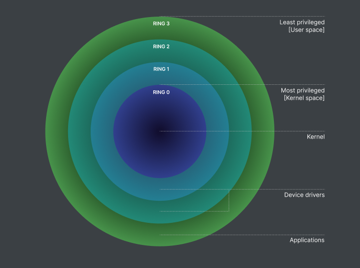

Title: OS API와 Overhead의 이해
Date: 2024-12-16 13:52
Modified: 2024-12-16 14:47
Tags: backend, performance
Author: 박이삭
Category: performance
Summary: OS API Overhead


## **Kernel space explained (Win32 kernel as example)**

- **OS 계층(유저, 권한 등):** 현대 시스템은 프로세스를 사용자 모드(ring 3)와 커널 모드(ring 0)로 분리합니다. 사용자 모드는 하드웨어 접근에 제한이 있으며, 특권 명령은 커널 모드를 통해 수행됩니다. 이런 구조는 장애 격리와 보안을 강화합니다.
    
    
    
- **Syscall 함수 테이블(IDT 또는 SSDT):** Windows에서는 시스템 호출이 SSDT(System Service Descriptor Table)를 통해 라우팅됩니다. CPU는 `syscall` 같은 특수 명령 또는 인터럽트 게이트를 사용하여 커널로 제어를 전환하고, 각각의 syscall은 고유한 인덱스를 갖습니다.
    
    
    
    
    
- **커널 객체(Win32):** 프로세스, 스레드, 이벤트, 파일 등은 Windows에서 ‘객체’로 관리됩니다. 각 객체는 커널이 참조 카운트와 권한을 추적해 안전한 액세스와 해제를 보장합니다.
    
    
    
- **드라이버(IRP 등):** 디바이스 드라이버는 커널 모드에서 동작하며 I/O 요청을 IRP(I/O Request Packet)로 처리합니다. IRP는 읽기·쓰기·제어 요청을 표준화해 다양한 드라이버가 동일한 방식으로 I/O를 다루도록 해줍니다.
    
    
    

## **User-Kernel Boundary Crossing**

- **모드 스위치:** 사용자 모드에서 커널 모드로의 전환은 레지스터 저장, CPU 상태 업데이트 전환 등 추가 비용이 소요됩니다.
    - 레지스터 저장
    - CPU 상태 업데이트(privilege)
    - 함수 테이블 조회
    - (optional) Driver access
- **CPU 명령어(syscall 등):** 현대 CPU는 `syscall` / `sysenter` 같은 명령어로 사용자→커널 전환을 최적화하지만, 여전히 사용자 함수 호출보다는 비용이 높습니다.
    
    
    

## **Frequency of Calls and Work Done Per Call**

- **호출 빈도(Call Frequency):** tight loop에서 반복적으로 syscall을 호출하면, 경계 전환 비용이 누적되어 성능이 저하됩니다.
- **배칭과 버퍼링(Batching/Buffering):** 여러 작은 I/O 호출 대신 큰 덩어리로 읽거나 쓰면 syscall 횟수를 줄여 오버헤드를 감소시킬 수 있습니다.
- **호출 당 작업(Work Per Call):** 디스크에서 데이터를 많이 가져오는 syscall은 모드 스위치 비용이 상대적으로 작을 수 있지만, 아주 작은 작업을 자주 부르는 경우 오버헤드가 크게 느껴질 수 있습니다.

## **Mitigations and Best Practices**

- **Syscall 횟수 최소화:** 메모리 맵핑(file mapping)이나 대용량 일괄 읽기/쓰기로 경계 전환 횟수를 줄이는 전략이 중요합니다.
    
    
    
- **사용자 공간 대안:** 공유 메모리, 유저 모드 버퍼링, zero-copy 기법 등을 사용해 커널 호출을 피할 수 있는지 고려하세요.
    
    
    
- **프로파일링 및 측정:** `perf`, `strace`, Windows Performance Analyzer 등을 이용해 syscall 비중과 시간을 측정하면, 개선 지점을 정확히 파악할 수 있습니다.
- **커널 기능을 현명하게 활용:** 비동기 I/O(예: 윈도우 I/O 컴플리션 포트, 리눅스 io_uring), 이벤트·epoll 등은 동시에 많은 요청을 처리하는 데 유리합니다.
    
    
    

## **syscall (Win32) frequently used**

- **프로세스 & 스레드 관리:** `CreateProcess`, `CreateThread`, `TerminateProcess` 등은 커널 스케줄러 및 객체 관리자와 직접 상호 작용하기 때문에 너무 자주 생성·소멸하면 비용이 커집니다.
- **메모리:** `VirtualAlloc`, `VirtualFree`, `VirtualProtect`는 메모리 맵핑을 변경하고 페이지 속성을 수정합니다. 자주 호출보다 큰 단위로 묶어 사용하는 편이 유리합니다.
- **파일 I/O:** `CreateFile`, `ReadFile`, `WriteFile`, `CloseHandle` 등을 빈번히 호출하면 커널 전환이 누적됩니다. 비동기나 버퍼링 I/O로 최적화할 수 있습니다.
- **네트워크 I/O:** WinSock(`socket`, `connect`, `recv`, `send`)은 커널 레벨 드라이버를 거칩니다. Overlapped I/O나 비동기 방식으로 병목을 줄일 수 있습니다.
- **IPC:** Named pipe, mailslot, event, semaphore 같은 IPC 메커니즘도 모두 커널 객체에 접근합니다. 짧은 간격으로 반복되면 오버헤드가 늘어납니다.
- **디바이스:** `DeviceIoControl`은 드라이버에 제어 코드를 보내며, 하드웨어와 직접 상호 작용하므로 호출 비용이 클 수 있습니다.

## **Relative Cost and Performance Considerations**

- **Nanosecond to Microsecond Scale:** 시계열 함수 호출(`gettimeofday()`) 정도는 비교적 가볍지만, 여전히 순수 사용자 함수보다는 비쌉니다.
- **Microseconds to Milliseconds:** 파일 I/O나 IPC처럼 대기가 필요한 작업은 여러 하드웨어 레이턴시가 더해져 밀리초 단위까지 갈 수 있습니다.
- **Batching and Buffering:** syscall 호출을 한 번 줄일 때마다 경계 전환에 따르는 고정 비용을 절약하므로, 빈도를 크게 낮추는 것이 핵심 전략입니다.

| **Operation** | **Time Scale** |
| --- | --- |
| Single CPU instruction execution | 0.1 to 1 nanosecond (ns) |
| Level 1 (L1) cache access | 0.5 to 1 ns |
| Level 2 (L2) cache access | 3 to 10 ns |
| Branch mispredict penalty | 5 to 20 ns |
| Level 3 (L3) cache access | 10 to 20 ns |
| Main memory (RAM) access (memory miss) | 50 to 100 ns |
| Mutex lock/unlock | 25 to 50 ns (but can vary widely with contention) |
| Solid-State Drive (SSD) access | 50 to 150 microseconds (us) |
| Disk seek (Hard Drive) | 1 to 10 milliseconds (ms) (varies by drive type and age) |
| Round-Trip Time (RTT) in the same data center | 100 us to 1 ms |
| Sending 1KB packet over 1Gbps network | 10 us (not including propagation delays) |
| Round-Trip Time (RTT) on the Internet (cross-country) | 20 to 50 ms |
| Round-Trip Time (RTT) on the Internet (global/international) | 100 to 300 ms |
| Disk read (CD-ROM, older media) | 100 to 300 ms |

## **Why Knowing API Overhead Is Important for Python Developers**

- **주요 병목:** Python의 고수준 함수(`open()`, `read()`, `os.fork()` 등) 내부에서 syscall이 여러 번 발생할 수 있습니다. 이를 모르면 성능 저하 원인을 찾기 어려울 수 있습니다.
- **피해야 할 점:** 파일을 한 줄씩 읽는 식의 반복 접근은 syscall 빈도가 높아질 수 있습니다. 버퍼링이나 대량 읽기가 효율적입니다. 다만 python 라이브러리나 OS에서 IO를 기본으로 케싱 및 버퍼링을 하는 경우가 있으니 알고 최적화가 필요합니다.
- **주의 할 점**: 버퍼링과 대량읽기는 API의 빈도를 낮춰 syscall빈도는 최적화 할 수 있지만, 너무 큰 버퍼는 메모리 overhead가 발생할 수 있습니다. 두 최적 방법의 최적점을 찾는 것 이 중요합니다.
- **실무적 영향:** 라이브러리나 프레임워크에서도 syscall이 잦으면 성능이 떨어집니다. 어디서 syscall이 발생하는지 파악하고 줄이는 전략이 중요합니다.

## **API 최적화 실험**

API콜을 최소화 하는 방법을 테스트 해보려고 합니다. server와 client 프로세스가 동일 host에서 통신을 하여 그 시간을 재는 실험입니다. 언어는 C, macos에서 테스트 했습니다.

한 쪽은 System V message queue (`msgsnd`, `msgrcv`) IPC로 통신을 하고 매 통신마다 syscall이 발생하게 됩니다.

다른 한 쪽은 shared memory로 메모리 생성 및 연결 시 에만 syscall이 발생하고 공유된 메모리 상 서로의 동기화 방법으로 메시지를 통신합니다.

각 client, server는 increment되는 sequence 번호를 통신 정보로 합니다.

- shared_mem_client.c

```c
#include <stdio.h>
#include <stdlib.h>
#include <fcntl.h>    // O_RDWR
#include <sys/mman.h> // shm_open, mmap
#include <sys/stat.h> // For mode constants
#include <unistd.h>   // ftruncate, close

#define SHM_NAME   "/my_shm_example"
#define SHM_SIZE   sizeof(SharedData)

typedef struct {
    volatile int request_count;
    volatile int total_requests;
    volatile int ready_flag;
    volatile int done_flag;
} SharedData;

int main(int argc, char *argv[]) {
    if (argc != 2) {
        fprintf(stderr, "Usage: %s <num_requests>\n", argv[0]);
        return 1;
    }
    int num_requests = atoi(argv[1]);
    if (num_requests <= 0) {
        fprintf(stderr, "Invalid number of requests.\n");
        return 1;
    }

    // Open existing shared memory
    int fd = shm_open(SHM_NAME, O_RDWR, 0666);
    if (fd < 0) {
        perror("shm_open");
        return 1;
    }

    void *addr = mmap(NULL, SHM_SIZE, PROT_READ | PROT_WRITE, MAP_SHARED, fd, 0);
    if (addr == MAP_FAILED) {
        perror("mmap");
        return 1;
    }
    close(fd);

    SharedData *shared = (SharedData *)addr;

    // Signal server that client is ready
    shared->ready_flag = 1;

    printf("[Client] Sending %d requests...\n", num_requests);
    for (int i = 1; i <= num_requests; i++) {
        shared->request_count = i;
        // Simulate some small delay
        usleep(10);
    }

    // Wait for server to finish
    while (!shared->done_flag) {
        usleep(10);
    }

    printf("[Client] All requests done.\n");

    munmap(addr, SHM_SIZE);
    return 0;
}

```

- shared_mem_server.c

```c
#include <stdio.h>
#include <stdlib.h>
#include <fcntl.h>    // For O_* constants
#include <sys/mman.h> // shm_open, mmap
#include <sys/stat.h> // For mode constants
#include <unistd.h>   // ftruncate, close
#include <time.h>

#define SHM_NAME   "/my_shm_example"
#define SHM_SIZE   sizeof(SharedData)

typedef struct {
    volatile int request_count;   // Number of requests received
    volatile int total_requests;  // Target number of requests
    volatile int ready_flag;      // Indicates client has started
    volatile int done_flag;       // Indicates server has processed last request
} SharedData;

double get_time_seconds(void) {
    struct timespec ts;
    clock_gettime(CLOCK_MONOTONIC, &ts);
    return ts.tv_sec + ts.tv_nsec / 1e9;
}

int main(int argc, char *argv[]) {
    if (argc != 2) {
        fprintf(stderr, "Usage: %s <num_requests>\n", argv[0]);
        return 1;
    }
    int num_requests = atoi(argv[1]);
    if (num_requests <= 0) {
        fprintf(stderr, "Invalid number of requests.\n");
        return 1;
    }

    // Create & initialize shared memory
    int fd = shm_open(SHM_NAME, O_CREAT | O_RDWR, 0666);
    if (fd < 0) {
        perror("shm_open");
        return 1;
    }
    if (ftruncate(fd, SHM_SIZE) < 0) {
        perror("ftruncate");
        return 1;
    }

    void *addr = mmap(NULL, SHM_SIZE, PROT_READ | PROT_WRITE, MAP_SHARED, fd, 0);
    if (addr == MAP_FAILED) {
        perror("mmap");
        return 1;
    }
    close(fd);

    SharedData *shared = (SharedData *)addr;
    shared->request_count = 0;
    shared->total_requests = num_requests;
    shared->ready_flag = 0;
    shared->done_flag = 0;

    printf("[Server] Waiting for client to start...\n");

    // Wait until client signals readiness
    while (!shared->ready_flag) {
        // busy-wait
        usleep(10);
    }

    printf("[Server] Client connected. Expecting %d requests.\n", num_requests);

    double t_start = 0;
    double t_end   = 0;
    int first_request_seen = 0;

    // Process requests
    while (1) {
        int current_count = shared->request_count;
        if (current_count > 0 && !first_request_seen) {
            t_start = get_time_seconds();
            first_request_seen = 1;
        }
        if (current_count >= num_requests) {
            t_end = get_time_seconds();
            break;
        }
        usleep(10); // small sleep to reduce CPU usage in busy loop
    }

    shared->done_flag = 1;

    double elapsed = t_end - t_start;
    printf("[Server] Received %d requests. Total time: %.6f seconds\n",
            num_requests, elapsed);

    // Cleanup
    munmap(addr, SHM_SIZE);
    shm_unlink(SHM_NAME); // remove shared memory

    return 0;
}

```

- ipc_client.c

```c
#include <stdio.h>
#include <stdlib.h>
#include <sys/ipc.h>
#include <sys/msg.h>
#include <unistd.h>
#include <string.h>

#define MSG_KEY  0x1234
#define MSG_TYPE 1

typedef struct {
    long mtype;
    int  sequence;
} MsgData;

int main(int argc, char *argv[]) {
    if (argc != 2) {
        fprintf(stderr, "Usage: %s <num_requests>\n", argv[0]);
        return 1;
    }
    int num_requests = atoi(argv[1]);
    if (num_requests <= 0) {
        fprintf(stderr, "Invalid number of requests.\n");
        return 1;
    }

    int msqid = msgget(MSG_KEY, 0666);
    if (msqid == -1) {
        perror("msgget");
        return 1;
    }

    printf("[Client] Sending %d messages...\n", num_requests);

    for (int i = 1; i <= num_requests; i++) {
        MsgData msg;
        msg.mtype = MSG_TYPE;
        msg.sequence = i;
        if (msgsnd(msqid, &msg, sizeof(msg.sequence), 0) == -1) {
            perror("msgsnd");
            return 1;
        }
        // Some small delay
        usleep(1000);
    }

    printf("[Client] All messages sent.\n");
    return 0;
}

```

- ipc_server.c

```c
#include <stdio.h>
#include <stdlib.h>
#include <sys/ipc.h>
#include <sys/msg.h>
#include <time.h>
#include <unistd.h>
#include <string.h>

#define MSG_KEY     0x1234
#define MSG_TYPE    1

typedef struct {
    long mtype;
    int  sequence;
} MsgData;

double get_time_seconds(void) {
    struct timespec ts;
    clock_gettime(CLOCK_MONOTONIC, &ts);
    return ts.tv_sec + ts.tv_nsec / 1e9;
}

int main(int argc, char *argv[]) {
    if (argc != 2) {
        fprintf(stderr, "Usage: %s <num_requests>\n", argv[0]);
        return 1;
    }
    int num_requests = atoi(argv[1]);
    if (num_requests <= 0) {
        fprintf(stderr, "Invalid number of requests.\n");
        return 1;
    }

    // Create message queue
    int msqid = msgget(MSG_KEY, IPC_CREAT | 0666);
    if (msqid == -1) {
        perror("msgget");
        return 1;
    }

    printf("[Server] Waiting for %d messages...\n", num_requests);

    double t_start = 0;
    double t_end   = 0;
    int first_msg_received = 0;
    int count = 0;

    while (count < num_requests) {
        MsgData msg;
        if (msgrcv(msqid, &msg, sizeof(msg.sequence), MSG_TYPE, 0) == -1) {
            perror("msgrcv");
            return 1;
        }

        if (!first_msg_received) {
            t_start = get_time_seconds();
            first_msg_received = 1;
        }

        count++;
    }

    t_end = get_time_seconds();
    double elapsed = t_end - t_start;
    printf("[Server] Received %d messages. Total time: %.6f seconds\n", num_requests, elapsed);

    // Cleanup
    if (msgctl(msqid, IPC_RMID, NULL) == -1) {
        perror("msgctl");
        return 1;
    }

    return 0;
}

```

- Makefile

```makefile
CC = gcc
CFLAGS = -Wall -O2

all: shared_mem_server shared_mem_client ipc_server ipc_client

shared_mem_server: shared_mem_server.c
    $(CC) $(CFLAGS) -o shared_mem_server shared_mem_server.c

shared_mem_client: shared_mem_client.c
    $(CC) $(CFLAGS) -o shared_mem_client shared_mem_client.c

ipc_server: ipc_server.c
    $(CC) $(CFLAGS) -o ipc_server ipc_server.c

ipc_client: ipc_client.c
    $(CC) $(CFLAGS) -o ipc_client ipc_client.c

clean:
    rm -f shared_mem_server shared_mem_client ipc_server ipc_client

```


### 테스트 실행:

```bash
# 빌드
make

# ipc server
./ipc_server 10000 &

# ipc client
./ipc_client 10000

# shared memory server
./shared_mem_server 10000 &

# shared memory client
./shared_mem_client 10000
```

### 결과:


단적인 케이스이지만 shared memory사용 시 System V Message queue보다 약 85배 속도 개선이 있었습니다.

## **Summary**

OS API 호출은 모드 스위치와 기타 비용 때문에 상대적으로 무겁습니다. 호출 횟수를 줄이거나 일괄 처리, 비동기 I/O 등을 활용하면 성능을 높일 수 있습니다. Python처럼 고수준 언어에서도 제대로 프로파일링하여 syscall 오버헤드를 줄이는 방법을 익혀둬야 합니다.