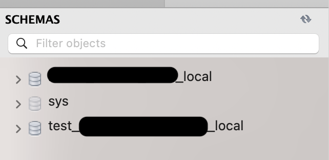

Title: pytest in python
Date: 2024-01-08 06:15
Modified: 2024-01-15 03:20
Category: backend
Tags: CI, backend, django, git, python, pytest
Author: Isaac Park
Summary: pytest in python


## 🗂️목차

---

## 🎯Abstract

이번 포스팅에서는 pytest 구성 및 활용 방법을 소개합니다.

특히, 데이터베이스와 연관된 테스트 자동화가 어떤 영향을 미치는지, 이를 어떻게 설계하고 실행하는지에 대해 다룹니다.

테스트 실행 방법과 커스터마이징 방식에 대해서도 설명하며, 이미 구현된 커버리지 테스트의 실행 방법과 관련된 아이디어를 공유합니다.

또한, Github Actions를 활용한 CI 테스트 자동화 스크립트 구현 과정을 소개합니다. PR 생성 시 필수 머지 조건 설정 방법과 스크립트 수정 가능성에 대해서도 설명합니다.


## ⚙️PyTest

### pytest를 선택한 이유

Python에서 테스트를 작성할 때 주로 사용하는 라이브러리로는 pytest와 unittest가 있습니다.

pytest는 3rd-party 라이브러리로, 다양한 기능과 최신 IDE와의 뛰어난 호환성을 제공합니다.
unittest는 Python 표준 라이브러리의 일부로, JUnit(Java unit-test) 스타일의 구조를 따릅니다. 직관적이고 간단한 사용법이 장점입니다.
두 라이브러리는 기본적으로 유사한 기능을 제공하지만, pytest는 hook이나 scope fixture 등 더 복잡하고 유연한 기능을 지원합니다.

제가 pytest를 선택한 이유는 다음과 같습니다:

많은 Python 오픈소스 커뮤니티가 pytest를 표준으로 채택하고 있습니다.
미래의 확장성과 유지보수를 고려한 future-proof 선택이기 때문입니다.

### framework or vanilla approach

테스트를 설계할 때, 라이브러리를 기반으로 맞춤형 테스트 framework를 구축하는 경우가 종종 있습니다. 예를 들어, Win32 API를 기반으로 MFC를 구축하는 것처럼, pytest를 기반으로 서비스에 적합한 맞춤형 framework를 만들어 재활용성과 추상화를 통해 생산성을 높일 수 있습니다.

하지만 이러한 framework 접근법에는 몇 가지 한계가 존재합니다:

Framework 자체 테스트 필요성
Framework를 만들다 보면 그 자체를 테스트해야 하는 상황이 발생합니다. 이 과정에서 테스트 코드에 버그가 숨어 있어도 이를 발견하기 어려울 수 있습니다.

문서화의 부족
특히 처음 framework를 접하는 개발자들에게, 문서화가 부족한 framework는 적용 및 학습의 큰 장벽이 될 수 있습니다. 이러한 문제는 종종 맞춤형 테스트 framework에서도 발견됩니다.

그래서 선택한 Vanilla Approach
이런 이유로, 가능한 한 pytest의 기본 기능을 최대한 활용하고, 반복적으로 사용되는 boilerplate 코드는 helper로 분리하는 vanilla approach를 채택했습니다.

이 접근법은 간단하고 직관적이며, 추가적인 학습 없이도 pytest의 기본 문서만으로 테스트를 이해하고 작성할 수 있는 장점이 있습니다.
미래의 확장성
테스트가 점점 복잡해지고 양이 증가하면서 발생하는 문제는 다음과 같은 방법을 통해 해결할 수 있습니다:

MSA(Microservices Architecture)로 도메인 분리
테스트 범위를 줄이고 독립성을 강화할 수 있습니다.
기타 새로운 방법론 도입
프로젝트의 성장과 함께 보다 적합한 도구나 설계를 고려할 필요가 있습니다.

### fixture and scope

pytest fixture는 테스트 간 공유되는 setup이라고 생각하시면 됩니다. constructor와 destructor가 있어, 필요 시 실행 시 생성되는 코드, 종료 시 제거되는 코드를 정의 할 수 있습니다.

```python
@pytest.fixture
def Senior():
	return Student(type=STUDENT.SENIOR)
```

```python
@pytest.fixture
def foo():
	# constructor
	util_obj = Uitls()

	# yield return
	yield util_obj

	# destructor
	util_obj.delete()
```

fixture에는 scope이란 용어로 테스트간 공유되는 범위를 지정할 수 있습니다.

scope에 따라 범위기준으로 fixture가 재활용될지, 다시 생성할 지 결정됩니다.

**scope**:

- function: 기본값, 미지정 시 기본설정, 함수 시작 전후로 리셋 됨
- class: class간 재활용되는 scope
- module
- package
- session: 전체 테스트 세션에 공유됨, global scope이라고 볼 수 있음, multi processing으로 test run시 여러 session이 있을 수 있음

```python
@pytest.fixture(scope='session')
def sess():
	# global initialization here
	...
```

```python
import pytest

@pytest.fixture(scope='class')
def setup():
	# setup class here
	yeild
	# tear down class here

# fixture를 parameter사용하지 않고 적용하는 방법
@pytest.mark.usefixtures('setup')
class TestClass1:
	# 모든 test method가 실행 전에 setup 실행
	# 모든 test method 종료 후 tear down 부분 실행

	def test_case1(self):
		pass

	def test_case2(self):
		pass
```

**reference**:

테스트가 fixture를 사용하는법은 아래와 같습니다.

```python
@pytest.fixture
def foo():
	return 'Hello'

def test_baa(foo):
	print(foo)
	# 'Hello' 출력
```

fixture는 꼭 같은 module서 정의될 필요 없습니다.

다른 모듈에서 정의 후 import 후 사용 가능합니다.

```python
# 위치: foo.py
@pytest.fixture
def foo():
	return 'Hello'
```

```python
# 위치: bar.py
from foo impor foo

def test_bar(foo):
	print(foo)
	# 'Hello' 출력
```

pytest는 hook이나 공용 fixture를 명시 할 수 있는 특별 모듈이 있습니다.

`conftest.py`이름의 파일 아래 모든 모듈은 import없이 해당 파일 내 모든 fixture 접근이 가능합니다. 이를 fixture discovery라고 합니다.

```python
# 위치: tests/conftest.py
import pytest

@pytest.fixture
def foo():
	return 'foo'
```

```python
# 위치: tests/bar.py
# import 불필요

def test_bar(foo):
	print(foo)
	# 'foo' 출력
```

conftest.py파일을 root directory에 지정 시 해당 파일 내 모든 hook이나 fixture는 모든 테스트에 적용됩니다. hook function에 관한 내용은 아래 설명 참고 바랍니다.

**autouse**:

autouse는 fixture를 reference할 수 있는 모든 test에 별도 각각 명시할 필요 없이 자동으로 적용됩니다.

conftest.py에 명시된 fixture에 autouse=True할 시 해당 디렉토리 내 모든 테스트에는 그 fixture가 자동 적용됩니다.

```python
# 위치: tests/conftest.py

import pytest

@pytest.fixture(autouse=True)
def foo():
	print('foo')
```

```python
# 위치: tests/app/test_app.py

def test_bar():
	# 여기서 'foo' 출력
	print('bar')
	# 'bar' 출력
```

scope이 session이고 autouse=True 일시 모든 접근가능한 테스트에 해당 fixture가 자동 적용되면서 공유되어 singleton 같은 효과를 얻을 수 있습니다. 단 database관련 singleton화는 transaction에 의해 영향을 받아  이슈가 발생할 수 있습니다(test와 transaction관련은 아래 참고).

### mark

pytest.mark기능은 테스트에 커스텀 특징을 설정할 수 있습니다.

**pytest.mark.usefixtures:** 

parameter사용하지 않고 fixture를 테스트에 적용 할 수 있습니다.

```python
@pytest.mark.usefixtures('foo')
def test_bar():
	# foo fixture starts here
	...
```

**pytest.mark.skip:**

테스트코드를 유지한체 실행 시 테스트를 생략할 수 있습니다

```python
@pytest.mark.skip(reason='호환성 이슈')
def test_foo():
	# skipped during test run
	...
```

**pytest.mark.parametrize:**

동일 테스트를 다른 파라미터 조건으로 테스트 케이스 생성이 가능합니다

```python
@pytest.mark.parametrize(
		('cond', 'expected'),
		[(True, True), (False, False)])
def test_always_true(cond, expected):
	# True == True 와 False == False 두 테스트가 실행 됨
	assert cond == expected
```

**pytest.mark.django_db:**

django ORM을 접근하기 위해 필요한 mark입니다. pytest-django pakcage의 커스텀 mark입니다.

pytest와 database관련해서는 아래 참고 바람

```python
@pytest.mark.django_db
def test_user():
	user = MedicalStaffFactory()
	user.delete()
```

### assert

테스트 함수 내 동작결과가 원하게 동작했는지 실패처리해야할 지를 명시하는 방법입니다.

**기본사용법**

```python
def test_foo():
	assert True is True    # 성공
	assert True is False   # 실패, test run에서 실패 및 error message
	assert True is False, 'reason here'
```

**exception**

```python
import pytest

def test_exception():
	d = {}
	with pytest.raises(KeyError):  # 성공
		a = d['a']
```

### mocker

mocker는 테스트 시 일부 모듈이나 3rd party라이브러리의 행위를 조종할 수 있게 합니다.

복잡한 내부 로직을 생략하거나, 호출되면 안되는(예시: twilo API 호출) 3rd party 라이브러리를 실제로 호출하지 않고 호출 된걸로 간주하게 하여 기존 코드 수정없이 해당 로직을 테스트 할 수 있습니다.

mocker는 반환값을 변환시키거나, 입력값이 무엇인지 알 수 있고, 호출여부, 호출개수 도 알 수 있습니다.

pytest의 기본 mock기능 도 있지만 여기서는 pytest-mocker 패키지의 mocker라는 fixture를 사용합니다.

**return 값 변경:**

아래처럼 지정 모듈의 클라스, 함수까지 반환값을 변환 할 수 있습니다.

```python
# 위치: myapp/tests/test_serializers.py
def test_check_token_fail(self, user, mocker):
    uid_b64 = base64.urlsafe_b64encode(str(user.id).encode()).decode('utf-8')
    token = TokenGenerator().make_token(user)
    serializer = PasswordResetSerializer(data={
        'password': 'newpassword',
        'token': token,
        'uid_b64': uid_b64,
    })

    mocker.patch('myapp.serializers.TokenGenerator.check_token', return_value=False)
    with pytest.raises(AuthenticationError) as e:
        serializer.is_valid(raise_exception=True)
    assert e.value.args[0] == 'The reset link is invalid'
    assert e.value.args[1] == 401

# 위치: myapp/serializers.py
from some_library.tokens import TokenGenerator  # 이거를 mock
...
class PasswordResetSerializer(serializers.Serializer):

    def validate(self, attr):
        ...
        if not TokenGenerator().check_token(user, token):
            raise AuthenticationError('The reset link is invalid', 401)
        ...
```

**함수 호출정보 확인:**

아래 처럼 지정 함수의 호출여부와 어떤 파라미터가 입력 됐는지도 확인 할 수 있습니다.

```python
# 위치: myapp/tests/test_views.py
@pytest.mark.django_db()
@pytest.mark.usefixtures('auth_token')
class TestResetEmailWithTokenView:

    def test_reset_email_with_token(self, user, api_client, mocker):

        # 테스트 데이터 설정
        url = reverse('reset-email-with-token')
        acc_token, _ = generate_new_tokens('web-client', user.id)
        headers = {'Authorization': f'Bearer {acc_token}'}

        mock_serializer = mocker.patch('myapp.views.ResetEmailWithTokenView.serializer_class')
        mock_serializer.is_valid.return_value = True
        mock_serializer.data.return_value = {}

        # 요청 전송
        resp = api_client.post(url, {}, **headers)
        assert resp.status_code == status.HTTP_200_OK

        # is_valid 파라미터 확인
        assert mock_serializer.call_count == 1
        assert mock_serializer.call_args[1]['context']['request'].user == user

# 위치: myapp/views.py
class ResetEmailWithTokenView(generics.GenericAPIView):
    serializer_class = ResetEmailWithTokenSerializer
    renderer_classes = (CustomResultRenderer, )

    def post(self, request):
        serializer = self.serializer_class(data=request.data, context={"request": request})
        serializer.is_valid(raise_exception=True)
        return Response(serializer.data, status=status.HTTP_200_OK)
```

### unittest와의 호환성

pytest는 기본적으로 python unittest, nose 테스트가 100% 호환됩니다. 테스트 작성을 unittest 사용하고 싶으시면 가능합니다.

### 테스트 discovery

pytest는 설정으로 테스트 함수를 자동으로 찾게 됩니다.

여기서는 `pytest.ini`파일에 기본설정이 있고 pytest도 참고하게 됩니다.

```python
[pytest]
DJANGO_SETTINGS_MODULE=myapp.settings
addopts = --reuse-db --disable-warnings --nomigrations
python_files = test*.py
python_functions = test*
```

기본 설정으로는 `test*.py` 패턴의 파일명 모듈을 자동으로 찾습니다.

pytest 기본값으로 `Test*` 패턴의 class를 찾거나 설정으로 `test*` 패턴의 함수를 찾습니다.

```python
# 위치: myapp/tests/test_serializers.py
class TestTokenAuthenticationSerializer:
    def test_validate(self, user):
        ...
```

### reference

최대한 구현된 테스트 범위로 설명을 국한했습니다.

더 자세한 사용법은 [공식문서](https://docs.pytest.org/en/latest/index.html) 참고 부탁드립니다.

## 🗄️Django와 database관련

django의 기능을 pytest서 사용하여 테스트하기 위해 `pytest-django` 패키지를 사용합니다.

django ORM을 사용하기 위해서는 django test에서는 기본으로 test database를 생성하여 default database와 분리하게 됩니다.



pytest서 생성된 test_*****_local schema

모든 django database관련 테스트는 transaction이 걸리게 됩니다.

test function 혹은 class, module 마다 transaction이 rollback(혹은 trauncate) 되며
다른 테스트와 isolation을 지원합니다.

django ORM사용 테스트는 아래 mark를 적용해야 동작합니다.

```python
# 함수에 django_db 적용
@pytest.mark.django_db
def test_foo():
	# some database access here
  ...

# class에 django_db 적용
@pytest.mark.django_db
class TestCase1:
		def test_foo(self):
				passs
```

```python
# 모듈 전체 django_db 적용
pytestmark = pytest.mark.django_db

# test code here
...
```

### 기본 실행 설정

아래 처럼 디비관련 기본 실행 옵션은 `—-reuse-db —-nomigrations`입니다.

```python
[pytest]
DJANGO_SETTINGS_MODULE=myapp.settings
addopts = --reuse-db --disable-warnings --nomigrations
python_files = test*.py
python_functions = test*
```

속도 때문에 test디비를 매번 재생성, 마이그레이션 하지 않고 재사용하고 있습니다.

혹시 테스트 중 데이터베이스에 남은 데이터가 있어 충돌이 나거나, 마이그레이션에 문제가 있을 경우, 혹은 새로 추가 된 마이그레이션을 적용 하기 위해서는  아래 명령어로 디비 재생성이 필요합니다.

```bash
$ pytest --create-db --migrations
```

## 🪨Custom Fixtures

### mem_cache : fixture

pytest(or unittest)는 cache isolation을 지원하지 않습니다. 즉 redis가 동일하게 사용됩니다.

pytest hook으로 테스트 실행 시 모든 redis 케시를 지우긴 하지만 테스트 간에 케시가 자동으로 원복되지 않기 때문에 테스트에서 생성 된 케시로 인해 다른 테스트에서 단독 실행 시 문제없던 코드가 같이 돌릴 시 예상치 못한 이슈를 발생하게 됩니다.

이를 방지 하기 위해서 in-memory cache를 사용해 isolation을 구축하였습니다.

```python
# 위치: myapp/tests/fixtures.py

@pytest.fixture()
def mem_cache():    # noqa
    # in-memory cache to isolate cache between tests
    # also isolates cache between processes, due to it allows one process to access the cache at a time
    with override_settings(CACHES={'default': {'BACKEND': 'django.core.cache.backends.locmem.LocMemCache'}}):
        cache.clear()
        yield
        cache.clear()

# 위치: myapp/tests/test_models.py

# using in-memory cache to isolate cache between tests
@pytest.mark.django_db()
@pytest.mark.usefixtures('mem_cache')
class TestMyModel:

    def test_cache_key_generation(self):
        # Create an instance of the model
        my_instance = MyModelFactory()

        # Cache key
        key = f'cache_key_prefix:model:{my_instance.id}'

        # Assert that the cache key is set correctly
        assert my_instance.cache_key == key
```


위 예제 처럼, 케시를 사용하는 테스트 케이스들은 `mem_cache` fixutre를 사용하는걸 권장합니다.

redis 기능이 꼭 필요하다면 테스트 전 후 로 매번 clear를 해주시길 바랍니다.


## 👀code coverage

코드 커버리지란 테스트 코드가 커버하는 코드의 수치화를 말합니다. instrument tool로 테스트 진행 시 실행되는 코드를 기록합니다. 커버리지 방법에 따라 다른 기준으로 코드의 커버된 여부를 결정하게 되고, 보고로 커버된 코드의 줄 수를 수치로 확인 할 수 있습니다.

이로 인해 테스트를 못한 코드가 어디인지 전체 코드 중 얼마나 테스트를 커버 못했는지 확인 할 수 있습니다.


coverage 테스트 출력 예시

코드 커버리지 방법론 중 가장 많이 사용되는 방법은 line coverage입니다. 코드 줄이 실행 될 경우 테스트가 됐다고 가정하는 것입니다.

다른 방법론으로는 branch coverage입니다. condition이 있는 코드 중 모든 true false 조건이 다 실행되어야 해당 code block이 실행됐다고 가정하는 방법입니다.

저희는 가장 기본으로 line coverage방법론을 사용하고 있습니다(pytest-coverage 기본값).

추 후 커버리지가 충분히 올라오고, 좀 더 엄격한 기준을 적용할 수 있을 때 다른 커버리지 방법을 사용하는것을 권장합니다.

ref: [https://tecoble.techcourse.co.kr/post/2020-10-24-code-coverage/](https://tecoble.techcourse.co.kr/post/2020-10-24-code-coverage/)


## 👥테스트 문화 및 정책

테스트 문화를 강화하기 위해 PR에 추가된 코드에 대한 테스트 케이스 작성을 필수화하고자 합니다. PR에 포함된 코드 변경 사항에 대해 테스트 케이스를 작성하거나 기존 테스트를 수정하여 점진적으로 테스트 커버리지를 늘리는 것을 목표로 합니다.

GitHub Actions를 통해 모든 테스트를 통과한 경우에만 PR 병합을 허용하며, 이를 완전히 적용하기 위한 적응 기간을 정합니다.

초기 커버리지 기준을 정하고, 점차 상향하여 전체 테스트 커버리지를 지속적으로 개선합니다.

테스트 코드 작성이 누락된 경우, 코드 커버리지가 낮아져 모든 테스트가 통과하더라도 GitHub Actions에서 실패 처리되므로 자연스럽게 테스트 작성 문화를 장려할 수 있습니다.

## 🏃실행방법

### Prerequisite

테스트 디비를 생성하기 때문에 디비 user의 권한설정이 필요합니다.

```sql
> GRANT ALL PRIVILEGES ON *.* TO 'user'@'%' WITH GRANT OPTION; FLUSH PRIVILEGES;
```

`requirements..txt` 설치

```bash
pip install -r requirements..txt
```

### 기본 테스트

```bash
# 기본 실행
pytest

# 특정 테스트 파일 실행
pytest myapp/tests/test_models.py
pytest myapp/tests/test_views.py::TestTokenGeneration::test_token_generation_permission_check

# 멀티 프로세싱 적용
pytest -n auto
```

관련 설정파일

- pytest.ini
- myapp/settings/pytest.py

기본 설정은 test 데이터베이스를 재사용한다.

혹시 테스트 중 데이터베이스 남은데이터가 있어 충돌이 나거나, 마이그레이션에 문제가 있을 경우 혹은 새로 추가된 마이그레이션을 적용 하기 위해서는 아래 명령어로 다시 디비생성이 필요합니다.

```sql
$ pytest --create-db --migrations
```

### 커버리지 테스트

line coverage를 기준으로 합니다. 
[코드 커버리지 관련브로그](https://tecoble.techcourse.co.kr/post/2020-10-24-code-coverage/)

```
# 전체 범위
$ pytest --cov=.

# 테스트 못한 코드 표시
$ pytest --cov-report term-missing --cov=

# 80% 커버리지 이하 시 exit 1(fail), CICD에서 많이 사용
$ pytest --cov=. --cov-fail-under=80
```


## ⛓️Github Action(CI)

github action script로 특정 이벤트 트리거로 자동 테스트를 실행 할 수 있습니다.

```yaml
name: Python Tests

on:
  push:
    branches:
      - main
  pull_request:
    branches:
      - main

jobs:
  test:
    runs-on: ubuntu-latest

    steps:
    - name: Checkout code
      uses: actions/checkout@v3

    - name: Set up Python
      uses: actions/setup-python@v4
      with:
        python-version: 3.9

    - name: Install dependencies
      run: |
        python -m pip install --upgrade pip
        pip install -r requirements.txt

    - name: Run tests with pytest
      run: |
        pytest --cov=myapp --cov-report=xml
```
