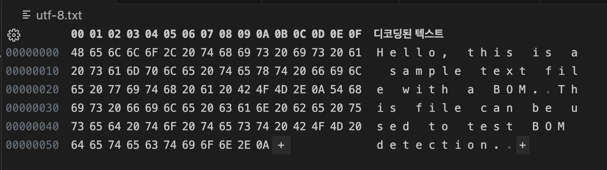

Title: Unicode Byte Order Mark(BOM)
Date: 2025-07-28 04:21
Modified: 2025-07-28 04:29
Tags: format, encoding, unicode
Author: 박이삭
Category: backend
Summary: Unicode BOM

---

텍스트 파일을 다루다 보면 가끔 인코딩 문제가 발생합니다. 특히 다국어 지원이나 크로스플랫폼 환경에서 Unicode 파일을 열 때, 파일의 시작에 숨어 있는 "Byte Order Mark(BOM)"가 그 원인이 될 수 있습니다. 오늘은 BOM이 무엇인지, 왜 필요한지, 그리고 어떻게 다루는지에 대해 자세히 알아보겠습니다. Python 예시를 중심으로 실무적인 팁도 공유하도록 하겠습니다.

## BOM의 소개

Byte Order Mark(BOM)는 Unicode 텍스트 파일의 시작에 삽입되는 특수한 바이트 시퀀스로, 파일의 인코딩 형식(예: UTF-8, UTF-16, UTF-32)과 바이트 순서(Endianness)를 나타냅니다. Unicode 표준에서 U+FEFF (Zero Width No-Break Space) 문자로 정의되어 있으며, 파일의 "서명(signature)" 역할을 합니다.

BOM은 1990년대 Unicode가 도입될 때부터 사용되었으며, 텍스트 에디터나 프로그램이 파일을 올바르게 해석할 수 있도록 돕습니다. 예를 들어, UTF-16 파일에서 빅 엔디안(Big Endian)과 리틀 엔디안(Little Endian)을 구분하는 데 필수적입니다.

## 목적

BOM의 주요 목적은 다음과 같습니다:

- **인코딩 자동 탐지**: 파일을 열 때 프로그램이 UTF-8인지 UTF-16인지 자동으로 판단할 수 있게 합니다.
- **바이트 순서 식별**: 멀티바이트 인코딩(UTF-16, UTF-32)에서 빅 엔디안(BE)과 리틀 엔디안(LE)을 구분합니다. 이는 CPU 아키텍처(예: Intel vs. PowerPC)에 따라 바이트 순서가 다를 수 있는 문제를 해결합니다.
- **호환성 향상**: 크로스플랫폼 환경에서 텍스트 파일의 일관성을 유지합니다.

없이 파일을 열면 인코딩을 추측해야 하므로 오해석(예: mojibake, 문자 깨짐)이 발생할 수 있습니다.

## Signature

BOM은 인코딩에 따라 고유한 바이트 시퀀스를 가집니다. 아래는 주요 인코딩의 BOM 시그니처입니다 (헥사(hex) 표기):

- **UTF-8**: `EF BB BF`
- **UTF-16 BE (Big Endian)**: `FE FF`
- **UTF-16 LE (Little Endian)**: `FF FE`
- **UTF-32 BE**: `00 00 FE FF`
- **UTF-32 LE**: `FF FE 00 00`

이 시그니처는 파일의 맨 앞에 위치하며, 텍스트로 보이지 않도록 설계되었습니다. 하지만 일부 환경에서 BOM이 보이거나 문제를 일으킬 수 있습니다.

## 사용법

BOM을 사용하는 방법은 간단합니다:

- **파일 생성 시 추가**: 텍스트 에디터(예: Notepad++)나 프로그래밍 라이브러리를 통해 파일을 저장할 때 "UTF-8 with BOM" 옵션을 선택합니다.
- **프로그램에서 삽입**: Python에서 파일을 쓸 때 BOM을 직접 추가할 수 있습니다.

예시 (Python에서 UTF-8 BOM 추가):

```python
with open('example.txt', 'w', encoding='utf-8-sig') as f:
    f.write('Hello, Unicode!')
```

여기서 'utf-8-sig' 인코딩은 BOM을 자동으로 추가합니다.

## 장점

BOM의 장점은 다음과 같습니다:

- **자동화**: 프로그램이 인코딩을 추측하지 않고 정확히 알 수 있어 오류를 줄입니다.
- **호환성**: Windows 같은 시스템에서 기본적으로 지원되어, 다국어 텍스트 처리에 유용합니다.
- **간단함**: 파일 헤더처럼 작동해 추가 메타데이터 없이 인코딩 정보를 전달합니다.

특히 대용량 텍스트 파일이나 국제화 프로젝트에서 유리합니다.

## 단점

반면 단점도 있습니다:

- **호환성 문제**: 일부 오래된 프로그램(예: PHP 스크립트)이나 UTF-8-only 시스템에서 BOM이 ""처럼 보이거나 에러를 유발합니다.
- **불필요한 오버헤드**: UTF-8에서 BOM이 필수가 아니므로, 파일 크기가 약간 증가하고(3바이트) XML/JSON 같은 형식에서 파싱 오류를 일으킬 수 있습니다.
- **탐지 어려움**: BOM을 무시하지 않으면 스크립트나 API에서 예기치 않은 문자로 처리될 수 있습니다.

이 때문에 일부 개발자들은 BOM을 피하고, 인코딩을 명시적으로 지정하는 것을 선호합니다.

## 탐지방법(예시, utf-8, utf-16, utf-32, both endian)

BOM을 탐지하는 방법은 다양합니다. 아래에서 UTF-8, UTF-16, UTF-32 (BE/LE 모두)의 예시를 중심으로 설명하겠습니다.

테스트 파일:

```
Hello, this is a sample text file with a BOM.
This file can be used to test BOM detection.

```

### hex viewer(to check raw bom)

헥스 에디터(예: HxD, Hex Fiend)를 사용해 파일의 raw 바이트를 확인합니다. 파일을 열고 처음 몇 바이트를 보면 BOM 시그니처가 보입니다.

- UTF-8: BOM 없는경우
    
    
    
- UTF-8: `EF BB BF`
    
    
    
- UTF-16 BE: `FE FF`
    
    
    
- UTF-16 LE: `FF FE`
    
    
    
- UTF-32 BE: `00 00 FE FF`
    
    
    
- UTF-32 LE: `FF FE 00 00`
    
    
    

이 방법은 가장 정확하지만, 수동적입니다.

### vscode(text editor)

VS Code에서 파일을 열고, 오른쪽 아래 상태바에서 인코딩을 확인합니다. "UTF-8 with BOM"으로 표시되면 BOM이 있습니다.


- 탐지 및 제거: 명령 팔레트(Ctrl+Shift+P)에서 "Change Encoding"을 검색해 "Reopen with Encoding"으로 BOM을 무시하거나, "Save with Encoding"으로 제거할 수 있습니다.
    
    
    
- 예시: UTF-16 LE 파일을 열면 자동으로 BOM을 인식하고 올바른 엔디안으로 표시합니다.

### python code detection(custom algorithm)

Python에서 직접 BOM을 체크하는 커스텀 코드를 작성할 수 있습니다. 파일을 바이너리 모드로 열고 처음 바이트를 검사합니다.

```python
def detect_bom(filename):
    with open(filename, 'rb') as f:
        raw = f.read(4)  # 최대 4바이트 (UTF-32)
        if raw.startswith(b'\\xEF\\xBB\\xBF'):
            return 'UTF-8'
        elif raw.startswith(b'\\xFE\\xFF'):
            return 'UTF-16 BE'
        elif raw.startswith(b'\\xFF\\xFE'):
            return 'UTF-16 LE'
        elif raw.startswith(b'\\x00\\x00\\xFE\\xFF'):
            return 'UTF-32 BE'
        elif raw.startswith(b'\\xFF\\xFE\\x00\\x00'):
            return 'UTF-32 LE'
        else:
            return 'No BOM'

print(detect_bom('example.txt'))

```

이 코드는 BE/LE 모두를 커버하며, 간단한 알고리즘으로 BOM을 탐지합니다.

### python library(charset-normalizer)

charset-normalizer 라이브러리를 사용하면 BOM을 포함한 인코딩을 자동 탐지합니다. pip install charset-normalizer로 설치하세요.

```python
from charset_normalizer import from_path

result = from_path('example.txt')
print(result.best().encoding)  # 예: 'utf-8' (BOM 고려)

```

이 라이브러리는 BOM 시그니처를 우선적으로 체크하며, 내용 분석도 병행합니다. UTF-8/16/32 모두 지원합니다.

## 읽는 방법

BOM이 있는 파일을 읽을 때, 인코딩을 올바르게 지정해야 합니다.

### python open with encoding parameter

Python의 open() 함수에서 encoding 파라미터를 사용해 BOM을 처리합니다. 'utf-8-sig'처럼 '-sig'를 붙이면 BOM을 자동으로 건너뜁니다.

```python
# BOM 무시하고 읽기
with open('example.txt', 'r', encoding='utf-8-sig') as f:
    content = f.read()
    print(content)  # BOM 없이 텍스트 출력

# UTF-16 예시
with open('example_utf16.txt', 'r', encoding='utf-16') as f:  # 자동 BOM 처리
    content = f.read()

# UTF-16-LE 예시
with open('example_utf16-le.txt', 'r', encoding='utf-16-le') as f:  # 자동 BOM 처리
    content = f.read()
```

이 방법으로 UTF-8, UTF-16, UTF-32 파일을 안전하게 읽을 수 있습니다. 엔디안은 BOM으로 자동 결정됩니다.

## 정리하며

BOM은 Unicode 파일의 인코딩과 바이트 순서를 명확히 하는 유용한 도구지만, 호환성 문제를 일으킬 수도 있습니다. 그러하여 사용자 업로드 txt, csv, html파일들은 읽기 전 필수로 인코딩을 확인해야 합니다.

추가로, Unicode Byte Order Mark(BOM) 외에도 다른 인코딩의 텍스트 파일이 존재하며, 이들은 별도의 시그니처나 BOM을 가지지 않는 경우가 많습니다. 예를 들어, 레거시 인코딩인 **ISO-8859-1 (Latin-1)**이나 **Windows-1252**는 BOM 없이 파일 내용으로 인코딩을 추정해야 합니다. 한국어 인코딩의 경우, **EUC-KR (Extended Unix Code for Korean, KS C 5601 기반)**과 **CP949 (IBM-949 또는 MS949, UHC로 알려짐)**는 한국어 텍스트를 위한 일반적인 인코딩으로, BOM이나 고유 시그니처가 없어 프로그램이 파일 내용을 분석하거나 명시적으로 지정해야 합니다. 이러한 인코딩들은 Unicode 이전 시대에 널리 사용되었으나, 오늘날에는 UTF-8로의 전환이 권장됩니다.