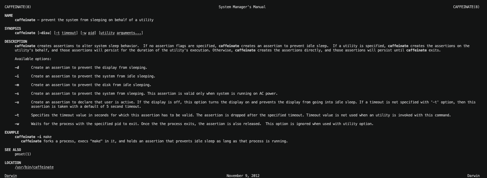
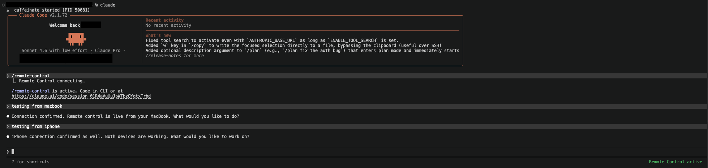

Title: 맥북 화면 잠금 + 원격 제어: Claude Code 무인 실행 가이드
Date: 2026-03-09 19:00
Modified: 2026-03-10 11:39
Category: agent
Tags: ai, tools, macbook
Author: Isaac Park
Summary: MacBook을 잠금 상태로 두면서 Claude Code를 계속 실행하고, 스마트폰으로 원격 제어하는 방법을 caffeinate와 Remote Control로 구성하는 가이드.

---

MacBook을 잠금 상태로 두고 자리를 비울 때, Claude Code가 계속 작동하게 하고 싶었습니다. 보안을 위해 화면은 잠가야 하지만, 동시에 Claude Code는 계속 실행되어야 하고, 스마트폰으로 진행 상황을 모니터링하거나 방향을 지시하고 싶었습니다.

이 글은 그 문제를 해결한 과정을 정리합니다.

---

## 0. 문제 정의

상황은 이렇습니다.

* MacBook의 화면을 잠그면 시스템이 유휴 상태로 판단하고 슬립에 진입합니다
* Claude Code는 슬립 진입 시 실행이 멈춥니다
* 자리를 비운 사이 Claude가 아무것도 하지 않았다는 걸 돌아와서 확인하는 상황이 반복됩니다
* 화면 잠금 해제 없이 스마트폰으로 Claude에게 지시를 내리거나 권한을 승인하고 싶습니다
* 동시에 여러 Claude Code 세션이 실행될 수 도 있습니다.

해결 방향은 세 가지입니다.

1. `caffeinate`로 MacBook 슬립을 방지한다
2. 래퍼 스크립트와 `SessionStart` 훅으로 caffeinate 생명주기를 관리한다
3. Claude Code Remote Control로 스마트폰에서 세션에 접속한다

---

## 1. MacBook 슬립 방지: caffeinate

### 1.1 caffeinate란?

`caffeinate`는 macOS에 기본 내장된 커맨드라인 도구입니다. 이름 그대로 "카페인을 주입해 잠들지 못하게 한다"는 의미입니다.

```bash
man caffeinate
```



주요 플래그는 아래와 같습니다.

* `-i`: 유휴 슬립(idle sleep) 방지. 시스템이 사용되지 않는다고 판단해도 슬립하지 않습니다
* `-d`: 디스플레이 슬립 방지
* `-s`: 시스템 슬립 방지 (전원 연결 상태에서만 유효)
* `-t <초>`: 지정 시간 후 자동 종료

화면은 잠기되 프로세스는 계속 실행되어야 하는 우리 목적에는 `-i` 플래그가 적합합니다. 화면을 잠그는 것(lock screen)과 시스템이 슬립에 진입하는 것은 다른 개념입니다. `-i`는 전자는 허용하면서 후자만 막습니다.

### 1.2 단순 사용법

```bash
# 슬립 방지 시작 (Ctrl+C로 종료)
caffeinate -i

# 백그라운드 실행
caffeinate -i &

# PID 확인
echo $!
```

문제는 Claude Code를 시작하고 종료할 때마다 수동으로 caffeinate를 관리해야 한다는 점입니다. 자동화가 필요합니다.

---

## 2. 자동화: 래퍼 스크립트와 SessionStart 훅

caffeinate를 자동으로 시작하고 종료하기 위해 두 가지 레이어를 사용합니다.

* **래퍼 스크립트**: Claude Code 실행 전후의 생명주기를 담당합니다
* **SessionStart 훅**: 세션 재개, `/clear`, 컴팩션 후 caffeinate가 죽어있을 경우를 대비한 안전망입니다

두 레이어 모두 PID 파일(`/tmp/claude_caffeinate.pid`)을 통해 중복 실행을 방지합니다.

### 2.1 SessionStart 훅 스크립트

`~/.claude/hooks/caffeinate-start.sh`를 생성합니다.

```bash
#!/bin/bash

# PID 파일이 존재하고, 해당 프로세스가 실제로 caffeinate인지 확인
if [ -f /tmp/claude_caffeinate.pid ]; then
  existing_pid=$(cat /tmp/claude_caffeinate.pid)
  if ps -p "$existing_pid" -o args= 2>/dev/null | grep -q "caffeinate"; then
    echo "☕ caffeinate already running (PID $existing_pid), skipping"
    exit 0
  fi
fi

# 새로 caffeinate 시작
nohup caffeinate -i > /dev/null 2>&1 &
echo $! > /tmp/claude_caffeinate.pid
echo "☕ caffeinate started (PID $!)"
```

실행 권한을 부여합니다.

```bash
chmod +x ~/.claude/hooks/caffeinate-start.sh
```

### 2.2 훅 등록

`~/.claude/settings.json`에 훅을 등록합니다.

```json
{
  "hooks": {
    "SessionStart": [
      {
        "hooks": [
          {
            "type": "command",
            "command": "~/.claude/hooks/caffeinate-start.sh"
          }
        ]
      }
    ]
  }
}
```

`SessionStart`는 `startup`, `resume`, `/clear`, `compact` 이후 모두 발생합니다. 따라서 어떤 상황에서든 caffeinate가 살아있지 않으면 새로 시작합니다.

### 2.3 래퍼 스크립트

`~/claude-launch.sh`를 생성합니다.

래퍼 스크립트가 처리하는 시나리오는 다음과 같습니다.

**실행 전:**
PID 파일이 없거나 프로세스가 죽어있으면 caffeinate를 새로 시작합니다. 이미 실행 중이라면 건너뜁니다 (다른 Claude Code 세션이 이미 caffeinate를 관리 중인 경우).

**종료 후:**
다른 Claude Code 세션이 아직 실행 중이라면 caffeinate를 그대로 둡니다. 마지막 세션이 종료된 경우에만 PID 파일을 읽어 caffeinate를 종료하고 파일을 삭제합니다.

```bash
#!/bin/bash

# ── 실행 전: caffeinate 상태 확인 및 시작 ──────────────────────────────

if [ -f /tmp/claude_caffeinate.pid ]; then
  existing_pid=$(cat /tmp/claude_caffeinate.pid)
  if ps -p "$existing_pid" -o args= 2>/dev/null | grep -q "caffeinate"; then
    echo "☕ caffeinate already running (PID $existing_pid), skipping"
    CAFF_OWNED=false
  else
    # PID 파일은 있으나 프로세스가 없는 경우 (stale)
    caffeinate -i &
    CAFF_PID=$!
    echo $CAFF_PID > /tmp/claude_caffeinate.pid
    echo "☕ caffeinate started (PID $CAFF_PID)"
    CAFF_OWNED=true
  fi
else
  # PID 파일 없음
  caffeinate -i &
  CAFF_PID=$!
  echo $CAFF_PID > /tmp/claude_caffeinate.pid
  echo "☕ caffeinate started (PID $CAFF_PID)"
  CAFF_OWNED=true
fi

# ── Claude Code 실행 (blocking) ─────────────────────────────────────────

claude "$@"

# ── 종료 후: 다른 claude 세션 확인 후 caffeinate 종료 ──────────────────

if pgrep -x "claude" > /dev/null 2>&1; then
  echo "⚠️  other claude sessions still running, leaving caffeinate alive"
  exit 0
fi

# 마지막 세션 종료 — PID 파일을 다시 읽어서 종료
# (다른 세션이 PID 파일을 덮어썼을 가능성에 대비)
if [ -f /tmp/claude_caffeinate.pid ]; then
  saved_pid=$(cat /tmp/claude_caffeinate.pid)
  kill "$saved_pid" 2>/dev/null
  rm -f /tmp/claude_caffeinate.pid
  echo "✅ caffeinate stopped (PID $saved_pid)"
fi
```

실행 권한을 부여하고 alias를 설정합니다.

```bash
chmod +x ~/claude-launch.sh

# ~/.zshrc에 추가
alias claude='~/claude-launch.sh'
```

이후 `source ~/.zshrc`를 실행하면 `claude` 명령어가 래퍼 스크립트를 통해 실행됩니다.

### 2.4 동작 확인

두 세션을 동시에 실행했을 때 caffeinate가 하나만 뜨는지 확인합니다.

```bash
ps -ef | grep caffe
```

```
501 41296 41291   0  4:30PM ttys003    0:00.00 caffeinate -i
```

`caffeinate -i` 프로세스가 하나만 있다면 정상입니다.

---

## 3. 원격 제어: Claude Code Remote Control

### 3.1 Remote Control이란?

2026년 2월, Anthropic이 Claude Code에 Remote Control 기능을 출시했습니다. 로컬에서 실행 중인 Claude Code 세션을 스마트폰, 태블릿, 또는 다른 브라우저에서 계속 이어받을 수 있는 기능입니다.

동작 방식은 "세션의 클라우드 마이그레이션"이 아닙니다. 세션은 계속 로컬 머신에서 실행되고, 웹/모바일 인터페이스는 그 세션의 창(window)으로 작동합니다. 파일시스템, MCP 서버, 커스텀 도구 등 로컬 환경이 그대로 유지됩니다.

보안 모델도 명확합니다. 인바운드 포트는 열리지 않습니다. 모든 트래픽은 Anthropic API를 통해 TLS로 암호화되어 중계됩니다.

> **요구 사항:** Pro 또는 Max 플랜 구독 필요. API 키만으로는 동작하지 않습니다.

### 3.2 처음 Remote Control 시작하기 (QR 코드)

세션을 시작할 때부터 Remote Control을 활성화하려면 아래와 같이 실행합니다.

```bash
claude remote-control
```

터미널에 세션 URL과 QR 코드가 표시됩니다.

```
╔══════════════════════════════════════════╗
║   Remote Control Session Active          ║
║   https://claude.ai/code/session/xxxxx   ║
║                                          ║
║   [QR CODE]                              ║
║                                          ║
║   Press SPACE to show/hide QR code       ║
╚══════════════════════════════════════════╝
```

스마트폰으로 QR 코드를 스캔하면 Claude.ai 앱이나 브라우저에서 세션에 접속할 수 있습니다.

> **주의:** 세션 URL이 노출되면 누구든 접속할 수 있습니다. QR 코드나 URL을 공개 장소에서 노출하지 않도록 주의하세요.

### 3.3 실행 중인 세션에 Remote Control 연결하기

이미 실행 중인 세션에 나중에 Remote Control을 붙이는 것도 가능합니다. 세션 내에서 아래 슬래시 커맨드를 입력합니다.

```
/remote-control
```

또는 단축 버전:

```
/rc
```

기존 대화 히스토리를 그대로 유지하면서 Remote Control이 활성화됩니다. 래퍼 스크립트로 Claude를 시작하고, 자리를 비우기 전에 `/rc`를 입력하고 QR을 스캔하는 것이 일반적인 워크플로입니다.

모든 세션에 자동으로 Remote Control을 활성화하고 싶다면 세션 내에서 아래를 실행합니다.

```
/config
```

설정에서 **Enable Remote Control for all sessions**를 `true`로 변경하면 매번 `/rc`를 입력하지 않아도 됩니다.



### 3.4 앱에서 세션 연결

Claude iOS/Android 앱 또는 `claude.ai/code`에서 Remote Control 세션 목록을 확인할 수 있습니다. 온라인 상태인 세션은 컴퓨터 아이콘에 초록색 점이 표시됩니다.

앱에서 할 수 있는 작업은 다음과 같습니다.

* 새로운 프롬프트 전송
* 진행 상황 실시간 확인
* 도구 호출 승인 또는 거부
* 세션 이름 변경 및 관리


---

## 4. 전체 워크플로 정리

실제 사용 흐름을 정리하면 이렇습니다.

```
터미널에서 claude 실행
    │
    ▼
~/claude-launch.sh 실행
    │
    ├─ caffeinate 이미 실행 중? → 건너뜀
    └─ caffeinate 미실행? → caffeinate -i 시작, PID 파일 저장
    │
    ▼
Claude Code 세션 시작
    │
    ├─ SessionStart 훅 발생 → caffeinate-start.sh 실행 (중복 방지)
    │
    ├─ 자리 비우기 전: /rc 입력 → QR 코드 스캔 → 스마트폰 연결
    │
    ├─ MacBook 화면 잠금 (Cmd+Ctrl+Q)
    │     └─ caffeinate -i 덕분에 시스템 슬립 방지
    │     └─ Claude Code 계속 실행
    │     └─ 스마트폰으로 모니터링, 지시, 권한 승인
    │
    └─ 세션 종료 (exit 또는 Ctrl+C)
          │
          ├─ 다른 claude 세션 실행 중? → caffeinate 유지
          └─ 마지막 세션? → PID 파일 읽어서 caffeinate 종료
```

---

## 5. 알려진 제한 사항

* **Remote Control은 현재 리서치 프리뷰입니다.** 기능이나 제한이 언제든 변경될 수 있습니다.
* **네트워크 연결이 약 10분간 끊기면 세션이 타임아웃됩니다.** `claude remote-control`을 다시 실행해 새 세션을 시작해야 합니다.
* **caffeinate -i는 시스템 슬립만 방지합니다.** MacBook 덮개를 닫으면(클램쉘) 슬립에 진입할 수 있습니다. 덮개를 닫은 채로 실행하려면 외부 모니터 연결 또는 `-s` 플래그(전원 연결 상태)를 추가로 고려해야 합니다.
* **Remote Control 도구 호출 자동 승인은 지원되지 않습니다.** `--dangerously-skip-permissions` 플래그가 Remote Control 세션에 적용되지 않아, 도구 호출마다 수동 승인이 필요합니다.

---

## 6. 마치며

이 설정을 사용하면 MacBook을 잠근 채로 자리를 비워도 Claude Code가 계속 실행됩니다. 스마트폰으로 진행 상황을 확인하고, 필요한 승인을 내리고, 새로운 지시를 줄 수 있습니다.

특별한 VPS나 외부 서버 없이, macOS 기본 도구(`caffeinate`)와 Claude Code의 내장 기능(`SessionStart` 훅, Remote Control)만으로 구성한다는 점이 이 방법의 장점입니다.

OpenClaw처럼 24시간 자율적으로 동작하는 에이전트는 아닙니다. 하지만 "내가 자리를 비운 사이 Claude가 계속 작업을 진행하고, 필요할 때 스마트폰으로 방향을 잡아줄 수 있다"는 목적에는 충분합니다.
