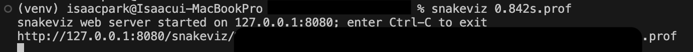

Title: django cProfile 프로파일 방법
Date: 2024-04-19 11:20
Modified: 2024-04-22 16:12
Tags: django, profiling, python
Author: 박이삭
Category: backend
Summary: django cProfile


## 전언

개발/운영하는 서비스가 느려질 때 혹인 기능변경이 있을 경우 서비스 동작의 상세 내용을 분석 할 때가 있습니다. 느려진 이유를 찾아 개선하거나 기능변경(추가)로 인해 어떤 영향을 끼치는지 분석을 할 수도 있습니다. python은 여러 프로파일링 툴이 있지만 저는 cProfile을 활용 하는 방법에 대해 공유드리고자 합니다.

## cProfile

cProfile은 C extension으로 개발되어 low-overhead 특징있는 프로파일링 라이브러리 & 툴 입니다. 

추가 특징으로는 python level function에는 overhead가 있지만 C level function은 overhead가 없다는 점 입니다. 이 로 인해 결과가 python level 코드가 좀 더 느리게 나올 수 있습니다.

call stack에 대한 function단위로 프로파일링 정보를 제공합니다.

```python
214 function calls (207 primitive calls) in 0.002 seconds

Ordered by: cumulative time

ncalls  tottime  percall  cumtime  percall filename:lineno(function)
     1    0.000    0.000    0.002    0.002 {built-in method builtins.exec}
     1    0.000    0.000    0.001    0.001 <string>:1(<module>)
     1    0.000    0.000    0.001    0.001 __init__.py:250(compile)
     1    0.000    0.000    0.001    0.001 __init__.py:289(_compile)
     1    0.000    0.000    0.000    0.000 _compiler.py:759(compile)
     1    0.000    0.000    0.000    0.000 _parser.py:937(parse)
     1    0.000    0.000    0.000    0.000 _compiler.py:598(_code)
     1    0.000    0.000    0.000    0.000 _parser.py:435(_parse_sub)
```

- ncalls: number of calls. 호출 개수
- tottime: total time. 함수에서만 소요된 총시간. subfunction 소요시간 제외한 순수 함수 내에서만 시간.
- percall: tottime / ncalls. 호출당 소요시간
- cumtime: cummulative time. subfunction 포함 전체 소요시간.
- percall: cumtime / ncalls
- filename:lineno(function): 함수 파일명, 라인수, 함수명

## CLI 사용법

```python
$ python -m cProfile [-o output_file] [-s sort_order] (-m module | myscript.py)
```

- `-o` : stdout이 아닌 덤프파일로 저장됩니다.
- `-s` : -o 사용 안할 시 적용가능, stdout출력 시 정렬방식입니다. Ref: [sort_stats()](https://docs.python.org/3/library/profile.html#pstats.Stats.sort_stats)
- `-m` : 스크립트 말고 모듈을 실행 원할 때 사용.
ex) `python -m cProfile -m pip install django` : pip install 프로파일

**예시:**

```python
$ python -m cProfile -o out.prof manage.py runserver 0.0.0.0:8000
```

```python
$ python -m cProfile -o out.prof test_script.py <args1> <args2>
```

## script over django

서버로 테스트가 가능하지만, 반복이 가능하고 시작과 종료가 동일한 재현 가능한 스크립트로 분석이 필요 할 경우가 있습니다.

django의 기능(ORM, etc.)을 활용하는 파이썬 스크립트를 프로파일링 하는 방법입니다.

django-extension의 RunScript 기능을 활용할 것입니다.

django extension RunScript는 django를 사용하는 python script를 간편하게 개발 실행을 도와주는 툴입니다.

```python
memo_care_backend/
├── manage.py
├── ...
└── scripts/
    └── profile_script.py
```

위 처럼 기본 디렉토리는 `<root_project>/scripts` 입니다. 이 위치에 파이썬 코드를 위치 시 아래처럼 실행이 가능합니다.

```python
# memo_care_backend/scripts/test_script.py

from django.conf import settings

def run(*args):
		# django extension이 run함수를 entry point로 잡습니다.
		print(f"[*] DATABASES settings: {settings.DATABASES}, args1: {args[0]}")
```

```bash
$ python -m cProfile -o out.prof manage.py runscript test_script --script-args foo

[*] Current Secret ID: [******-secret-env]
[*] Current ENV file: [.env.isaacpark]
[*] AWS ENV: dev | IAM: isaac@*****.com

[*] DATABASES settings: {'default': {'NAME': '*********', 'USER': 'user', 'PASSWORD': '*******', 'HOST': 'localhost', 'PORT': 3307, 'ENGINE': 'django.db.backends.mysql', 'CHARSET': 'utf8mb4', 'OPTIONS': {'read_default_file': '/Users/isaacpark/git/backend/******/my.cnf'}, 'ATOMIC_REQUESTS': False, 'AUTOCOMMIT': True, 'CONN_MAX_AGE': 0, 'TIME_ZONE': None, 'TEST': {'CHARSET': None, 'COLLATION': None, 'MIGRATE': True, 'MIRROR': None, 'NAME': None}}}, args1: foo
```

다른 위치에 파일을 스크립트로 사용 시 `—-chdir` 를 사용합니다.

```bash
$ python -m cProfile -o out.prof manage.py runscript --chdir <other_dir> <script_name>
```

## 덤프파일 분석 툴

cProfile 덤프파일을 분석목적 사각화 툴은 많이 있습니다. 저는 제가 사용해보고 결정하게 된 `snakeviz`를 소개드리려고 합니다.

**Official site**: [https://jiffyclub.github.io/snakeviz/](https://jiffyclub.github.io/snakeviz/)

```python
$ python -m pip install snakeviz
```

```python
$ snakeviz program.prof
```

실행 시 자동 브라우저로 redirection이 됩니다.



**Snakeviz 화면**:

가장 아래 function 검색할 수 있습니다.

왼쪽에는 stack depth나 UI stype, gutoff 기능이 있습니다.

depth는 UI로 stack depth를 표시할 수치입니다.

cutoff는 parent function의 cumtime을 적게 사용 시 UI서 보이지 않게 하는 기능입니다.


