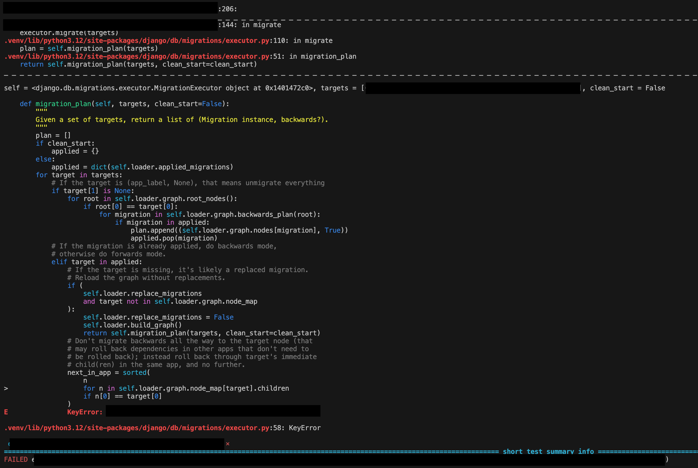

Title: django migration unittest 및 트러블슈팅
Date: 2025-04-03 16:47
Modified: 2025-04-04 07:17
Tags: backend, database, django, migration, unittest, pytest, pytest-django
Author: 박이삭
Category: backend
Summary: migration using pytest


## Introduction

스키마(schema) 및 데이터(data) 마이그레이션은 안정적인 서비스 운영을 위한 필수 요소이다. 마이그레이션 스크립트가 안정적으로 동작하는지 검증하기 위해서는 테스트 코드 작성이 반드시 필요하다. 마이그레이션 스크립트의 테스트 코드 작성을 통해 다음과 같은 장점을 얻을 수 있다.

1. **버그 사전 발견**
    - 다양한 테스트 케이스를 미리 고민하여 테스트 코드를 작성할 경우, 실제 라이브 서비스에서만 발견될 수 있는 잠재적인 버그들을 사전에 발견하고 수정할 수 있다.
2. **재현성 확보 및 외부 종속성 관리**
    - 마이그레이션 스크립트가 외부 함수나 라이브러리에 의존하는 경우, 해당 함수나 라이브러리의 변경으로 인해 발생할 수 있는 이슈를 미리 테스트를 통해 발견할 수 있다.
    - 라이브 서버에서는 마이그레이션 스크립트가 정상적으로 배포된 이후 다시 실행될 일이 없지만, 개발 과정에서 스크립트 수정이나 추가적인 커밋과 같은 형상 변경이 발생하면, 배포 전에 매번 테스트를 수행해야 하는 불편함이 있다. 또한, 다른환경 및 라이브 환경 간 형상 차이가 커질수록 배포 과정에서의 이슈 발생 가능성이 증가한다.

## pytest-django

[pytest-django documentation](https://pytest-django.readthedocs.io/en/stable/index.html)

본 문서는 django와 pytest로 작업한다는 가정으로 작성됐다.

### 시나리오

기존 `Person` 모델에 있던 `email` 필드를 별도의 새로운 모델인 `Profile`로 분리하고, 데이터를 이전하는 작업을 진행합니다.

### 초기 모델 (`0001_initial.py`)

```python
from django.db import migrations, models

class Migration(migrations.Migration):
    initial = True
    dependencies = []
    operations = [
        migrations.CreateModel(
            name='Person',
            fields=[
                ('id', models.AutoField(primary_key=True)),
                ('name', models.CharField(max_length=100)),
                ('age', models.IntegerField(default=0)),
                ('email', models.EmailField(max_length=254)),
            ],
        ),
    ]

```

### 새 모델 생성  (`0002_add_profile_model.py`)

```python
from django.db import migrations, models

class Migration(migrations.Migration):

    dependencies = [
        ('person', '0001_initial'),
    ]

    operations = [
        migrations.CreateModel(
            name='Profile',
            fields=[
                ('id', models.AutoField(primary_key=True)),
                ('email', models.EmailField(max_length=254)),
                ('person', models.OneToOneField(on_delete=models.CASCADE, to='your_app.Person')),
            ],
        )
    ]

```

### 데이터 마이그레이션 (`0003_data_migration`.py)

```python
from django.db import migrations, models

def forward_migrate_email(apps, schema_editor):
    Person = apps.get_model('person', 'Person')
    Profile = apps.get_model('person', 'Profile')

    for person in Person.objects.all():
        Profile.objects.create(person=person, email=person.email)

def backward_migrate_email(apps, schema_editor):
    Person = apps.get_model('person', 'Person')
    Profile = apps.get_model('person', 'Profile')

    for profile in Profile.objects.all():
        person = profile.person
        person.email = profile.email
        person.save()

class Migration(migrations.Migration):

    dependencies = [
        ('person', '0002_add_profile_model'),
    ]

    operations = [
        migrations.RunPython(forward_migrate_email, backward_migrate_email),
    ]

```

### 마이그레이션 테스트 코드 (Pytest 사용)

마이그레이션 테스트는 필수적이며, 데이터 손실 없이 안전하게 이전되었는지 확인할 수 있습니다.

```python
import pytest
from django.db import connection
from person.utils import migrate, load_class

@pytest.mark.django_db
def test_profile_migration():
    app_name = 'person'

    # rollback
    migrate(connection, app_name, '0002_remove_person_email_profile')

    PersonOld = load_class(connection, app_name, '0002_remove_person_email_profile', app_name, 'Person')

    # 초기 데이터 생성
    PersonOld.objects.create(name='Alice', age=28, email='alice@example.com')

    # 마이그레이션 실행
    migrate(connection, app_name, '0003_data_migration')

    # 마이그레이션 후 데이터 확인
    ProfileNew = load_class(connection, app_name, '0003_data_migration', app_name, 'Profile')

    # 데이터 이전 확인
    alice_profile = ProfileNew.objects.get(person__name='Alice')
    assert alice_profile.email == 'alice@example.com'

@pytest.mark.django_db
def test_profile_rollback():
    app_name = 'person'

    # 롤백 테스트
    PersonNew = load_class(connection, app_name, '0003_data_migration', app_name, 'Person')
    ProfileNew = load_class(connection, app_name, '0003_data_migration', app_name, 'Profile')

    # 초기 데이터 생성
    person = PersonNew.objects.create(name='Alice', age=28)
    ProfileNew.objects.create(person_id=person.id, email='alice@example.com')

    assert person.email == ''

    # 롤백 후 데이터 확인
    migrate(connection, app_name, '0002_remove_person_email_profile')

    # 데이터 확인
    PersonOld = load_class(connection, app_name, '0002_remove_person_email_profile', app_name, 'Person')
    person = PersonOld.objects.get(name='Alice')
    assert person.email == 'alice@example.com'

```

person/utils.py

```python

from django.db.migrations.executor import MigrationExecutor
from django.db.models import Model

def load_class(connection, app_name, migration_name, model_app_name, model_name) -> Model:
    """
    Params:
      - app_name: ex. proposal, account, ...
      - migration_name: ex: 0096_remove_assessmentversion_after_commission_price_and_more
      - model_app_name: like app_name
      - model_name: Model class name. ex: Assessment, Order
    """
    executor = MigrationExecutor(connection)
    old_state = executor.loader.project_state((app_name, migration_name))

    # Load the old version of the model dynamically
    return old_state.apps.get_model(model_app_name, model_name)

def migrate(connection, app_name=None, migration_name=None):
    """
    Params:
        - app_name: ex. proposal, account, ...
        - migration_name: ex: 0096_remove_assessmentversion_after_commission_price_and_more
    """
    executor = MigrationExecutor(connection)

    if app_name is None and migration_name is None:
        # Migrate to the latest version
        targets = executor.loader.graph.leaf_nodes()
    else:
        targets = [(app_name, migration_name)]

    executor.migrate(targets)

```

### pytest 설정 (pytest.ini)

```ini
[pytest]
DJANGO_SETTINGS_MODULE=test_project.settings
addopts = --reuse-db --disable-warnings --nomigrations
python_files = test*.py
python_functions = test*

```

Django 마이그레이션을 이용하면 모델의 구조가 변경될 때 데이터의 안전한 이전 및 복구가 가능합니다. Pytest를 활용한 마이그레이션 테스트는 이 과정에서 필수적으로 데이터 무결성을 보장합니다.

## Troubleshooting

위 테스트 코드는 잘 동작할 것 같지만, 아래와 같은 에러를 발생한다.

`MigrationExecutor` 내



`MigrationExecutor`의 `self.loader.graph.node_map`이 빈 값이라 발생하는 에러

`node_map`은 `MigrationLoader`에서 `load_disk`함수에서 빌드가 되고있음

(MigrationLoader class 내)


그 중 `migrations_module`함수내에서 `settings.MIGRATION_MODULES` 설정이 값이 있는거 처럼 보이지만 `None`을 반환하면서 발생하는 이슈로 보임


`settings.MIGRATION_MODULES`를 확인 시 `pytest_django`의 fixture로 mocking되있음을 알 수 있음


`pytest_django`에서 `settings.MIGRATION_MODULES`를 mocking하는 코드:


[pytest-django fixtures source code (GitHub)](https://github.com/pytest-dev/pytest-django/blob/main/pytest_django/fixtures.py#L340)

이는 `django_db_use_migrations`가 True가 아닐 시 적용하는 설정


이는 `—-no-migrations`을 사용 시 발생함


[Disabling migrations with pytest-django](https://pytest-django.readthedocs.io/en/stable/database.html#disable-migrations)

테스트 시 `pytest.ini` 의 설정값, `—-nomigrations` 사용 확인


## Alternatively

로컬에서 테스트 시 매번 `—-migrations` 옵션을 사용하기 힘들기에 대체 방안을 찾았다

```python
...
from django.test.utils import override_settings
...

@pytest.mark.django_db
@override_settings(MIGRATION_MODULES={})
def test_profile_rollback():
    app_name = 'person'

    # 롤백 테스트
    PersonNew = load_class(connection, app_name, '0002_remove_person_email_profile', app_name, 'Person')
    ProfileNew = load_class(connection, app_name, '0002_remove_person_email_profile', app_name, 'Profile')

    # 초기 데이터 생성
    person = PersonNew.objects.create(name='Alice', age=28)
    ProfileNew.objects.create(person_id=person.id, email='alice@example.com')

    assert person.email == ''

    # 롤백 후 데이터 확인
    migrate(connection, app_name, '0001_initial')

    # 데이터 확인
    PersonOld = load_class(connection, app_name, '0001_initial', app_name, 'Person')
    person = PersonOld.objects.get(name='Alice')
    assert person.email == 'alice@example.com'

```

`pytest_django`가 `settings.MIGRATION_MODULES`를 mocking하는 부분을 활용한 방법이다.

mocking을 기본값으로 돌릴 시 기존 방법으로 동작한다.

## Troubleshooting 2

### 새 모델 생성  (`0002_add_profile_model.py`)

```python
# Generated by Django 5.2 on 2025-04-03 09:04

import django.db.models.deletion
from django.db import migrations, models

def forward_migrate_email(apps, schema_editor):
    Person = apps.get_model('person', 'Person')
    Profile = apps.get_model('person', 'Profile')

    for person in Person.objects.all():
        Profile.objects.create(person=person, email=person.email)

def backward_migrate_email(apps, schema_editor):
    Profile = apps.get_model('person', 'Profile')

    for profile in Profile.objects.all():
        person = profile.person
        person.email = profile.email
        person.save()

    Profile.objects.all().delete()

class Migration(migrations.Migration):

    dependencies = [
        ('person', '0001_initial'),
    ]

    operations = [
        migrations.CreateModel(
            name='Profile',
            fields=[
                ('id', models.AutoField(primary_key=True, serialize=False)),
                ('email', models.EmailField(max_length=254)),
                ('person', models.ForeignKey(default=None, null=True, on_delete=django.db.models.deletion.CASCADE, to='person.person')),
            ],
        ),
        migrations.RunPython(forward_migrate_email, backward_migrate_email)
    ]

```

아래와 같은 경우 혹은 RunPython 뒤 추가 schema migration이 있는 경우 pytest_django는 테스트 케이스 실행 전 migration 한 DDL을 rollback하려고 한다.

그로 인해 아래와 같은 에러가 발생 한다.


**에러 메시지:**

**django.db.transaction.TransactionManagementError: Executing DDL statements while in a transaction on databases that can't perform a rollback is prohibited.**

MySQL은 DDL rollback을 지원하지 않음

[MySQL rollback limitations](https://dev.mysql.com/doc/refman/8.0/en/cannot-roll-back.html)

### 해결방안

django_db(transaction=True)사용 시 자동 rollback되는 transaction이 아니라 main transaction을 사용하여 transaction 관련 테스트를 할 수 있다. 다만 rollback을 수동으로 관리해야 한다는 이슈가 있다(schema, data 모두)

```python
import pytest
from django.db import connection
from person.utils import migrate, load_class
from django.test.utils import override_settings

# migration teardown
@pytest.fixture(autouse=True)
def migration_teardown():
    # Ensure that the database is rolled back after each test
    yield
    migrate(connection)

@pytest.mark.django_db(transaction=True)
@override_settings(MIGRATION_MODULES={})
def test_profile_migration(migration_teardown):
    app_name = 'person'

    # rollback
    migrate(connection, app_name, '0001_initial')

    PersonOld = load_class(connection, app_name, '0001_initial', app_name, 'Person')

    # 초기 데이터 생성
    PersonOld.objects.create(name='Alice', age=28, email='alice@example.com')

    # 마이그레이션 실행
    migrate(connection, app_name, '0002_remove_person_email_profile')

    # 마이그레이션 후 데이터 확인
    ProfileNew = load_class(connection, app_name, '0002_remove_person_email_profile', app_name, 'Profile')

    # 데이터 이전 확인
    alice_profile = ProfileNew.objects.get(person__name='Alice')
    assert alice_profile.email == 'alice@example.com'

    # 테스트 데이터 정리
    alice_profile.person.delete()
    alice_profile.delete()

@pytest.mark.django_db(transaction=True)
@override_settings(MIGRATION_MODULES={})
def test_profile_rollback(migration_teardown):
    app_name = 'person'

    # 롤백 테스트
    PersonNew = load_class(connection, app_name, '0002_remove_person_email_profile', app_name, 'Person')
    ProfileNew = load_class(connection, app_name, '0002_remove_person_email_profile', app_name, 'Profile')

    # 초기 데이터 생성
    person = PersonNew.objects.create(name='Alice', age=28)
    ProfileNew.objects.create(person_id=person.id, email='alice@example.com')

    assert person.email == ''

    # 롤백 후 데이터 확인
    migrate(connection, app_name, '0001_initial')

    # 데이터 확인
    PersonOld = load_class(connection, app_name, '0001_initial', app_name, 'Person')
    person = PersonOld.objects.get(name='Alice')
    assert person.email == 'alice@example.com'

    # 테스트 데이터 정리
    migrate(connection)
    PersonNew.objects.get(name='Alice').delete()

```

[Testing transactions with pytest-django](https://pytest-django.readthedocs.io/en/latest/database.html#testing-transactions)

[pytest-django helper markers](https://pytest-django.readthedocs.io/en/latest/helpers.html#pytest.mark.django_db)
