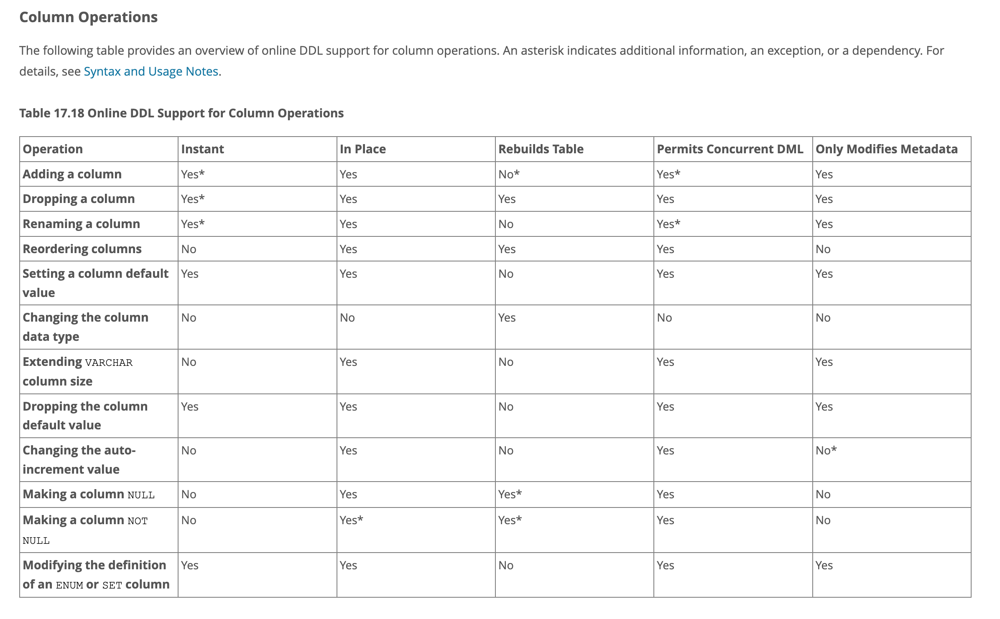

Title: mysql 8.0 무중단 migration 방법
Date: 2024-07-22 18:55
Modified: 2024-09-23 15:46
Tags: backend, database, django, migration
Author: 박이삭
Category: database
Summary: non-stop mysql 8.0 schema migration


## 배경

배포에서 디비 마이그레이션이 있을 때, 서비스에 장애발생 여부를 확인 하기 어려워 중단배포를 하는 경우가 있습니다.

migration 시 일부 table lock이 발생하여 쿼리와 insert / update / delete 등 DML이 동작하지 않는 경우 서비스의 장애를 방생할 수 있습니다.

다만 최신 RDBMS는 무중단 migration 기술을 지원합니다.

실 서비스 중인 케어의 mysql 8.0을 기준으로 무중단 migration 기술소개와 동작원리, 중단, 무중단 마이그레이션 구분 방법 및 검증테스트 등 을 소개해드리려고 합니다.

## 배경기술

### SQL

`DDL(Data Definition Language)`는 디비의 스키마를 정의, 수정, 삭제 등 관리 가능한 sql입니다. Table관련으로 `CREATE`, `ALTER`, `DROP`, `TRUNCATE` 등이 있습니다.

`DML(Data Manipulation Language)`는 디비의 table 내 개별 혹은 여러 row를 조회, 추가, 수정, 삭제 등 관리 가능한 sql입니다. `SELECT`, `INSERT`, `UPDATE`, `DELETE` 등이 있습니다.

DCL, TCL은 이번 범위가 아니여 넘어가겠습니다.

### Table-Copy algorithm

이전 mysql 버전은 모든 DDL 동작에 table-copy algorithm을 사용했습니다. 이는 전체 table lock이 포함되며 table 데이터 크기에 따라 필요 시 수 시간의 시간이 소요 됩니다.

기본 원리는 전체 DML을 막도록 table lock을 걸고 데이터를 새로운 테이블에 복사하여 DDL을 적용합니다. 그 후 새로운 테이블 데이터를 기존 테이블에 복사하게 됩니다.

이 케이스가 중단배포의 가장 큰 원인이고 이를 줄이거나 없이 할 수 있다면 무중단 배포가 가능합니다.

### Online DDL

mysql 8.0 InnoDB storage engine에서는 Online DDL이라는 기술을 지원합니다.

Online DDL이란 `instance`, `in-place` 테이블 변경이 가능하고 `Concurrent DML`을 지원합니다.

https://dev.mysql.com/doc/refman/8.0/en/innodb-online-ddl.html

위 공식 문서의 online DDL에 대한 특징을 설명한 문구입니다.

- 테이블을 몇 분 또는 몇 시간 동안 사용할 수 없게 만드는 것이 실용적이지 않은 바쁜 생산 환경에서의 개선된 응답성과 가용성.
- 실시간(in-place) 작업의 경우, LOCK 절을 사용하여 DDL 작업 중 성능과 동시성 사이의 균형을 조정할 수 있는 능력. 자세한 내용은 LOCK 절을 참조하십시오.
- copy-table 방법보다 적은 디스크 공간 사용 및 I/O 오버헤드.

### DDL Algorithm

`instance:`

instance DDL algorithm은 meta데이터만 변경합니다. 일부 SQL 혹은 조건이 맞는 경우에만 사용 가능합니다.

실제 데이터를 건들지 않기때문에 말 그대로 “바로” DDL을 실행 할 수 있습니다.

가능한 SQL과 조건은 아래에 자세한 설명으로 확인 하실 수 있습니다.

`in-place:`

in-place DDL algorithm이란 table copy 없이 최소한의 lock을 활용해 기존 구조를 유지하며 데이터를 수정하는 방법입니다.

LOCK=NONE 시 (아래 참고) concurrent DML을 지원하게 되는데, 필요한 데이터만(one row, meta data) lock을 사용합니다. DML이 종료 시 lock을 풀어주는 방식을 사용합니다.

`copy:`

이전 설명 한 table-copy algorithm 입니다.

### in-place DDL Lock

LOCK은 `in-place`으로 수행되는 작업에 사용될 수 있으며, 작업 중 테이블에 대한 동시 접근 정도를 미세 조정하는 데 유용합니다. 

`instance` 수행되는 작업에는 LOCK=DEFAULT만 지원됩니다. ALGORITHM 절은 주로 성능 비교를 위해 사용되며, 문제가 발생할 경우 기존의 테이블 복사 방법으로 돌아가기 위한 대안으로 사용됩니다. 예를 들어:

실시간 ALTER TABLE 작업 중에 테이블을 읽기, 쓰기 또는 둘 다 사용할 수 없게 만드는 실수를 피하려면 ALTER TABLE 문에 **LOCK=NONE(읽기 및 쓰기 허용)** 또는 LOCK=SHARED(읽기 허용)와 같은 절을 지정하십시오. 
요청된 수준의 동시성이 사용 불가능한 경우 작업은 즉시 중단됩니다.

### 목표

무중단 배포, lock free DDL을 실행하기 위하여 아래의 조건을 만족시켜야 됩니다.

- instance DDL algorithm 사용
- in-place DDL algorithm && LOCK=NONE 사용

## 확인방법

일반적으로 온라인 DDL을 활성화하기 위해 특별한 조치를 취할 필요는 없습니다. 기본적으로 MySQL은 가능한 최소한의 `LOCK`으로 `instance`이거나 `in-place`으로 작업을 수행합니다.

DDL 작업의 측면을 제어하려면 ALTER TABLE 문에서 ALGORITHM 및 LOCK 절을 사용할 수 있습니다. 이 절들은 테이블 및 열 지정에서 쉼표로 구분하여 문장의 끝에 배치됩니다. 예를 들어:

```sql
ALTER TABLE tbl_name ADD PRIMARY KEY (column), ALGORITHM=INPLACE, LOCK=NONE;
```

**서비스 영향을 최소화하면서 가능한 알고리즘을 확인해 보는 방법:**

1. ALGORITHM=INSTANT 옵션으로 스키마 변경을 시도
2. 실패하면 ALGORITHM=INPLACE, LOCK=NONE 옵션으로 스키마 변경을 시도
3. 실패하면 ALGORITHM=INPLACE, LOCK=SHARED 옵션으로 스키마 변경을 시도
4. 실패하면 ALGORITHM=COPY, LOCK=SHARED 옵션으로 스키마 변경을 시도
5. 실패하면 ALGORITHM=COPY, LOCK=EXCLUSIVE 옵션으로 스키마 변경을 시도

**>> 1, 2번으로 되지 않는다면 DML을 멈춘 다음 스키마 변경을 해야 하는 작업임.**

[[blog.bespinglobal.com/post/mysql-online-ddl-별-적용-가능한-알고리즘-8-0-이상]](https://blog.bespinglobal.com/post/mysql-online-ddl-%EB%B3%84-%EC%A0%81%EC%9A%A9-%EA%B0%80%EB%8A%A5%ED%95%9C-%EC%95%8C%EA%B3%A0%EB%A6%AC%EC%A6%98-8-0-%EC%9D%B4%EC%83%81/)

**아래 링크에서 정리 된 table로 확인 할 수 도 있습니다:**

https://dev.mysql.com/doc/refman/8.0/en/innodb-online-ddl-operations.html



예시로 **adding column DDL**은 최악으로 `in-place`, `lock=NONE(permits concurrent DML)`인 것을 확인 할 수 있습니다.

주의할 점은 adding column DDL의 rebuilds table 예외는 아래와 같습니다.

- **Changing the Data Type**: If the column addition involves a data type change that affects the physical storage format.
- **Column Position**: If the column is added at a specific position other than the end, especially in older versions before MySQL 8.0.29.
- **Row Format**: If the table uses `ROW_FORMAT=COMPRESSED`.
- **Space Limitations**: If the addition exceeds the maximum row size limits.

가장 처음의 table physical storage format들은 아래와 같습니다.

- **Compact**: Stores data compactly, minimizing storage usage.
- **Redundant**: Legacy format, uses more storage.
- **Dynamic**: Stores variable-length columns efficiently.
- **Compressed**: Compresses data for storage efficiency.

## django단 확인

`sqlmigration` 장고커멘드로 마이그레이션 시 실행되는 SQL을 확인 할 수 있습니다.

```bash
(venv) isaacpark@Isaacui-MacBookPro memo-service-backend % ./manage.py sqlmigrate ecg 0059
Invalid line: LOG_LEVEL = DEBUG

[*] Current Secret ID: [********-env]
[*] Current ENV file: [.env.isaacpark]
[*] AWS ENV: prod | IAM: isaac.park+prod@*****.com

--
-- Alter field cloud_status on ecgtest
--
ALTER TABLE `******` MODIFY `*****` integer NOT NULL;
```

## 검증 테스트

mysq 8.0.32(prod 버전) docker compose 실행

```yaml
# Docker compose file of mysql 8.0.32
version: '3.8'
services:
  mysql:
    image: mysql:8.0.32
    ports:
      - 3306:3306
    environment:
      - MYSQL_ROOT_PASSWORD=secret
      - MYSQL_DATABASE=mydb
      - MYSQL_USER=myuser
      - MYSQL_PASSWORD=mypassword
```

기본 table 생성

```sql
-- create a table named TEST, with column A, B, C all int dafault 0
-- on database mydb
USE mydb;
CREATE TABLE TEST (
    id INT PRIMARY KEY AUTO_INCREMENT,
    A INT DEFAULT 0,
    B INT DEFAULT 0,
    C INT DEFAULT 0
);
```

테스트 데이터 추가

```bash
#!/bin/bash

# Insert 200,000 rows into the TEST table
for n in {1..200000}; do 
    printf "INSERT INTO TEST (A, B, C) VALUES (%d, %d, %d);\n" $n $n $n; 
done | mysql -h 127.0.0.1 -P 3306 -u root -p --init-command="USE mydb; SET sql_log_bin=off; SET GLOBAL innodb_flush_log_at_trx_commit=0;"
```

DML 테스트 코드

```python
import mysql.connector
import random
import threading
import time

# Database configuration
config = {
    'user': 'root',
    'password': 'secret',
    'host': '127.0.0.1',
    'database': 'mydb',
}

# Function to perform random DML operations
def perform_dml_operations():
    conn = mysql.connector.connect(**config)
    cursor = conn.cursor()
    while True:
        try:
            operation = random.choice(['insert', 'update'])
            if operation == 'insert':
                cursor.execute("INSERT INTO TEST (A, B, C, D, E) VALUES (%s, %s, %s, %s, %s)", 
                               (random.randint(1, 100), random.randint(1, 100), random.randint(1, 100), random.randint(1, 100), random.randint(1, 100)))
            elif operation == 'update':
                cursor.execute("UPDATE TEST SET A = %s, B = %s, C = %s, D = %s, E = %s WHERE id = %s", 
                            (random.randint(1, 100), random.randint(1, 100), random.randint(1, 100), random.randint(1, 100), random.randint(1, 100), random.randint(1, 800_000)))
            conn.commit()
            print(f'{operation} operation completed')
        except Exception as e:
            print(f'Error: {e}')
        time.sleep(0.1)
    cursor.close()
    conn.close()

# Function to perform the DDL operation
def perform_ddl_operation():
    conn = mysql.connector.connect(**config)
    cursor = conn.cursor()
    cursor.execute("ALTER TABLE TEST ADD COLUMN D INT DEFAULT 0, ALGORITHM=INPLACE, LOCK=NONE")
    conn.commit()
    cursor.close()
    conn.close()

# Create threads for DML operations
dml_threads = []
for _ in range(5):  # Number of concurrent DML threads
    thread = threading.Thread(target=perform_dml_operations)
    thread.start()
    dml_threads.append(thread)

# Perform the DDL operation
perform_ddl_operation()

# Wait for DML threads to complete (optional)
for thread in dml_threads:
    thread.join()

```

테스트 데이터 개수


DDL 실행 시 소요시간


DDL 실행 시 DML 스크립트 로그:


## 한계 및 대안

https://medium.com/daangn/mysql-online-ddl-faf47439084c 블로그에서 언급한 것 과 같이 간단한 DDL은 online DDL로 가능하지만, foreign key, index, primary key 등 변경이 큰 DDL같은 경우 불가능 한 경우가 있습니다. 이런 경우 `pt-online-schema-change`란 percona사의 마이그레이션 툴을 사용방법이 있습니다.

`pt-online-schema-change`는 MySQL 테이블에 비차단 방식으로 스키마 변경을 적용하는 Percona Toolkit의 도구입니다. 이 도구는 원하는 변경 사항이 포함된 새 테이블을 생성하고, 데이터를 원본 테이블에서 새 테이블로 청크 단위로 복사한 후 테이블을 교체합니다. 동적 청크 크기 조정을 지원하여 서버 성능에 미치는 영향을 최소화하고, 동시 접근 및 부하를 관리하는 옵션을 포함합니다. 이를 통해 다운타임을 줄이고 스키마 수정 동안 데이터 무결성을 유지합니다.

## Reference

- https://dev.mysql.com/doc/refman/8.0/en/innodb-online-ddl-operations.html
- https://dev.mysql.com/doc/refman/8.0/en/innodb-online-ddl.html
- https://medium.com/daangn/mysql-online-ddl-faf47439084c
- https://medium.com/practo-engineering/mysql-zero-downtime-schema-update-without-algorithm-inplace-fd427ec5b681
- https://blog.bespinglobal.com/post/mysql-online-ddl-별-적용-가능한-알고리즘-8-0-이상/