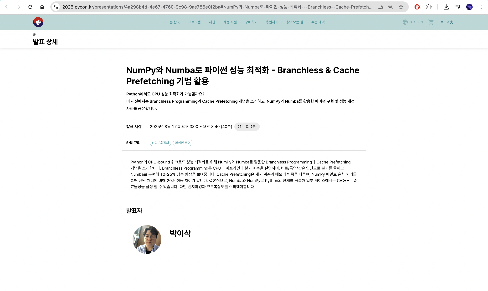

Title: PyCon Korea 2025 발표
Date: 2025-08-22 09:06
Modified:  2025-08-22 09:06
Tags: python, optimization, cpu pipeline, cache, jit
Author: 박이삭
Category: python
Summary: PyCon Korea 2025 발표

---

좋은 기회가 있어 이번 PyCon Korea 2025에서 발표를 할 수 있게 되었습니다.  
블로그에서 이전에 소개한 브랜치리스 프로그래밍(branchless programming)과 캐시 프리페칭(cache prefetching)에 대해 Python 최적화 응용법을 포함해서 발표하였습니다.  
처음 공개된 세션에서 발표를 하게 되어 많이 긴장했습니다. 너무 발표 노트만 딱딱하게 읽은 것 같아, 조금 더 외우고 했으면 더 좋지 않았을까 싶은 생각이 계속 들더라고요.  
내년에 또 기회가 된다면 더 발전해서 더 좋은 주제로 할 수 있으면 좋겠습니다.  
좋은 기회를 주시고 행사 준비까지 고생 많으셨던 PyCon Korea 준비위원회 분들께 다시 한 번 감사의 말씀을 드립니다.  

아래 발표 때 썼던 슬라이드와 발표 노트를 같이 공유해드립니다.  

<iframe src="../files/[PyCon%20Korea%202025]%20Branchless%20Programming%20&%20Cache%20Prefetching%20in%20Python.pdf" width="100%" height="600px"></iframe>
