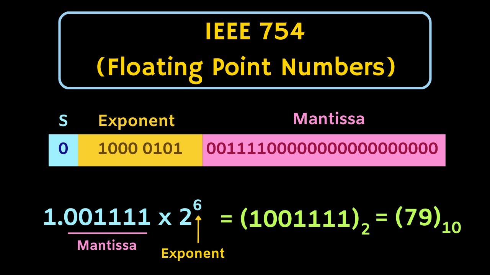

Title: 부동소수점(float) 정밀도와 Decimal/Bigint가 필요한 이유
Date: 2025-05-19 13:32
Modified: 2025-05-19 14:24
Tags: data structure
Author: 박이삭
Category: data
Summary: floating point and bigint, decimal


서비스를 운영하거나 시스템을 설계하다 보면 수치 계산에서 미묘한 오차가 발생하는 경험을 하게 됩니다.
예를 들어, Python에서 `0.1 + 0.2`를 출력해 보면 아래와 같은 결과가 나옵니다.

```python
>>> 0.1 + 0.2
0.30000000000000004
```

“이게 뭐지?” 싶은 마음이 드는 건 너무나 자연스럽습니다.

이 글에서는 이런 오차가 발생하는 이유와, 정확한 수치 계산이 필요한 상황에서 **float 대신 BigInt 혹은 Decimal을 써야 하는 이유**에 대해 정리해보려 합니다.

---

## **float란 무엇인가?**

float는 실수를 표현하는 가장 일반적인 데이터 타입입니다.

컴퓨터에서는 float 값을 표현할 때, 대부분 **IEEE 754 표준**을 따릅니다.



> Python의 기본 float 타입은 64비트(double precision) 부동소수점 숫자입니다.
> 

IEEE 754의 64비트 float는 다음과 같이 구성됩니다:

| **구성 요소** | **비트 수** | **설명** |
| --- | --- | --- |
| 부호(S) | 1비트 | 양수/음수 구분 |
| 지수(E) | 11비트 | 스케일 조정 |
| 가수(F) | 52비트 | 실제 수치 정보 |

이 구조의 한계 때문에 **정확히 표현할 수 없는 소수**가 존재하게 됩니다.

대표적인 예가 바로 0.1, 0.2 같은 십진 소수입니다. 이들은 **2진수로 정확하게 표현되지 않기 때문에** 내부적으로 약간의 오차가 발생합니다.

---

## **왜 계산할수록 정밀도가 떨어질까?**

부동소수점 계산은 다음과 같은 이유로 **누적 오차(loss of precision)**가 발생합니다:

- 가수(Fraction)의 비트 수가 고정되어 있음 → 계산 중 일부 자리수는 **버려짐**
- **반올림(Rounding)**이 자동 적용됨
- 사칙 연산의 순서에 따라 결과가 달라질 수 있음 (부동소수점은 **비결합성**이 있음)

### **예시 1: 반복 덧셈**

```python
total = 0.0
for _ in range(1000000):
    total += 1e-10

print(total)
# 기대값: 0.1
# 출력값: 0.09999999999994...
```

### **예시 2: 덧셈 순서에 따라 다른 결과**

```python
a = 1e16
b = -1e16
c = 1.0

print((a + b) + c)  # 결과: 1.0
print(a + (b + c))  # 결과: 0.0
```

이런 결과는 정수형이나 Decimal로는 일어나지 않습니다.

---

## **그렇다면 정밀한 계산이 필요한 경우엔?**

**정확한 수치 계산**이 필요한 경우, float가 아닌 아래와 같은 방식의 대안이 필요합니다:

- Decimal: 고정 소수점. 반올림 오차가 없음
- BigInt (혹은 arbitrary-precision int): 자릿수 제한 없이 정수 연산 가능

### **Decimal 예시 (Python)**

```python
from decimal import Decimal, getcontext

getcontext().prec = 30  # 정밀도 설정

a = Decimal("0.1")
b = Decimal("0.2")
print(a + b)  # 정확하게 0.3 출력
```

### **BigInt 예시 (Python)**

```python
a = 10**100
b = 10**100
print(a + b)
# 출력: 200000000000000000000...000 (총 101자리 수)
```

---

## Decimal과 BigInt는 어떻게 구현되어 있을까?

단순히 "정밀하다"는 말만으로는 부족합니다.
그렇다면 내부적으로 어떻게 float과 다르게 동작하는 걸까요?

### 🔢 Decimal의 내부 구현

Python의 `decimal.Decimal` 타입은 **문자열 기반의 고정 소수점(decimal fixed-point)** 연산을 수행합니다.

- 내부적으로 숫자를 문자열 혹은 정수 배열로 분리해서 보관
- `context`를 통해 정밀도(precision), 반올림 방식(rounding), 오버플로우 정책 등을 지정 가능
- 실수(float) 연산이 아닌 **정확한 십진수 연산(decimal arithmetic)**

**내부 구조 예시 (개념적 설명)**

```python
Decimal("123.45") -> {
    sign: 0,
    digits: (1, 2, 3, 4, 5),
    exponent: -2  # 소수점 위치
}
```

이처럼 float처럼 이진 표현이 아니라 **십진수 그대로** 표현하므로, 0.1과 같은 숫자도 정확히 표현할 수 있습니다.

> Python의 Decimal은 IEEE 754-2008 Decimal128을 일부 참고하며, 자체 구현체(C 코드)와 decimal.py (Python 구현체)를 함께 제공합니다.
> 

### **🔢 BigInt (Arbitrary Precision Integer)**

Python의 int는 **자동으로 BigInt 모드**로 전환됩니다.

정해진 비트 수로 제한된 C언어의 int, long과 달리 Python은 매우 큰 수를 다룰 수 있습니다.

```
a = 2**1024
print(a)  # 수백 자리의 숫자도 문제 없음
```

### **내부 구조 요약**

- 숫자를 고정된 크기의 **“digit 배열”** 로 분할해 저장
- 실제 연산은 자릿수 단위로 처리 (마치 초등학교식 곱셈/덧셈)
- 메모리가 허용하는 한 크기 제한 없이 정수 연산 가능
- Python 내부적으로는 PyLongObject라는 구조체로 구현됨
    - 기본 단위는 C의 uint32_t 혹은 uint30_t (시스템에 따라 다름)
    - 자릿수(digit)를 리스트처럼 연결해 수를 표현

예: 12345678901234567890 은 내부적으로 다음처럼 표현됩니다:

```
# 계산하는 방법
n = 12345678901234567890
base = 2**32

digits = []
while n > 0:
    digits.append(n % base)
    n = n // base

print(digits)  # [3944680146, 2874452364] (32-bit 기준, big-endian)
```

이런 식으로 **자리수 배열을 이어 붙여 수를 구성**하며, 덧셈, 곱셈, 제곱 등은 배열 기반 알고리즘으로 처리됩니다.

### **✍️ 참고로**

- Python의 Decimal은 표준 모듈로 decimal.py에 순수 Python으로 구현된 버전이 있으며, cdecimal이라는 고속 C 구현이 백엔드에서 사용됩니다 (Python 3.3+ 기준 기본 포함).
- Java의 BigInteger, JavaScript의 BigInt, Rust의 num-bigint 등 대부분 언어들도 비슷한 방식으로 **자릿수 기반 연산**을 수행합니다.
- Python int는 내부적으로 자동으로 BigInt로 승격(upgrade)되므로 별도의 BigInt 타입이 없습니다.

이러한 구현 덕분에 Python에서는 float의 한계를 넘는 고정 정밀 계산이 가능하지만,

그만큼 속도는 느리고 메모리 사용량도 크기 때문에 **용도에 따라 신중하게 선택**하는 것이 중요합니다.

---

## **BigInt가 필요한 실제 분야**

| **분야** | **이유** |
| --- | --- |
| 💰 금융/회계 | 0.01 단위까지 오차 없이 계산되어야 함 (소수점 버림 불가) |
| 🔐 암호학 | 수십 자리 이상의 큰 수로 암호 계산 수행 (RSA 등) |
| 🧪 과학/시뮬레이션 | 부동소수점 오차가 결과에 큰 영향을 미칠 수 있음 |
| 📈 데이터 분석 | 금액, 세금, 환율 등에서 오차가 누적되면 큰 문제 발생 |

---

## 실무 사례: 수치 오차로 인한 장애

### 💥 실제 장애 사례: 수수료 계산 오류

한 핀테크 서비스에서 결제 금액에 따라 수수료를 계산할 때, float을 사용해 연산을 수행하고 있었습니다.

```python
fee = amount * 0.015  # 1.5% 수수료
```

정상적으로 보이지만, 특정 금액(예: 899원)에 대해 계산된 값이 13.485000000000001처럼 출력되었고,
이를 round(fee, 2)로 처리했을 때 13.48이 되어 **고객에게 수수료가 덜 부과**되는 현상이 발생했습니다.

이 문제는 Decimal로 다음과 같이 해결했습니다:

```python
from decimal import Decimal, ROUND_HALF_UP

fee = Decimal("899") * Decimal("0.015")
fee = fee.quantize(Decimal("0.01"), rounding=ROUND_HALF_UP)
```

### pandas / numpy에서의 float 주의점

**pandas: float 비교는 .round() 또는 np.isclose()**

```python
import pandas as pd
import numpy as np

df = pd.DataFrame({"value": [0.1 + 0.2, 0.3]})
print(df)

# 비교할 때는 직접 == 하지 말고 다음 중 하나를 사용
df["eq"] = np.isclose(df["value"], 0.3)
```

**numpy: 누적 연산에서 float 오차 고려**

```python
import numpy as np

a = np.ones(10**6) * 1e-10
print(np.sum(a))  # float64로 누적 → 오차 발생
```

NumPy는 dtype=np.float64를 사용하더라도 누적 오차는 피할 수 없습니다.
고정소수점 처리가 필요한 경우 decimal.Decimal로 수동 연산을 해야 합니다.

### Django ORM에서 Decimal 사용하는 법

금액, 수수료 등은 반드시 DecimalField로 정의하고, float 사용은 지양해야 합니다.

```python
from django.db import models

class Transaction(models.Model):
    amount = models.DecimalField(
        max_digits=10,  # 전체 자리수
        decimal_places=2  # 소수점 이하 자리수
    )
```

실제로 float을 사용하면 저장 시점에 오차가 발생할 수 있고,
데이터베이스 간 이관, 단위 테스트, 정산 등에서 일관성 문제가 생깁니다.

---

## **비교 정리**

| **구분** | **float** | **Decimal** | **BigInt** |
| --- | --- | --- | --- |
| 정밀도 | 약 15~17 자리 | 설정 가능 (무제한에 가까움) | 무제한 정수 |
| 속도 | 빠름 | 느림 | 느림 |
| 오차 발생 | 있음 | 없음 | 없음 |
| 주요 사용처 | 일반 연산, 그래픽 | 금융, 세금 | 암호, 정밀 계산 |

---

## **정리하며**

일반적인 웹/서버 개발에서는 float로도 충분할 때가 많습니다.

하지만 다음과 같은 경우엔 **float 사용을 반드시 재검토해야 합니다.**

- 금액 계산을 다룰 때 (특히 복합 계산, 환율 변환 등)
- 반복 연산이 많은 시뮬레이션이나 모델링
- 보안/암호 관련 코드
- 분산 시스템에서 수치 결과의 정합성이 중요한 경우

실제 현업에서도 이로 인한 버그나 사고는 생각보다 자주 발생합니다.

지금 작성하는 코드에서 “정밀도가 정말 중요한가?“를 항상 한 번은 자문해보는 습관을 가지는 것이 좋습니다.